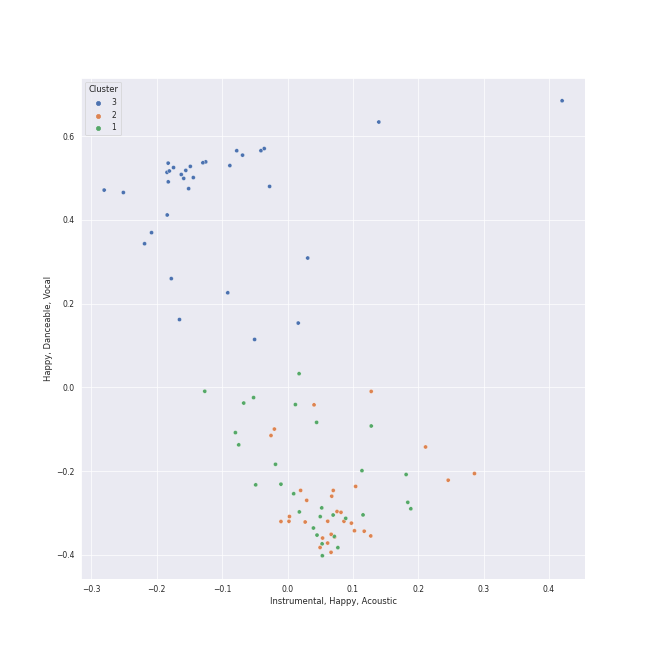

# Clusters in baroque

## Cluster #1

29 tracks

| Art | Track | Album | Artists | Label | Rank | 💚 | 🔗 |
|:---|:---|:---|:---|:---|---:|:---|:---|
|  | Vivaldi: The Four Seasons, Violin Concerto in E Major, Op. 8 No. 1, RV 269 "Spring": III. Allegro | Vivaldi: The Four Seasons. | Antonio Vivaldi, Sarah Chang, Orpheus Chamber Orchestra | [Warner Classics](../../../../labels/warner_classics) | nan | | [🔗](https://open.spotify.com/track/3k6tQABkAsr1Mq7eDRJwk1) |
|  | Brandenburg Concerto No. 2 in F, BWV 1047: 2. Andante | Bach, J.S.: Brandenburg Concertos etc. | [Johann Sebastian Bach](../../../../artists/johann_sebastian_bach/overview.md), English Chamber Orchestra, Benjamin Britten | [Decca Music Group Ltd.](../../../../labels/decca_music_group_ltd_) | nan | | [🔗](https://open.spotify.com/track/4MY5iDvlsITcO9Y3hieoJU) |
|  | Brandenburg Concerto No. 1 in F, BWV 1046: 4. Menuetto: Trio I | Bach, J.S.: Brandenburg Concertos etc. | [Johann Sebastian Bach](../../../../artists/johann_sebastian_bach/overview.md), English Chamber Orchestra, Benjamin Britten | [Decca Music Group Ltd.](../../../../labels/decca_music_group_ltd_) | nan | | [🔗](https://open.spotify.com/track/7C3TyMdnQFiMjCoXclqEMC) |
|  | Cello Suite No. 6 in D Major, BWV 1012: IV. Sarabande | Bach: Unaccompanied Cello Suites (Remastered) | [Johann Sebastian Bach](../../../../artists/johann_sebastian_bach/overview.md), Yo-Yo Ma | [Sony Classical](../../../../labels/sony_classical) | nan | | [🔗](https://open.spotify.com/track/1X0ZNb4aZVPZhBrgWwJBJE) |
|  | Cello Suite No. 5 in C Minor, BWV 1011: IV. Sarabande | Bach: Unaccompanied Cello Suites (Remastered) | [Johann Sebastian Bach](../../../../artists/johann_sebastian_bach/overview.md), Yo-Yo Ma | [Sony Classical](../../../../labels/sony_classical) | nan | | [🔗](https://open.spotify.com/track/3TILjRV9ZYEEfJcF6Re3H4) |
|  | Cello Suite No. 2 in D Minor, BWV 1008: I. Prélude | Bach: Unaccompanied Cello Suites (Remastered) | [Johann Sebastian Bach](../../../../artists/johann_sebastian_bach/overview.md), Yo-Yo Ma | [Sony Classical](../../../../labels/sony_classical) | nan | | [🔗](https://open.spotify.com/track/5BSTDnS8drJLOwpL4Co4K2) |
|  | Cello Suite No. 3 in C Major, BWV 1009: IV. Sarabande | Bach: Unaccompanied Cello Suites (Remastered) | [Johann Sebastian Bach](../../../../artists/johann_sebastian_bach/overview.md), Yo-Yo Ma | [Sony Classical](../../../../labels/sony_classical) | nan | | [🔗](https://open.spotify.com/track/5MvmCcMhBScIqli00VTblQ) |
|  | Cello Suite No. 1 in G Major, BWV 1007: I. Prélude | Bach: Unaccompanied Cello Suites (Remastered) | [Johann Sebastian Bach](../../../../artists/johann_sebastian_bach/overview.md), Yo-Yo Ma | [Sony Classical](../../../../labels/sony_classical) | nan | | [🔗](https://open.spotify.com/track/61dYvvfIRtIDFuqZypPAta) |
|  | Cello Suite No. 5 in C Minor, BWV 1011: I. Prélude | Bach: Unaccompanied Cello Suites (Remastered) | [Johann Sebastian Bach](../../../../artists/johann_sebastian_bach/overview.md), Yo-Yo Ma | [Sony Classical](../../../../labels/sony_classical) | nan | | [🔗](https://open.spotify.com/track/7ekIYM7PEFS47LwMes5Y5g) |
|  | Cello Suite No. 1 in G Major, BWV 1007: IV. Sarabande | Bach: Unaccompanied Cello Suites (Remastered) | [Johann Sebastian Bach](../../../../artists/johann_sebastian_bach/overview.md), Yo-Yo Ma | [Sony Classical](../../../../labels/sony_classical) | nan | | [🔗](https://open.spotify.com/track/7jOJwH4kze92qMREpVI4cr) |
## Cluster #2

30 tracks

| Art | Track | Album | Artists | Label | Rank | 💚 | 🔗 |
|:---|:---|:---|:---|:---|---:|:---|:---|
|  | Brandenburg Concerto No. 1 in F, BWV 1046: 1. (Allegro) | Bach, J.S.: Brandenburg Concertos etc. | [Johann Sebastian Bach](../../../../artists/johann_sebastian_bach/overview.md), English Chamber Orchestra, Benjamin Britten | [Decca Music Group Ltd.](../../../../labels/decca_music_group_ltd_) | nan | | [🔗](https://open.spotify.com/track/0df320Pc1ZK0050luSGVHt) |
|  | Cello Suite No. 6 in D Major, BWV 1012: VI. Gigue | Bach: Unaccompanied Cello Suites (Remastered) | [Johann Sebastian Bach](../../../../artists/johann_sebastian_bach/overview.md), Yo-Yo Ma | [Sony Classical](../../../../labels/sony_classical) | nan | | [🔗](https://open.spotify.com/track/0w9xYEvm1nd4S9v04zftup) |
|  | Cello Suite No. 4 in E-Flat Major, BWV 1010: III. Courante | Bach: Unaccompanied Cello Suites (Remastered) | [Johann Sebastian Bach](../../../../artists/johann_sebastian_bach/overview.md), Yo-Yo Ma | [Sony Classical](../../../../labels/sony_classical) | nan | | [🔗](https://open.spotify.com/track/2oSSC6Si36uySfMMhqN3Ck) |
|  | Cello Suite No. 3 in C Major, BWV 1009: II. Allemande | Bach: Unaccompanied Cello Suites (Remastered) | [Johann Sebastian Bach](../../../../artists/johann_sebastian_bach/overview.md), Yo-Yo Ma | [Sony Classical](../../../../labels/sony_classical) | nan | | [🔗](https://open.spotify.com/track/3iTDxBDvLKwQCKd7OIbNPK) |
|  | Cello Suite No. 4 in E-Flat Major, BWV 1010: II. Allemande | Bach: Unaccompanied Cello Suites (Remastered) | [Johann Sebastian Bach](../../../../artists/johann_sebastian_bach/overview.md), Yo-Yo Ma | [Sony Classical](../../../../labels/sony_classical) | nan | | [🔗](https://open.spotify.com/track/3oPPgAxqczl1Hx0rBhtTDH) |
|  | Cello Suite No. 5 in C Minor, BWV 1011: V. Gavottes I & II | Bach: Unaccompanied Cello Suites (Remastered) | [Johann Sebastian Bach](../../../../artists/johann_sebastian_bach/overview.md), Yo-Yo Ma | [Sony Classical](../../../../labels/sony_classical) | nan | | [🔗](https://open.spotify.com/track/45wXZS6elH1pyW5jMkYPrp) |
|  | Cello Suite No. 2 in D Minor, BWV 1008: VI. Gigue | Bach: Unaccompanied Cello Suites (Remastered) | [Johann Sebastian Bach](../../../../artists/johann_sebastian_bach/overview.md), Yo-Yo Ma | [Sony Classical](../../../../labels/sony_classical) | nan | | [🔗](https://open.spotify.com/track/5A00HKycJpzTqjo8f9RzkR) |
|  | Cello Suite No. 1 in G Major, BWV 1007: III. Courante | Bach: Unaccompanied Cello Suites (Remastered) | [Johann Sebastian Bach](../../../../artists/johann_sebastian_bach/overview.md), Yo-Yo Ma | [Sony Classical](../../../../labels/sony_classical) | nan | | [🔗](https://open.spotify.com/track/70rlzUf9y1skkI3agyvbjg) |
|  | Cello Suite No. 1 in G Major, BWV 1007: VI. Gigue | Bach: Unaccompanied Cello Suites (Remastered) | [Johann Sebastian Bach](../../../../artists/johann_sebastian_bach/overview.md), Yo-Yo Ma | [Sony Classical](../../../../labels/sony_classical) | nan | | [🔗](https://open.spotify.com/track/7BWwT75IPTKbHbxn4P6Bwm) |
|  | Cello Suite No. 4 in E-Flat Major, BWV 1010: V. Bourrées I & II | Bach: Unaccompanied Cello Suites (Remastered) | [Johann Sebastian Bach](../../../../artists/johann_sebastian_bach/overview.md), Yo-Yo Ma | [Sony Classical](../../../../labels/sony_classical) | nan | | [🔗](https://open.spotify.com/track/7pEmROhQAmH6xGjhlaMTEm) |
## Cluster #3

32 tracks

| Art | Track | Album | Artists | Label | Rank | 💚 | 🔗 |
|:---|:---|:---|:---|:---|---:|:---|:---|
|  | Violin Concerto in F Minor, Op. 8, No. 4, RV 297 "L'inverno": II. Largo | Vivaldi: Four Seasons | Antonio Vivaldi, Simon Standage, The English Concert, Trevor Pinnock | [Decca (UMO)](../../../../labels/decca_(umo)) | nan | | [🔗](https://open.spotify.com/track/0UjUHRGw8V3nNRZT0wO4DE) |
|  | Violin Concerto in F Minor, Op. 8, No. 4, RV 297 "L'inverno": I. Allegro non molto | Vivaldi: Four Seasons | Antonio Vivaldi, Simon Standage, The English Concert, Trevor Pinnock | [Decca (UMO)](../../../../labels/decca_(umo)) | nan | | [🔗](https://open.spotify.com/track/1jkMzOnb3APNXYKJ1Uzijb) |
|  | Violin Concerto in F Minor, Op. 8, No. 4, RV 297 "L'inverno": III. Allegro | Vivaldi: Four Seasons | Antonio Vivaldi, Simon Standage, The English Concert, Trevor Pinnock | [Decca (UMO)](../../../../labels/decca_(umo)) | nan | | [🔗](https://open.spotify.com/track/1s6z69thm3lJw9DHmTGmjc) |
|  | Concerto for Violin and Strings in E Major, Op. 8, No. 1, RV 269 "La Primavera": III. Allegro (Danza pastorale) | Vivaldi: Four Seasons | Antonio Vivaldi, Simon Standage, The English Concert, Trevor Pinnock | [Decca (UMO)](../../../../labels/decca_(umo)) | nan | | [🔗](https://open.spotify.com/track/25WOKott6eYT4t9WesF3F7) |
|  | Violin Concerto in F Major, Op. 8, No. 3, RV 293 "L'autunno": I. Allegro (Ballo, e canto de' villanelli) | Vivaldi: Four Seasons | Antonio Vivaldi, Simon Standage, The English Concert, Trevor Pinnock | [Decca (UMO)](../../../../labels/decca_(umo)) | nan | | [🔗](https://open.spotify.com/track/5or01FkVmY6aAg0YEIySg8) |
|  | Concerto for 2 Violins, Strings and Continuo in G Major, RV 516: I. Allegro molto | Vivaldi: Four Seasons | Antonio Vivaldi, Simon Standage, Elizabeth Wilcock, The English Concert, Trevor Pinnock | [Decca (UMO)](../../../../labels/decca_(umo)) | nan | | [🔗](https://open.spotify.com/track/6y3VNh7JmGHIlk2zDXX6Wr) |
|  | Vivaldi: The Four Seasons, Violin Concerto in F Minor, Op. 8 No. 4, RV 297 "Winter": III. Allegro | Vivaldi: The Four Seasons. | Antonio Vivaldi, Sarah Chang, Orpheus Chamber Orchestra | [Warner Classics](../../../../labels/warner_classics) | nan | | [🔗](https://open.spotify.com/track/3NssaIXNMQJHoCYXvxExET) |
|  | Vivaldi: The Four Seasons, Violin Concerto in F Minor, Op. 8 No. 4, RV 297 "Winter": II. Largo | Vivaldi: The Four Seasons. | Antonio Vivaldi, Sarah Chang, Orpheus Chamber Orchestra | [Warner Classics](../../../../labels/warner_classics) | nan | | [🔗](https://open.spotify.com/track/3zWIb6UTHGfWkjimJ6wIJG) |
|  | Vivaldi: L'estro armonico, Violin Concerto in A Minor, Op. 3 No. 6, RV 356: I. Allegro | Vivaldi: The Four Seasons. | Antonio Vivaldi, Sarah Chang, Orpheus Chamber Orchestra | [Warner Classics](../../../../labels/warner_classics) | nan | | [🔗](https://open.spotify.com/track/6EDoOwFAXcyDQ1bhYtO9yb) |
|  | Brandenburg Concerto No. 3 in G, BWV 1048: 1. (Allegro) | Bach, J.S.: Brandenburg Concertos etc. | [Johann Sebastian Bach](../../../../artists/johann_sebastian_bach/overview.md), English Chamber Orchestra, Benjamin Britten | [Decca Music Group Ltd.](../../../../labels/decca_music_group_ltd_) | nan | | [🔗](https://open.spotify.com/track/51bqd4W15PIW7nBzvMCuuf) |