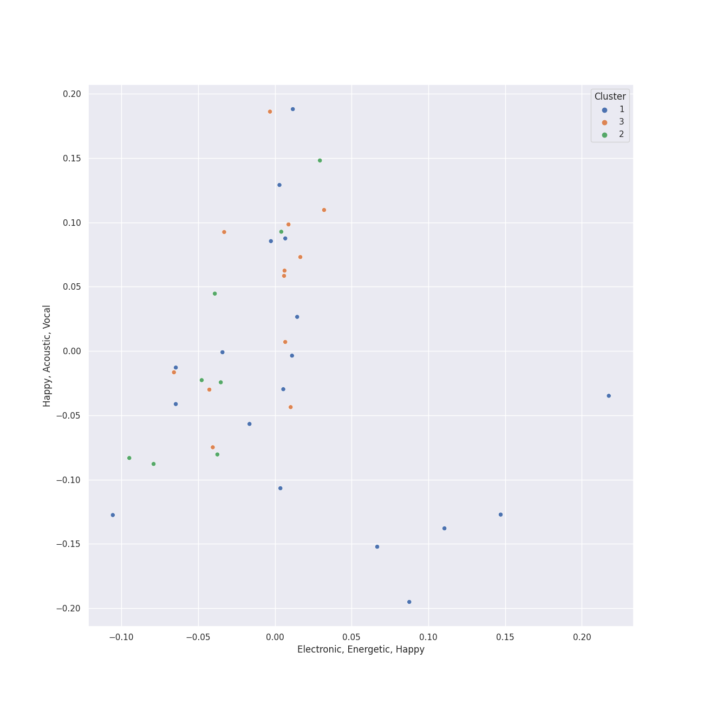

# Clusters in british invasion

## Cluster #1

12 tracks

| Art | Track | Album | Artists | Label | Rank | 💚 | 🔗 |
|:---|:---|:---|:---|:---|---:|:---|:---|
|  | Golden Slumbers - Remastered 2009 | Abbey Road (Remastered) | [The Beatles](../../../../artists/the_beatles/overview.md) | [EMI Catalogue](../../../../labels/emi_catalogue) | nan | 💚 | [🔗](https://open.spotify.com/track/01SfTM5nfCou5gQL70r6gs) |
|  | Something - Remastered 2009 | Abbey Road (Remastered) | [The Beatles](../../../../artists/the_beatles/overview.md) | [EMI Catalogue](../../../../labels/emi_catalogue) | nan | 💚 | [🔗](https://open.spotify.com/track/0pNeVovbiZHkulpGeOx1Gj) |
|  | You Never Give Me Your Money - Remastered 2009 | Abbey Road (Remastered) | [The Beatles](../../../../artists/the_beatles/overview.md) | [EMI Catalogue](../../../../labels/emi_catalogue) | nan | | [🔗](https://open.spotify.com/track/1jOLTO379yIu9aMnCkpMQl) |
|  | Because - Remastered 2009 | Abbey Road (Remastered) | [The Beatles](../../../../artists/the_beatles/overview.md) | [EMI Catalogue](../../../../labels/emi_catalogue) | 274 | 💚 | [🔗](https://open.spotify.com/track/1rxoyGj1QuPoVi8fOft1Kt) |
|  | Come Together - Remastered 2009 | Abbey Road (Remastered) | [The Beatles](../../../../artists/the_beatles/overview.md) | [EMI Catalogue](../../../../labels/emi_catalogue) | nan | 💚 | [🔗](https://open.spotify.com/track/2EqlS6tkEnglzr7tkKAAYD) |
|  | Blackbird - Remastered 2009 | The Beatles (Remastered) | [The Beatles](../../../../artists/the_beatles/overview.md) | [EMI Catalogue](../../../../labels/emi_catalogue) | nan | 💚 | [🔗](https://open.spotify.com/track/5jgFfDIR6FR0gvlA56Nakr) |
|  | Strawberry Fields Forever - Remastered 2009 | Magical Mystery Tour (Remastered) | [The Beatles](../../../../artists/the_beatles/overview.md) | [EMI Catalogue](../../../../labels/emi_catalogue) | nan | | [🔗](https://open.spotify.com/track/3Am0IbOxmvlSXro7N5iSfZ) |
|  | Let It Be - Remastered 2009 | Let It Be (Remastered) | [The Beatles](../../../../artists/the_beatles/overview.md) | [EMI Catalogue](../../../../labels/emi_catalogue) | nan | 💚 | [🔗](https://open.spotify.com/track/7iN1s7xHE4ifF5povM6A48) |
|  | Baba O'Riley | Who's Next (Deluxe Edition) | [The Who](../../../../artists/the_who/overview.md) | [Polydor Records](../../../../labels/polydor_records) | nan | 💚 | [🔗](https://open.spotify.com/track/3qiyyUfYe7CRYLucrPmulD) |
|  | Won't Get Fooled Again - Remix | Who's Next (Expanded Edition) | [The Who](../../../../artists/the_who/overview.md) | [Geffen*](../../../../labels/geffen) | nan | 💚 | [🔗](https://open.spotify.com/track/1W1GpfPujmgp2vQqcpUhtU) |
## Cluster #2

12 tracks

| Art | Track | Album | Artists | Label | Rank | 💚 | 🔗 |
|:---|:---|:---|:---|:---|---:|:---|:---|
|  | Carry That Weight - Remastered 2009 | Abbey Road (Remastered) | [The Beatles](../../../../artists/the_beatles/overview.md) | [EMI Catalogue](../../../../labels/emi_catalogue) | nan | | [🔗](https://open.spotify.com/track/5eZrW59C3UgBhkqNlowEID) |
|  | Norwegian Wood (This Bird Has Flown) - Remastered 2009 | Rubber Soul (Remastered) | [The Beatles](../../../../artists/the_beatles/overview.md) | [EMI Catalogue](../../../../labels/emi_catalogue) | nan | 💚 | [🔗](https://open.spotify.com/track/1H7gMYGykdtwZOV6s1N0by) |
|  | Sexy Sadie - Remastered 2009 | The Beatles (Remastered) | [The Beatles](../../../../artists/the_beatles/overview.md) | [EMI Catalogue](../../../../labels/emi_catalogue) | nan | 💚 | [🔗](https://open.spotify.com/track/2tBv9tAdqEbLNDi5smSjbg) |
|  | All You Need Is Love - Remastered 2009 | Yellow Submarine (Remastered) | [The Beatles](../../../../artists/the_beatles/overview.md) | [EMI Catalogue](../../../../labels/emi_catalogue) | nan | | [🔗](https://open.spotify.com/track/2Z8cY4QpZTFUZxCQCpvNe1) |
|  | Love Me Do - Remastered 2009 | Please Please Me (Remastered) | [The Beatles](../../../../artists/the_beatles/overview.md) | [EMI Catalogue](../../../../labels/emi_catalogue) | nan | | [🔗](https://open.spotify.com/track/3VbGCXWRiouAq8VyMYN2MI) |
|  | Got To Get You Into My Life - Remastered 2009 | Revolver (Remastered) | [The Beatles](../../../../artists/the_beatles/overview.md) | [EMI Catalogue](../../../../labels/emi_catalogue) | nan | 💚 | [🔗](https://open.spotify.com/track/3tGhRLgcCP6SIZU3tbGl7l) |
|  | Yellow Submarine - Remastered 2009 | Revolver (Remastered) | [The Beatles](../../../../artists/the_beatles/overview.md) | [EMI Catalogue](../../../../labels/emi_catalogue) | nan | | [🔗](https://open.spotify.com/track/50xwQXPtfNZFKFeZ0XePWc) |
|  | Across The Universe - Remastered 2009 | Let It Be (Remastered) | [The Beatles](../../../../artists/the_beatles/overview.md) | [EMI Catalogue](../../../../labels/emi_catalogue) | nan | 💚 | [🔗](https://open.spotify.com/track/4dkoqJrP0L8FXftrMZongF) |
|  | All My Loving - Remastered 2009 | With The Beatles (Remastered) | [The Beatles](../../../../artists/the_beatles/overview.md) | [EMI Catalogue](../../../../labels/emi_catalogue) | nan | 💚 | [🔗](https://open.spotify.com/track/4joiWvli4qJVEW6qZV2i2J) |
|  | My Generation - Stereo Version | My Generation (Stereo Version) | [The Who](../../../../artists/the_who/overview.md) | [Geffen](../../../../labels/geffen) | nan | 💚 | [🔗](https://open.spotify.com/track/4u9f8hqstB7iITDJNzKhQx) |
## Cluster #3

16 tracks

| Art | Track | Album | Artists | Label | Rank | 💚 | 🔗 |
|:---|:---|:---|:---|:---|---:|:---|:---|
|  | Octopus's Garden - Remastered 2009 | Abbey Road (Remastered) | [The Beatles](../../../../artists/the_beatles/overview.md) | [EMI Catalogue](../../../../labels/emi_catalogue) | nan | | [🔗](https://open.spotify.com/track/0suLngfo7rJoetk7Ub6N8l) |
|  | Oh! Darling - Remastered 2009 | Abbey Road (Remastered) | [The Beatles](../../../../artists/the_beatles/overview.md) | [EMI Catalogue](../../../../labels/emi_catalogue) | nan | 💚 | [🔗](https://open.spotify.com/track/2mxByJWOajjiVsLWjNXvDJ) |
|  | While My Guitar Gently Weeps - Remastered 2009 | The Beatles (Remastered) | [The Beatles](../../../../artists/the_beatles/overview.md) | [EMI Catalogue](../../../../labels/emi_catalogue) | nan | 💚 | [🔗](https://open.spotify.com/track/389QX9Q1eUOEZ19vtzzI9O) |
|  | Penny Lane - Remastered 2009 | Magical Mystery Tour (Remastered) | [The Beatles](../../../../artists/the_beatles/overview.md) | [EMI Catalogue](../../../../labels/emi_catalogue) | nan | 💚 | [🔗](https://open.spotify.com/track/1h04XMpzGzmAudoI6VHBgA) |
|  | I Am The Walrus - Remastered 2009 | Magical Mystery Tour (Remastered) | [The Beatles](../../../../artists/the_beatles/overview.md) | [EMI Catalogue](../../../../labels/emi_catalogue) | nan | 💚 | [🔗](https://open.spotify.com/track/6Pq9MmkDQYZiiCDpxnvrf6) |
|  | Day Tripper - Remastered 2015 | 1 (Remastered) | [The Beatles](../../../../artists/the_beatles/overview.md) | [UMC (Universal Music Catalogue)](../../../../labels/umc_(universal_music_catalogue)) | 353 | 💚 | [🔗](https://open.spotify.com/track/29b2b96jozyD9GPCkOrVLs) |
|  | A Hard Day's Night - Remastered 2009 | A Hard Day's Night (Remastered) | [The Beatles](../../../../artists/the_beatles/overview.md) | [EMI Catalogue](../../../../labels/emi_catalogue) | nan | 💚 | [🔗](https://open.spotify.com/track/5J2CHimS7dWYMImCHkEFaJ) |
|  | Who Are You | Who Are You | [The Who](../../../../artists/the_who/overview.md) | [Geffen](../../../../labels/geffen) | 492 | 💚 | [🔗](https://open.spotify.com/track/23IJ5wLRhEZ9DOuia5mPiZ) |
|  | Pinball Wizard | Tommy | [The Who](../../../../artists/the_who/overview.md) | [UMC (Universal Music Catalogue)](../../../../labels/umc_(universal_music_catalogue)) | nan | 💚 | [🔗](https://open.spotify.com/track/6LbbHFEajG9e4m0G3L47c4) |
|  | Paint It, Black | Aftermath | The Rolling Stones | ABKCO Music and Records, Inc. | nan | 💚 | [🔗](https://open.spotify.com/track/63T7DJ1AFDD6Bn8VzG6JE8) |