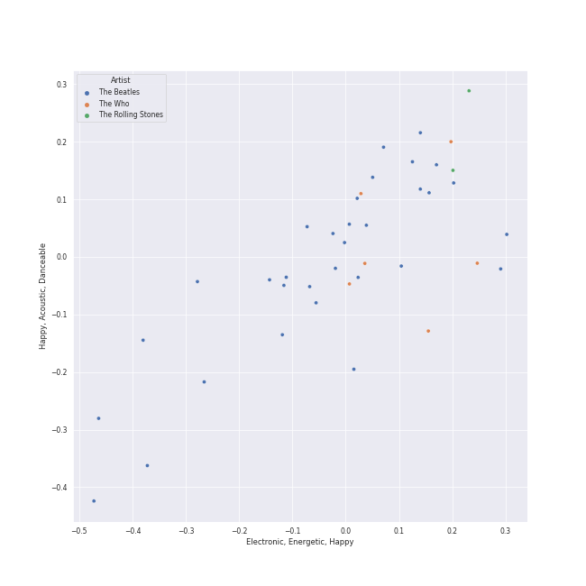
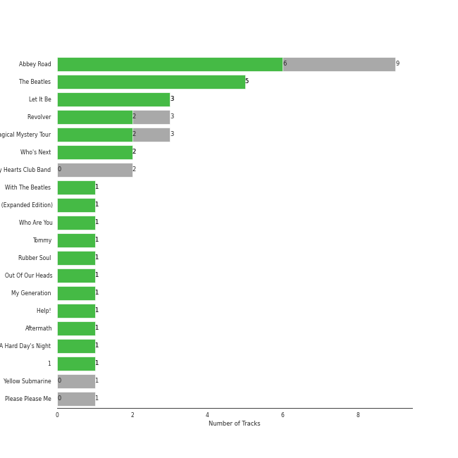
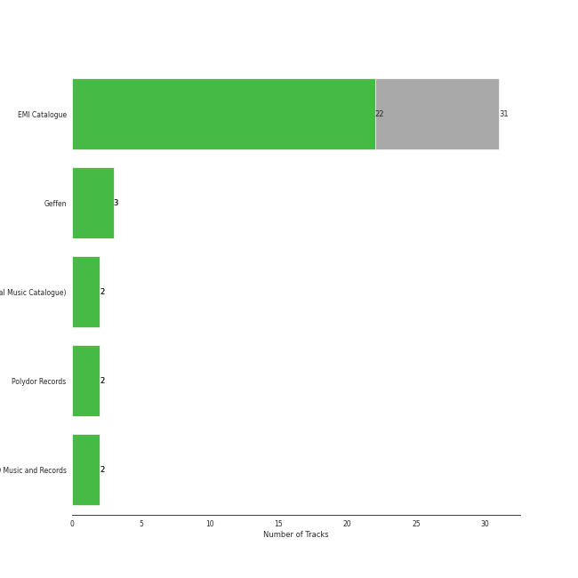
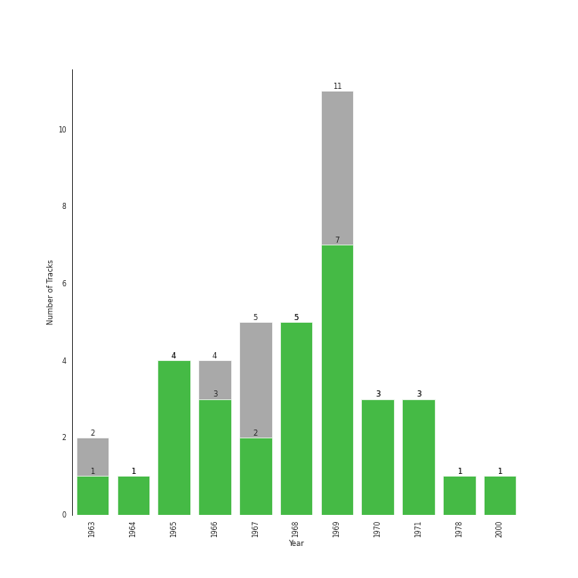

# british invasion

40 songs

[See Track Features](audio_features.md)

[See Clusters](clusters/overview.md)

## Top Artists

| Art | Rank | Tracks | 💚 | Artist | 🔗 |
|:---|---:|---:|---:|:---|:---|
|  | 61 | 32 | 23 | [The Beatles](../../artists/the_beatles/overview.md) | [🔗](https://open.spotify.com/artist/3WrFJ7ztbogyGnTHbHJFl2) |
|  | 324 | 6 | 6 | [The Who](../../artists/the_who/overview.md) | [🔗](https://open.spotify.com/artist/67ea9eGLXYMsO2eYQRui3w) |
|  | 414 | 2 | 2 | The Rolling Stones | [🔗](https://open.spotify.com/artist/22bE4uQ6baNwSHPVcDxLCe) |

## Most and least listened tracks
| Rank | ​ | Most listened tracks | Rank | ​​ | Least listened tracks |
|---:|:---|:---|---:|:---|:---|
| 365 |  | [Because - Remastered 2009](../../artists/the_beatles/overview.md) | 921 |  | [Let It Be - Remastered 2009](../../artists/the_beatles/overview.md) |
| 463 |  | [Day Tripper - Remastered 2015](../../artists/the_beatles/overview.md) | 921 |  | [I Am The Walrus - Remastered 2009](../../artists/the_beatles/overview.md) |
| 626 |  | [Who Are You](../../artists/the_who/overview.md) | 921 |  | [Pinball Wizard](../../artists/the_who/overview.md) |
| 921 |  | [Golden Slumbers - Remastered 2009](../../artists/the_beatles/overview.md) | 921 |  | Paint It, Black |
| 921 |  | [Behind Blue Eyes](../../artists/the_who/overview.md) | 921 |  | [Blackbird - Remastered 2009](../../artists/the_beatles/overview.md) |
| 921 |  | [A Day In The Life - Remastered 2009](../../artists/the_beatles/overview.md) | 921 |  | [Carry That Weight - Remastered 2009](../../artists/the_beatles/overview.md) |
| 921 |  | [Something - Remastered 2009](../../artists/the_beatles/overview.md) | 921 |  | [Dear Prudence - Remastered 2009](../../artists/the_beatles/overview.md) |
| 921 |  | [Octopus's Garden - Remastered 2009](../../artists/the_beatles/overview.md) | 921 |  | [A Hard Day's Night - Remastered 2009](../../artists/the_beatles/overview.md) |
| 921 |  | [Norwegian Wood (This Bird Has Flown) - Remastered 2009](../../artists/the_beatles/overview.md) | 921 |  | [Eleanor Rigby - Remastered 2009](../../artists/the_beatles/overview.md) |
| 921 |  | [When I'm Sixty Four - Remastered 2009](../../artists/the_beatles/overview.md) | 921 |  | [Yellow Submarine - Remastered 2009](../../artists/the_beatles/overview.md) |

## Top Albums

| Art | Rank | Tracks | 💚 | Album | Release Date | 🔗 |
|:---|---:|---:|---:|:---|:---|:---|
|  | 263 | 9 | 6 | Abbey Road (Remastered) | 1969-09-26 | [🔗](https://open.spotify.com/album/0ETFjACtuP2ADo6LFhL6HN) |
|  | 612 | 5 | 5 | The Beatles (Remastered) | 1968-11-22 | [🔗](https://open.spotify.com/album/1klALx0u4AavZNEvC4LrTL) |
|  | 612 | 3 | 3 | Let It Be (Remastered) | 1970-05-08 | [🔗](https://open.spotify.com/album/0jTGHV5xqHPvEcwL8f6YU5) |
|  | 612 | 3 | 2 | Revolver (Remastered) | 1966-08-05 | [🔗](https://open.spotify.com/album/3PRoXYsngSwjEQWR5PsHWR) |
|  | 612 | 3 | 2 | Magical Mystery Tour (Remastered) | 1967-11-27 | [🔗](https://open.spotify.com/album/2BtE7qm1qzM80p9vLSiXkj) |
|  | 612 | 2 | 2 | Who's Next (Deluxe Edition) | 1971-08-14 | [🔗](https://open.spotify.com/album/5MqyhhHbT13zsloD3uHhlQ) |
|  | 612 | 2 | 0 | Sgt. Pepper's Lonely Hearts Club Band (Remastered) | 1967-06-01 | [🔗](https://open.spotify.com/album/6QaVfG1pHYl1z15ZxkvVDW) |
|  | 612 | 1 | 1 | With The Beatles (Remastered) | 1963-11-22 | [🔗](https://open.spotify.com/album/1aYdiJk6XKeHWGO3FzHHTr) |
|  | 612 | 1 | 1 | Who's Next (Expanded Edition) | 1971-08-14 | [🔗](https://open.spotify.com/album/53PBYiedQrASAs5sy63JqT) |
|  | 422 | 1 | 1 | Who Are You | 1978-08-18 | [🔗](https://open.spotify.com/album/7at3CV9Y9P57wsEXkfU0q8) |

See all 20 albums

| Art | Rank | Tracks | 💚 | Album | Release Date | 🔗 |
|:---|---:|---:|---:|:---|:---|:---|
|  | 612 | 1 | 1 | Tommy | 1969-05-23 | [🔗](https://open.spotify.com/album/5cT7ee1sy2oEbFalP4asS4) |
|  | 612 | 1 | 1 | Rubber Soul (Remastered) | 1965-12-03 | [🔗](https://open.spotify.com/album/50o7kf2wLwVmOTVYJOTplm) |
|  | 612 | 1 | 1 | Out Of Our Heads | 1965-07-30 | [🔗](https://open.spotify.com/album/2Q5MwpTmtjscaS34mJFXQQ) |
|  | 612 | 1 | 1 | My Generation (Stereo Version) | 1965-12-03 | [🔗](https://open.spotify.com/album/6Oc6Ok1Oawu8lRkjmD4mXy) |
|  | 612 | 1 | 1 | Help! (Remastered) | 1965-08-06 | [🔗](https://open.spotify.com/album/0PT5m6hwPRrpBwIHVnvbFX) |
|  | 612 | 1 | 1 | Aftermath | 1966-04-15 | [🔗](https://open.spotify.com/album/72qrnM4yUNMDDlWiqKc8iY) |
|  | 612 | 1 | 1 | A Hard Day's Night (Remastered) | 1964-07-10 | [🔗](https://open.spotify.com/album/6wCttLq0ADzkPgtRnUihLV) |
|  | 329 | 1 | 1 | 1 (Remastered) | 2000-11-13 | [🔗](https://open.spotify.com/album/7vEJAtP3KgKSpOHVgwm3Eh) |
|  | 612 | 1 | 0 | Yellow Submarine (Remastered) | 1969-01-17 | [🔗](https://open.spotify.com/album/1gKZ5A1ndFqbcrWtW85cCy) |
|  | 612 | 1 | 0 | Please Please Me (Remastered) | 1963-03-22 | [🔗](https://open.spotify.com/album/3KzAvEXcqJKBF97HrXwlgf) |

## Top Record Labels

| Tracks | 💚 | Label |
|---:|---:|:---|
| 31 | 22 | [EMI Catalogue](../../labels/emi_catalogue/overview.md) |
| 3 | 3 | [Geffen](../../labels/geffen/overview.md) |
| 2 | 2 | [UMC (Universal Music Catalogue)](../../labels/umc_(universal_music_catalogue)/overview.md) |
| 2 | 2 | [Polydor Records](../../labels/polydor_records/overview.md) |
| 2 | 2 | ABKCO Music and Records |

## Top Producers

| Art | Producer | Tracks | Credit Types |
|:---|:---|---:|:---|
| | [George Martin](../../producers/george_martin/overview.md) | 23 | Producer, Arranger |
| | [Paul McCartney](../../producers/paul_mccartney/overview.md) | 21 | Songwriter |
| | [John Lennon](../../producers/john_lennon/overview.md) | 21 | Songwriter |
| | Geoff Emerick | 10 | Producer |
| | Phil McDonald | 8 | Producer |
| | Glyn Johns | 8 | Producer |
| | Pete Townshend | 5 | Lyricist, Songwriter |
| | Norman Smith | 5 | Producer |
| | Ken Scott | 4 | Producer |
| | Phil Spector | 3 | Producer |

View all

| Art | Producer | Tracks | Credit Types |
|:---|:---|---:|:---|
| | Chris Thomas | 3 | Producer |
|  | [The Who](../../artists/the_who/overview.md) | 3 | Producer |
| | Jeff Jarratt | 2 | Producer |
| | Barry Sheffield | 2 | Producer |
| | George Harrison | 2 | Lyricist, Songwriter |
| | Lauren Scott | 1 | Arranger |
| | John Mills | 1 | Arranger |
| | Chris Stamp | 1 | Producer |
| | Andrew Loog Oldham | 1 | Producer |
|  | The Rolling Stones | 1 | Arranger |
| | Ron Pender | 1 | Producer |
| | Mick Jagger | 1 | Songwriter |
| | David Hassinger | 1 | Producer |
| | Martin Benge | 1 | Producer |
| | Keith Moon | 1 | Producer |
| | Damon Lyon-Shaw | 1 | Producer |
| | Jon Astley | 1 | Producer |
| | Keith Richards | 1 | Songwriter |
| | Kit Lambert | 1 | Producer |
| | Peter Bown | 1 | Producer |

## Years

| ​ | 10 newest albums | ​​ | 10 oldest albums |
|:---|:---|:---|:---|
|  | 1 (Remastered) (2000-11-13) |  | Please Please Me (Remastered) (1963-03-22) |
|  | Who Are You (1978-08-18) |  | With The Beatles (Remastered) (1963-11-22) |
|  | Who's Next (Expanded Edition) (1971-08-14) |  | A Hard Day's Night (Remastered) (1964-07-10) |
|  | Who's Next (Deluxe Edition) (1971-08-14) |  | Out Of Our Heads (1965-07-30) |
|  | Let It Be (Remastered) (1970-05-08) |  | Help! (Remastered) (1965-08-06) |
|  | Abbey Road (Remastered) (1969-09-26) |  | Rubber Soul (Remastered) (1965-12-03) |
|  | Tommy (1969-05-23) |  | My Generation (Stereo Version) (1965-12-03) |
|  | Yellow Submarine (Remastered) (1969-01-17) |  | Aftermath (1966-04-15) |
|  | The Beatles (Remastered) (1968-11-22) |  | Revolver (Remastered) (1966-08-05) |
|  | Magical Mystery Tour (Remastered) (1967-11-27) |  | Sgt. Pepper's Lonely Hearts Club Band (Remastered) (1967-06-01) |

