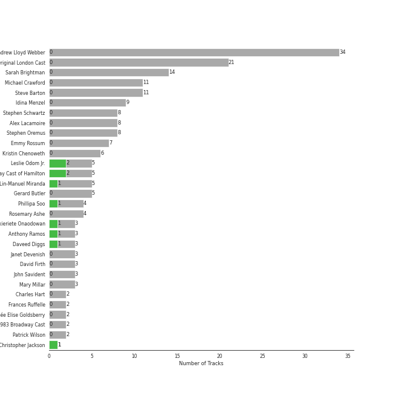
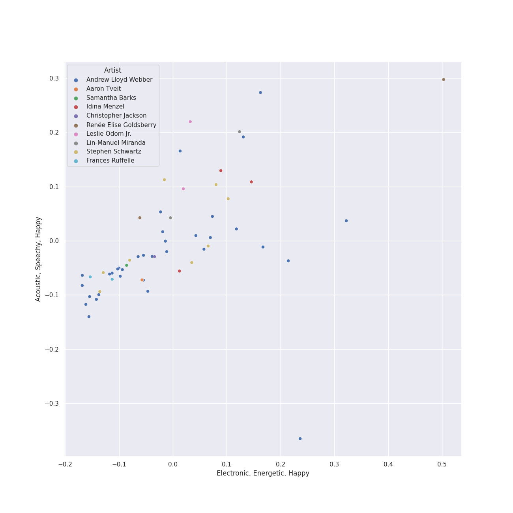
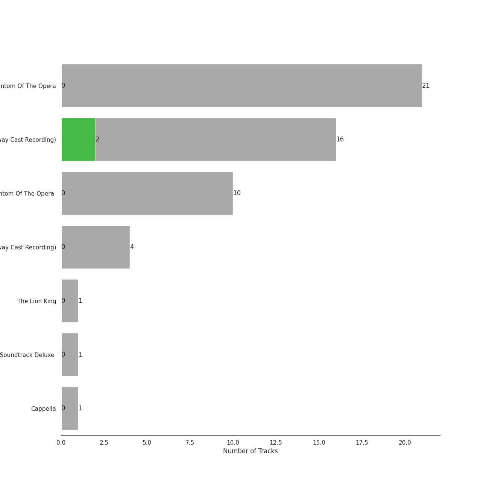
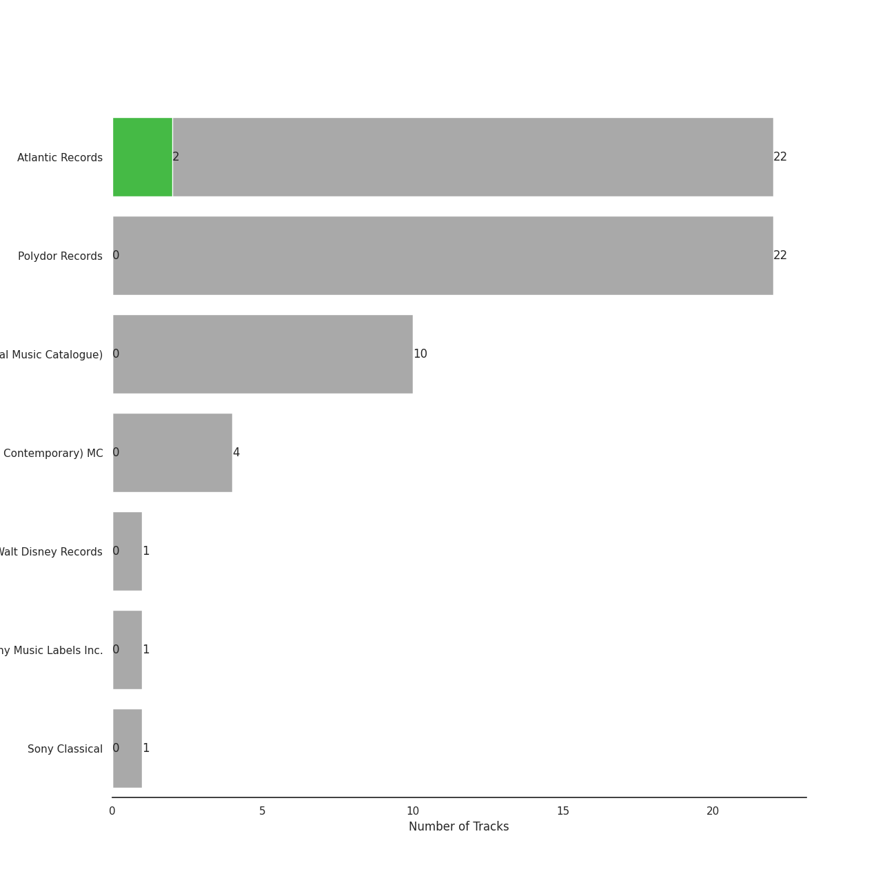

# broadway

[54 songs](broadway_tracks.md)

## Top Artists

See all 41 artists

| Number of Tracks | Art | Artist | 🔗 |
|---:|:---|:---|:---|
| 32 |  | [Andrew Lloyd Webber](../artists/andrew_lloyd_webber.md) | [🔗](https://open.spotify.com/artist/4aP1lp10BRYZO658B2NwkG) |
| 21 |  | [Phantom Of The Opera Original London Cast](../artists/phantom_of_the_opera_original_london_cast.md) | [🔗](https://open.spotify.com/artist/3LfD2yRlfHAtTryX8rFp25) |
| 15 |  | [Original Broadway Cast of Hamilton](../artists/original_broadway_cast_of_hamilton.md) | [🔗](https://open.spotify.com/artist/3UUJfRbrA2nTbcg4i0MOwu) |
| 14 |  | [Sarah Brightman](../artists/sarah_brightman.md) | [🔗](https://open.spotify.com/artist/7Ead768rc4ShGxnqtqccU5) |
| 11 |  | [Michael Crawford](../artists/michael_crawford.md) | [🔗](https://open.spotify.com/artist/5fRiVl9fyhUEZhcpMyIxUG) |
| 11 |  | [Steve Barton](../artists/steve_barton.md) | [🔗](https://open.spotify.com/artist/1gEOIEK9jgpYvvG57BP0US) |
| 10 |  | [Leslie Odom Jr.](../artists/leslie_odom_jr_.md) | [🔗](https://open.spotify.com/artist/3cR4rhS2hBWqI7rJEBacvN) |
| 8 |  | [Lin-Manuel Miranda](../artists/lin_manuel_miranda.md) | [🔗](https://open.spotify.com/artist/4aXXDj9aZnlshx7mzj3W1N) |
| 7 |  | Emmy Rossum | [🔗](https://open.spotify.com/artist/6JcDqt1rBKIWfnoPjXFYqc) |
| 5 |  | Gerard Butler | [🔗](https://open.spotify.com/artist/7H25O93TTUoaZ0ZaFk318U) |
| 4 |  | [Daveed Diggs](../artists/daveed_diggs.md) | [🔗](https://open.spotify.com/artist/3twuAojvYNrlWZpMkxLm3P) |
| 4 |  | Rosemary Ashe | [🔗](https://open.spotify.com/artist/3Oju6zkuJzum4svKeVhKiK) |
| 3 |  | Janet Devenish | [🔗](https://open.spotify.com/artist/7Ev9dg2zamUgQsRUp9DdRl) |
| 3 |  | [Okieriete Onaodowan](../artists/okieriete_onaodowan.md) | [🔗](https://open.spotify.com/artist/6G3sPhnj4JBCsBVBGvZnkk) |
| 3 |  | David Firth | [🔗](https://open.spotify.com/artist/4kjJU6zIfQi87yTWJMxJNw) |
| 3 |  | John Savident | [🔗](https://open.spotify.com/artist/2V0W4YzPCESOh86ss7D2QE) |
| 3 |  | Mary Millar | [🔗](https://open.spotify.com/artist/1SBvpcra5uod7N0rxJxa3J) |
| 2 |  | Christopher Jackson | [🔗](https://open.spotify.com/artist/6sLwRSXSUF5JTUnQaFenyj) |
| 2 |  | [Anthony Ramos](../artists/anthony_ramos.md) | [🔗](https://open.spotify.com/artist/660YptcR0hNHJ8iEr1qcse) |
| 2 |  | Frances Ruffelle | [🔗](https://open.spotify.com/artist/5uSeMCBhe3DiROdFrwaXkw) |
| 2 |  | Terrence Mann | [🔗](https://open.spotify.com/artist/5uBIsYz9WatgoViLG6pVj2) |
| 2 |  | [Phillipa Soo](../artists/phillipa_soo.md) | [🔗](https://open.spotify.com/artist/2OEGI2wrCVmvavKEOMlccy) |
| 2 |  | Patrick Wilson | [🔗](https://open.spotify.com/artist/0z5nxdz5osD8FsmaUDmfC0) |
| 1 |  | Students | [🔗](https://open.spotify.com/artist/7oaoEBdRqHXfoiGYa55Atp) |
| 1 |  | Les Misérables Cast | [🔗](https://open.spotify.com/artist/71wy5iisVKXLZgoPxdFi8A) |
| 1 |  | Aaron Tveit | [🔗](https://open.spotify.com/artist/68h2f0WXn4zEctSgNYozXx) |
| 1 |  | Joseph Williams | [🔗](https://open.spotify.com/artist/5xk0kRuXn1zToTHpHAqpui) |
| 1 |  | Minnie Driver | [🔗](https://open.spotify.com/artist/5rNwd5kb1cxVBCQKnDO4b8) |
| 1 |  | [The King's Singers](../artists/the_king_s_singers.md) | [🔗](https://open.spotify.com/artist/5lR7yDVN4z9kahOiUSlMhe) |
| 1 |  | Renée Elise Goldsberry | [🔗](https://open.spotify.com/artist/5VJN4jB6PqqEg4kJiAj6Eu) |
| 1 |  | Jason Weaver | [🔗](https://open.spotify.com/artist/5UdPkKWd8YNR5xGcmqH9QJ) |
| 1 |  | John Aron | [🔗](https://open.spotify.com/artist/5Hco9oOhEcTrU0hzzIkoF7) |
| 1 |  | Colm Wilkinson | [🔗](https://open.spotify.com/artist/4hKV8PcRBaHZqBJjSn8OJE) |
| 1 |  | Eddie Redmayne | [🔗](https://open.spotify.com/artist/4EJP6Qhk6l18LumCcpEfLw) |
| 1 |  | Ephraim Sykes | [🔗](https://open.spotify.com/artist/3brilvMAN6ILRUMvaqJWdG) |
| 1 |  | Janos Kurucz | [🔗](https://open.spotify.com/artist/3MiTXPOmIgoJioulWki8dz) |
| 1 |  | Jennifer Ellison | [🔗](https://open.spotify.com/artist/3FAYTkACAc9Ir1snu0ZzSy) |
| 1 |  | Ariana DeBose | [🔗](https://open.spotify.com/artist/1Np9GsrPO7dlczjvdehBxs) |
| 1 |  | Ernie Sabella | [🔗](https://open.spotify.com/artist/0RH6EMxqfzCEB7QCSKQ4xr) |
| 1 |  | Sasha Hutchings | [🔗](https://open.spotify.com/artist/0Pg2rEmiZEnmxw4eQwtvsR) |
| 1 |  | Nathan Lane | [🔗](https://open.spotify.com/artist/0P0do9GwiSgweSF6Ui3mrv) |

## Top Albums

See all 7 albums

| Number of Tracks | Art | Album | Release Date | 🔗 |
|---:|:---|:---|:---|:---|
| 21 |  | The Phantom Of The Opera | 1987-01-01 | [🔗](https://open.spotify.com/album/36bEg6FTBaZGLg9ngJZIU6) |
| 16 |  | Hamilton (Original Broadway Cast Recording) | 2015-09-25 | [🔗](https://open.spotify.com/album/1kCHru7uhxBUdzkm4gzRQc) |
| 10 |  | The Phantom Of The Opera (Original Motion Picture Soundtrack) | 2004-12-10 | [🔗](https://open.spotify.com/album/1zwEN9cLtWg39zFJnj8brt) |
| 4 |  | Les Misérables (Original Broadway Cast Recording) | 1987-05-11 | [🔗](https://open.spotify.com/album/3jbKDx0zB1QoJQTw8i1AvD) |
| 1 |  | The Lion King | 1994-01-01 | [🔗](https://open.spotify.com/album/3YA5DdB3wSz4pdfEXoMyRd) |
| 1 |  | Les Misérables: The Motion Picture Soundtrack Deluxe (Deluxe Edition) | 2013-01-01 | [🔗](https://open.spotify.com/album/0I6Bl1dVB1hQsSoQF6KuTg) |
| 1 |  | Cappella | 2013 | [🔗](https://open.spotify.com/album/3n6JxpdWnHkazMCQxKK5qI) |

## Top Record Labels

See all 7 labels

| Number of Tracks | Label |
|---:|:---|
| 22 | [Polydor Records](../labels/polydor_records.md) |
| 16 | [Atlantic Records](../labels/atlantic_records.md) |
| 10 | [UMC (Universal Music Catalogue)](../labels/umc__universal_music_catalogue_.md) |
| 4 | [Verve (Adult Contemporary) MC](../labels/verve__adult_contemporary__mc.md) |
| 1 | [Walt Disney Records](../labels/walt_disney_records.md) |
| 1 | [Sony Music Labels Inc.](../labels/sony_music_labels_inc_.md) |
| 1 | [Sony Classical](../labels/sony_classical.md) |

## Audio Features

| 10 most Danceable tracks | 10 least Danceable tracks |
|:---|:---|
| Washington on Your Side | The Music Of The Night - From 'The Phantom Of The Opera' Motion Picture |
| A Winter's Ball | All I Ask Of You - Reprise |
| Blow Us All Away | All I Ask Of You - From 'The Phantom Of The Opera' Motion Picture |
| The Adams Administration | Wishing You Were Somehow Here Again - From 'The Phantom Of The Opera' Motion Picture |
| Non-Stop | All I Ask Of You |
| Yorktown (The World Turned Upside Down) | Overture |
| The Reynolds Pamphlet | Learn To Be Lonely - From 'The Phantom Of The Opera' Motion Picture |
| Your Obedient Servant | Entr'Acte |
| Stay Alive | All I Ask of You |
| Guns and Ships | The Music Of The Night |

| 10 most Energetic tracks | 10 least Energetic tracks |
|:---|:---|
| Yorktown (The World Turned Upside Down) | A Little Fall Of Rain |
| Guns and Ships | Magical Lasso |
| The Phantom Of the Opera - From 'The Phantom Of The Opera' Motion Picture | Angel Of Music - From 'The Phantom Of The Opera' Motion Picture |
| The Phantom Of The Opera | Wishing You Were Somehow Here Again - From 'The Phantom Of The Opera' Motion Picture |
| The Reynolds Pamphlet | All I Ask of You |
| Washington on Your Side | All I Ask Of You - Reprise |
| The Room Where It Happens | The Music Of The Night - From 'The Phantom Of The Opera' Motion Picture |
| Non-Stop | Angel Of Music |
| Wait for It | Learn To Be Lonely - From 'The Phantom Of The Opera' Motion Picture |
| Blow Us All Away | On My Own |

| 10 most Speechy tracks | 10 least Speechy tracks |
|:---|:---|
| Prologue | Dear Theodosia |
| The World Was Wide Enough | Stars |
| The Adams Administration | Learn To Be Lonely - From 'The Phantom Of The Opera' Motion Picture |
| A Winter's Ball | Overture / Work Song |
| Your Obedient Servant | Entr'Acte |
| Blow Us All Away | The Music Of The Night |
| The Room Where It Happens | All I Ask of You |
| Stay Alive | Do You Hear The People Sing? |
| Non-Stop | On My Own |
| Washington on Your Side | Think Of Me - From 'The Phantom Of The Opera' Motion Picture |

| 10 most Acoustic tracks | 10 least Acoustic tracks |
|:---|:---|
| All I Ask of You | Overture - From 'The Phantom Of The Opera' Motion Picture |
| On My Own | Overture |
| A Little Fall Of Rain | The Reynolds Pamphlet |
| Angel Of Music - From 'The Phantom Of The Opera' Motion Picture | The Phantom Of The Opera |
| Think Of Me - From 'The Phantom Of The Opera' Motion Picture | Wait for It |
| Wishing You Were Somehow Here Again - From 'The Phantom Of The Opera' Motion Picture | Washington on Your Side |
| Magical Lasso | The Phantom Of the Opera - From 'The Phantom Of The Opera' Motion Picture |
| Angel Of Music | Non-Stop |
| All I Ask Of You - Reprise | The Room Where It Happens |
| Dear Theodosia | Your Obedient Servant |

| 10 most Instrumental tracks | 10 least Instrumental tracks |
|:---|:---|
| Entr'Acte | The World Was Wide Enough |
| Overture | Think Of Me - From 'The Phantom Of The Opera' Motion Picture |
| All I Ask Of You - Reprise | Angel Of Music - From 'The Phantom Of The Opera' Motion Picture |
| Overture - From 'The Phantom Of The Opera' Motion Picture | Learn To Be Lonely - From 'The Phantom Of The Opera' Motion Picture |
| The Phantom Of The Opera | The Point Of No Return - From 'The Phantom Of The Opera' Motion Picture |
| Wishing You Were Somehow Here Again | Notes / Prima Donna |
| The Point Of No Return | Stars |
| Little Lotte / The Mirror (Angel Of Music) | Masquerade / Why So Silent |
| All I Ask of You | Prologue |
| All I Ask Of You - From 'The Phantom Of The Opera' Motion Picture | Blow Us All Away |

| 10 most Live tracks | 10 least Live tracks |
|:---|:---|
| Yorktown (The World Turned Upside Down) | Your Obedient Servant |
| Stars | Dear Theodosia |
| The Point Of No Return - From 'The Phantom Of The Opera' Motion Picture | All I Ask Of You - Reprise |
| The Room Where It Happens | Washington on Your Side |
| Blow Us All Away | Think Of Me - From 'The Phantom Of The Opera' Motion Picture |
| The Point Of No Return | Guns and Ships |
| Entr'Acte | All I Ask of You |
| Down Once More / Track Down This Murderer | Wishing You Were Somehow Here Again |
| I Remember / Stranger Than You Dreamt It | A Winter's Ball |
| Masquerade / Why So Silent | Who Lives, Who Dies, Who Tells Your Story |

| 10 most Happy tracks | 10 least Happy tracks |
|:---|:---|
| The Adams Administration | Wishing You Were Somehow Here Again |
| Hakuna Matata - From "The Lion King" Soundtrack | Wandering Child / Bravo, Monsieur |
| A Winter's Ball | Little Lotte / The Mirror (Angel Of Music) |
| Blow Us All Away | Down Once More / Track Down This Murderer |
| Your Obedient Servant | I Remember / Stranger Than You Dreamt It |
| Stay Alive | All I Ask Of You - Reprise |
| Alexander Hamilton | Wishing You Were Somehow Here Again - From 'The Phantom Of The Opera' Motion Picture |
| The Reynolds Pamphlet | Why Have You Brought Me Here |
| Wait for It | The Point Of No Return |
| The Room Where It Happens | Overture |
