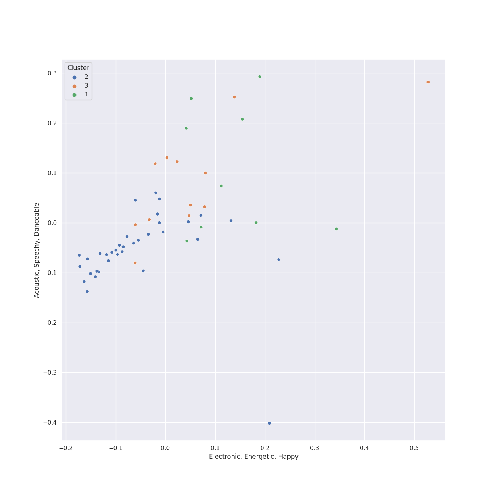

# Clusters in broadway

## Cluster #1

9 tracks

| Art | Track | Album | Artists | Label | Score | 💚 | 🔗 |
|:---|:---|:---|:---|:---|---:|:---|:---|
|  | Overture | The Phantom Of The Opera | Andrew Lloyd Webber, Phantom Of The Opera Original London Cast | [Polydor Records](../../../../labels/polydor_records) | 0 | | [🔗](https://open.spotify.com/track/37u4N8Nje0UIJINbW7QULX) |
|  | The Phantom Of The Opera | The Phantom Of The Opera | Andrew Lloyd Webber, Phantom Of The Opera Original London Cast, Michael Crawford, Sarah Brightman | [Polydor Records](../../../../labels/polydor_records) | 0 | | [🔗](https://open.spotify.com/track/5qlABWwod6dgDCmRAAF5J5) |
|  | The Phantom Of the Opera - From 'The Phantom Of The Opera' Motion Picture | The Phantom Of The Opera (Original Motion Picture Soundtrack) | Andrew Lloyd Webber, Gerard Butler, Emmy Rossum | [UMC (Universal Music Catalogue)](../../../../labels/umc_(universal_music_catalogue)) | 0 | | [🔗](https://open.spotify.com/track/4EaBMhUIOfnFEbIgqCfKbi) |
|  | Overture - From 'The Phantom Of The Opera' Motion Picture | The Phantom Of The Opera (Original Motion Picture Soundtrack) | Andrew Lloyd Webber | [UMC (Universal Music Catalogue)](../../../../labels/umc_(universal_music_catalogue)) | 0 | | [🔗](https://open.spotify.com/track/7o3DV1szMH5Fd38f1QwgPO) |
|  | Wait for It | Hamilton (Original Broadway Cast Recording) | Leslie Odom Jr., Original Broadway Cast of Hamilton | [Atlantic Records](../../../../labels/atlantic_records) | 0 | 💚 | [🔗](https://open.spotify.com/track/7EqpEBPOohgk7NnKvBGFWo) |
|  | No One Mourns The Wicked - From "Wicked" Original Broadway Cast Recording/2003 | Wicked (Original Broadway Cast Recording / Deluxe Edition) | Stephen Schwartz, Kristin Chenoweth, Sean McCourt, Cristy Candler, Jan Neuberger, Stephen Oremus, Alex Lacamoire | [Verve (Adult Contemporary) MC](../../../../labels/verve_(adult_contemporary)_mc) | 0 | | [🔗](https://open.spotify.com/track/0UzApqRTAi3d2iZexmuP3s) |
|  | Defying Gravity - From "Wicked" Original Broadway Cast Recording/2003 | Wicked (Original Broadway Cast Recording / Deluxe Edition) | Stephen Schwartz, Kristin Chenoweth, Idina Menzel, Stephen Oremus, Alex Lacamoire | [Verve (Adult Contemporary) MC](../../../../labels/verve_(adult_contemporary)_mc) | 0 | | [🔗](https://open.spotify.com/track/184HGdGIscUiPbDuqbvHuN) |
|  | Dancing Through Life - From "Wicked" Original Broadway Cast Recording/2003 | Wicked (Original Broadway Cast Recording / Deluxe Edition) | Stephen Schwartz, Norbert Leo Butz, Kristin Chenoweth, Christopher Fitzgerald, Michelle Federer, Idina Menzel, Stephen Oremus, Alex Lacamoire | [Verve (Adult Contemporary) MC](../../../../labels/verve_(adult_contemporary)_mc) | 0 | | [🔗](https://open.spotify.com/track/45Yr7rD2vH3OsTRseT6gfA) |
|  | No Good Deed - From "Wicked" Original Broadway Cast Recording/2003 | Wicked (Original Broadway Cast Recording / Deluxe Edition) | Stephen Schwartz, Idina Menzel, Stephen Oremus, Alex Lacamoire | [Verve (Adult Contemporary) MC](../../../../labels/verve_(adult_contemporary)_mc) | 0 | | [🔗](https://open.spotify.com/track/55dcu9Iz7r58VEmTqk4LP4) |
## Cluster #2

36 tracks

| Art | Track | Album | Artists | Label | Score | 💚 | 🔗 |
|:---|:---|:---|:---|:---|---:|:---|:---|
|  | The Music Of The Night | The Phantom Of The Opera | Andrew Lloyd Webber, Phantom Of The Opera Original London Cast, Michael Crawford | [Polydor Records](../../../../labels/polydor_records) | 0 | | [🔗](https://open.spotify.com/track/2jF3AQzvTj9L1Ax9Di5BYu) |
|  | Think Of Me | The Phantom Of The Opera | Andrew Lloyd Webber, Phantom Of The Opera Original London Cast, Rosemary Ashe, Sarah Brightman, Steve Barton | [Polydor Records](../../../../labels/polydor_records) | 0 | | [🔗](https://open.spotify.com/track/31Irb8d3UBRfEcaHDzQxsK) |
|  | Angel Of Music | The Phantom Of The Opera | Andrew Lloyd Webber, Phantom Of The Opera Original London Cast, Janet Devenish, Sarah Brightman | [Polydor Records](../../../../labels/polydor_records) | 0 | | [🔗](https://open.spotify.com/track/48eRbUfNOF4xnNHwSSYubb) |
|  | All I Ask of You | Cappella | Andrew Lloyd Webber, The King's Singers | [Sony Classical](../../../../labels/sony_classical), [Sony Music Labels Inc.](../../../../labels/sony_music_labels_inc_) | 0 | | [🔗](https://open.spotify.com/track/5JTRLqApDZKaIwcopt1d9p) |
|  | The Mirror (Angel Of Music) - From 'The Phantom Of The Opera' Motion Picture | The Phantom Of The Opera (Original Motion Picture Soundtrack) | Andrew Lloyd Webber, Gerard Butler, Emmy Rossum | [UMC (Universal Music Catalogue)](../../../../labels/umc_(universal_music_catalogue)) | 0 | | [🔗](https://open.spotify.com/track/5PRz8hvi9y6S36WIreol1U) |
|  | Wishing You Were Somehow Here Again - From 'The Phantom Of The Opera' Motion Picture | The Phantom Of The Opera (Original Motion Picture Soundtrack) | Andrew Lloyd Webber, Emmy Rossum | [UMC (Universal Music Catalogue)](../../../../labels/umc_(universal_music_catalogue)) | 0 | | [🔗](https://open.spotify.com/track/6axlN6wdRRrzElmyPXuGIC) |
|  | On My Own | Les Misérables: The Motion Picture Soundtrack Deluxe (Deluxe Edition) | Samantha Barks | [Polydor Records](../../../../labels/polydor_records) | 0 | | [🔗](https://open.spotify.com/track/3Mr6ofzF6ZuYiqHh8qNud3) |
|  | For Good - From "Wicked" Original Broadway Cast Recording/2003 | Wicked (Original Broadway Cast Recording / Deluxe Edition) | Stephen Schwartz, Kristin Chenoweth, Idina Menzel, Stephen Oremus, Alex Lacamoire | [Verve (Adult Contemporary) MC](../../../../labels/verve_(adult_contemporary)_mc) | 0 | | [🔗](https://open.spotify.com/track/3WkgLAd7jGX3sZikfkF0lU) |
|  | I'm Not That Girl - From "Wicked" Original Broadway Cast Recording/2003 | Wicked (Original Broadway Cast Recording / Deluxe Edition) | Stephen Schwartz, Idina Menzel, Stephen Oremus, Alex Lacamoire | [Verve (Adult Contemporary) MC](../../../../labels/verve_(adult_contemporary)_mc) | 0 | | [🔗](https://open.spotify.com/track/5HZCMnScUwekum55mcRdjK) |
|  | On My Own | Les Misérables (Original Broadway Cast Recording) | Frances Ruffelle | [Verve (Adult Contemporary) MC](../../../../labels/verve_(adult_contemporary)_mc) | 0 | | [🔗](https://open.spotify.com/track/0XLXG7LJ8jLMhHC5qH9rq6) |
## Cluster #3

10 tracks

| Art | Track | Album | Artists | Label | Score | 💚 | 🔗 |
|:---|:---|:---|:---|:---|---:|:---|:---|
|  | Prologue | The Phantom Of The Opera | Andrew Lloyd Webber, Phantom Of The Opera Original London Cast, Steve Barton | [Polydor Records](../../../../labels/polydor_records) | 0 | | [🔗](https://open.spotify.com/track/1bdfgBPqPzUrSDQf46KMVz) |
|  | Do You Hear The People Sing? | Les Misérables: The Motion Picture Soundtrack Deluxe (Deluxe Edition) | Aaron Tveit, Eddie Redmayne, Students, Les Misérables Cast | [Polydor Records](../../../../labels/polydor_records) | 0 | | [🔗](https://open.spotify.com/track/0g8H61FNXHHhMVHB0jwdzH) |
|  | The Schuyler Sisters | Hamilton (Original Broadway Cast Recording) | Renée Elise Goldsberry, Phillipa Soo, Jasmine Cephas-Jones, Leslie Odom Jr., Original Broadway Cast of Hamilton | [Atlantic Records](../../../../labels/atlantic_records) | 0 | | [🔗](https://open.spotify.com/track/71X7bPDljJHrmEGYCe7kQ8) |
|  | Alexander Hamilton | Hamilton (Original Broadway Cast Recording) | Leslie Odom Jr., Daveed Diggs, Okieriete Onaodowan, Lin-Manuel Miranda, Phillipa Soo, Christopher Jackson, Original Broadway Cast of Hamilton, Anthony Ramos | [Atlantic Records](../../../../labels/atlantic_records) | 0 | 💚 | [🔗](https://open.spotify.com/track/4TTV7EcfroSLWzXRY6gLv6) |
|  | My Shot | Hamilton (Original Broadway Cast Recording) | Lin-Manuel Miranda, Daveed Diggs, Okieriete Onaodowan, Leslie Odom Jr., Original Broadway Cast of Hamilton, Anthony Ramos | [Atlantic Records](../../../../labels/atlantic_records) | 0 | | [🔗](https://open.spotify.com/track/4cxvludVmQxryrnx1m9FqL) |
|  | Aaron Burr, Sir | Hamilton (Original Broadway Cast Recording) | Lin-Manuel Miranda, Leslie Odom Jr., Daveed Diggs, Okieriete Onaodowan, Anthony Ramos | [Atlantic Records](../../../../labels/atlantic_records) | 0 | | [🔗](https://open.spotify.com/track/6dr7ekfhlbquvsVY8D7gyk) |
|  | What Is This Feeling? - From "Wicked" Original Broadway Cast Recording/2003 | Wicked (Original Broadway Cast Recording / Deluxe Edition) | Stephen Schwartz, Kristin Chenoweth, Idina Menzel, Stephen Oremus, Alex Lacamoire | [Verve (Adult Contemporary) MC](../../../../labels/verve_(adult_contemporary)_mc) | 0 | | [🔗](https://open.spotify.com/track/2lNRPajwEfma5EEmsgAe1w) |
|  | Popular - From "Wicked" Original Broadway Cast Recording/2003 | Wicked (Original Broadway Cast Recording / Deluxe Edition) | Stephen Schwartz, Kristin Chenoweth, Stephen Oremus, Alex Lacamoire | [Verve (Adult Contemporary) MC](../../../../labels/verve_(adult_contemporary)_mc) | 0 | | [🔗](https://open.spotify.com/track/57Pk2GU0ABFYBbbcgYxqki) |
|  | Everyone's a Little Bit Racist | Avenue Q (Original Broadway Cast Recording) | John Tartaglia, Stephanie D'Abruzzo, Natalie Venetia Belcon, Jordan Gelber, Ann Harada | Masterworks Broadway | 0 | | [🔗](https://open.spotify.com/track/0xY4mvrWtUjePft8O28Tce) |
|  | Giants In The Sky | Into The Woods (2022 Broadway Cast Recording) | Cole Thompson | [Craft Recordings](../../../../labels/craft_recordings) | 315 | | [🔗](https://open.spotify.com/track/3RDesmUopi3TgcFJdPAZnN) |