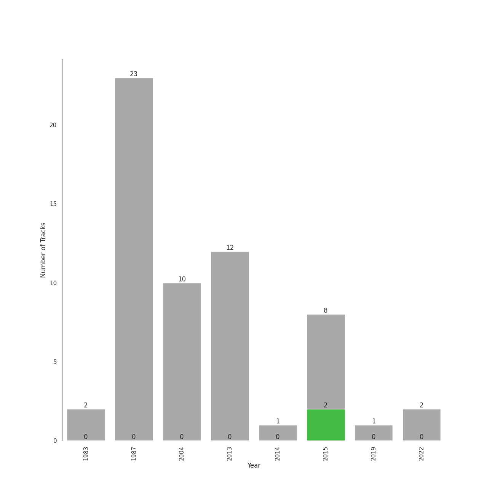

# broadway

58 songs

[See Track Features](audio_features.md)

[See Clusters](clusters/overview.md)

## Top Artists

| Art | Tracks | 💚 | Artist | 🔗 |
|:---|---:|---:|:---|:---|
|  | 5 | 2 | Leslie Odom Jr. | [🔗](https://open.spotify.com/artist/3cR4rhS2hBWqI7rJEBacvN) |
|  | 5 | 2 | Original Broadway Cast of Hamilton | [🔗](https://open.spotify.com/artist/3UUJfRbrA2nTbcg4i0MOwu) |
|  | 5 | 1 | Lin-Manuel Miranda | [🔗](https://open.spotify.com/artist/4aXXDj9aZnlshx7mzj3W1N) |
|  | 4 | 1 | Phillipa Soo | [🔗](https://open.spotify.com/artist/2OEGI2wrCVmvavKEOMlccy) |
| | 3 | 1 | Okieriete Onaodowan | [🔗](https://open.spotify.com/artist/6G3sPhnj4JBCsBVBGvZnkk) |
|  | 3 | 1 | Anthony Ramos | [🔗](https://open.spotify.com/artist/660YptcR0hNHJ8iEr1qcse) |
|  | 3 | 1 | Daveed Diggs | [🔗](https://open.spotify.com/artist/3twuAojvYNrlWZpMkxLm3P) |
|  | 1 | 1 | Christopher Jackson | [🔗](https://open.spotify.com/artist/6sLwRSXSUF5JTUnQaFenyj) |
|  | 34 | 0 | Andrew Lloyd Webber | [🔗](https://open.spotify.com/artist/4aP1lp10BRYZO658B2NwkG) |
|  | 21 | 0 | Phantom Of The Opera Original London Cast | [🔗](https://open.spotify.com/artist/3LfD2yRlfHAtTryX8rFp25) |

See all 72 artists

| Art | Tracks | 💚 | Artist | 🔗 |
|:---|---:|---:|:---|:---|
|  | 14 | 0 | Sarah Brightman | [🔗](https://open.spotify.com/artist/7Ead768rc4ShGxnqtqccU5) |
|  | 11 | 0 | Michael Crawford | [🔗](https://open.spotify.com/artist/5fRiVl9fyhUEZhcpMyIxUG) |
|  | 11 | 0 | Steve Barton | [🔗](https://open.spotify.com/artist/1gEOIEK9jgpYvvG57BP0US) |
|  | 8 | 0 | Stephen Schwartz | [🔗](https://open.spotify.com/artist/7daPb40K64rRtF36wd3ZOk) |
|  | 8 | 0 | Alex Lacamoire | [🔗](https://open.spotify.com/artist/5TLQArskPwpPQULjjE2tsW) |
|  | 8 | 0 | Stephen Oremus | [🔗](https://open.spotify.com/artist/1e6BRnFiiwNZl04xu1yqmi) |
|  | 7 | 0 | Emmy Rossum | [🔗](https://open.spotify.com/artist/6JcDqt1rBKIWfnoPjXFYqc) |
|  | 6 | 0 | Idina Menzel | [🔗](https://open.spotify.com/artist/73Np75Wv2tju61Eo9Zw4IR) |
|  | 6 | 0 | Kristin Chenoweth | [🔗](https://open.spotify.com/artist/3DgcBA7P0ji5co7Z1Gfp2Q) |
|  | 5 | 0 | Gerard Butler | [🔗](https://open.spotify.com/artist/7H25O93TTUoaZ0ZaFk318U) |
|  | 4 | 0 | Rosemary Ashe | [🔗](https://open.spotify.com/artist/3Oju6zkuJzum4svKeVhKiK) |
| | 3 | 0 | Janet Devenish | [🔗](https://open.spotify.com/artist/7Ev9dg2zamUgQsRUp9DdRl) |
|  | 3 | 0 | David Firth | [🔗](https://open.spotify.com/artist/4kjJU6zIfQi87yTWJMxJNw) |
| | 3 | 0 | John Savident | [🔗](https://open.spotify.com/artist/2V0W4YzPCESOh86ss7D2QE) |
| | 3 | 0 | Mary Millar | [🔗](https://open.spotify.com/artist/1SBvpcra5uod7N0rxJxa3J) |
|  | 3 | 0 | Andrew Rannells | [🔗](https://open.spotify.com/artist/0GxSAKOw8AV0JsEQ0HYY4b) |
| | 2 | 0 | Lewis Cleale | [🔗](https://open.spotify.com/artist/7tihd0CgVerCoDl6LeDHQW) |
|  | 2 | 0 | Brian Sears | [🔗](https://open.spotify.com/artist/7prZJzDK9Eaidya20kUciB) |
| | 2 | 0 | Clark Johnsen | [🔗](https://open.spotify.com/artist/6xWxKaEFEKU3r7AUzUKylT) |
| | 2 | 0 | Kevin Duda | [🔗](https://open.spotify.com/artist/6b1coNssyWbKkbgZfK9MB5) |
|  | 2 | 0 | Charles Hart | [🔗](https://open.spotify.com/artist/6IFUhDPbZkH4ytZZDiu0x4) |
|  | 2 | 0 | Frances Ruffelle | [🔗](https://open.spotify.com/artist/5uSeMCBhe3DiROdFrwaXkw) |
|  | 2 | 0 | Renée Elise Goldsberry | [🔗](https://open.spotify.com/artist/5VJN4jB6PqqEg4kJiAj6Eu) |
| | 2 | 0 | Benjamin Schrader | [🔗](https://open.spotify.com/artist/5OPT8oIrU42hqfKMJv0b5B) |
| | 2 | 0 | Rory O'Malley | [🔗](https://open.spotify.com/artist/4ypbxQ7Pb5JKm2ulHXDcBP) |
|  | 2 | 0 | Josh Gad | [🔗](https://open.spotify.com/artist/4dSQICBjdUIp5iK6RRU2bY) |
| | 2 | 0 | Justin Bohon | [🔗](https://open.spotify.com/artist/4MYUIgtNTRdEfksW6IwvAe) |
|  | 2 | 0 | Jason Michael Snow | [🔗](https://open.spotify.com/artist/32oXmsd7TLzVccshoWY0mm) |
|  | 2 | 0 | "Cats" 1983 Broadway Cast | [🔗](https://open.spotify.com/artist/2cez574BwRD00PGEbNl4SH) |
| | 2 | 0 | Scott Barnhardt | [🔗](https://open.spotify.com/artist/1A4dOeSiYZ0yBf6l5uYY7m) |
| | 2 | 0 | Patrick Wilson | [🔗](https://open.spotify.com/artist/0z5nxdz5osD8FsmaUDmfC0) |
|  | 1 | 0 | Students | [🔗](https://open.spotify.com/artist/7oaoEBdRqHXfoiGYa55Atp) |
| | 1 | 0 | Hector Jaime Mercado | [🔗](https://open.spotify.com/artist/7mGrd0nUrFLiz1ettU2olj) |
|  | 1 | 0 | Ann Harada | [🔗](https://open.spotify.com/artist/743OB85I8BftMRfuNAO1RS) |
| | 1 | 0 | Michelle Federer | [🔗](https://open.spotify.com/artist/724Af947xg6pNu4xiwhYsV) |
|  | 1 | 0 | Les Misérables Cast | [🔗](https://open.spotify.com/artist/71wy5iisVKXLZgoPxdFi8A) |
|  | 1 | 0 | Harry Groener | [🔗](https://open.spotify.com/artist/6S61JShQr2Td7pyjOKFEpQ) |
|  | 1 | 0 | Aaron Tveit | [🔗](https://open.spotify.com/artist/68h2f0WXn4zEctSgNYozXx) |
|  | 1 | 0 | Minnie Driver | [🔗](https://open.spotify.com/artist/5rNwd5kb1cxVBCQKnDO4b8) |
|  | 1 | 0 | The King's Singers | [🔗](https://open.spotify.com/artist/5lR7yDVN4z9kahOiUSlMhe) |
| | 1 | 0 | Jan Neuberger | [🔗](https://open.spotify.com/artist/5LATQYuPWELZCDEdGYN5YH) |
| | 1 | 0 | John Aron | [🔗](https://open.spotify.com/artist/5Hco9oOhEcTrU0hzzIkoF7) |
| | 1 | 0 | Kenneth Ard | [🔗](https://open.spotify.com/artist/5FrpB7toJvnhPRiZ4I1mxQ) |
|  | 1 | 0 | Sean McCourt | [🔗](https://open.spotify.com/artist/53KxkH27mKZgcCmtdKYBl7) |
|  | 1 | 0 | Samantha Barks | [🔗](https://open.spotify.com/artist/4gOl5m9dY7IGAipqpul7GZ) |
|  | 1 | 0 | John Tartaglia | [🔗](https://open.spotify.com/artist/4L7TL4CnvDR3iZQuVy6ESm) |
|  | 1 | 0 | Jasmine Cephas-Jones | [🔗](https://open.spotify.com/artist/4H3e5t5utgPvj6Nsuda5QF) |
|  | 1 | 0 | Eddie Redmayne | [🔗](https://open.spotify.com/artist/4EJP6Qhk6l18LumCcpEfLw) |
| | 1 | 0 | Donna King | [🔗](https://open.spotify.com/artist/4BlarH2Qbfhc3DR4LhHrqp) |
| | 1 | 0 | Janos Kurucz | [🔗](https://open.spotify.com/artist/3MiTXPOmIgoJioulWki8dz) |
|  | 1 | 0 | Jennifer Ellison | [🔗](https://open.spotify.com/artist/3FAYTkACAc9Ir1snu0ZzSy) |
| | 1 | 0 | Wendy Edmead | [🔗](https://open.spotify.com/artist/3F1882LLJA1TxkePqJcLud) |
| | 1 | 0 | Cristy Candler | [🔗](https://open.spotify.com/artist/36XXapGsaRgnQEQkjPfTBl) |
| | 1 | 0 | Jordan Gelber | [🔗](https://open.spotify.com/artist/31IEoybe2khDGCEPboqR1N) |
|  | 1 | 0 | Cole Thompson | [🔗](https://open.spotify.com/artist/2t5453S7ue4vkqbt0An4F8) |
|  | 1 | 0 | Betty Buckley | [🔗](https://open.spotify.com/artist/2fAwOOtpSCnuUU1lyBB7ab) |
| | 1 | 0 | Stephanie D'Abruzzo | [🔗](https://open.spotify.com/artist/2bvaL0chaHzVdKXjULRLeK) |
|  | 1 | 0 | Norbert Leo Butz | [🔗](https://open.spotify.com/artist/2LEinBhufpsqT17c5XYomF) |
|  | 1 | 0 | Christopher Fitzgerald | [🔗](https://open.spotify.com/artist/1Yq9Q4bPuxh1N4wtIEXyII) |
| | 1 | 0 | Natalie Venetia Belcon | [🔗](https://open.spotify.com/artist/1XFS2KakYbCcp4NHyDgc4f) |
|  | 1 | 0 | Richard Stilgoe | [🔗](https://open.spotify.com/artist/17peneSLV6CavfRbQEACCu) |
| | 1 | 0 | Cynthia Onrubia | [🔗](https://open.spotify.com/artist/15dLAyVKmw26KgDnK3QEv3) |

## Most and least listened tracks
| ​ | Most listened tracks | Rank | ​​ | Least listened tracks | Rank |
|:---|:---|---:|:---|:---|---:|
|  | Giants In The Sky | 340 |  | Notes / Prima Donna | 851 |
|  | Hello! | 851 |  | Overture - From 'The Phantom Of The Opera' Motion Picture | 851 |
|  | Down Once More / Track Down This Murderer | 851 |  | Notes / Twisted Every Way | 851 |
|  | All I Ask Of You - Reprise | 851 |  | Two by Two | 851 |
|  | I Remember / Stranger Than You Dreamt It | 851 |  | Magical Lasso | 851 |
|  | No One Mourns The Wicked - From "Wicked" Original Broadway Cast Recording/2003 | 851 |  | Wait for It | 851 |
|  | On My Own | 851 |  | The Schuyler Sisters | 851 |
|  | Entr'Acte | 851 |  | That Would Be Enough | 851 |
|  | Do You Hear The People Sing? | 851 |  | Wandering Child / Bravo, Monsieur | 851 |
|  | Everyone's a Little Bit Racist | 851 |  | Think Of Me - From 'The Phantom Of The Opera' Motion Picture | 851 |

## Top Albums

| Art | Tracks | 💚 | Album | Release Date | 🔗 |
|:---|---:|---:|:---|:---|:---|
|  | 21 | 0 | The Phantom Of The Opera | 1987-01-01 | [🔗](https://open.spotify.com/album/36bEg6FTBaZGLg9ngJZIU6) |
|  | 10 | 0 | The Phantom Of The Opera (Original Motion Picture Soundtrack) | 2004-12-10 | [🔗](https://open.spotify.com/album/1zwEN9cLtWg39zFJnj8brt) |
|  | 8 | 0 | Wicked (Original Broadway Cast Recording / Deluxe Edition) | 2013-01-01 | [🔗](https://open.spotify.com/album/1woCvthHJakakroP6dXNxs) |
|  | 7 | 2 | Hamilton (Original Broadway Cast Recording) | 2015-09-25 | [🔗](https://open.spotify.com/album/1kCHru7uhxBUdzkm4gzRQc) |
|  | 3 | 0 | The Book Of Mormon (Original Broadway Cast Recording) | 2011-05-17 | [🔗](https://open.spotify.com/album/5yauUuXppqUj2ulor38hvI) |
|  | 2 | 0 | Les Misérables: The Motion Picture Soundtrack Deluxe (Deluxe Edition) | 2013-01-01 | [🔗](https://open.spotify.com/album/0I6Bl1dVB1hQsSoQF6KuTg) |
|  | 2 | 0 | Les Misérables (Original Broadway Cast Recording) | 1987-05-11 | [🔗](https://open.spotify.com/album/3jbKDx0zB1QoJQTw8i1AvD) |
|  | 2 | 0 | Cats (Original Broadway Cast Recording / 1983) | 1983-01-01 | [🔗](https://open.spotify.com/album/7dIID5jd8V3fR2NXkonyD3) |
|  | 1 | 0 | Into The Woods (2022 Broadway Cast Recording) | 2022-09-30 | [🔗](https://open.spotify.com/album/5z6BFXI711HbSAXDjgOAHE) |
|  | 1 | 0 | Cappella | 2013 | [🔗](https://open.spotify.com/album/3n6JxpdWnHkazMCQxKK5qI) |

See all 11 albums

| Art | Tracks | 💚 | Album | Release Date | 🔗 |
|:---|---:|---:|:---|:---|:---|
|  | 1 | 0 | Avenue Q (Original Broadway Cast Recording) | 2003-10-06 | [🔗](https://open.spotify.com/album/4Ok0WpQf9ucxEbd0wJV5Cx) |

## Top Record Labels

| Tracks | 💚 | Label |
|---:|---:|:---|
| 7 | 2 | [Atlantic Records](../../labels/atlantic_records/overview.md) |
| 23 | 0 | [Polydor Records](../../labels/polydor_records/overview.md) |
| 12 | 0 | [UMC (Universal Music Catalogue)](../../labels/umc_(universal_music_catalogue)/overview.md) |
| 10 | 0 | [Verve (Adult Contemporary) MC](../../labels/verve_(adult_contemporary)_mc/overview.md) |
| 3 | 0 | Ghostlight Records |
| 1 | 0 | [Sony Music Labels Inc.](../../labels/sony_music_labels_inc_/overview.md) |
| 1 | 0 | [Sony Classical](../../labels/sony_classical/overview.md) |
| 1 | 0 | Masterworks Broadway |
| 1 | 0 | [Craft Recordings](../../labels/craft_recordings/overview.md) |

## Top Producers

| Art | Producer | Tracks | Credit Types |
|:---|:---|---:|:---|
|  | Lin-Manuel Miranda | 2 | Lyricist, Songwriter |
|  | Alex Lacamoire | 1 | Arranger |
## Years

| ​ | 10 newest albums | ​​ | 10 oldest albums |
|:---|:---|:---|:---|
|  | Into The Woods (2022 Broadway Cast Recording) (2022-09-30) |  | Cats (Original Broadway Cast Recording / 1983) (1983-01-01) |
|  | Hamilton (Original Broadway Cast Recording) (2015-09-25) |  | The Phantom Of The Opera (1987-01-01) |
|  | Les Misérables: The Motion Picture Soundtrack Deluxe (Deluxe Edition) (2013-01-01) |  | Les Misérables (Original Broadway Cast Recording) (1987-05-11) |
|  | Wicked (Original Broadway Cast Recording / Deluxe Edition) (2013-01-01) |  | Avenue Q (Original Broadway Cast Recording) (2003-10-06) |
|  | Cappella (2013) |  | The Phantom Of The Opera (Original Motion Picture Soundtrack) (2004-12-10) |
|  | The Book Of Mormon (Original Broadway Cast Recording) (2011-05-17) |  | The Book Of Mormon (Original Broadway Cast Recording) (2011-05-17) |
|  | The Phantom Of The Opera (Original Motion Picture Soundtrack) (2004-12-10) |  | Cappella (2013) |
|  | Avenue Q (Original Broadway Cast Recording) (2003-10-06) |  | Les Misérables: The Motion Picture Soundtrack Deluxe (Deluxe Edition) (2013-01-01) |
|  | Les Misérables (Original Broadway Cast Recording) (1987-05-11) |  | Wicked (Original Broadway Cast Recording / Deluxe Edition) (2013-01-01) |
|  | The Phantom Of The Opera (1987-01-01) |  | Hamilton (Original Broadway Cast Recording) (2015-09-25) |

