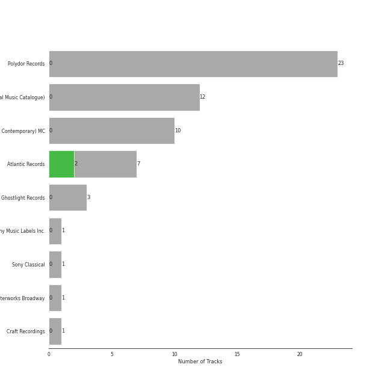
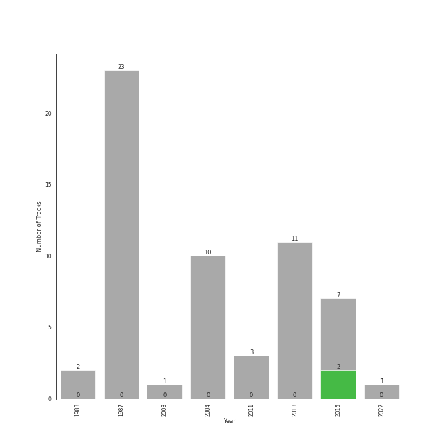

# broadway

[80 songs](tracks.md)

## Top Artists

| Art | Tracks | 💚 | Artist | 🔗 |
|:---|---:|---:|:---|:---|
|  | 29 | 2 | [Original Broadway Cast of Hamilton](../../artists/original_broadway_cast_of_hamilton/overview.md) | [🔗](https://open.spotify.com/artist/3UUJfRbrA2nTbcg4i0MOwu) |
|  | 18 | 2 | [Leslie Odom Jr.](../../artists/leslie_odom_jr_/overview.md) | [🔗](https://open.spotify.com/artist/3cR4rhS2hBWqI7rJEBacvN) |
|  | 26 | 1 | [Lin-Manuel Miranda](../../artists/lin_manuel_miranda/overview.md) | [🔗](https://open.spotify.com/artist/4aXXDj9aZnlshx7mzj3W1N) |
|  | 11 | 1 | [Phillipa Soo](../../artists/phillipa_soo/overview.md) | [🔗](https://open.spotify.com/artist/2OEGI2wrCVmvavKEOMlccy) |
|  | 10 | 1 | [Anthony Ramos](../../artists/anthony_ramos/overview.md) | [🔗](https://open.spotify.com/artist/660YptcR0hNHJ8iEr1qcse) |
|  | 10 | 1 | [Daveed Diggs](../../artists/daveed_diggs/overview.md) | [🔗](https://open.spotify.com/artist/3twuAojvYNrlWZpMkxLm3P) |
|  | 9 | 1 | [Okieriete Onaodowan](../../artists/okieriete_onaodowan/overview.md) | [🔗](https://open.spotify.com/artist/6G3sPhnj4JBCsBVBGvZnkk) |
|  | 7 | 1 | Christopher Jackson | [🔗](https://open.spotify.com/artist/6sLwRSXSUF5JTUnQaFenyj) |
|  | 32 | 0 | Andrew Lloyd Webber | [🔗](https://open.spotify.com/artist/4aP1lp10BRYZO658B2NwkG) |
|  | 21 | 0 | Phantom Of The Opera Original London Cast | [🔗](https://open.spotify.com/artist/3LfD2yRlfHAtTryX8rFp25) |

See all 42 artists

| Art | Tracks | 💚 | Artist | 🔗 |
|:---|---:|---:|:---|:---|
|  | 14 | 0 | Sarah Brightman | [🔗](https://open.spotify.com/artist/7Ead768rc4ShGxnqtqccU5) |
|  | 11 | 0 | Michael Crawford | [🔗](https://open.spotify.com/artist/5fRiVl9fyhUEZhcpMyIxUG) |
|  | 11 | 0 | Steve Barton | [🔗](https://open.spotify.com/artist/1gEOIEK9jgpYvvG57BP0US) |
|  | 7 | 0 | Emmy Rossum | [🔗](https://open.spotify.com/artist/6JcDqt1rBKIWfnoPjXFYqc) |
|  | 5 | 0 | Gerard Butler | [🔗](https://open.spotify.com/artist/7H25O93TTUoaZ0ZaFk318U) |
|  | 5 | 0 | Renée Elise Goldsberry | [🔗](https://open.spotify.com/artist/5VJN4jB6PqqEg4kJiAj6Eu) |
|  | 4 | 0 | Rosemary Ashe | [🔗](https://open.spotify.com/artist/3Oju6zkuJzum4svKeVhKiK) |
|  | 3 | 0 | Jonathan Groff | [🔗](https://open.spotify.com/artist/7KkqUt65v6LMtR369OQ6FB) |
|  | 3 | 0 | Janet Devenish | [🔗](https://open.spotify.com/artist/7Ev9dg2zamUgQsRUp9DdRl) |
|  | 3 | 0 | Idina Menzel | [🔗](https://open.spotify.com/artist/73Np75Wv2tju61Eo9Zw4IR) |
|  | 3 | 0 | David Firth | [🔗](https://open.spotify.com/artist/4kjJU6zIfQi87yTWJMxJNw) |
|  | 3 | 0 | John Savident | [🔗](https://open.spotify.com/artist/2V0W4YzPCESOh86ss7D2QE) |
|  | 3 | 0 | Mary Millar | [🔗](https://open.spotify.com/artist/1SBvpcra5uod7N0rxJxa3J) |
|  | 2 | 0 | Frances Ruffelle | [🔗](https://open.spotify.com/artist/5uSeMCBhe3DiROdFrwaXkw) |
|  | 2 | 0 | Patrick Wilson | [🔗](https://open.spotify.com/artist/0z5nxdz5osD8FsmaUDmfC0) |
|  | 1 | 0 | Students | [🔗](https://open.spotify.com/artist/7oaoEBdRqHXfoiGYa55Atp) |
|  | 1 | 0 | Les Misérables Cast | [🔗](https://open.spotify.com/artist/71wy5iisVKXLZgoPxdFi8A) |
|  | 1 | 0 | Jon Rua | [🔗](https://open.spotify.com/artist/69NsP4MC1JbfvKMwpx2oy8) |
|  | 1 | 0 | Aaron Tveit | [🔗](https://open.spotify.com/artist/68h2f0WXn4zEctSgNYozXx) |
|  | 1 | 0 | Minnie Driver | [🔗](https://open.spotify.com/artist/5rNwd5kb1cxVBCQKnDO4b8) |
|  | 1 | 0 | The King's Singers | [🔗](https://open.spotify.com/artist/5lR7yDVN4z9kahOiUSlMhe) |
|  | 1 | 0 | John Aron | [🔗](https://open.spotify.com/artist/5Hco9oOhEcTrU0hzzIkoF7) |
|  | 1 | 0 | Samantha Barks | [🔗](https://open.spotify.com/artist/4gOl5m9dY7IGAipqpul7GZ) |
|  | 1 | 0 | Jasmine Cephas-Jones | [🔗](https://open.spotify.com/artist/4H3e5t5utgPvj6Nsuda5QF) |
|  | 1 | 0 | Eddie Redmayne | [🔗](https://open.spotify.com/artist/4EJP6Qhk6l18LumCcpEfLw) |
|  | 1 | 0 | Ephraim Sykes | [🔗](https://open.spotify.com/artist/3brilvMAN6ILRUMvaqJWdG) |
|  | 1 | 0 | Janos Kurucz | [🔗](https://open.spotify.com/artist/3MiTXPOmIgoJioulWki8dz) |
|  | 1 | 0 | Jennifer Ellison | [🔗](https://open.spotify.com/artist/3FAYTkACAc9Ir1snu0ZzSy) |
|  | 1 | 0 | AURORA | [🔗](https://open.spotify.com/artist/1WgXqy2Dd70QQOU7Ay074N) |
|  | 1 | 0 | Ariana DeBose | [🔗](https://open.spotify.com/artist/1Np9GsrPO7dlczjvdehBxs) |
|  | 1 | 0 | [Michael Bublé](../../artists/michael_bubl_/overview.md) | [🔗](https://open.spotify.com/artist/1GxkXlMwML1oSg5eLPiAz3) |
|  | 1 | 0 | Sasha Hutchings | [🔗](https://open.spotify.com/artist/0Pg2rEmiZEnmxw4eQwtvsR) |

## Top Albums

| Art | Tracks | 💚 | Album | Release Date | 🔗 |
|:---|---:|---:|:---|:---|:---|
|  | 41 | 2 | Hamilton (Original Broadway Cast Recording) | 2015-09-25 | [🔗](https://open.spotify.com/album/1kCHru7uhxBUdzkm4gzRQc) |
|  | 21 | 0 | The Phantom Of The Opera | 1987-01-01 | [🔗](https://open.spotify.com/album/36bEg6FTBaZGLg9ngJZIU6) |
|  | 10 | 0 | The Phantom Of The Opera (Original Motion Picture Soundtrack) | 2004-12-10 | [🔗](https://open.spotify.com/album/1zwEN9cLtWg39zFJnj8brt) |
|  | 2 | 0 | Les Misérables: The Motion Picture Soundtrack Deluxe (Deluxe Edition) | 2013-01-01 | [🔗](https://open.spotify.com/album/0I6Bl1dVB1hQsSoQF6KuTg) |
|  | 2 | 0 | Les Misérables (Original Broadway Cast Recording) | 1987-05-11 | [🔗](https://open.spotify.com/album/3jbKDx0zB1QoJQTw8i1AvD) |
|  | 1 | 0 | Holiday Wishes | 2014-10-10 | [🔗](https://open.spotify.com/album/0EGX5qfw6VEPOMoCUFJFHl) |
|  | 1 | 0 | Frozen 2 (Original Motion Picture Soundtrack/Deluxe Edition) | 2019-11-15 | [🔗](https://open.spotify.com/album/4M07HWIlZr7zoXoxDHR5mz) |
|  | 1 | 0 | Frozen (Original Motion Picture Soundtrack / Deluxe Edition) | 2013-01-01 | [🔗](https://open.spotify.com/album/7lZs5r4oQV2nutddffLrg0) |
|  | 1 | 0 | Cappella | 2013 | [🔗](https://open.spotify.com/album/3n6JxpdWnHkazMCQxKK5qI) |

## Top Record Labels

| Tracks | 💚 | Label |
|---:|---:|:---|
| 41 | 2 | [Atlantic Records](../../labels/atlantic_records/overview.md) |
| 23 | 0 | [Polydor Records](../../labels/polydor_records/overview.md) |
| 10 | 0 | [UMC (Universal Music Catalogue)](../../labels/umc__universal_music_catalogue_/overview.md) |
| 2 | 0 | [Walt Disney Records](../../labels/walt_disney_records/overview.md) |
| 2 | 0 | [Verve (Adult Contemporary) MC](../../labels/verve__adult_contemporary__mc/overview.md) |
| 1 | 0 | [Warner Records](../../labels/warner_records/overview.md) |
| 1 | 0 | [Sony Music Labels Inc.](../../labels/sony_music_labels_inc_/overview.md) |
| 1 | 0 | [Sony Classical](../../labels/sony_classical/overview.md) |

## Years

| 10 newest albums | 10 oldest albums |
|:---|:---|
| 
 Frozen 2 (Original Motion Picture Soundtrack/Deluxe Edition) (2019-11-15)
 | 
 The Phantom Of The Opera (1987-01-01)
 |
| 
 Hamilton (Original Broadway Cast Recording) (2015-09-25)
 | 
 Les Misérables (Original Broadway Cast Recording) (1987-05-11)
 |
| 
 Holiday Wishes (2014-10-10)
 | 
 The Phantom Of The Opera (Original Motion Picture Soundtrack) (2004-12-10)
 |
| 
 Les Misérables: The Motion Picture Soundtrack Deluxe (Deluxe Edition) (2013-01-01)
 | 
 Cappella (2013)
 |
| 
 Frozen (Original Motion Picture Soundtrack / Deluxe Edition) (2013-01-01)
 | 
 Les Misérables: The Motion Picture Soundtrack Deluxe (Deluxe Edition) (2013-01-01)
 |
| 
 Cappella (2013)
 | 
 Frozen (Original Motion Picture Soundtrack / Deluxe Edition) (2013-01-01)
 |
| 
 The Phantom Of The Opera (Original Motion Picture Soundtrack) (2004-12-10)
 | 
 Holiday Wishes (2014-10-10)
 |
| 
 Les Misérables (Original Broadway Cast Recording) (1987-05-11)
 | 
 Hamilton (Original Broadway Cast Recording) (2015-09-25)
 |
| 
 The Phantom Of The Opera (1987-01-01)
 | 
 Frozen 2 (Original Motion Picture Soundtrack/Deluxe Edition) (2019-11-15)
 |
## Audio Features

| 10 most Danceable tracks | 10 least Danceable tracks |
|:---|:---|
| Ten Duel Commandments (0.887) | The Music Of The Night - From 'The Phantom Of The Opera' Motion Picture (0.169) |
| Washington on Your Side (0.884) | All I Ask Of You - Reprise (0.191) |
| A Winter's Ball (0.854) | All I Ask Of You - From 'The Phantom Of The Opera' Motion Picture (0.194) |
| Blow Us All Away (0.82) | Wishing You Were Somehow Here Again - From 'The Phantom Of The Opera' Motion Picture (0.219) |
| The Adams Administration (0.8) | All I Ask Of You (0.222) |
| Non-Stop (0.77) | Overture (0.224) |
| Yorktown (The World Turned Upside Down) (0.76) | Learn To Be Lonely - From 'The Phantom Of The Opera' Motion Picture (0.227) |
| Cabinet Battle #2 (0.753) | Entr'Acte (0.231) |
| The Reynolds Pamphlet (0.751) | All I Ask of You (0.236) |
| Schuyler Defeated (0.745) | The Music Of The Night (0.239) |

| 10 most Energetic tracks | 10 least Energetic tracks |
|:---|:---|
| Yorktown (The World Turned Upside Down) (0.883) | A Little Fall Of Rain (0.0291) |
| The Schuyler Sisters (0.727) | Magical Lasso (0.0314) |
| Guns and Ships (0.666) | Angel Of Music - From 'The Phantom Of The Opera' Motion Picture (0.0401) |
| Cabinet Battle #1 (0.658) | Wishing You Were Somehow Here Again - From 'The Phantom Of The Opera' Motion Picture (0.0617) |
| My Shot (0.649) | All I Ask of You (0.0636) |
| Meet Me Inside (0.643) | All I Ask Of You - Reprise (0.0679) |
| The Phantom Of the Opera - From 'The Phantom Of The Opera' Motion Picture (0.608) | The Music Of The Night - From 'The Phantom Of The Opera' Motion Picture (0.0722) |
| Schuyler Defeated (0.597) | Angel Of Music (0.0808) |
| Satisfied (0.593) | Learn To Be Lonely - From 'The Phantom Of The Opera' Motion Picture (0.0813) |
| The Phantom Of The Opera (0.582) | On My Own (0.0816) |

| 10 most Speechy tracks | 10 least Speechy tracks |
|:---|:---|
| Aaron Burr, Sir (0.818) | History Has Its Eyes on You (0.0291) |
| Prologue (0.748) | Dear Theodosia (0.0303) |
| Ten Duel Commandments (0.658) | Let It Go - From "Frozen"/Soundtrack Version (0.0305) |
| The World Was Wide Enough (0.648) | Learn To Be Lonely - From 'The Phantom Of The Opera' Motion Picture (0.0317) |
| The Adams Administration (0.544) | Entr'Acte (0.0353) |
| Cabinet Battle #2 (0.537) | That Would Be Enough (0.0355) |
| We Know (0.523) | The Music Of The Night (0.0367) |
| A Winter's Ball (0.507) | All I Ask of You (0.0377) |
| Your Obedient Servant (0.502) | Do You Hear The People Sing? (0.0379) |
| Right Hand Man (0.492) | On My Own (0.0381) |

| 10 most Acoustic tracks | 10 least Acoustic tracks |
|:---|:---|
| All I Ask of You (0.98) | Overture - From 'The Phantom Of The Opera' Motion Picture (0.000596) |
| On My Own (0.967) | Overture (0.00451) |
| A Little Fall Of Rain (0.955) | The Reynolds Pamphlet (0.0277) |
| Angel Of Music - From 'The Phantom Of The Opera' Motion Picture (0.954) | The Phantom Of The Opera (0.0533) |
| Think Of Me - From 'The Phantom Of The Opera' Motion Picture (0.943) | Cabinet Battle #2 (0.0582) |
| Wishing You Were Somehow Here Again - From 'The Phantom Of The Opera' Motion Picture (0.936) | Ten Duel Commandments (0.0691) |
| Magical Lasso (0.934) | Cabinet Battle #1 (0.0859) |
| Angel Of Music (0.931) | Wait for It (0.124) |
| All I Ask Of You - Reprise (0.911) | My Shot (0.15) |
| Dear Theodosia (0.907) | Washington on Your Side (0.165) |

| 10 most Instrumental tracks | 10 least Instrumental tracks |
|:---|:---|
| Entr'Acte (0.42) | Schuyler Defeated (0.0) |
| Overture (0.245) | Baby It's Cold Outside (with Michael Bublé) (0.0) |
| All I Ask Of You - Reprise (0.0315) | One Last Time (0.0) |
| Overture - From 'The Phantom Of The Opera' Motion Picture (0.0276) | The Story of Tonight (0.0) |
| The Phantom Of The Opera (0.0096) | The World Was Wide Enough (0.0) |
| Wishing You Were Somehow Here Again (0.00674) | Do You Hear The People Sing? (0.0) |
| The Point Of No Return (0.00348) | Let It Go - From "Frozen"/Soundtrack Version (0.0) |
| Little Lotte / The Mirror (Angel Of Music) (0.0025) | Hurricane (0.0) |
| All I Ask of You (0.00164) | We Know (0.0) |
| All I Ask Of You - From 'The Phantom Of The Opera' Motion Picture (0.000737) | Washington on Your Side (0.0) |

| 10 most Live tracks | 10 least Live tracks |
|:---|:---|
| Yorktown (The World Turned Upside Down) (0.727) | Your Obedient Servant (0.042) |
| I Know Him (0.722) | Dear Theodosia (0.0723) |
| The Point Of No Return - From 'The Phantom Of The Opera' Motion Picture (0.671) | All I Ask Of You - Reprise (0.0754) |
| The Room Where It Happens (0.664) | Washington on Your Side (0.0756) |
| The Story of Tonight (0.648) | It's Quiet Uptown (0.0785) |
| The Schuyler Sisters (0.627) | Think Of Me - From 'The Phantom Of The Opera' Motion Picture (0.0798) |
| Ten Duel Commandments (0.617) | Stay Alive - Reprise (0.0801) |
| Blow Us All Away (0.563) | One Last Time (0.0805) |
| The Point Of No Return (0.503) | Guns and Ships (0.0844) |
| Cabinet Battle #1 (0.489) | All I Ask of You (0.085) |

| 10 most Happy tracks | 10 least Happy tracks |
|:---|:---|
| Schuyler Defeated (0.842) | Wishing You Were Somehow Here Again (0.0374) |
| Ten Duel Commandments (0.828) | Wandering Child / Bravo, Monsieur (0.0392) |
| The Schuyler Sisters (0.792) | Little Lotte / The Mirror (Angel Of Music) (0.0465) |
| The Adams Administration (0.792) | Down Once More / Track Down This Murderer (0.0529) |
| Helpless (0.737) | I Remember / Stranger Than You Dreamt It (0.0574) |
| We Know (0.692) | All I Ask Of You - Reprise (0.0624) |
| A Winter's Ball (0.688) | Wishing You Were Somehow Here Again - From 'The Phantom Of The Opera' Motion Picture (0.071) |
| Blow Us All Away (0.665) | Why Have You Brought Me Here (0.0742) |
| Meet Me Inside (0.644) | The Point Of No Return (0.0757) |
| The Story of Tonight (0.625) | Overture (0.0781) |
