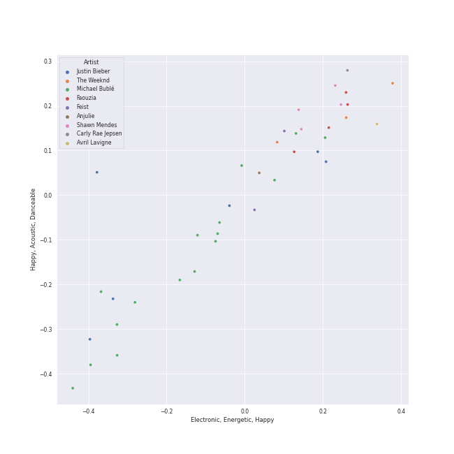
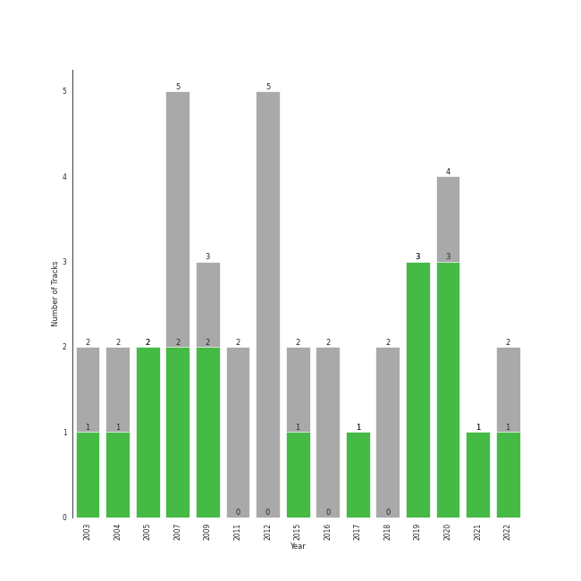

# canadian pop

37 songs

[See Track Features](audio_features.md)

[See Clusters](clusters/overview.md)

## Top Artists

| Art | Tracks | 💚 | Artist | 🔗 |
|:---|---:|---:|:---|:---|
|  | 16 | 5 | [Michael Bublé](../../artists/michael_bublé/overview.md) | [🔗](https://open.spotify.com/artist/1GxkXlMwML1oSg5eLPiAz3) |
|  | 7 | 3 | [Justin Bieber](../../artists/justin_bieber/overview.md) | [🔗](https://open.spotify.com/artist/1uNFoZAHBGtllmzznpCI3s) |
|  | 4 | 2 | Shawn Mendes | [🔗](https://open.spotify.com/artist/7n2wHs1TKAczGzO7Dd2rGr) |
|  | 2 | 1 | The Weeknd | [🔗](https://open.spotify.com/artist/1Xyo4u8uXC1ZmMpatF05PJ) |
|  | 1 | 1 | Alanis Morissette | [🔗](https://open.spotify.com/artist/6ogn9necmbUdCppmNnGOdi) |
|  | 1 | 1 | benny blanco | [🔗](https://open.spotify.com/artist/5CiGnKThu5ctn9pBxv7DGa) |
|  | 1 | 1 | [Camila Cabello](../../artists/camila_cabello/overview.md) | [🔗](https://open.spotify.com/artist/4nDoRrQiYLoBzwC5BhVJzF) |
|  | 1 | 1 | Anjulie | [🔗](https://open.spotify.com/artist/4DTbdShHu2RPYEEMUp2XWV) |
|  | 1 | 1 | Avril Lavigne | [🔗](https://open.spotify.com/artist/0p4nmQO2msCgU4IF37Wi3j) |
|  | 4 | 0 | Faouzia | [🔗](https://open.spotify.com/artist/5NhgsV7qPWHZqYEMKzbYvo) |

See all 18 artists

| Art | Tracks | 💚 | Artist | 🔗 |
|:---|---:|---:|:---|:---|
|  | 1 | 0 | Carly Rae Jepsen | [🔗](https://open.spotify.com/artist/6sFIWsNpZYqfjUpaCgueju) |
|  | 1 | 0 | Cécile McLorin Salvant | [🔗](https://open.spotify.com/artist/6PkSULcbxFKkxdgrmPGAvn) |
|  | 1 | 0 | Meghan Trainor | [🔗](https://open.spotify.com/artist/6JL8zeS1NmiOftqZTRgdTz) |
|  | 1 | 0 | Feist | [🔗](https://open.spotify.com/artist/6CWTBjOJK75cTE8Xv8u1kj) |
|  | 1 | 0 | John Legend | [🔗](https://open.spotify.com/artist/5y2Xq6xcjJb2jVM54GHK3t) |
|  | 1 | 0 | [Daft Punk](../../artists/daft_punk/overview.md) | [🔗](https://open.spotify.com/artist/4tZwfgrHOc3mvqYlEYSvVi) |
|  | 1 | 0 | Mariah Carey | [🔗](https://open.spotify.com/artist/4iHNK0tOyZPYnBU7nGAgpQ) |
|  | 1 | 0 | The Puppini Sisters | [🔗](https://open.spotify.com/artist/1svaANJTE5KrG16fTGDqOs) |

## Top Albums

| Art | Tracks | 💚 | Album | Release Date | 🔗 |
|:---|---:|---:|:---|:---|:---|
|  | 4 | 0 | Christmas (Deluxe Special Edition) | 2012-11-09 | [🔗](https://open.spotify.com/album/7uVimUILdzSZG4KKKWToq0) |
|  | 3 | 1 | Call Me Irresponsible | 2007-04-30 | [🔗](https://open.spotify.com/album/3h4pyWRJIB9ZyRKXChbX22) |
|  | 2 | 2 | It's Time | 2005-02-08 | [🔗](https://open.spotify.com/album/457fktVFXVwjQTl9wOLlfg) |
|  | 2 | 1 | Purpose (Deluxe) | 2015-11-13 | [🔗](https://open.spotify.com/album/6Fr2rQkZ383FcMqFyT7yPr) |
|  | 2 | 1 | Michael Bublé | 2003 | [🔗](https://open.spotify.com/album/3rpSksJSFdNFqk5vne8at2) |
|  | 2 | 1 | Crazy Love | 2009-10-06 | [🔗](https://open.spotify.com/album/3MXDonOIzrIrCh0HvlACyj) |
|  | 2 | 0 | Under The Mistletoe (Deluxe Edition) | 2011-01-01 | [🔗](https://open.spotify.com/album/63MKT9hwmiMFFdFp5SdB1p) |
|  | 1 | 1 | Under My Skin | 2004 | [🔗](https://open.spotify.com/album/7851Vsjv3apS52sXUik6iF) |
|  | 1 | 1 | Romance | 2019-12-06 | [🔗](https://open.spotify.com/album/3Vsbl0diFGw8HNSjG8ue9m) |
|  | 1 | 1 | Lonely (with benny blanco) | 2020-10-16 | [🔗](https://open.spotify.com/album/3P5WIUJO0Ots1lQx09TOxk) |

See all 27 albums

| Art | Tracks | 💚 | Album | Release Date | 🔗 |
|:---|---:|---:|:---|:---|:---|
|  | 1 | 1 | Justice | 2021-03-19 | [🔗](https://open.spotify.com/album/5dGWwsZ9iB2Xc3UKR0gif2) |
|  | 1 | 1 | Jagged Little Pill | 1995-06-09 | [🔗](https://open.spotify.com/album/09AwlP99cHfKVNKv4FC8VW) |
|  | 1 | 1 | Illuminate (Deluxe) | 2017-04-20 | [🔗](https://open.spotify.com/album/3wBabo4pmzsYjALMSKY7Iq) |
|  | 1 | 1 | Anjulie | 2009-01-01 | [🔗](https://open.spotify.com/album/13ablPhINDfXMbbvgX7eLw) |
|  | 1 | 1 | After Hours | 2020-03-20 | [🔗](https://open.spotify.com/album/4yP0hdKOZPNshxUOjY0cZj) |
|  | 1 | 0 | love (Deluxe Edition) | 2018-11-16 | [🔗](https://open.spotify.com/album/68xKnVblFsSQ48CtgZT0oY) |
|  | 1 | 0 | This Mountain | 2018-10-05 | [🔗](https://open.spotify.com/album/6mpS8wIedYl2hcHVowz6CC) |
|  | 1 | 0 | The Reminder | 2007-01-01 | [🔗](https://open.spotify.com/album/7bTdGfczXffzzNE9ssJj4Z) |
|  | 1 | 0 | Tears of Gold | 2019-11-20 | [🔗](https://open.spotify.com/album/7INSJKOxZcMGywJyf9bEWi) |
|  | 1 | 0 | Starboy | 2016-11-25 | [🔗](https://open.spotify.com/album/2ODvWsOgouMbaA5xf0RkJe) |
|  | 1 | 0 | Shawn Mendes | 2018-05-25 | [🔗](https://open.spotify.com/album/2VP96XdMOKTXefI8Nui23s) |
|  | 1 | 0 | Nobody but Me | 2016-10-21 | [🔗](https://open.spotify.com/album/5wN1OizIFEHDUkRwzIK3wL) |
|  | 1 | 0 | Monster | 2020-11-20 | [🔗](https://open.spotify.com/album/3yVVL2EYLp8g7gT08VvYKy) |
|  | 1 | 0 | Kiss (Deluxe) | 2012-01-01 | [🔗](https://open.spotify.com/album/29blfJv8AddJrjuG3DpE13) |
|  | 1 | 0 | Come Fly with Me | 2004-03-30 | [🔗](https://open.spotify.com/album/0UhvDeKmtgegXeELEVgGRh) |
|  | 1 | 0 | CITIZENS | 2022-05-19 | [🔗](https://open.spotify.com/album/3nh4uK04eRkHyrxIDWEfkp) |
|  | 1 | 0 | Born Without a Heart | 2019-03-28 | [🔗](https://open.spotify.com/album/5EOIYFpu56h7AgQxCRcyZG) |

## Top Record Labels

| Tracks | 💚 | Label |
|---:|---:|:---|
| 16 | 5 | [Reprise](../../labels/reprise/overview.md) |
| 14 | 5 | [143](../../labels/143/overview.md) |
| 5 | 2 | RBMG |
| 5 | 2 | Def Jam |
| 3 | 1 | [Island Records](../../labels/island_records/overview.md) |
| 1 | 1 | [Syco Music](../../labels/syco_music/overview.md) |
| 1 | 1 | [Republic Records](../../labels/republic_records/overview.md) |
| 1 | 1 | Maverick |
| 1 | 1 | [Interscope Records](../../labels/interscope_records/overview.md) |
| 1 | 1 | Hear Music |

See all 21 labels

| Tracks | 💚 | Label |
|---:|---:|:---|
| 1 | 1 | Friends Keep Secrets |
| 1 | 1 | [Epic](../../labels/epic/overview.md) |
| 1 | 1 | [Def Jam Recordings](../../labels/def_jam_recordings/overview.md) |
| 1 | 1 | Arista |
| 2 | 0 | Faouzia 2019 |
| 1 | 0 | Universal Republic Records |
| 1 | 0 | Universal Music Division One Records |
| 1 | 0 | Silent Records IGA |
| 1 | 0 | Shawn Mendes LP4-5 PS |
| 1 | 0 | Faouzia Music 2018 |
| 1 | 0 | [Atlantic Records](../../labels/atlantic_records/overview.md) |

## Top Producers

| Art | Producer | Tracks | Credit Types |
|:---|:---|---:|:---|
| | Alan Chang | 3 | Songwriter, Arranger |
|  | [Michael Bublé](../../artists/michael_bublé/overview.md) | 3 | Songwriter, Arranger |
| | David Foster | 3 | Producer, Arranger |
|  | benny blanco | 3 | Producer, Songwriter |
| | Amy Foster-Gillies | 3 | Songwriter |
|  | [Justin Bieber](../../artists/justin_bieber/overview.md) | 3 | Songwriter |
| | Humberto Gatica | 3 | Producer |
| | Neil Devor | 2 | Producer |
| | Jochem van der Saag | 2 | Producer |
|  | Shawn Mendes | 2 | Songwriter |

View all

| Art | Producer | Tracks | Credit Types |
|:---|:---|---:|:---|
| | Serban Ghenea | 2 | Producer |
| | Bob Rock | 2 | Producer, Arranger |
| | Alejandro Rodríguez (Rodríguez, Alejandro) | 2 | Producer |
| | Josh Gudwin | 2 | Producer |
|  | Van Morrison | 1 | Lyricist, Songwriter |
| | Tom Lord-Alge | 1 | Producer |
| | Teddy Geiger | 1 | Songwriter |
| | John Hanes | 1 | Producer |
| | Cashmere Cat | 1 | Producer, Songwriter |
| | Lou Pomanti | 1 | Arranger |
| | Anthony Newley | 1 | Songwriter |
| | DaHeala | 1 | Songwriter |
| | Oscar Holter | 1 | Producer, Songwriter |
| | David Schiffman | 1 | Producer |
| | Ted Blaisdell | 1 | Producer |
| | Ed Sheeran | 1 | Songwriter |
| | Tia Scola | 1 | Songwriter |
| | Jimmy Boyelle | 1 | Producer |
|  | The Weeknd | 1 | Producer, Songwriter |
| | Shin Kamiyama | 1 | Producer |
| | Andrew Watt | 1 | Producer, Songwriter |
| | Daniel James | 1 | Producer, Songwriter |
| | Glen Ballard | 1 | Producer, Songwriter |
|  | [Camila Cabello](../../artists/camila_cabello/overview.md) | 1 | Songwriter |
| | Ali Tamposi | 1 | Songwriter |
| | FINNEAS | 1 | Producer, Songwriter |
| | Leslie Bricusse | 1 | Songwriter |
|  | Charli XCX | 1 | Songwriter |
| | Zubin Thakkar | 1 | Producer |
| | Butch Walker | 1 | Producer, Songwriter |
| | Paul LaMalfa | 1 | Producer |
| | Jack Patterson | 1 | Songwriter |
|  | Alanis Morissette | 1 | Lyricist, Songwriter |
| | Leah Haywood | 1 | Songwriter |
| | Geoff Warburton | 1 | Songwriter |
| | Scott Harris | 1 | Songwriter |
| | Jake Torrey | 1 | Producer, Songwriter |
| | Nathaniel Alford | 1 | Producer |
| | Chris "Tek" O'Ryan | 1 | Producer |
| | Max Martin | 1 | Producer, Songwriter |
| | Dreamlab | 1 | Producer |
| | Chris Fogel | 1 | Producer |
| | Don Sebesky | 1 | Arranger |
| | William Ross | 1 | Arranger |
|  | Avril Lavigne | 1 | Songwriter |
| | Belly | 1 | Songwriter |

## Years

| ​ | 10 newest albums | ​​ | 10 oldest albums |
|:---|:---|:---|:---|
|  | CITIZENS (2022-05-19) |  | Jagged Little Pill (1995-06-09) |
|  | Justice (2021-03-19) |  | Michael Bublé (2003) |
|  | Monster (2020-11-20) |  | Under My Skin (2004) |
|  | Lonely (with benny blanco) (2020-10-16) |  | Come Fly with Me (2004-03-30) |
|  | After Hours (2020-03-20) |  | It's Time (2005-02-08) |
|  | Romance (2019-12-06) |  | The Reminder (2007-01-01) |
|  | Tears of Gold (2019-11-20) |  | Call Me Irresponsible (2007-04-30) |
|  | Born Without a Heart (2019-03-28) |  | Anjulie (2009-01-01) |
|  | love (Deluxe Edition) (2018-11-16) |  | Crazy Love (2009-10-06) |
|  | This Mountain (2018-10-05) |  | Under The Mistletoe (Deluxe Edition) (2011-01-01) |

