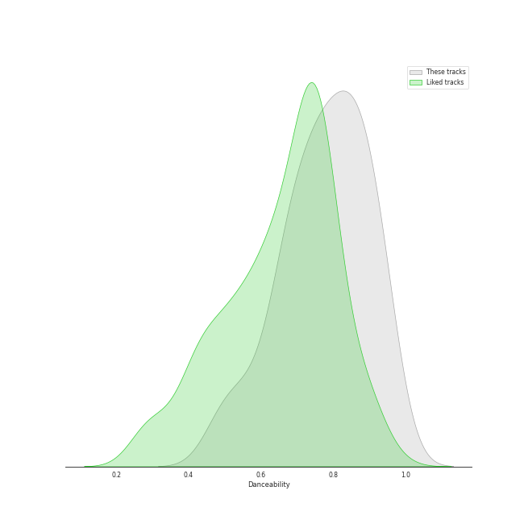
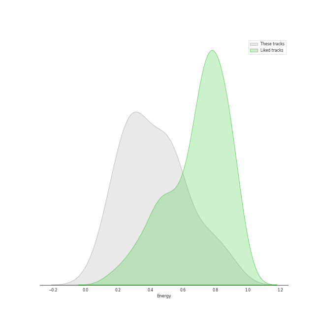
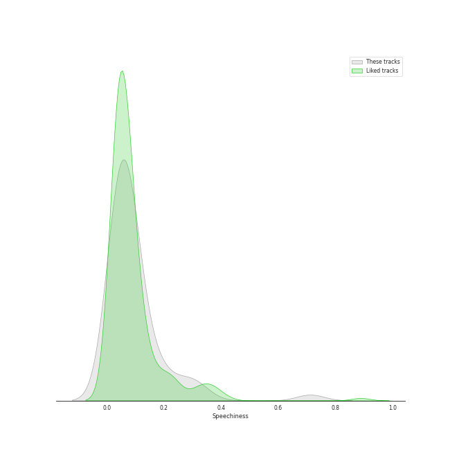
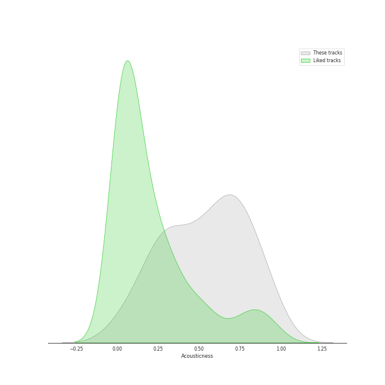
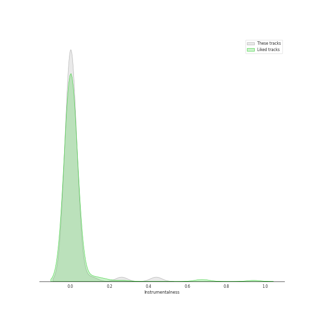
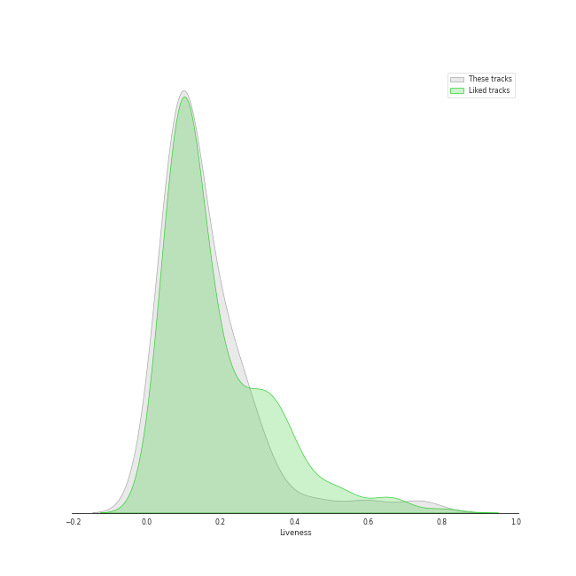
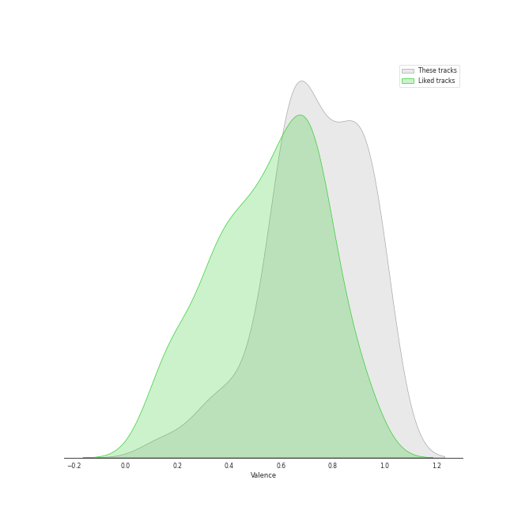
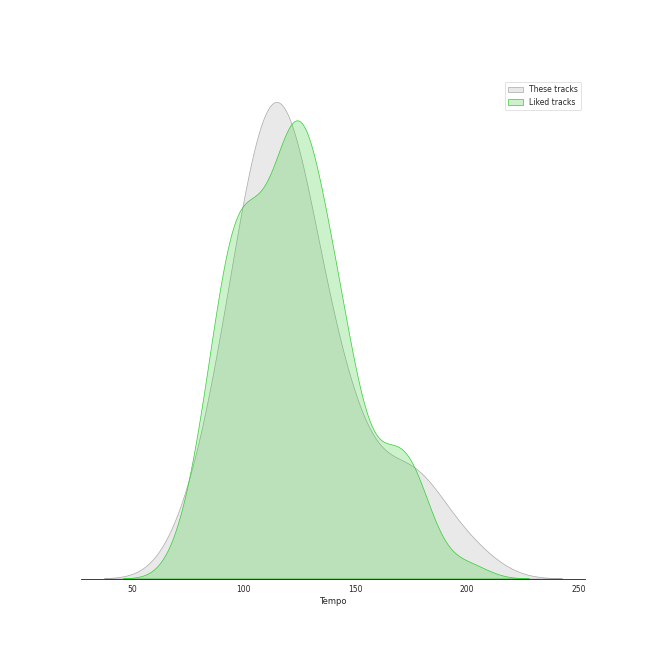

# Track Features for children's music

## Danceability

| ​ | 10 most Danceable tracks | ​​ | 10 least Danceable tracks |
|:---|:---|:---|:---|
|  | The Wheels on the Bus Go Round and Round (0.969) |  | You Are My Sunshine (Version 1) (0.477) |
|  | Five Little Monkeys (0.948) |  | Shake Your Sillies Out (0.494) |
|  | 5 Little Speckled Frogs (0.942) |  | Animals Sound Fun (0.53) |
|  | One Little Finger (0.94) |  | The Goldfish (0.539) |
|  | Abc Phonics Song (0.938) |  | The Chicken Dance (0.589) |
|  | If you are happy and you know it (0.92) |  | Bumblebee (Buzz Buzz) (0.593) |
|  | 5 Little Ducks (0.92) |  | Shake Break (0.633) |
|  | Hickory Dickory Dock (0.911) |  | Goin' to the Zoo (0.649) |
|  | Dinosaur Stomp (0.904) |  | Walk and You Walk and You Walk and You Stop! (0.655) |
|  | Itsy Bitsy Spider (0.901) |  | We Are The Dinosaurs (0.662) |

## Energy

| ​ | 10 most Energetic tracks | ​​ | 10 least Energetic tracks |
|:---|:---|:---|:---|
|  | Here We Go 'Round the Mulberry Bush (0.898) |  | Letter Sounds (apple apple aaa) (0.0601) |
|  | Baby Shark (0.886) |  | Slippery Fish (0.111) |
|  | The Chicken Dance (0.831) |  | Hickory Dickory Dock (0.138) |
|  | Shake Break (0.783) |  | Hello Song (0.176) |
|  | Choo Choo Train (0.738) |  | You Are My Sunshine (Version 1) (0.179) |
|  | Daddy Finger (The Finger Family) (0.737) |  | Open Shut Them (0.187) |
|  | Hot Potato (0.737) |  | The Wheels on the Bus (0.189) |
|  | 7 Days of the Week (0.689) |  | Tap Your Toe And Follow Me (0.203) |
|  | Shake Your Sillies Out (0.627) |  | Five Little Monkeys (0.207) |
|  | Head, Shoulders, Knees and Toes (0.61) |  | One Little Finger (0.213) |

## Speechiness

| ​ | 10 most Speechy tracks | ​​ | 10 least Speechy tracks |
|:---|:---|:---|:---|
|  | Walk and You Walk and You Walk and You Stop! (0.713) |  | Bingo (0.0254) |
|  | Slippery Fish (0.335) |  | Sally the Camel (0.0266) |
|  | Icky Sticky Bubble Gum (0.295) |  | 10 Little Numbers (0.0297) |
|  | The Chicken Dance (0.295) |  | Lavender's Blue (0.0307) |
|  | Going On A Bear Hunt (0.261) |  | This Old Man (0.0313) |
|  | Animals Sound Fun (0.205) |  | Once I Caught a Fish Alive (0.0319) |
|  | Goin' to the Zoo (0.199) |  | Frere Jacques (0.0323) |
|  | Three Little Birds (0.183) |  | 7 Days of the Week (0.0329) |
|  | The Goldfish (0.161) |  | Old MacDonald Had a Farm (0.0355) |
|  | Drivin' in My Car (0.147) |  | You Are My Sunshine (Version 1) (0.0356) |

## Acousticness

| ​ | 10 most Acoustic tracks | ​​ | 10 least Acoustic tracks |
|:---|:---|:---|:---|
|  | Hickory Dickory Dock (0.977) |  | Shake Break (0.000583) |
|  | Lavender's Blue (0.928) |  | Hot Potato (0.0289) |
|  | You Are My Sunshine (Version 1) (0.908) |  | The Chicken Dance (0.104) |
|  | 5 Little Speckled Frogs (0.898) |  | Daddy Finger (The Finger Family) (0.145) |
|  | Pat-a-Cake (0.884) |  | The Finger Family (Daddy Finger) (0.175) |
|  | Frere Jacques (0.88) |  | Alphabet Animals (0.178) |
|  | Sleeping Bunnies (0.87) |  | Wind the Bobbin Up (0.182) |
|  | 5 Little Ducks (0.819) |  | Choo Choo Train (0.245) |
|  | This Old Man (0.783) |  | Three Blind Mice (0.254) |
|  | Jump (0.782) |  | Baby Shark (0.259) |

## Instrumentalness

| ​ | 10 most Instrumental tracks | ​​ | 10 least Instrumental tracks |
|:---|:---|:---|:---|
|  | The Chicken Dance (0.439) |  | The Goldfish (0.0) |
|  | Alphabet Animals (0.261) |  | I'm A Little Teapot (0.0) |
|  | Hickory Dickory Dock (0.106) |  | Drivin' in My Car (0.0) |
|  | Skinnamarink (0.0305) |  | Wind the Bobbin Up (0.0) |
|  | The Finger Family (Daddy Finger) (0.000546) |  | Pat-a-Cake (0.0) |
|  | You Are My Sunshine (Version 1) (0.000458) |  | Choo Choo Train (0.0) |
|  | Sleeping Bunnies (0.000366) |  | The Wheels on the Bus (0.0) |
|  | Once I Caught a Fish Alive (0.000284) |  | Dinosaur Stomp (0.0) |
|  | Frere Jacques (0.000176) |  | The Farmer In The Dell (0.0) |
|  | Open Shut Them (7.31e-05) |  | Here We Go 'Round the Mulberry Bush (0.0) |

## Liveness

| ​ | 10 most Live tracks | ​​ | 10 least Live tracks |
|:---|:---|:---|:---|
|  | The Chicken Dance (0.741) |  | Daddy Finger (The Finger Family) (0.0273) |
|  | If you are happy and you know it (0.596) |  | I'm A Little Teapot (0.0433) |
|  | Slippery Fish (0.459) |  | Itsy Bitsy Spider (0.054) |
|  | Frere Jacques (0.345) |  | Baby Shark (0.0559) |
|  | The Finger Family (Daddy Finger) (0.319) |  | Three Little Birds (0.0616) |
|  | Wind the Bobbin Up (0.277) |  | Alphabet Animals (0.0633) |
|  | Shake Break (0.271) |  | Abc Phonics Song (0.0655) |
|  | Here We Go 'Round the Mulberry Bush (0.267) |  | Sally the Camel (0.0675) |
|  | Shake Your Sillies Out (0.258) |  | Going On A Bear Hunt (0.0677) |
|  | Choo Choo Train (0.254) |  | The Ants Go Marching (0.0758) |

## Valence

| ​ | 10 most Happy tracks | ​​ | 10 least Happy tracks |
|:---|:---|:---|:---|
|  | If you are happy and you know it (0.977) |  | Once I Caught a Fish Alive (0.142) |
|  | Drivin' in My Car (0.976) |  | Going On A Bear Hunt (0.294) |
|  | Here We Go 'Round the Mulberry Bush (0.971) |  | 10 Little Numbers (0.325) |
|  | The Wheels on the Bus Go Round and Round (0.968) |  | Open Shut Them (0.389) |
|  | The Chicken Dance (0.967) |  | Walk and You Walk and You Walk and You Stop! (0.414) |
|  | Clean Up (0.967) |  | Letter Sounds (apple apple aaa) (0.476) |
|  | Shake Break (0.964) |  | Old MacDonald Had a Farm (0.546) |
|  | 5 Little Speckled Frogs (0.964) |  | Three Blind Mice (0.552) |
|  | 7 Days of the Week (0.955) |  | Slippery Fish (0.556) |
|  | Hot Potato (0.948) |  | Frere Jacques (0.597) |

## Tempo

| ​ | 10 most Fast tracks | ​​ | 10 least Fast tracks |
|:---|:---|:---|:---|
|  | Shake Your Sillies Out (204.299) |  | 7 Days of the Week (75.916) |
|  | Bumblebee (Buzz Buzz) (191.886) |  | Sally the Camel (77.994) |
|  | Shake Break (182.147) |  | The Wheels on the Bus (84.763) |
|  | The Chicken Dance (181.786) |  | Goin' to the Zoo (89.56) |
|  | Animals Sound Fun (173.879) |  | Bingo (92.511) |
|  | You Are My Sunshine (Version 1) (172.046) |  | Icky Sticky Bubble Gum (93.018) |
|  | Hot Potato (170.925) |  | Hickory Dickory Dock (95.016) |
|  | Here We Go 'Round the Mulberry Bush (165.009) |  | 5 Little Speckled Frogs (98.039) |
|  | Three Blind Mice (151.341) |  | Once I Caught a Fish Alive (98.05) |
|  | Three Little Birds (150.065) |  | The Goldfish (99.468) |
