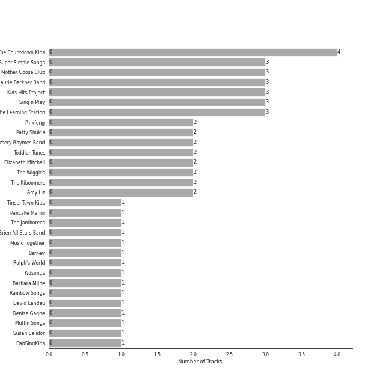
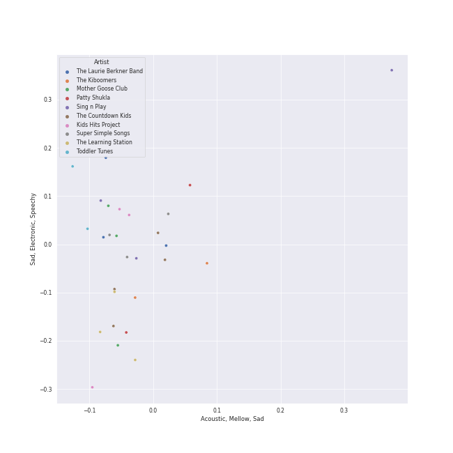
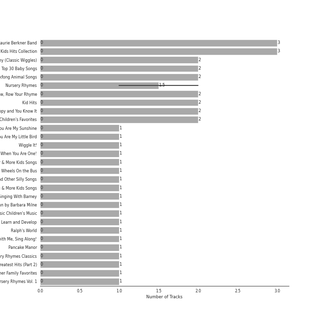
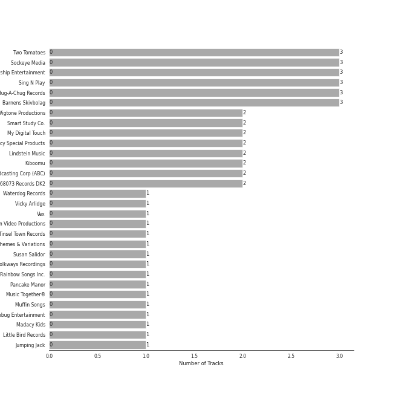
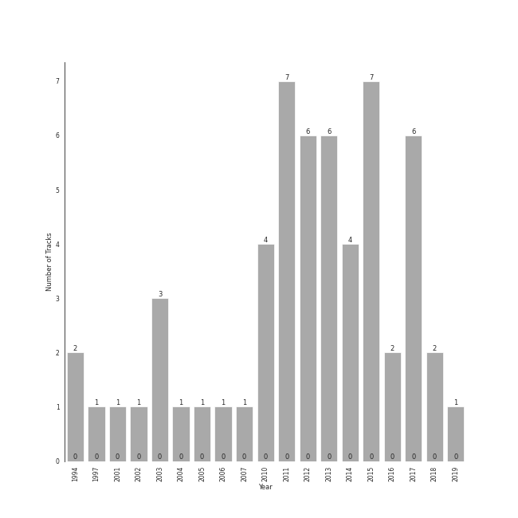

# children's music

57 songs

[See Track Features](audio_features.md)

[See Clusters](clusters/overview.md)

## Top Artists

| Art | Rank | Tracks | 💚 | Artist | 🔗 |
|:---|---:|---:|---:|:---|:---|
|  | 435 | 4 | 0 | The Countdown Kids | [🔗](https://open.spotify.com/artist/6PZYFmF3PH6cOREAzfXiAL) |
|  | 435 | 3 | 0 | Super Simple Songs | [🔗](https://open.spotify.com/artist/7CdGfkCRgPhElnqy3HPJ4a) |
|  | 435 | 3 | 0 | Mother Goose Club | [🔗](https://open.spotify.com/artist/6h76MLMaPUoWVPC7VnEw86) |
|  | 435 | 3 | 0 | The Laurie Berkner Band | [🔗](https://open.spotify.com/artist/6T2pk5T8c4Wi61x1v84sUa) |
|  | 435 | 3 | 0 | Kids Hits Project | [🔗](https://open.spotify.com/artist/5crHUpHfUcFlS7t1qVGSRO) |
|  | 435 | 3 | 0 | Sing n Play | [🔗](https://open.spotify.com/artist/3at1vTRcH8tM7ZmnGXyiZs) |
|  | 435 | 3 | 0 | The Learning Station | [🔗](https://open.spotify.com/artist/0qIXXh38Do2fvBqiUjiHbm) |
|  | 435 | 2 | 0 | Pinkfong | [🔗](https://open.spotify.com/artist/7cTXfwpe9peK0UE1bZyIWZ) |
|  | 435 | 2 | 0 | Patty Shukla | [🔗](https://open.spotify.com/artist/6lQcPZtrhQfbSkXafngUYc) |
|  | 435 | 2 | 0 | Belle and the Nursery Rhymes Band | [🔗](https://open.spotify.com/artist/6YFrVMB5AEMZ2rB3T0wyUQ) |

See all 34 artists

| Art | Rank | Tracks | 💚 | Artist | 🔗 |
|:---|---:|---:|---:|:---|:---|
|  | 435 | 2 | 0 | Toddler Tunes | [🔗](https://open.spotify.com/artist/3uGrMgq7tseqZq7FCjMGnW) |
|  | 435 | 2 | 0 | Elizabeth Mitchell | [🔗](https://open.spotify.com/artist/3gBQ1U5dXpRXS6tlbyNTDM) |
|  | 435 | 2 | 0 | The Wiggles | [🔗](https://open.spotify.com/artist/2JY5qzEozvTdogkDTkkOMf) |
|  | 435 | 2 | 0 | The Kiboomers | [🔗](https://open.spotify.com/artist/1qKLikeNYpQFSsDAjg7HpI) |
|  | 435 | 2 | 0 | Amy Liz | [🔗](https://open.spotify.com/artist/1bguJ0c7PghwoaLvBIVU3A) |
|  | 435 | 1 | 0 | Tinsel Town Kids | [🔗](https://open.spotify.com/artist/7ofMbMyqQ9qMUVoFjY7mYi) |
|  | 435 | 1 | 0 | Pancake Manor | [🔗](https://open.spotify.com/artist/6bwjTCySXPwecMWvs9ce5C) |
|  | 435 | 1 | 0 | The Jamborees | [🔗](https://open.spotify.com/artist/5fpJ1JmUCDq0xvMuqOoBAo) |
|  | 435 | 1 | 0 | The Paul O'Brien All Stars Band | [🔗](https://open.spotify.com/artist/4yHvX6BSc9IUxGOQLQdEEl) |
|  | 435 | 1 | 0 | Music Together | [🔗](https://open.spotify.com/artist/4tP1lAjaYb9szKruOsoL97) |
|  | 435 | 1 | 0 | Barney | [🔗](https://open.spotify.com/artist/4rB5wLJLaXdMrXaYsOYLmK) |
|  | 435 | 1 | 0 | Ralph's World | [🔗](https://open.spotify.com/artist/4qIIexaFmYNueu5mnSQnzU) |
|  | 435 | 1 | 0 | Kidsongs | [🔗](https://open.spotify.com/artist/4kFnO9EhFN74EK1a2UH5ZW) |
|  | 435 | 1 | 0 | Barbara Milne | [🔗](https://open.spotify.com/artist/4MQPTZi9TH3JNc6yGnLp6x) |
|  | 435 | 1 | 0 | Rainbow Songs | [🔗](https://open.spotify.com/artist/40TPC7EFk2MCuSBxvRfCOF) |
|  | 435 | 1 | 0 | David Landau | [🔗](https://open.spotify.com/artist/2xIaXC0ztnAJkUsZWFVSPV) |
|  | 435 | 1 | 0 | Denise Gagne | [🔗](https://open.spotify.com/artist/2WEehmCcEKeVZWD6qYkXuk) |
|  | 435 | 1 | 0 | Muffin Songs | [🔗](https://open.spotify.com/artist/2PHC7cyBiJM9EZ0E8FKcJ4) |
|  | 435 | 1 | 0 | Susan Salidor | [🔗](https://open.spotify.com/artist/1yWG6rEJxrAMdIMhpo4L4C) |
|  | 435 | 1 | 0 | DanSingKids | [🔗](https://open.spotify.com/artist/1u3XOsgRlZZM0e9T360uNs) |
|  | 435 | 1 | 0 | Vicky Arlidge | [🔗](https://open.spotify.com/artist/1t8gwZFUoJEM9nhSJxT7ks) |
|  | 435 | 1 | 0 | Nursery Rhymes Band | [🔗](https://open.spotify.com/artist/1hhxuU75sJtitW71UWiCAP) |
|  | 435 | 1 | 0 | Bounce Patrol | [🔗](https://open.spotify.com/artist/1S9SPfRo9eyxOcyfUGC2Tm) |
|  | 435 | 1 | 0 | Little Baby Bum Nursery Rhyme Friends | [🔗](https://open.spotify.com/artist/0lFDQOEK5OwsyPXb1aWJzY) |

## Most and least listened tracks
| Rank | ​ | Most listened tracks | Rank | ​​ | Least listened tracks |
|---:|:---|:---|---:|:---|:---|
| 1018 |  | The Goldfish | 1018 |  | Bumblebee (Buzz Buzz) |
| 1018 |  | I'm A Little Teapot | 1018 |  | Slippery Fish |
| 1018 |  | Frere Jacques | 1018 |  | Daddy Finger (The Finger Family) |
| 1018 |  | Letter Sounds (apple apple aaa) | 1018 |  | The Wheels on the Bus Go Round and Round |
| 1018 |  | Drivin' in My Car | 1018 |  | Animals Sound Fun |
| 1018 |  | You Are My Sunshine (Version 1) | 1018 |  | If you are happy and you know it |
| 1018 |  | 5 Little Speckled Frogs | 1018 |  | Once I Caught a Fish Alive |
| 1018 |  | We Are The Dinosaurs | 1018 |  | Itsy Bitsy Spider |
| 1018 |  | Clean Up | 1018 |  | Alphabet Animals |
| 1018 |  | Lavender's Blue | 1018 |  | Hot Potato |

## Top Albums

| Art | Rank | Tracks | 💚 | Album | Release Date | 🔗 |
|:---|---:|---:|---:|:---|:---|:---|
|  | 667 | 3 | 0 | The Best of The Laurie Berkner Band | 2010-06-29 | [🔗](https://open.spotify.com/album/7elEglYu8DF6c62vrwQNHB) |
|  | 667 | 3 | 0 | Kids Hits Collection | 2015-11-18 | [🔗](https://open.spotify.com/album/7FSFdyif4fkGcZlvx7VrRx) |
|  | 667 | 2 | 0 | Yummy Yummy (Classic Wiggles) | 1994-03-12 | [🔗](https://open.spotify.com/album/2rLBCRdpYyPeCpm5hYrWtt) |
|  | 667 | 2 | 0 | Top 30 Baby Songs | 2014-05-09 | [🔗](https://open.spotify.com/album/5Obb6WdYPpNErfM33fcrn0) |
|  | 667 | 2 | 0 | Pinkfong Animal Songs | 2017-07-27 | [🔗](https://open.spotify.com/album/1S7mumn7D4riEX2gVWYgPO) |
|  | 667 | 2 | 0 | Nursery Rhymes | 2015-02-17 | [🔗](https://open.spotify.com/album/4xIdNaRkdvnnRa0EdvMiQ0) |
|  | 667 | 2 | 0 | Mother Goose Club Sings Nursery Rhymes Vol. 4: Row, Row, Row Your Rhyme | 2013-05-21 | [🔗](https://open.spotify.com/album/1j268hisybBFDdSwuYbD30) |
|  | 667 | 2 | 0 | Kid Hits | 2011-12-12 | [🔗](https://open.spotify.com/album/3eEFhktny6sy2XXwxp1pZJ) |
|  | 667 | 2 | 0 | If You're Happy and You Know It | 2013-01-01 | [🔗](https://open.spotify.com/album/4ifLp9U7X5BLo1HowExGss) |
|  | 667 | 2 | 0 | 150 All Time Children's Favorites | 2003-01-01 | [🔗](https://open.spotify.com/album/2LNPciMcwVbgqHsP4FRj6v) |

See all 45 albums

| Art | Rank | Tracks | 💚 | Album | Release Date | 🔗 |
|:---|---:|---:|---:|:---|:---|:---|
|  | 667 | 1 | 0 | You Are My Sunshine | 2002-01-01 | [🔗](https://open.spotify.com/album/7jxHX5gjHedHa2vTAZSPfY) |
|  | 667 | 1 | 0 | You Are My Little Bird | 2006-08-29 | [🔗](https://open.spotify.com/album/4GYfEguWQPqdBpFO1XC1eB) |
|  | 667 | 1 | 0 | Wiggle It! | 2013-05-31 | [🔗](https://open.spotify.com/album/6Ir95G9kmDceHbOPeZUM9U) |
|  | 667 | 1 | 0 | When You Are One! | 2012-10-22 | [🔗](https://open.spotify.com/album/4r4L2MZb1SaAkb52YNxDPn) |
|  | 667 | 1 | 0 | Twinkle Twinkle Little Star & More Kids Songs | 2017-03-24 | [🔗](https://open.spotify.com/album/5x1G4XCXE1i9021srH6cQg) |
|  | 667 | 1 | 0 | The Wheels On the Bus | 2011-07-01 | [🔗](https://open.spotify.com/album/1iuZ8H27OlJPyjnQXaUftG) |
|  | 667 | 1 | 0 | The Chicken Dance and Other Silly Songs | 2013-01-01 | [🔗](https://open.spotify.com/album/6uDInUcLuJElPuuW5kAKtZ) |
|  | 667 | 1 | 0 | The Bath Song & More Kids Songs | 2017-03-24 | [🔗](https://open.spotify.com/album/5NCGJqs3KjGNEvSFwsfmYn) |
|  | 667 | 1 | 0 | Start Singing With Barney | 2003-05-30 | [🔗](https://open.spotify.com/album/7v0TluAW6ljW8xzgQP0yyK) |
|  | 667 | 1 | 0 | Sounds Like Fun by Barbara Milne | 2010-08-17 | [🔗](https://open.spotify.com/album/47sxgesT4JUa5XH9GXHoQ6) |
|  | 667 | 1 | 0 | Songs for Kids: Classic Children's Music | 2016-03-01 | [🔗](https://open.spotify.com/album/1UQoOLZVLfq3Gbkz5Gca7I) |
|  | 667 | 1 | 0 | Sing and Learn, Vol. 2 - A Collection of Action Songs to Help Little Ones Learn and Develop | 2011-12-01 | [🔗](https://open.spotify.com/album/1Rg9m2xpwB2zrsOPyCXEOG) |
|  | 667 | 1 | 0 | Ralph's World | 2015-07-06 | [🔗](https://open.spotify.com/album/5wKoYzvE2R6xGvbw5tkWQa) |
|  | 667 | 1 | 0 | Play with Me, Sing Along! | 2012-10-12 | [🔗](https://open.spotify.com/album/0PGKxxYVEpD1jSlr3ipoPZ) |
|  | 667 | 1 | 0 | Pancake Manor | 2012-09-11 | [🔗](https://open.spotify.com/album/6SCnHCUmOHe77UlUouWyrO) |
|  | 667 | 1 | 0 | Nursery Rhymes Classics | 2016-08-28 | [🔗](https://open.spotify.com/album/72vvkjRrkR6mmvGppIwxGV) |
|  | 667 | 1 | 0 | Nursery Rhymes | 2018-09-26 | [🔗](https://open.spotify.com/album/0h027UmMZqwOB0z8S9LUb1) |
|  | 667 | 1 | 0 | Musicplay Grade 1 Greatest Hits (Part 2) | 2011-06-17 | [🔗](https://open.spotify.com/album/4hUcJPkR7ClP5NgVAhmqeE) |
|  | 667 | 1 | 0 | Music Together Family Favorites | 2007-10-29 | [🔗](https://open.spotify.com/album/5j4KKoFx43COarCFybOCpJ) |
|  | 667 | 1 | 0 | Mother Goose Club Sings Nursery Rhymes Vol. 1 | 2011-04-28 | [🔗](https://open.spotify.com/album/79hTHRJbDctpb2CfjHRoGQ) |
|  | 667 | 1 | 0 | More Songs for Kids: Classic Children's Music | 2017-01-27 | [🔗](https://open.spotify.com/album/5e8l68LDHcqtFTDLTlp6ZT) |
|  | 667 | 1 | 0 | Let's Go Camping: Essential Adventure and Nature Songs for Kids | 2019-07-19 | [🔗](https://open.spotify.com/album/5tLdZ6dBVyHDym69u0cKWy) |
|  | 667 | 1 | 0 | Learning Songs | 2017-11-01 | [🔗](https://open.spotify.com/album/3jMQX3qGGQO2AOoocpdoaG) |
|  | 667 | 1 | 0 | Kidsongs: The 50 Greatest Animal Songs | 2011-08-31 | [🔗](https://open.spotify.com/album/34agSIEz7EoBr7SskOn1Ba) |
|  | 667 | 1 | 0 | Kids and Kitties | 2005-02-11 | [🔗](https://open.spotify.com/album/5dO917ENOex3W1RnneH0wv) |
|  | 667 | 1 | 0 | Fun Songs for Kids | 2001-01-01 | [🔗](https://open.spotify.com/album/3l5NKqOZFYoXX357okAjBh) |
|  | 667 | 1 | 0 | DansingKids: Growing through music | 2014-12-01 | [🔗](https://open.spotify.com/album/4NZFHJIORiv7aY565QWAKO) |
|  | 667 | 1 | 0 | Come And Make A Circle: Twenty Terrific Songs For Kids And Teachers | 2004-02-27 | [🔗](https://open.spotify.com/album/0dYxuXTk8vHeGRvOkLbkHm) |
|  | 667 | 1 | 0 | Abc Phonics Song | 2012-09-03 | [🔗](https://open.spotify.com/album/4cNNe5IYhsrsio1Xh9jEVN) |
|  | 667 | 1 | 0 | 70 Best Kids Songs with Muffin Songs | 2015-10-12 | [🔗](https://open.spotify.com/album/37BC0FprChk9gFvr2RBw5d) |
|  | 667 | 1 | 0 | 7 Days of the Week | 2012-01-21 | [🔗](https://open.spotify.com/album/2FfXj8H2lGXuVpYeQg08xL) |
|  | 667 | 1 | 0 | 5 Little Speckled Frogs | 2018-07-13 | [🔗](https://open.spotify.com/album/4trylpAhbmQ36mC74ccQEJ) |
|  | 667 | 1 | 0 | 5 Little Ducks | 2012-01-22 | [🔗](https://open.spotify.com/album/2Joy9acQCtY5JeU9WyiQia) |
|  | 667 | 1 | 0 | 30 Pre-School Kid Songs - Fun and Silly | 2014 | [🔗](https://open.spotify.com/album/4w9fHZXXLJKoBO55vhTLg8) |
|  | 667 | 1 | 0 | 30 Children's Playgroup Favourites | 1997 | [🔗](https://open.spotify.com/album/5vQmTO1D45DMUfSR3wOh1B) |

## Top Record Labels

| Tracks | 💚 | Label |
|---:|---:|:---|
| 3 | 0 | Two Tomatoes |
| 3 | 0 | Sockeye Media |
| 3 | 0 | Skyship Entertainment |
| 3 | 0 | Sing N Play |
| 3 | 0 | Hug-A-Chug Records |
| 3 | 0 | Barnens Skivbolag |
| 2 | 0 | Wigtone Productions |
| 2 | 0 | Smart Study Co. |
| 2 | 0 | My Digital Touch |
| 2 | 0 | Madacy Special Products |

See all 37 labels

| Tracks | 💚 | Label |
|---:|---:|:---|
| 2 | 0 | Lindstein Music |
| 2 | 0 | Kiboomu |
| 2 | 0 | [Australian Broadcasting Corp (ABC)](../../labels/australian_broadcasting_corp_(abc)/overview.md) |
| 2 | 0 | 568073 Records DK2 |
| 1 | 0 | Waterdog Records |
| 1 | 0 | Vicky Arlidge |
| 1 | 0 | Vex |
| 1 | 0 | Together Again Video Productions |
| 1 | 0 | Tinsel Town Records |
| 1 | 0 | Themes & Variations |
| 1 | 0 | Susan Salidor |
| 1 | 0 | Smithsonian Folkways Recordings |
| 1 | 0 | Rainbow Songs Inc. |
| 1 | 0 | Pancake Manor |
| 1 | 0 | Music Together® |
| 1 | 0 | Muffin Songs |
| 1 | 0 | Moonbug Entertainment |
| 1 | 0 | Madacy Kids |
| 1 | 0 | Little Bird Records |
| 1 | 0 | Jumping Jack |
| 1 | 0 | HIT Entertainment |
| 1 | 0 | Dockland Music |
| 1 | 0 | David Landau |
| 1 | 0 | DansingKids |
| 1 | 0 | Bounce Patrol |
| 1 | 0 | Billboard Studio |
| 1 | 0 | Barbara Milne |

## Years

| ​ | 10 newest albums | ​​ | 10 oldest albums |
|:---|:---|:---|:---|
|  | Let's Go Camping: Essential Adventure and Nature Songs for Kids (2019-07-19) |  | Yummy Yummy (Classic Wiggles) (1994-03-12) |
|  | Nursery Rhymes (2018-09-26) |  | 30 Children's Playgroup Favourites (1997) |
|  | 5 Little Speckled Frogs (2018-07-13) |  | Fun Songs for Kids (2001-01-01) |
|  | Learning Songs (2017-11-01) |  | You Are My Sunshine (2002-01-01) |
|  | Pinkfong Animal Songs (2017-07-27) |  | 150 All Time Children's Favorites (2003-01-01) |
|  | The Bath Song & More Kids Songs (2017-03-24) |  | Start Singing With Barney (2003-05-30) |
|  | Twinkle Twinkle Little Star & More Kids Songs (2017-03-24) |  | Come And Make A Circle: Twenty Terrific Songs For Kids And Teachers (2004-02-27) |
|  | More Songs for Kids: Classic Children's Music (2017-01-27) |  | Kids and Kitties (2005-02-11) |
|  | Nursery Rhymes Classics (2016-08-28) |  | You Are My Little Bird (2006-08-29) |
|  | Songs for Kids: Classic Children's Music (2016-03-01) |  | Music Together Family Favorites (2007-10-29) |

