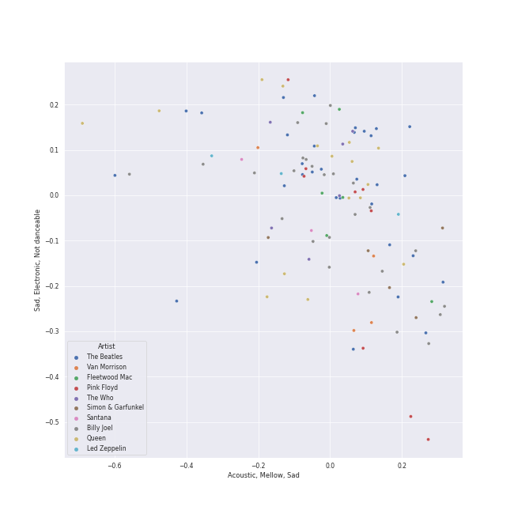

# classic rock

[120 songs](classic_rock_tracks.md)

## Top Artists

See all 26 artists

|   Number of Tracks | Art                                                                                              | Artist                                                 | 🔗                                                           |
|-------------------:|:-------------------------------------------------------------------------------------------------|:-------------------------------------------------------|:------------------------------------------------------------|
|                 31 |  | [The Beatles](../artists/the_beatles.md)               | [🔗](https://open.spotify.com/artist/3WrFJ7ztbogyGnTHbHJFl2) |
|                 23 |  | [Billy Joel](../artists/billy_joel.md)                 | [🔗](https://open.spotify.com/artist/6zFYqv1mOsgBRQbae3JJ9e) |
|                 14 |  | [Queen](../artists/queen.md)                           | [🔗](https://open.spotify.com/artist/1dfeR4HaWDbWqFHLkxsg1d) |
|                  6 |  | The Who                                                | [🔗](https://open.spotify.com/artist/67ea9eGLXYMsO2eYQRui3w) |
|                  6 |  | Fleetwood Mac                                          | [🔗](https://open.spotify.com/artist/08GQAI4eElDnROBrJRGE0X) |
|                  5 |  | Simon & Garfunkel                                      | [🔗](https://open.spotify.com/artist/70cRZdQywnSFp9pnc2WTCE) |
|                  4 |  | Van Morrison                                           | [🔗](https://open.spotify.com/artist/44NX2ffIYHr6D4n7RaZF7A) |
|                  3 |  | Led Zeppelin                                           | [🔗](https://open.spotify.com/artist/36QJpDe2go2KgaRleHCDTp) |
|                  3 |  | Journey                                                | [🔗](https://open.spotify.com/artist/0rvjqX7ttXeg3mTy8Xscbt) |
|                  2 |  | Aerosmith                                              | [🔗](https://open.spotify.com/artist/7Ey4PD4MYsKc5I2dolUwbH) |
|                  2 |  | [The King's Singers](../artists/the_king_s_singers.md) | [🔗](https://open.spotify.com/artist/5lR7yDVN4z9kahOiUSlMhe) |
|                  2 |  | Black Sabbath                                          | [🔗](https://open.spotify.com/artist/5M52tdBnJaKSvOpJGz8mfZ) |
|                  2 |  | Styx                                                   | [🔗](https://open.spotify.com/artist/4salDzkGmfycRqNUbyBphh) |
|                  2 |  | The Monkees                                            | [🔗](https://open.spotify.com/artist/320EPCSEezHt1rtbfwH6Ck) |
|                  2 |  | Carole King                                            | [🔗](https://open.spotify.com/artist/319yZVtYM9MBGqmSQnMyY6) |
|                  2 |  | Kansas                                                 | [🔗](https://open.spotify.com/artist/2hl0xAkS2AIRAu23TVMBG1) |
|                  2 |  | Paul Simon                                             | [🔗](https://open.spotify.com/artist/2CvCyf1gEVhI0mX6aFXmVI) |
|                  2 |  | The Rolling Stones                                     | [🔗](https://open.spotify.com/artist/22bE4uQ6baNwSHPVcDxLCe) |
|                  2 |  | Eagles                                                 | [🔗](https://open.spotify.com/artist/0ECwFtbIWEVNwjlrfc6xoL) |
|                  1 |  | Steve Miller Band                                      | [🔗](https://open.spotify.com/artist/6QtGlUje9TIkLrgPZrESuk) |
|                  1 |  | Foreigner                                              | [🔗](https://open.spotify.com/artist/6IRouO5mvvfcyxtPDKMYFN) |
|                  1 |  | The Black Crowes                                       | [🔗](https://open.spotify.com/artist/5krkohEVJYw0qoB5VWwxaC) |
|                  1 |  | Deep Purple                                            | [🔗](https://open.spotify.com/artist/568ZhdwyaiCyOGJRtNYhWf) |
|                  1 |  | Bonnie Raitt                                           | [🔗](https://open.spotify.com/artist/4KDyYWR7IpxZ7xrdYbKrqY) |
|                  1 |  | Harry Chapin                                           | [🔗](https://open.spotify.com/artist/42q4Ivs7tAiCZ5C7eG5q4c) |
|                  1 |  | Chicago                                                | [🔗](https://open.spotify.com/artist/3iDD7bnsjL9J4fO298r0L0) |

## Top Albums

See all 77 albums

|   Number of Tracks | Art                                                                                              | Album                                              | 🔗                                                          |
|-------------------:|:-------------------------------------------------------------------------------------------------|:---------------------------------------------------|:-----------------------------------------------------------|
|                  9 |  | Abbey Road (Remastered)                            | [🔗](https://open.spotify.com/album/0ETFjACtuP2ADo6LFhL6HN) |
|                  5 |  | The Stranger                                       | [🔗](https://open.spotify.com/album/3IILMjMMnoN2sKzgesX8KV) |
|                  5 |  | The Beatles (Remastered)                           | [🔗](https://open.spotify.com/album/1klALx0u4AavZNEvC4LrTL) |
|                  3 |  | The Game                                           | [🔗](https://open.spotify.com/album/1h0j80HhdzIMsUGUFiVkqa) |
|                  3 |  | Rumours (Super Deluxe)                             | [🔗](https://open.spotify.com/album/0BwWUstDMUbgq2NYONRqlu) |
|                  3 |  | Revolver (Remastered)                              | [🔗](https://open.spotify.com/album/3PRoXYsngSwjEQWR5PsHWR) |
|                  3 |  | Magical Mystery Tour (Remastered)                  | [🔗](https://open.spotify.com/album/2BtE7qm1qzM80p9vLSiXkj) |
|                  3 |  | Let It Be (Remastered)                             | [🔗](https://open.spotify.com/album/0jTGHV5xqHPvEcwL8f6YU5) |
|                  3 |  | Bridge Over Troubled Water                         | [🔗](https://open.spotify.com/album/0JwHz5SSvpYWuuCNbtYZoV) |
|                  2 |  | Who's Next (Deluxe Edition)                        | [🔗](https://open.spotify.com/album/5MqyhhHbT13zsloD3uHhlQ) |
|                  2 |  | The Stranger (Legacy Edition)                      | [🔗](https://open.spotify.com/album/1Mhn9VosyjtWn4dMPFlna6) |
|                  2 |  | Tapestry                                           | [🔗](https://open.spotify.com/album/12n11cgnpjXKLeqrnIERoS) |
|                  2 |  | Storm Front                                        | [🔗](https://open.spotify.com/album/1Vw2uoVkLAJFVViJ1QyK1D) |
|                  2 |  | River Of Dreams                                    | [🔗](https://open.spotify.com/album/4HPnwQJAEvTY910q4RNeOu) |
|                  2 |  | Piano Man                                          | [🔗](https://open.spotify.com/album/77ErLrVvYETIlQJHAwhfIH) |
|                  2 |  | News Of The World                                  | [🔗](https://open.spotify.com/album/3TKTjR4E3LAMfRsPeRsNhT) |
|                  2 |  | Led Zeppelin IV (Deluxe Edition)                   | [🔗](https://open.spotify.com/album/44Ig8dzqOkvkGDzaUof9lK) |
|                  2 |  | Jazz                                               | [🔗](https://open.spotify.com/album/5X3rA8To5GDOeIWdQyMEcE) |
|                  2 |  | Good Vibrations                                    | [🔗](https://open.spotify.com/album/10IUKCLZPs9onPwXfQVxfv) |
|                  2 |  | Fleetwood Mac                                      | [🔗](https://open.spotify.com/album/5VIQ3VaAoRKOEpJ0fewdvo) |
|                  2 |  | An Innocent Man                                    | [🔗](https://open.spotify.com/album/3R3x4zIabsvpD3yxqLaUpc) |
|                  2 |  | A Night At The Opera                               | [🔗](https://open.spotify.com/album/3KCJzwKOdBxDu6TKaFPqM9) |
|                  2 |  | A Day At The Races                                 | [🔗](https://open.spotify.com/album/3f45rzbU4dYQBTV9v5RFBB) |
|                  2 |  | 52nd Street                                        | [🔗](https://open.spotify.com/album/1HmCO8VK98AU6EXPOjGYyI) |
|                  1 |  | Yellow Submarine (Remastered)                      | [🔗](https://open.spotify.com/album/1gKZ5A1ndFqbcrWtW85cCy) |
|                  1 |  | With The Beatles (Remastered)                      | [🔗](https://open.spotify.com/album/1aYdiJk6XKeHWGO3FzHHTr) |
|                  1 |  | Who's Next (Expanded Edition)                      | [🔗](https://open.spotify.com/album/53PBYiedQrASAs5sy63JqT) |
|                  1 |  | Who Are You                                        | [🔗](https://open.spotify.com/album/7at3CV9Y9P57wsEXkfU0q8) |
|                  1 |  | Wednesday Morning, 3 A.M.                          | [🔗](https://open.spotify.com/album/5pnJrocLlZ3FWEbcr2PTz0) |
|                  1 |  | Verities & Balderdash                              | [🔗](https://open.spotify.com/album/3nta4nhqWoWjc6LmHIB0kT) |
|                  1 |  | Tusk (2015 Remaster)                               | [🔗](https://open.spotify.com/album/5FIN8pyPVx8ggNs5jQ86Re) |
|                  1 |  | Turnstiles                                         | [🔗](https://open.spotify.com/album/7GiLfxL1su3MSqz7pmKMZi) |
|                  1 |  | Toys In The Attic                                  | [🔗](https://open.spotify.com/album/36IxIOGEBAXVozDSiVs09B) |
|                  1 |  | Tommy                                              | [🔗](https://open.spotify.com/album/5cT7ee1sy2oEbFalP4asS4) |
|                  1 |  | The Works                                          | [🔗](https://open.spotify.com/album/0FbnXAGmgmWBmNthZSgm43) |
|                  1 |  | The Ultimate Collection                            | [🔗](https://open.spotify.com/album/6TcPqftScGmR0aEgIb43Vv) |
|                  1 |  | The Nylon Curtain                                  | [🔗](https://open.spotify.com/album/50bajZpetfL5T0iRCOR74J) |
|                  1 |  | The Joker                                          | [🔗](https://open.spotify.com/album/5uYNj1HkZrWKAkhEYcGmJr) |
|                  1 |  | The Grand Illusion                                 | [🔗](https://open.spotify.com/album/6MFIBPVrZjHjP0pPkVF3IU) |
|                  1 |  | The Essential Van Morrison                         | [🔗](https://open.spotify.com/album/0RXzDyBEGd2EGQTmv8cxQa) |
|                  1 |  | The Bridge                                         | [🔗](https://open.spotify.com/album/2fRxSC6FtiAkhEDVZr2seH) |
|                  1 |  | The Birds, The Bees, & The Monkees                 | [🔗](https://open.spotify.com/album/2Ov6zb7NfgDh3EXSIIWrb2) |
|                  1 |  | Sheer Heart Attack                                 | [🔗](https://open.spotify.com/album/4yO8TpSaJtUKkkjmsA4VXf) |
|                  1 |  | Shake Your Money Maker                             | [🔗](https://open.spotify.com/album/2NRRQLuW6j3EsoWpIl2MR3) |
|                  1 |  | Sgt. Pepper's Lonely Hearts Club Band (Remastered) | [🔗](https://open.spotify.com/album/6QaVfG1pHYl1z15ZxkvVDW) |
|                  1 |  | Rubber Soul (Remastered)                           | [🔗](https://open.spotify.com/album/50o7kf2wLwVmOTVYJOTplm) |
|                  1 |  | Point Of Know Return (Expanded Edition)            | [🔗](https://open.spotify.com/album/6oU298pdPTCQnMx1PYwyUA) |
|                  1 |  | Please Please Me (Remastered)                      | [🔗](https://open.spotify.com/album/3KzAvEXcqJKBF97HrXwlgf) |
|                  1 |  | Pieces Of Eight                                    | [🔗](https://open.spotify.com/album/294yFGYq9SBXWR4g6dK63D) |
|                  1 |  | Paranoid (Remaster)                                | [🔗](https://open.spotify.com/album/6r7LZXAVueS5DqdrvXJJK7) |
|                  1 |  | Out Of Our Heads                                   | [🔗](https://open.spotify.com/album/2Q5MwpTmtjscaS34mJFXQQ) |
|                  1 |  | My Generation (Stereo Version)                     | [🔗](https://open.spotify.com/album/6Oc6Ok1Oawu8lRkjmD4mXy) |
|                  1 |  | More of The Monkees (Deluxe Edition)               | [🔗](https://open.spotify.com/album/50zHjIiTOZM232gnWvOydX) |
|                  1 |  | Moondance (Expanded Edition)                       | [🔗](https://open.spotify.com/album/6yNYC35npMBHbxG0Vle83O) |
|                  1 |  | Moondance (Deluxe Edition)                         | [🔗](https://open.spotify.com/album/7diHYi0CglGJekoM3KaWBK) |
|                  1 |  | Machine Head                                       | [🔗](https://open.spotify.com/album/1EK3a0Yctg4d3nGQzE4Uty) |
|                  1 |  | Luck Of The Draw                                   | [🔗](https://open.spotify.com/album/6blrkOZ0VmkhYPjfoD7eqf) |
|                  1 |  | Leftoverture (Expanded Edition)                    | [🔗](https://open.spotify.com/album/7MejfRSNnrpcLZIxkeZDqR) |
|                  1 |  | Led Zeppelin III (Remaster)                        | [🔗](https://open.spotify.com/album/6P5QHz4XtxOmS5EuiGIPut) |
|                  1 |  | Innuendo                                           | [🔗](https://open.spotify.com/album/5yAM3CcaXF6DPRJW3oL6Ya) |
|                  1 |  | Infinity                                           | [🔗](https://open.spotify.com/album/7K4Nk5fHkCuzNm5A6mdo2U) |
|                  1 |  | Hotel California (2013 Remaster)                   | [🔗](https://open.spotify.com/album/2widuo17g5CEC66IbzveRu) |
|                  1 |  | Help! (Remastered)                                 | [🔗](https://open.spotify.com/album/0PT5m6hwPRrpBwIHVnvbFX) |
|                  1 |  | Graceland (25th Anniversary Deluxe Edition)        | [🔗](https://open.spotify.com/album/6WgGWYw6XXQyLTsWt7tXky) |
|                  1 |  | Glass Houses                                       | [🔗](https://open.spotify.com/album/5sztejERqpktXEdemlUvU5) |
|                  1 |  | Foreigner (Expanded)                               | [🔗](https://open.spotify.com/album/1OU7zJvUfgxxPHgkTClt1M) |
|                  1 |  | Escape (Bonus Track Version)                       | [🔗](https://open.spotify.com/album/43wpzak9OmQfrjyksuGwp0) |
|                  1 |  | Desperado (2013 Remaster)                          | [🔗](https://open.spotify.com/album/09WBxbis5Sixt01FVMs8UM) |
|                  1 |  | Departure                                          | [🔗](https://open.spotify.com/album/2OyVtIEp7O7a6o82DF4Ba5) |
|                  1 |  | Cold Spring Harbor                                 | [🔗](https://open.spotify.com/album/274rMlKrr22086ohmwAJZA) |
|                  1 |  | Chicago IX: Chicago's Greatest Hits                | [🔗](https://open.spotify.com/album/5qWGV0fd7hpdptJYI4G9Dd) |
|                  1 |  | Bookends                                           | [🔗](https://open.spotify.com/album/3bzgbgiytguTDnwzflAZr2) |
|                  1 |  | Blowin' Your Mind!                                 | [🔗](https://open.spotify.com/album/7dsWupQRlFuhG8FGiQAUjC) |
|                  1 |  | Aftermath                                          | [🔗](https://open.spotify.com/album/72qrnM4yUNMDDlWiqKc8iY) |
|                  1 |  | Aerosmith                                          | [🔗](https://open.spotify.com/album/19lEZSnCCbVEkKchoPQWDZ) |
|                  1 |  | A Hard Day's Night (Remastered)                    | [🔗](https://open.spotify.com/album/6wCttLq0ADzkPgtRnUihLV) |
|                  1 |  | 1 (Remastered)                                     | [🔗](https://open.spotify.com/album/7vEJAtP3KgKSpOHVgwm3Eh) |

## Top Record Labels

See all 21 labels

|   Number of Tracks | Label                                                                           |
|-------------------:|:--------------------------------------------------------------------------------|
|                 33 | [Columbia](../labels/columbia.md)                                               |
|                 30 | [EMI Catalogue](../labels/emi_catalogue.md)                                     |
|                 14 | [Hollywood Records](../labels/hollywood_records.md)                             |
|                 13 | [Rhino](../labels/rhino.md)                                                     |
|                 11 | [Warner Records](../labels/warner_records.md)                                   |
|                  9 | [Legacy](../labels/legacy.md)                                                   |
|                  4 | [Epic](../labels/epic.md)                                                       |
|                  3 | [Geffen](../labels/geffen.md)                                                   |
|                  3 | [Elektra](../labels/elektra.md)                                                 |
|                  3 | [Atlantic Records](../labels/atlantic_records.md)                               |
|                  2 | [UMC (Universal Music Catalogue)](../labels/umc__universal_music_catalogue_.md) |
|                  2 | [RCA Victor](../labels/rca_victor.md)                                           |
|                  2 | [Polydor Records](../labels/polydor_records.md)                                 |
|                  2 | [Ode](../labels/ode.md)                                                         |
|                  2 | [Legacy Recordings](../labels/legacy_recordings.md)                             |
|                  2 | [ABKCO Music and Records](../labels/abkco_music_and_records.md)                 |
|                  2 | [A&M](../labels/a_m.md)                                                         |
|                  1 | [Rhino Atlantic](../labels/rhino_atlantic.md)                                   |
|                  1 | [Capitol Records](../labels/capitol_records.md)                                 |
|                  1 | [CAPITOL CATALOG MKT (C92)](../labels/capitol_catalog_mkt__c92_.md)             |
|                  1 | [American Recordings Catalog P&D](../labels/american_recordings_catalog_p_d.md) |

## Audio Features

| 10 most Danceable tracks   | 10 least Danceable tracks             |
|:---------------------------|:--------------------------------------|
| Another One Bites The Dust | Yesterday - Remastered 2009           |
| I Want To Break Free       | Because - Remastered 2009             |
| Dreams - 2004 Remaster     | Come Sail Away                        |
| You Can Call Me Al         | Dream On                              |
| Get Back - Remastered 2009 | She's Always a Woman                  |
| Cecilia                    | Across The Universe - Remastered 2009 |
| Sara - 2015 Remaster       | Fat Bottomed Girls                    |
| My Life                    | Desperado - 2013 Remaster             |
| A Matter of Trust          | Lights                                |
| Rhiannon                   | Bridge Over Troubled Water            |

| 10 most Energetic tracks          | 10 least Energetic tracks         |
|:----------------------------------|:----------------------------------|
| We Didn't Start the Fire          | So Far Away                       |
| Uptown Girl                       | Landslide                         |
| Go Your Own Way - 2004 Remaster   | Lullabye (Goodnight, My Angel)    |
| Any Way You Want It               | Golden Slumbers - Remastered 2009 |
| Immigrant Song - Remaster         | I Can't Make You Love Me          |
| Scenes from an Italian Restaurant | She's Got a Way                   |
| Movin' Out (Anthony's Song)       | Blackbird - Remastered 2009       |
| The Stranger                      | And So It Goes                    |
| Cecilia                           | The Boxer                         |
| Only the Good Die Young           | And So It Goes                    |

| 10 most Speechy tracks                      | 10 least Speechy tracks             |
|:--------------------------------------------|:------------------------------------|
| Don't Stop Me Now                           | Dreams - 2004 Remaster              |
| Strawberry Fields Forever - Remastered 2009 | Save Me                             |
| Only the Good Die Young                     | Piano Man                           |
| Scenes from an Italian Restaurant           | Carry That Weight - Remastered 2009 |
| Another One Bites The Dust                  | Because - Remastered 2009           |
| Big Shot                                    | Cold as Ice                         |
| Crazy Love - 2013 Remaster                  | Hotel California - 2013 Remaster    |
| Paint It, Black                             | A Matter of Trust                   |
| Black Dog - Remaster                        | The Longest Time                    |
| The Stranger                                | Octopus's Garden - Remastered 2009  |

| 10 most Acoustic tracks         | 10 least Acoustic tracks         |
|:--------------------------------|:---------------------------------|
| She's Got a Way                 | Immigrant Song - Remaster        |
| Lullabye (Goodnight, My Angel)  | Oh! Darling - Remastered 2009    |
| Desperado - 2013 Remaster       | Walk This Way                    |
| And So It Goes                  | The Chain - 2004 Remaster        |
| Eleanor Rigby - Remastered 2009 | Hotel California - 2013 Remaster |
| The Boxer                       | Iron Man                         |
| And So It Goes                  | Carry on Wayward Son             |
| So Far Away                     | Hard To Handle                   |
| Landslide                       | Any Way You Want It              |
| Yesterday - Remastered 2009     | Paranoid - 2012 - Remaster       |

| 10 most Instrumental tracks                    | 10 least Instrumental tracks         |
|:-----------------------------------------------|:-------------------------------------|
| Smoke on the Water                             | Save Me                              |
| Come Together - Remastered 2009                | Crazy Little Thing Called Love       |
| Won't Get Fooled Again - Remix                 | Don't Ask Me Why                     |
| I Want You (She's So Heavy) - Remastered 2009  | Killer Queen                         |
| Baba O'Riley                                   | We Will Rock You                     |
| Immigrant Song - Remaster                      | Brown Eyed Girl                      |
| Another One Bites The Dust                     | A Hard Day's Night - Remastered 2009 |
| You Never Give Me Your Money - Remastered 2009 | All My Loving - Remastered 2009      |
| Rhiannon                                       | Let It Be - Remastered 2009          |
| Dear Prudence - Remastered 2009                | Cold as Ice                          |

| 10 most Live tracks                | 10 least Live tracks             |
|:-----------------------------------|:---------------------------------|
| Revolution 1 - Remastered 2009     | The Boxer                        |
| Get Back - Remastered 2009         | Movin' Out (Anthony's Song)      |
| Uptown Girl                        | Won't Get Fooled Again - Remix   |
| I Am The Walrus - Remastered 2009  | Hotel California - 2013 Remaster |
| Don't Stop Me Now                  | Blackbird - Remastered 2009      |
| Don't Stop Believin'               | My Life                          |
| Carry on Wayward Son               | Smoke on the Water               |
| Yellow Submarine - Remastered 2009 | I Feel the Earth Move            |
| Brown Eyed Girl                    | The Chain - 2004 Remaster        |
| Paint It, Black                    | Iron Man                         |

| 10 most Happy tracks                         | 10 least Happy tracks           |
|:---------------------------------------------|:--------------------------------|
| I'm a Believer - 2006 Remaster               | She's Got a Way                 |
| Hard To Handle                               | New York State of Mind          |
| Cecilia                                      | We Are The Champions            |
| (I Can't Get No) Satisfaction - Mono Version | Come Together - Remastered 2009 |
| Brown Eyed Girl                              | Desperado - 2013 Remaster       |
| All My Loving - Remastered 2009              | Because - Remastered 2009       |
| We Didn't Start the Fire                     | Baba O'Riley                    |
| Movin' Out (Anthony's Song)                  | Come Sail Away                  |
| Walk This Way                                | I Can't Make You Love Me        |
| Smoke on the Water                           | The Show Must Go On             |
