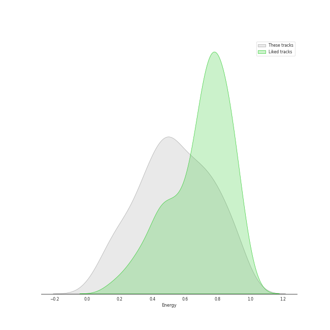
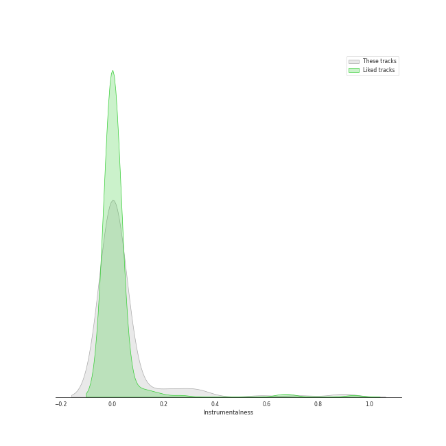
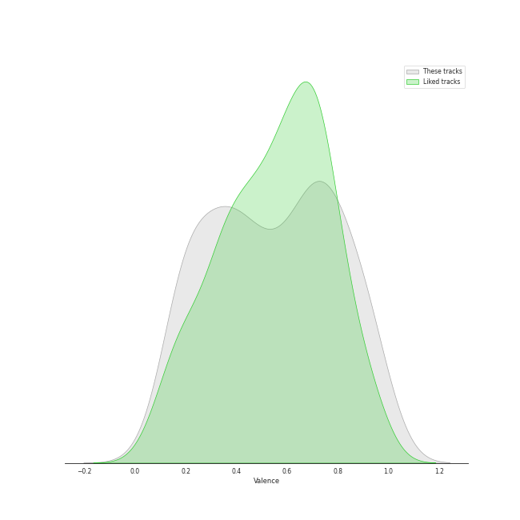
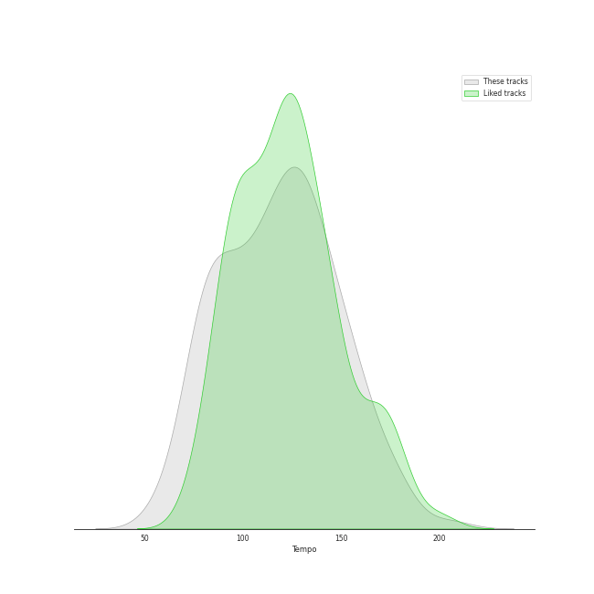

# Audio Features for classic rock

## Danceability

| ​ | 10 most Danceable tracks | ​​ | 10 least Danceable tracks |
|:---|:---|:---|:---|
|  | Another One Bites The Dust (0.926) |  | Bridge Over Troubled Water (0.149) |
|  | I Want To Break Free (0.87) |  | Lights (0.193) |
|  | Dreams - 2004 Remaster (0.828) |  | Desperado - 2013 Remaster (0.228) |
|  | You Can Call Me Al (0.776) |  | Fat Bottomed Girls (0.253) |
|  | Get Back - Remastered 2009 (0.761) |  | Across The Universe - Remastered 2009 (0.257) |
|  | Cecilia (0.755) |  | Shine On You Crazy Diamond (Pts. 1-5) (0.264) |
|  | Sara - 2015 Remaster (0.743) |  | The Great Gig in the Sky (0.274) |
|  | My Life (0.741) |  | She's Always a Woman (0.292) |
|  | A Matter of Trust (0.738) |  | Set the Controls for the Heart of the Sun (0.297) |
|  | (I Can't Get No) Satisfaction - Mono Version (0.723) |  | Dream On (0.307) |

## Energy

| ​ | 10 most Energetic tracks | ​​ | 10 least Energetic tracks |
|:---|:---|:---|:---|
|  | We Didn't Start the Fire (0.967) |  | And So It Goes (0.0387) |
|  | Uptown Girl (0.944) |  | The Boxer (0.0802) |
|  | Go Your Own Way - 2004 Remaster (0.941) |  | And So It Goes (0.0871) |
|  | Immigrant Song - Remaster (0.932) |  | Blackbird - Remastered 2009 (0.127) |
|  | Any Way You Want It (0.932) |  | She's Got a Way (0.142) |
|  | Scenes from an Italian Restaurant (0.931) |  | Golden Slumbers - Remastered 2009 (0.152) |
|  | Movin' Out (Anthony's Song) (0.88) |  | Lullabye (Goodnight, My Angel) (0.157) |
|  | The Stranger (0.878) |  | Landslide (0.161) |
|  | Cecilia (0.876) |  | Yesterday - Remastered 2009 (0.179) |
|  | Only the Good Die Young (0.872) |  | Crazy Love - 2013 Remaster (0.188) |

## Speechiness

| ​ | 10 most Speechy tracks | ​​ | 10 least Speechy tracks |
|:---|:---|:---|:---|
|  | Don't Stop Me Now (0.192) |  | Octopus's Garden - Remastered 2009 (0.0247) |
|  | Strawberry Fields Forever - Remastered 2009 (0.178) |  | The Longest Time (0.0262) |
|  | Only the Good Die Young (0.159) |  | A Matter of Trust (0.0268) |
|  | Money (0.144) |  | Hotel California - 2013 Remaster (0.027) |
|  | Scenes from an Italian Restaurant (0.126) |  | Cold as Ice (0.0271) |
|  | Another One Bites The Dust (0.122) |  | Because - Remastered 2009 (0.0272) |
|  | Big Shot (0.0972) |  | Carry That Weight - Remastered 2009 (0.0274) |
|  | Crazy Love - 2013 Remaster (0.0959) |  | Dreams - 2004 Remaster (0.0276) |
|  | Paint It, Black (0.0926) |  | Save Me (0.0276) |
|  | Black Dog - Remaster (0.0904) |  | Piano Man (0.0276) |

## Acousticness

| ​ | 10 most Acoustic tracks | ​​ | 10 least Acoustic tracks |
|:---|:---|:---|:---|
|  | She's Got a Way (0.97) |  | Paranoid - 2012 - Remaster (4.52e-05) |
|  | Lullabye (Goodnight, My Angel) (0.948) |  | Any Way You Want It (0.00251) |
|  | Desperado - 2013 Remaster (0.946) |  | Hard To Handle (0.00257) |
|  | And So It Goes (0.941) |  | Carry on Wayward Son (0.00321) |
|  | Eleanor Rigby - Remastered 2009 (0.936) |  | Iron Man (0.00367) |
|  | The Boxer (0.93) |  | Hotel California - 2013 Remaster (0.00574) |
|  | And So It Goes (0.91) |  | The Chain - 2004 Remaster (0.009) |
|  | Landslide (0.883) |  | Walk This Way (0.0114) |
|  | Yesterday - Remastered 2009 (0.879) |  | Oh! Darling - Remastered 2009 (0.0126) |
|  | Crazy Love (0.85) |  | Immigrant Song - Remaster (0.013) |

## Instrumentalness

| ​ | 10 most Instrumental tracks | ​​ | 10 least Instrumental tracks |
|:---|:---|:---|:---|
|  | Set the Controls for the Heart of the Sun (0.905) |  | We Will Rock You (0.0) |
|  | The Great Gig in the Sky (0.896) |  | Killer Queen (0.0) |
|  | Breathe (In the Air) (0.728) |  | And So It Goes (0.0) |
|  | Shine On You Crazy Diamond (Pts. 1-5) (0.686) |  | Crazy Little Thing Called Love (0.0) |
|  | Smoke on the Water (0.581) |  | Cat's in the Cradle (0.0) |
|  | Brain Damage (0.341) |  | Only the Good Die Young (0.0) |
|  | Comfortably Numb (0.312) |  | Yesterday - Remastered 2009 (0.0) |
|  | Come Together - Remastered 2009 (0.248) |  | We Didn't Start the Fire (0.0) |
|  | Won't Get Fooled Again - Remix (0.235) |  | Good Old Fashioned Lover Boy (0.0) |
|  | I Want You (She's So Heavy) - Remastered 2009 (0.205) |  | Brown Eyed Girl (0.0) |

## Liveness

| ​ | 10 most Live tracks | ​​ | 10 least Live tracks |
|:---|:---|:---|:---|
|  | Revolution 1 - Remastered 2009 (0.621) |  | Iron Man (0.0372) |
|  | Get Back - Remastered 2009 (0.61) |  | The Chain - 2004 Remaster (0.0451) |
|  | Uptown Girl (0.601) |  | Smoke on the Water (0.0535) |
|  | I Am The Walrus - Remastered 2009 (0.589) |  | My Life (0.0555) |
|  | Don't Stop Me Now (0.558) |  | Blackbird - Remastered 2009 (0.0573) |
|  | Don't Stop Believin' (0.447) |  | Hotel California - 2013 Remaster (0.0575) |
|  | Carry on Wayward Son (0.446) |  | Won't Get Fooled Again - Remix (0.0584) |
|  | Yellow Submarine - Remastered 2009 (0.438) |  | Movin' Out (Anthony's Song) (0.0591) |
|  | Brown Eyed Girl (0.406) |  | The Boxer (0.0619) |
|  | Paint It, Black (0.399) |  | Good Old Fashioned Lover Boy (0.0638) |

## Valence

| ​ | 10 most Happy tracks | ​​ | 10 least Happy tracks |
|:---|:---|:---|:---|
|  | I'm a Believer - 2006 Remaster (0.962) |  | Shine On You Crazy Diamond (Pts. 1-5) (0.0402) |
|  | Hard To Handle (0.961) |  | The Show Must Go On (0.109) |
|  | Cecilia (0.954) |  | Come Sail Away (0.141) |
|  | (I Can't Get No) Satisfaction - Mono Version (0.931) |  | Baba O'Riley (0.15) |
|  | Brown Eyed Girl (0.908) |  | Because - Remastered 2009 (0.162) |
|  | All My Loving - Remastered 2009 (0.9) |  | Comfortably Numb (0.171) |
|  | Movin' Out (Anthony's Song) (0.895) |  | Desperado - 2013 Remaster (0.18) |
|  | We Didn't Start the Fire (0.895) |  | The Great Gig in the Sky (0.181) |
|  | Walk This Way (0.894) |  | Come Together - Remastered 2009 (0.187) |
|  | Smoke on the Water (0.89) |  | We Are The Champions (0.189) |

## Tempo

| ​ | 10 most Fast tracks | ​​ | 10 least Fast tracks |
|:---|:---|:---|:---|
|  | Lights (205.422) |  | Desperado - 2013 Remaster (60.3) |
|  | The Boxer (181.849) |  | Moondance - 2013 Remaster (67.409) |
|  | Piano Man (179.239) |  | Innuendo (72.302) |
|  | She's Always a Woman (176.631) |  | Sexy Sadie - Remastered 2009 (75.478) |
|  | Norwegian Wood (This Bird Has Flown) - Remastered 2009 (176.625) |  | She's Got a Way (75.859) |
|  | Fat Bottomed Girls (176.109) |  | Only the Good Die Young (76.214) |
|  | You Never Give Me Your Money - Remastered 2009 (174.464) |  | Lullabye (Goodnight, My Angel) (76.48) |
|  | Oh! Darling - Remastered 2009 (173.93) |  | Crazy Little Thing Called Love (76.826) |
|  | Come Together - Remastered 2009 (165.007) |  | Crazy Love - 2013 Remaster (77.464) |
|  | Paranoid - 2012 - Remaster (163.071) |  | Crazy Love (77.539) |
