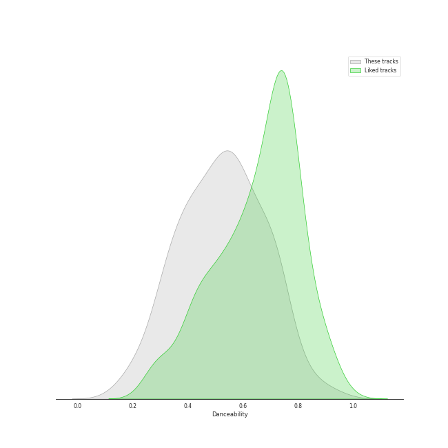
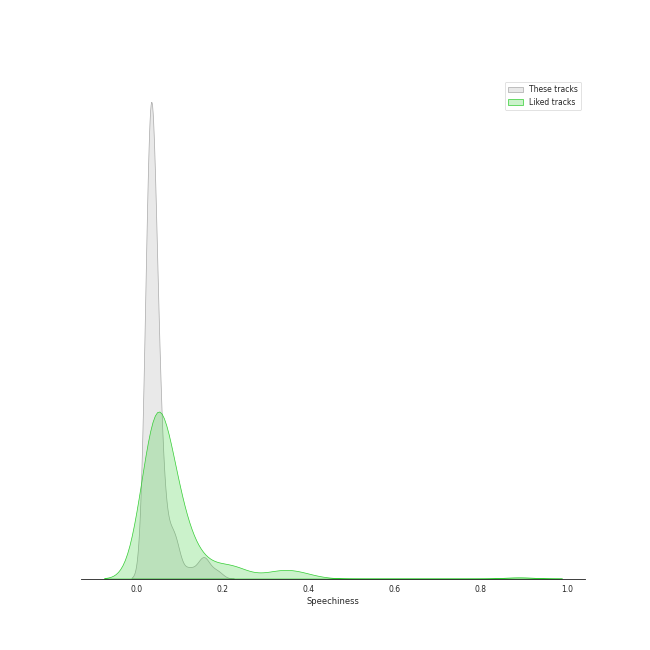
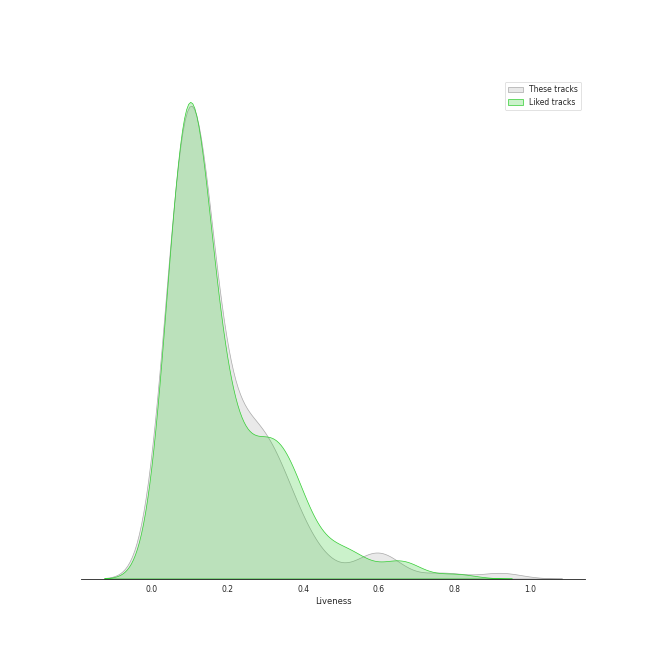

# Audio Features for classic rock

## Danceability

| 10 most Danceable tracks | 10 least Danceable tracks |
|:---|:---|
| Another One Bites The Dust (0.926) | Bridge Over Troubled Water (0.149) |
| I Want To Break Free (0.87) | Lights (0.193) |
| Dreams - 2004 Remaster (0.828) | Desperado - 2013 Remaster (0.228) |
| You Can Call Me Al (0.776) | Fat Bottomed Girls (0.253) |
| Get Back - Remastered 2009 (0.761) | Across The Universe - Remastered 2009 (0.257) |
| Cecilia (0.755) | Shine On You Crazy Diamond (Pts. 1-5) (0.264) |
| Sara - 2015 Remaster (0.743) | The Great Gig in the Sky (0.274) |
| My Life (0.741) | She's Always a Woman (0.292) |
| A Matter of Trust (0.738) | Set the Controls for the Heart of the Sun (0.297) |
| (I Can't Get No) Satisfaction - Mono Version (0.723) | Dream On (0.307) |

## Energy

| 10 most Energetic tracks | 10 least Energetic tracks |
|:---|:---|
| We Didn't Start the Fire (0.967) | And So It Goes (0.0387) |
| Uptown Girl (0.944) | The Boxer (0.0802) |
| Go Your Own Way - 2004 Remaster (0.941) | And So It Goes (0.0871) |
| Immigrant Song - Remaster (0.932) | Blackbird - Remastered 2009 (0.127) |
| Any Way You Want It (0.932) | She's Got a Way (0.142) |
| Scenes from an Italian Restaurant (0.931) | Golden Slumbers - Remastered 2009 (0.152) |
| Movin' Out (Anthony's Song) (0.88) | Lullabye (Goodnight, My Angel) (0.157) |
| The Stranger (0.878) | Landslide (0.161) |
| Cecilia (0.876) | Yesterday - Remastered 2009 (0.179) |
| Only the Good Die Young (0.872) | Crazy Love - 2013 Remaster (0.188) |

## Speechiness

| 10 most Speechy tracks | 10 least Speechy tracks |
|:---|:---|
| Don't Stop Me Now (0.192) | Octopus's Garden - Remastered 2009 (0.0247) |
| Strawberry Fields Forever - Remastered 2009 (0.178) | The Longest Time (0.0262) |
| Only the Good Die Young (0.159) | A Matter of Trust (0.0268) |
| Money (0.144) | Hotel California - 2013 Remaster (0.027) |
| Scenes from an Italian Restaurant (0.126) | Cold as Ice (0.0271) |
| Another One Bites The Dust (0.122) | Because - Remastered 2009 (0.0272) |
| Big Shot (0.0972) | Carry That Weight - Remastered 2009 (0.0274) |
| Crazy Love - 2013 Remaster (0.0959) | Dreams - 2004 Remaster (0.0276) |
| Paint It, Black (0.0926) | Save Me (0.0276) |
| Black Dog - Remaster (0.0904) | Piano Man (0.0276) |

## Acousticness

| 10 most Acoustic tracks | 10 least Acoustic tracks |
|:---|:---|
| She's Got a Way (0.97) | Paranoid - 2012 - Remaster (4.52e-05) |
| Lullabye (Goodnight, My Angel) (0.948) | Any Way You Want It (0.00251) |
| Desperado - 2013 Remaster (0.946) | Hard To Handle (0.00257) |
| And So It Goes (0.941) | Carry on Wayward Son (0.00321) |
| Eleanor Rigby - Remastered 2009 (0.936) | Iron Man (0.00367) |
| The Boxer (0.93) | Hotel California - 2013 Remaster (0.00574) |
| And So It Goes (0.91) | The Chain - 2004 Remaster (0.009) |
| Landslide (0.883) | Walk This Way (0.0114) |
| Yesterday - Remastered 2009 (0.879) | Oh! Darling - Remastered 2009 (0.0126) |
| Crazy Love (0.85) | Immigrant Song - Remaster (0.013) |

## Instrumentalness

| 10 most Instrumental tracks | 10 least Instrumental tracks |
|:---|:---|
| Set the Controls for the Heart of the Sun (0.905) | We Will Rock You (0.0) |
| The Great Gig in the Sky (0.896) | Killer Queen (0.0) |
| Breathe (In the Air) (0.728) | And So It Goes (0.0) |
| Shine On You Crazy Diamond (Pts. 1-5) (0.686) | Crazy Little Thing Called Love (0.0) |
| Smoke on the Water (0.581) | Cat's in the Cradle (0.0) |
| Brain Damage (0.341) | Only the Good Die Young (0.0) |
| Comfortably Numb (0.312) | Yesterday - Remastered 2009 (0.0) |
| Come Together - Remastered 2009 (0.248) | We Didn't Start the Fire (0.0) |
| Won't Get Fooled Again - Remix (0.235) | Good Old Fashioned Lover Boy (0.0) |
| I Want You (She's So Heavy) - Remastered 2009 (0.205) | Brown Eyed Girl (0.0) |

## Liveness

| 10 most Live tracks | 10 least Live tracks |
|:---|:---|
| Revolution 1 - Remastered 2009 (0.621) | Iron Man (0.0372) |
| Get Back - Remastered 2009 (0.61) | The Chain - 2004 Remaster (0.0451) |
| Uptown Girl (0.601) | Smoke on the Water (0.0535) |
| I Am The Walrus - Remastered 2009 (0.589) | My Life (0.0555) |
| Don't Stop Me Now (0.558) | Blackbird - Remastered 2009 (0.0573) |
| Don't Stop Believin' (0.447) | Hotel California - 2013 Remaster (0.0575) |
| Carry on Wayward Son (0.446) | Won't Get Fooled Again - Remix (0.0584) |
| Yellow Submarine - Remastered 2009 (0.438) | Movin' Out (Anthony's Song) (0.0591) |
| Brown Eyed Girl (0.406) | The Boxer (0.0619) |
| Paint It, Black (0.399) | Good Old Fashioned Lover Boy (0.0638) |

## Valence

| 10 most Happy tracks | 10 least Happy tracks |
|:---|:---|
| I'm a Believer - 2006 Remaster (0.962) | Shine On You Crazy Diamond (Pts. 1-5) (0.0402) |
| Hard To Handle (0.961) | The Show Must Go On (0.109) |
| Cecilia (0.954) | Come Sail Away (0.141) |
| (I Can't Get No) Satisfaction - Mono Version (0.931) | Baba O'Riley (0.15) |
| Brown Eyed Girl (0.908) | Because - Remastered 2009 (0.162) |
| All My Loving - Remastered 2009 (0.9) | Comfortably Numb (0.171) |
| Movin' Out (Anthony's Song) (0.895) | Desperado - 2013 Remaster (0.18) |
| We Didn't Start the Fire (0.895) | The Great Gig in the Sky (0.181) |
| Walk This Way (0.894) | Come Together - Remastered 2009 (0.187) |
| Smoke on the Water (0.89) | We Are The Champions (0.189) |

## Tempo

| 10 most Fast tracks | 10 least Fast tracks |
|:---|:---|
| Lights (205.422) | Desperado - 2013 Remaster (60.3) |
| The Boxer (181.849) | Moondance - 2013 Remaster (67.409) |
| Piano Man (179.239) | Innuendo (72.302) |
| She's Always a Woman (176.631) | Sexy Sadie - Remastered 2009 (75.478) |
| Norwegian Wood (This Bird Has Flown) - Remastered 2009 (176.625) | She's Got a Way (75.859) |
| Fat Bottomed Girls (176.109) | Only the Good Die Young (76.214) |
| You Never Give Me Your Money - Remastered 2009 (174.464) | Lullabye (Goodnight, My Angel) (76.48) |
| Oh! Darling - Remastered 2009 (173.93) | Crazy Little Thing Called Love (76.826) |
| Come Together - Remastered 2009 (165.007) | Crazy Love - 2013 Remaster (77.464) |
| Paranoid - 2012 - Remaster (163.071) | Crazy Love (77.539) |
