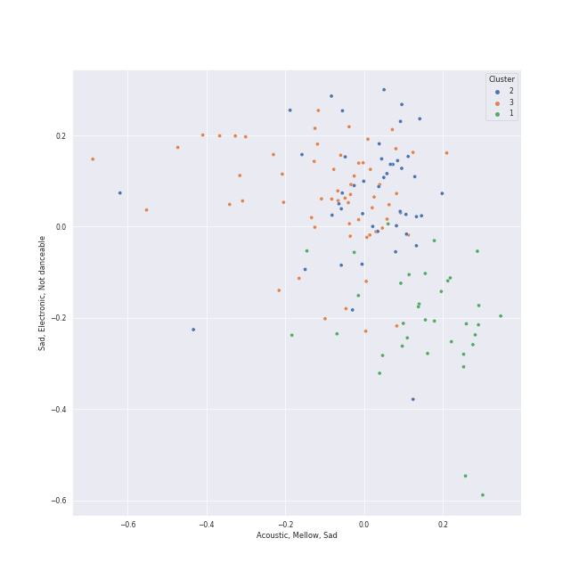

# Clusters in classic rock

## Cluster #1

41 tracks

| Art | Track | Album | Artists | Label | Score | 💚 | 🔗 |
|:---|:---|:---|:---|:---|---:|:---|:---|
|  | Something - Remastered 2009 | Abbey Road (Remastered) | [The Beatles](../../../../artists/the_beatles/overview.md) | [EMI Catalogue](../../../../labels/emi_catalogue) | 0 | 💚 | [🔗](https://open.spotify.com/track/0pNeVovbiZHkulpGeOx1Gj) |
|  | You Never Give Me Your Money - Remastered 2009 | Abbey Road (Remastered) | [The Beatles](../../../../artists/the_beatles/overview.md) | [EMI Catalogue](../../../../labels/emi_catalogue) | 0 | | [🔗](https://open.spotify.com/track/1jOLTO379yIu9aMnCkpMQl) |
|  | Dear Prudence - Remastered 2009 | The Beatles (Remastered) | [The Beatles](../../../../artists/the_beatles/overview.md) | [EMI Catalogue](../../../../labels/emi_catalogue) | 0 | 💚 | [🔗](https://open.spotify.com/track/5NQYyej46WQkgCbnzGD21W) |
|  | Baba O'Riley | Who's Next (Deluxe Edition) | [The Who](../../../../artists/the_who/overview.md) | [Polydor Records](../../../../labels/polydor_records) | 0 | 💚 | [🔗](https://open.spotify.com/track/3qiyyUfYe7CRYLucrPmulD) |
|  | Innuendo | Innuendo | [Queen](../../../../artists/queen/overview.md) | [Hollywood Records](../../../../labels/hollywood_records) | 8 | 💚 | [🔗](https://open.spotify.com/track/1dG4lTOVFu8RkSzybolp7o) |
|  | Save Me - Remastered 2011 | The Game (Deluxe Remastered Version) | [Queen](../../../../artists/queen/overview.md) | [Hollywood Records](../../../../labels/hollywood_records) | 0 | 💚 | [🔗](https://open.spotify.com/track/2mGEqJahn3CSyCG1BTEqMs) |
|  | Bohemian Rhapsody | A Night At The Opera | [Queen](../../../../artists/queen/overview.md) | [Hollywood Records](../../../../labels/hollywood_records) | 0 | | [🔗](https://open.spotify.com/track/6fPm2XMi51l5GCEp19HscL) |
|  | We Are The Champions - Remastered 2011 | News Of The World (Deluxe Remastered Version) | [Queen](../../../../artists/queen/overview.md) | [Hollywood Records](../../../../labels/hollywood_records) | 0 | 💚 | [🔗](https://open.spotify.com/track/7ccI9cStQbQdystvc6TvxD) |
|  | Bohemian Rhapsody | Stone Cold Classics | [Queen](../../../../artists/queen/overview.md) | [Hollywood Records](../../../../labels/hollywood_records) | 0 | | [🔗](https://open.spotify.com/track/6l8GvAyoUZwWDgF1e4822w) |
|  | Bohemian Rhapsody - Remastered 2011 | A Night At The Opera (Deluxe Remastered Version) | [Queen](../../../../artists/queen/overview.md) | [Hollywood Records](../../../../labels/hollywood_records) | 0 | 💚 | [🔗](https://open.spotify.com/track/7tFiyTwD0nx5a1eklYtX2J) |
## Cluster #2

75 tracks

| Art | Track | Album | Artists | Label | Score | 💚 | 🔗 |
|:---|:---|:---|:---|:---|---:|:---|:---|
|  | Octopus's Garden - Remastered 2009 | Abbey Road (Remastered) | [The Beatles](../../../../artists/the_beatles/overview.md) | [EMI Catalogue](../../../../labels/emi_catalogue) | 0 | | [🔗](https://open.spotify.com/track/0suLngfo7rJoetk7Ub6N8l) |
|  | Norwegian Wood (This Bird Has Flown) - Remastered 2009 | Rubber Soul (Remastered) | [The Beatles](../../../../artists/the_beatles/overview.md) | [EMI Catalogue](../../../../labels/emi_catalogue) | 0 | 💚 | [🔗](https://open.spotify.com/track/1H7gMYGykdtwZOV6s1N0by) |
|  | While My Guitar Gently Weeps - Remastered 2009 | The Beatles (Remastered) | [The Beatles](../../../../artists/the_beatles/overview.md) | [EMI Catalogue](../../../../labels/emi_catalogue) | 0 | 💚 | [🔗](https://open.spotify.com/track/389QX9Q1eUOEZ19vtzzI9O) |
|  | Day Tripper - Remastered 2015 | 1 (Remastered) | [The Beatles](../../../../artists/the_beatles/overview.md) | [UMC (Universal Music Catalogue)](../../../../labels/umc_(universal_music_catalogue)) | 223 | 💚 | [🔗](https://open.spotify.com/track/29b2b96jozyD9GPCkOrVLs) |
|  | Big Shot | 52nd Street | [Billy Joel](../../../../artists/billy_joel/overview.md) | [Columbia](../../../../labels/columbia) | 0 | | [🔗](https://open.spotify.com/track/22wxe2Yc9JzihICXYLGAQ7) |
|  | Renegade | Pieces Of Eight | Styx | A&M | 107 | 💚 | [🔗](https://open.spotify.com/track/1CQqupcyMg7176PPmIVmSj) |
|  | You're My Best Friend | A Night At The Opera | [Queen](../../../../artists/queen/overview.md) | [Hollywood Records](../../../../labels/hollywood_records) | 0 | 💚 | [🔗](https://open.spotify.com/track/48BA17CGTzcm85ULSTg5AO) |
|  | Fortunate Son | Willy And The Poor Boys (Expanded Edition) | Creedence Clearwater Revival | [Craft Recordings](../../../../labels/craft_recordings) | 0 | | [🔗](https://open.spotify.com/track/4BP3uh0hFLFRb5cjsgLqDh) |
|  | Proud Mary | Bayou Country (Expanded Edition) | Creedence Clearwater Revival | [Craft Recordings](../../../../labels/craft_recordings) | 0 | | [🔗](https://open.spotify.com/track/6pxWv6GV35VGmcPf5dh6CH) |
|  | Daydream Believer | The Birds, The Bees, & The Monkees | The Monkees | [Rhino](../../../../labels/rhino) | 0 | | [🔗](https://open.spotify.com/track/7uEcCGtM1FBBGIhPozhJjv) |
## Cluster #3

34 tracks

| Art | Track | Album | Artists | Label | Score | 💚 | 🔗 |
|:---|:---|:---|:---|:---|---:|:---|:---|
|  | Yesterday - Remastered 2009 | Help! (Remastered) | [The Beatles](../../../../artists/the_beatles/overview.md) | [EMI Catalogue](../../../../labels/emi_catalogue) | 0 | 💚 | [🔗](https://open.spotify.com/track/3BQHpFgAp4l80e1XslIjNI) |
|  | Let It Be - Remastered 2009 | Let It Be (Remastered) | [The Beatles](../../../../artists/the_beatles/overview.md) | [EMI Catalogue](../../../../labels/emi_catalogue) | 0 | 💚 | [🔗](https://open.spotify.com/track/7iN1s7xHE4ifF5povM6A48) |
|  | Landslide | Fleetwood Mac | Fleetwood Mac | [Warner Records](../../../../labels/warner_records) | 0 | 💚 | [🔗](https://open.spotify.com/track/5ihS6UUlyQAfmp48eSkxuQ) |
|  | Just the Way You Are | The Stranger | [Billy Joel](../../../../artists/billy_joel/overview.md) | [Columbia](../../../../labels/columbia) | 2 | 💚 | [🔗](https://open.spotify.com/track/06RdYCp0UxsBtWsonHfSZz) |
|  | She's Always a Woman | The Stranger | [Billy Joel](../../../../artists/billy_joel/overview.md) | [Columbia](../../../../labels/columbia) | 0 | | [🔗](https://open.spotify.com/track/3ILLSvTYvFjjEdbxvQumOb) |
|  | Turn the Lights Back On | Turn the Lights Back On | [Billy Joel](../../../../artists/billy_joel/overview.md) | [Columbia](../../../../labels/columbia) | 0 | 💚 | [🔗](https://open.spotify.com/track/1KTemUlHzS0SvVtTjY1NTw) |
|  | The Sound of Silence - Acoustic Version | Wednesday Morning, 3 A.M. | [Simon & Garfunkel](../../../../artists/simon___garfunkel/overview.md) | [Columbia](../../../../labels/columbia) | 0 | 💚 | [🔗](https://open.spotify.com/track/5y788ya4NvwhBznoDIcXwK) |
|  | So Far Away | Tapestry | Carole King | Ode, [Epic](../../../../labels/epic), [Legacy](../../../../labels/legacy) | 0 | | [🔗](https://open.spotify.com/track/4HHge4zAyIw3pkrtFzmwCl) |
|  | Good Old Fashioned Lover Boy | A Day At The Races | [Queen](../../../../artists/queen/overview.md) | [Hollywood Records](../../../../labels/hollywood_records) | 0 | | [🔗](https://open.spotify.com/track/3e9w80AUq0mT9Nrq471kLx) |
|  | We Will Rock You - Remastered 2011 | News Of The World (Deluxe Remastered Version) | [Queen](../../../../artists/queen/overview.md) | [Hollywood Records](../../../../labels/hollywood_records) | 0 | 💚 | [🔗](https://open.spotify.com/track/54flyrjcdnQdco7300avMJ) |