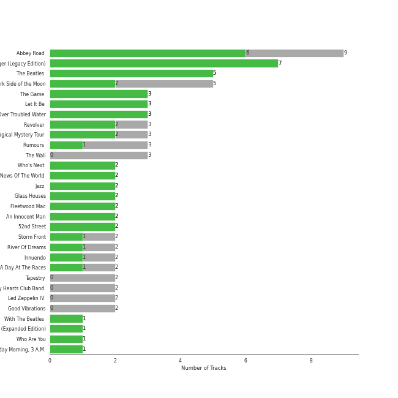

# classic rock

[126 songs](tracks.md)

[See Audio Features](audio_features.md)

## Top Artists

| Art | Tracks | 💚 | Artist | 🔗 |
|:---|---:|---:|:---|:---|
|  | 31 | 22 | [The Beatles](../../artists/the_beatles/overview.md) | [🔗](https://open.spotify.com/artist/3WrFJ7ztbogyGnTHbHJFl2) |
|  | 23 | 15 | [Billy Joel](../../artists/billy_joel/overview.md) | [🔗](https://open.spotify.com/artist/6zFYqv1mOsgBRQbae3JJ9e) |
|  | 15 | 11 | [Queen](../../artists/queen/overview.md) | [🔗](https://open.spotify.com/artist/1dfeR4HaWDbWqFHLkxsg1d) |
|  | 6 | 6 | The Who | [🔗](https://open.spotify.com/artist/67ea9eGLXYMsO2eYQRui3w) |
|  | 5 | 5 | Simon & Garfunkel | [🔗](https://open.spotify.com/artist/70cRZdQywnSFp9pnc2WTCE) |
|  | 6 | 2 | Fleetwood Mac | [🔗](https://open.spotify.com/artist/08GQAI4eElDnROBrJRGE0X) |
|  | 4 | 2 | Van Morrison | [🔗](https://open.spotify.com/artist/44NX2ffIYHr6D4n7RaZF7A) |
|  | 2 | 2 | Styx | [🔗](https://open.spotify.com/artist/4salDzkGmfycRqNUbyBphh) |
|  | 2 | 2 | The Rolling Stones | [🔗](https://open.spotify.com/artist/22bE4uQ6baNwSHPVcDxLCe) |
|  | 3 | 1 | Journey | [🔗](https://open.spotify.com/artist/0rvjqX7ttXeg3mTy8Xscbt) |

See all 25 artists

| Art | Tracks | 💚 | Artist | 🔗 |
|:---|---:|---:|:---|:---|
|  | 2 | 1 | Aerosmith | [🔗](https://open.spotify.com/artist/7Ey4PD4MYsKc5I2dolUwbH) |
|  | 2 | 1 | Black Sabbath | [🔗](https://open.spotify.com/artist/5M52tdBnJaKSvOpJGz8mfZ) |
|  | 2 | 1 | The Monkees | [🔗](https://open.spotify.com/artist/320EPCSEezHt1rtbfwH6Ck) |
|  | 2 | 1 | Kansas | [🔗](https://open.spotify.com/artist/2hl0xAkS2AIRAu23TVMBG1) |
|  | 2 | 1 | Eagles | [🔗](https://open.spotify.com/artist/0ECwFtbIWEVNwjlrfc6xoL) |
|  | 1 | 1 | Steve Miller Band | [🔗](https://open.spotify.com/artist/6QtGlUje9TIkLrgPZrESuk) |
|  | 1 | 1 | Foreigner | [🔗](https://open.spotify.com/artist/6IRouO5mvvfcyxtPDKMYFN) |
|  | 1 | 1 | The Black Crowes | [🔗](https://open.spotify.com/artist/5krkohEVJYw0qoB5VWwxaC) |
|  | 1 | 1 | Harry Chapin | [🔗](https://open.spotify.com/artist/42q4Ivs7tAiCZ5C7eG5q4c) |
|  | 1 | 1 | Chicago | [🔗](https://open.spotify.com/artist/3iDD7bnsjL9J4fO298r0L0) |
|  | 8 | 0 | Pink Floyd | [🔗](https://open.spotify.com/artist/0k17h0D3J5VfsdmQ1iZtE9) |
|  | 3 | 0 | Led Zeppelin | [🔗](https://open.spotify.com/artist/36QJpDe2go2KgaRleHCDTp) |
|  | 2 | 0 | The King's Singers | [🔗](https://open.spotify.com/artist/5lR7yDVN4z9kahOiUSlMhe) |
|  | 2 | 0 | Paul Simon | [🔗](https://open.spotify.com/artist/2CvCyf1gEVhI0mX6aFXmVI) |
|  | 1 | 0 | Deep Purple | [🔗](https://open.spotify.com/artist/568ZhdwyaiCyOGJRtNYhWf) |

## Top Albums

| Art | Tracks | 💚 | Album | Release Date | 🔗 |
|:---|---:|---:|:---|:---|:---|
|  | 9 | 6 | Abbey Road (Remastered) | 1969-09-26 | [🔗](https://open.spotify.com/album/0ETFjACtuP2ADo6LFhL6HN) |
|  | 7 | 6 | The Stranger | 1977-09-29 | [🔗](https://open.spotify.com/album/3IILMjMMnoN2sKzgesX8KV) |
|  | 5 | 5 | The Beatles (Remastered) | 1968-11-22 | [🔗](https://open.spotify.com/album/1klALx0u4AavZNEvC4LrTL) |
|  | 4 | 0 | The Dark Side of the Moon | 1973-03-01 | [🔗](https://open.spotify.com/album/4LH4d3cOWNNsVw41Gqt2kv) |
|  | 3 | 3 | The Game | 1980-06-27 | [🔗](https://open.spotify.com/album/1h0j80HhdzIMsUGUFiVkqa) |
|  | 3 | 3 | Bridge Over Troubled Water | 1970-01-26 | [🔗](https://open.spotify.com/album/0JwHz5SSvpYWuuCNbtYZoV) |
|  | 3 | 2 | Revolver (Remastered) | 1966-08-05 | [🔗](https://open.spotify.com/album/3PRoXYsngSwjEQWR5PsHWR) |
|  | 3 | 2 | Magical Mystery Tour (Remastered) | 1967-11-27 | [🔗](https://open.spotify.com/album/2BtE7qm1qzM80p9vLSiXkj) |
|  | 3 | 2 | Let It Be (Remastered) | 1970-05-08 | [🔗](https://open.spotify.com/album/0jTGHV5xqHPvEcwL8f6YU5) |
|  | 3 | 0 | Rumours (Super Deluxe) | 1977-02-04 | [🔗](https://open.spotify.com/album/0BwWUstDMUbgq2NYONRqlu) |

See all 78 albums

| Art | Tracks | 💚 | Album | Release Date | 🔗 |
|:---|---:|---:|:---|:---|:---|
|  | 2 | 2 | Who's Next (Deluxe Edition) | 1971-08-14 | [🔗](https://open.spotify.com/album/5MqyhhHbT13zsloD3uHhlQ) |
|  | 2 | 2 | Piano Man | 1973-11-09 | [🔗](https://open.spotify.com/album/77ErLrVvYETIlQJHAwhfIH) |
|  | 2 | 2 | News Of The World | 1977-10-28 | [🔗](https://open.spotify.com/album/3TKTjR4E3LAMfRsPeRsNhT) |
|  | 2 | 2 | Jazz | 1978-11-10 | [🔗](https://open.spotify.com/album/5X3rA8To5GDOeIWdQyMEcE) |
|  | 2 | 2 | Fleetwood Mac | 1975-07-11 | [🔗](https://open.spotify.com/album/5VIQ3VaAoRKOEpJ0fewdvo) |
|  | 2 | 2 | An Innocent Man | 1983-08-08 | [🔗](https://open.spotify.com/album/3R3x4zIabsvpD3yxqLaUpc) |
|  | 2 | 2 | A Night At The Opera | 1975-11-21 | [🔗](https://open.spotify.com/album/3KCJzwKOdBxDu6TKaFPqM9) |
|  | 2 | 1 | Storm Front | 1989-10-17 | [🔗](https://open.spotify.com/album/1Vw2uoVkLAJFVViJ1QyK1D) |
|  | 2 | 1 | River Of Dreams | 1993-08-10 | [🔗](https://open.spotify.com/album/4HPnwQJAEvTY910q4RNeOu) |
|  | 2 | 1 | A Day At The Races | 1976-12-10 | [🔗](https://open.spotify.com/album/3f45rzbU4dYQBTV9v5RFBB) |
|  | 2 | 1 | 52nd Street | 1978-10-13 | [🔗](https://open.spotify.com/album/1HmCO8VK98AU6EXPOjGYyI) |
|  | 2 | 0 | The Wall | 1979-11-30 | [🔗](https://open.spotify.com/album/5Dbax7G8SWrP9xyzkOvy2F) |
|  | 2 | 0 | Led Zeppelin IV (Deluxe Edition) | 1971-11-08 | [🔗](https://open.spotify.com/album/44Ig8dzqOkvkGDzaUof9lK) |
|  | 2 | 0 | Innuendo | 1991-02-04 | [🔗](https://open.spotify.com/album/5yAM3CcaXF6DPRJW3oL6Ya) |
|  | 2 | 0 | Good Vibrations | 1993 | [🔗](https://open.spotify.com/album/10IUKCLZPs9onPwXfQVxfv) |
|  | 1 | 1 | With The Beatles (Remastered) | 1963-11-22 | [🔗](https://open.spotify.com/album/1aYdiJk6XKeHWGO3FzHHTr) |
|  | 1 | 1 | Who's Next (Expanded Edition) | 1971-08-14 | [🔗](https://open.spotify.com/album/53PBYiedQrASAs5sy63JqT) |
|  | 1 | 1 | Who Are You | 1978-08-18 | [🔗](https://open.spotify.com/album/7at3CV9Y9P57wsEXkfU0q8) |
|  | 1 | 1 | Wednesday Morning, 3 A.M. | 1964-10-19 | [🔗](https://open.spotify.com/album/5pnJrocLlZ3FWEbcr2PTz0) |
|  | 1 | 1 | Verities & Balderdash | 1974 | [🔗](https://open.spotify.com/album/3nta4nhqWoWjc6LmHIB0kT) |
|  | 1 | 1 | Turnstiles | 1976-05-19 | [🔗](https://open.spotify.com/album/7GiLfxL1su3MSqz7pmKMZi) |
|  | 1 | 1 | Tommy | 1969-05-23 | [🔗](https://open.spotify.com/album/5cT7ee1sy2oEbFalP4asS4) |
|  | 1 | 1 | The Ultimate Collection | 2017-02-03 | [🔗](https://open.spotify.com/album/6TcPqftScGmR0aEgIb43Vv) |
|  | 1 | 1 | The Joker | 1973-01-01 | [🔗](https://open.spotify.com/album/5uYNj1HkZrWKAkhEYcGmJr) |
|  | 1 | 1 | The Grand Illusion | 1977-01-01 | [🔗](https://open.spotify.com/album/6MFIBPVrZjHjP0pPkVF3IU) |
|  | 1 | 1 | The Bridge | 1986-07-28 | [🔗](https://open.spotify.com/album/2fRxSC6FtiAkhEDVZr2seH) |
|  | 1 | 1 | Sheer Heart Attack | 1974-11-08 | [🔗](https://open.spotify.com/album/4yO8TpSaJtUKkkjmsA4VXf) |
|  | 1 | 1 | Shake Your Money Maker | 1990-02-13 | [🔗](https://open.spotify.com/album/2NRRQLuW6j3EsoWpIl2MR3) |
|  | 1 | 1 | Rubber Soul (Remastered) | 1965-12-03 | [🔗](https://open.spotify.com/album/50o7kf2wLwVmOTVYJOTplm) |
|  | 1 | 1 | Point Of Know Return (Expanded Edition) | 1977 | [🔗](https://open.spotify.com/album/6oU298pdPTCQnMx1PYwyUA) |
|  | 1 | 1 | Pieces Of Eight | 1978-01-01 | [🔗](https://open.spotify.com/album/294yFGYq9SBXWR4g6dK63D) |
|  | 1 | 1 | Out Of Our Heads | 1965-07-30 | [🔗](https://open.spotify.com/album/2Q5MwpTmtjscaS34mJFXQQ) |
|  | 1 | 1 | My Generation (Stereo Version) | 1965-12-03 | [🔗](https://open.spotify.com/album/6Oc6Ok1Oawu8lRkjmD4mXy) |
|  | 1 | 1 | More of The Monkees (Deluxe Edition) | 1967-01-09 | [🔗](https://open.spotify.com/album/50zHjIiTOZM232gnWvOydX) |
|  | 1 | 1 | Moondance (Deluxe Edition) | 1970-02 | [🔗](https://open.spotify.com/album/7diHYi0CglGJekoM3KaWBK) |
|  | 1 | 1 | Infinity | 1978 | [🔗](https://open.spotify.com/album/7K4Nk5fHkCuzNm5A6mdo2U) |
|  | 1 | 1 | Help! (Remastered) | 1965-08-06 | [🔗](https://open.spotify.com/album/0PT5m6hwPRrpBwIHVnvbFX) |
|  | 1 | 1 | Foreigner (Expanded) | 1977-03-08 | [🔗](https://open.spotify.com/album/1OU7zJvUfgxxPHgkTClt1M) |
|  | 1 | 1 | Desperado (2013 Remaster) | 1973 | [🔗](https://open.spotify.com/album/09WBxbis5Sixt01FVMs8UM) |
|  | 1 | 1 | Chicago IX: Chicago's Greatest Hits | 1975-11-10 | [🔗](https://open.spotify.com/album/5qWGV0fd7hpdptJYI4G9Dd) |
|  | 1 | 1 | Bookends | 1968-04-03 | [🔗](https://open.spotify.com/album/3bzgbgiytguTDnwzflAZr2) |
|  | 1 | 1 | Blowin' Your Mind! | 1967-09 | [🔗](https://open.spotify.com/album/7dsWupQRlFuhG8FGiQAUjC) |
|  | 1 | 1 | Aftermath | 1966-04-15 | [🔗](https://open.spotify.com/album/72qrnM4yUNMDDlWiqKc8iY) |
|  | 1 | 1 | Aerosmith | 1973-01-05 | [🔗](https://open.spotify.com/album/19lEZSnCCbVEkKchoPQWDZ) |
|  | 1 | 1 | A Hard Day's Night (Remastered) | 1964-07-10 | [🔗](https://open.spotify.com/album/6wCttLq0ADzkPgtRnUihLV) |
|  | 1 | 1 | 1 (Remastered) | 2000-11-13 | [🔗](https://open.spotify.com/album/7vEJAtP3KgKSpOHVgwm3Eh) |
|  | 1 | 0 | Yellow Submarine (Remastered) | 1969-01-17 | [🔗](https://open.spotify.com/album/1gKZ5A1ndFqbcrWtW85cCy) |
|  | 1 | 0 | Wish You Were Here | 1975-09-12 | [🔗](https://open.spotify.com/album/0bCAjiUamIFqKJsekOYuRw) |
|  | 1 | 0 | Tusk (2015 Remaster) | 1979-10-12 | [🔗](https://open.spotify.com/album/5FIN8pyPVx8ggNs5jQ86Re) |
|  | 1 | 0 | Toys In The Attic | 1975-04-08 | [🔗](https://open.spotify.com/album/36IxIOGEBAXVozDSiVs09B) |
|  | 1 | 0 | The Works | 1984-02-27 | [🔗](https://open.spotify.com/album/0FbnXAGmgmWBmNthZSgm43) |
|  | 1 | 0 | The Nylon Curtain | 1982-06-23 | [🔗](https://open.spotify.com/album/50bajZpetfL5T0iRCOR74J) |
|  | 1 | 0 | The Essential Van Morrison | 2015-12-04 | [🔗](https://open.spotify.com/album/0RXzDyBEGd2EGQTmv8cxQa) |
|  | 1 | 0 | The Birds, The Bees, & The Monkees | 1968-04-22 | [🔗](https://open.spotify.com/album/2Ov6zb7NfgDh3EXSIIWrb2) |
|  | 1 | 0 | Sgt. Pepper's Lonely Hearts Club Band (Remastered) | 1967-06-01 | [🔗](https://open.spotify.com/album/6QaVfG1pHYl1z15ZxkvVDW) |
|  | 1 | 0 | Please Please Me (Remastered) | 1963-03-22 | [🔗](https://open.spotify.com/album/3KzAvEXcqJKBF97HrXwlgf) |
|  | 1 | 0 | Paranoid (Remaster) | 1970-09-18 | [🔗](https://open.spotify.com/album/6r7LZXAVueS5DqdrvXJJK7) |
|  | 1 | 0 | Moondance (Expanded Edition) | 1970-02 | [🔗](https://open.spotify.com/album/6yNYC35npMBHbxG0Vle83O) |
|  | 1 | 0 | Machine Head | 1972-03-25 | [🔗](https://open.spotify.com/album/1EK3a0Yctg4d3nGQzE4Uty) |
|  | 1 | 0 | Leftoverture (Expanded Edition) | 1976 | [🔗](https://open.spotify.com/album/7MejfRSNnrpcLZIxkeZDqR) |
|  | 1 | 0 | Led Zeppelin III (Remaster) | 1970 | [🔗](https://open.spotify.com/album/6P5QHz4XtxOmS5EuiGIPut) |
|  | 1 | 0 | Hotel California (2013 Remaster) | 1976-12-08 | [🔗](https://open.spotify.com/album/2widuo17g5CEC66IbzveRu) |
|  | 1 | 0 | Graceland (25th Anniversary Deluxe Edition) | 1986-08-12 | [🔗](https://open.spotify.com/album/6WgGWYw6XXQyLTsWt7tXky) |
|  | 1 | 0 | Glass Houses | 1980-03-12 | [🔗](https://open.spotify.com/album/5sztejERqpktXEdemlUvU5) |
|  | 1 | 0 | Escape (Bonus Track Version) | 1981 | [🔗](https://open.spotify.com/album/43wpzak9OmQfrjyksuGwp0) |
|  | 1 | 0 | Departure | 1980 | [🔗](https://open.spotify.com/album/2OyVtIEp7O7a6o82DF4Ba5) |
|  | 1 | 0 | Cold Spring Harbor | 1971-11-01 | [🔗](https://open.spotify.com/album/274rMlKrr22086ohmwAJZA) |
|  | 1 | 0 | A Saucerful of Secrets | 1968-06-29 | [🔗](https://open.spotify.com/album/2vnJKtGjZXRUg0mYPZ3HGH) |

## Top Record Labels

| Tracks | 💚 | Label |
|---:|---:|:---|
| 33 | 23 | [Columbia](../../labels/columbia/overview.md) |
| 30 | 21 | [EMI Catalogue](../../labels/emi_catalogue/overview.md) |
| 15 | 11 | [Hollywood Records](../../labels/hollywood_records/overview.md) |
| 13 | 5 | [Rhino](../../labels/rhino/overview.md) |
| 11 | 4 | [Warner Records](../../labels/warner_records/overview.md) |
| 5 | 3 | [Legacy](../../labels/legacy/overview.md) |
| 3 | 3 | [Geffen](../../labels/geffen/overview.md) |
| 3 | 2 | Elektra |
| 2 | 2 | [UMC (Universal Music Catalogue)](../../labels/umc__universal_music_catalogue_/overview.md) |
| 2 | 2 | [Polydor Records](../../labels/polydor_records/overview.md) |

See all 20 labels

| Tracks | 💚 | Label |
|---:|---:|:---|
| 2 | 2 | ABKCO Music and Records |
| 2 | 2 | A&M |
| 2 | 1 | [Epic](../../labels/epic/overview.md) |
| 1 | 1 | Rhino Atlantic |
| 1 | 1 | CAPITOL CATALOG MKT (C92) |
| 1 | 1 | American Recordings Catalog P&D |
| 8 | 0 | Pink Floyd Records |
| 3 | 0 | [Atlantic Records](../../labels/atlantic_records/overview.md) |
| 2 | 0 | RCA Victor |
| 2 | 0 | Legacy Recordings |

## Years

| 10 newest albums | 10 oldest albums |
|:---|:---|
| 
 The Ultimate Collection (2017-02-03)
 | 
 Please Please Me (Remastered) (1963-03-22)
 |
| 
 The Essential Van Morrison (2015-12-04)
 | 
 With The Beatles (Remastered) (1963-11-22)
 |
| 
 1 (Remastered) (2000-11-13)
 | 
 A Hard Day's Night (Remastered) (1964-07-10)
 |
| 
 River Of Dreams (1993-08-10)
 | 
 Wednesday Morning, 3 A.M. (1964-10-19)
 |
| 
 Good Vibrations (1993)
 | 
 Out Of Our Heads (1965-07-30)
 |
| 
 Innuendo (1991-02-04)
 | 
 Help! (Remastered) (1965-08-06)
 |
| 
 Shake Your Money Maker (1990-02-13)
 | 
 My Generation (Stereo Version) (1965-12-03)
 |
| 
 Storm Front (1989-10-17)
 | 
 Rubber Soul (Remastered) (1965-12-03)
 |
| 
 Graceland (25th Anniversary Deluxe Edition) (1986-08-12)
 | 
 Aftermath (1966-04-15)
 |
| 
 The Bridge (1986-07-28)
 | 
 Revolver (Remastered) (1966-08-05)
 |