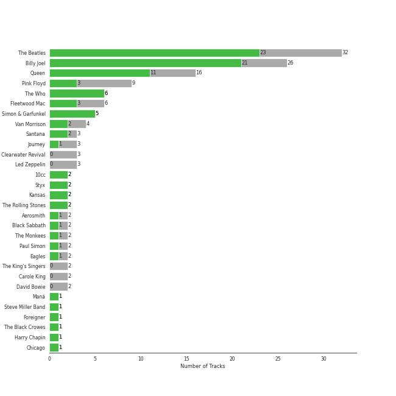
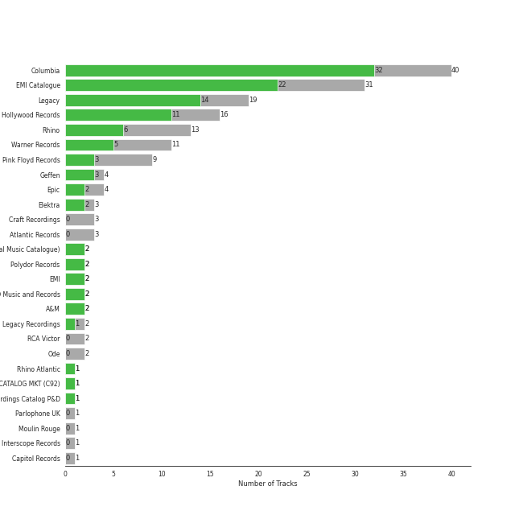
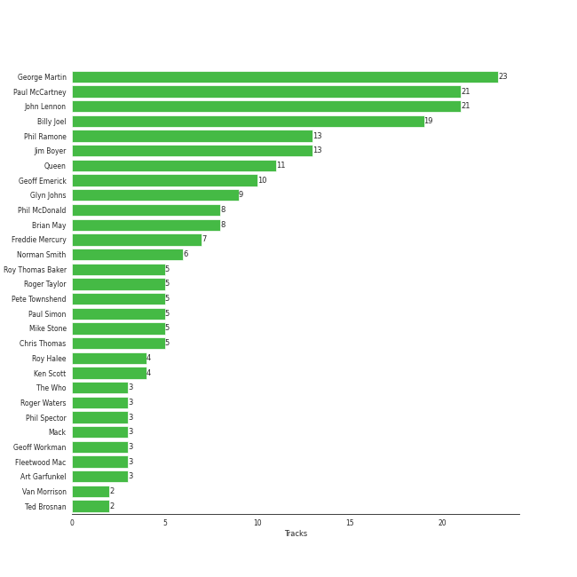
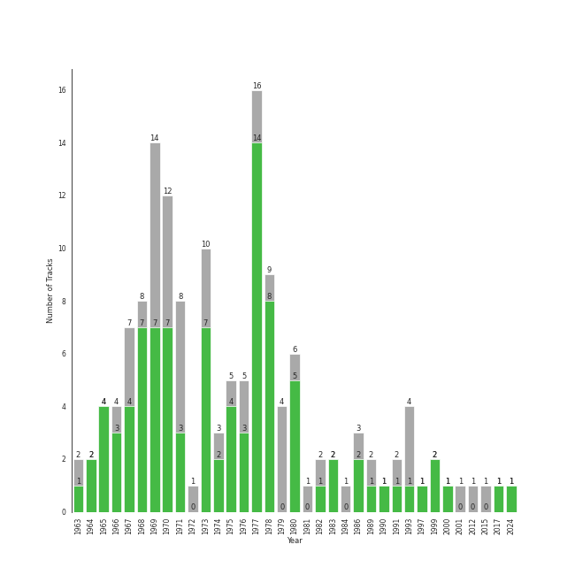

# classic rock

144 songs

[See Track Features](audio_features.md)

[See Clusters](clusters/overview.md)

## Top Artists

| Art | Rank | Tracks | 💚 | Artist | 🔗 |
|:---|---:|---:|---:|:---|:---|
|  | 61 | 32 | 23 | [The Beatles](../../artists/the_beatles/overview.md) | [🔗](https://open.spotify.com/artist/3WrFJ7ztbogyGnTHbHJFl2) |
|  | 56 | 26 | 21 | [Billy Joel](../../artists/billy_joel/overview.md) | [🔗](https://open.spotify.com/artist/6zFYqv1mOsgBRQbae3JJ9e) |
|  | 51 | 16 | 11 | [Queen](../../artists/queen/overview.md) | [🔗](https://open.spotify.com/artist/1dfeR4HaWDbWqFHLkxsg1d) |
|  | 322 | 6 | 6 | [The Who](../../artists/the_who/overview.md) | [🔗](https://open.spotify.com/artist/67ea9eGLXYMsO2eYQRui3w) |
|  | 410 | 5 | 5 | [Simon & Garfunkel](../../artists/simon___garfunkel/overview.md) | [🔗](https://open.spotify.com/artist/70cRZdQywnSFp9pnc2WTCE) |
|  | 104 | 9 | 3 | Pink Floyd | [🔗](https://open.spotify.com/artist/0k17h0D3J5VfsdmQ1iZtE9) |
|  | 410 | 6 | 3 | Fleetwood Mac | [🔗](https://open.spotify.com/artist/08GQAI4eElDnROBrJRGE0X) |
|  | 410 | 4 | 2 | Van Morrison | [🔗](https://open.spotify.com/artist/44NX2ffIYHr6D4n7RaZF7A) |
|  | 270 | 2 | 2 | 10cc | [🔗](https://open.spotify.com/artist/6i6WlGzQtXtz7GcC5H5st5) |
|  | 307 | 2 | 2 | Styx | [🔗](https://open.spotify.com/artist/4salDzkGmfycRqNUbyBphh) |

See all 32 artists

| Art | Rank | Tracks | 💚 | Artist | 🔗 |
|:---|---:|---:|---:|:---|:---|
|  | 410 | 2 | 2 | Kansas | [🔗](https://open.spotify.com/artist/2hl0xAkS2AIRAu23TVMBG1) |
|  | 410 | 2 | 2 | The Rolling Stones | [🔗](https://open.spotify.com/artist/22bE4uQ6baNwSHPVcDxLCe) |
|  | 410 | 3 | 1 | Journey | [🔗](https://open.spotify.com/artist/0rvjqX7ttXeg3mTy8Xscbt) |
|  | 410 | 2 | 1 | Aerosmith | [🔗](https://open.spotify.com/artist/7Ey4PD4MYsKc5I2dolUwbH) |
|  | 410 | 2 | 1 | Black Sabbath | [🔗](https://open.spotify.com/artist/5M52tdBnJaKSvOpJGz8mfZ) |
|  | 410 | 2 | 1 | The Monkees | [🔗](https://open.spotify.com/artist/320EPCSEezHt1rtbfwH6Ck) |
|  | 410 | 2 | 1 | Paul Simon | [🔗](https://open.spotify.com/artist/2CvCyf1gEVhI0mX6aFXmVI) |
|  | 377 | 2 | 1 | Eagles | [🔗](https://open.spotify.com/artist/0ECwFtbIWEVNwjlrfc6xoL) |
|  | 410 | 1 | 1 | Steve Miller Band | [🔗](https://open.spotify.com/artist/6QtGlUje9TIkLrgPZrESuk) |
|  | 410 | 1 | 1 | Foreigner | [🔗](https://open.spotify.com/artist/6IRouO5mvvfcyxtPDKMYFN) |
|  | 410 | 1 | 1 | The Black Crowes | [🔗](https://open.spotify.com/artist/5krkohEVJYw0qoB5VWwxaC) |
|  | 410 | 1 | 1 | Harry Chapin | [🔗](https://open.spotify.com/artist/42q4Ivs7tAiCZ5C7eG5q4c) |
|  | 380 | 1 | 1 | Chicago | [🔗](https://open.spotify.com/artist/3iDD7bnsjL9J4fO298r0L0) |
|  | 229 | 1 | 1 | TOTO | [🔗](https://open.spotify.com/artist/0PFtn5NtBbbUNbU9EAmIWF) |
|  | 410 | 3 | 0 | Creedence Clearwater Revival | [🔗](https://open.spotify.com/artist/3IYUhFvPQItj6xySrBmZkd) |
|  | 410 | 3 | 0 | Led Zeppelin | [🔗](https://open.spotify.com/artist/36QJpDe2go2KgaRleHCDTp) |
|  | 410 | 2 | 0 | The King's Singers | [🔗](https://open.spotify.com/artist/5lR7yDVN4z9kahOiUSlMhe) |
|  | 410 | 2 | 0 | Carole King | [🔗](https://open.spotify.com/artist/319yZVtYM9MBGqmSQnMyY6) |
|  | 410 | 2 | 0 | David Bowie | [🔗](https://open.spotify.com/artist/0oSGxfWSnnOXhD2fKuz2Gy) |
|  | 410 | 1 | 0 | Deep Purple | [🔗](https://open.spotify.com/artist/568ZhdwyaiCyOGJRtNYhWf) |
|  | 410 | 1 | 0 | Lynyrd Skynyrd | [🔗](https://open.spotify.com/artist/4MVyzYMgTwdP7Z49wAZHx0) |
|  | 410 | 1 | 0 | The Beach Boys | [🔗](https://open.spotify.com/artist/3oDbviiivRWhXwIE8hxkVV) |

## Most and least listened tracks
| Rank | ​ | Most listened tracks | Rank | ​​ | Least listened tracks |
|---:|:---|:---|---:|:---|:---|
| 283 |  | [Vienna](../../artists/billy_joel/overview.md) | 909 |  | Cold as Ice |
| 284 |  | [Bohemian Rhapsody - Remastered 2011](../../artists/queen/overview.md) | 909 |  | Daydream Believer |
| 294 |  | [Innuendo - Remastered 2011](../../artists/queen/overview.md) | 909 |  | [Let It Be - Remastered 2009](../../artists/the_beatles/overview.md) |
| 360 |  | [Because - Remastered 2009](../../artists/the_beatles/overview.md) | 909 |  | [Don't Stop Me Now - Remastered 2011](../../artists/queen/overview.md) |
| 364 |  | Africa | 909 |  | Sweet Home Alabama |
| 388 |  | [Movin' Out (Anthony's Song)](../../artists/billy_joel/overview.md) | 909 |  | [We Are The Champions - Remastered 2011](../../artists/queen/overview.md) |
| 448 |  | [Day Tripper - Remastered 2015](../../artists/the_beatles/overview.md) | 909 |  | Hey You |
| 500 |  | [Only the Good Die Young](../../artists/billy_joel/overview.md) | 909 |  | Lights |
| 580 |  | Renegade | 909 |  | [Somebody To Love](../../artists/queen/overview.md) |
| 618 |  | [Who Are You](../../artists/the_who/overview.md) | 909 |  | Immigrant Song - Remaster |

## Top Albums

| Art | Rank | Tracks | 💚 | Album | Release Date | 🔗 |
|:---|---:|---:|---:|:---|:---|:---|
|  | 259 | 9 | 6 | Abbey Road (Remastered) | 1969-09-26 | [🔗](https://open.spotify.com/album/0ETFjACtuP2ADo6LFhL6HN) |
|  | 173 | 7 | 7 | The Stranger (Legacy Edition) | 1977 | [🔗](https://open.spotify.com/album/1Mhn9VosyjtWn4dMPFlna6) |
|  | 604 | 5 | 5 | The Beatles (Remastered) | 1968-11-22 | [🔗](https://open.spotify.com/album/1klALx0u4AavZNEvC4LrTL) |
|  | 523 | 5 | 2 | The Dark Side of the Moon | 1973-03-01 | [🔗](https://open.spotify.com/album/4LH4d3cOWNNsVw41Gqt2kv) |
|  | 604 | 3 | 3 | The Game (Deluxe Remastered Version) | 1980-06-27 | [🔗](https://open.spotify.com/album/6wPXUmYJ9mOWrKlLzZ5cCa) |
|  | 604 | 3 | 3 | Let It Be (Remastered) | 1970-05-08 | [🔗](https://open.spotify.com/album/0jTGHV5xqHPvEcwL8f6YU5) |
|  | 604 | 3 | 3 | Bridge Over Troubled Water | 1970-01-26 | [🔗](https://open.spotify.com/album/0JwHz5SSvpYWuuCNbtYZoV) |
|  | 604 | 3 | 2 | Revolver (Remastered) | 1966-08-05 | [🔗](https://open.spotify.com/album/3PRoXYsngSwjEQWR5PsHWR) |
|  | 604 | 3 | 2 | Magical Mystery Tour (Remastered) | 1967-11-27 | [🔗](https://open.spotify.com/album/2BtE7qm1qzM80p9vLSiXkj) |
|  | 604 | 3 | 1 | Rumours (Super Deluxe) | 1977-02-04 | [🔗](https://open.spotify.com/album/0BwWUstDMUbgq2NYONRqlu) |

See all 93 albums

| Art | Rank | Tracks | 💚 | Album | Release Date | 🔗 |
|:---|---:|---:|---:|:---|:---|:---|
|  | 604 | 3 | 0 | The Wall | 1979-11-30 | [🔗](https://open.spotify.com/album/5Dbax7G8SWrP9xyzkOvy2F) |
|  | 604 | 2 | 2 | Who's Next (Deluxe Edition) | 1971-08-14 | [🔗](https://open.spotify.com/album/5MqyhhHbT13zsloD3uHhlQ) |
|  | 604 | 2 | 2 | News Of The World (Deluxe Remastered Version) | 1977-10-28 | [🔗](https://open.spotify.com/album/6Di4m5k1BtMJ0R44bWNutu) |
|  | 518 | 2 | 2 | Jazz (Deluxe Remastered Version) | 1978-11-10 | [🔗](https://open.spotify.com/album/21HMAUrbbYSj9NiPPlGumy) |
|  | 604 | 2 | 2 | Glass Houses | 1980-03-12 | [🔗](https://open.spotify.com/album/5sztejERqpktXEdemlUvU5) |
|  | 604 | 2 | 2 | Fleetwood Mac | 1975-07-11 | [🔗](https://open.spotify.com/album/5VIQ3VaAoRKOEpJ0fewdvo) |
|  | 603 | 2 | 2 | An Innocent Man | 1983-08-08 | [🔗](https://open.spotify.com/album/3R3x4zIabsvpD3yxqLaUpc) |
|  | 604 | 2 | 2 | 52nd Street | 1978-10-13 | [🔗](https://open.spotify.com/album/1HmCO8VK98AU6EXPOjGYyI) |
|  | 604 | 2 | 1 | Storm Front | 1989-10-17 | [🔗](https://open.spotify.com/album/1Vw2uoVkLAJFVViJ1QyK1D) |
|  | 604 | 2 | 1 | River Of Dreams | 1993-08-10 | [🔗](https://open.spotify.com/album/4HPnwQJAEvTY910q4RNeOu) |
|  | 215 | 2 | 1 | Innuendo | 1991-02-04 | [🔗](https://open.spotify.com/album/3jYy7yGNCysTHE8MKrIF1k) |
|  | 604 | 2 | 1 | A Day At The Races | 1976-12-10 | [🔗](https://open.spotify.com/album/3f45rzbU4dYQBTV9v5RFBB) |
|  | 604 | 2 | 0 | Tapestry | 1971 | [🔗](https://open.spotify.com/album/12n11cgnpjXKLeqrnIERoS) |
|  | 604 | 2 | 0 | Sgt. Pepper's Lonely Hearts Club Band (Remastered) | 1967-06-01 | [🔗](https://open.spotify.com/album/6QaVfG1pHYl1z15ZxkvVDW) |
|  | 604 | 2 | 0 | Led Zeppelin IV (Deluxe Edition) | 1971-11-08 | [🔗](https://open.spotify.com/album/44Ig8dzqOkvkGDzaUof9lK) |
|  | 604 | 2 | 0 | Good Vibrations | 1993 | [🔗](https://open.spotify.com/album/10IUKCLZPs9onPwXfQVxfv) |
|  | 604 | 1 | 1 | With The Beatles (Remastered) | 1963-11-22 | [🔗](https://open.spotify.com/album/1aYdiJk6XKeHWGO3FzHHTr) |
|  | 604 | 1 | 1 | Who's Next (Expanded Edition) | 1971-08-14 | [🔗](https://open.spotify.com/album/53PBYiedQrASAs5sy63JqT) |
|  | 418 | 1 | 1 | Who Are You | 1978-08-18 | [🔗](https://open.spotify.com/album/7at3CV9Y9P57wsEXkfU0q8) |
|  | 604 | 1 | 1 | Wednesday Morning, 3 A.M. | 1964-10-19 | [🔗](https://open.spotify.com/album/5pnJrocLlZ3FWEbcr2PTz0) |
|  | 604 | 1 | 1 | Verities & Balderdash | 1974 | [🔗](https://open.spotify.com/album/3nta4nhqWoWjc6LmHIB0kT) |
|  | 604 | 1 | 1 | Turnstiles | 1976-05-19 | [🔗](https://open.spotify.com/album/7GiLfxL1su3MSqz7pmKMZi) |
|  | 604 | 1 | 1 | Turn the Lights Back On | 2024-02-01 | [🔗](https://open.spotify.com/album/4csPGLYTb7kt85U377UCuC) |
|  | 262 | 1 | 1 | Toto IV | 1982-04-08 | [🔗](https://open.spotify.com/album/62U7xIHcID94o20Of5ea4D) |
|  | 604 | 1 | 1 | Tommy | 1969-05-23 | [🔗](https://open.spotify.com/album/5cT7ee1sy2oEbFalP4asS4) |
|  | 604 | 1 | 1 | The Ultimate Collection | 2017-02-03 | [🔗](https://open.spotify.com/album/6TcPqftScGmR0aEgIb43Vv) |
|  | 604 | 1 | 1 | The Joker | 1973-01-01 | [🔗](https://open.spotify.com/album/5uYNj1HkZrWKAkhEYcGmJr) |
|  | 604 | 1 | 1 | The Grand Illusion | 1977-01-01 | [🔗](https://open.spotify.com/album/6MFIBPVrZjHjP0pPkVF3IU) |
|  | 444 | 1 | 1 | The Bridge | 1986-07-28 | [🔗](https://open.spotify.com/album/2fRxSC6FtiAkhEDVZr2seH) |
|  | 604 | 1 | 1 | Sheer Heart Attack | 1974-11-08 | [🔗](https://open.spotify.com/album/4yO8TpSaJtUKkkjmsA4VXf) |
|  | 604 | 1 | 1 | Shake Your Money Maker | 1990-02-13 | [🔗](https://open.spotify.com/album/2NRRQLuW6j3EsoWpIl2MR3) |
|  | 604 | 1 | 1 | Rubber Soul (Remastered) | 1965-12-03 | [🔗](https://open.spotify.com/album/50o7kf2wLwVmOTVYJOTplm) |
|  | 604 | 1 | 1 | Point Of Know Return (Expanded Edition) | 1977 | [🔗](https://open.spotify.com/album/6oU298pdPTCQnMx1PYwyUA) |
|  | 392 | 1 | 1 | Pieces Of Eight | 1978-01-01 | [🔗](https://open.spotify.com/album/294yFGYq9SBXWR4g6dK63D) |
|  | 575 | 1 | 1 | Piano Man (Legacy Edition) | 1973-11-07 | [🔗](https://open.spotify.com/album/69wjSAZXZiD2EBia3b3gxL) |
|  | 604 | 1 | 1 | Piano Man | 1973-11-09 | [🔗](https://open.spotify.com/album/77ErLrVvYETIlQJHAwhfIH) |
|  | 604 | 1 | 1 | Out Of Our Heads | 1965-07-30 | [🔗](https://open.spotify.com/album/2Q5MwpTmtjscaS34mJFXQQ) |
|  | 604 | 1 | 1 | My Generation (Stereo Version) | 1965-12-03 | [🔗](https://open.spotify.com/album/6Oc6Ok1Oawu8lRkjmD4mXy) |
|  | 604 | 1 | 1 | More of The Monkees (Deluxe Edition) | 1967-01-09 | [🔗](https://open.spotify.com/album/50zHjIiTOZM232gnWvOydX) |
|  | 604 | 1 | 1 | Moondance (Deluxe Edition) | 1970-02 | [🔗](https://open.spotify.com/album/7diHYi0CglGJekoM3KaWBK) |
|  | 604 | 1 | 1 | Leftoverture (Expanded Edition) | 1976 | [🔗](https://open.spotify.com/album/7MejfRSNnrpcLZIxkeZDqR) |
|  | 604 | 1 | 1 | Infinity | 1978 | [🔗](https://open.spotify.com/album/7K4Nk5fHkCuzNm5A6mdo2U) |
|  | 604 | 1 | 1 | Help! (Remastered) | 1965-08-06 | [🔗](https://open.spotify.com/album/0PT5m6hwPRrpBwIHVnvbFX) |
|  | 604 | 1 | 1 | Greatest Hits Vol. III | 1997-06-13 | [🔗](https://open.spotify.com/album/3cJ6ZymbUcNGe1T8YZtGyE) |
|  | 604 | 1 | 1 | Graceland (25th Anniversary Deluxe Edition) | 1986-08-12 | [🔗](https://open.spotify.com/album/6WgGWYw6XXQyLTsWt7tXky) |
|  | 604 | 1 | 1 | Foreigner (Expanded) | 1977-03-08 | [🔗](https://open.spotify.com/album/1OU7zJvUfgxxPHgkTClt1M) |
|  | 544 | 1 | 1 | Desperado (2013 Remaster) | 1973-04-17 | [🔗](https://open.spotify.com/album/09WBxbis5Sixt01FVMs8UM) |
|  | 604 | 1 | 1 | Deceptive Bends | 1977 | [🔗](https://open.spotify.com/album/6D3RQD5AQZ4P2aDzsZmBI4) |
|  | 549 | 1 | 1 | Chicago IX: Chicago's Greatest Hits | 1975-11-10 | [🔗](https://open.spotify.com/album/5qWGV0fd7hpdptJYI4G9Dd) |
|  | 604 | 1 | 1 | Bookends | 1968-04-03 | [🔗](https://open.spotify.com/album/3bzgbgiytguTDnwzflAZr2) |
|  | 604 | 1 | 1 | Blowin' Your Mind! | 1967-09 | [🔗](https://open.spotify.com/album/7dsWupQRlFuhG8FGiQAUjC) |
|  | 604 | 1 | 1 | Bloody Tourists | 1978 | [🔗](https://open.spotify.com/album/3MecVG0PeBObAhjwEAczFG) |
|  | 604 | 1 | 1 | Aftermath | 1966-04-15 | [🔗](https://open.spotify.com/album/72qrnM4yUNMDDlWiqKc8iY) |
|  | 604 | 1 | 1 | Aerosmith | 1973-01-05 | [🔗](https://open.spotify.com/album/19lEZSnCCbVEkKchoPQWDZ) |
|  | 604 | 1 | 1 | A Saucerful of Secrets | 1968-06-29 | [🔗](https://open.spotify.com/album/2vnJKtGjZXRUg0mYPZ3HGH) |
|  | 209 | 1 | 1 | A Night At The Opera (Deluxe Remastered Version) | 1975-11-21 | [🔗](https://open.spotify.com/album/6X9k3hSsvQck2OfKYdBbXr) |
|  | 604 | 1 | 1 | A Hard Day's Night (Remastered) | 1964-07-10 | [🔗](https://open.spotify.com/album/6wCttLq0ADzkPgtRnUihLV) |
|  | 321 | 1 | 1 | 1 (Remastered) | 2000-11-13 | [🔗](https://open.spotify.com/album/7vEJAtP3KgKSpOHVgwm3Eh) |
|  | 604 | 1 | 0 | Yellow Submarine (Remastered) | 1969-01-17 | [🔗](https://open.spotify.com/album/1gKZ5A1ndFqbcrWtW85cCy) |
|  | 604 | 1 | 0 | Willy And The Poor Boys (Expanded Edition) | 1969-11-02 | [🔗](https://open.spotify.com/album/31q47gQszFt0CddSyMksgO) |
|  | 604 | 1 | 0 | Tusk (2015 Remaster) | 1979-10-12 | [🔗](https://open.spotify.com/album/5FIN8pyPVx8ggNs5jQ86Re) |
|  | 604 | 1 | 0 | Toys In The Attic | 1975-04-08 | [🔗](https://open.spotify.com/album/36IxIOGEBAXVozDSiVs09B) |
|  | 604 | 1 | 0 | The Works | 1984-02-27 | [🔗](https://open.spotify.com/album/0FbnXAGmgmWBmNthZSgm43) |
|  | 604 | 1 | 0 | The Nylon Curtain | 1982-06-23 | [🔗](https://open.spotify.com/album/50bajZpetfL5T0iRCOR74J) |
|  | 604 | 1 | 0 | The Essential Van Morrison | 2015-12-04 | [🔗](https://open.spotify.com/album/0RXzDyBEGd2EGQTmv8cxQa) |
|  | 604 | 1 | 0 | The Birds, The Bees, & The Monkees | 1968-04-22 | [🔗](https://open.spotify.com/album/2Ov6zb7NfgDh3EXSIIWrb2) |
|  | 604 | 1 | 0 | Second Helping (Expanded Edition) | 1974-04-15 | [🔗](https://open.spotify.com/album/54V1ljNtyzAm053oJqi0SH) |
|  | 604 | 1 | 0 | Please Please Me (Remastered) | 1963-03-22 | [🔗](https://open.spotify.com/album/3KzAvEXcqJKBF97HrXwlgf) |
|  | 604 | 1 | 0 | Pendulum (Expanded Edition) | 1970-12-07 | [🔗](https://open.spotify.com/album/372cMadhAGlNuDnc8TssqF) |
|  | 604 | 1 | 0 | Paranoid (Remaster) | 1970-09-18 | [🔗](https://open.spotify.com/album/6r7LZXAVueS5DqdrvXJJK7) |
|  | 604 | 1 | 0 | Moulin Rouge | 2001-01-01 | [🔗](https://open.spotify.com/album/1Kg7AyuyIMTfD6geg9VghI) |
|  | 604 | 1 | 0 | Moondance (Expanded Edition) | 1970-02 | [🔗](https://open.spotify.com/album/6yNYC35npMBHbxG0Vle83O) |
|  | 604 | 1 | 0 | Machine Head | 1972-03-25 | [🔗](https://open.spotify.com/album/1EK3a0Yctg4d3nGQzE4Uty) |
|  | 604 | 1 | 0 | Led Zeppelin III (Remaster) | 1970 | [🔗](https://open.spotify.com/album/6P5QHz4XtxOmS5EuiGIPut) |
|  | 604 | 1 | 0 | Jazz | 1978-11-10 | [🔗](https://open.spotify.com/album/5X3rA8To5GDOeIWdQyMEcE) |
|  | 604 | 1 | 0 | Hotel California (2013 Remaster) | 1976-12-08 | [🔗](https://open.spotify.com/album/2widuo17g5CEC66IbzveRu) |
|  | 604 | 1 | 0 | Escape (2022 Remaster) | 1981-07-17 | [🔗](https://open.spotify.com/album/4guAwaniEAEQSW0NCpo4gm) |
|  | 604 | 1 | 0 | Departure | 1980 | [🔗](https://open.spotify.com/album/2OyVtIEp7O7a6o82DF4Ba5) |
|  | 604 | 1 | 0 | David Bowie (aka Space Oddity) [2015 Remaster] | 1969-11-04 | [🔗](https://open.spotify.com/album/1ay9Z4R5ZYI2TY7WiDhNYQ) |
|  | 604 | 1 | 0 | Cold Spring Harbor | 1971-11-01 | [🔗](https://open.spotify.com/album/274rMlKrr22086ohmwAJZA) |
|  | 604 | 1 | 0 | Bayou Country (Expanded Edition) | 1969-01-05 | [🔗](https://open.spotify.com/album/5pCRW9AT4BgoMOS52pRoJq) |
|  | 604 | 1 | 0 | A Kind Of Magic | 1986-06-02 | [🔗](https://open.spotify.com/album/34xBXeJgmQrn1wQvhyVCsw) |
|  | 604 | 1 | 0 | 50 Big Ones: Greatest Hits | 2012-01-01 | [🔗](https://open.spotify.com/album/6cSZPNsr3tMEHo5QrMjk1F) |

## Top Record Labels

| Tracks | 💚 | Label |
|---:|---:|:---|
| 37 | 30 | [Columbia](../../labels/columbia/overview.md) |
| 31 | 22 | [EMI Catalogue](../../labels/emi_catalogue/overview.md) |
| 16 | 12 | [Legacy](../../labels/legacy/overview.md) |
| 16 | 11 | [Hollywood Records](../../labels/hollywood_records/overview.md) |
| 13 | 6 | [Rhino](../../labels/rhino/overview.md) |
| 11 | 5 | [Warner Records](../../labels/warner_records/overview.md) |
| 9 | 3 | Pink Floyd Records |
| 4 | 3 | [Geffen](../../labels/geffen/overview.md) |
| 4 | 2 | [Epic](../../labels/epic/overview.md) |
| 3 | 2 | Elektra |

See all 27 labels

| Tracks | 💚 | Label |
|---:|---:|:---|
| 2 | 2 | [UMC (Universal Music Catalogue)](../../labels/umc_(universal_music_catalogue)/overview.md) |
| 2 | 2 | [Polydor Records](../../labels/polydor_records/overview.md) |
| 2 | 2 | [EMI](../../labels/emi/overview.md) |
| 2 | 2 | ABKCO Music and Records |
| 2 | 2 | A&M |
| 2 | 1 | Legacy Recordings |
| 1 | 1 | Rhino Atlantic |
| 1 | 1 | CAPITOL CATALOG MKT (C92) |
| 1 | 1 | American Recordings Catalog P&D |
| 3 | 0 | [Craft Recordings](../../labels/craft_recordings/overview.md) |
| 3 | 0 | [Atlantic Records](../../labels/atlantic_records/overview.md) |
| 2 | 0 | RCA Victor |
| 2 | 0 | Ode |
| 1 | 0 | [Parlophone UK](../../labels/parlophone_uk/overview.md) |
| 1 | 0 | Moulin Rouge |
| 1 | 0 | [Interscope Records](../../labels/interscope_records/overview.md) |
| 1 | 0 | [Capitol Records](../../labels/capitol_records/overview.md) |

## Top Producers

| Art | Producer | Tracks | Credit Types |
|:---|:---|---:|:---|
| | [George Martin](../../producers/george_martin/overview.md) | 23 | Producer, Arranger |
| | [John Lennon](../../producers/john_lennon/overview.md) | 21 | Songwriter |
| | [Paul McCartney](../../producers/paul_mccartney/overview.md) | 21 | Songwriter |
|  | [Billy Joel](../../artists/billy_joel/overview.md) | 19 | Lyricist, Producer, Songwriter, Arranger |
| | [Phil Ramone](../../producers/phil_ramone/overview.md) | 13 | Producer |
| | [Jim Boyer](../../producers/jim_boyer/overview.md) | 13 | Producer |
|  | [Queen](../../artists/queen/overview.md) | 11 | Producer, Arranger |
| | Geoff Emerick | 10 | Producer |
| | Glyn Johns | 9 | Producer |
| | [Brian May](../../producers/brian_may/overview.md) | 8 | Songwriter, Lyricist, Producer, Arranger |

View all

| Art | Producer | Tracks | Credit Types |
|:---|:---|---:|:---|
| | Phil McDonald | 8 | Producer |
| | [Freddie Mercury](../../producers/freddie_mercury/overview.md) | 7 | Songwriter, Lyricist |
| | Norman Smith | 6 | Producer |
| | Mike Stone | 5 | Producer |
| | Chris Thomas | 5 | Producer |
|  | Paul Simon | 5 | Lyricist, Producer, Songwriter |
| | Roy Thomas Baker | 5 | Producer |
| | Roger Taylor | 5 | Songwriter, Producer |
| | Pete Townshend | 5 | Lyricist, Songwriter |
| | Roy Halee | 4 | Producer |
| | Ken Scott | 4 | Producer |
|  | [The Who](../../artists/the_who/overview.md) | 3 | Producer |
| | Art Garfunkel | 3 | Producer |
| | Geoff Workman | 3 | Producer |
|  | Fleetwood Mac | 3 | Producer |
| | Mack | 3 | Producer |
| | Roger Waters | 3 | Lyricist, Songwriter |
| | Phil Spector | 3 | Producer |
| | Kris Fredriksson | 2 | Producer |
| | Ted Brosnan | 2 | Producer |
| | Keith Olsen | 2 | Producer |
|  | Kansas | 2 | Arranger |
| | Barry Sheffield | 2 | Producer |
|  | Styx | 2 | Producer |
| | Ron Malo | 2 | Producer |
| | Stevie Nicks | 2 | Lyricist, Songwriter |
| | Jeff Jarratt | 2 | Producer |
| | Michael Omartian | 2 | Arranger |
|  | Van Morrison | 2 | Lyricist, Producer, Songwriter |
| | John Deacon | 2 | Songwriter, Lyricist |
| | Dennis DeYoung | 2 | Lyricist, Songwriter, Producer |
| | Alan Parsons | 2 | Producer |
|  | Pink Floyd | 2 | Producer |
| | Jeff Glixman | 2 | Producer |
| | John Etchells | 2 | Producer |
| | Barry Mraz | 2 | Producer |
| | Peter Bown | 2 | Producer |
| | Graham Gouldman | 2 | Producer, Songwriter |
| | David DeVore | 2 | Producer |
| | Eric Stewart | 2 | Producer, Songwriter |
| | Kerry Livgren | 2 | Lyricist, Songwriter |
| | Michael Stewart | 2 | Producer |
| | Mick Jones | 2 | Producer, Songwriter |
| | George Harrison | 2 | Lyricist, Songwriter |
| | Rob Kingsland | 2 | Producer |
| | Don Puluse | 2 | Producer |
| | Ray Colcord | 1 | Producer |
| | Mick Jagger | 1 | Songwriter |
| | Steve Lindsey | 1 | Arranger, Producer |
| | Gary Lyons | 1 | Producer |
| | Richard Dashut | 1 | Producer |
| | Don Henley | 1 | Songwriter |
| | Geezer Butler | 1 | Lyricist, Songwriter |
|  | The Rolling Stones | 1 | Arranger |
| | David Richards | 1 | Producer |
|  | Harry Chapin | 1 | Songwriter |
| | Jimmy Douglass | 1 | Producer |
| | Glenn Frey | 1 | Songwriter |
| | Jim Tomlinson | 1 | Arranger |
| | Fred Tenny | 1 | Producer |
| | Justin Niebank | 1 | Producer |
| | Steve Miller | 1 | Producer, Songwriter |
| | Neil Diamond | 1 | Lyricist, Songwriter |
| | Lou Gramm | 1 | Songwriter |
| | George Drakoulias | 1 | Producer |
| | Rob Mounsey | 1 | Arranger |
| | Randy Mason | 1 | Producer |
| | Ken Caillat | 1 | Producer |
| | John Hendrickson | 1 | Producer |
| | Jim DeMain | 1 | Producer |
| | Tom Allom | 1 | Producer |
| | Jon Astley | 1 | Producer |
| | Aynsley Dunbar | 1 | Producer |
| | Rick Rubin | 1 | Producer |
| | Brian Humphries | 1 | Producer |
| | Terry Becker | 1 | Producer |
| | Tommy Shaw | 1 | Lyricist, Songwriter |
| | Caryl Weinstock | 1 | Producer |
| | Bruce Botnick | 1 | Producer |
|  | 10cc | 1 | Producer |
| | Kit Lambert | 1 | Producer |
| | Ahmet Ertegun | 1 | Songwriter |
| | Keith Richards | 1 | Songwriter |
| | Kenny Ascher | 1 | Arranger |
| | Doug Stegmeyer | 1 | Arranger |
| | Keith Moon | 1 | Producer |
| | Tony Iommi | 1 | Songwriter |
| | Lewis Merenstein | 1 | Producer |
| | Tony Brown | 1 | Producer |
| | Ira Newborn | 1 | Arranger |

## Years

| ​ | 10 newest albums | ​​ | 10 oldest albums |
|:---|:---|:---|:---|
|  | Turn the Lights Back On (2024-02-01) |  | Please Please Me (Remastered) (1963-03-22) |
|  | The Ultimate Collection (2017-02-03) |  | With The Beatles (Remastered) (1963-11-22) |
|  | The Essential Van Morrison (2015-12-04) |  | A Hard Day's Night (Remastered) (1964-07-10) |
|  | 50 Big Ones: Greatest Hits (2012-01-01) |  | Wednesday Morning, 3 A.M. (1964-10-19) |
|  | Moulin Rouge (2001-01-01) |  | Out Of Our Heads (1965-07-30) |
|  | 1 (Remastered) (2000-11-13) |  | Help! (Remastered) (1965-08-06) |
|  | Greatest Hits Vol. III (1997-06-13) |  | Rubber Soul (Remastered) (1965-12-03) |
|  | River Of Dreams (1993-08-10) |  | My Generation (Stereo Version) (1965-12-03) |
|  | Good Vibrations (1993) |  | Aftermath (1966-04-15) |
|  | Innuendo (1991-02-04) |  | Revolver (Remastered) (1966-08-05) |

