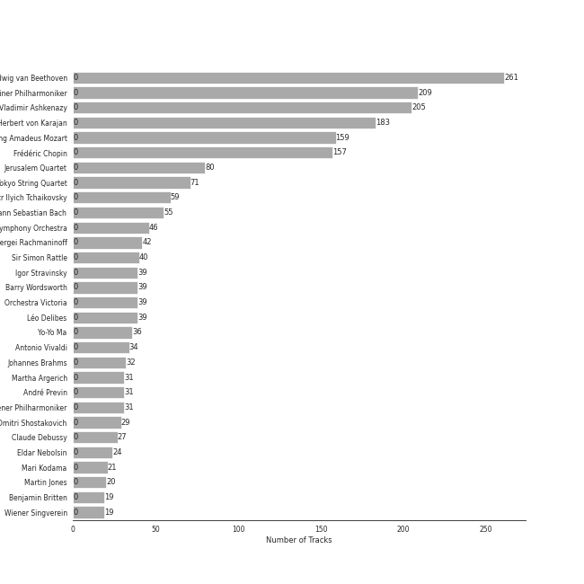
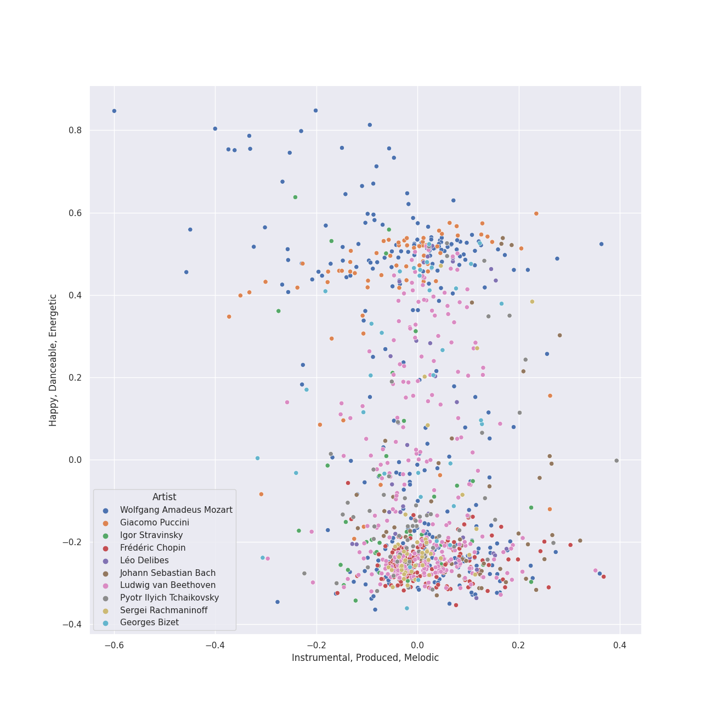
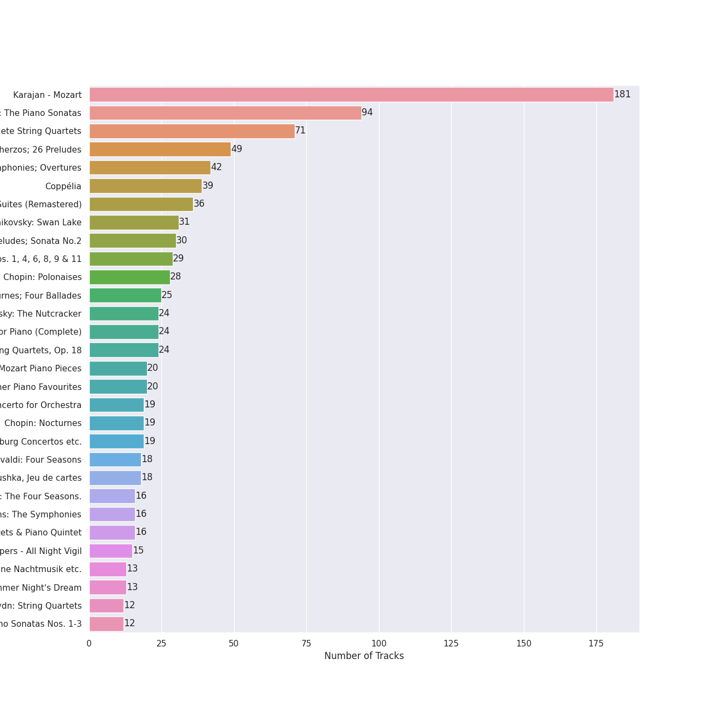
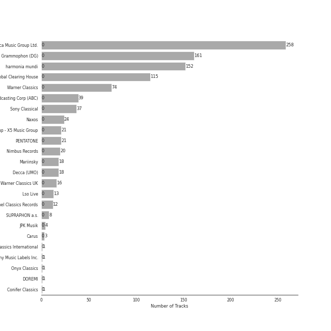

# classical

[1003 songs](classical_tracks.md)

## Top Artists

See top 100 artists

| Number of Tracks | Art | Artist | 🔗 |
|---:|:---|:---|:---|
| 261 |  | [Ludwig van Beethoven](../artists/ludwig_van_beethoven.md) | [🔗](https://open.spotify.com/artist/2wOqMjp9TyABvtHdOSOTUS) |
| 209 |  | [Berliner Philharmoniker](../artists/berliner_philharmoniker.md) | [🔗](https://open.spotify.com/artist/6uRJnvQ3f8whVnmeoecv5Z) |
| 205 |  | [Vladimir Ashkenazy](../artists/vladimir_ashkenazy.md) | [🔗](https://open.spotify.com/artist/20iZXzMb8LoWXOeca32i82) |
| 183 |  | [Herbert von Karajan](../artists/herbert_von_karajan.md) | [🔗](https://open.spotify.com/artist/5zCaQxjl110XTrm4LQ1CxY) |
| 159 |  | [Wolfgang Amadeus Mozart](../artists/wolfgang_amadeus_mozart.md) | [🔗](https://open.spotify.com/artist/4NJhFmfw43RLBLjQvxDuRS) |
| 157 |  | [Frédéric Chopin](../artists/fr_d_ric_chopin.md) | [🔗](https://open.spotify.com/artist/7y97mc3bZRFXzT2szRM4L4) |
| 80 |  | [Jerusalem Quartet](../artists/jerusalem_quartet.md) | [🔗](https://open.spotify.com/artist/7AnE8Jpu1vxLeXcs6OKYHE) |
| 71 |  | [Tokyo String Quartet](../artists/tokyo_string_quartet.md) | [🔗](https://open.spotify.com/artist/15G9RnBNBDCFUMANna2CvO) |
| 59 |  | [Pyotr Ilyich Tchaikovsky](../artists/pyotr_ilyich_tchaikovsky.md) | [🔗](https://open.spotify.com/artist/3MKCzCnpzw3TjUYs2v7vDA) |
| 55 |  | [Johann Sebastian Bach](../artists/johann_sebastian_bach.md) | [🔗](https://open.spotify.com/artist/5aIqB5nVVvmFsvSdExz408) |
| 46 |  | [London Symphony Orchestra](../artists/london_symphony_orchestra.md) | [🔗](https://open.spotify.com/artist/5yxyJsFanEAuwSM5kOuZKc) |
| 42 |  | [Sergei Rachmaninoff](../artists/sergei_rachmaninoff.md) | [🔗](https://open.spotify.com/artist/0Kekt6CKSo0m5mivKcoH51) |
| 40 |  | [Sir Simon Rattle](../artists/sir_simon_rattle.md) | [🔗](https://open.spotify.com/artist/4GQwgdcDQwqtcHICjUNndp) |
| 39 |  | [Igor Stravinsky](../artists/igor_stravinsky.md) | [🔗](https://open.spotify.com/artist/7ie36YytMoKtPiL7tUvmoE) |
| 39 |  | [Barry Wordsworth](../artists/barry_wordsworth.md) | [🔗](https://open.spotify.com/artist/5sjJnaI3YhaO8KylpJk3gN) |
| 39 |  | [Orchestra Victoria](../artists/orchestra_victoria.md) | [🔗](https://open.spotify.com/artist/1bnC6eJzCumTgAB7tG1118) |
| 39 |  | [Léo Delibes](../artists/l_o_delibes.md) | [🔗](https://open.spotify.com/artist/1M9AXZkNPdOd1IPEsQsXnT) |
| 36 |  | [Yo-Yo Ma](../artists/yo_yo_ma.md) | [🔗](https://open.spotify.com/artist/5Dl3HXZjG6ZOWT5cV375lk) |
| 34 |  | [Antonio Vivaldi](../artists/antonio_vivaldi.md) | [🔗](https://open.spotify.com/artist/2QOIawHpSlOwXDvSqQ9YJR) |
| 32 |  | [Johannes Brahms](../artists/johannes_brahms.md) | [🔗](https://open.spotify.com/artist/5wTAi7QkpP6kp8a54lmTOq) |
| 31 |  | [Martha Argerich](../artists/martha_argerich.md) | [🔗](https://open.spotify.com/artist/66MvLAvLznk5UOvASVGjk4) |
| 31 |  | [André Previn](../artists/andr__previn.md) | [🔗](https://open.spotify.com/artist/2tfWguHr2nj4e8KXLKciVq) |
| 29 |  | [Dmitri Shostakovich](../artists/dmitri_shostakovich.md) | [🔗](https://open.spotify.com/artist/6s1pCNXcbdtQJlsnM1hRIA) |
| 27 |  | [Claude Debussy](../artists/claude_debussy.md) | [🔗](https://open.spotify.com/artist/1Uff91EOsvd99rtAupatMP) |
| 24 |  | [Eldar Nebolsin](../artists/eldar_nebolsin.md) | [🔗](https://open.spotify.com/artist/45ts2AJTWlzJ9JrQlCGxpX) |
| 21 |  | [Mari Kodama](../artists/mari_kodama.md) | [🔗](https://open.spotify.com/artist/0s0wG03kPyu7MXERfcuxim) |
| 20 |  | [Martin Jones](../artists/martin_jones.md) | [🔗](https://open.spotify.com/artist/1VzJXXVXsYbEK773GWSoND) |
| 19 |  | [Benjamin Britten](../artists/benjamin_britten.md) | [🔗](https://open.spotify.com/artist/7MJ1pB5d6Vjmzep2zQlorn) |
| 19 |  | [Wiener Singverein](../artists/wiener_singverein.md) | [🔗](https://open.spotify.com/artist/35QSympF887CO8h5eZHme2) |
| 19 |  | [Maurizio Pollini](../artists/maurizio_pollini.md) | [🔗](https://open.spotify.com/artist/2VIdKQmRHnWofsR4odfFOh) |
| 19 |  | [English Chamber Orchestra](../artists/english_chamber_orchestra.md) | [🔗](https://open.spotify.com/artist/2DO4p3CPDnInsJfg0jFfaF) |
| 18 |  | [Mariinsky Orchestra](../artists/mariinsky_orchestra.md) | [🔗](https://open.spotify.com/artist/2rRUfv2w535SEUV1YO5SP6) |
| 18 |  | [Simon Standage](../artists/simon_standage.md) | [🔗](https://open.spotify.com/artist/2jIBkRzVUboTbp05rJnKeT) |
| 18 |  | [The English Concert](../artists/the_english_concert.md) | [🔗](https://open.spotify.com/artist/2Oz3z7PPQUMU2KNYgcO1sA) |
| 18 |  | [Valery Gergiev](../artists/valery_gergiev.md) | [🔗](https://open.spotify.com/artist/2LxnoYPOe0FCLC82R3xgO2) |
| 18 |  | [Trevor Pinnock](../artists/trevor_pinnock.md) | [🔗](https://open.spotify.com/artist/25mbgceDJKxXGP8c5FmC83) |
| 16 |  | [Sarah Chang](../artists/sarah_chang.md) | [🔗](https://open.spotify.com/artist/5duxfFAQVkDT9g261fKlMP) |
| 16 |  | [Emerson String Quartet](../artists/emerson_string_quartet.md) | [🔗](https://open.spotify.com/artist/4IBl8k6ZsBagsI5zRjyXH7) |
| 16 |  | [Orpheus Chamber Orchestra](../artists/orpheus_chamber_orchestra.md) | [🔗](https://open.spotify.com/artist/35pZsti1RSA5Zv98jAm8kX) |
| 15 |  | [Nikolai Korniev](../artists/nikolai_korniev.md) | [🔗](https://open.spotify.com/artist/70hS9SnJefkZo2QJwS2VXi) |
| 15 |  | [St.Petersburg Chamber Choir](../artists/st_petersburg_chamber_choir.md) | [🔗](https://open.spotify.com/artist/46WjEugfIF0rKOewvFiby2) |
| 15 |  | [Wiener Philharmoniker](../artists/wiener_philharmoniker.md) | [🔗](https://open.spotify.com/artist/003f4bk13c6Q3gAUXv7dGJ) |
| 13 |  | [Anna Tomowa-Sintow](../artists/anna_tomowa_sintow.md) | [🔗](https://open.spotify.com/artist/6NSIW1uEq8JZmxEkHMF17c) |
| 13 |  | [Felix Mendelssohn](../artists/felix_mendelssohn.md) | [🔗](https://open.spotify.com/artist/6MF58APd3YV72Ln2eVg710) |
| 13 |  | [John Eliot Gardiner](../artists/john_eliot_gardiner.md) | [🔗](https://open.spotify.com/artist/1qIRoGEKXINqrCx5N1engi) |
| 12 |  | [Carmen Piazzini](../artists/carmen_piazzini.md) | [🔗](https://open.spotify.com/artist/6aQUOvrKLOquCAvIGdIwTx) |
| 12 |  | [Joseph Haydn](../artists/joseph_haydn.md) | [🔗](https://open.spotify.com/artist/656RXuyw7CE0dtjdPgjJV6) |
| 12 |  | [The Amsterdam String Quartet](../artists/the_amsterdam_string_quartet.md) | [🔗](https://open.spotify.com/artist/0kbgyaL9g2Eba79p2jiYlN) |
| 11 |  | [Gerd Seifert](../artists/gerd_seifert.md) | [🔗](https://open.spotify.com/artist/4aIYtx2Z5X9vRlysnruy66) |
| 10 |  | [Academy of St. Martin in the Fields](../artists/academy_of_st__martin_in_the_fields.md) | [🔗](https://open.spotify.com/artist/77CaCn32H4mOMQA7UElzfF) |
| 10 |  | [Sir Neville Marriner](../artists/sir_neville_marriner.md) | [🔗](https://open.spotify.com/artist/6NUhQz7eAEsZvjEHTKHux9) |
| 8 |  | Kühn Mixed Choir | [🔗](https://open.spotify.com/artist/7coad48I6XW2msLS0ms53T) |
| 8 |  | Pavel Kühn | [🔗](https://open.spotify.com/artist/7bzLxD5IZSXMmuuqnZ7MfY) |
| 8 |  | Vlasta Mlejnková | [🔗](https://open.spotify.com/artist/775Rkua0PHENjo1sFIyApV) |
| 8 |  | Antonín Dvořák | [🔗](https://open.spotify.com/artist/6n7nd5iceYpXVwcx8VPpxF) |
| 8 |  | José van Dam | [🔗](https://open.spotify.com/artist/5qNUHMEhszyeXNYMn4sswd) |
| 8 |  | Alexander Knox | [🔗](https://open.spotify.com/artist/4vzwv4zzBTlG8qsFCqP2Yv) |
| 8 |  | Francis Poulenc | [🔗](https://open.spotify.com/artist/4IAWVxo2fpTBPn6k7GZ3eY) |
| 8 |  | Veronika Hagen | [🔗](https://open.spotify.com/artist/3ijxXTal6hr7byhqZDdHsP) |
| 8 |  | Gabriel Fauré | [🔗](https://open.spotify.com/artist/2gClsBep1tt1rv1CN210SO) |
| 7 |  | Orchestre de l’Opéra national de Paris | [🔗](https://open.spotify.com/artist/6qe7dVv9gojPhhrZDL1TUS) |
| 7 |  | Gustav Holst | [🔗](https://open.spotify.com/artist/5B7uXBeLc2TkR5Jk23qKIZ) |
| 7 |  | Myung-Whun Chung | [🔗](https://open.spotify.com/artist/4hdiwtmc6OEFFxpSlwwmby) |
| 7 |  | Agnes Baltsa | [🔗](https://open.spotify.com/artist/2amF56vDuTTbZJQsqUgbuC) |
| 7 |  | John Birch | [🔗](https://open.spotify.com/artist/2TFBoJYsuvMuPMOlwXWbaE) |
| 6 |  | Anne-Sophie Mutter | [🔗](https://open.spotify.com/artist/6pzfUmBsQAKxOhy0NSi8zn) |
| 6 |  | Ceri-lyn Cissone | [🔗](https://open.spotify.com/artist/6F3jOFmhUwRxRdWAZU6G1A) |
| 6 |  | András Schiff | [🔗](https://open.spotify.com/artist/24K6LTZFqBAvKsorwK0iXd) |
| 6 |  | Academy of St Martin in the Fields Chorus | [🔗](https://open.spotify.com/artist/1GxYERY1PDh1dEuFqvTDa5) |
| 5 |  | Béla Bartók | [🔗](https://open.spotify.com/artist/5zyNXVd952fWOjkdGHCvPd) |
| 5 |  | Werner Krenn | [🔗](https://open.spotify.com/artist/3PuXD6h01YqjNWQ055CWxA) |
| 5 |  | Vinson Cole | [🔗](https://open.spotify.com/artist/2j6cP3f3TxyHzcKdWYSm6h) |
| 4 |  | Frankie Wakefield | [🔗](https://open.spotify.com/artist/7jobsaZIFhejECE605yxx6) |
| 4 |  | Leon Fleisher | [🔗](https://open.spotify.com/artist/6ncNdxBc8zVWMOF7nJ5Pgy) |
| 4 |  | Gottfried Hornik | [🔗](https://open.spotify.com/artist/6aFQ4LADfHVe08B5gQuE8X) |
| 4 |  | Cologne New Philharmonic Orchestra | [🔗](https://open.spotify.com/artist/4jSOT0xN5OKPgEfawfzInB) |
| 4 |  | Krystian Zimerman | [🔗](https://open.spotify.com/artist/43wuPaPcZVMJQWLRaPR4Yz) |
| 4 |  | Helga Muller-Molinari | [🔗](https://open.spotify.com/artist/3s5xNX5n6PAzpusMRhmHbA) |
| 4 |  | Manfred Klier | [🔗](https://open.spotify.com/artist/3KkpLfmwQob3Y75ePPdtse) |
| 4 |  | Mikhail Gantvarg | [🔗](https://open.spotify.com/artist/1SCRjxxRnRFsoctLKXIoZx) |
| 4 |  | Paata Burchuladze | [🔗](https://open.spotify.com/artist/1JzOJmq9kk0u7OWqzXkBcc) |
| 4 |  | Volker Hartung | [🔗](https://open.spotify.com/artist/19nzpbhd3Yv5PQXtWKZkhX) |
| 4 |  | Maurice Ravel | [🔗](https://open.spotify.com/artist/17hR0sYHpx7VYTMRfFUOmY) |
| 4 |  | The St. Petersburg Soloists | [🔗](https://open.spotify.com/artist/11K9yxwc8iVyEh0ya9v9XY) |
| 3 |  | Gary Hoffman | [🔗](https://open.spotify.com/artist/7qcRbaIYVuOERS3KmB71GH) |
| 3 |  | NDR Chor | [🔗](https://open.spotify.com/artist/7hMAA1N5j1Ynb49NIWO7HV) |
| 3 |  | Ossip Schnirlin | [🔗](https://open.spotify.com/artist/7eI7DJSWlJy2W2337B9oTL) |
| 3 |  | Joseph Joachim | [🔗](https://open.spotify.com/artist/6QuJ4aZSRMebqwDXiJ3SuA) |
| 3 |  | David Reichenberg | [🔗](https://open.spotify.com/artist/5xA5sW0D3BUAyL02XcDkYv) |
| 3 |  | Michael Francis | [🔗](https://open.spotify.com/artist/4znpeZQkiPbcXtHlRbfTqF) |
| 3 |  | Orchestre Symphonique de Montréal | [🔗](https://open.spotify.com/artist/4AcXapei4U7xnWecv9AEBd) |
| 3 |  | Sam Franko | [🔗](https://open.spotify.com/artist/3vkG71N5uQBzhzwEDr6icH) |
| 3 |  | Philipp Ahmann | [🔗](https://open.spotify.com/artist/309coOGhdzqXdIRwJH1xUo) |
| 3 |  | Chor der Deutschen Oper Berlin | [🔗](https://open.spotify.com/artist/2KvV4gawnuMNG74DgSAQ0n) |
| 3 |  | Elizabeth Wilcock | [🔗](https://open.spotify.com/artist/1OfYCRcS14pyRVrO0qTCbs) |
| 3 |  | Valentina Lisitsa | [🔗](https://open.spotify.com/artist/0gOrXuu1vCBXe3pwTyb5Ca) |
| 3 |  | Charles Dutoit | [🔗](https://open.spotify.com/artist/0Ku5VBNL7cfGXRhp2BxXEQ) |
| 2 |  | Elisabeth Sombart | [🔗](https://open.spotify.com/artist/6pp4xqAWH1oHFQX0kJtVvO) |
| 2 |  | Roberte Mamou | [🔗](https://open.spotify.com/artist/6DsbdauTI2Fn2NN4B1EIUN) |
| 2 |  | Berliner Symphoniker | [🔗](https://open.spotify.com/artist/5pF76lplGIvEFGb8lI48hA) |

## Top Albums

See all 54 albums

| Number of Tracks | Art | Album | Release Date | 🔗 |
|---:|:---|:---|:---|:---|
| 115 |  | Karajan - Mozart | 2020-06-16 | [🔗](https://open.spotify.com/album/1HSJhsMIW2EDD4YSSkbc9e) |
| 94 |  | Beethoven: The Piano Sonatas | 1995-01-01 | [🔗](https://open.spotify.com/album/7xbsSOswKgms1fUFuwKArz) |
| 71 |  | Beethoven: Complete String Quartets | 2010-10-12 | [🔗](https://open.spotify.com/album/4JhUG1lr4xztAcqyA0Jm3a) |
| 49 |  | Chopin: Waltzes; 4 Scherzos; 26 Preludes | 1999-01-01 | [🔗](https://open.spotify.com/album/0yCrQ6dCqiI6ldqI8LPqWB) |
| 42 |  | Beethoven: 9 Symphonies; Overtures | 1993-01-01 | [🔗](https://open.spotify.com/album/2DQTNTznsteIZciZdyeWdj) |
| 39 |  | Coppélia | 2018-07-06 | [🔗](https://open.spotify.com/album/7jKT8NC2XfAs9RFKsrGz2p) |
| 36 |  | Bach: Unaccompanied Cello Suites (Remastered) | 1983 | [🔗](https://open.spotify.com/album/2OpnKgmVYPEN2GldgBponI) |
| 31 |  | Tchaikovsky: Swan Lake | 1976 | [🔗](https://open.spotify.com/album/7dVA06E7AP7P7VzPyNxQVO) |
| 30 |  | Chopin: Preludes; Sonata No.2 | 2002-01-01 | [🔗](https://open.spotify.com/album/33YXJqoFV5AQwbo4yfk22n) |
| 29 |  | Shostakovich: String Quartets Nos. 1, 4, 6, 8, 9 & 11 | 2005 | [🔗](https://open.spotify.com/album/4V2YVRjysd08RF0GLRDDK7) |
| 28 |  | Chopin: Polonaises | 1996-01-01 | [🔗](https://open.spotify.com/album/19ofW4fqCAR2uQJKVWw6L6) |
| 25 |  | Chopin: Nocturnes; Four Ballades | 1997-01-01 | [🔗](https://open.spotify.com/album/0lrM7kR5o7iqkajLKIlzRg) |
| 24 |  | Tchaikovsky: The Nutcracker | 2010-10-11 | [🔗](https://open.spotify.com/album/54Awn36ryf55PkZyOR4iwQ) |
| 24 |  | Rachmaninov: Preludes for Piano (Complete) | 2007-05-29 | [🔗](https://open.spotify.com/album/1vlnwUAidj7bEmRhsq4zTv) |
| 24 |  | Beethoven: String Quartets, Op. 18 | 2015-08-31 | [🔗](https://open.spotify.com/album/37iUq5Dekt8uP5itTiVs2Q) |
| 20 |  | Mozart Piano Pieces | 2020-10-13 | [🔗](https://open.spotify.com/album/3AYEvo7R1gY4O5xJuMwy3U) |
| 20 |  | Debussy: Clair De Lune and Other Piano Favourites | 1994 | [🔗](https://open.spotify.com/album/4O5tv6jrLH80bmll46xEEe) |
| 19 |  | Stravinsky: The Rite of Spring / Bartók: Concerto for Orchestra | 2007-01-01 | [🔗](https://open.spotify.com/album/317b74rpNBO2uhaJFyMaxJ) |
| 19 |  | Chopin: Nocturnes | 2005-01-01 | [🔗](https://open.spotify.com/album/2aoSpTAjFaMvaZeruqnCVv) |
| 19 |  | Bach, J.S.: Brandenburg Concertos etc. | 1995-01-01 | [🔗](https://open.spotify.com/album/11FzhwtOFCPB4vpgWo33xV) |
| 18 |  | Vivaldi: Four Seasons | 2008-01-01 | [🔗](https://open.spotify.com/album/4Uc1Cus3I9LjkI2XwtQnfc) |
| 18 |  | Stravinsky: Petrushka, Jeu de cartes | 2018-10-19 | [🔗](https://open.spotify.com/album/19fQbFNjlfXgBAFqftKzWA) |
| 16 |  | Vivaldi: The Four Seasons. | 2007-10-01 | [🔗](https://open.spotify.com/album/4YpaKMCcb65yOoee75UUOh) |
| 16 |  | Brahms: The Symphonies | 2009-09-07 | [🔗](https://open.spotify.com/album/2dL2qDsg6teV1cueLxCRa1) |
| 16 |  | Brahms: String Quartets & Piano Quintet | 2007-01-01 | [🔗](https://open.spotify.com/album/5nZ5ePGoQZGt1MbGphwqph) |
| 15 |  | Rachmaninov: Vespers - All Night Vigil | 1994 | [🔗](https://open.spotify.com/album/7hqotgNjEJt09XiggaMI1v) |
| 13 |  | Mendelssohn: A Midsummer Night's Dream | 2017-02-03 | [🔗](https://open.spotify.com/album/60J66evwnrnfH03HgDTrwN) |
| 12 |  | Haydn: String Quartets | 2008-01-01 | [🔗](https://open.spotify.com/album/1rNGG2I3AKJy9FWqUiitkc) |
| 12 |  | Beethoven: Piano Sonatas Nos. 1-3 | 2008-01-01 | [🔗](https://open.spotify.com/album/5CjMjZJnjdHHgwAVkqrvXq) |
| 11 |  | Mozart: String Quartets Nos. 4, 17 & 22 | 2011-02-22 | [🔗](https://open.spotify.com/album/1PxALR0DTaTJPL6ByBK266) |
| 9 |  | Beethoven: Piano Sonatas Nos. 30, 31 & 32 | 2012-03-06 | [🔗](https://open.spotify.com/album/478l1JdqbqDzcmmgrqw2zu) |
| 9 |  | Beethoven: Piano Sonatas "Moonlight"; "Appassionata"; "Pathétique" | 1983-01-01 | [🔗](https://open.spotify.com/album/0RCfE1YhkdrjnM3kXT3YLl) |
| 8 |  | Poulenc: Motets and Mass | 2013-01-30 | [🔗](https://open.spotify.com/album/6czmOzWnyfS71jDpRxZDam) |
| 8 |  | Dvorak: String Quintet, Op. 97 & String Sextet, Op. 48 | 2018-01-19 | [🔗](https://open.spotify.com/album/02nUFvsdTaekp2QQalnE3N) |
| 8 |  | Debussy & Ravel: String Quartets | 2018-05-25 | [🔗](https://open.spotify.com/album/77Eg2dHidrefgsS3GZ88nK) |
| 7 |  | Stravinsky: The Firebird (Ballet Suite) | 2009-01-01 | [🔗](https://open.spotify.com/album/2q1xMRl4AcA7rI8GfGnmvD) |
| 7 |  | Holst: The Planets | 1981-01-01 | [🔗](https://open.spotify.com/album/4v0Xyz0LVToUsSTGdsvKSK) |
| 7 |  | Fauré: Requiem; Pavane | 2008-01-01 | [🔗](https://open.spotify.com/album/0mhVHXJrGE5WUA58CJLf29) |
| 6 |  | Mozart: The Piano Sonatas | 1981-01-01 | [🔗](https://open.spotify.com/album/1qM2Z3rhkJLQIXnAQpIUdY) |
| 4 |  | Mozart: Symphony No. 40 in G Minor, Bassoon Concerto & Flute Serenades Nos. 1 & 3 | 2017-12-08 | [🔗](https://open.spotify.com/album/3WHqaCZ66SWzL7LyYnrn9y) |
| 4 |  | Chopin: Ballades; Barcarolle; Fantaisie | 1988-01-01 | [🔗](https://open.spotify.com/album/5c9v5oU43Oo22MSG8EKFp2) |
| 3 |  | Tchaikovsky: Sacred Choral Music | 2016-07-01 | [🔗](https://open.spotify.com/album/4udN7bCLaa8zCnaIvoxzOB) |
| 3 |  | Rachmaninov: Piano Concerto No.2 | 2012-01-01 | [🔗](https://open.spotify.com/album/5lVqgXqdoIH3W1wUM2hzPx) |
| 3 |  | Mozart: Eine Kleine Nachtmusik etc. | 1986 | [🔗](https://open.spotify.com/album/5YCuibCDJrkVcS3UOAYqr9) |
| 3 |  | Debussy: La Mer; Jeux; Prélude à l'après-midi d'un faune; Le Martyre de Saint Sébastien (Symphonic Fragments) | 1989-01-01 | [🔗](https://open.spotify.com/album/5egJ0o1mVH2liUfecDWYqk) |
| 1 |  | Purcell : Anthems & Sacred Songs [Evening Prayer] | 2003-08-29 | [🔗](https://open.spotify.com/album/7K8qhv7euF0xd6DiqoReDK) |
| 1 |  | Mussorgsky: Pictures At An Exhibition | 2016-12-02 | [🔗](https://open.spotify.com/album/1b2aoeaYZZBWmJoavOQhnd) |
| 1 |  | Martha Argerich Live, Vol. 4 | 2017-01-20 | [🔗](https://open.spotify.com/album/69aoRIAIVb2TbIuxmxKYCR) |
| 1 |  | Fauré/Duruflé/Messiaen | 1989 | [🔗](https://open.spotify.com/album/2kJvD9jzU5n9dmNj9FoyQ8) |
| 1 |  | Fauré Pavane | 2020-05-30 | [🔗](https://open.spotify.com/album/0FaQ2LW8NNG3YXYJXFikJF) |
| 1 |  | Chopin: Piano Sonata No. 3, Fantasie-impromptu, Prélude, Nocturne, et al. | 2010-04-05 | [🔗](https://open.spotify.com/album/5QmPVpRux60kcHndJOl6bF) |
| 1 |  | Cappella | 2013 | [🔗](https://open.spotify.com/album/3n6JxpdWnHkazMCQxKK5qI) |
| 1 |  | Bruckner: Mass in E Minor & Motets | 2002 | [🔗](https://open.spotify.com/album/13eAUvw0Ga3BBFsf6oxF46) |
| 1 |  | Allegri - Miserere | 1994-02-15 | [🔗](https://open.spotify.com/album/6DXPSePAsqcD40WQsSnasD) |

## Top Record Labels

See all 24 labels

| Number of Tracks | Label |
|---:|:---|
| 258 | [Decca Music Group Ltd.](../labels/decca_music_group_ltd_.md) |
| 152 | [harmonia mundi](../labels/harmonia_mundi.md) |
| 145 | [Deutsche Grammophon (DG)](../labels/deutsche_grammophon__dg_.md) |
| 115 | [UME - Global Clearing House](../labels/ume___global_clearing_house.md) |
| 74 | [Warner Classics](../labels/warner_classics.md) |
| 39 | [Australian Broadcasting Corp (ABC)](../labels/australian_broadcasting_corp__abc_.md) |
| 37 | [Sony Classical](../labels/sony_classical.md) |
| 24 | [Naxos](../labels/naxos.md) |
| 21 | [Warner Music Group - X5 Music Group](../labels/warner_music_group___x5_music_group.md) |
| 21 | [PENTATONE](../labels/pentatone.md) |
| 20 | [Nimbus Records](../labels/nimbus_records.md) |
| 18 | [Mariinsky](../labels/mariinsky.md) |
| 18 | [Decca (UMO)](../labels/decca__umo_.md) |
| 16 | [Warner Classics UK](../labels/warner_classics_uk.md) |
| 13 | [Lso Live](../labels/lso_live.md) |
| 12 | [Channel Classics Records](../labels/channel_classics_records.md) |
| 8 | SUPRAPHON a.s. |
| 4 | JPK Musik |
| 3 | Carus |
| 2 | Conifer Classics |
| 1 | Warner Classics International |
| 1 | [Sony Music Labels Inc.](../labels/sony_music_labels_inc_.md) |
| 1 | Onyx Classics |
| 1 | DOREMI |

## Audio Features

| 10 most Danceable tracks | 10 least Danceable tracks |
|:---|:---|
| 24 Préludes, Op. 28: No. 20 in C Minor: Largo (0.753) | String Quartet No. 8 in C Minor, Op. 110: V. Largo (0.0592) |
| Brandenburg Concerto No. 2 in F, BWV 1047: 3. Allegro assai (0.691) | The Planets, Op. 32: 7. Neptune, the Mystic (0.0601) |
| Brandenburg Concerto No. 2 in F, BWV 1047: 1. (Allegro) (0.687) | Symphony No. 9 In D Minor, Op. 125 - "Choral": 3. Adagio molto e cantabile (0.062) |
| 24 Préludes, Op. 28: No. 20 in C Minor: Largo (0.677) | String Quartet in G Minor, Op. 10: III. Andantino, doucement expressif (0.0623) |
| Coppélia / Tableau 2: No. 16 Boléro - Alternative Version (0.661) | La Mer, L.109: 1. From Dawn Till Noon On The Sea (De l'aube à midi sur la mer) (0.0633) |
| Coppélia / Tableau 2: No. 11a Musique des automates (0.648) | Vespers, Op. 37: XII. "Slava v vyshnikh Bogu" (0.0636) |
| String Quartet No.11 in F Minor, Op. 122: V. Humoresque (Allegro) (0.63) | Die Zauberflöte, K.620 / Act 2: "O Isis und Osiris, welche Wonne!" (0.0663) |
| 24 Préludes, Op. 28: No. 10 in C-Sharp Minor: Molto allegro (0.629) | Requiem in D Minor, Op. 48: II. Offertorium. Domine Jesu Christe (0.0668) |
| String Quartet No. 4 in C Major, K. 157: III. Presto (0.614) | Horn Concerto No. 4 in E-Flat Major, K. 495: II. Romanza. Andante (0.0683) |
| A Midsummer Night's Dream, Incidental Music, Op. 61: "Ay Me! For Aught That I Could Ever Read" (0.614) | String Quartet No. 8 in C Minor, Op. 110: I. Largo (0.0744) |

| 10 most Energetic tracks | 10 least Energetic tracks |
|:---|:---|
| Le Sacre du Printemps - Revised version for Orchestra (published 1947) / Part 1: The Adoration of the Earth: Procession of the Sage (0.7) | Le Sacre du Printemps - Revised version for Orchestra (published 1947) / Part 1: The Adoration of the Earth: The Sage (0.000239) |
| 24 Préludes, Op. 28: No. 22 in G Minor (0.641) | Préludes Book 1, L. 117: I. Des Pas sur La Neige (0.000594) |
| Le Sacre du Printemps - Revised version for Orchestra (published 1947) / Part 1: The Adoration of the Earth: Ritual of Abduction (0.555) | Images, Set 2, L. 111: et la Lune descend sur le Temple qui fut (0.00104) |
| Requiem in D Minor, K.626: 3a. Sequientia: Dies irae (0.542) | The Firebird (L'oiseau De Feu) - Suite (1919): Introduction (0.00108) |
| String Quartet No. 8 in C Minor, Op. 110: II. Allegro molto (0.511) | Préludes Book 2, L. 123: II. Canope (0.00148) |
| Le Sacre du Printemps - Revised version for Orchestra (published 1947) / Part 1: The Adoration of the Earth: Dance of the Earth (0.509) | Piano Sonata No. 21 in C Major, Op. 53 "Waldstein": II. Introduzione (Adagio molto) (0.00157) |
| Tchaikovsky: The Nutcracker, Op. 71, Act II: No. 12d, Divertissement. Trepak, Russian Dance (0.5) | Piano Sonata No. 31 in A flat, Op. 110: 3. Adagio ma non troppo (0.00168) |
| Vespers, Op. 37: XV. "Vzbrannoy voevode" (0.488) | 24 Préludes, Op. 28: No. 7 in A Major (0.00168) |
| The Planets, Op. 32: 1. Mars, the Bringer of War (0.478) | 24 Préludes, Op. 28: No. 7 in A Major: Andantino (0.00174) |
| Tchaikovsky: Swan Lake, Op. 20, Act III: No. 15, Scene. March - Allegro giusto (0.474) | 24 Préludes, Op. 28: No. 2 in A Minor (0.00189) |

| 10 most Speechy tracks | 10 least Speechy tracks |
|:---|:---|
| 24 Préludes, Op. 28: No. 20 in C Minor: Largo (0.879) | Le Sacre du Printemps - Revised version for Orchestra (published 1947) / Part 1: The Adoration of the Earth: Dance of the Earth (0.0292) |
| A Midsummer Night's Dream, Incidental Music, Op. 61: No. 2, L'istesso tempo (0.676) | Le Sacre du Printemps - Revised version for Orchestra (published 1947) / Part 1: The Adoration of the Earth: The Augurs of Spring: Dances of the Young Girls (0.0293) |
| 24 Préludes, Op. 28: No. 20 in C Minor: Largo (0.592) | Requiem In D Minor, K.626: 4. Offertorium: Domine Jesu (0.0293) |
| A Midsummer Night's Dream, Incidental Music, Op. 61: "Ay Me! For Aught That I Could Ever Read" (0.524) | Symphony No. 39 in E flat, K.543: 3. Menuetto (Allegretto) (0.0297) |
| String Quartet No.11 in F Minor, Op. 122: V. Humoresque (Allegro) (0.274) | 24 Préludes, Op. 28: No. 24 in D Minor: Allegro appassionato (0.0298) |
| The Firebird (L'oiseau De Feu) - Suite (1919): Dance Of The Firebird (0.167) | 24 Préludes, Op. 28: No. 12. in G-Sharp Minor (0.03) |
| Piano Sonata No. 21 in C Major, Op. 53 "Waldstein": II. Introduzione (Adagio molto) (0.0974) | Requiem In D Minor, K.626: 5. Sanctus (0.0301) |
| Vivaldi: The Four Seasons, Violin Concerto in F Minor, Op. 8 No. 4, RV 297 "Winter": III. Allegro (0.0963) | 24 Préludes, Op. 28: No. 3 in G Major: Vivace (0.0303) |
| Le Sacre du Printemps - Revised version for Orchestra (published 1947) / Part 2: The Sacrifice: Glorification of the Chosen One (0.0935) | Requiem In D Minor, K.626: 2. Kyrie (0.0304) |
| Piano Sonata No. 19 in G minor, Op. 49 No. 1: 2. Rondo (Allegro) (0.0889) | 13 Preludes, Op. 32: No. 6 in F Minor: Allegro appassionato (0.0304) |

| 10 most Acoustic tracks | 10 least Acoustic tracks |
|:---|:---|
| Nocturne No. 11 In G Minor, Op. 37 No. 1 (0.996) | Vivaldi: The Four Seasons, Violin Concerto in F Major, Op. 8 No. 3, RV 293 "Autumn": II. Adagio molto (0.0524) |
| Piano Sonata No. 10 in C Major, K. 330: II. Andante cantabile (0.996) | Concerto for Violin and Strings in F Major, Op. 8, No. 3, RV 293 "L'autunno": II. Adagio molto (Ubriachi dormienti) (0.386) |
| Nocturne No. 12 In G, Op. 37 No. 2 (0.996) | A Midsummer Night's Dream, Incidental Music, Op. 61: "Ay Me! For Aught That I Could Ever Read" (0.41) |
| Wiosna, B117 (arr. from Op. 74/2) (0.996) | Tchaikovsky: The Nutcracker, Op. 71, Act II: No. 12a, Divertissement. Chocolate, Spanish Dance (0.583) |
| Feuille d'album in E, Op. posth. (0.995) | Le Sacre du Printemps - Revised version for Orchestra (published 1947) / Part 1: The Adoration of the Earth: The Sage (0.591) |
| 24 Préludes, Op. 28: No. 13 in F-Sharp Major (0.995) | Vivaldi: The Four Seasons, Violin Concerto in F Minor, Op. 8 No. 4, RV 297 "Winter": II. Largo (0.596) |
| Piano Sonata No. 25 in G, Op. 79: 2. Andante (0.995) | Le Sacre du Printemps - Revised version for Orchestra (published 1947) / Part 1: The Adoration of the Earth: Procession of the Sage (0.612) |
| Vespers, Op. 37: VIII. "Kvalite imya Gospodne" (0.995) | Die Zauberflöte, K.620 / Act 2: Ein Mädchen oder Weibchen (Papageno) (0.623) |
| Piano Sonata No. 16 in C Major, K. 545 "Sonata facile": II. Andante (0.995) | Concerto for Violin and Strings in E Major, Op. 8, No. 1, RV 269 "La Primavera": III. Allegro (Danza pastorale) (0.644) |
| Piano Sonata No. 19 in G minor, Op. 49 No. 1: 1. Andante (0.995) | Violin Concerto in F Minor, Op. 8, No. 4, RV 297 "L'inverno": II. Largo (0.65) |

| 10 most Instrumental tracks | 10 least Instrumental tracks |
|:---|:---|
| Vespers, Op. 37: XIV. "Voskrez iz groba" (0.98) | Violin Concerto in F Minor, Op. 8, No. 4, RV 297 "L'inverno": II. Largo (0.0) |
| Vespers, Op. 37: VI. "Bogoroditse Devo" (0.979) | A Midsummer Night's Dream, Incidental Music, Op. 61: "Ay Me! For Aught That I Could Ever Read" (0.0) |
| Tchaikovsky: Swan Lake, Op. 20, Act IV: No. 26, Scene. Allegro ma non troppo (0.978) | A Midsummer Night's Dream, Incidental Music, Op. 61: No. 8, Andante (0.0) |
| Le Sacre du Printemps - Revised version for Orchestra (published 1947) / Part 1: The Adoration of the Earth: Introduction (0.972) | Die Zauberflöte, K.620 / Act 2: Ein Mädchen oder Weibchen (Papageno) (0.0) |
| Requiem in D Minor, Op. 48: VII. In Paradisum (0.971) | A Midsummer Night's Dream, Incidental Music, Op. 61: No. 4, Andante (0.0) |
| String Quartet No. 14 in C-Sharp Minor, Op. 131: VI. Adagio quasi un poco andante (0.97) | A Midsummer Night's Dream, Incidental Music, Op. 61: No. 2, L'istesso tempo (0.0) |
| 24 Préludes, Op. 28: No. 10 in C-Sharp Minor (0.964) | Die Zauberflöte, K.620 / Act 1: "Bei Männern, welche Liebe fühlen" (0.0) |
| Nocturne No. 8 In D Flat, Op. 27 No. 2 - 2005 Recording (0.959) | Concerto for Violin and Strings in F Major, Op. 8, No. 3, RV 293 "L'autunno": II. Adagio molto (Ubriachi dormienti) (2.04e-06) |
| Divertimento No. 11 in D, K.251 "Nannerl-Septett": Menuetto (Tema con variazioni) (0.958) | A Midsummer Night's Dream, Incidental Music, Op. 61: Finale. Allegro di molto (3.2e-06) |
| 24 Préludes, Op. 28: No. 11 in B Major (0.956) | Die Zauberflöte, K.620 / Act 1: Der Vogelfänger bin ich ja (Papageno) (1.03e-05) |

| 10 most Live tracks | 10 least Live tracks |
|:---|:---|
| The Firebird (L'oiseau De Feu) - Suite (1919): 3. Variation Of The Firebird (0.743) | String Quartet No. 2 In A Minor, Op. 51 No. 2: 4. Finale (Allegro non assai - Più vivace) (0.0439) |
| Polonaise No. 6 in A-Flat Major, Op. 53, "Heroic" (0.682) | String Quartet No. 3 in D Major, Op. 18: I. Allegro (0.045) |
| Le Sacre du Printemps - Revised version for Orchestra (published 1947) / Part 1: The Adoration of the Earth: The Augurs of Spring: Dances of the Young Girls (0.669) | Ballade No. 2 in F Major, Op. 38 (0.0494) |
| A Midsummer Night's Dream, Incidental Music, Op. 61: No. 4, Andante (0.626) | 24 Préludes, Op. 28: No. 7 in A Major: Andantino (0.0504) |
| String Quartet No. 2 in G Major, Op. 18, No. 2: III. Scherzo (Allegro) - Trio (0.62) | Piano Sonata No. 32 in C minor, Op. 111: 2. Arietta (Adagio molto semplice e cantabile) (0.0511) |
| Symphony No. 5 In C Minor, Op. 67: 3. Allegro (0.614) | 13 Preludes, Op. 32: No. 7 in F Major: Moderato (0.0533) |
| Symphony No. 36 in C Major, K. 425 "Linz": 3. Menuetto (0.594) | Concerto for Violin and Strings in F Major, Op. 8, No. 3, RV 293 "L'autunno": II. Adagio molto (Ubriachi dormienti) (0.0551) |
| Tchaikovsky: The Nutcracker, Op. 71, Act I, Scene 1: No. 3, Children's Galop and Entry of the Parents (0.578) | Piano Concerto No. 2 in C Minor, Op. 18: 2. Adagio sostenuto (0.0551) |
| Tchaikovsky: Swan Lake, Op. 20, Act III: No. 18, Scene. Allegro - Allegro giusto (0.565) | Préludes Book 2, L. 123: II. Canope (0.0553) |
| Petrushka: First Scene: IV. Russian Dance (1911 original version) (0.558) | Symphony No. 1 In C, Op. 21: 3. Menuetto (Allegro molto e vivace) (0.0554) |

| 10 most Happy tracks | 10 least Happy tracks |
|:---|:---|
| Brandenburg Concerto No. 2 in F, BWV 1047: 3. Allegro assai (0.931) | Le Sacre du Printemps - Revised version for Orchestra (published 1947) / Part 1: The Adoration of the Earth: The Sage (0.0) |
| Petrushka: Third Scene: II. Dance of the Ballerina (1911 original version) (0.907) | The Firebird (L'oiseau De Feu) - Suite (1919): Dance Of The Firebird (0.0) |
| Galop Marquis (0.893) | 24 Préludes, Op. 28: No. 7 in A Major: Andantino (0.0) |
| Waltz No. 16 in A flat, Op. posth. (0.89) | String Quartet No. 9 in E-Flat Major, Op. 117: II. Adagio (0.0251) |
| Tchaikovsky: The Nutcracker, Op. 71, Act II: No. 12a, Divertissement. Chocolate, Spanish Dance (0.879) | 24 Préludes, Op. 28: No. 9 in E Major: Largo (0.0292) |
| String Quartet No. 4 in C Major, K. 157: III. Presto (0.878) | The Planets, Op. 32: 2. Venus, the Bringer of Peace (0.0301) |
| Cello Suite No. 3 in C Major, BWV 1009: III. Courante (0.871) | The Planets, Op. 32: 7. Neptune, the Mystic (0.0305) |
| Cello Suite No. 4 in E-Flat Major, BWV 1010: VI. Gigue (0.869) | String Quartet No.11 in F Minor, Op. 122: VI. Elégie (Adagio) (0.0307) |
| Cello Suite No. 2 in D Minor, BWV 1008: III. Courante (0.852) | Concerto for Orchestra, Sz. 116: 3. Elegia (Andante, non troppo) (0.0312) |
| Tchaikovsky: The Nutcracker, Op. 71, Act II: No. 12d, Divertissement. Trepak, Russian Dance (0.851) | The Planets, Op. 32: 5. Saturn, the Bringer of Old Age (0.0316) |
