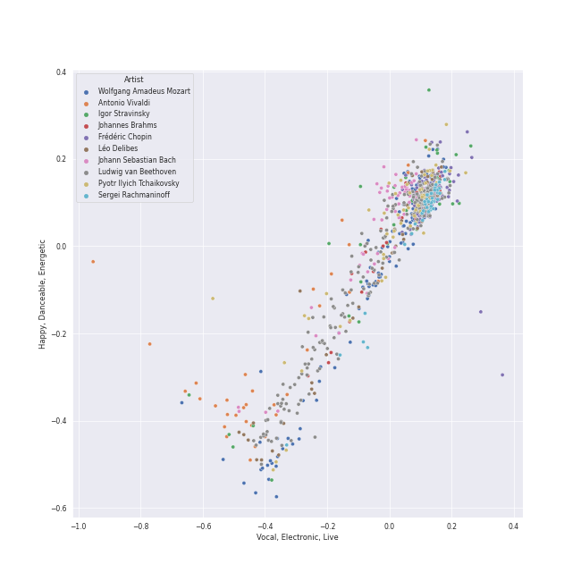

# classical

[1230 songs](classical_tracks.md)

## Top Artists

See top 100 artists

|   Number of Tracks | Art                                                                                              | Artist                                                                                   | 🔗                                                           |
|-------------------:|:-------------------------------------------------------------------------------------------------|:-----------------------------------------------------------------------------------------|:------------------------------------------------------------|
|                305 |  | [Berliner Philharmoniker](../artists/berliner_philharmoniker.md)                         | [🔗](https://open.spotify.com/artist/6uRJnvQ3f8whVnmeoecv5Z) |
|                273 |  | [Wolfgang Amadeus Mozart](../artists/wolfgang_amadeus_mozart.md)                         | [🔗](https://open.spotify.com/artist/4NJhFmfw43RLBLjQvxDuRS) |
|                261 |  | [Ludwig van Beethoven](../artists/ludwig_van_beethoven.md)                               | [🔗](https://open.spotify.com/artist/2wOqMjp9TyABvtHdOSOTUS) |
|                249 |  | [Herbert von Karajan](../artists/herbert_von_karajan.md)                                 | [🔗](https://open.spotify.com/artist/5zCaQxjl110XTrm4LQ1CxY) |
|                205 |  | [Vladimir Ashkenazy](../artists/vladimir_ashkenazy.md)                                   | [🔗](https://open.spotify.com/artist/20iZXzMb8LoWXOeca32i82) |
|                157 |  | [Frédéric Chopin](../artists/fr_d_ric_chopin.md)                                         | [🔗](https://open.spotify.com/artist/7y97mc3bZRFXzT2szRM4L4) |
|                 80 |  | [Jerusalem Quartet](../artists/jerusalem_quartet.md)                                     | [🔗](https://open.spotify.com/artist/7AnE8Jpu1vxLeXcs6OKYHE) |
|                 71 |  | [Tokyo String Quartet](../artists/tokyo_string_quartet.md)                               | [🔗](https://open.spotify.com/artist/15G9RnBNBDCFUMANna2CvO) |
|                 70 |  | [Giacomo Puccini](../artists/giacomo_puccini.md)                                         | [🔗](https://open.spotify.com/artist/0OzxPXyowUEQ532c9AmHUR) |
|                 60 |  | [Pyotr Ilyich Tchaikovsky](../artists/pyotr_ilyich_tchaikovsky.md)                       | [🔗](https://open.spotify.com/artist/3MKCzCnpzw3TjUYs2v7vDA) |
|                 56 |  | [Johann Sebastian Bach](../artists/johann_sebastian_bach.md)                             | [🔗](https://open.spotify.com/artist/5aIqB5nVVvmFsvSdExz408) |
|                 46 |  | [London Symphony Orchestra](../artists/london_symphony_orchestra.md)                     | [🔗](https://open.spotify.com/artist/5yxyJsFanEAuwSM5kOuZKc) |
|                 42 |  | [James Levine](../artists/james_levine.md)                                               | [🔗](https://open.spotify.com/artist/4qFQgEF1rg6a9WvJM0MQIa) |
|                 42 |  | [National Philharmonic Orchestra](../artists/national_philharmonic_orchestra.md)         | [🔗](https://open.spotify.com/artist/2Ek1WGW7WeyDoxsZiu0AAd) |
|                 42 |  | [Sergei Rachmaninoff](../artists/sergei_rachmaninoff.md)                                 | [🔗](https://open.spotify.com/artist/0Kekt6CKSo0m5mivKcoH51) |
|                 40 |  | [Sir Simon Rattle](../artists/sir_simon_rattle.md)                                       | [🔗](https://open.spotify.com/artist/4GQwgdcDQwqtcHICjUNndp) |
|                 39 |  | [Igor Stravinsky](../artists/igor_stravinsky.md)                                         | [🔗](https://open.spotify.com/artist/7ie36YytMoKtPiL7tUvmoE) |
|                 39 |  | [Barry Wordsworth](../artists/barry_wordsworth.md)                                       | [🔗](https://open.spotify.com/artist/5sjJnaI3YhaO8KylpJk3gN) |
|                 39 |  | [Orchestra Victoria](../artists/orchestra_victoria.md)                                   | [🔗](https://open.spotify.com/artist/1bnC6eJzCumTgAB7tG1118) |
|                 39 |  | [Léo Delibes](../artists/l_o_delibes.md)                                                 | [🔗](https://open.spotify.com/artist/1M9AXZkNPdOd1IPEsQsXnT) |
|                 37 |  | [Alfredo Kraus](../artists/alfredo_kraus.md)                                             | [🔗](https://open.spotify.com/artist/72G0MODfMxM5TGaoQtGbdP) |
|                 36 |  | [Yo-Yo Ma](../artists/yo_yo_ma.md)                                                       | [🔗](https://open.spotify.com/artist/5Dl3HXZjG6ZOWT5cV375lk) |
|                 35 |  | [Samuel Ramey](../artists/samuel_ramey.md)                                               | [🔗](https://open.spotify.com/artist/4z6dlDfmoZstfKLVC60nM0) |
|                 35 |  | [Georges Bizet](../artists/georges_bizet.md)                                             | [🔗](https://open.spotify.com/artist/2D7RkvtKKb6E5UmbjQM1Jd) |
|                 34 |  | [Antonio Vivaldi](../artists/antonio_vivaldi.md)                                         | [🔗](https://open.spotify.com/artist/2QOIawHpSlOwXDvSqQ9YJR) |
|                 32 |  | [Johannes Brahms](../artists/johannes_brahms.md)                                         | [🔗](https://open.spotify.com/artist/5wTAi7QkpP6kp8a54lmTOq) |
|                 32 |  | [Sherrill Milnes](../artists/sherrill_milnes.md)                                         | [🔗](https://open.spotify.com/artist/4zTQCQMH3wRdBorYb0xGCa) |
|                 31 |  | [Martha Argerich](../artists/martha_argerich.md)                                         | [🔗](https://open.spotify.com/artist/66MvLAvLznk5UOvASVGjk4) |
|                 31 |  | [André Previn](../artists/andr__previn.md)                                               | [🔗](https://open.spotify.com/artist/2tfWguHr2nj4e8KXLKciVq) |
|                 30 |  | [Karl Böhm](../artists/karl_b_hm.md)                                                     | [🔗](https://open.spotify.com/artist/3fyr5uksidSlLzsUjRIz5A) |
|                 29 |  | [Dmitri Shostakovich](../artists/dmitri_shostakovich.md)                                 | [🔗](https://open.spotify.com/artist/6s1pCNXcbdtQJlsnM1hRIA) |
|                 29 |  | [London Philharmonic Orchestra](../artists/london_philharmonic_orchestra.md)             | [🔗](https://open.spotify.com/artist/3PfJE6ebCbCHeuqO4BfNeA) |
|                 28 |  | [Anna Tomowa-Sintow](../artists/anna_tomowa_sintow.md)                                   | [🔗](https://open.spotify.com/artist/6NSIW1uEq8JZmxEkHMF17c) |
|                 28 |  | [Zubin Mehta](../artists/zubin_mehta.md)                                                 | [🔗](https://open.spotify.com/artist/3FEd0qHPFOgcpfw7bCXB4x) |
|                 27 |  | [Claude Debussy](../artists/claude_debussy.md)                                           | [🔗](https://open.spotify.com/artist/1Uff91EOsvd99rtAupatMP) |
|                 26 |  | [Agnes Baltsa](../artists/agnes_baltsa.md)                                               | [🔗](https://open.spotify.com/artist/2amF56vDuTTbZJQsqUgbuC) |
|                 24 |  | [Ferruccio Furlanetto](../artists/ferruccio_furlanetto.md)                               | [🔗](https://open.spotify.com/artist/5fN6PDw4pvvYRQtseOS4ru) |
|                 24 |  | [Eldar Nebolsin](../artists/eldar_nebolsin.md)                                           | [🔗](https://open.spotify.com/artist/45ts2AJTWlzJ9JrQlCGxpX) |
|                 23 |  | [Renata Scotto](../artists/renata_scotto.md)                                             | [🔗](https://open.spotify.com/artist/5W7pOtn53qBRrQo00IvHTj) |
|                 21 |  | [Mari Kodama](../artists/mari_kodama.md)                                                 | [🔗](https://open.spotify.com/artist/0s0wG03kPyu7MXERfcuxim) |
|                 21 |  | [Matteo Manuguerra](../artists/matteo_manuguerra.md)                                     | [🔗](https://open.spotify.com/artist/0lh6dQTetUL7cGQTn6Xa0Q) |
|                 20 |  | [Academy of St. Martin in the Fields](../artists/academy_of_st__martin_in_the_fields.md) | [🔗](https://open.spotify.com/artist/77CaCn32H4mOMQA7UElzfF) |
|                 20 |  | [Paul Plishka](../artists/paul_plishka.md)                                               | [🔗](https://open.spotify.com/artist/6jYWpBt9bOCoredrRjnD14) |
|                 20 |  | [Sir Neville Marriner](../artists/sir_neville_marriner.md)                               | [🔗](https://open.spotify.com/artist/6NUhQz7eAEsZvjEHTKHux9) |
|                 20 |  | [Martin Jones](../artists/martin_jones.md)                                               | [🔗](https://open.spotify.com/artist/1VzJXXVXsYbEK773GWSoND) |
|                 19 |  | [Benjamin Britten](../artists/benjamin_britten.md)                                       | [🔗](https://open.spotify.com/artist/7MJ1pB5d6Vjmzep2zQlorn) |
|                 19 |  | [Plácido Domingo](../artists/pl_cido_domingo.md)                                         | [🔗](https://open.spotify.com/artist/4pU3BpenOZFEBzORx2YBJW) |
|                 19 |  | [Fritz Wunderlich](../artists/fritz_wunderlich.md)                                       | [🔗](https://open.spotify.com/artist/3jp4zawfeVYVpSzO2Yujbv) |
|                 19 |  | [Wiener Singverein](../artists/wiener_singverein.md)                                     | [🔗](https://open.spotify.com/artist/35QSympF887CO8h5eZHme2) |
|                 19 |  | [Maurizio Pollini](../artists/maurizio_pollini.md)                                       | [🔗](https://open.spotify.com/artist/2VIdKQmRHnWofsR4odfFOh) |
|                 19 |  | [English Chamber Orchestra](../artists/english_chamber_orchestra.md)                     | [🔗](https://open.spotify.com/artist/2DO4p3CPDnInsJfg0jFfaF) |
|                 19 |  | [John Alldis Choir](../artists/john_alldis_choir.md)                                     | [🔗](https://open.spotify.com/artist/1c0LUqvKTiWVsdrIn4LTZz) |
|                 19 |  | [Dietrich Fischer-Dieskau](../artists/dietrich_fischer_dieskau.md)                       | [🔗](https://open.spotify.com/artist/10CN8N2O3FlGlPVJWBiu5D) |
|                 18 |  | [Mariinsky Orchestra](../artists/mariinsky_orchestra.md)                                 | [🔗](https://open.spotify.com/artist/2rRUfv2w535SEUV1YO5SP6) |
|                 18 |  | [Simon Standage](../artists/simon_standage.md)                                           | [🔗](https://open.spotify.com/artist/2jIBkRzVUboTbp05rJnKeT) |
|                 18 |  | [The English Concert](../artists/the_english_concert.md)                                 | [🔗](https://open.spotify.com/artist/2Oz3z7PPQUMU2KNYgcO1sA) |
|                 18 |  | [Valery Gergiev](../artists/valery_gergiev.md)                                           | [🔗](https://open.spotify.com/artist/2LxnoYPOe0FCLC82R3xgO2) |
|                 18 |  | [Trevor Pinnock](../artists/trevor_pinnock.md)                                           | [🔗](https://open.spotify.com/artist/25mbgceDJKxXGP8c5FmC83) |
|                 18 |  | [Shirley Verrett](../artists/shirley_verrett.md)                                         | [🔗](https://open.spotify.com/artist/0f4tBoODl0zZo4snq0guG6) |
|                 18 |                                                               | [Covent Garden Chorus](../artists/covent_garden_chorus.md)                               | [🔗](https://open.spotify.com/artist/0ZhXKQoJEmQv0dFzaSLasu) |
|                 17 |  | [Gösta Winbergh](../artists/g_sta_winbergh.md)                                           | [🔗](https://open.spotify.com/artist/7mKGVHZ08PYQA8UfvIrJb1) |
|                 17 |  | [Kathleen Battle](../artists/kathleen_battle.md)                                         | [🔗](https://open.spotify.com/artist/13Tfk6ZpGdF0G3v9B3kasP) |
|                 17 |  | [Luciano Pavarotti](../artists/luciano_pavarotti.md)                                     | [🔗](https://open.spotify.com/artist/0Y8KmFkKOgJybpVobn1onU) |
|                 16 |  | [Sarah Chang](../artists/sarah_chang.md)                                                 | [🔗](https://open.spotify.com/artist/5duxfFAQVkDT9g261fKlMP) |
|                 16 |  | [Emerson String Quartet](../artists/emerson_string_quartet.md)                           | [🔗](https://open.spotify.com/artist/4IBl8k6ZsBagsI5zRjyXH7) |
|                 16 |  | [Orpheus Chamber Orchestra](../artists/orpheus_chamber_orchestra.md)                     | [🔗](https://open.spotify.com/artist/35pZsti1RSA5Zv98jAm8kX) |
|                 15 |  | [Nikolai Korniev](../artists/nikolai_korniev.md)                                         | [🔗](https://open.spotify.com/artist/70hS9SnJefkZo2QJwS2VXi) |
|                 15 |  | [Alexander Malta](../artists/alexander_malta.md)                                         | [🔗](https://open.spotify.com/artist/4oWIwabbO1pHb0qKxbNase) |
|                 15 |  | [St.Petersburg Chamber Choir](../artists/st_petersburg_chamber_choir.md)                 | [🔗](https://open.spotify.com/artist/46WjEugfIF0rKOewvFiby2) |
|                 15 |  | [Wiener Philharmoniker](../artists/wiener_philharmoniker.md)                             | [🔗](https://open.spotify.com/artist/003f4bk13c6Q3gAUXv7dGJ) |
|                 14 |  | [Evelyn Lear](../artists/evelyn_lear.md)                                                 | [🔗](https://open.spotify.com/artist/7cqPRCrwbsqYEw0RurLb6x) |
|                 14 |  | [Felix Mendelssohn](../artists/felix_mendelssohn.md)                                     | [🔗](https://open.spotify.com/artist/6MF58APd3YV72Ln2eVg710) |
|                 13 |  | [José van Dam](../artists/jos__van_dam.md)                                               | [🔗](https://open.spotify.com/artist/5qNUHMEhszyeXNYMn4sswd) |
|                 13 |  | [John Eliot Gardiner](../artists/john_eliot_gardiner.md)                                 | [🔗](https://open.spotify.com/artist/1qIRoGEKXINqrCx5N1engi) |
|                 12 |  | [Carmen Piazzini](../artists/carmen_piazzini.md)                                         | [🔗](https://open.spotify.com/artist/6aQUOvrKLOquCAvIGdIwTx) |
|                 12 |  | [Joseph Haydn](../artists/joseph_haydn.md)                                               | [🔗](https://open.spotify.com/artist/656RXuyw7CE0dtjdPgjJV6) |
|                 12 |  | [The Amsterdam String Quartet](../artists/the_amsterdam_string_quartet.md)               | [🔗](https://open.spotify.com/artist/0kbgyaL9g2Eba79p2jiYlN) |
|                 11 |  | [Gerd Seifert](../artists/gerd_seifert.md)                                               | [🔗](https://open.spotify.com/artist/4aIYtx2Z5X9vRlysnruy66) |
|                 11 |  | [Carol Neblett](../artists/carol_neblett.md)                                             | [🔗](https://open.spotify.com/artist/05NUdXE48hL64rngUr5bqM) |
|                 10 |  | [Teresa Cahill](../artists/teresa_cahill.md)                                             | [🔗](https://open.spotify.com/artist/5IqlLsJGCLTJcDKOH7Ljpk) |
|                  9 |  | Richard van Allan                                                                        | [🔗](https://open.spotify.com/artist/7fvx6pdccpIicgEbNbBdrm) |
|                  9 |                                                               | Anne Pashley                                                                             | [🔗](https://open.spotify.com/artist/597vCyRss5Kk4y0MAvhqEt) |
|                  9 |  | Dame Joan Sutherland                                                                     | [🔗](https://open.spotify.com/artist/57ut70dPEUxC1dk83YY3hY) |
|                  9 |  | Gabriel Fauré                                                                            | [🔗](https://open.spotify.com/artist/2gClsBep1tt1rv1CN210SO) |
|                  8 |  | Kühn Mixed Choir                                                                         | [🔗](https://open.spotify.com/artist/7coad48I6XW2msLS0ms53T) |
|                  8 |  | Pavel Kühn                                                                               | [🔗](https://open.spotify.com/artist/7bzLxD5IZSXMmuuqnZ7MfY) |
|                  8 |  | Vlasta Mlejnková                                                                         | [🔗](https://open.spotify.com/artist/775Rkua0PHENjo1sFIyApV) |
|                  8 |  | Antonín Dvořák                                                                           | [🔗](https://open.spotify.com/artist/6n7nd5iceYpXVwcx8VPpxF) |
|                  8 |                                                               | Alexander Knox                                                                           | [🔗](https://open.spotify.com/artist/4vzwv4zzBTlG8qsFCqP2Yv) |
|                  8 |  | Francis Poulenc                                                                          | [🔗](https://open.spotify.com/artist/4IAWVxo2fpTBPn6k7GZ3eY) |
|                  8 |  | Pier Francesco Poli                                                                      | [🔗](https://open.spotify.com/artist/3vpeRxIsXSOyTk0qagP7R8) |
|                  8 |  | Veronika Hagen                                                                           | [🔗](https://open.spotify.com/artist/3ijxXTal6hr7byhqZDdHsP) |
|                  8 |  | RIAS Kammerchor                                                                          | [🔗](https://open.spotify.com/artist/2UVXU77knJMYOM6Avvw6Yx) |
|                  8 |  | Tom Krause                                                                               | [🔗](https://open.spotify.com/artist/0uRyoGMnJfoX8u1vDScXkk) |
|                  8 |  | Franz Crass                                                                              | [🔗](https://open.spotify.com/artist/0Ui6BXSgrOvh070lh0X2bb) |
|                  7 |  | Piero de Palma                                                                           | [🔗](https://open.spotify.com/artist/7gxxE0IbP9hFZeJVwdWCSc) |
|                  7 |  | John Dobson                                                                              | [🔗](https://open.spotify.com/artist/6xCAKMCPmMEb9BiuxhUCqY) |
|                  7 |  | Montserrat Caballé                                                                       | [🔗](https://open.spotify.com/artist/6oGu0NZWy8gJ18wggybFqH) |
|                  7 |  | Ambrosian Opera Chorus                                                                   | [🔗](https://open.spotify.com/artist/5qBpXwutwmD9MBTNXkT4JZ) |
|                  7 |                                                               | Hubert Hilten                                                                            | [🔗](https://open.spotify.com/artist/5JAmiZygpQIvPCQNl5naru) |

## Top Albums

See all 58 albums

|   Number of Tracks | Art                                                                                              | Album                                                                                                         | 🔗                                                          |
|-------------------:|:-------------------------------------------------------------------------------------------------|:--------------------------------------------------------------------------------------------------------------|:-----------------------------------------------------------|
|                181 |  | Karajan - Mozart                                                                                              | [🔗](https://open.spotify.com/album/1HSJhsMIW2EDD4YSSkbc9e) |
|                 94 |  | Beethoven: The Piano Sonatas                                                                                  | [🔗](https://open.spotify.com/album/7xbsSOswKgms1fUFuwKArz) |
|                 71 |  | Beethoven: Complete String Quartets                                                                           | [🔗](https://open.spotify.com/album/4JhUG1lr4xztAcqyA0Jm3a) |
|                 49 |  | Chopin: Waltzes; 4 Scherzos; 26 Preludes                                                                      | [🔗](https://open.spotify.com/album/0yCrQ6dCqiI6ldqI8LPqWB) |
|                 46 |  | Mozart: Die Zauberflöte                                                                                       | [🔗](https://open.spotify.com/album/45QGB3unppoM0c5CoRobJK) |
|                 42 |  | La Bohème                                                                                                     | [🔗](https://open.spotify.com/album/4FqWqqnsUS8gKpLEYnuICl) |
|                 42 |  | Beethoven: 9 Symphonies; Overtures                                                                            | [🔗](https://open.spotify.com/album/2DQTNTznsteIZciZdyeWdj) |
|                 39 |  | Coppélia                                                                                                      | [🔗](https://open.spotify.com/album/7jKT8NC2XfAs9RFKsrGz2p) |
|                 36 |  | Bach: Unaccompanied Cello Suites (Remastered)                                                                 | [🔗](https://open.spotify.com/album/2OpnKgmVYPEN2GldgBponI) |
|                 35 |  | Carmen                                                                                                        | [🔗](https://open.spotify.com/album/7v178habOq2br0SjMG1KF5) |
|                 31 |  | Tchaikovsky: Swan Lake                                                                                        | [🔗](https://open.spotify.com/album/7dVA06E7AP7P7VzPyNxQVO) |
|                 30 |  | Chopin: Preludes; Sonata No.2                                                                                 | [🔗](https://open.spotify.com/album/33YXJqoFV5AQwbo4yfk22n) |
|                 29 |  | Shostakovich: String Quartets Nos. 1, 4, 6, 8, 9 & 11                                                         | [🔗](https://open.spotify.com/album/4V2YVRjysd08RF0GLRDDK7) |
|                 28 |  | Puccini: Turandot                                                                                             | [🔗](https://open.spotify.com/album/4MgEjX6gD7TJcgr47E4RTZ) |
|                 28 |  | Chopin: Polonaises                                                                                            | [🔗](https://open.spotify.com/album/19ofW4fqCAR2uQJKVWw6L6) |
|                 25 |  | Chopin: Nocturnes; Four Ballades                                                                              | [🔗](https://open.spotify.com/album/0lrM7kR5o7iqkajLKIlzRg) |
|                 24 |  | Tchaikovsky: The Nutcracker                                                                                   | [🔗](https://open.spotify.com/album/54Awn36ryf55PkZyOR4iwQ) |
|                 24 |  | Rachmaninov: Preludes for Piano (Complete)                                                                    | [🔗](https://open.spotify.com/album/1vlnwUAidj7bEmRhsq4zTv) |
|                 24 |  | Beethoven: String Quartets, Op. 18                                                                            | [🔗](https://open.spotify.com/album/37iUq5Dekt8uP5itTiVs2Q) |
|                 20 |  | Mozart Piano Pieces                                                                                           | [🔗](https://open.spotify.com/album/3AYEvo7R1gY4O5xJuMwy3U) |
|                 20 |  | Debussy: Clair De Lune and Other Piano Favourites                                                             | [🔗](https://open.spotify.com/album/4O5tv6jrLH80bmll46xEEe) |
|                 19 |  | Stravinsky: The Rite of Spring / Bartók: Concerto for Orchestra                                               | [🔗](https://open.spotify.com/album/317b74rpNBO2uhaJFyMaxJ) |
|                 19 |  | Chopin: Nocturnes                                                                                             | [🔗](https://open.spotify.com/album/2aoSpTAjFaMvaZeruqnCVv) |
|                 19 |  | Bach, J.S.: Brandenburg Concertos etc.                                                                        | [🔗](https://open.spotify.com/album/11FzhwtOFCPB4vpgWo33xV) |
|                 18 |  | Vivaldi: Four Seasons                                                                                         | [🔗](https://open.spotify.com/album/4Uc1Cus3I9LjkI2XwtQnfc) |
|                 18 |  | Stravinsky: Petrushka, Jeu de cartes                                                                          | [🔗](https://open.spotify.com/album/19fQbFNjlfXgBAFqftKzWA) |
|                 16 |  | Vivaldi: The Four Seasons.                                                                                    | [🔗](https://open.spotify.com/album/4YpaKMCcb65yOoee75UUOh) |
|                 16 |  | Brahms: The Symphonies                                                                                        | [🔗](https://open.spotify.com/album/2dL2qDsg6teV1cueLxCRa1) |
|                 16 |  | Brahms: String Quartets & Piano Quintet                                                                       | [🔗](https://open.spotify.com/album/5nZ5ePGoQZGt1MbGphwqph) |
|                 15 |  | Rachmaninov: Vespers - All Night Vigil                                                                        | [🔗](https://open.spotify.com/album/7hqotgNjEJt09XiggaMI1v) |
|                 13 |  | Mozart: Eine Kleine Nachtmusik etc.                                                                           | [🔗](https://open.spotify.com/album/5YCuibCDJrkVcS3UOAYqr9) |
|                 13 |  | Mendelssohn: A Midsummer Night's Dream                                                                        | [🔗](https://open.spotify.com/album/60J66evwnrnfH03HgDTrwN) |
|                 12 |  | Haydn: String Quartets                                                                                        | [🔗](https://open.spotify.com/album/1rNGG2I3AKJy9FWqUiitkc) |
|                 12 |  | Beethoven: Piano Sonatas Nos. 1-3                                                                             | [🔗](https://open.spotify.com/album/5CjMjZJnjdHHgwAVkqrvXq) |
|                 11 |  | Mozart: String Quartets Nos. 4, 17 & 22                                                                       | [🔗](https://open.spotify.com/album/1PxALR0DTaTJPL6ByBK266) |
|                  9 |  | Beethoven: Piano Sonatas Nos. 30, 31 & 32                                                                     | [🔗](https://open.spotify.com/album/478l1JdqbqDzcmmgrqw2zu) |
|                  9 |  | Beethoven: Piano Sonatas "Moonlight"; "Appassionata"; "Pathétique"                                            | [🔗](https://open.spotify.com/album/0RCfE1YhkdrjnM3kXT3YLl) |
|                  8 |  | Poulenc: Motets and Mass                                                                                      | [🔗](https://open.spotify.com/album/6czmOzWnyfS71jDpRxZDam) |
|                  8 |  | Dvorak: String Quintet, Op. 97 & String Sextet, Op. 48                                                        | [🔗](https://open.spotify.com/album/02nUFvsdTaekp2QQalnE3N) |
|                  8 |  | Debussy & Ravel: String Quartets                                                                              | [🔗](https://open.spotify.com/album/77Eg2dHidrefgsS3GZ88nK) |
|                  7 |  | Stravinsky: The Firebird (Ballet Suite)                                                                       | [🔗](https://open.spotify.com/album/2q1xMRl4AcA7rI8GfGnmvD) |
|                  7 |  | Holst: The Planets                                                                                            | [🔗](https://open.spotify.com/album/4v0Xyz0LVToUsSTGdsvKSK) |
|                  7 |  | Fauré: Requiem; Pavane                                                                                        | [🔗](https://open.spotify.com/album/0mhVHXJrGE5WUA58CJLf29) |
|                  6 |  | Mozart: The Piano Sonatas                                                                                     | [🔗](https://open.spotify.com/album/1qM2Z3rhkJLQIXnAQpIUdY) |
|                  4 |  | Mozart: Symphony No. 40 in G Minor, Bassoon Concerto & Flute Serenades Nos. 1 & 3                             | [🔗](https://open.spotify.com/album/3WHqaCZ66SWzL7LyYnrn9y) |
|                  4 |  | Chopin: Ballades; Barcarolle; Fantaisie                                                                       | [🔗](https://open.spotify.com/album/5c9v5oU43Oo22MSG8EKFp2) |
|                  3 |  | Tchaikovsky: Sacred Choral Music                                                                              | [🔗](https://open.spotify.com/album/4udN7bCLaa8zCnaIvoxzOB) |
|                  3 |  | Rachmaninov: Piano Concerto No.2                                                                              | [🔗](https://open.spotify.com/album/5lVqgXqdoIH3W1wUM2hzPx) |
|                  3 |  | Debussy: La Mer; Jeux; Prélude à l'après-midi d'un faune; Le Martyre de Saint Sébastien (Symphonic Fragments) | [🔗](https://open.spotify.com/album/5egJ0o1mVH2liUfecDWYqk) |
|                  1 |  | Purcell : Anthems & Sacred Songs [Evening Prayer]                                                             | [🔗](https://open.spotify.com/album/7K8qhv7euF0xd6DiqoReDK) |
|                  1 |  | Mussorgsky: Pictures At An Exhibition                                                                         | [🔗](https://open.spotify.com/album/1b2aoeaYZZBWmJoavOQhnd) |
|                  1 |  | Martha Argerich Live, Vol. 4                                                                                  | [🔗](https://open.spotify.com/album/69aoRIAIVb2TbIuxmxKYCR) |
|                  1 |  | Fauré/Duruflé/Messiaen                                                                                        | [🔗](https://open.spotify.com/album/2kJvD9jzU5n9dmNj9FoyQ8) |
|                  1 |  | Fauré Pavane                                                                                                  | [🔗](https://open.spotify.com/album/0FaQ2LW8NNG3YXYJXFikJF) |
|                  1 |  | Chopin: Piano Sonata No. 3, Fantasie-impromptu, Prélude, Nocturne, et al.                                     | [🔗](https://open.spotify.com/album/5QmPVpRux60kcHndJOl6bF) |
|                  1 |  | Cappella                                                                                                      | [🔗](https://open.spotify.com/album/3n6JxpdWnHkazMCQxKK5qI) |
|                  1 |  | Bruckner: Mass in E Minor & Motets                                                                            | [🔗](https://open.spotify.com/album/13eAUvw0Ga3BBFsf6oxF46) |
|                  1 |  | Allegri - Miserere                                                                                            | [🔗](https://open.spotify.com/album/6DXPSePAsqcD40WQsSnasD) |

## Top Record Labels

See all 25 labels

|   Number of Tracks | Label                                                                                   |
|-------------------:|:----------------------------------------------------------------------------------------|
|                286 | [Decca Music Group Ltd.](../labels/decca_music_group_ltd_.md)                           |
|                191 | [Deutsche Grammophon (DG)](../labels/deutsche_grammophon__dg_.md)                       |
|                181 | [UME - Global Clearing House](../labels/ume___global_clearing_house.md)                 |
|                152 | [harmonia mundi](../labels/harmonia_mundi.md)                                           |
|                 84 | [Warner Classics](../labels/warner_classics.md)                                         |
|                 63 | [Warner Music Group - X5 Music Group](../labels/warner_music_group___x5_music_group.md) |
|                 39 | [Australian Broadcasting Corp (ABC)](../labels/australian_broadcasting_corp__abc_.md)   |
|                 37 | [Sony Classical](../labels/sony_classical.md)                                           |
|                 35 | [Opera d'Oro](../labels/opera_d_oro.md)                                                 |
|                 24 | [Naxos](../labels/naxos.md)                                                             |
|                 21 | [PENTATONE](../labels/pentatone.md)                                                     |
|                 20 | [Nimbus Records](../labels/nimbus_records.md)                                           |
|                 18 | [Mariinsky](../labels/mariinsky.md)                                                     |
|                 18 | [Decca (UMO)](../labels/decca__umo_.md)                                                 |
|                 16 | [Warner Classics UK](../labels/warner_classics_uk.md)                                   |
|                 13 | [Lso Live](../labels/lso_live.md)                                                       |
|                 12 | [Channel Classics Records](../labels/channel_classics_records.md)                       |
|                  8 | [SUPRAPHON a.s.](../labels/supraphon_a_s_.md)                                           |
|                  4 | [JPK Musik](../labels/jpk_musik.md)                                                     |
|                  3 | [Carus](../labels/carus.md)                                                             |
|                  2 | [Conifer Classics](../labels/conifer_classics.md)                                       |
|                  1 | [Warner Classics International](../labels/warner_classics_international.md)             |
|                  1 | [Sony Music Labels Inc.](../labels/sony_music_labels_inc_.md)                           |
|                  1 | [Onyx Classics](../labels/onyx_classics.md)                                             |
|                  1 | [DOREMI](../labels/doremi.md)                                                           |

## Audio Features

| 10 most Danceable tracks                                                                           | 10 least Danceable tracks                                                                                   |
|:---------------------------------------------------------------------------------------------------|:------------------------------------------------------------------------------------------------------------|
| 24 Préludes, Op. 28: No. 20 in C Minor: Largo                                                      | La Mer, L.109: 1. From Dawn Till Noon On The Sea (De l'aube à midi sur la mer)                              |
| Die Zauberflöte, K. 620 / Zweiter Aufzug: "Da bin ich schon, mein Engel"                           | String Quartet in G Minor, Op. 10: III. Andantino, doucement expressif                                      |
| Die Zauberflöte, K. 620 / Erster Aufzug: "Rüste dich mit Mut und Standhaftigkeit"                  | Symphony No. 9 In D Minor, Op. 125 - "Choral": 3. Adagio molto e cantabile                                  |
| Brandenburg Concerto No. 2 in F, BWV 1047: 3. Allegro assai                                        | The Planets, Op. 32: 7. Neptune, the Mystic                                                                 |
| Die Zauberflöte, K. 620 / Zweiter Aufzug: "Tamino! Dein standhaft männliches Betragen hat gesiegt" | String Quartet No. 8 in C Minor, Op. 110: V. Largo                                                          |
| Brandenburg Concerto No. 2 in F, BWV 1047: 1. (Allegro)                                            | Don Giovanni, ossia Il dissoluto punito, K.527 / Act 2: V'è gente alla finestra (Don Giovanni)              |
| Don Giovanni, ossia Il dissoluto punito, K.527 / Act 2: "Dunque quello sei tu"                     | Don Giovanni, ossia Il dissoluto punito, K.527 / Act 1: Ah! del padre in periglio (Donna Anna, Don Ottavio) |
| 24 Préludes, Op. 28: No. 20 in C Minor: Largo                                                      | Die Zauberflöte, K. 620 / Erster Aufzug: "Ist es denn Wirklichkeit, was ich sah?"                           |
| Die Zauberflöte, K. 620 / Zweiter Aufzug: "Tamino! Tamino!"                                        | Die Zauberflöte, K. 620 / Zweiter Aufzug: "He, Lichter her!"                                                |
| Don Giovanni, ossia Il dissoluto punito, K.527 / Act 1: "In questa forma dunque"                   | Don Giovanni, ossia Il dissoluto punito, K.527 / Act 1: Ah, ti ritrovo ancor (Donna Elvira)                 |

| 10 most Energetic tracks                                                                                                            | 10 least Energetic tracks                                                                                             |
|:------------------------------------------------------------------------------------------------------------------------------------|:----------------------------------------------------------------------------------------------------------------------|
| Le Sacre du Printemps - Revised version for Orchestra (published 1947) / Part 1: The Adoration of the Earth: Procession of the Sage | 24 Préludes, Op. 28: No. 2 in A Minor                                                                                 |
| 24 Préludes, Op. 28: No. 22 in G Minor                                                                                              | 24 Préludes, Op. 28: No. 7 in A Major: Andantino                                                                      |
| Le Sacre du Printemps - Revised version for Orchestra (published 1947) / Part 1: The Adoration of the Earth: Ritual of Abduction    | 24 Préludes, Op. 28: No. 7 in A Major                                                                                 |
| Requiem in D Minor, K.626: 3a. Sequientia: Dies irae                                                                                | Piano Sonata No. 31 in A flat, Op. 110: 3. Adagio ma non troppo                                                       |
| String Quartet No. 8 in C Minor, Op. 110: II. Allegro molto                                                                         | Piano Sonata No. 21 in C Major, Op. 53 "Waldstein": II. Introduzione (Adagio molto)                                   |
| Le Sacre du Printemps - Revised version for Orchestra (published 1947) / Part 1: The Adoration of the Earth: Dance of the Earth     | Préludes Book 2, L. 123: II. Canope                                                                                   |
| Tchaikovsky: The Nutcracker, Op. 71, Act II: No. 12d, Divertissement. Trepak, Russian Dance                                         | The Firebird (L'oiseau De Feu) - Suite (1919): Introduction                                                           |
| Vespers, Op. 37: XV. "Vzbrannoy voevode"                                                                                            | Images, Set 2, L. 111: et la Lune descend sur le Temple qui fut                                                       |
| La Bohème, Act II: Presto, sommate quello (Musetta, Mothers, Children, Rodolfo, Marcello, Schaunard, Colline, Mimì, Townspeople)    | Préludes Book 1, L. 117: I. Des Pas sur La Neige                                                                      |
| Die Zauberflöte, K. 620 / Zweiter Aufzug: "He, Lichter her!"                                                                        | Le Sacre du Printemps - Revised version for Orchestra (published 1947) / Part 1: The Adoration of the Earth: The Sage |

| 10 most Speechy tracks                                                                   | 10 least Speechy tracks                                                                                                                                      |
|:-----------------------------------------------------------------------------------------|:-------------------------------------------------------------------------------------------------------------------------------------------------------------|
| Die Zauberflöte, K. 620 / Zweiter Aufzug: "Ihr eingeweihten Diener der Götter Osiris..." | Boccherini: String Quintet in E Major, Op. 13 No. 6, G. 282: III. Minuetto - Trio                                                                            |
| 24 Préludes, Op. 28: No. 20 in C Minor: Largo                                            | Requiem In D Minor, K.626: 4. Offertorium: Domine Jesu                                                                                                       |
| Don Giovanni, ossia Il dissoluto punito, K.527 / Act 1: "Leporello, ove sei?"            | Le Sacre du Printemps - Revised version for Orchestra (published 1947) / Part 1: The Adoration of the Earth: The Augurs of Spring: Dances of the Young Girls |
| Die Zauberflöte, K. 620 / Zweiter Aufzug: "Tamino, wollen wir nicht speisen?"            | Le Sacre du Printemps - Revised version for Orchestra (published 1947) / Part 1: The Adoration of the Earth: Dance of the Earth                              |
| Don Giovanni, ossia Il dissoluto punito, K.527 / Act 2: "Dunque quello sei tu"           | Turandot / Act 2: Introduzione (Scene 2)                                                                                                                     |
| Die Zauberflöte, K. 620 / Zweiter Aufzug: "Eine schreckliche Nacht!"                     | Die Zauberflöte, K. 620 / Erster Aufzug: "Ist es denn Wirklichkeit, was ich sah?"                                                                            |
| Die Zauberflöte, K. 620 / Zweiter Aufzug: "Mutter!"                                      | Don Giovanni, ossia Il dissoluto punito, K.527 / Act 2: V'è gente alla finestra (Don Giovanni)                                                               |
| Die Zauberflöte, K. 620 / Erster Aufzug: "Rüste dich mit Mut und Standhaftigkeit"        | Die Zauberflöte, K. 620 / Zweiter Aufzug: "He, Lichter her!"                                                                                                 |
| Die Zauberflöte, K. 620 / Zweiter Aufzug: "Tamino, deine Haltung war bisher männlich"    | Don Giovanni, ossia Il dissoluto punito, K.527 / Act 1: Ah, ti ritrovo ancor (Donna Elvira)                                                                  |
| Die Zauberflöte, K. 620 / Zweiter Aufzug: "Tamino! Tamino!"                              | Don Giovanni, ossia Il dissoluto punito, K.527 / Act 1: Ah! del padre in periglio (Donna Anna, Don Ottavio)                                                  |

| 10 most Acoustic tracks                                       | 10 least Acoustic tracks                                                                                              |
|:--------------------------------------------------------------|:----------------------------------------------------------------------------------------------------------------------|
| Piano Sonata No. 10 in C Major, K. 330: II. Andante cantabile | Die Zauberflöte, K. 620 / Erster Aufzug: "Bin ich nicht ein Narr"                                                     |
| Nocturne No. 12 In G, Op. 37 No. 2                            | Vivaldi: The Four Seasons, Violin Concerto in F Minor, Op. 8 No. 4, RV 297 "Winter": II. Largo                        |
| Wiosna, B117 (arr. from Op. 74/2)                             | Le Sacre du Printemps - Revised version for Orchestra (published 1947) / Part 1: The Adoration of the Earth: The Sage |
| Nocturne No. 11 In G Minor, Op. 37 No. 1                      | Tchaikovsky: The Nutcracker, Op. 71, Act II: No. 12a, Divertissement. Chocolate, Spanish Dance                        |
| Piano Sonata No. 12 in F Major, K. 332: II. Adagio            | Die Zauberflöte, K. 620 / Zweiter Aufzug: "Morden soll ich?"                                                          |
| Nocturne No. 6 In G Minor, Op. 15 No. 3                       | Don Giovanni, ossia Il dissoluto punito, K.527 / Act 1: "Leporello, ove sei?"                                         |
| Piano Sonata No. 9 in E, Op. 14 No. 1: 2. Allegretto          | A Midsummer Night's Dream, Incidental Music, Op. 61: "Ay Me! For Aught That I Could Ever Read"                        |
| Nocturne No. 9 In B, Op. 32 No. 1                             | Concerto for Violin and Strings in F Major, Op. 8, No. 3, RV 293 "L'autunno": II. Adagio molto (Ubriachi dormienti)   |
| 24 Préludes, Op. 28: No. 6 in B Minor: Lento assai            | Die Zauberflöte, K. 620 / Erster Aufzug: "Ist es denn Wirklichkeit, was ich sah?"                                     |
| Piano Sonata No. 2 in B-Flat Minor, Op. 35: IV. Finale        | Vivaldi: The Four Seasons, Violin Concerto in F Major, Op. 8 No. 3, RV 293 "Autumn": II. Adagio molto                 |

| 10 most Instrumental tracks                                                                                               | 10 least Instrumental tracks                                                                   |
|:--------------------------------------------------------------------------------------------------------------------------|:-----------------------------------------------------------------------------------------------|
| Vespers, Op. 37: XIV. "Voskrez iz groba"                                                                                  | Don Giovanni, ossia Il dissoluto punito, K.527 / Act 2: V'è gente alla finestra (Don Giovanni) |
| Vespers, Op. 37: VI. "Bogoroditse Devo"                                                                                   | Die Zauberflöte, K.620 / Act 2: Ein Mädchen oder Weibchen (Papageno)                           |
| Tchaikovsky: Swan Lake, Op. 20, Act IV: No. 26, Scene. Allegro ma non troppo                                              | La Bohème, Act I: Ehi! Rodolfo! (Schaunard, Colline, Marcello, Rodolfo)                        |
| Le Sacre du Printemps - Revised version for Orchestra (published 1947) / Part 1: The Adoration of the Earth: Introduction | Die Zauberflöte, K. 620 / Erster Aufzug: "Wo bin ich?"                                         |
| Requiem in D Minor, Op.48: 7. In paradisum                                                                                | Don Giovanni, ossia Il dissoluto punito, K.527 / Act 1: "In questa forma dunque"               |
| String Quartet No. 14 in C-Sharp Minor, Op. 131: VI. Adagio quasi un poco andante                                         | Don Giovanni, ossia Il dissoluto punito, K.527 / Act 2: "Dunque quello sei tu"                 |
| 24 Préludes, Op. 28: No. 10 in C-Sharp Minor                                                                              | Don Giovanni, ossia Il dissoluto punito, K.527 / Act 1: "Io deggio ad ogni patto"              |
| Nocturne No. 8 In D Flat, Op. 27 No. 2 - 2005 Recording                                                                   | Violin Concerto in F Minor, Op. 8, No. 4, RV 297 "L'inverno": II. Largo                        |
| Divertimento No. 11 in D, K.251 "Nannerl-Septett": Menuetto (Tema con variazioni)                                         | A Midsummer Night's Dream, Incidental Music, Op. 61: "Ay Me! For Aught That I Could Ever Read" |
| Die Zauberflöte, K. 620 / Zweiter Aufzug: Marsch der Priester                                                             | Don Giovanni, ossia Il dissoluto punito, K.527 / Act 1: "Leporello, ove sei?"                  |

| 10 most Live tracks                                                                                                                                 | 10 least Live tracks                                                                                        |
|:----------------------------------------------------------------------------------------------------------------------------------------------------|:------------------------------------------------------------------------------------------------------------|
| La Bohème, Act II: Viva Parpignol! (Children, Marcello, Mimì, Schaunard, Colline, Rodolfo)                                                          | 13 Preludes, Op. 32: No. 7 in F Major: Moderato                                                             |
| Don Giovanni, ossia Il dissoluto punito, K.527 / Act 1: Mi par ch'oggi il demonio si diverta (Don Giovanni, Don Ottavio, Donna Anna / Donna Elvira) | Mozart: Serenade No. 13 in G Major, K. 525 "Eine kleine Nachtmusik": I. Allegro                             |
| Bizet: Carmen: Ou vas-tu? - Act Four                                                                                                                | Piano Sonata No. 32 in C minor, Op. 111: 2. Arietta (Adagio molto semplice e cantabile)                     |
| Don Giovanni, ossia Il dissoluto punito, K.527 / Act 1: "Io deggio ad ogni patto"                                                                   | 24 Préludes, Op. 28: No. 7 in A Major: Andantino                                                            |
| Turandot / Act 2: Introduzione (Scene 2)                                                                                                            | Don Giovanni, ossia Il dissoluto punito, K.527 / Act 1: Ah! del padre in periglio (Donna Anna, Don Ottavio) |
| Don Giovanni, ossia Il dissoluto punito, K.527 / Act 1: "Presto, presto... pria ch'ei venga"                                                        | Ballade No. 2 in F Major, Op. 38                                                                            |
| La Bohème, Act II: Questa è Mimì (Rodolfo, Marcello, Colline, Schaunard, Parpignol, Children, Mothers, Mimì)                                        | String Quartet No. 3 in D Major, Op. 18: I. Allegro                                                         |
| Don Giovanni, ossia Il dissoluto punito, K.527 / Act 2: "Ah! pietà, signori miei!"                                                                  | String Quartet No. 2 In A Minor, Op. 51 No. 2: 4. Finale (Allegro non assai - Più vivace)                   |
| Die Zauberflöte, K. 620 / Erster Aufzug: "Schnelle Füße, rascher Mut"                                                                               | Die Zauberflöte, K. 620 / Erster Aufzug: "Ist es denn Wirklichkeit, was ich sah?"                           |
| Don Giovanni, ossia Il dissoluto punito, K.527 / Act 1: "Ah, fuggi il traditor"                                                                     | Don Giovanni, ossia Il dissoluto punito, K.527 / Act 2: V'è gente alla finestra (Don Giovanni)              |

| 10 most Happy tracks                                                                           | 10 least Happy tracks                                                                                                 |
|:-----------------------------------------------------------------------------------------------|:----------------------------------------------------------------------------------------------------------------------|
| Brandenburg Concerto No. 2 in F, BWV 1047: 3. Allegro assai                                    | String Quartet No. 9 in E-Flat Major, Op. 117: II. Adagio                                                             |
| La Bohème, Act I: Legna! Sigari! Bordo! (Rodolfo, Marcello, Colline, Schaunard)                | Die Zauberflöte, K. 620 / Zweiter Aufzug: "He, Lichter her!"                                                          |
| Don Giovanni, ossia Il dissoluto punito, K.527 / Act 1: "Giovinette, che fate all'amore"       | Don Giovanni, ossia Il dissoluto punito, K.527 / Act 1: Ah, ti ritrovo ancor (Donna Elvira)                           |
| Petrushka: Third Scene: II. Dance of the Ballerina (1911 original version)                     | Le Sacre du Printemps - Revised version for Orchestra (published 1947) / Part 1: The Adoration of the Earth: The Sage |
| Don Giovanni, ossia Il dissoluto punito, K.527 / Act 1: "Povera sventurata!"                   | Don Giovanni, ossia Il dissoluto punito, K.527 / Act 1: Ah! del padre in periglio (Donna Anna, Don Ottavio)           |
| Galop Marquis                                                                                  | Don Giovanni, ossia Il dissoluto punito, K.527 / Act 2: V'è gente alla finestra (Don Giovanni)                        |
| Waltz No. 16 in A flat, Op. posth.                                                             | 24 Préludes, Op. 28: No. 7 in A Major: Andantino                                                                      |
| Tchaikovsky: The Nutcracker, Op. 71, Act II: No. 12a, Divertissement. Chocolate, Spanish Dance | Die Zauberflöte, K. 620 / Erster Aufzug: "Ist es denn Wirklichkeit, was ich sah?"                                     |
| String Quartet No. 4 in C Major, K. 157: III. Presto                                           | Die Zauberflöte, K. 620 / Erster Aufzug: "Wo bin ich?"                                                                |
| Cello Suite No. 3 in C Major, BWV 1009: III. Courante                                          | The Firebird (L'oiseau De Feu) - Suite (1919): Dance Of The Firebird                                                  |
