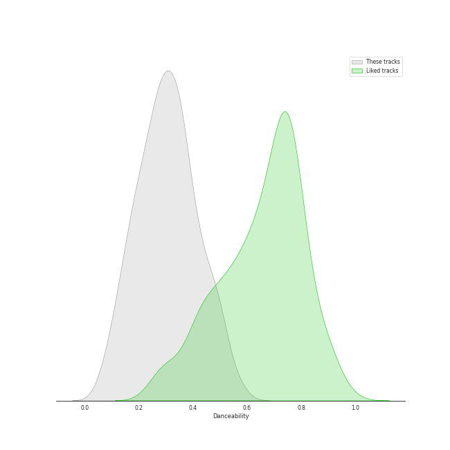
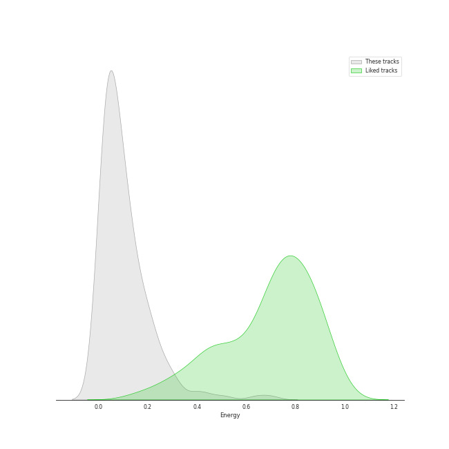
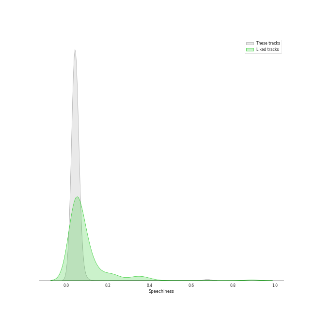
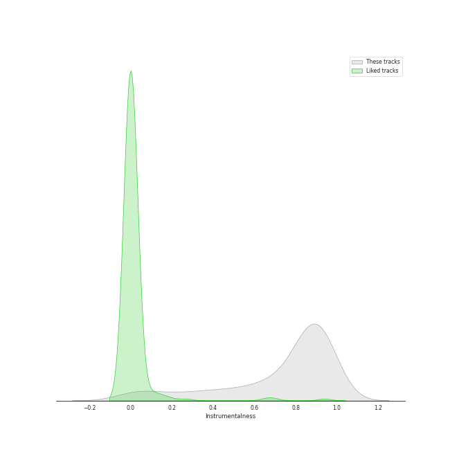
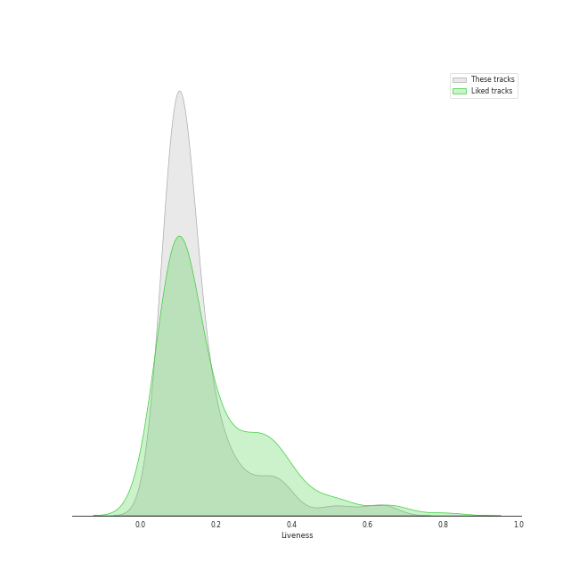
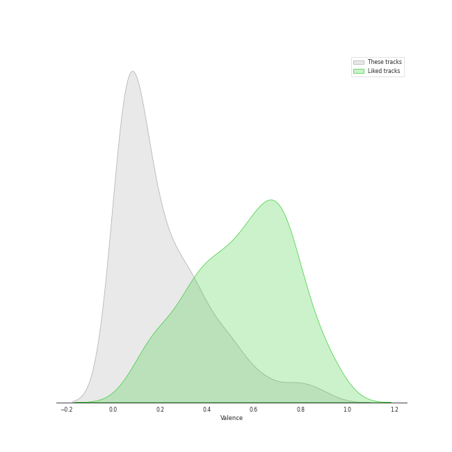
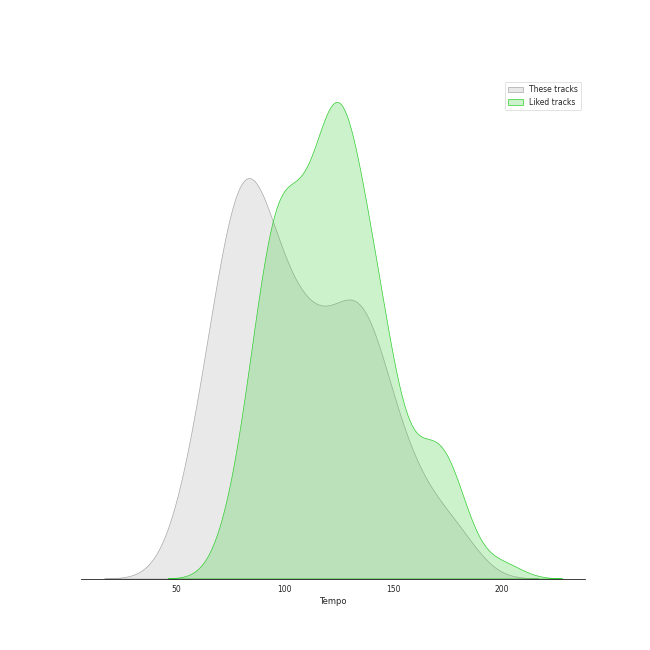

# Track Features for classical

## Danceability

| ​ | 10 most Danceable tracks | ​​ | 10 least Danceable tracks |
|:---|:---|:---|:---|
|  | 24 Préludes, Op. 28: No. 20 in C Minor: Largo (0.753) |  | String Quartet No. 8 in C Minor, Op. 110: V. Largo (0.0592) |
|  | Brandenburg Concerto No. 2 in F, BWV 1047: 3. Allegro assai (0.691) |  | The Planets, Op. 32: 7. Neptune, the Mystic (0.0601) |
|  | Brandenburg Concerto No. 2 in F, BWV 1047: 1. (Allegro) (0.687) |  | Symphony No. 9 In D Minor, Op. 125 - "Choral": 3. Adagio molto e cantabile (0.062) |
|  | 24 Préludes, Op. 28: No. 20 in C Minor: Largo (0.677) |  | String Quartet in G Minor, Op. 10: III. Andantino, doucement expressif (0.0623) |
|  | Coppélia / Tableau 2: No. 16 Boléro - Alternative Version (0.661) |  | La Mer, L.109: 1. From Dawn Till Noon On The Sea (De l'aube à midi sur la mer) (0.0633) |
|  | Coppélia / Tableau 2: No. 11a Musique des automates (0.648) |  | Vespers, Op. 37: XII. "Slava v vyshnikh Bogu" (0.0636) |
|  | String Quartet No.11 in F Minor, Op. 122: V. Humoresque (Allegro) (0.63) |  | Die Zauberflöte, K.620 / Act 2: "O Isis und Osiris, welche Wonne!" (0.0663) |
|  | 24 Préludes, Op. 28: No. 10 in C-Sharp Minor: Molto allegro (0.629) |  | Requiem in D Minor, Op. 48: II. Offertorium. Domine Jesu Christe (0.0668) |
|  | String Quartet No. 4 in C Major, K. 157: III. Presto (0.614) |  | Horn Concerto No. 4 in E-Flat Major, K. 495: II. Romanza. Andante (0.0683) |
|  | A Midsummer Night's Dream, Incidental Music, Op. 61: "Ay Me! For Aught That I Could Ever Read" (0.614) |  | String Quartet No. 8 in C Minor, Op. 110: I. Largo (0.0744) |

## Energy

| ​ | 10 most Energetic tracks | ​​ | 10 least Energetic tracks |
|:---|:---|:---|:---|
|  | The Rite of Spring, K15, Pt. 1: VI. Procession of the Sage (0.7) |  | The Rite of Spring, K15, Pt. 1: VII. Adoration of the Earth (The Sage) (0.000239) |
|  | 24 Préludes, Op. 28: No. 22 in G Minor (0.641) |  | Préludes Book 1, L. 117: I. Des Pas sur La Neige (0.000594) |
|  | The Rite of Spring, K15, Pt. 1: III. Ritual of Abduction (0.555) |  | Pictures at an Exhibition (Orch. Ravel): VIIIa. Catacombae (Sepulchrum Romanum) (0.000845) |
|  | Requiem in D Minor, K.626: 3a. Sequientia: Dies irae (0.542) |  | Images, Set 2, L. 111: et la Lune descend sur le Temple qui fut (0.00104) |
|  | String Quartet No. 8 in C Minor, Op. 110: II. Allegro molto (0.511) |  | The Firebird (L'oiseau De Feu) - Suite (1919): Introduction (0.00108) |
|  | The Rite of Spring, K15, Pt. 1: VIII. Dance of the Earth (0.509) |  | Préludes Book 2, L. 123: II. Canope (0.00148) |
|  | Tchaikovsky: The Nutcracker, Op. 71, Act II: No. 12d, Divertissement. Trepak, Russian Dance (0.5) |  | Piano Sonata No. 21 in C Major, Op. 53 "Waldstein": II. Introduzione (Adagio molto) (0.00157) |
|  | Vespers, Op. 37: XV. "Vzbrannoy voevode" (0.488) |  | Piano Sonata No. 31 in A flat, Op. 110: 3. Adagio ma non troppo (0.00168) |
|  | The Planets, Op. 32: 1. Mars, the Bringer of War (0.478) |  | 24 Préludes, Op. 28: No. 7 in A Major (0.00168) |
|  | Tchaikovsky: Swan Lake, Op. 20, Act 3: No. 15, Scene. March - Allegro giusto (0.474) |  | 24 Préludes, Op. 28: No. 7 in A Major: Andantino (0.00174) |

## Speechiness

| ​ | 10 most Speechy tracks | ​​ | 10 least Speechy tracks |
|:---|:---|:---|:---|
|  | 24 Préludes, Op. 28: No. 20 in C Minor: Largo (0.879) |  | The Rite of Spring, K15, Pt. 1: VIII. Dance of the Earth (0.0292) |
|  | A Midsummer Night's Dream, Incidental Music, Op. 61: No. 2, L'istesso tempo (0.676) |  | The Rite of Spring, K15, Pt. 1: II. The Augurs of Spring (0.0293) |
|  | 24 Préludes, Op. 28: No. 20 in C Minor: Largo (0.592) |  | Requiem In D Minor, K.626: 4. Offertorium: Domine Jesu (0.0293) |
|  | A Midsummer Night's Dream, Incidental Music, Op. 61: "Ay Me! For Aught That I Could Ever Read" (0.524) |  | Symphony No. 39 in E flat, K.543: 3. Menuetto (Allegretto) (0.0297) |
|  | String Quartet No.11 in F Minor, Op. 122: V. Humoresque (Allegro) (0.274) |  | 24 Préludes, Op. 28: No. 24 in D Minor: Allegro appassionato (0.0298) |
|  | The Firebird (L'oiseau De Feu) - Suite (1919): Dance Of The Firebird (0.167) |  | 24 Préludes, Op. 28: No. 12. in G-Sharp Minor (0.03) |
|  | Piano Sonata No. 21 in C Major, Op. 53 "Waldstein": II. Introduzione (Adagio molto) (0.0974) |  | Requiem In D Minor, K.626: 5. Sanctus (0.0301) |
|  | Vivaldi: The Four Seasons, Violin Concerto in F Minor, Op. 8 No. 4, RV 297 "Winter": III. Allegro (0.0963) |  | 24 Préludes, Op. 28: No. 3 in G Major: Vivace (0.0303) |
|  | The Rite of Spring, K15, Pt. 2: XI. Glorification of the Chosen One (0.0935) |  | Requiem In D Minor, K.626: 2. Kyrie (0.0304) |
|  | Piano Sonata No. 19 in G minor, Op. 49 No. 1: 2. Rondo (Allegro) (0.0889) |  | 13 Preludes, Op. 32: No. 6 in F Minor: Allegro appassionato (0.0304) |

## Acousticness

| ​ | 10 most Acoustic tracks | ​​ | 10 least Acoustic tracks |
|:---|:---|:---|:---|
|  | Nocturne No. 11 In G Minor, Op. 37 No. 1 (0.996) |  | Vivaldi: The Four Seasons, Violin Concerto in F Major, Op. 8 No. 3, RV 293 "Autumn": II. Adagio molto (0.0524) |
|  | Piano Sonata No. 10 in C Major, K. 330: II. Andante cantabile (0.996) |  | Concerto for Violin and Strings in F Major, Op. 8, No. 3, RV 293 "L'autunno": II. Adagio molto (Ubriachi dormienti) (0.386) |
|  | Nocturne No. 12 In G, Op. 37 No. 2 (0.996) |  | A Midsummer Night's Dream, Incidental Music, Op. 61: "Ay Me! For Aught That I Could Ever Read" (0.41) |
|  | Wiosna, B117 (arr. from Op. 74/2) (0.996) |  | Tchaikovsky: The Nutcracker, Op. 71, Act II: No. 12a, Divertissement. Chocolate, Spanish Dance (0.583) |
|  | Feuille d'album in E, Op. posth. (0.995) |  | The Rite of Spring, K15, Pt. 1: VII. Adoration of the Earth (The Sage) (0.591) |
|  | 24 Préludes, Op. 28: No. 13 in F-Sharp Major (0.995) |  | Vivaldi: The Four Seasons, Violin Concerto in F Minor, Op. 8 No. 4, RV 297 "Winter": II. Largo (0.596) |
|  | Piano Sonata No. 25 in G, Op. 79: 2. Andante (0.995) |  | The Rite of Spring, K15, Pt. 1: VI. Procession of the Sage (0.612) |
|  | Vespers, Op. 37: VIII. "Kvalite imya Gospodne" (0.995) |  | Die Zauberflöte, K.620 / Act 2: Ein Mädchen oder Weibchen (Papageno) (0.623) |
|  | Piano Sonata No. 16 in C Major, K. 545 "Sonata facile": II. Andante (0.995) |  | Concerto for Violin and Strings in E Major, Op. 8, No. 1, RV 269 "La Primavera": III. Allegro (Danza pastorale) (0.644) |
|  | Piano Sonata No. 19 in G minor, Op. 49 No. 1: 1. Andante (0.995) |  | Violin Concerto in F Minor, Op. 8, No. 4, RV 297 "L'inverno": II. Largo (0.65) |

## Instrumentalness

| ​ | 10 most Instrumental tracks | ​​ | 10 least Instrumental tracks |
|:---|:---|:---|:---|
|  | Pictures at an Exhibition (Orch. Ravel): IV. Bydlo (0.983) |  | Violin Concerto in F Minor, Op. 8, No. 4, RV 297 "L'inverno": II. Largo (0.0) |
|  | Vespers, Op. 37: XIV. "Voskrez iz groba" (0.98) |  | A Midsummer Night's Dream, Incidental Music, Op. 61: "Ay Me! For Aught That I Could Ever Read" (0.0) |
|  | Vespers, Op. 37: VI. "Bogoroditse Devo" (0.979) |  | A Midsummer Night's Dream, Incidental Music, Op. 61: No. 8, Andante (0.0) |
|  | Tchaikovsky: Swan Lake, Op. 20, Act 4: No. 26, Scene. Allegro ma non troppo (0.978) |  | Die Zauberflöte, K.620 / Act 2: Ein Mädchen oder Weibchen (Papageno) (0.0) |
|  | The Rite of Spring, K15, Pt. 1: I. Introduction (0.972) |  | A Midsummer Night's Dream, Incidental Music, Op. 61: No. 4, Andante (0.0) |
|  | Requiem in D Minor, Op. 48: VII. In Paradisum (0.971) |  | A Midsummer Night's Dream, Incidental Music, Op. 61: No. 2, L'istesso tempo (0.0) |
|  | String Quartet No. 14 in C-Sharp Minor, Op. 131: VI. Adagio quasi un poco andante (0.97) |  | Die Zauberflöte, K.620 / Act 1: "Bei Männern, welche Liebe fühlen" (0.0) |
|  | 24 Préludes, Op. 28: No. 10 in C-Sharp Minor (0.964) |  | Concerto for Violin and Strings in F Major, Op. 8, No. 3, RV 293 "L'autunno": II. Adagio molto (Ubriachi dormienti) (2.04e-06) |
|  | Pictures at an Exhibition (Orch. Ravel): Promenade I (0.962) |  | A Midsummer Night's Dream, Incidental Music, Op. 61: Finale. Allegro di molto (3.2e-06) |
|  | Main Theme (From "Jaws") (0.959) |  | Die Zauberflöte, K.620 / Act 1: Der Vogelfänger bin ich ja (Papageno) (1.03e-05) |

## Liveness

| ​ | 10 most Live tracks | ​​ | 10 least Live tracks |
|:---|:---|:---|:---|
|  | Pictures at an Exhibition (Orch. Ravel): VIIIb. Cum mortuis in lingua mortua (0.767) |  | String Quartet No. 2 In A Minor, Op. 51 No. 2: 4. Finale (Allegro non assai - Più vivace) (0.0439) |
|  | The Firebird (L'oiseau De Feu) - Suite (1919): 3. Variation Of The Firebird (0.743) |  | String Quartet No. 3 in D Major, Op. 18: I. Allegro (0.045) |
|  | Pictures at an Exhibition (Orch. Ravel): IX. The Hut on Chicken's Legs (0.689) |  | Ballade No. 2 in F Major, Op. 38 (0.0494) |
|  | Polonaise No. 6 in A-Flat Major, Op. 53, "Heroic" (0.682) |  | 24 Préludes, Op. 28: No. 7 in A Major: Andantino (0.0504) |
|  | The Rite of Spring, K15, Pt. 1: II. The Augurs of Spring (0.669) |  | Piano Sonata No. 32 in C minor, Op. 111: 2. Arietta (Adagio molto semplice e cantabile) (0.0511) |
|  | Pictures at an Exhibition (Orch. Ravel): VII. The Market at Limoges (0.65) |  | 13 Preludes, Op. 32: No. 7 in F Major: Moderato (0.0533) |
|  | Pictures at an Exhibition (Orch. Ravel): I. Gnomus (0.648) |  | Concerto for Violin and Strings in F Major, Op. 8, No. 3, RV 293 "L'autunno": II. Adagio molto (Ubriachi dormienti) (0.0551) |
|  | Night on Bald Mountain (0.628) |  | Piano Concerto No. 2 in C Minor, Op. 18: 2. Adagio sostenuto (0.0551) |
|  | A Midsummer Night's Dream, Incidental Music, Op. 61: No. 4, Andante (0.626) |  | Préludes Book 2, L. 123: II. Canope (0.0553) |
|  | String Quartet No. 2 in G Major, Op. 18, No. 2: III. Scherzo (Allegro) - Trio (0.62) |  | Symphony No. 1 In C, Op. 21: 3. Menuetto (Allegro molto e vivace) (0.0554) |

## Valence

| ​ | 10 most Happy tracks | ​​ | 10 least Happy tracks |
|:---|:---|:---|:---|
|  | Brandenburg Concerto No. 2 in F, BWV 1047: 3. Allegro assai (0.931) |  | The Rite of Spring, K15, Pt. 1: VII. Adoration of the Earth (The Sage) (0.0) |
|  | Petrushka: Third Scene: II. Dance of the Ballerina (1911 original version) (0.907) |  | The Firebird (L'oiseau De Feu) - Suite (1919): Dance Of The Firebird (0.0) |
|  | Galop Marquis (0.893) |  | 24 Préludes, Op. 28: No. 7 in A Major: Andantino (0.0) |
|  | Waltz No. 16 in A flat, Op. posth. (0.89) |  | String Quartet No. 9 in E-Flat Major, Op. 117: II. Adagio (0.0251) |
|  | Tchaikovsky: The Nutcracker, Op. 71, Act II: No. 12a, Divertissement. Chocolate, Spanish Dance (0.879) |  | 24 Préludes, Op. 28: No. 9 in E Major: Largo (0.0292) |
|  | String Quartet No. 4 in C Major, K. 157: III. Presto (0.878) |  | The Planets, Op. 32: 2. Venus, the Bringer of Peace (0.0301) |
|  | Cello Suite No. 3 in C Major, BWV 1009: III. Courante (0.871) |  | The Planets, Op. 32: 7. Neptune, the Mystic (0.0305) |
|  | Pictures at an Exhibition (Orch. Ravel): V. Ballet of the Unhatched Chicks (0.869) |  | String Quartet No.11 in F Minor, Op. 122: VI. Elégie (Adagio) (0.0307) |
|  | Cello Suite No. 4 in E-Flat Major, BWV 1010: VI. Gigue (0.869) |  | Concerto for Orchestra, Sz. 116: 3. Elegia (Andante, non troppo) (0.0312) |
|  | Cello Suite No. 2 in D Minor, BWV 1008: III. Courante (0.852) |  | The Planets, Op. 32: 5. Saturn, the Bringer of Old Age (0.0316) |

## Tempo

| ​ | 10 most Fast tracks | ​​ | 10 least Fast tracks |
|:---|:---|:---|:---|
|  | 24 Préludes, Op. 28: No. 6 in B Minor: Lento assai (203.905) |  | 24 Préludes, Op. 28: No. 20 in C Minor: Largo (34.105) |
|  | Piano Sonata No. 29 in B flat, Op. 106 -"Hammerklavier": 2. Scherzo (Assai vivace - Presto - Prestissimo - Tempo I) (203.867) |  | Tchaikovsky: The Nutcracker, Op. 71, Act 2: No. 13, Waltz of the Flowers (47.362) |
|  | Tchaikovsky: Swan Lake, Op. 20, Act 3: No. 23, Mazurka (184.562) |  | Coppélia / Tableau 2: No. 9 Scène (49.526) |
|  | Coppélia / Tableau 1: Prélude - Mazurka (184.094) |  | 24 Préludes, Op. 28: No. 8 in F-Sharp Minor: Molto agitato (53.925) |
|  | Coppélia / Tableau 3: No. 20 Fête de la cloche: II. L'aurore (182.171) |  | String Quartet in G Minor, Op. 10: III. Andantino, doucement expressif (54.651) |
|  | Tchaikovsky: Swan Lake, Op. 20, Act 1: No. 7, Sujet (181.794) |  | Piano Concerto No. 2 in C Minor, Op. 18: 1. Moderato (54.898) |
|  | Coppélia / Tableau 2: No. 16 Boléro (179.617) |  | Nocturne No. 8 In D Flat, Op. 27 No. 2 - 2005 Recording (55.543) |
|  | String Quartet No. 11 in F Minor, Op. 95 "Quartetto serioso": III. Allegro assai - Vivace ma serioso (179.045) |  | Cello Suite No. 3 in C Major, BWV 1009: II. Allemande (56.213) |
|  | String Quartet No. 6 in G Major, Op. 101: II. Moderato con moto (177.309) |  | Divertimento No. 15 in B Flat Major, K. 287: IV. Adagio (56.647) |
|  | Brandenburg Concerto No. 2 in F, BWV 1047: 2. Andante (177.194) |  | Piano Sonata No. 2 in B-Flat Minor, Op. 35: III. Marche funèbre (56.814) |
