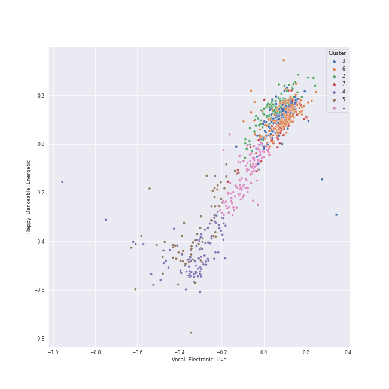

# Clusters in classical

## Cluster #1

131 tracks

| Art | Track | Album | Artists | Label | 💚 | 🔗 |
|:---|:---|:---|:---|:---|:---|:---|
|  | Le Sacre du Printemps - Revised version for Orchestra (published 1947) / Part 2: The Sacrifice: Ritual Action of the Ancestors | Stravinsky: The Rite of Spring / Bartók: Concerto for Orchestra | Igor Stravinsky, [Berliner Philharmoniker](../../../../artists/berliner_philharmoniker/overview.md), [Herbert von Karajan](../../../../artists/herbert_von_karajan/overview.md) | [Deutsche Grammophon (DG)](../../../../labels/deutsche_grammophon__dg_) | | [🔗](https://open.spotify.com/track/41g1p1wDLuNnZNDLa13QIR) |
|  | Brandenburg Concerto No. 4 in G, BWV 1049: 2. Andante | Bach, J.S.: Brandenburg Concertos etc. | [Johann Sebastian Bach](../../../../artists/johann_sebastian_bach/overview.md), English Chamber Orchestra, Benjamin Britten | [Decca Music Group Ltd.](../../../../labels/decca_music_group_ltd_) | | [🔗](https://open.spotify.com/track/3ycalZsD0op1GjZ6eDrpbU) |
|  | Overture "Leonore No. 3", Op. 72b | Beethoven: 9 Symphonies; Overtures | [Ludwig van Beethoven](../../../../artists/ludwig_van_beethoven/overview.md), [Berliner Philharmoniker](../../../../artists/berliner_philharmoniker/overview.md), [Herbert von Karajan](../../../../artists/herbert_von_karajan/overview.md) | [Deutsche Grammophon (DG)](../../../../labels/deutsche_grammophon__dg_) | | [🔗](https://open.spotify.com/track/1qP4L90ZORZad6pqdLMyci) |
|  | String Quartet No. 15 in A minor, Op. 132: II. Allegro ma non tanto | Beethoven: Complete String Quartets | [Ludwig van Beethoven](../../../../artists/ludwig_van_beethoven/overview.md), [Tokyo String Quartet](../../../../artists/tokyo_string_quartet/overview.md) | [harmonia mundi](../../../../labels/harmonia_mundi) | | [🔗](https://open.spotify.com/track/52afsywDcOS3ApCQET7k5J) |
|  | String Quartet No. 9 in C Major, Op. 59 No. 3: I. Introduzione (Andante con moto - Allegro vivace) | Beethoven: Complete String Quartets | [Ludwig van Beethoven](../../../../artists/ludwig_van_beethoven/overview.md), [Tokyo String Quartet](../../../../artists/tokyo_string_quartet/overview.md) | [harmonia mundi](../../../../labels/harmonia_mundi) | | [🔗](https://open.spotify.com/track/5bUQPchwRlyhMMNP7OYrcW) |
|  | Coppélia / Tableau 1: No. 8 Final | Coppélia | Léo Delibes, Orchestra Victoria, Barry Wordsworth | [Australian Broadcasting Corp (ABC)](../../../../labels/australian_broadcasting_corp__abc_) | | [🔗](https://open.spotify.com/track/1q6d29hcZizG37UPMVIS1U) |
|  | Coppélia / Tableau 2: No. 15 Scène | Coppélia | Léo Delibes, Orchestra Victoria, Barry Wordsworth | [Australian Broadcasting Corp (ABC)](../../../../labels/australian_broadcasting_corp__abc_) | | [🔗](https://open.spotify.com/track/0LArcL3gk60nP3cxr6LWGx) |
|  | Vespers, Op. 37: X. "Voskreseniye Khristovo videvshe" | Rachmaninov: Vespers - All Night Vigil | Sergei Rachmaninoff, St.Petersburg Chamber Choir, Nikolai Korniev | [Decca Music Group Ltd.](../../../../labels/decca_music_group_ltd_) | | [🔗](https://open.spotify.com/track/2rzp6tSZjlPxIjkcnKoV7a) |
|  | String Quartet No. 22 in B-Flat Major, K. 589, "Prussian": II. Larghetto | Mozart: String Quartets Nos. 4, 17 & 22 | [Wolfgang Amadeus Mozart](../../../../artists/wolfgang_amadeus_mozart/overview.md), [Jerusalem Quartet](../../../../artists/jerusalem_quartet/overview.md) | [harmonia mundi](../../../../labels/harmonia_mundi) | | [🔗](https://open.spotify.com/track/7eaYdLRx1XuHhTpKMYaBU9) |
|  | Requiem In D Minor, K.626: 5. Sanctus | Karajan - Mozart | [Wolfgang Amadeus Mozart](../../../../artists/wolfgang_amadeus_mozart/overview.md), Wiener Singverein, Wiener Philharmoniker, [Herbert von Karajan](../../../../artists/herbert_von_karajan/overview.md) | [UME - Global Clearing House](../../../../labels/ume___global_clearing_house) | | [🔗](https://open.spotify.com/track/7rkakVQEVWVASpkamj7m8o) |
## Cluster #2

237 tracks

| Art | Track | Album | Artists | Label | 💚 | 🔗 |
|:---|:---|:---|:---|:---|:---|:---|
|  | Nocturne No. 3 in B Major, Op. 9 No. 3 | Chopin: Nocturnes; Four Ballades | [Frédéric Chopin](../../../../artists/fr_d_ric_chopin/overview.md), [Vladimir Ashkenazy](../../../../artists/vladimir_ashkenazy/overview.md) | [Decca Music Group Ltd.](../../../../labels/decca_music_group_ltd_) | | [🔗](https://open.spotify.com/track/6hkWg7ZomgbZNI26ZuXl5E) |
|  | Prélude in C-Sharp Minor, Op. 45 | Chopin: Preludes; Sonata No.2 | [Frédéric Chopin](../../../../artists/fr_d_ric_chopin/overview.md), Martha Argerich | [Deutsche Grammophon (DG)](../../../../labels/deutsche_grammophon__dg_) | | [🔗](https://open.spotify.com/track/1RvTfoN03GvpUpTdz5zpHz) |
|  | Nocturne No. 17 In B, Op. 62 No. 1 | Chopin: Nocturnes | [Frédéric Chopin](../../../../artists/fr_d_ric_chopin/overview.md), Maurizio Pollini | [Deutsche Grammophon (DG)](../../../../labels/deutsche_grammophon__dg_) | | [🔗](https://open.spotify.com/track/3UhDV3GnefK0y3CUjRBim9) |
|  | Fantaisie-impromptu in C-Sharp Minor, Op. 66: Fantaisie-impromptu in C-Sharp Minor, Op. 66 | Chopin: Piano Sonata No. 3, Fantasie-impromptu, Prélude, Nocturne, et al. | [Frédéric Chopin](../../../../artists/fr_d_ric_chopin/overview.md), Nikolai Lugansky | Onyx Classics | | [🔗](https://open.spotify.com/track/2D2fqN3hLbBhQUickM3hpG) |
|  | Brahms: Symphony No. 2 in D Major, Op. 73: I. Allegro non troppo | Brahms: The Symphonies | Johannes Brahms, [Berliner Philharmoniker](../../../../artists/berliner_philharmoniker/overview.md), Sir Simon Rattle | [Warner Classics UK](../../../../labels/warner_classics_uk) | | [🔗](https://open.spotify.com/track/43cLCzOqxYJOZMgpxdTcRt) |
|  | Symphony No. 6 In F, Op. 68 -"Pastoral": 5. Hirtengesang. Frohe und dankbare Gefühle nach dem Sturm: Allegretto | Beethoven: 9 Symphonies; Overtures | [Ludwig van Beethoven](../../../../artists/ludwig_van_beethoven/overview.md), [Berliner Philharmoniker](../../../../artists/berliner_philharmoniker/overview.md), [Herbert von Karajan](../../../../artists/herbert_von_karajan/overview.md) | [Deutsche Grammophon (DG)](../../../../labels/deutsche_grammophon__dg_) | | [🔗](https://open.spotify.com/track/70E993QEzhQSWILEzDliaV) |
|  | Tchaikovsky: Swan Lake, Op. 20, Act IV: No. 27, Dance of the Little Swans | Tchaikovsky: Swan Lake | [Pyotr Ilyich Tchaikovsky](../../../../artists/pyotr_ilyich_tchaikovsky/overview.md), André Previn, London Symphony Orchestra | [Warner Classics](../../../../labels/warner_classics) | | [🔗](https://open.spotify.com/track/4Qu4tyMIENrOgUSGGbJhb4) |
|  | Piano Concerto No. 20 in D Minor, K. 466: II. Romance | Mozart Piano Pieces | [Wolfgang Amadeus Mozart](../../../../artists/wolfgang_amadeus_mozart/overview.md), Roberte Mamou, Gerard Oskamp, Berliner Symphoniker | [Warner Music Group - X5 Music Group](../../../../labels/warner_music_group___x5_music_group) | | [🔗](https://open.spotify.com/track/2XY6ID1TAueZidFAfkjUCK) |
|  | Piano Concerto No. 23 in A Major, K. 488: II. Adagio | Mozart Piano Pieces | [Wolfgang Amadeus Mozart](../../../../artists/wolfgang_amadeus_mozart/overview.md), Elisabeth Sombart, Jordi Mora, Munich Youth Orchestra | [Warner Music Group - X5 Music Group](../../../../labels/warner_music_group___x5_music_group) | | [🔗](https://open.spotify.com/track/7dF349cWZHlNnSUBdn1NkS) |
|  | Piano Concerto No. 27 in B-Flat Major, K. 595: II. Larghetto | Mozart Piano Pieces | [Wolfgang Amadeus Mozart](../../../../artists/wolfgang_amadeus_mozart/overview.md), Carmen Piazzini, Mikhail Gantvarg, The St. Petersburg Soloists | [Warner Music Group - X5 Music Group](../../../../labels/warner_music_group___x5_music_group) | | [🔗](https://open.spotify.com/track/04Vw5tlqRgimrmWnbuDI2O) |
## Cluster #3

64 tracks

| Art | Track | Album | Artists | Label | 💚 | 🔗 |
|:---|:---|:---|:---|:---|:---|:---|
|  | 24 Préludes, Op. 28: No. 11 in B Major: Vivace | Chopin: Waltzes; 4 Scherzos; 26 Preludes | [Frédéric Chopin](../../../../artists/fr_d_ric_chopin/overview.md), [Vladimir Ashkenazy](../../../../artists/vladimir_ashkenazy/overview.md) | [Decca Music Group Ltd.](../../../../labels/decca_music_group_ltd_) | | [🔗](https://open.spotify.com/track/3YhQthjnOeJquPn2f1c93j) |
|  | Cello Suite No. 1 in G Major, BWV 1007: VI. Gigue | Bach: Unaccompanied Cello Suites (Remastered) | [Johann Sebastian Bach](../../../../artists/johann_sebastian_bach/overview.md), Yo-Yo Ma | [Sony Classical](../../../../labels/sony_classical) | | [🔗](https://open.spotify.com/track/7BWwT75IPTKbHbxn4P6Bwm) |
|  | Cello Suite No. 4 in E-Flat Major, BWV 1010: III. Courante | Bach: Unaccompanied Cello Suites (Remastered) | [Johann Sebastian Bach](../../../../artists/johann_sebastian_bach/overview.md), Yo-Yo Ma | [Sony Classical](../../../../labels/sony_classical) | | [🔗](https://open.spotify.com/track/2oSSC6Si36uySfMMhqN3Ck) |
|  | Cello Suite No. 5 in C Minor, BWV 1011: V. Gavottes I & II | Bach: Unaccompanied Cello Suites (Remastered) | [Johann Sebastian Bach](../../../../artists/johann_sebastian_bach/overview.md), Yo-Yo Ma | [Sony Classical](../../../../labels/sony_classical) | | [🔗](https://open.spotify.com/track/45wXZS6elH1pyW5jMkYPrp) |
|  | Cello Suite No. 6 in D Major, BWV 1012: III. Courante | Bach: Unaccompanied Cello Suites (Remastered) | [Johann Sebastian Bach](../../../../artists/johann_sebastian_bach/overview.md), Yo-Yo Ma | [Sony Classical](../../../../labels/sony_classical) | | [🔗](https://open.spotify.com/track/1QSNIfsTBWNmQ2pplTD3xF) |
|  | Cello Suite No. 6 in D Major, BWV 1012: VI. Gigue | Bach: Unaccompanied Cello Suites (Remastered) | [Johann Sebastian Bach](../../../../artists/johann_sebastian_bach/overview.md), Yo-Yo Ma | [Sony Classical](../../../../labels/sony_classical) | | [🔗](https://open.spotify.com/track/0w9xYEvm1nd4S9v04zftup) |
|  | Brandenburg Concerto No. 1 in F, BWV 1046: 1. (Allegro) | Bach, J.S.: Brandenburg Concertos etc. | [Johann Sebastian Bach](../../../../artists/johann_sebastian_bach/overview.md), English Chamber Orchestra, Benjamin Britten | [Decca Music Group Ltd.](../../../../labels/decca_music_group_ltd_) | | [🔗](https://open.spotify.com/track/0df320Pc1ZK0050luSGVHt) |
|  | Piano Sonata No. 31 in A-Flat Major, Op. 110: II. Allegro molto | Beethoven: Piano Sonatas Nos. 30, 31 & 32 | [Ludwig van Beethoven](../../../../artists/ludwig_van_beethoven/overview.md), Mari Kodama | [PENTATONE](../../../../labels/pentatone) | | [🔗](https://open.spotify.com/track/6jnf2ZNoakb0h7GDa0GV18) |
|  | String Quartet No. 6 in B-Flat Major, Op. 18 No. 6: III. Scherzo (Allegro) - Trio | Beethoven: String Quartets, Op. 18 | [Ludwig van Beethoven](../../../../artists/ludwig_van_beethoven/overview.md), [Jerusalem Quartet](../../../../artists/jerusalem_quartet/overview.md) | [harmonia mundi](../../../../labels/harmonia_mundi) | | [🔗](https://open.spotify.com/track/39AM3Owd4WbyUoTxiGNSyi) |
|  | Serenade In G, K.525 "Eine kleine Nachtmusik": 4. Rondo (Allegro) | Karajan - Mozart | [Wolfgang Amadeus Mozart](../../../../artists/wolfgang_amadeus_mozart/overview.md), [Berliner Philharmoniker](../../../../artists/berliner_philharmoniker/overview.md), [Herbert von Karajan](../../../../artists/herbert_von_karajan/overview.md) | [UME - Global Clearing House](../../../../labels/ume___global_clearing_house) | | [🔗](https://open.spotify.com/track/3jmi0bsIhJUEYB1ox3aZ2i) |
## Cluster #4

96 tracks

| Art | Track | Album | Artists | Label | 💚 | 🔗 |
|:---|:---|:---|:---|:---|:---|:---|
|  | Vivaldi: The Four Seasons, Violin Concerto in F Minor, Op. 8 No. 4, RV 297 "Winter": III. Allegro | Vivaldi: The Four Seasons. | Antonio Vivaldi, Sarah Chang, Orpheus Chamber Orchestra | [Warner Classics](../../../../labels/warner_classics) | | [🔗](https://open.spotify.com/track/3NssaIXNMQJHoCYXvxExET) |
|  | Vivaldi: Violin Concerto in G Minor, Op. 12 No. 1, RV 317: II. Largo | Vivaldi: The Four Seasons. | Antonio Vivaldi, Sarah Chang, Orpheus Chamber Orchestra | [Warner Classics](../../../../labels/warner_classics) | | [🔗](https://open.spotify.com/track/3A5AucW2JWRYhjPAu13jiw) |
|  | A Midsummer Night's Dream, Incidental Music, Op. 61: No. 5, Allegro appassionato | Mendelssohn: A Midsummer Night's Dream | Felix Mendelssohn, London Symphony Orchestra, Ceri-lyn Cissone, John Eliot Gardiner, Alexander Knox | [Lso Live](../../../../labels/lso_live) | | [🔗](https://open.spotify.com/track/5XWKRz9i2PQWI3PsW0FmQj) |
|  | String Quartet No. 14 in C-Sharp Minor, Op. 131: III. Allegro moderato - Adagio - Piu vivace | Beethoven: Complete String Quartets | [Ludwig van Beethoven](../../../../artists/ludwig_van_beethoven/overview.md), [Tokyo String Quartet](../../../../artists/tokyo_string_quartet/overview.md) | [harmonia mundi](../../../../labels/harmonia_mundi) | | [🔗](https://open.spotify.com/track/0qAphY2YKqhNBrYaWucjQu) |
|  | String Quartet No. 14 in C-Sharp Minor, Op. 131: IV. Andante ma non troppo e molto cantabile | Beethoven: Complete String Quartets | [Ludwig van Beethoven](../../../../artists/ludwig_van_beethoven/overview.md), [Tokyo String Quartet](../../../../artists/tokyo_string_quartet/overview.md) | [harmonia mundi](../../../../labels/harmonia_mundi) | | [🔗](https://open.spotify.com/track/3TDW149x3odZEoqt9cnCMd) |
|  | String Quartet No. 3 in D Major, Op. 18: II. Andante con moto | Beethoven: Complete String Quartets | [Ludwig van Beethoven](../../../../artists/ludwig_van_beethoven/overview.md), [Tokyo String Quartet](../../../../artists/tokyo_string_quartet/overview.md) | [harmonia mundi](../../../../labels/harmonia_mundi) | | [🔗](https://open.spotify.com/track/2V5dO6szHHSoAqIRTJViYA) |
|  | String Quartet No. 6 in B-Flat Major, Op. 18 No. 6: II. Adagio ma non troppo | Beethoven: String Quartets, Op. 18 | [Ludwig van Beethoven](../../../../artists/ludwig_van_beethoven/overview.md), [Jerusalem Quartet](../../../../artists/jerusalem_quartet/overview.md) | [harmonia mundi](../../../../labels/harmonia_mundi) | | [🔗](https://open.spotify.com/track/5haDu6D9Afpa5GIt5wVWMb) |
|  | Coppélia / Tableau 2: No. 10 Scène | Coppélia | Léo Delibes, Orchestra Victoria, Barry Wordsworth | [Australian Broadcasting Corp (ABC)](../../../../labels/australian_broadcasting_corp__abc_) | | [🔗](https://open.spotify.com/track/6EkMmjc72kp8fGLLF4mfJk) |
|  | Coppélia / Tableau 3: No. 20 Fête de la cloche: II. L'aurore | Coppélia | Léo Delibes, Orchestra Victoria, Barry Wordsworth | [Australian Broadcasting Corp (ABC)](../../../../labels/australian_broadcasting_corp__abc_) | | [🔗](https://open.spotify.com/track/5gpJqY5TNtvkeZuguksKwg) |
|  | Mozart: Eine kleine Nachtmusik, K. 525: II. Romance. Andante | Mozart: Eine Kleine Nachtmusik etc. | [Wolfgang Amadeus Mozart](../../../../artists/wolfgang_amadeus_mozart/overview.md), Sir Neville Marriner, Academy of St. Martin in the Fields | [Warner Classics](../../../../labels/warner_classics) | | [🔗](https://open.spotify.com/track/5c8aHvonwKaBAoOIXmHQdt) |
## Cluster #5

259 tracks

| Art | Track | Album | Artists | Label | 💚 | 🔗 |
|:---|:---|:---|:---|:---|:---|:---|
|  | 24 Préludes, Op. 28: No. 6 in B Minor: Lento assai | Chopin: Waltzes; 4 Scherzos; 26 Preludes | [Frédéric Chopin](../../../../artists/fr_d_ric_chopin/overview.md), [Vladimir Ashkenazy](../../../../artists/vladimir_ashkenazy/overview.md) | [Decca Music Group Ltd.](../../../../labels/decca_music_group_ltd_) | | [🔗](https://open.spotify.com/track/5oACKmPZvv5I3yMSMuGviS) |
|  | Piano Sonata No. 17 in D minor, Op. 31 No. 2 -"Tempest": 2. Adagio | Beethoven: The Piano Sonatas | [Ludwig van Beethoven](../../../../artists/ludwig_van_beethoven/overview.md), [Vladimir Ashkenazy](../../../../artists/vladimir_ashkenazy/overview.md) | [Decca Music Group Ltd.](../../../../labels/decca_music_group_ltd_) | | [🔗](https://open.spotify.com/track/3HtCNpL6JQ5k5Mqtee3kWc) |
|  | Piano Sonata No. 29 in B flat, Op. 106 -"Hammerklavier": 1. Allegro | Beethoven: The Piano Sonatas | [Ludwig van Beethoven](../../../../artists/ludwig_van_beethoven/overview.md), [Vladimir Ashkenazy](../../../../artists/vladimir_ashkenazy/overview.md) | [Decca Music Group Ltd.](../../../../labels/decca_music_group_ltd_) | | [🔗](https://open.spotify.com/track/7HuiaLJAKmUDZSSe5gsPBb) |
|  | Piano Sonata No. 32 in C minor, Op. 111: 1. Maestoso - Allegro con brio ed appassionato | Beethoven: The Piano Sonatas | [Ludwig van Beethoven](../../../../artists/ludwig_van_beethoven/overview.md), [Vladimir Ashkenazy](../../../../artists/vladimir_ashkenazy/overview.md) | [Decca Music Group Ltd.](../../../../labels/decca_music_group_ltd_) | | [🔗](https://open.spotify.com/track/6w2fQ88TfbV5p22zJXaBon) |
|  | Piano Sonata No. 6 in F, Op. 10 No. 2: 2. Allegretto | Beethoven: The Piano Sonatas | [Ludwig van Beethoven](../../../../artists/ludwig_van_beethoven/overview.md), [Vladimir Ashkenazy](../../../../artists/vladimir_ashkenazy/overview.md) | [Decca Music Group Ltd.](../../../../labels/decca_music_group_ltd_) | | [🔗](https://open.spotify.com/track/4gThvgaLCcABLJIFFKTlig) |
|  | Piano Sonata No. 2 in A Major, Op. 2, No. 2: IV. Rondo: Grazioso | Beethoven: Piano Sonatas Nos. 1-3 | [Ludwig van Beethoven](../../../../artists/ludwig_van_beethoven/overview.md), Mari Kodama | [PentaTone](../../../../labels/pentatone) | | [🔗](https://open.spotify.com/track/7FeVdrg9qHpIHhiJiuLcCG) |
|  | Coppélia / Tableau 1: No. 2 Scène | Coppélia | Léo Delibes, Orchestra Victoria, Barry Wordsworth | [Australian Broadcasting Corp (ABC)](../../../../labels/australian_broadcasting_corp__abc_) | | [🔗](https://open.spotify.com/track/5DtzXJIxvTQAiegg1a6s5v) |
|  | Tchaikovsky: Swan Lake, Op. 20, Act II: No. 12, Scene. Allegro - Moderato assai quasi andante | Tchaikovsky: Swan Lake | [Pyotr Ilyich Tchaikovsky](../../../../artists/pyotr_ilyich_tchaikovsky/overview.md), André Previn, London Symphony Orchestra | [Warner Classics](../../../../labels/warner_classics) | | [🔗](https://open.spotify.com/track/4MK0IoF2M5oUMvOrguhyYF) |
|  | 10 Preludes, Op. 23: No. 5 in G Minor: Alla marcia | Rachmaninov: Preludes for Piano (Complete) | Sergei Rachmaninoff, Eldar Nebolsin | [Naxos](../../../../labels/naxos) | | [🔗](https://open.spotify.com/track/0dwRX7z5Yzr1K96QhAKOBh) |
|  | Horn Concerto No. 4 in E-Flat Major, K. 495: I. Allegro moderato - Cadenza: Manfred Klier | Karajan - Mozart | [Wolfgang Amadeus Mozart](../../../../artists/wolfgang_amadeus_mozart/overview.md), Manfred Klier, Gerd Seifert, [Berliner Philharmoniker](../../../../artists/berliner_philharmoniker/overview.md), [Herbert von Karajan](../../../../artists/herbert_von_karajan/overview.md) | [UME - Global Clearing House](../../../../labels/ume___global_clearing_house) | | [🔗](https://open.spotify.com/track/5RvVOTsQL4tN565EHvZtOn) |
## Cluster #6

168 tracks

| Art | Track | Album | Artists | Label | 💚 | 🔗 |
|:---|:---|:---|:---|:---|:---|:---|
|  | Children's Corner, L. 113: III. Golliwogg's Cake-Walk | Debussy: Clair De Lune and Other Piano Favourites | Claude Debussy, Martin Jones | [Nimbus Records](../../../../labels/nimbus_records) | | [🔗](https://open.spotify.com/track/6FnhXHcD1a5N59PNri5Dfm) |
|  | Wiosna, B117 (arr. from Op. 74/2) | Chopin: Polonaises | [Frédéric Chopin](../../../../artists/fr_d_ric_chopin/overview.md), [Vladimir Ashkenazy](../../../../artists/vladimir_ashkenazy/overview.md) | [Decca Music Group Ltd.](../../../../labels/decca_music_group_ltd_) | | [🔗](https://open.spotify.com/track/43ImiMGkllrumEdG03D0nX) |
|  | Piano Sonata No. 11 in A Major, K. 331: 2. Menuetto | Mozart: The Piano Sonatas | [Wolfgang Amadeus Mozart](../../../../artists/wolfgang_amadeus_mozart/overview.md), András Schiff | [Decca Music Group Ltd.](../../../../labels/decca_music_group_ltd_) | | [🔗](https://open.spotify.com/track/4P8zSaqjPV3i1Vc9Q4lT10) |
|  | Symphony No. 40 in G Minor, K. 550: III. Menuetto. Allegretto | Mozart: Symphony No. 40 in G Minor, Bassoon Concerto & Flute Serenades Nos. 1 & 3 | [Wolfgang Amadeus Mozart](../../../../artists/wolfgang_amadeus_mozart/overview.md), Cologne New Philharmonic Orchestra, Volker Hartung | JPK Musik | | [🔗](https://open.spotify.com/track/3ZbnjLCpvVdSThFWbfRJrf) |
|  | Divertimento No. 15 in B-Flat Major, K. 287: 6. Andante - Allegro molto | Karajan - Mozart | [Wolfgang Amadeus Mozart](../../../../artists/wolfgang_amadeus_mozart/overview.md), [Berliner Philharmoniker](../../../../artists/berliner_philharmoniker/overview.md), [Herbert von Karajan](../../../../artists/herbert_von_karajan/overview.md) | [UME - Global Clearing House](../../../../labels/ume___global_clearing_house) | | [🔗](https://open.spotify.com/track/7nc7BiEK1CxbWKPqZxtU4H) |
|  | Horn Concerto No. 2 in E-Flat Major, K. 417: III. Rondo | Karajan - Mozart | [Wolfgang Amadeus Mozart](../../../../artists/wolfgang_amadeus_mozart/overview.md), Gerd Seifert, [Berliner Philharmoniker](../../../../artists/berliner_philharmoniker/overview.md), [Herbert von Karajan](../../../../artists/herbert_von_karajan/overview.md) | [UME - Global Clearing House](../../../../labels/ume___global_clearing_house) | | [🔗](https://open.spotify.com/track/5mpOrd1Lrkq1qoblksJsyM) |
|  | Symphony No. 33 in B flat, K.319: 4. Finale (Allegro assai) | Karajan - Mozart | [Wolfgang Amadeus Mozart](../../../../artists/wolfgang_amadeus_mozart/overview.md), [Berliner Philharmoniker](../../../../artists/berliner_philharmoniker/overview.md), [Herbert von Karajan](../../../../artists/herbert_von_karajan/overview.md) | [UME - Global Clearing House](../../../../labels/ume___global_clearing_house) | | [🔗](https://open.spotify.com/track/6tx5pjn919UXtGD80ElBa9) |
|  | Symphony No. 36 in C Major, K. 425 "Linz": 4. Finale (Presto) | Karajan - Mozart | [Wolfgang Amadeus Mozart](../../../../artists/wolfgang_amadeus_mozart/overview.md), [Berliner Philharmoniker](../../../../artists/berliner_philharmoniker/overview.md), [Herbert von Karajan](../../../../artists/herbert_von_karajan/overview.md) | [UME - Global Clearing House](../../../../labels/ume___global_clearing_house) | | [🔗](https://open.spotify.com/track/5Oa5fHeWafevTSD8kTlabU) |
|  | Symphony No. 38 In D, K.504 "Prague": 3. Finale (Presto) | Karajan - Mozart | [Wolfgang Amadeus Mozart](../../../../artists/wolfgang_amadeus_mozart/overview.md), [Berliner Philharmoniker](../../../../artists/berliner_philharmoniker/overview.md), [Herbert von Karajan](../../../../artists/herbert_von_karajan/overview.md) | [UME - Global Clearing House](../../../../labels/ume___global_clearing_house) | | [🔗](https://open.spotify.com/track/5OlBFvqwbhQcoihA42rIdk) |
|  | Piano Sonata No. 14 in C Minor, K. 457: I. Molto allegro | Mozart Piano Pieces | [Wolfgang Amadeus Mozart](../../../../artists/wolfgang_amadeus_mozart/overview.md), Carmen Piazzini | [Warner Music Group - X5 Music Group](../../../../labels/warner_music_group___x5_music_group) | | [🔗](https://open.spotify.com/track/1aDx9apuE3Jai42FyPvl4P) |
## Cluster #7

63 tracks

| Art | Track | Album | Artists | Label | 💚 | 🔗 |
|:---|:---|:---|:---|:---|:---|:---|
|  | Vivaldi: L'estro armonico, Violin Concerto in A Minor, Op. 3 No. 6, RV 356: I. Allegro | Vivaldi: The Four Seasons. | Antonio Vivaldi, Sarah Chang, Orpheus Chamber Orchestra | [Warner Classics](../../../../labels/warner_classics) | | [🔗](https://open.spotify.com/track/6EDoOwFAXcyDQ1bhYtO9yb) |
|  | Violin Concerto in F Minor, Op. 8, No. 4, RV 297 "L'inverno": I. Allegro non molto | Vivaldi: Four Seasons | Antonio Vivaldi, Simon Standage, The English Concert, Trevor Pinnock | [Decca (UMO)](../../../../labels/decca__umo_) | | [🔗](https://open.spotify.com/track/1jkMzOnb3APNXYKJ1Uzijb) |
|  | Brandenburg Concerto No. 3 in G, BWV 1048: 1. (Allegro) | Bach, J.S.: Brandenburg Concertos etc. | [Johann Sebastian Bach](../../../../artists/johann_sebastian_bach/overview.md), English Chamber Orchestra, Benjamin Britten | [Decca Music Group Ltd.](../../../../labels/decca_music_group_ltd_) | | [🔗](https://open.spotify.com/track/51bqd4W15PIW7nBzvMCuuf) |
|  | String Quartet No. 1 in F Major, Op. 18 No. 1: III. Scherzo (Allegro molto) - Trio | Beethoven: Complete String Quartets | [Ludwig van Beethoven](../../../../artists/ludwig_van_beethoven/overview.md), [Tokyo String Quartet](../../../../artists/tokyo_string_quartet/overview.md) | [harmonia mundi](../../../../labels/harmonia_mundi) | | [🔗](https://open.spotify.com/track/6Qa7Y6Mv50TeLSRR5YMdfC) |
|  | String Quartet No. 13 in B-Flat Major, Op. 130: II. Presto | Beethoven: Complete String Quartets | [Ludwig van Beethoven](../../../../artists/ludwig_van_beethoven/overview.md), [Tokyo String Quartet](../../../../artists/tokyo_string_quartet/overview.md) | [harmonia mundi](../../../../labels/harmonia_mundi) | | [🔗](https://open.spotify.com/track/0Ls01nfIiOKq7BpUdAHc9k) |
|  | String Quartet No. 13 in B-Flat Major, Op. 130: VI. Finale (Allegro) | Beethoven: Complete String Quartets | [Ludwig van Beethoven](../../../../artists/ludwig_van_beethoven/overview.md), [Tokyo String Quartet](../../../../artists/tokyo_string_quartet/overview.md) | [harmonia mundi](../../../../labels/harmonia_mundi) | | [🔗](https://open.spotify.com/track/4NXLgjsrr00FjE44RR7Uhk) |
|  | String Quartet No. 15 in A minor, Op. 132: IV. Alla marcia, assai vivace - Più Allegro | Beethoven: Complete String Quartets | [Ludwig van Beethoven](../../../../artists/ludwig_van_beethoven/overview.md), [Tokyo String Quartet](../../../../artists/tokyo_string_quartet/overview.md) | [harmonia mundi](../../../../labels/harmonia_mundi) | | [🔗](https://open.spotify.com/track/4qkbe0akfBLNyR8JwJ9CxL) |
|  | String Quartet No. 5 in A Major, Op. 18 No. 5: I. Allegro | Beethoven: Complete String Quartets | [Ludwig van Beethoven](../../../../artists/ludwig_van_beethoven/overview.md), [Tokyo String Quartet](../../../../artists/tokyo_string_quartet/overview.md) | [harmonia mundi](../../../../labels/harmonia_mundi) | | [🔗](https://open.spotify.com/track/1JEQuOAmBYecUKo7rnBfs6) |
|  | String Quartet No. 4 in C Minor, Op. 18 No. 4: II. Andante scherzoso quasi allegretto | Beethoven: String Quartets, Op. 18 | [Ludwig van Beethoven](../../../../artists/ludwig_van_beethoven/overview.md), [Jerusalem Quartet](../../../../artists/jerusalem_quartet/overview.md) | [harmonia mundi](../../../../labels/harmonia_mundi) | | [🔗](https://open.spotify.com/track/3utDQmK6hHWqyHGQUJ1mHN) |
|  | Tchaikovsky: Swan Lake, Op. 20, Act III: No. 21, Spanish Dance | Tchaikovsky: Swan Lake | [Pyotr Ilyich Tchaikovsky](../../../../artists/pyotr_ilyich_tchaikovsky/overview.md), André Previn, London Symphony Orchestra | [Warner Classics](../../../../labels/warner_classics) | | [🔗](https://open.spotify.com/track/3Vulgn0kOld0a561mg7yt4) |