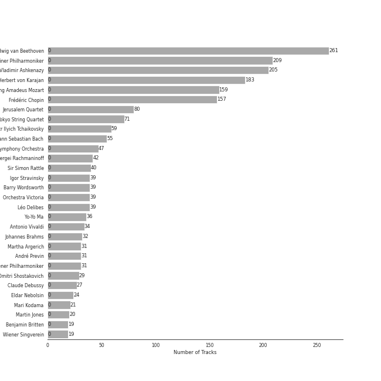
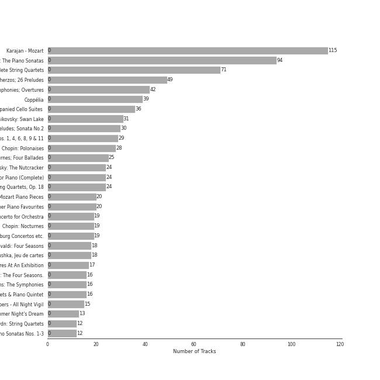
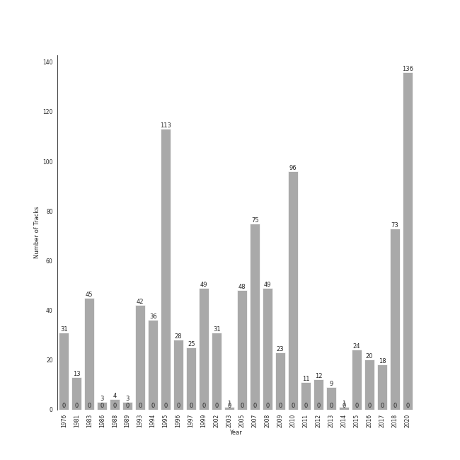

# classical

1019 songs

[See Track Features](audio_features.md)

[See Clusters](clusters/overview.md)

## Top Artists

| Art | Tracks | 💚 | Artist | 🔗 |
|:---|---:|---:|:---|:---|
|  | 261 | 0 | [Ludwig van Beethoven](../../artists/ludwig_van_beethoven/overview.md) | [🔗](https://open.spotify.com/artist/2wOqMjp9TyABvtHdOSOTUS) |
|  | 209 | 0 | [Berliner Philharmoniker](../../artists/berliner_philharmoniker/overview.md) | [🔗](https://open.spotify.com/artist/6uRJnvQ3f8whVnmeoecv5Z) |
|  | 205 | 0 | [Vladimir Ashkenazy](../../artists/vladimir_ashkenazy/overview.md) | [🔗](https://open.spotify.com/artist/20iZXzMb8LoWXOeca32i82) |
|  | 183 | 0 | [Herbert von Karajan](../../artists/herbert_von_karajan/overview.md) | [🔗](https://open.spotify.com/artist/5zCaQxjl110XTrm4LQ1CxY) |
|  | 159 | 0 | [Wolfgang Amadeus Mozart](../../artists/wolfgang_amadeus_mozart/overview.md) | [🔗](https://open.spotify.com/artist/4NJhFmfw43RLBLjQvxDuRS) |
|  | 157 | 0 | [Frédéric Chopin](../../artists/frédéric_chopin/overview.md) | [🔗](https://open.spotify.com/artist/7y97mc3bZRFXzT2szRM4L4) |
|  | 80 | 0 | [Jerusalem Quartet](../../artists/jerusalem_quartet/overview.md) | [🔗](https://open.spotify.com/artist/7AnE8Jpu1vxLeXcs6OKYHE) |
|  | 71 | 0 | [Tokyo String Quartet](../../artists/tokyo_string_quartet/overview.md) | [🔗](https://open.spotify.com/artist/15G9RnBNBDCFUMANna2CvO) |
|  | 59 | 0 | [Pyotr Ilyich Tchaikovsky](../../artists/pyotr_ilyich_tchaikovsky/overview.md) | [🔗](https://open.spotify.com/artist/3MKCzCnpzw3TjUYs2v7vDA) |
|  | 55 | 0 | [Johann Sebastian Bach](../../artists/johann_sebastian_bach/overview.md) | [🔗](https://open.spotify.com/artist/5aIqB5nVVvmFsvSdExz408) |

See top 100 artists

| Art | Tracks | 💚 | Artist | 🔗 |
|:---|---:|---:|:---|:---|
|  | 47 | 0 | [London Symphony Orchestra](../../artists/london_symphony_orchestra/overview.md) | [🔗](https://open.spotify.com/artist/5yxyJsFanEAuwSM5kOuZKc) |
|  | 42 | 0 | Sergei Rachmaninoff | [🔗](https://open.spotify.com/artist/0Kekt6CKSo0m5mivKcoH51) |
|  | 40 | 0 | Sir Simon Rattle | [🔗](https://open.spotify.com/artist/4GQwgdcDQwqtcHICjUNndp) |
|  | 39 | 0 | Igor Stravinsky | [🔗](https://open.spotify.com/artist/7ie36YytMoKtPiL7tUvmoE) |
|  | 39 | 0 | Barry Wordsworth | [🔗](https://open.spotify.com/artist/5sjJnaI3YhaO8KylpJk3gN) |
|  | 39 | 0 | Orchestra Victoria | [🔗](https://open.spotify.com/artist/1bnC6eJzCumTgAB7tG1118) |
|  | 39 | 0 | Léo Delibes | [🔗](https://open.spotify.com/artist/1M9AXZkNPdOd1IPEsQsXnT) |
|  | 36 | 0 | Yo-Yo Ma | [🔗](https://open.spotify.com/artist/5Dl3HXZjG6ZOWT5cV375lk) |
|  | 34 | 0 | Antonio Vivaldi | [🔗](https://open.spotify.com/artist/2QOIawHpSlOwXDvSqQ9YJR) |
|  | 32 | 0 | Johannes Brahms | [🔗](https://open.spotify.com/artist/5wTAi7QkpP6kp8a54lmTOq) |
|  | 31 | 0 | Martha Argerich | [🔗](https://open.spotify.com/artist/66MvLAvLznk5UOvASVGjk4) |
|  | 31 | 0 | André Previn | [🔗](https://open.spotify.com/artist/2tfWguHr2nj4e8KXLKciVq) |
|  | 31 | 0 | Wiener Philharmoniker | [🔗](https://open.spotify.com/artist/003f4bk13c6Q3gAUXv7dGJ) |
|  | 29 | 0 | Dmitri Shostakovich | [🔗](https://open.spotify.com/artist/6s1pCNXcbdtQJlsnM1hRIA) |
|  | 27 | 0 | Claude Debussy | [🔗](https://open.spotify.com/artist/1Uff91EOsvd99rtAupatMP) |
|  | 24 | 0 | Eldar Nebolsin | [🔗](https://open.spotify.com/artist/45ts2AJTWlzJ9JrQlCGxpX) |
|  | 21 | 0 | Mari Kodama | [🔗](https://open.spotify.com/artist/0s0wG03kPyu7MXERfcuxim) |
|  | 20 | 0 | Martin Jones | [🔗](https://open.spotify.com/artist/1VzJXXVXsYbEK773GWSoND) |
|  | 19 | 0 | Benjamin Britten | [🔗](https://open.spotify.com/artist/7MJ1pB5d6Vjmzep2zQlorn) |
|  | 19 | 0 | Wiener Singverein | [🔗](https://open.spotify.com/artist/35QSympF887CO8h5eZHme2) |
|  | 19 | 0 | Maurizio Pollini | [🔗](https://open.spotify.com/artist/2VIdKQmRHnWofsR4odfFOh) |
|  | 19 | 0 | English Chamber Orchestra | [🔗](https://open.spotify.com/artist/2DO4p3CPDnInsJfg0jFfaF) |
|  | 18 | 0 | Mariinsky Orchestra | [🔗](https://open.spotify.com/artist/2rRUfv2w535SEUV1YO5SP6) |
|  | 18 | 0 | Simon Standage | [🔗](https://open.spotify.com/artist/2jIBkRzVUboTbp05rJnKeT) |
|  | 18 | 0 | The English Concert | [🔗](https://open.spotify.com/artist/2Oz3z7PPQUMU2KNYgcO1sA) |
|  | 18 | 0 | Valery Gergiev | [🔗](https://open.spotify.com/artist/2LxnoYPOe0FCLC82R3xgO2) |
|  | 18 | 0 | Trevor Pinnock | [🔗](https://open.spotify.com/artist/25mbgceDJKxXGP8c5FmC83) |
|  | 17 | 0 | Gustavo Dudamel | [🔗](https://open.spotify.com/artist/0cxXnDhpgxcMMkKddhORHY) |
|  | 16 | 0 | Sarah Chang | [🔗](https://open.spotify.com/artist/5duxfFAQVkDT9g261fKlMP) |
|  | 16 | 0 | Emerson String Quartet | [🔗](https://open.spotify.com/artist/4IBl8k6ZsBagsI5zRjyXH7) |
|  | 16 | 0 | Orpheus Chamber Orchestra | [🔗](https://open.spotify.com/artist/35pZsti1RSA5Zv98jAm8kX) |
|  | 16 | 0 | Modest Mussorgsky | [🔗](https://open.spotify.com/artist/284mnx33IWcymQEpMxyfHl) |
|  | 15 | 0 | Nikolai Korniev | [🔗](https://open.spotify.com/artist/70hS9SnJefkZo2QJwS2VXi) |
|  | 15 | 0 | St.Petersburg Chamber Choir | [🔗](https://open.spotify.com/artist/46WjEugfIF0rKOewvFiby2) |
|  | 13 | 0 | Anna Tomowa-Sintow | [🔗](https://open.spotify.com/artist/6NSIW1uEq8JZmxEkHMF17c) |
|  | 13 | 0 | Felix Mendelssohn | [🔗](https://open.spotify.com/artist/6MF58APd3YV72Ln2eVg710) |
|  | 13 | 0 | John Eliot Gardiner | [🔗](https://open.spotify.com/artist/1qIRoGEKXINqrCx5N1engi) |
|  | 12 | 0 | Carmen Piazzini | [🔗](https://open.spotify.com/artist/6aQUOvrKLOquCAvIGdIwTx) |
|  | 12 | 0 | Joseph Haydn | [🔗](https://open.spotify.com/artist/656RXuyw7CE0dtjdPgjJV6) |
|  | 12 | 0 | The Amsterdam String Quartet | [🔗](https://open.spotify.com/artist/0kbgyaL9g2Eba79p2jiYlN) |
|  | 11 | 0 | Gerd Seifert | [🔗](https://open.spotify.com/artist/4aIYtx2Z5X9vRlysnruy66) |
|  | 10 | 0 | Academy of St. Martin in the Fields | [🔗](https://open.spotify.com/artist/77CaCn32H4mOMQA7UElzfF) |
|  | 10 | 0 | Sir Neville Marriner | [🔗](https://open.spotify.com/artist/6NUhQz7eAEsZvjEHTKHux9) |
|  | 8 | 0 | Kühn Mixed Choir | [🔗](https://open.spotify.com/artist/7coad48I6XW2msLS0ms53T) |
|  | 8 | 0 | Pavel Kühn | [🔗](https://open.spotify.com/artist/7bzLxD5IZSXMmuuqnZ7MfY) |
|  | 8 | 0 | Vlasta Mlejnková | [🔗](https://open.spotify.com/artist/775Rkua0PHENjo1sFIyApV) |
|  | 8 | 0 | Antonín Dvořák | [🔗](https://open.spotify.com/artist/6n7nd5iceYpXVwcx8VPpxF) |
|  | 8 | 0 | José van Dam | [🔗](https://open.spotify.com/artist/5qNUHMEhszyeXNYMn4sswd) |
| | 8 | 0 | Alexander Knox | [🔗](https://open.spotify.com/artist/4vzwv4zzBTlG8qsFCqP2Yv) |
|  | 8 | 0 | Francis Poulenc | [🔗](https://open.spotify.com/artist/4IAWVxo2fpTBPn6k7GZ3eY) |
|  | 8 | 0 | Veronika Hagen | [🔗](https://open.spotify.com/artist/3ijxXTal6hr7byhqZDdHsP) |
|  | 8 | 0 | Gabriel Fauré | [🔗](https://open.spotify.com/artist/2gClsBep1tt1rv1CN210SO) |
|  | 7 | 0 | Gustav Holst | [🔗](https://open.spotify.com/artist/5B7uXBeLc2TkR5Jk23qKIZ) |
|  | 7 | 0 | Myung-Whun Chung | [🔗](https://open.spotify.com/artist/4hdiwtmc6OEFFxpSlwwmby) |
|  | 7 | 0 | Agnes Baltsa | [🔗](https://open.spotify.com/artist/2amF56vDuTTbZJQsqUgbuC) |
|  | 7 | 0 | John Birch | [🔗](https://open.spotify.com/artist/2TFBoJYsuvMuPMOlwXWbaE) |
|  | 7 | 0 | Orchestre de l'Opéra National de Paris | [🔗](https://open.spotify.com/artist/1hro5WQTcOb7fRCEUQEZtK) |
|  | 6 | 0 | Anne-Sophie Mutter | [🔗](https://open.spotify.com/artist/6pzfUmBsQAKxOhy0NSi8zn) |
| | 6 | 0 | Ceri-lyn Cissone | [🔗](https://open.spotify.com/artist/6F3jOFmhUwRxRdWAZU6G1A) |
|  | 6 | 0 | András Schiff | [🔗](https://open.spotify.com/artist/24K6LTZFqBAvKsorwK0iXd) |
|  | 6 | 0 | Academy of St Martin in the Fields Chorus | [🔗](https://open.spotify.com/artist/1GxYERY1PDh1dEuFqvTDa5) |
|  | 5 | 0 | Béla Bartók | [🔗](https://open.spotify.com/artist/5zyNXVd952fWOjkdGHCvPd) |
|  | 5 | 0 | Werner Krenn | [🔗](https://open.spotify.com/artist/3PuXD6h01YqjNWQ055CWxA) |
|  | 5 | 0 | Vinson Cole | [🔗](https://open.spotify.com/artist/2j6cP3f3TxyHzcKdWYSm6h) |
| | 4 | 0 | Frankie Wakefield | [🔗](https://open.spotify.com/artist/7jobsaZIFhejECE605yxx6) |
|  | 4 | 0 | Leon Fleisher | [🔗](https://open.spotify.com/artist/6ncNdxBc8zVWMOF7nJ5Pgy) |
|  | 4 | 0 | Gottfried Hornik | [🔗](https://open.spotify.com/artist/6aFQ4LADfHVe08B5gQuE8X) |
|  | 4 | 0 | Cologne New Philharmonic Orchestra | [🔗](https://open.spotify.com/artist/4jSOT0xN5OKPgEfawfzInB) |
|  | 4 | 0 | Krystian Zimerman | [🔗](https://open.spotify.com/artist/43wuPaPcZVMJQWLRaPR4Yz) |
|  | 4 | 0 | Helga Muller-Molinari | [🔗](https://open.spotify.com/artist/3s5xNX5n6PAzpusMRhmHbA) |
|  | 4 | 0 | Manfred Klier | [🔗](https://open.spotify.com/artist/3KkpLfmwQob3Y75ePPdtse) |
|  | 4 | 0 | Mikhail Gantvarg | [🔗](https://open.spotify.com/artist/1SCRjxxRnRFsoctLKXIoZx) |
|  | 4 | 0 | Paata Burchuladze | [🔗](https://open.spotify.com/artist/1JzOJmq9kk0u7OWqzXkBcc) |
|  | 4 | 0 | Volker Hartung | [🔗](https://open.spotify.com/artist/19nzpbhd3Yv5PQXtWKZkhX) |
|  | 4 | 0 | Maurice Ravel | [🔗](https://open.spotify.com/artist/17hR0sYHpx7VYTMRfFUOmY) |
|  | 4 | 0 | The St. Petersburg Soloists | [🔗](https://open.spotify.com/artist/11K9yxwc8iVyEh0ya9v9XY) |
|  | 3 | 0 | Gary Hoffman | [🔗](https://open.spotify.com/artist/7qcRbaIYVuOERS3KmB71GH) |
|  | 3 | 0 | NDR Chor | [🔗](https://open.spotify.com/artist/7hMAA1N5j1Ynb49NIWO7HV) |
| | 3 | 0 | Ossip Schnirlin | [🔗](https://open.spotify.com/artist/7eI7DJSWlJy2W2337B9oTL) |
|  | 3 | 0 | Joseph Joachim | [🔗](https://open.spotify.com/artist/6QuJ4aZSRMebqwDXiJ3SuA) |
|  | 3 | 0 | David Reichenberg | [🔗](https://open.spotify.com/artist/5xA5sW0D3BUAyL02XcDkYv) |
|  | 3 | 0 | Michael Francis | [🔗](https://open.spotify.com/artist/4znpeZQkiPbcXtHlRbfTqF) |
|  | 3 | 0 | Orchestre Symphonique de Montréal | [🔗](https://open.spotify.com/artist/4AcXapei4U7xnWecv9AEBd) |
| | 3 | 0 | Sam Franko | [🔗](https://open.spotify.com/artist/3vkG71N5uQBzhzwEDr6icH) |
|  | 3 | 0 | Philipp Ahmann | [🔗](https://open.spotify.com/artist/309coOGhdzqXdIRwJH1xUo) |
|  | 3 | 0 | Chor der Deutschen Oper Berlin | [🔗](https://open.spotify.com/artist/2KvV4gawnuMNG74DgSAQ0n) |
|  | 3 | 0 | Elizabeth Wilcock | [🔗](https://open.spotify.com/artist/1OfYCRcS14pyRVrO0qTCbs) |
|  | 3 | 0 | Valentina Lisitsa | [🔗](https://open.spotify.com/artist/0gOrXuu1vCBXe3pwTyb5Ca) |
|  | 3 | 0 | Charles Dutoit | [🔗](https://open.spotify.com/artist/0Ku5VBNL7cfGXRhp2BxXEQ) |
|  | 2 | 0 | Elisabeth Sombart | [🔗](https://open.spotify.com/artist/6pp4xqAWH1oHFQX0kJtVvO) |

## Most and least listened tracks
| ​ | Most listened tracks | Rank | ​​ | Least listened tracks | Rank |
|:---|:---|---:|:---|:---|---:|
|  | [String Quartet No. 4 in C Minor, Op. 18 No. 4: I. Allegro ma non tanto](../../artists/ludwig_van_beethoven/overview.md) | nan |  | [Piano Sonata No. 12 in F Major, K. 332: II. Adagio](../../artists/wolfgang_amadeus_mozart/overview.md) | nan |
|  | String Quartet No. 3 In B Flat, Op. 67: 2. Andante | nan |  | Concerto for Violin and Strings in F Major, Op. 8, No. 3, RV 293 "L'autunno": II. Adagio molto (Ubriachi dormienti) | nan |
|  | [String Quartet No. 15 in A minor, Op. 132: I. Assai sostenuto - Allegro](../../artists/ludwig_van_beethoven/overview.md) | nan |  | Jeu de cartes: II. Second Deal | nan |
|  | [Die Zauberflöte, K.620 / Act 2: "Die Strahlen der Sonne" - "Heil sei euch"](../../artists/wolfgang_amadeus_mozart/overview.md) | nan |  | String Quartet No. 6 in G Major, Op. 101: III. Lento | nan |
|  | [String Quartet No. 2 in G Major, Op. 18, No. 2: II. Adagio cantabile - Allegro](../../artists/ludwig_van_beethoven/overview.md) | nan |  | [Die Zauberflöte, K.620 / Act 2: O Isis und Osiris (Sarastro, Chor)](../../artists/wolfgang_amadeus_mozart/overview.md) | nan |
|  | Brahms: Symphony No. 4 in E Minor, Op. 98: III. Allegro giocoso | nan |  | String Quartet No.11 in F Minor, Op. 122: III. Récitatif (Adagio) | nan |
|  | [Divertimento No. 15 in B Flat Major, K. 287: VI. Andante - Allegro molto](../../artists/wolfgang_amadeus_mozart/overview.md) | nan |  | Brahms: Symphony No. 3 in F Major, Op. 90: III. Poco allegretto | nan |
|  | Estampes, L. 100: Jardins sous La Pluie | nan |  | [Divertimento in D, K.334 - Orchestral Version: 4. Adagio](../../artists/wolfgang_amadeus_mozart/overview.md) | nan |
|  | [Piano Sonata No. 14 in C-Sharp Minor, Op. 27 No. 2 "Moonlight": I. Adagio sostenuto](../../artists/ludwig_van_beethoven/overview.md) | nan |  | [Waltz No. 8 in A-Flat Major, Op. 64 No. 3](../../artists/frédéric_chopin/overview.md) | nan |
|  | [Requiem In D Minor, K.626: 5. Sanctus](../../artists/wolfgang_amadeus_mozart/overview.md) | nan |  | Coppélia / Tableau 1: No. 4 Scène | nan |

## Top Albums

| Art | Tracks | 💚 | Album | Release Date | 🔗 |
|:---|---:|---:|:---|:---|:---|
|  | 115 | 0 | Karajan - Mozart | 2020-06-16 | [🔗](https://open.spotify.com/album/1HSJhsMIW2EDD4YSSkbc9e) |
|  | 94 | 0 | Beethoven: The Piano Sonatas | 1995-01-01 | [🔗](https://open.spotify.com/album/7xbsSOswKgms1fUFuwKArz) |
|  | 71 | 0 | Beethoven: Complete String Quartets | 2010-10-12 | [🔗](https://open.spotify.com/album/4JhUG1lr4xztAcqyA0Jm3a) |
|  | 49 | 0 | Chopin: Waltzes; 4 Scherzos; 26 Preludes | 1999-01-01 | [🔗](https://open.spotify.com/album/0yCrQ6dCqiI6ldqI8LPqWB) |
|  | 42 | 0 | Beethoven: 9 Symphonies; Overtures | 1993-01-01 | [🔗](https://open.spotify.com/album/2DQTNTznsteIZciZdyeWdj) |
|  | 39 | 0 | Coppélia | 2018-07-06 | [🔗](https://open.spotify.com/album/7jKT8NC2XfAs9RFKsrGz2p) |
|  | 36 | 0 | Bach: Unaccompanied Cello Suites (Remastered) | 1983 | [🔗](https://open.spotify.com/album/2OpnKgmVYPEN2GldgBponI) |
|  | 31 | 0 | Tchaikovsky: Swan Lake | 1976-01-01 | [🔗](https://open.spotify.com/album/7dVA06E7AP7P7VzPyNxQVO) |
|  | 30 | 0 | Chopin: Preludes; Sonata No.2 | 2002-01-01 | [🔗](https://open.spotify.com/album/33YXJqoFV5AQwbo4yfk22n) |
|  | 29 | 0 | Shostakovich: String Quartets Nos. 1, 4, 6, 8, 9 & 11 | 2005 | [🔗](https://open.spotify.com/album/4V2YVRjysd08RF0GLRDDK7) |

See all 54 albums

| Art | Tracks | 💚 | Album | Release Date | 🔗 |
|:---|---:|---:|:---|:---|:---|
|  | 28 | 0 | Chopin: Polonaises | 1996-01-01 | [🔗](https://open.spotify.com/album/19ofW4fqCAR2uQJKVWw6L6) |
|  | 25 | 0 | Chopin: Nocturnes; Four Ballades | 1997-01-01 | [🔗](https://open.spotify.com/album/0lrM7kR5o7iqkajLKIlzRg) |
|  | 24 | 0 | Tchaikovsky: The Nutcracker | 2010-10-11 | [🔗](https://open.spotify.com/album/54Awn36ryf55PkZyOR4iwQ) |
|  | 24 | 0 | Rachmaninov: Preludes for Piano (Complete) | 2007-05-29 | [🔗](https://open.spotify.com/album/1vlnwUAidj7bEmRhsq4zTv) |
|  | 24 | 0 | Beethoven: String Quartets, Op. 18 | 2015-08-31 | [🔗](https://open.spotify.com/album/37iUq5Dekt8uP5itTiVs2Q) |
|  | 20 | 0 | Mozart Piano Pieces | 2020-10-13 | [🔗](https://open.spotify.com/album/3AYEvo7R1gY4O5xJuMwy3U) |
|  | 20 | 0 | Debussy: Clair De Lune and Other Piano Favourites | 1994 | [🔗](https://open.spotify.com/album/4O5tv6jrLH80bmll46xEEe) |
|  | 19 | 0 | Stravinsky: The Rite of Spring / Bartók: Concerto for Orchestra | 2007-01-01 | [🔗](https://open.spotify.com/album/317b74rpNBO2uhaJFyMaxJ) |
|  | 19 | 0 | Chopin: Nocturnes | 2005-01-01 | [🔗](https://open.spotify.com/album/2aoSpTAjFaMvaZeruqnCVv) |
|  | 19 | 0 | Bach, J.S.: Brandenburg Concertos etc. | 1995-01-01 | [🔗](https://open.spotify.com/album/11FzhwtOFCPB4vpgWo33xV) |
|  | 18 | 0 | Vivaldi: Four Seasons | 2008-01-01 | [🔗](https://open.spotify.com/album/4Uc1Cus3I9LjkI2XwtQnfc) |
|  | 18 | 0 | Stravinsky: Petrushka, Jeu de cartes | 2018-10-19 | [🔗](https://open.spotify.com/album/19fQbFNjlfXgBAFqftKzWA) |
|  | 17 | 0 | Mussorgsky: Pictures At An Exhibition | 2016-12-02 | [🔗](https://open.spotify.com/album/1b2aoeaYZZBWmJoavOQhnd) |
|  | 16 | 0 | Vivaldi: The Four Seasons. | 2007-10-01 | [🔗](https://open.spotify.com/album/4YpaKMCcb65yOoee75UUOh) |
|  | 16 | 0 | Brahms: The Symphonies | 2009-09-07 | [🔗](https://open.spotify.com/album/2dL2qDsg6teV1cueLxCRa1) |
|  | 16 | 0 | Brahms: String Quartets & Piano Quintet | 2007-01-01 | [🔗](https://open.spotify.com/album/5nZ5ePGoQZGt1MbGphwqph) |
|  | 15 | 0 | Rachmaninov: Vespers - All Night Vigil | 1994 | [🔗](https://open.spotify.com/album/7hqotgNjEJt09XiggaMI1v) |
|  | 13 | 0 | Mendelssohn: A Midsummer Night's Dream | 2017-02-03 | [🔗](https://open.spotify.com/album/60J66evwnrnfH03HgDTrwN) |
|  | 12 | 0 | Haydn: String Quartets | 2008-01-01 | [🔗](https://open.spotify.com/album/1rNGG2I3AKJy9FWqUiitkc) |
|  | 12 | 0 | Beethoven: Piano Sonatas Nos. 1-3 | 2008-01-01 | [🔗](https://open.spotify.com/album/5CjMjZJnjdHHgwAVkqrvXq) |
|  | 11 | 0 | Mozart: String Quartets Nos. 4, 17 & 22 | 2011-02-22 | [🔗](https://open.spotify.com/album/1PxALR0DTaTJPL6ByBK266) |
|  | 9 | 0 | Beethoven: Piano Sonatas Nos. 30, 31 & 32 | 2012-03-06 | [🔗](https://open.spotify.com/album/478l1JdqbqDzcmmgrqw2zu) |
|  | 9 | 0 | Beethoven: Piano Sonatas "Moonlight"; "Appassionata"; "Pathétique" | 1983-01-01 | [🔗](https://open.spotify.com/album/0RCfE1YhkdrjnM3kXT3YLl) |
|  | 8 | 0 | Poulenc: Motets and Mass | 2013-01-30 | [🔗](https://open.spotify.com/album/6czmOzWnyfS71jDpRxZDam) |
|  | 8 | 0 | Dvorak: String Quintet, Op. 97 & String Sextet, Op. 48 | 2018-01-19 | [🔗](https://open.spotify.com/album/02nUFvsdTaekp2QQalnE3N) |
|  | 8 | 0 | Debussy & Ravel: String Quartets | 2018-05-25 | [🔗](https://open.spotify.com/album/77Eg2dHidrefgsS3GZ88nK) |
|  | 7 | 0 | Stravinsky: The Firebird (Ballet Suite) | 2009-01-01 | [🔗](https://open.spotify.com/album/2q1xMRl4AcA7rI8GfGnmvD) |
|  | 7 | 0 | Holst: The Planets | 1981-01-01 | [🔗](https://open.spotify.com/album/4v0Xyz0LVToUsSTGdsvKSK) |
|  | 7 | 0 | Fauré: Requiem; Pavane | 2008-01-01 | [🔗](https://open.spotify.com/album/0mhVHXJrGE5WUA58CJLf29) |
|  | 6 | 0 | Mozart: The Piano Sonatas | 1981-01-01 | [🔗](https://open.spotify.com/album/1qM2Z3rhkJLQIXnAQpIUdY) |
|  | 4 | 0 | Mozart: Symphony No. 40 in G Minor, Bassoon Concerto & Flute Serenades Nos. 1 & 3 | 2017-12-08 | [🔗](https://open.spotify.com/album/3WHqaCZ66SWzL7LyYnrn9y) |
|  | 4 | 0 | Chopin: Ballades; Barcarolle; Fantaisie | 1988-01-01 | [🔗](https://open.spotify.com/album/5c9v5oU43Oo22MSG8EKFp2) |
|  | 3 | 0 | Tchaikovsky: Sacred Choral Music | 2016-07-01 | [🔗](https://open.spotify.com/album/4udN7bCLaa8zCnaIvoxzOB) |
|  | 3 | 0 | Rachmaninov: Piano Concerto No.2 | 2012-01-01 | [🔗](https://open.spotify.com/album/5lVqgXqdoIH3W1wUM2hzPx) |
|  | 3 | 0 | Mozart: Eine Kleine Nachtmusik etc. | 1986 | [🔗](https://open.spotify.com/album/5YCuibCDJrkVcS3UOAYqr9) |
|  | 3 | 0 | Debussy: La Mer; Jeux; Prélude à l'après-midi d'un faune; Le Martyre de Saint Sébastien (Symphonic Fragments) | 1989-01-01 | [🔗](https://open.spotify.com/album/5egJ0o1mVH2liUfecDWYqk) |
|  | 1 | 0 | Purcell: Anthems & Sacred Songs | 2003-08-29 | [🔗](https://open.spotify.com/album/7K8qhv7euF0xd6DiqoReDK) |
|  | 1 | 0 | Martha Argerich Live, Vol. 4 | 2017-01-20 | [🔗](https://open.spotify.com/album/69aoRIAIVb2TbIuxmxKYCR) |
|  | 1 | 0 | John Williams - Greatest Hits 1969-1999 | 2014-08-18 | [🔗](https://open.spotify.com/album/3xeo92ykCYWfe32si3I6zF) |
|  | 1 | 0 | Fauré Pavane | 2020-05-30 | [🔗](https://open.spotify.com/album/0FaQ2LW8NNG3YXYJXFikJF) |
|  | 1 | 0 | Chopin: Piano Sonata No. 3, Fantasie-impromptu, Prélude, Nocturne, et al. | 2010-04-05 | [🔗](https://open.spotify.com/album/5QmPVpRux60kcHndJOl6bF) |
|  | 1 | 0 | Cappella | 2013 | [🔗](https://open.spotify.com/album/3n6JxpdWnHkazMCQxKK5qI) |
|  | 1 | 0 | Bruckner: Mass in E Minor & Motets | 2002 | [🔗](https://open.spotify.com/album/13eAUvw0Ga3BBFsf6oxF46) |
|  | 1 | 0 | Allegri - Miserere | 1994-02-15 | [🔗](https://open.spotify.com/album/6DXPSePAsqcD40WQsSnasD) |

## Top Record Labels

| Tracks | 💚 | Label |
|---:|---:|:---|
| 258 | 0 | [Decca Music Group Ltd.](../../labels/decca_music_group_ltd_/overview.md) |
| 161 | 0 | [Deutsche Grammophon (DG)](../../labels/deutsche_grammophon_(dg)/overview.md) |
| 152 | 0 | [harmonia mundi](../../labels/harmonia_mundi/overview.md) |
| 115 | 0 | [UME - Global Clearing House](../../labels/ume_-_global_clearing_house/overview.md) |
| 74 | 0 | [Warner Classics](../../labels/warner_classics/overview.md) |
| 39 | 0 | [Australian Broadcasting Corp (ABC)](../../labels/australian_broadcasting_corp_(abc)/overview.md) |
| 38 | 0 | [Sony Classical](../../labels/sony_classical/overview.md) |
| 24 | 0 | [Naxos](../../labels/naxos/overview.md) |
| 21 | 0 | [Warner Music Group - X5 Music Group](../../labels/warner_music_group_-_x5_music_group/overview.md) |
| 21 | 0 | [PENTATONE](../../labels/pentatone/overview.md) |

See all 24 labels

| Tracks | 💚 | Label |
|---:|---:|:---|
| 20 | 0 | [Nimbus Records](../../labels/nimbus_records/overview.md) |
| 18 | 0 | [Mariinsky](../../labels/mariinsky/overview.md) |
| 18 | 0 | [Decca (UMO)](../../labels/decca_(umo)/overview.md) |
| 16 | 0 | [Warner Classics UK](../../labels/warner_classics_uk/overview.md) |
| 13 | 0 | [Lso Live](../../labels/lso_live/overview.md) |
| 12 | 0 | [Channel Classics Records](../../labels/channel_classics_records/overview.md) |
| 8 | 0 | SUPRAPHON a.s. |
| 4 | 0 | JPK Musik |
| 3 | 0 | Carus |
| 1 | 0 | Warner Classics International |
| 1 | 0 | [Sony Music Labels Inc.](../../labels/sony_music_labels_inc_/overview.md) |
| 1 | 0 | Onyx Classics |
| 1 | 0 | DOREMI |
| 1 | 0 | Conifer Classics |

## Years

| ​ | 10 newest albums | ​​ | 10 oldest albums |
|:---|:---|:---|:---|
|  | Mozart Piano Pieces (2020-10-13) |  | Tchaikovsky: Swan Lake (1976-01-01) |
|  | Karajan - Mozart (2020-06-16) |  | Mozart: The Piano Sonatas (1981-01-01) |
|  | Fauré Pavane (2020-05-30) |  | Holst: The Planets (1981-01-01) |
|  | Stravinsky: Petrushka, Jeu de cartes (2018-10-19) |  | Bach: Unaccompanied Cello Suites (Remastered) (1983) |
|  | Coppélia (2018-07-06) |  | Beethoven: Piano Sonatas "Moonlight"; "Appassionata"; "Pathétique" (1983-01-01) |
|  | Debussy & Ravel: String Quartets (2018-05-25) |  | Mozart: Eine Kleine Nachtmusik etc. (1986) |
|  | Dvorak: String Quintet, Op. 97 & String Sextet, Op. 48 (2018-01-19) |  | Chopin: Ballades; Barcarolle; Fantaisie (1988-01-01) |
|  | Mozart: Symphony No. 40 in G Minor, Bassoon Concerto & Flute Serenades Nos. 1 & 3 (2017-12-08) |  | Debussy: La Mer; Jeux; Prélude à l'après-midi d'un faune; Le Martyre de Saint Sébastien (Symphonic Fragments) (1989-01-01) |
|  | Mendelssohn: A Midsummer Night's Dream (2017-02-03) |  | Beethoven: 9 Symphonies; Overtures (1993-01-01) |
|  | Martha Argerich Live, Vol. 4 (2017-01-20) |  | Rachmaninov: Vespers - All Night Vigil (1994) |

