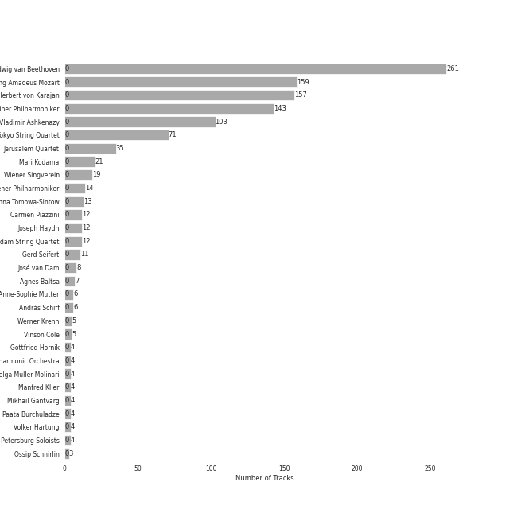
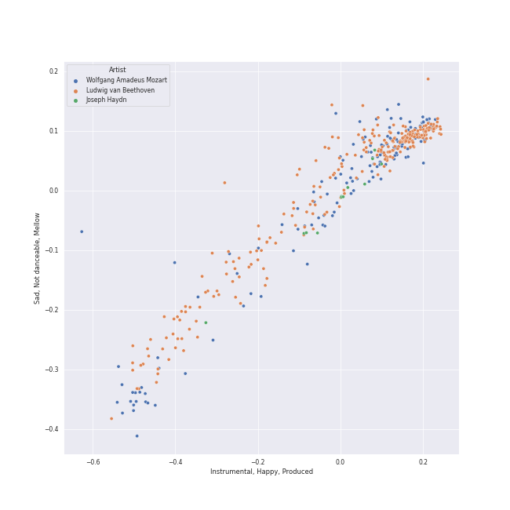
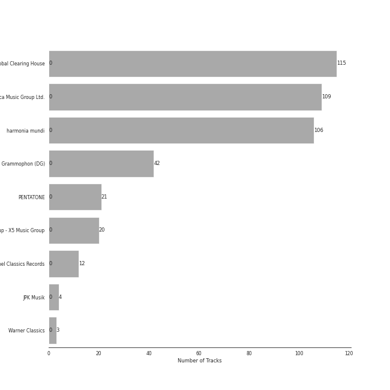

# classical era

[501 songs](classical_era_tracks.md)

## Top Artists

See all 64 artists

|   Number of Tracks | Art                                                                                              | Artist                                                                                   | 🔗                                                           |
|-------------------:|:-------------------------------------------------------------------------------------------------|:-----------------------------------------------------------------------------------------|:------------------------------------------------------------|
|                261 |  | [Ludwig van Beethoven](../artists/ludwig_van_beethoven.md)                               | [🔗](https://open.spotify.com/artist/2wOqMjp9TyABvtHdOSOTUS) |
|                227 |  | [Wolfgang Amadeus Mozart](../artists/wolfgang_amadeus_mozart.md)                         | [🔗](https://open.spotify.com/artist/4NJhFmfw43RLBLjQvxDuRS) |
|                223 |  | [Herbert von Karajan](../artists/herbert_von_karajan.md)                                 | [🔗](https://open.spotify.com/artist/5zCaQxjl110XTrm4LQ1CxY) |
|                209 |  | [Berliner Philharmoniker](../artists/berliner_philharmoniker.md)                         | [🔗](https://open.spotify.com/artist/6uRJnvQ3f8whVnmeoecv5Z) |
|                103 |  | [Vladimir Ashkenazy](../artists/vladimir_ashkenazy.md)                                   | [🔗](https://open.spotify.com/artist/20iZXzMb8LoWXOeca32i82) |
|                 71 |  | [Tokyo String Quartet](../artists/tokyo_string_quartet.md)                               | [🔗](https://open.spotify.com/artist/15G9RnBNBDCFUMANna2CvO) |
|                 35 |  | [Jerusalem Quartet](../artists/jerusalem_quartet.md)                                     | [🔗](https://open.spotify.com/artist/7AnE8Jpu1vxLeXcs6OKYHE) |
|                 35 |  | [Samuel Ramey](../artists/samuel_ramey.md)                                               | [🔗](https://open.spotify.com/artist/4z6dlDfmoZstfKLVC60nM0) |
|                 28 |  | [Anna Tomowa-Sintow](../artists/anna_tomowa_sintow.md)                                   | [🔗](https://open.spotify.com/artist/6NSIW1uEq8JZmxEkHMF17c) |
|                 26 |  | [Agnes Baltsa](../artists/agnes_baltsa.md)                                               | [🔗](https://open.spotify.com/artist/2amF56vDuTTbZJQsqUgbuC) |
|                 24 |  | [Ferruccio Furlanetto](../artists/ferruccio_furlanetto.md)                               | [🔗](https://open.spotify.com/artist/5fN6PDw4pvvYRQtseOS4ru) |
|                 21 |  | [Mari Kodama](../artists/mari_kodama.md)                                                 | [🔗](https://open.spotify.com/artist/0s0wG03kPyu7MXERfcuxim) |
|                 19 |  | [Wiener Singverein](../artists/wiener_singverein.md)                                     | [🔗](https://open.spotify.com/artist/35QSympF887CO8h5eZHme2) |
|                 17 |  | [Gösta Winbergh](../artists/g_sta_winbergh.md)                                           | [🔗](https://open.spotify.com/artist/7mKGVHZ08PYQA8UfvIrJb1) |
|                 17 |  | [Kathleen Battle](../artists/kathleen_battle.md)                                         | [🔗](https://open.spotify.com/artist/13Tfk6ZpGdF0G3v9B3kasP) |
|                 15 |  | [Alexander Malta](../artists/alexander_malta.md)                                         | [🔗](https://open.spotify.com/artist/4oWIwabbO1pHb0qKxbNase) |
|                 14 |  | [Wiener Philharmoniker](../artists/wiener_philharmoniker.md)                             | [🔗](https://open.spotify.com/artist/003f4bk13c6Q3gAUXv7dGJ) |
|                 12 |  | [Carmen Piazzini](../artists/carmen_piazzini.md)                                         | [🔗](https://open.spotify.com/artist/6aQUOvrKLOquCAvIGdIwTx) |
|                 12 |  | [Joseph Haydn](../artists/joseph_haydn.md)                                               | [🔗](https://open.spotify.com/artist/656RXuyw7CE0dtjdPgjJV6) |
|                 12 |  | [The Amsterdam String Quartet](../artists/the_amsterdam_string_quartet.md)               | [🔗](https://open.spotify.com/artist/0kbgyaL9g2Eba79p2jiYlN) |
|                 11 |  | [Gerd Seifert](../artists/gerd_seifert.md)                                               | [🔗](https://open.spotify.com/artist/4aIYtx2Z5X9vRlysnruy66) |
|                  8 |  | José van Dam                                                                             | [🔗](https://open.spotify.com/artist/5qNUHMEhszyeXNYMn4sswd) |
|                  7 |  | Paata Burchuladze                                                                        | [🔗](https://open.spotify.com/artist/1JzOJmq9kk0u7OWqzXkBcc) |
|                  6 |  | [Academy of St. Martin in the Fields](../artists/academy_of_st__martin_in_the_fields.md) | [🔗](https://open.spotify.com/artist/77CaCn32H4mOMQA7UElzfF) |
|                  6 |  | Anne-Sophie Mutter                                                                       | [🔗](https://open.spotify.com/artist/6pzfUmBsQAKxOhy0NSi8zn) |
|                  6 |  | [Sir Neville Marriner](../artists/sir_neville_marriner.md)                               | [🔗](https://open.spotify.com/artist/6NUhQz7eAEsZvjEHTKHux9) |
|                  6 |  | András Schiff                                                                            | [🔗](https://open.spotify.com/artist/24K6LTZFqBAvKsorwK0iXd) |
|                  5 |  | Werner Krenn                                                                             | [🔗](https://open.spotify.com/artist/3PuXD6h01YqjNWQ055CWxA) |
|                  5 |  | Vinson Cole                                                                              | [🔗](https://open.spotify.com/artist/2j6cP3f3TxyHzcKdWYSm6h) |
|                  5 |  | Chor der Deutschen Oper Berlin                                                           | [🔗](https://open.spotify.com/artist/2KvV4gawnuMNG74DgSAQ0n) |
|                  4 |  | Gottfried Hornik                                                                         | [🔗](https://open.spotify.com/artist/6aFQ4LADfHVe08B5gQuE8X) |
|                  4 |  | Cologne New Philharmonic Orchestra                                                       | [🔗](https://open.spotify.com/artist/4jSOT0xN5OKPgEfawfzInB) |
|                  4 |  | Helga Muller-Molinari                                                                    | [🔗](https://open.spotify.com/artist/3s5xNX5n6PAzpusMRhmHbA) |
|                  4 |  | Manfred Klier                                                                            | [🔗](https://open.spotify.com/artist/3KkpLfmwQob3Y75ePPdtse) |
|                  4 |  | Mikhail Gantvarg                                                                         | [🔗](https://open.spotify.com/artist/1SCRjxxRnRFsoctLKXIoZx) |
|                  4 |  | Volker Hartung                                                                           | [🔗](https://open.spotify.com/artist/19nzpbhd3Yv5PQXtWKZkhX) |
|                  4 |  | The St. Petersburg Soloists                                                              | [🔗](https://open.spotify.com/artist/11K9yxwc8iVyEh0ya9v9XY) |
|                  3 |                                                               | Ossip Schnirlin                                                                          | [🔗](https://open.spotify.com/artist/7eI7DJSWlJy2W2337B9oTL) |
|                  3 |  | Joseph Joachim                                                                           | [🔗](https://open.spotify.com/artist/6QuJ4aZSRMebqwDXiJ3SuA) |
|                  3 |                                                               | Sam Franko                                                                               | [🔗](https://open.spotify.com/artist/3vkG71N5uQBzhzwEDr6icH) |
|                  2 |  | Elisabeth Sombart                                                                        | [🔗](https://open.spotify.com/artist/6pp4xqAWH1oHFQX0kJtVvO) |
|                  2 |  | Roberte Mamou                                                                            | [🔗](https://open.spotify.com/artist/6DsbdauTI2Fn2NN4B1EIUN) |
|                  2 |  | Berliner Symphoniker                                                                     | [🔗](https://open.spotify.com/artist/5pF76lplGIvEFGb8lI48hA) |
|                  2 |  | Walter Hagen-Groll                                                                       | [🔗](https://open.spotify.com/artist/5iMb1u0pxxzSPONrB4j0Zb) |
|                  2 |  | Francisco Araiza                                                                         | [🔗](https://open.spotify.com/artist/5M0cOgeTBOetAbsM4FDVDP) |
|                  2 |  | Gerard Oskamp                                                                            | [🔗](https://open.spotify.com/artist/4TWzdKT6XMuddLAoj6PgXi) |
|                  2 |  | Munich Youth Orchestra                                                                   | [🔗](https://open.spotify.com/artist/3jgBofW8eFrbtrsSbLy8Br) |
|                  2 |  | Karin Ott                                                                                | [🔗](https://open.spotify.com/artist/2sZHeIbU96txBewcnCJLj7) |
|                  2 |  | Janet Perry                                                                              | [🔗](https://open.spotify.com/artist/1bV3KjOPs1AI3OolJiYogN) |
|                  2 |  | Edith Mathis                                                                             | [🔗](https://open.spotify.com/artist/0eOythKkGSageuVFr6nDHf) |
|                  2 |                                                               | Jordi Mora                                                                               | [🔗](https://open.spotify.com/artist/0bE9Z0z4cxaixqTRU2O5BA) |
|                  2 |  | Axel Gillison                                                                            | [🔗](https://open.spotify.com/artist/05ukT24TP30K50Blikom8z) |
|                  1 |  | Mostar Symphony Orchestra                                                                | [🔗](https://open.spotify.com/artist/70i7O3jytAajMDs0nV0Zbk) |
|                  1 |                                                               | Wolfgang Bünten                                                                          | [🔗](https://open.spotify.com/artist/6qZFjcGH1SfhbkrNfnzH7z) |
|                  1 |  | Heinz Kruse                                                                              | [🔗](https://open.spotify.com/artist/44kp24Y9MhmQ4RT64CUaV2) |
|                  1 |  | Luigi Boccherini                                                                         | [🔗](https://open.spotify.com/artist/2l4vGfFV7e46yO8lxfxR76) |
|                  1 |                                                               | Tobias Pfulb                                                                             | [🔗](https://open.spotify.com/artist/2GD6gK1wj1cD8TFGe2BpJC) |
|                  1 |                                                               | Vestischen Chamber Orchestra                                                             | [🔗](https://open.spotify.com/artist/1m3ycS5catGCiLB0J5eKDG) |
|                  1 |  | Helmut Froschauer                                                                        | [🔗](https://open.spotify.com/artist/172Encqfd2ZhWAleNg1gbO) |
|                  1 |  | Hanna Schwarz                                                                            | [🔗](https://open.spotify.com/artist/0uzYuEP2MlAJ5FdVIYIalx) |
|                  1 |  | Christian Schulz                                                                         | [🔗](https://open.spotify.com/artist/0sqQ1nXbUwTWglq8jWopvZ) |
|                  1 |  | Ilmar Lapinsch                                                                           | [🔗](https://open.spotify.com/artist/0dI3iXIxXjAtMkzZCsOVEg) |
|                  1 |  | Ratko Delorko                                                                            | [🔗](https://open.spotify.com/artist/0E1sM06TDvSpGqNQBx8FV0) |
|                  1 |  | Gints Berzins                                                                            | [🔗](https://open.spotify.com/artist/0CqCB3JQz4h9k3qk74ihWT) |

## Top Albums

See all 14 albums

|   Number of Tracks | Art                                                                                              | Album                                                                             | 🔗                                                          |
|-------------------:|:-------------------------------------------------------------------------------------------------|:----------------------------------------------------------------------------------|:-----------------------------------------------------------|
|                181 |  | Karajan - Mozart                                                                  | [🔗](https://open.spotify.com/album/1HSJhsMIW2EDD4YSSkbc9e) |
|                 94 |  | Beethoven: The Piano Sonatas                                                      | [🔗](https://open.spotify.com/album/7xbsSOswKgms1fUFuwKArz) |
|                 71 |  | Beethoven: Complete String Quartets                                               | [🔗](https://open.spotify.com/album/4JhUG1lr4xztAcqyA0Jm3a) |
|                 42 |  | Beethoven: 9 Symphonies; Overtures                                                | [🔗](https://open.spotify.com/album/2DQTNTznsteIZciZdyeWdj) |
|                 24 |  | Beethoven: String Quartets, Op. 18                                                | [🔗](https://open.spotify.com/album/37iUq5Dekt8uP5itTiVs2Q) |
|                 20 |  | Mozart Piano Pieces                                                               | [🔗](https://open.spotify.com/album/3AYEvo7R1gY4O5xJuMwy3U) |
|                 12 |  | Haydn: String Quartets                                                            | [🔗](https://open.spotify.com/album/1rNGG2I3AKJy9FWqUiitkc) |
|                 12 |  | Beethoven: Piano Sonatas Nos. 1-3                                                 | [🔗](https://open.spotify.com/album/5CjMjZJnjdHHgwAVkqrvXq) |
|                 11 |  | Mozart: String Quartets Nos. 4, 17 & 22                                           | [🔗](https://open.spotify.com/album/1PxALR0DTaTJPL6ByBK266) |
|                  9 |  | Beethoven: Piano Sonatas Nos. 30, 31 & 32                                         | [🔗](https://open.spotify.com/album/478l1JdqbqDzcmmgrqw2zu) |
|                  9 |  | Beethoven: Piano Sonatas "Moonlight"; "Appassionata"; "Pathétique"                | [🔗](https://open.spotify.com/album/0RCfE1YhkdrjnM3kXT3YLl) |
|                  6 |  | Mozart: The Piano Sonatas                                                         | [🔗](https://open.spotify.com/album/1qM2Z3rhkJLQIXnAQpIUdY) |
|                  6 |  | Mozart: Eine Kleine Nachtmusik etc.                                               | [🔗](https://open.spotify.com/album/5YCuibCDJrkVcS3UOAYqr9) |
|                  4 |  | Mozart: Symphony No. 40 in G Minor, Bassoon Concerto & Flute Serenades Nos. 1 & 3 | [🔗](https://open.spotify.com/album/3WHqaCZ66SWzL7LyYnrn9y) |

## Top Record Labels

See all 9 labels

|   Number of Tracks | Label                                                                                   |
|-------------------:|:----------------------------------------------------------------------------------------|
|                181 | [UME - Global Clearing House](../labels/ume___global_clearing_house.md)                 |
|                109 | [Decca Music Group Ltd.](../labels/decca_music_group_ltd_.md)                           |
|                106 | [harmonia mundi](../labels/harmonia_mundi.md)                                           |
|                 42 | [Deutsche Grammophon (DG)](../labels/deutsche_grammophon__dg_.md)                       |
|                 21 | [PENTATONE](../labels/pentatone.md)                                                     |
|                 20 | [Warner Music Group - X5 Music Group](../labels/warner_music_group___x5_music_group.md) |
|                 12 | [Channel Classics Records](../labels/channel_classics_records.md)                       |
|                  6 | [Warner Classics](../labels/warner_classics.md)                                         |
|                  4 | [JPK Musik](../labels/jpk_musik.md)                                                     |

## Audio Features

| 10 most Danceable tracks                                                                             | 10 least Danceable tracks                                                                                   |
|:-----------------------------------------------------------------------------------------------------|:------------------------------------------------------------------------------------------------------------|
| Don Giovanni, ossia Il dissoluto punito, K.527 / Act 2: "Dunque quello sei tu"                       | String Quartet No. 8 in E Minor, Op. 59 No. 2: II. Molto adagio                                             |
| Don Giovanni, ossia Il dissoluto punito, K.527 / Act 1: "In questa forma dunque"                     | Divertimento No. 15 in B Flat Major, K. 287: IV. Adagio                                                     |
| Don Giovanni, ossia Il dissoluto punito, K.527 / Act 2: "Zitto... Lascia ch'io senta... Ottimamente" | Symphony No. 3 In E Flat, Op. 55 -"Eroica": 2. Marcia funebre (Adagio assai)                                |
| Don Giovanni, ossia Il dissoluto punito, K.527 / Act 2: Amico, che ti par? (Don Giovanni, Leporello) | Requiem In D Minor, K.626: 7. Agnus Dei                                                                     |
| Don Giovanni, ossia Il dissoluto punito, K.527 / Act 1: "Guarda un po' come seppe questa strega"     | Horn Concerto No. 4 in E-Flat Major, K. 495: II. Romanza. Andante                                           |
| Don Giovanni, ossia Il dissoluto punito, K.527 / Act 2: "Eh via, buffone, non mi seccar"             | Die Zauberflöte, K.620 / Act 2: "O Isis und Osiris, welche Wonne!"                                          |
| Don Giovanni, ossia Il dissoluto punito, K.527 / Act 1: "Leporello, ove sei?"                        | Symphony No. 9 In D Minor, Op. 125 - "Choral": 3. Adagio molto e cantabile                                  |
| Don Giovanni, ossia Il dissoluto punito, K.527 / Act 1: "Io deggio ad ogni patto"                    | Don Giovanni, ossia Il dissoluto punito, K.527 / Act 1: Ah! del padre in periglio (Donna Anna, Don Ottavio) |
| String Quartet No. 4 in C Major, K. 157: III. Presto                                                 | Don Giovanni, ossia Il dissoluto punito, K.527 / Act 2: V'è gente alla finestra (Don Giovanni)              |
| Don Giovanni, ossia Il dissoluto punito, K.527 / Act 1: "Orsù, spicciati presto"                     | Don Giovanni, ossia Il dissoluto punito, K.527 / Act 1: Ah, ti ritrovo ancor (Donna Elvira)                 |

| 10 most Energetic tracks                                                                               | 10 least Energetic tracks                                                           |
|:-------------------------------------------------------------------------------------------------------|:------------------------------------------------------------------------------------|
| Requiem in D Minor, K.626: 3a. Sequientia: Dies irae                                                   | Piano Sonata No. 25 in G, Op. 79: 2. Andante                                        |
| Symphony No. 39 in E flat, K.543: 4. Finale (Allegro)                                                  | Die Zauberflöte, K.620 / Act 2: "Seid uns zum zweiten Mal willkommen"               |
| Don Giovanni, ossia Il dissoluto punito, K.527 / Act 1: "Fin ch'han dal vino"                          | Piano Sonata No. 3 in C Major, Op. 2, No. 3: II. Adagio                             |
| Mass In C, K.317 "Coronation": 3. Credo                                                                | Piano Sonata No. 4 in E flat, Op. 7: 2. Largo, con gran espressione                 |
| Symphony No. 41 In C, K.551 - "Jupiter": 4. Molto allegro                                              | Piano Sonata No. 2 in A, Op. 2 No. 2: 2. Largo appassionato                         |
| Symphony No. 7 In A, Op. 92: 4. Allegro con brio                                                       | Piano Sonata No. 10 in C Major, K. 330: II. Andante cantabile                       |
| Mass In C, K.317 "Coronation": 4. Sanctus                                                              | Piano Sonata No. 31 in A-Flat Major, Op. 110: III. Adagio ma non troppo -           |
| Don Giovanni, ossia Il dissoluto punito, K.527 / Act 1: Su svegliatevi, da bravi (Don Giovanni, Servi) | Piano Sonata No. 14 in C-Sharp Minor, Op. 27 No. 2 "Moonlight": I. Adagio sostenuto |
| Requiem In D Minor, K.626: 5. Sanctus                                                                  | Piano Sonata No. 31 in A flat, Op. 110: 3. Adagio ma non troppo                     |
| Symphony No. 5 In C Minor, Op. 67: 4. Allegro                                                          | Piano Sonata No. 21 in C Major, Op. 53 "Waldstein": II. Introduzione (Adagio molto) |

| 10 most Speechy tracks                                                                               | 10 least Speechy tracks                                                                                     |
|:-----------------------------------------------------------------------------------------------------|:------------------------------------------------------------------------------------------------------------|
| Don Giovanni, ossia Il dissoluto punito, K.527 / Act 1: "Leporello, ove sei?"                        | Requiem In D Minor, K.626: 4. Offertorium: Hostias                                                          |
| Don Giovanni, ossia Il dissoluto punito, K.527 / Act 2: "Dunque quello sei tu"                       | Requiem In D Minor, K.626: 3. Sequentia: Rex tremendae                                                      |
| Don Giovanni, ossia Il dissoluto punito, K.527 / Act 1: "Io deggio ad ogni patto"                    | Requiem In D Minor, K.626: 2. Kyrie                                                                         |
| Don Giovanni, ossia Il dissoluto punito, K.527 / Act 1: "Chi è là?"                                  | Requiem In D Minor, K.626: 5. Sanctus                                                                       |
| Don Giovanni, ossia Il dissoluto punito, K.527 / Act 1: "Guarda un po' come seppe questa strega"     | Symphony No. 39 in E flat, K.543: 3. Menuetto (Allegretto)                                                  |
| Don Giovanni, ossia Il dissoluto punito, K.527 / Act 1: "Orsù, spicciati presto"                     | Requiem In D Minor, K.626: 4. Offertorium: Domine Jesu                                                      |
| Don Giovanni, ossia Il dissoluto punito, K.527 / Act 2: Non ci stanchiamo (Masetto, Don Giovanni)    | Boccherini: String Quintet in E Major, Op. 13 No. 6, G. 282: III. Minuetto - Trio                           |
| Don Giovanni, ossia Il dissoluto punito, K.527 / Act 1: "Manco male, è partita"                      | Don Giovanni, ossia Il dissoluto punito, K.527 / Act 1: Ah! del padre in periglio (Donna Anna, Don Ottavio) |
| Don Giovanni, ossia Il dissoluto punito, K.527 / Act 1: "Masetto... senti un po'..."                 | Don Giovanni, ossia Il dissoluto punito, K.527 / Act 2: V'è gente alla finestra (Don Giovanni)              |
| Don Giovanni, ossia Il dissoluto punito, K.527 / Act 2: "Zitto... Lascia ch'io senta... Ottimamente" | Don Giovanni, ossia Il dissoluto punito, K.527 / Act 1: Ah, ti ritrovo ancor (Donna Elvira)                 |

| 10 most Acoustic tracks                                                   | 10 least Acoustic tracks                                                                             |
|:--------------------------------------------------------------------------|:-----------------------------------------------------------------------------------------------------|
| Piano Sonata No. 10 in C Major, K. 330: II. Andante cantabile             | Don Giovanni, ossia Il dissoluto punito, K.527 / Act 2: V'è gente alla finestra (Don Giovanni)       |
| Piano Sonata No. 12 in F Major, K. 332: II. Adagio                        | Symphony No. 7 In A, Op. 92: 4. Allegro con brio                                                     |
| Piano Sonata No. 1 in F Minor, Op. 2, No. 1: III. Menuetto: Allegretto    | Don Giovanni, ossia Il dissoluto punito, K.527 / Act 2: "Ah, si segua il suo passo"                  |
| Piano Sonata No. 19 in G minor, Op. 49 No. 1: 2. Rondo (Allegro)          | Serenade In G, K.525 "Eine kleine Nachtmusik": 3. Menuetto (Allegretto)                              |
| Piano Sonata No. 19 in G minor, Op. 49 No. 1: 1. Andante                  | Symphony No. 6 In F, Op. 68 -"Pastoral": 4. Gewitter, Sturm (Allegro)                                |
| Piano Sonata No. 16 in C Major, K. 545 "Sonata facile": II. Andante       | Don Giovanni, ossia Il dissoluto punito, K.527 / Act 2: "Deh! vieni alla finestra"                   |
| Piano Sonata No. 25 in G, Op. 79: 2. Andante                              | Don Giovanni, ossia Il dissoluto punito, K.527 / Act 2: Amico, che ti par? (Don Giovanni, Leporello) |
| Piano Sonata No. 9 in D Major, K. 311: II. Andante con expressione        | 3 German Dances K605 - 1986 Remastered Version                                                       |
| Piano Sonata No. 9 in E, Op. 14 No. 1: 2. Allegretto                      | Die Zauberflöte, K.620 / Act 2: Ein Mädchen oder Weibchen (Papageno)                                 |
| Piano Sonata No. 31 in A-Flat Major, Op. 110: III. Adagio ma non troppo - | Don Giovanni, ossia Il dissoluto punito, K.527 / Act 1: "Leporello, ove sei?"                        |

| 10 most Instrumental tracks                                                       | 10 least Instrumental tracks                                                                                |
|:----------------------------------------------------------------------------------|:------------------------------------------------------------------------------------------------------------|
| String Quartet No. 14 in C-Sharp Minor, Op. 131: VI. Adagio quasi un poco andante | Don Giovanni, ossia Il dissoluto punito, K.527 / Act 1: "Io deggio ad ogni patto"                           |
| Divertimento No. 11 in D, K.251 "Nannerl-Septett": Menuetto (Tema con variazioni) | Don Giovanni, ossia Il dissoluto punito, K.527 / Act 2: "Zitto... Lascia ch'io senta... Ottimamente"        |
| Piano Sonata No. 16 in C Major, K. 545 "Sonata facile": III. Rondo                | Don Giovanni, ossia Il dissoluto punito, K.527 / Act 2: "Ferma, perfido; ferma"                             |
| Horn Concerto No. 2 in E-Flat Major, K. 417: II. Andante                          | Don Giovanni, ossia Il dissoluto punito, K.527 / Act 1: "Ah, fuggi il traditor"                             |
| Horn Concerto No. 1 in D Major, K. 386b (K. 412 & 514): I. (Allegro) K. 412       | Don Giovanni, ossia Il dissoluto punito, K.527 / Act 1: "Fermati, scellerato!"                              |
| Piano Sonata No. 16 in C, K.545 "Sonata facile": 1. Allegro                       | Don Giovanni, ossia Il dissoluto punito, K.527 / Act 1: Ah! del padre in periglio (Donna Anna, Don Ottavio) |
| Piano Sonata No. 31 in A-Flat Major, Op. 110: II. Allegro molto                   | Die Zauberflöte, K.620 / Act 2: Ein Mädchen oder Weibchen (Papageno)                                        |
| Horn Concerto No. 4 in E-Flat Major, K. 495: II. Romanza. Andante                 | Don Giovanni, ossia Il dissoluto punito, K.527 / Act 1: "Or sai chi l'onore"                                |
| Piano Concerto No. 20 in D Minor, K. 466: I. Allegro                              | Don Giovanni, ossia Il dissoluto punito, K.527 / Act 1: "In questa forma dunque"                            |
| Piano Sonata No. 30 in E Major, Op. 109: I. Vivace ma non troppo                  | Don Giovanni, ossia Il dissoluto punito, K.527 / Act 2: "Ah, si segua il suo passo"                         |

| 10 most Live tracks                                                                                                                                 | 10 least Live tracks                                                                                        |
|:----------------------------------------------------------------------------------------------------------------------------------------------------|:------------------------------------------------------------------------------------------------------------|
| Don Giovanni, ossia Il dissoluto punito, K.527 / Act 1: Mi par ch'oggi il demonio si diverta (Don Giovanni, Don Ottavio, Donna Anna / Donna Elvira) | String Quartet No. 8 in E Minor, Op. 59 No. 2: I. Allegro                                                   |
| Don Giovanni, ossia Il dissoluto punito, K.527 / Act 1: "Io deggio ad ogni patto"                                                                   | Piano Sonata No. 31 in A flat, Op. 110: 1. Moderato cantabile molto espressivo                              |
| Don Giovanni, ossia Il dissoluto punito, K.527 / Act 1: "Presto, presto... pria ch'ei venga"                                                        | Piano Sonata No. 10 in C Major, K. 330: II. Andante cantabile                                               |
| Don Giovanni, ossia Il dissoluto punito, K.527 / Act 2: "Ah! pietà, signori miei!"                                                                  | Piano Sonata No. 8 in C Minor, Op. 13 "Pathétique": III. Rondo (Allegro)                                    |
| Don Giovanni, ossia Il dissoluto punito, K.527 / Act 1: "Ah, fuggi il traditor"                                                                     | Symphony No. 1 In C, Op. 21: 3. Menuetto (Allegro molto e vivace)                                           |
| Don Giovanni, ossia Il dissoluto punito, K.527 / Act 1: "Guarda un po' come seppe questa strega"                                                    | Mozart: Serenade No. 13 in G Major, K. 525 "Eine kleine Nachtmusik": I. Allegro                             |
| Don Giovanni, ossia Il dissoluto punito, K.527 / Act 1: Su svegliatevi, da bravi (Don Giovanni, Servi)                                              | Piano Sonata No. 32 in C minor, Op. 111: 2. Arietta (Adagio molto semplice e cantabile)                     |
| Don Giovanni, ossia Il dissoluto punito, K.527 / Act 2: "Leporello!"                                                                                | Don Giovanni, ossia Il dissoluto punito, K.527 / Act 1: Ah! del padre in periglio (Donna Anna, Don Ottavio) |
| String Quartet No. 2 in G Major, Op. 18, No. 2: III. Scherzo (Allegro) - Trio                                                                       | String Quartet No. 3 in D Major, Op. 18: I. Allegro                                                         |
| Don Giovanni, ossia Il dissoluto punito, K.527 / Act 2: "Zitto... Lascia ch'io senta... Ottimamente"                                                | Don Giovanni, ossia Il dissoluto punito, K.527 / Act 2: V'è gente alla finestra (Don Giovanni)              |

| 10 most Happy tracks                                                                     | 10 least Happy tracks                                                                                       |
|:-----------------------------------------------------------------------------------------|:------------------------------------------------------------------------------------------------------------|
| Don Giovanni, ossia Il dissoluto punito, K.527 / Act 1: "Giovinette, che fate all'amore" | Piano Sonata No. 29 in B flat, Op. 106 -"Hammerklavier": 3. Adagio sostenuto                                |
| Don Giovanni, ossia Il dissoluto punito, K.527 / Act 1: "Povera sventurata!"             | Piano Sonata No. 31 in A-Flat Major, Op. 110: III. Adagio ma non troppo -                                   |
| String Quartet No. 4 in C Major, K. 157: III. Presto                                     | Die Zauberflöte, K.620 / Act 2: O Isis und Osiris (Sarastro, Chor)                                          |
| Don Giovanni, ossia Il dissoluto punito, K.527 / Act 1: "Fin ch'han dal vino"            | Requiem In D Minor, K.626: 3. Sequentia: Confutatis                                                         |
| Don Giovanni, ossia Il dissoluto punito, K.527 / Act 2: "Eh via, buffone, non mi seccar" | String Quartet No. 16 in F Major, Op. 135: III. Lento assai, cantate e tranquillo - Più lento               |
| Piano Sonata No. 6 in F, Op. 10 No. 2: 3. Presto                                         | Don Giovanni, ossia Il dissoluto punito, K.527 / Act 2: "Crudele? Ah no! mio bene!"                         |
| Die Zauberflöte, K.620 / Act 2: Alles fühlt der Liebe Freuden (Monostatos)               | Requiem In D Minor, K.626: 7. Agnus Dei                                                                     |
| Piano Sonata No. 25 in G, Op. 79: 3. Vivace                                              | Don Giovanni, ossia Il dissoluto punito, K.527 / Act 2: V'è gente alla finestra (Don Giovanni)              |
| Don Giovanni, ossia Il dissoluto punito, K.527 / Act 1: "Ho capito, signor sì!"          | Don Giovanni, ossia Il dissoluto punito, K.527 / Act 1: Ah, ti ritrovo ancor (Donna Elvira)                 |
| String Quartet No. 6 in B-Flat Major, Op. 18 No. 6: III. Scherzo (Allegro) - Trio        | Don Giovanni, ossia Il dissoluto punito, K.527 / Act 1: Ah! del padre in periglio (Donna Anna, Don Ottavio) |
