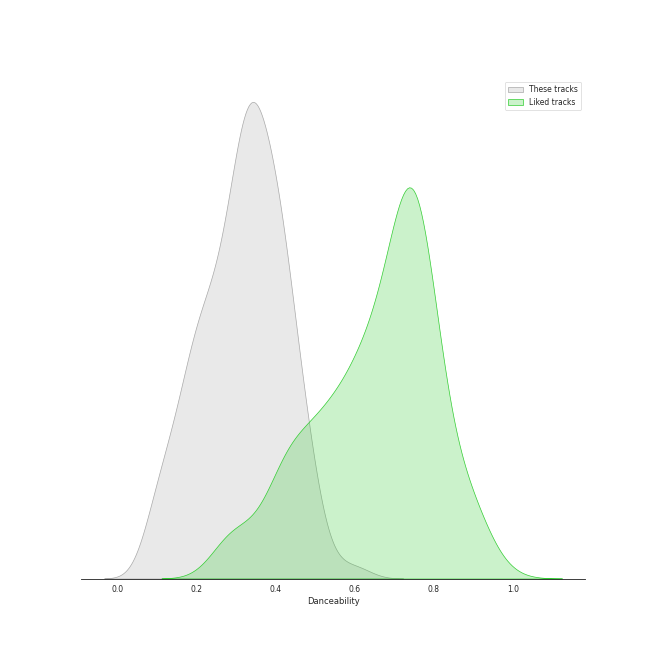
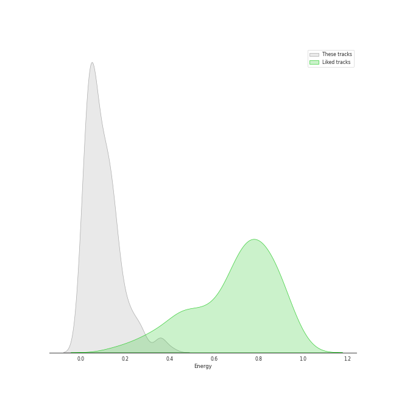
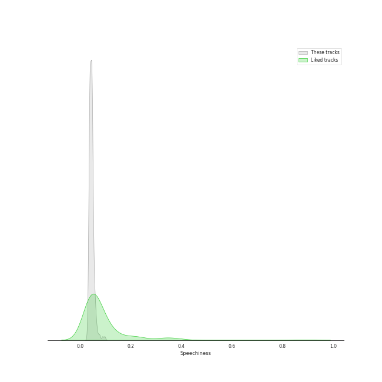
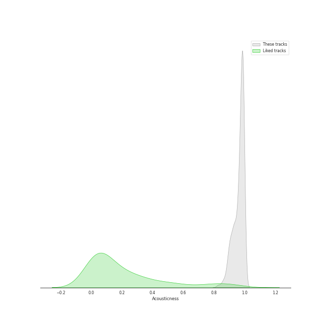
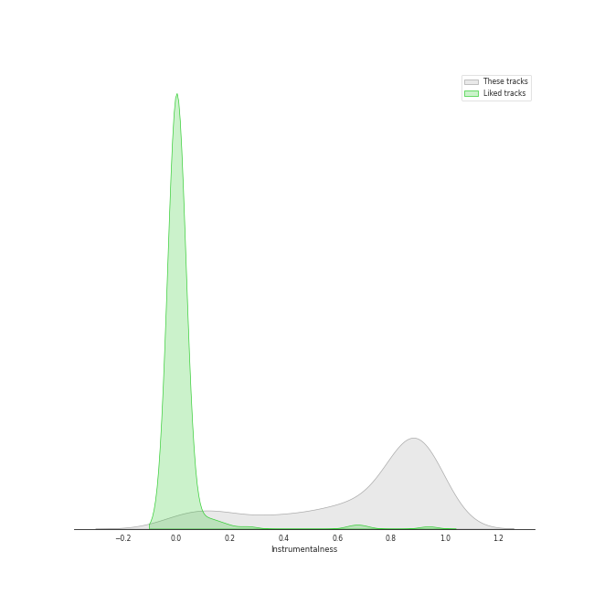
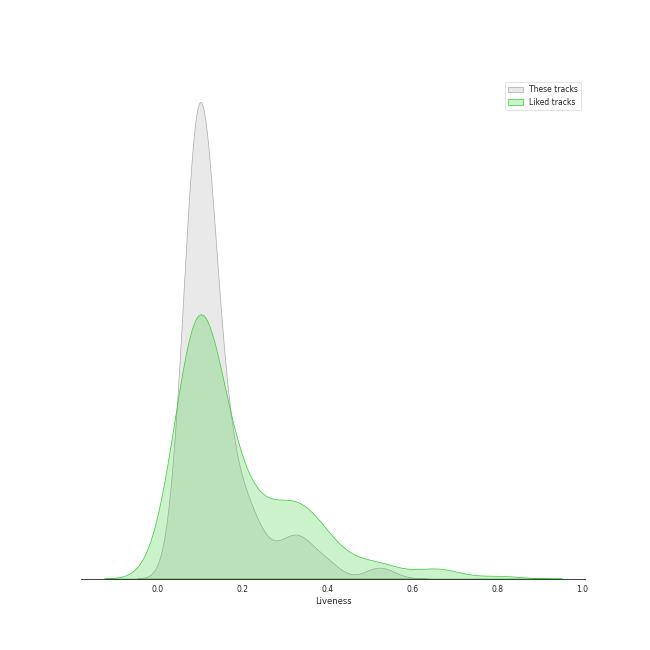
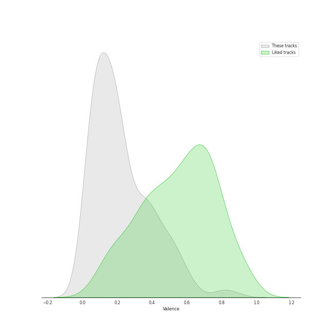
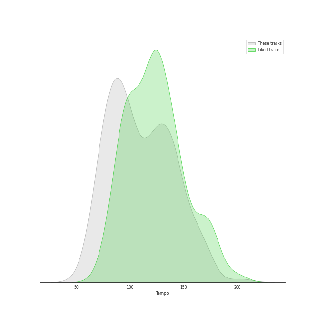

# Track Features for classical era

## Danceability

| ​ | 10 most Danceable tracks | ​​ | 10 least Danceable tracks |
|:---|:---|:---|:---|
|  | String Quartet No. 4 in C Major, K. 157: III. Presto (0.614) |  | Symphony No. 9 In D Minor, Op. 125 - "Choral": 3. Adagio molto e cantabile (0.062) |
|  | Divertimento No. 11 in D, K.251 "Nannerl-Septett": Menuetto (Tema con variazioni) (0.593) |  | Die Zauberflöte, K.620 / Act 2: "O Isis und Osiris, welche Wonne!" (0.0663) |
|  | Piano Sonata No. 12 in A flat, Op. 26: 3. Marcia funebre sulla morte d'un Eroe (0.584) |  | Horn Concerto No. 4 in E-Flat Major, K. 495: II. Romanza. Andante (0.0683) |
|  | Piano Sonata No. 11 in A Major, K. 331 "Turkish March": III. Alla turca (0.571) |  | Requiem In D Minor, K.626: 7. Agnus Dei (0.0749) |
|  | Piano Sonata No. 11 in A Major, K. 331: 3. Alla Turca. Allegretto (0.55) |  | Symphony No. 3 In E Flat, Op. 55 -"Eroica": 2. Marcia funebre (Adagio assai) (0.0871) |
|  | String Quartet No. 2 in G Major, Op. 18, No. 2: IV. Allegro molto, quasi presto (0.527) |  | Divertimento No. 15 in B Flat Major, K. 287: IV. Adagio (0.0898) |
|  | Piano Sonata No. 2 in A, Op. 2 No. 2: 3. Scherzo (Allegretto) (0.521) |  | String Quartet No. 8 in E Minor, Op. 59 No. 2: II. Molto adagio (0.0914) |
|  | Violin Concerto No. 3 in G Major, K. 216: III. Rondo (Allegro) (0.507) |  | Horn Concerto No. 2 in E-Flat Major, K. 417: II. Andante (0.099) |
|  | Die Zauberflöte, K.620 / Act 2: "Pa-Pa-Pa-Pa-Pa-Pa-Papagena!" (0.504) |  | Divertimento in D, K.334 - Orchestral Version: 4. Adagio (0.101) |
|  | Piano Sonata No. 14 in C-Sharp Minor, Op. 27 No. 2 "Moonlight": II. Allegretto (0.504) |  | Symphony No. 6 In F, Op. 68 -"Pastoral": 2. Szene am Bach: (Andante molto mosso) (0.103) |

## Energy

| ​ | 10 most Energetic tracks | ​​ | 10 least Energetic tracks |
|:---|:---|:---|:---|
|  | Requiem, K. 626: 3a. Sequientia: Dies irae (0.542) |  | Piano Sonata No. 21 in C Major, Op. 53 "Waldstein": II. Introduzione (Adagio molto) (0.00157) |
|  | Symphony No. 39 in E-Flat Major, K. 543: 4. Finale (Allegro) (0.441) |  | Piano Sonata No. 31 in A flat, Op. 110: 3. Adagio ma non troppo (0.00168) |
|  | Mass in C Major, K. 317 "Coronation Mass": 3. Credo (0.433) |  | Piano Sonata No. 14 in C-Sharp Minor, Op. 27 No. 2 "Moonlight": I. Adagio sostenuto (0.0025) |
|  | Symphony No. 41 in C Major, K. 551 "Jupiter": 4. Molto allegro (0.408) |  | Piano Sonata No. 31 in A-Flat Major, Op. 110: III. Adagio ma non troppo (0.00293) |
|  | Symphony No. 7 In A, Op. 92: 4. Allegro con brio (0.385) |  | Piano Sonata No. 10 in C Major, K. 330: II. Andante cantabile (0.00316) |
|  | Mass in C Major, K. 317 "Coronation Mass": 4. Sanctus (0.373) |  | Piano Sonata No. 2 in A, Op. 2 No. 2: 2. Largo appassionato (0.00343) |
|  | Requiem In D Minor, K.626: 5. Sanctus (0.363) |  | Piano Sonata No. 4 in E flat, Op. 7: 2. Largo, con gran espressione (0.00362) |
|  | Symphony No. 5 In C Minor, Op. 67: 4. Allegro (0.358) |  | Piano Sonata No. 3 in C Major, Op. 2 No. 3: II. Adagio (0.00389) |
|  | Symphony No. 9 In D Minor, Op. 125 - "Choral" / 4.: "O Freunde nicht diese Töne" - (0.355) |  | Die Zauberflöte, K.620 / Act 2: "Seid uns zum zweiten Mal willkommen" (0.00404) |
|  | Piano Sonata No. 6 in F, Op. 10 No. 2: 3. Presto (0.351) |  | Piano Sonata No. 25 in G, Op. 79: 2. Andante (0.00446) |

## Speechiness

| ​ | 10 most Speechy tracks | ​​ | 10 least Speechy tracks |
|:---|:---|:---|:---|
|  | Piano Sonata No. 21 in C Major, Op. 53 "Waldstein": II. Introduzione (Adagio molto) (0.0974) |  | Requiem In D Minor, K.626: 4. Offertorium: Domine Jesu (0.0293) |
|  | Piano Sonata No. 19 in G minor, Op. 49 No. 1: 2. Rondo (Allegro) (0.0889) |  | Symphony No. 39 in E-Flat Major, K. 543: 3. Menuetto (Allegretto) (0.0297) |
|  | String Quartet No. 11 in F Minor, Op. 95 "Quartetto serioso": III. Allegro assai - Vivace ma serioso (0.0807) |  | Requiem In D Minor, K.626: 5. Sanctus (0.0301) |
|  | Symphony No. 1 In C, Op. 21: 3. Menuetto (Allegro molto e vivace) (0.0779) |  | Requiem In D Minor, K.626: 2. Kyrie (0.0304) |
|  | Piano Sonata No. 12 in A flat, Op. 26: 3. Marcia funebre sulla morte d'un Eroe (0.075) |  | Requiem In D Minor, K.626: 3. Sequentia: Rex tremendae (0.0315) |
|  | Symphony No. 9 In D Minor, Op. 125 - "Choral" / 4.: "O Freunde nicht diese Töne" - (0.0736) |  | Requiem In D Minor, K.626: 4. Offertorium: Hostias (0.0316) |
|  | String Quartet No. 6 in B-Flat Major, Op. 18 No. 6: III. Scherzo (Allegro) - Trio (0.0689) |  | Requiem, K. 626: 8.Communio: Lux aeterna (0.0317) |
|  | String Quartet No. 4 in C Minor, Op. 18, No. 4: II. Andante scherzoso quasi allegretto (0.0682) |  | Mass in C Major, K. 317 "Coronation Mass": 4. Sanctus (0.0321) |
|  | Divertimento No. 11 in D, K.251 "Nannerl-Septett": Menuetto (Tema con variazioni) (0.068) |  | Piano Sonata No. 25 in G, Op. 79: 3. Vivace (0.0322) |
|  | String Quartet in G Major, Op. 76, No. 1: III. Menuetto, Presto (0.0679) |  | Piano Sonata No. 12 in A flat, Op. 26: 4. Allegro (0.0323) |

## Acousticness

| ​ | 10 most Acoustic tracks | ​​ | 10 least Acoustic tracks |
|:---|:---|:---|:---|
|  | Piano Sonata No. 10 in C Major, K. 330: II. Andante cantabile (0.996) |  | Die Zauberflöte, K.620 / Act 2: Ein Mädchen oder Weibchen (Papageno) (0.623) |
|  | Piano Sonata No. 25 in G, Op. 79: 2. Andante (0.995) |  | Symphony No. 6 In F, Op. 68 -"Pastoral": 4. Gewitter, Sturm (Allegro) (0.792) |
|  | Piano Sonata No. 16 in C Major, K. 545 "Sonata facile": II. Andante (0.995) |  | Serenade In G, K.525 "Eine kleine Nachtmusik": 3. Menuetto (Allegretto) (0.828) |
|  | Piano Sonata No. 19 in G minor, Op. 49 No. 1: 1. Andante (0.995) |  | Symphony No. 7 In A, Op. 92: 4. Allegro con brio (0.847) |
|  | Piano Sonata No. 9 in E, Op. 14 No. 1: 2. Allegretto (0.995) |  | Symphony No. 41 in C Major, K. 551 "Jupiter": 4. Molto allegro (0.852) |
|  | Piano Sonata No. 9 in D Major, K. 311: II. Andante con expressione (0.995) |  | Die Zauberflöte, K.620 / Act 2: Alles fühlt der Liebe Freuden (Monostatos) (0.865) |
|  | Piano Sonata No. 31 in A-Flat Major, Op. 110: III. Adagio ma non troppo (0.995) |  | String Quartet No. 15 in A minor, Op. 132: III. Molto adagio (0.865) |
|  | Piano Sonata No. 19 in G minor, Op. 49 No. 1: 2. Rondo (Allegro) (0.995) |  | String Quartet No. 16 in F Major, Op. 135: III. Lento assai, cantate e tranquillo - Più lento (0.869) |
|  | Piano Sonata No. 1 in F Minor, Op. 2 No. 1: III. Menuetto. Allegretto (0.995) |  | String Quartet No. 11 in F Minor, Op. 95 "Serioso": I. Allegro con brio (0.877) |
|  | Piano Sonata No. 12 in F Major, K. 332: II. Adagio (0.995) |  | String Quartet No. 2 in G Major, Op. 18, No. 2: IV. Allegro molto, quasi presto (0.879) |

## Instrumentalness

| ​ | 10 most Instrumental tracks | ​​ | 10 least Instrumental tracks |
|:---|:---|:---|:---|
|  | String Quartet No. 14 in C-Sharp Minor, Op. 131: VI. Adagio quasi un poco andante (0.97) |  | Die Zauberflöte, K.620 / Act 2: Ein Mädchen oder Weibchen (Papageno) (0.0) |
|  | Divertimento No. 11 in D, K.251 "Nannerl-Septett": Menuetto (Tema con variazioni) (0.958) |  | Die Zauberflöte, K.620 / Act 1: "Bei Männern, welche Liebe fühlen" (0.0) |
|  | Horn Concerto No. 2 in E-Flat Major, K. 417: II. Andante (0.954) |  | Die Zauberflöte, K.620 / Act 1: Der Vogelfänger bin ich ja (Papageno) (1.03e-05) |
|  | Piano Sonata No. 16 in C Major, K. 545 "Sonata facile": III. Rondo (0.954) |  | Die Zauberflöte, K.620 / Act 2: "Seid uns zum zweiten Mal willkommen" (1.46e-05) |
|  | Horn Concerto No. 1 in D Major, K. 386b (K. 412 & 514): I. (Allegro) K. 412 (0.95) |  | Die Zauberflöte, K.620 / Act 1: Zu Hilfe! Zu Hilfe! (Tamino, Die drei Damen) (5.54e-05) |
|  | Piano Sonata No. 31 in A-Flat Major, Op. 110: II. Allegro molto (0.949) |  | Die Zauberflöte, K.620 / Act 2: Alles fühlt der Liebe Freuden (Monostatos) (5.9e-05) |
|  | Piano Sonata No. 16 in C, K.545 "Sonata facile": 1. Allegro (0.949) |  | Requiem In D Minor, K.626: 3. Sequentia: Recordare (0.000349) |
|  | Horn Concerto No. 4 in E-Flat Major, K. 495: II. Romanza. Andante (0.949) |  | Requiem In D Minor, K.626: 3. Sequentia: Tuba mirum (0.0004) |
|  | Piano Concerto No. 20 in D Minor, K. 466: I. Allegro (0.948) |  | Requiem In D Minor, K.626: 6. Benedictus (0.000441) |
|  | Piano Sonata No. 30 in E Major, Op. 109: I. Vivace ma non troppo (0.948) |  | Die Zauberflöte, K.620 / Act 1: Dies Bildnis ist bezaubernd schön (Tamino) (0.00077) |

## Liveness

| ​ | 10 most Live tracks | ​​ | 10 least Live tracks |
|:---|:---|:---|:---|
|  | String Quartet No. 2 in G Major, Op. 18, No. 2: III. Scherzo (Allegro) - Trio (0.62) |  | String Quartet No. 3 in D Major, Op. 18: I. Allegro (0.045) |
|  | Symphony No. 5 In C Minor, Op. 67: 3. Allegro (0.614) |  | Piano Sonata No. 32 in C minor, Op. 111: 2. Arietta (Adagio molto semplice e cantabile) (0.0511) |
|  | Symphony No. 36 in C Major, K. 425 "Linz": 3. Menuetto (0.594) |  | Symphony No. 1 In C, Op. 21: 3. Menuetto (Allegro molto e vivace) (0.0554) |
|  | Requiem In D Minor, K.626: 3. Sequentia: Recordare (0.541) |  | Piano Sonata No. 8 in C Minor, Op. 13 "Pathétique": III. Rondo (Allegro) (0.0575) |
|  | Symphony No. 9 In D Minor, Op. 125 - "Choral" - Excerpt From 4th Movement: 4. Presto (0.535) |  | Piano Sonata No. 10 in C Major, K. 330: II. Andante cantabile (0.0583) |
|  | String Quartet No. 10 in E-Flat Major, Op. 74 "Harp": III. Presto - Più presto quasi prestissimo (0.52) |  | Piano Sonata No. 31 in A flat, Op. 110: 1. Moderato cantabile molto espressivo (0.0588) |
|  | Die Zauberflöte, K.620 / Act 2: Alles fühlt der Liebe Freuden (Monostatos) (0.508) |  | String Quartet No. 8 in E Minor, Op. 59 No. 2: I. Allegro (0.0611) |
|  | Requiem, K. 626: 3a. Sequientia: Dies irae (0.444) |  | Piano Sonata No. 3 in C, Op. 2 No. 3: 4. Allegro assai (0.0615) |
|  | Die Zauberflöte, K.620 / Act 1: Der Vogelfänger bin ich ja (Papageno) (0.421) |  | Piano Sonata No. 29 in B flat, Op. 106 -"Hammerklavier": 3. Adagio sostenuto (0.0616) |
|  | Divertimento In F, K.247: Menuetto (0.412) |  | String Quartet No. 5 in A Major, Op. 18 No. 5: II. Menuetto - Trio (0.0625) |

## Valence

| ​ | 10 most Happy tracks | ​​ | 10 least Happy tracks |
|:---|:---|:---|:---|
|  | String Quartet No. 4 in C Major, K. 157: III. Presto (0.878) |  | Requiem In D Minor, K.626: 7. Agnus Dei (0.0338) |
|  | Piano Sonata No. 6 in F, Op. 10 No. 2: 3. Presto (0.814) |  | String Quartet No. 16 in F Major, Op. 135: III. Lento assai, cantate e tranquillo - Più lento (0.0347) |
|  | Die Zauberflöte, K.620 / Act 2: Alles fühlt der Liebe Freuden (Monostatos) (0.792) |  | Requiem In D Minor, K.626: 3. Sequentia: Confutatis (0.0351) |
|  | Piano Sonata No. 25 in G, Op. 79: 3. Vivace (0.791) |  | Die Zauberflöte, K.620 / Act 2: O Isis und Osiris (Sarastro, Chor) (0.0353) |
|  | String Quartet No. 6 in B-Flat Major, Op. 18 No. 6: III. Scherzo (Allegro) - Trio (0.705) |  | Piano Sonata No. 31 in A-Flat Major, Op. 110: III. Adagio ma non troppo (0.0355) |
|  | String Quartet No. 6 in B-Flat Major, Op. 18 No. 6: III. Scherzo (Allegro) - Trio (0.694) |  | Piano Sonata No. 29 in B flat, Op. 106 -"Hammerklavier": 3. Adagio sostenuto (0.0356) |
|  | Piano Sonata No. 31 in A-Flat Major, Op. 110: II. Allegro molto (0.652) |  | Symphony No. 3 In E Flat, Op. 55 -"Eroica": 2. Marcia funebre (Adagio assai) (0.0366) |
|  | Piano Sonata No. 12 in A flat, Op. 26: 4. Allegro (0.652) |  | Piano Sonata No. 31 in A flat, Op. 110: 3. Adagio ma non troppo (0.0367) |
|  | Mozart: Serenade No. 13 in G Major, K. 525 "Eine kleine Nachtmusik": IV. Rondo. Allegro (0.646) |  | Die Zauberflöte, K.620 / Act 2: Ach, ich fühl's, es ist verschwunden (Pamina) (0.0373) |
|  | Serenade In G, K.525 "Eine kleine Nachtmusik": 4. Rondo (Allegro) (0.64) |  | String Quartet No. 8 in E Minor, Op. 59 No. 2: II. Molto adagio (0.0377) |

## Tempo

| ​ | 10 most Fast tracks | ​​ | 10 least Fast tracks |
|:---|:---|:---|:---|
|  | Piano Sonata No. 29 in B flat, Op. 106 -"Hammerklavier": 2. Scherzo (Assai vivace - Presto - Prestissimo - Tempo I) (203.867) |  | Divertimento No. 15 in B Flat Major, K. 287: IV. Adagio (56.647) |
|  | String Quartet No. 11 in F Minor, Op. 95 "Quartetto serioso": III. Allegro assai - Vivace ma serioso (179.045) |  | Mass in C Major, K. 317 "Coronation Mass": 5. Benedictus (57.355) |
|  | String Quartet No. 12 in E-Flat Major, Op. 127: III. Scherzando vivace (174.606) |  | Symphony No. 7 In A, Op. 92: 3. Presto - Assai meno presto (59.821) |
|  | String Quartet No. 6 in B-Flat Major, Op. 18 No. 6: III. Scherzo (Allegro) - Trio (172.548) |  | Piano Sonata No. 13 in E flat, Op. 27 No. 1: 3. Adagio con espressione (60.671) |
|  | Piano Sonata No. 9 in E, Op. 14 No. 1: 1. Allegro (172.047) |  | String Quartet in G Minor, Op. 20, No. 3: III. Poco Adagio (60.931) |
|  | String Quartet No. 3 in D Major, Op. 18: IV. Presto (171.742) |  | Music To Goethe's Tragedy "Egmont" Op. 84: Ouverture - Sostenuto, ma non troppo - Allegro (62.227) |
|  | String Quartet No. 6 in B-Flat Major, Op. 18 No. 6: III. Scherzo (Allegro) - Trio (171.063) |  | Symphony No. 3 In E Flat, Op. 55 -"Eroica": 2. Marcia funebre (Adagio assai) (62.976) |
|  | String Quartet No. 7 In F Major, Op. 59 No. 1: II. Allegretto vivace e sempre scherzando (168.809) |  | Horn Concerto No. 4 in E-Flat Major, K. 495: III. Rondo. Allegro vivace (63.172) |
|  | Divertimento in D, K.334 - Orchestral Version: 4. Adagio (168.802) |  | Symphony No. 4 In B Flat, Op. 60: 2. Adagio (63.776) |
|  | Piano Sonata No. 14 in C Minor, K. 457: I. Molto allegro (168.671) |  | Piano Sonata No. 22 in F, Op. 54: 1. In Tempo d'un Menuetto (64.303) |
