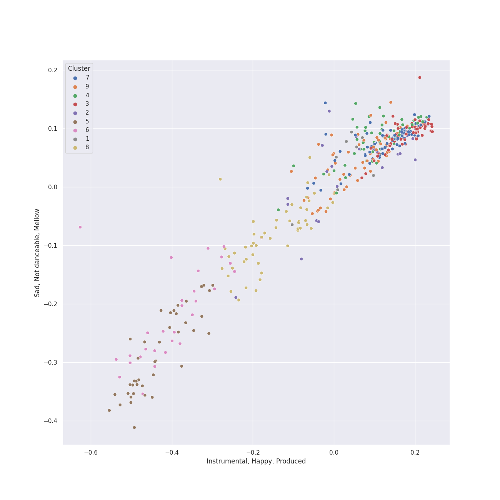

# Clusters in classical era

## Cluster #1

9 tracks

| Art | Track | Album | Artists | Label | 💚 | 🔗 |
|:---|:---|:---|:---|:---|:---|:---|
|  | Piano Sonata No. 25 in G, Op. 79: 3. Vivace | Beethoven: The Piano Sonatas | [Ludwig van Beethoven](../../../../artists/ludwig_van_beethoven/overview.md), [Vladimir Ashkenazy](../../../../artists/vladimir_ashkenazy/overview.md) | [Decca Music Group Ltd.](../../../../labels/decca_music_group_ltd_) | | [🔗](https://open.spotify.com/track/0mUGRc6gLkHcgOIR8sabE0) |
|  | Piano Sonata No. 6 in F, Op. 10 No. 2: 3. Presto | Beethoven: The Piano Sonatas | [Ludwig van Beethoven](../../../../artists/ludwig_van_beethoven/overview.md), [Vladimir Ashkenazy](../../../../artists/vladimir_ashkenazy/overview.md) | [Decca Music Group Ltd.](../../../../labels/decca_music_group_ltd_) | | [🔗](https://open.spotify.com/track/5QjudrRTfGuFlouT4LcV2j) |
|  | String Quartet No. 10 in E-Flat Major, Op. 74 "Harp": III. Presto - Più presto quasi prestissimo | Beethoven: Complete String Quartets | [Ludwig van Beethoven](../../../../artists/ludwig_van_beethoven/overview.md), [Tokyo String Quartet](../../../../artists/tokyo_string_quartet/overview.md) | [harmonia mundi](../../../../labels/harmonia_mundi) | | [🔗](https://open.spotify.com/track/0EJIwpF1aRZ7vW9ihTlb5T) |
|  | String Quartet No. 2 in G Major, Op. 18, No. 2: III. Scherzo (Allegro) - Trio | Beethoven: String Quartets, Op. 18 | [Ludwig van Beethoven](../../../../artists/ludwig_van_beethoven/overview.md), [Jerusalem Quartet](../../../../artists/jerusalem_quartet/overview.md) | [harmonia mundi](../../../../labels/harmonia_mundi) | | [🔗](https://open.spotify.com/track/5NFYYgZwkSOTpOZNeqiinF) |
|  | String Quartet No. 6 in B-Flat Major, Op. 18 No. 6: III. Scherzo (Allegro) - Trio | Beethoven: String Quartets, Op. 18 | [Ludwig van Beethoven](../../../../artists/ludwig_van_beethoven/overview.md), [Jerusalem Quartet](../../../../artists/jerusalem_quartet/overview.md) | [harmonia mundi](../../../../labels/harmonia_mundi) | | [🔗](https://open.spotify.com/track/39AM3Owd4WbyUoTxiGNSyi) |
|  | String Quartet No. 4 in C Major, K. 157: III. Presto | Mozart: String Quartets Nos. 4, 17 & 22 | [Wolfgang Amadeus Mozart](../../../../artists/wolfgang_amadeus_mozart/overview.md), [Jerusalem Quartet](../../../../artists/jerusalem_quartet/overview.md) | [harmonia mundi](../../../../labels/harmonia_mundi) | | [🔗](https://open.spotify.com/track/6wZJSUp9ucaVj1C7gQW1Rd) |
|  | Divertimento No. 11 in D, K.251 "Nannerl-Septett": Marcia alla francese | Karajan - Mozart | [Wolfgang Amadeus Mozart](../../../../artists/wolfgang_amadeus_mozart/overview.md), [Berliner Philharmoniker](../../../../artists/berliner_philharmoniker/overview.md), [Herbert von Karajan](../../../../artists/herbert_von_karajan/overview.md) | [UME - Global Clearing House](../../../../labels/ume___global_clearing_house) | | [🔗](https://open.spotify.com/track/0blUcXH8V1HDL9TVHUhGcS) |
|  | Symphony No. 39 in E flat, K.543: 4. Finale (Allegro) | Karajan - Mozart | [Wolfgang Amadeus Mozart](../../../../artists/wolfgang_amadeus_mozart/overview.md), [Berliner Philharmoniker](../../../../artists/berliner_philharmoniker/overview.md), [Herbert von Karajan](../../../../artists/herbert_von_karajan/overview.md) | [UME - Global Clearing House](../../../../labels/ume___global_clearing_house) | | [🔗](https://open.spotify.com/track/4W2b06rOo6kWkyBmrWEjOR) |
|  | Violin Concerto No. 3 in G Major, K. 216: III. Rondo (Allegro) | Karajan - Mozart | [Wolfgang Amadeus Mozart](../../../../artists/wolfgang_amadeus_mozart/overview.md), Sam Franko, Anne-Sophie Mutter, [Berliner Philharmoniker](../../../../artists/berliner_philharmoniker/overview.md), [Herbert von Karajan](../../../../artists/herbert_von_karajan/overview.md) | [UME - Global Clearing House](../../../../labels/ume___global_clearing_house) | | [🔗](https://open.spotify.com/track/4NzKdkEZ47QPCDukEjYBHF) |
## Cluster #2

21 tracks

| Art | Track | Album | Artists | Label | 💚 | 🔗 |
|:---|:---|:---|:---|:---|:---|:---|
|  | Symphony No. 2 In D, Op. 36: 4. Allegro molto | Beethoven: 9 Symphonies; Overtures | [Ludwig van Beethoven](../../../../artists/ludwig_van_beethoven/overview.md), [Berliner Philharmoniker](../../../../artists/berliner_philharmoniker/overview.md), [Herbert von Karajan](../../../../artists/herbert_von_karajan/overview.md) | [Deutsche Grammophon (DG)](../../../../labels/deutsche_grammophon__dg_) | | [🔗](https://open.spotify.com/track/4MH1pSRa3UjoubxDXDU8zc) |
|  | Symphony No. 4 In B Flat, Op. 60: 4. Allegro ma non troppo | Beethoven: 9 Symphonies; Overtures | [Ludwig van Beethoven](../../../../artists/ludwig_van_beethoven/overview.md), [Berliner Philharmoniker](../../../../artists/berliner_philharmoniker/overview.md), [Herbert von Karajan](../../../../artists/herbert_von_karajan/overview.md) | [Deutsche Grammophon (DG)](../../../../labels/deutsche_grammophon__dg_) | | [🔗](https://open.spotify.com/track/62RfH6r3t6Yj90IgiQhHn4) |
|  | Symphony No. 5 In C Minor, Op. 67: 4. Allegro | Beethoven: 9 Symphonies; Overtures | [Ludwig van Beethoven](../../../../artists/ludwig_van_beethoven/overview.md), [Berliner Philharmoniker](../../../../artists/berliner_philharmoniker/overview.md), [Herbert von Karajan](../../../../artists/herbert_von_karajan/overview.md) | [Deutsche Grammophon (DG)](../../../../labels/deutsche_grammophon__dg_) | | [🔗](https://open.spotify.com/track/3HyePLZIEdQQSmJnGuTxNP) |
|  | Symphony No. 8 in F Major, Op. 93: I. Allegro vivace e con brio | Beethoven: 9 Symphonies; Overtures | [Ludwig van Beethoven](../../../../artists/ludwig_van_beethoven/overview.md), [Berliner Philharmoniker](../../../../artists/berliner_philharmoniker/overview.md), [Herbert von Karajan](../../../../artists/herbert_von_karajan/overview.md) | [Deutsche Grammophon (DG)](../../../../labels/deutsche_grammophon__dg_) | | [🔗](https://open.spotify.com/track/3pmLgmjUUe2iCzNIYN0ail) |
|  | String Quartet No. 5 in A Major, Op. 18 No. 5: IV. Allegro | Beethoven: Complete String Quartets | [Ludwig van Beethoven](../../../../artists/ludwig_van_beethoven/overview.md), [Tokyo String Quartet](../../../../artists/tokyo_string_quartet/overview.md) | [harmonia mundi](../../../../labels/harmonia_mundi) | | [🔗](https://open.spotify.com/track/1xooWRi29x4214VEUWnhlV) |
|  | String Quartet No. 17 in B-Flat Major, K. 458 "The Hunt": II. Menuetto (Moderato) | Mozart: String Quartets Nos. 4, 17 & 22 | [Wolfgang Amadeus Mozart](../../../../artists/wolfgang_amadeus_mozart/overview.md), [Jerusalem Quartet](../../../../artists/jerusalem_quartet/overview.md) | [harmonia mundi](../../../../labels/harmonia_mundi) | | [🔗](https://open.spotify.com/track/25p4xpZb7TOwGzcjX9OBbc) |
|  | Divertimento No. 15 in B-Flat Major, K. 287: 2. Thema mit Variationen: Andante grazioso | Karajan - Mozart | [Wolfgang Amadeus Mozart](../../../../artists/wolfgang_amadeus_mozart/overview.md), [Berliner Philharmoniker](../../../../artists/berliner_philharmoniker/overview.md), [Herbert von Karajan](../../../../artists/herbert_von_karajan/overview.md) | [UME - Global Clearing House](../../../../labels/ume___global_clearing_house) | | [🔗](https://open.spotify.com/track/7IgInWMT2b4Wqjvqmx6OhC) |
|  | Symphony No. 40 In G Minor, K.550: 1. Molto allegro | Karajan - Mozart | [Wolfgang Amadeus Mozart](../../../../artists/wolfgang_amadeus_mozart/overview.md), [Berliner Philharmoniker](../../../../artists/berliner_philharmoniker/overview.md), [Herbert von Karajan](../../../../artists/herbert_von_karajan/overview.md) | [UME - Global Clearing House](../../../../labels/ume___global_clearing_house) | | [🔗](https://open.spotify.com/track/5yyMm46TlDeyPalqWwzbah) |
|  | Symphony No. 41 In C, K.551 - "Jupiter": 3. Menuetto (Allegretto) | Karajan - Mozart | [Wolfgang Amadeus Mozart](../../../../artists/wolfgang_amadeus_mozart/overview.md), [Berliner Philharmoniker](../../../../artists/berliner_philharmoniker/overview.md), [Herbert von Karajan](../../../../artists/herbert_von_karajan/overview.md) | [UME - Global Clearing House](../../../../labels/ume___global_clearing_house) | | [🔗](https://open.spotify.com/track/64G71tpW7kAQOJs7UT57rH) |
|  | Symphony No. 41 In C, K.551 - "Jupiter": 4. Molto allegro | Karajan - Mozart | [Wolfgang Amadeus Mozart](../../../../artists/wolfgang_amadeus_mozart/overview.md), [Berliner Philharmoniker](../../../../artists/berliner_philharmoniker/overview.md), [Herbert von Karajan](../../../../artists/herbert_von_karajan/overview.md) | [UME - Global Clearing House](../../../../labels/ume___global_clearing_house) | | [🔗](https://open.spotify.com/track/3qoz9ikaAKgbjwogge2ihi) |
## Cluster #3

78 tracks

| Art | Track | Album | Artists | Label | 💚 | 🔗 |
|:---|:---|:---|:---|:---|:---|:---|
|  | Piano Sonata No. 8 in C Minor, Op. 13 "Pathétique": I. Grave - Allegro di molto e con brio | Beethoven: Piano Sonatas "Moonlight"; "Appassionata"; "Pathétique" | [Ludwig van Beethoven](../../../../artists/ludwig_van_beethoven/overview.md), [Vladimir Ashkenazy](../../../../artists/vladimir_ashkenazy/overview.md) | [Decca Music Group Ltd.](../../../../labels/decca_music_group_ltd_) | | [🔗](https://open.spotify.com/track/1BBoow3jdOQDYqUUSVHcqt) |
|  | Piano Sonata No. 13 in E flat, Op. 27 No. 1: 1. Andante - Allegro - Tempo I | Beethoven: The Piano Sonatas | [Ludwig van Beethoven](../../../../artists/ludwig_van_beethoven/overview.md), [Vladimir Ashkenazy](../../../../artists/vladimir_ashkenazy/overview.md) | [Decca Music Group Ltd.](../../../../labels/decca_music_group_ltd_) | | [🔗](https://open.spotify.com/track/3sEMnEwMLitPryhuGxgQpV) |
|  | Piano Sonata No. 16 in G, Op. 31 No. 1: 2. Adagio grazioso | Beethoven: The Piano Sonatas | [Ludwig van Beethoven](../../../../artists/ludwig_van_beethoven/overview.md), [Vladimir Ashkenazy](../../../../artists/vladimir_ashkenazy/overview.md) | [Decca Music Group Ltd.](../../../../labels/decca_music_group_ltd_) | | [🔗](https://open.spotify.com/track/55X24BGkDWD7lsHNsmGSY3) |
|  | Piano Sonata No. 17 in D minor, Op. 31 No. 2 -"Tempest": 2. Adagio | Beethoven: The Piano Sonatas | [Ludwig van Beethoven](../../../../artists/ludwig_van_beethoven/overview.md), [Vladimir Ashkenazy](../../../../artists/vladimir_ashkenazy/overview.md) | [Decca Music Group Ltd.](../../../../labels/decca_music_group_ltd_) | | [🔗](https://open.spotify.com/track/3HtCNpL6JQ5k5Mqtee3kWc) |
|  | Piano Sonata No. 21 in C Major, Op. 53 "Waldstein": III. Rondo (Allegretto moderato - Prestissimo) | Beethoven: The Piano Sonatas | [Ludwig van Beethoven](../../../../artists/ludwig_van_beethoven/overview.md), [Vladimir Ashkenazy](../../../../artists/vladimir_ashkenazy/overview.md) | [Decca Music Group Ltd.](../../../../labels/decca_music_group_ltd_) | | [🔗](https://open.spotify.com/track/3yIWNNQnAQeCmPgjEZ8UwX) |
|  | Piano Sonata No. 26 in E-Flat Major, Op. 81a "Les Adieux": I. Das Lebewohl (Adagio - Allegro) | Beethoven: The Piano Sonatas | [Ludwig van Beethoven](../../../../artists/ludwig_van_beethoven/overview.md), [Vladimir Ashkenazy](../../../../artists/vladimir_ashkenazy/overview.md) | [Decca Music Group Ltd.](../../../../labels/decca_music_group_ltd_) | | [🔗](https://open.spotify.com/track/76915vyJFSFWrz8AYVMN2p) |
|  | Piano Sonata No. 30 in E, Op. 109: 3. Gesangvoll, mit innigster Empfindung (Andante molto cantabile ed espressivo) | Beethoven: The Piano Sonatas | [Ludwig van Beethoven](../../../../artists/ludwig_van_beethoven/overview.md), [Vladimir Ashkenazy](../../../../artists/vladimir_ashkenazy/overview.md) | [Decca Music Group Ltd.](../../../../labels/decca_music_group_ltd_) | | [🔗](https://open.spotify.com/track/6i4hjBqCkGirJ0EHRfmbBk) |
|  | Piano Sonata No. 6 in F, Op. 10 No. 2: 2. Allegretto | Beethoven: The Piano Sonatas | [Ludwig van Beethoven](../../../../artists/ludwig_van_beethoven/overview.md), [Vladimir Ashkenazy](../../../../artists/vladimir_ashkenazy/overview.md) | [Decca Music Group Ltd.](../../../../labels/decca_music_group_ltd_) | | [🔗](https://open.spotify.com/track/4gThvgaLCcABLJIFFKTlig) |
|  | Piano Sonata No. 31 in A-Flat Major, Op. 110: I. Moderato cantabile molto espressivo | Beethoven: Piano Sonatas Nos. 30, 31 & 32 | [Ludwig van Beethoven](../../../../artists/ludwig_van_beethoven/overview.md), Mari Kodama | [PENTATONE](../../../../labels/pentatone) | | [🔗](https://open.spotify.com/track/1rzoA7LbmuzUX7zPZfAEOm) |
|  | Piano Concerto No. 20 in D Minor, K. 466: I. Allegro | Mozart Piano Pieces | [Wolfgang Amadeus Mozart](../../../../artists/wolfgang_amadeus_mozart/overview.md), Roberte Mamou, Gerard Oskamp, Berliner Symphoniker | [Warner Music Group - X5 Music Group](../../../../labels/warner_music_group___x5_music_group) | | [🔗](https://open.spotify.com/track/78Ujl5rH38vlmaWJ2gkXCM) |
## Cluster #4

60 tracks

| Art | Track | Album | Artists | Label | 💚 | 🔗 |
|:---|:---|:---|:---|:---|:---|:---|
|  | Symphony No. 2 In D, Op. 36: 3. Scherzo (Allegro) | Beethoven: 9 Symphonies; Overtures | [Ludwig van Beethoven](../../../../artists/ludwig_van_beethoven/overview.md), [Berliner Philharmoniker](../../../../artists/berliner_philharmoniker/overview.md), [Herbert von Karajan](../../../../artists/herbert_von_karajan/overview.md) | [Deutsche Grammophon (DG)](../../../../labels/deutsche_grammophon__dg_) | | [🔗](https://open.spotify.com/track/64v8YQdGgHATztGNTmtAP8) |
|  | Piano Sonata No. 10 in G Major, Op. 14 No. 2: 3. Scherzo. Allegro assai | Beethoven: The Piano Sonatas | [Ludwig van Beethoven](../../../../artists/ludwig_van_beethoven/overview.md), [Vladimir Ashkenazy](../../../../artists/vladimir_ashkenazy/overview.md) | [Decca Music Group Ltd.](../../../../labels/decca_music_group_ltd_) | | [🔗](https://open.spotify.com/track/0VEufDhQQQvz863wJ7unXm) |
|  | Piano Sonata No. 12 in A flat, Op. 26: 2. Scherzo (Allegro molto) | Beethoven: The Piano Sonatas | [Ludwig van Beethoven](../../../../artists/ludwig_van_beethoven/overview.md), [Vladimir Ashkenazy](../../../../artists/vladimir_ashkenazy/overview.md) | [Decca Music Group Ltd.](../../../../labels/decca_music_group_ltd_) | | [🔗](https://open.spotify.com/track/1ceRZjxysooUhNqjsvetIF) |
|  | Piano Sonata No. 25 in G, Op. 79: 1. Presto alla tedesca | Beethoven: The Piano Sonatas | [Ludwig van Beethoven](../../../../artists/ludwig_van_beethoven/overview.md), [Vladimir Ashkenazy](../../../../artists/vladimir_ashkenazy/overview.md) | [Decca Music Group Ltd.](../../../../labels/decca_music_group_ltd_) | | [🔗](https://open.spotify.com/track/51etNICsNf6ltMHZ4I0i2q) |
|  | Piano Sonata No. 31 in A flat, Op. 110: 2. Allegro molto | Beethoven: The Piano Sonatas | [Ludwig van Beethoven](../../../../artists/ludwig_van_beethoven/overview.md), [Vladimir Ashkenazy](../../../../artists/vladimir_ashkenazy/overview.md) | [Decca Music Group Ltd.](../../../../labels/decca_music_group_ltd_) | | [🔗](https://open.spotify.com/track/3UfHf3OZVwTS9bip0AQykg) |
|  | String Quartet No. 22 in B-Flat Major, K. 589, "Prussian": IV. Allegro assai | Mozart: String Quartets Nos. 4, 17 & 22 | [Wolfgang Amadeus Mozart](../../../../artists/wolfgang_amadeus_mozart/overview.md), [Jerusalem Quartet](../../../../artists/jerusalem_quartet/overview.md) | [harmonia mundi](../../../../labels/harmonia_mundi) | | [🔗](https://open.spotify.com/track/6Y8SmRRP56DkQoDt8op0xN) |
|  | Horn Concerto No. 1 in D Major, K. 386b (K. 412 & 514): II. Rondò. Allegro K. 514 | Karajan - Mozart | [Wolfgang Amadeus Mozart](../../../../artists/wolfgang_amadeus_mozart/overview.md), Gerd Seifert, [Berliner Philharmoniker](../../../../artists/berliner_philharmoniker/overview.md), [Herbert von Karajan](../../../../artists/herbert_von_karajan/overview.md) | [UME - Global Clearing House](../../../../labels/ume___global_clearing_house) | | [🔗](https://open.spotify.com/track/4sHYPGjXXhFpJB1DMVc14A) |
|  | Horn Concerto No. 3 in E-Flat Major, K. 447: III. Allegro | Karajan - Mozart | [Wolfgang Amadeus Mozart](../../../../artists/wolfgang_amadeus_mozart/overview.md), Manfred Klier, Gerd Seifert, [Berliner Philharmoniker](../../../../artists/berliner_philharmoniker/overview.md), [Herbert von Karajan](../../../../artists/herbert_von_karajan/overview.md) | [UME - Global Clearing House](../../../../labels/ume___global_clearing_house) | | [🔗](https://open.spotify.com/track/1UPNWzHNtv70waHBGDTQxq) |
|  | Symphony No. 38 In D, K.504 "Prague": 3. Finale (Presto) | Karajan - Mozart | [Wolfgang Amadeus Mozart](../../../../artists/wolfgang_amadeus_mozart/overview.md), [Berliner Philharmoniker](../../../../artists/berliner_philharmoniker/overview.md), [Herbert von Karajan](../../../../artists/herbert_von_karajan/overview.md) | [UME - Global Clearing House](../../../../labels/ume___global_clearing_house) | | [🔗](https://open.spotify.com/track/5OlBFvqwbhQcoihA42rIdk) |
|  | Symphony No. 40 In G Minor, K.550: 4. Finale (Allegro assai) | Karajan - Mozart | [Wolfgang Amadeus Mozart](../../../../artists/wolfgang_amadeus_mozart/overview.md), [Berliner Philharmoniker](../../../../artists/berliner_philharmoniker/overview.md), [Herbert von Karajan](../../../../artists/herbert_von_karajan/overview.md) | [UME - Global Clearing House](../../../../labels/ume___global_clearing_house) | | [🔗](https://open.spotify.com/track/70Fx0AQvJFpUCmJFsAnPil) |
## Cluster #5

41 tracks

| Art | Track | Album | Artists | Label | 💚 | 🔗 |
|:---|:---|:---|:---|:---|:---|:---|
|  | String Quartet No. 14 in C-Sharp Minor, Op. 131: III. Allegro moderato - Adagio - Piu vivace | Beethoven: Complete String Quartets | [Ludwig van Beethoven](../../../../artists/ludwig_van_beethoven/overview.md), [Tokyo String Quartet](../../../../artists/tokyo_string_quartet/overview.md) | [harmonia mundi](../../../../labels/harmonia_mundi) | | [🔗](https://open.spotify.com/track/0qAphY2YKqhNBrYaWucjQu) |
|  | String Quartet No. 14 in C-Sharp Minor, Op. 131: IV. Andante ma non troppo e molto cantabile | Beethoven: Complete String Quartets | [Ludwig van Beethoven](../../../../artists/ludwig_van_beethoven/overview.md), [Tokyo String Quartet](../../../../artists/tokyo_string_quartet/overview.md) | [harmonia mundi](../../../../labels/harmonia_mundi) | | [🔗](https://open.spotify.com/track/3TDW149x3odZEoqt9cnCMd) |
|  | String Quartet No. 3 in D Major, Op. 18: II. Andante con moto | Beethoven: Complete String Quartets | [Ludwig van Beethoven](../../../../artists/ludwig_van_beethoven/overview.md), [Tokyo String Quartet](../../../../artists/tokyo_string_quartet/overview.md) | [harmonia mundi](../../../../labels/harmonia_mundi) | | [🔗](https://open.spotify.com/track/2V5dO6szHHSoAqIRTJViYA) |
|  | String Quartet No. 4 in C Minor, Op. 18 No. 4: III. Menuetto (Allegro) - Trio | Beethoven: Complete String Quartets | [Ludwig van Beethoven](../../../../artists/ludwig_van_beethoven/overview.md), [Tokyo String Quartet](../../../../artists/tokyo_string_quartet/overview.md) | [harmonia mundi](../../../../labels/harmonia_mundi) | | [🔗](https://open.spotify.com/track/0FDBvZ6wjjGW15jlH3vVFt) |
|  | String Quartet No. 5 in A Major, Op. 18 No. 5: II. Menuetto - Trio | Beethoven: Complete String Quartets | [Ludwig van Beethoven](../../../../artists/ludwig_van_beethoven/overview.md), [Tokyo String Quartet](../../../../artists/tokyo_string_quartet/overview.md) | [harmonia mundi](../../../../labels/harmonia_mundi) | | [🔗](https://open.spotify.com/track/33qw9cPdfAYL9nYW6Y1ODN) |
|  | String Quartet No. 6 in B-Flat Major, Op. 18 No. 6: II. Adagio ma non troppo | Beethoven: Complete String Quartets | [Ludwig van Beethoven](../../../../artists/ludwig_van_beethoven/overview.md), [Tokyo String Quartet](../../../../artists/tokyo_string_quartet/overview.md) | [harmonia mundi](../../../../labels/harmonia_mundi) | | [🔗](https://open.spotify.com/track/4AD0EywiSZv85tO1Fqe3uM) |
|  | String Quartet No. 6 in B-Flat Major, Op. 18 No. 6: II. Adagio ma non troppo | Beethoven: String Quartets, Op. 18 | [Ludwig van Beethoven](../../../../artists/ludwig_van_beethoven/overview.md), [Jerusalem Quartet](../../../../artists/jerusalem_quartet/overview.md) | [harmonia mundi](../../../../labels/harmonia_mundi) | | [🔗](https://open.spotify.com/track/5haDu6D9Afpa5GIt5wVWMb) |
|  | Mozart: Serenade No. 13 in G Major, K. 525 "Eine kleine Nachtmusik": II. Romance. Andante | Mozart: Eine Kleine Nachtmusik etc. | [Wolfgang Amadeus Mozart](../../../../artists/wolfgang_amadeus_mozart/overview.md), Academy of St. Martin in the Fields, Sir Neville Marriner | [Warner Classics](../../../../labels/warner_classics) | | [🔗](https://open.spotify.com/track/5c8aHvonwKaBAoOIXmHQdt) |
|  | Die Zauberflöte, K.620 / Act 1: "Bei Männern, welche Liebe fühlen" | Karajan - Mozart | [Wolfgang Amadeus Mozart](../../../../artists/wolfgang_amadeus_mozart/overview.md), Edith Mathis, Gottfried Hornik, [Berliner Philharmoniker](../../../../artists/berliner_philharmoniker/overview.md), [Herbert von Karajan](../../../../artists/herbert_von_karajan/overview.md) | [UME - Global Clearing House](../../../../labels/ume___global_clearing_house) | | [🔗](https://open.spotify.com/track/7earPy3QwSWpSKX2eYX9US) |
|  | Requiem In D Minor, K.626: 3. Sequentia: Tuba mirum | Karajan - Mozart | [Wolfgang Amadeus Mozart](../../../../artists/wolfgang_amadeus_mozart/overview.md), Anna Tomowa-Sintow, Helga Muller-Molinari, Vinson Cole, Paata Burchuladze, Wiener Philharmoniker, [Herbert von Karajan](../../../../artists/herbert_von_karajan/overview.md) | [UME - Global Clearing House](../../../../labels/ume___global_clearing_house) | | [🔗](https://open.spotify.com/track/5xItkHeimSWCAWwh6WvV86) |
## Cluster #6

30 tracks

| Art | Track | Album | Artists | Label | 💚 | 🔗 |
|:---|:---|:---|:---|:---|:---|:---|
|  | Symphony No. 3 In E Flat, Op. 55 -"Eroica": 3. Scherzo (Allegro vivace) | Beethoven: 9 Symphonies; Overtures | [Ludwig van Beethoven](../../../../artists/ludwig_van_beethoven/overview.md), [Berliner Philharmoniker](../../../../artists/berliner_philharmoniker/overview.md), [Herbert von Karajan](../../../../artists/herbert_von_karajan/overview.md) | [Deutsche Grammophon (DG)](../../../../labels/deutsche_grammophon__dg_) | | [🔗](https://open.spotify.com/track/5b3322i4oAchfQQfcwZcxV) |
|  | Symphony No. 6 In F, Op. 68 -"Pastoral": 3. Lustiges Zusammensein der Landleute (Allegro) | Beethoven: 9 Symphonies; Overtures | [Ludwig van Beethoven](../../../../artists/ludwig_van_beethoven/overview.md), [Berliner Philharmoniker](../../../../artists/berliner_philharmoniker/overview.md), [Herbert von Karajan](../../../../artists/herbert_von_karajan/overview.md) | [Deutsche Grammophon (DG)](../../../../labels/deutsche_grammophon__dg_) | | [🔗](https://open.spotify.com/track/1rClQ3viDyCkJVC2yealEp) |
|  | String Quartet No. 1 in F Major, Op. 18 No. 1: III. Scherzo (Allegro molto) - Trio | Beethoven: Complete String Quartets | [Ludwig van Beethoven](../../../../artists/ludwig_van_beethoven/overview.md), [Tokyo String Quartet](../../../../artists/tokyo_string_quartet/overview.md) | [harmonia mundi](../../../../labels/harmonia_mundi) | | [🔗](https://open.spotify.com/track/6Qa7Y6Mv50TeLSRR5YMdfC) |
|  | String Quartet No. 13 in B-Flat Major, Op. 130: II. Presto | Beethoven: Complete String Quartets | [Ludwig van Beethoven](../../../../artists/ludwig_van_beethoven/overview.md), [Tokyo String Quartet](../../../../artists/tokyo_string_quartet/overview.md) | [harmonia mundi](../../../../labels/harmonia_mundi) | | [🔗](https://open.spotify.com/track/0Ls01nfIiOKq7BpUdAHc9k) |
|  | String Quartet No. 13 in B-Flat Major, Op. 130: III. Andante con moto ma non troppo | Beethoven: Complete String Quartets | [Ludwig van Beethoven](../../../../artists/ludwig_van_beethoven/overview.md), [Tokyo String Quartet](../../../../artists/tokyo_string_quartet/overview.md) | [harmonia mundi](../../../../labels/harmonia_mundi) | | [🔗](https://open.spotify.com/track/5ZDsIt23kqzWVzusGej26t) |
|  | String Quartet No. 13 in B-Flat Major, Op. 130: VI. Finale (Allegro) | Beethoven: Complete String Quartets | [Ludwig van Beethoven](../../../../artists/ludwig_van_beethoven/overview.md), [Tokyo String Quartet](../../../../artists/tokyo_string_quartet/overview.md) | [harmonia mundi](../../../../labels/harmonia_mundi) | | [🔗](https://open.spotify.com/track/4NXLgjsrr00FjE44RR7Uhk) |
|  | String Quartet No. 15 in A minor, Op. 132: IV. Alla marcia, assai vivace - Più Allegro | Beethoven: Complete String Quartets | [Ludwig van Beethoven](../../../../artists/ludwig_van_beethoven/overview.md), [Tokyo String Quartet](../../../../artists/tokyo_string_quartet/overview.md) | [harmonia mundi](../../../../labels/harmonia_mundi) | | [🔗](https://open.spotify.com/track/4qkbe0akfBLNyR8JwJ9CxL) |
|  | String Quartet No. 3 in D Major, Op. 18: III. Allegro | Beethoven: Complete String Quartets | [Ludwig van Beethoven](../../../../artists/ludwig_van_beethoven/overview.md), [Tokyo String Quartet](../../../../artists/tokyo_string_quartet/overview.md) | [harmonia mundi](../../../../labels/harmonia_mundi) | | [🔗](https://open.spotify.com/track/5G6akNf0PvWHz7vtgEmPzn) |
|  | String Quartet No. 5 in A Major, Op. 18 No. 5: I. Allegro | Beethoven: Complete String Quartets | [Ludwig van Beethoven](../../../../artists/ludwig_van_beethoven/overview.md), [Tokyo String Quartet](../../../../artists/tokyo_string_quartet/overview.md) | [harmonia mundi](../../../../labels/harmonia_mundi) | | [🔗](https://open.spotify.com/track/1JEQuOAmBYecUKo7rnBfs6) |
|  | String Quartet No. 4 in C Minor, Op. 18 No. 4: II. Andante scherzoso quasi allegretto | Beethoven: String Quartets, Op. 18 | [Ludwig van Beethoven](../../../../artists/ludwig_van_beethoven/overview.md), [Jerusalem Quartet](../../../../artists/jerusalem_quartet/overview.md) | [harmonia mundi](../../../../labels/harmonia_mundi) | | [🔗](https://open.spotify.com/track/3utDQmK6hHWqyHGQUJ1mHN) |
## Cluster #7

78 tracks

| Art | Track | Album | Artists | Label | 💚 | 🔗 |
|:---|:---|:---|:---|:---|:---|:---|
|  | Piano Sonata No. 1 in F minor, Op. 2 No. 1: 1. Allegro | Beethoven: The Piano Sonatas | [Ludwig van Beethoven](../../../../artists/ludwig_van_beethoven/overview.md), [Vladimir Ashkenazy](../../../../artists/vladimir_ashkenazy/overview.md) | [Decca Music Group Ltd.](../../../../labels/decca_music_group_ltd_) | | [🔗](https://open.spotify.com/track/2E0Q7KZ2b6wTMsuDA8lRhz) |
|  | Piano Sonata No. 1 in F minor, Op. 2 No. 1: 4. Prestissimo | Beethoven: The Piano Sonatas | [Ludwig van Beethoven](../../../../artists/ludwig_van_beethoven/overview.md), [Vladimir Ashkenazy](../../../../artists/vladimir_ashkenazy/overview.md) | [Decca Music Group Ltd.](../../../../labels/decca_music_group_ltd_) | | [🔗](https://open.spotify.com/track/1Wrn95wC9svYqRRPovuW8x) |
|  | Piano Sonata No. 11 in B flat, Op. 22: 1. Allegro con brio | Beethoven: The Piano Sonatas | [Ludwig van Beethoven](../../../../artists/ludwig_van_beethoven/overview.md), [Vladimir Ashkenazy](../../../../artists/vladimir_ashkenazy/overview.md) | [Decca Music Group Ltd.](../../../../labels/decca_music_group_ltd_) | | [🔗](https://open.spotify.com/track/0JGm7LxCumF7nRrUlF5QIt) |
|  | Piano Sonata No. 16 in G, Op. 31 No. 1: 1. Allegro vivace | Beethoven: The Piano Sonatas | [Ludwig van Beethoven](../../../../artists/ludwig_van_beethoven/overview.md), [Vladimir Ashkenazy](../../../../artists/vladimir_ashkenazy/overview.md) | [Decca Music Group Ltd.](../../../../labels/decca_music_group_ltd_) | | [🔗](https://open.spotify.com/track/5r3qjqRLBS0SsLkuuBVntw) |
|  | Piano Sonata No. 19 in G minor, Op. 49 No. 1: 1. Andante | Beethoven: The Piano Sonatas | [Ludwig van Beethoven](../../../../artists/ludwig_van_beethoven/overview.md), [Vladimir Ashkenazy](../../../../artists/vladimir_ashkenazy/overview.md) | [Decca Music Group Ltd.](../../../../labels/decca_music_group_ltd_) | | [🔗](https://open.spotify.com/track/6fnnJxQzSmNrgZubGxEfoR) |
|  | Piano Sonata No. 30 in E, Op. 109: 2. Prestissimo | Beethoven: The Piano Sonatas | [Ludwig van Beethoven](../../../../artists/ludwig_van_beethoven/overview.md), [Vladimir Ashkenazy](../../../../artists/vladimir_ashkenazy/overview.md) | [Decca Music Group Ltd.](../../../../labels/decca_music_group_ltd_) | | [🔗](https://open.spotify.com/track/0ZIhFlc89d2jvgfcgfKpwN) |
|  | Piano Sonata No. 4 in E flat, Op. 7: 3. Allegro | Beethoven: The Piano Sonatas | [Ludwig van Beethoven](../../../../artists/ludwig_van_beethoven/overview.md), [Vladimir Ashkenazy](../../../../artists/vladimir_ashkenazy/overview.md) | [Decca Music Group Ltd.](../../../../labels/decca_music_group_ltd_) | | [🔗](https://open.spotify.com/track/7mjP1zIbYt98zXkL5HUIBs) |
|  | Piano Sonata No. 2 in A Major, Op. 2, No. 2: I. Allegro vivace | Beethoven: Piano Sonatas Nos. 1-3 | [Ludwig van Beethoven](../../../../artists/ludwig_van_beethoven/overview.md), Mari Kodama | [PentaTone](../../../../labels/pentatone) | | [🔗](https://open.spotify.com/track/4qcfJuhj4OyVlrbYNmBo2P) |
|  | Piano Sonata No. 3 in C Major, Op. 2, No. 3: IV. Allegro assai | Beethoven: Piano Sonatas Nos. 1-3 | [Ludwig van Beethoven](../../../../artists/ludwig_van_beethoven/overview.md), Mari Kodama | [PentaTone](../../../../labels/pentatone) | | [🔗](https://open.spotify.com/track/3pZt5RCBnQty2KDduZaBJp) |
|  | Symphony No. 41 In C, K.551 - "Jupiter": 1. Allegro vivace | Karajan - Mozart | [Wolfgang Amadeus Mozart](../../../../artists/wolfgang_amadeus_mozart/overview.md), [Berliner Philharmoniker](../../../../artists/berliner_philharmoniker/overview.md), [Herbert von Karajan](../../../../artists/herbert_von_karajan/overview.md) | [UME - Global Clearing House](../../../../labels/ume___global_clearing_house) | | [🔗](https://open.spotify.com/track/79KKMe5oK9nC7VdQuariwg) |
## Cluster #8

51 tracks

| Art | Track | Album | Artists | Label | 💚 | 🔗 |
|:---|:---|:---|:---|:---|:---|:---|
|  | String Quartet in C Major, Op. 74, No. 1: III. Menuetto, Allegretto | Haydn: String Quartets | Joseph Haydn, The Amsterdam String Quartet | [Channel Classics Records](../../../../labels/channel_classics_records) | | [🔗](https://open.spotify.com/track/0EspVDVsYSaURv8yiilNxJ) |
|  | String Quartet in G Minor, Op. 20, No. 3: I. Allegro con spirito | Haydn: String Quartets | Joseph Haydn, The Amsterdam String Quartet | [Channel Classics Records](../../../../labels/channel_classics_records) | | [🔗](https://open.spotify.com/track/4Yj05JzIiAV17ExCLpq5tf) |
|  | Symphony No. 4 In B Flat, Op. 60: 1. Adagio - Allegro vivace | Beethoven: 9 Symphonies; Overtures | [Ludwig van Beethoven](../../../../artists/ludwig_van_beethoven/overview.md), [Berliner Philharmoniker](../../../../artists/berliner_philharmoniker/overview.md), [Herbert von Karajan](../../../../artists/herbert_von_karajan/overview.md) | [Deutsche Grammophon (DG)](../../../../labels/deutsche_grammophon__dg_) | | [🔗](https://open.spotify.com/track/7h3gKAftaUcgjzQbprBaUq) |
|  | String Quartet No. 15 in A minor, Op. 132: II. Allegro ma non tanto | Beethoven: Complete String Quartets | [Ludwig van Beethoven](../../../../artists/ludwig_van_beethoven/overview.md), [Tokyo String Quartet](../../../../artists/tokyo_string_quartet/overview.md) | [harmonia mundi](../../../../labels/harmonia_mundi) | | [🔗](https://open.spotify.com/track/52afsywDcOS3ApCQET7k5J) |
|  | String Quartet No. 16 in F Major, Op. 135: IV. Grave ma non troppo tratto - Allegro | Beethoven: Complete String Quartets | [Ludwig van Beethoven](../../../../artists/ludwig_van_beethoven/overview.md), [Tokyo String Quartet](../../../../artists/tokyo_string_quartet/overview.md) | [harmonia mundi](../../../../labels/harmonia_mundi) | | [🔗](https://open.spotify.com/track/17gcQZt0jMDbuEyOFaSyBI) |
|  | String Quartet No. 8 in E Minor, Op. 59 No. 2: III. Allegretto | Beethoven: Complete String Quartets | [Ludwig van Beethoven](../../../../artists/ludwig_van_beethoven/overview.md), [Tokyo String Quartet](../../../../artists/tokyo_string_quartet/overview.md) | [harmonia mundi](../../../../labels/harmonia_mundi) | | [🔗](https://open.spotify.com/track/1e0KnK30nx7GxphZVx7DFI) |
|  | String Quartet No. 9 in C Major, Op. 59 No. 3: I. Introduzione (Andante con moto - Allegro vivace) | Beethoven: Complete String Quartets | [Ludwig van Beethoven](../../../../artists/ludwig_van_beethoven/overview.md), [Tokyo String Quartet](../../../../artists/tokyo_string_quartet/overview.md) | [harmonia mundi](../../../../labels/harmonia_mundi) | | [🔗](https://open.spotify.com/track/5bUQPchwRlyhMMNP7OYrcW) |
|  | String Quartet No. 1 in F Major, Op. 18 No. 1: I. Allegro con brio | Beethoven: String Quartets, Op. 18 | [Ludwig van Beethoven](../../../../artists/ludwig_van_beethoven/overview.md), [Jerusalem Quartet](../../../../artists/jerusalem_quartet/overview.md) | [harmonia mundi](../../../../labels/harmonia_mundi) | | [🔗](https://open.spotify.com/track/0bLf8GdqFZ3rK8GwWhcjH8) |
|  | String Quartet No. 5 in A Major, Op. 18 No. 5: II. Menuetto - Trio | Beethoven: String Quartets, Op. 18 | [Ludwig van Beethoven](../../../../artists/ludwig_van_beethoven/overview.md), [Jerusalem Quartet](../../../../artists/jerusalem_quartet/overview.md) | [harmonia mundi](../../../../labels/harmonia_mundi) | | [🔗](https://open.spotify.com/track/0AtBrNtW0crqbSyUtwNykS) |
|  | Requiem In D Minor, K.626: 5. Sanctus | Karajan - Mozart | [Wolfgang Amadeus Mozart](../../../../artists/wolfgang_amadeus_mozart/overview.md), Wiener Singverein, Wiener Philharmoniker, [Herbert von Karajan](../../../../artists/herbert_von_karajan/overview.md) | [UME - Global Clearing House](../../../../labels/ume___global_clearing_house) | | [🔗](https://open.spotify.com/track/7rkakVQEVWVASpkamj7m8o) |
## Cluster #9

64 tracks

| Art | Track | Album | Artists | Label | 💚 | 🔗 |
|:---|:---|:---|:---|:---|:---|:---|
|  | String Quartet in G Minor, Op. 20, No. 3: II. Menuetto, Allegretto | Haydn: String Quartets | Joseph Haydn, The Amsterdam String Quartet | [Channel Classics Records](../../../../labels/channel_classics_records) | | [🔗](https://open.spotify.com/track/32ACoavut7gU8eXtXcWj9E) |
|  | Music To Goethe's Tragedy "Egmont" Op. 84: Ouverture - Sostenuto, ma non troppo - Allegro | Beethoven: 9 Symphonies; Overtures | [Ludwig van Beethoven](../../../../artists/ludwig_van_beethoven/overview.md), [Berliner Philharmoniker](../../../../artists/berliner_philharmoniker/overview.md), [Herbert von Karajan](../../../../artists/herbert_von_karajan/overview.md) | [Deutsche Grammophon (DG)](../../../../labels/deutsche_grammophon__dg_) | | [🔗](https://open.spotify.com/track/6qvHVRS4Uzyw0a9Dz4fDVn) |
|  | Symphony No. 6 In F, Op. 68 -"Pastoral": 5. Hirtengesang. Frohe und dankbare Gefühle nach dem Sturm: Allegretto | Beethoven: 9 Symphonies; Overtures | [Ludwig van Beethoven](../../../../artists/ludwig_van_beethoven/overview.md), [Berliner Philharmoniker](../../../../artists/berliner_philharmoniker/overview.md), [Herbert von Karajan](../../../../artists/herbert_von_karajan/overview.md) | [Deutsche Grammophon (DG)](../../../../labels/deutsche_grammophon__dg_) | | [🔗](https://open.spotify.com/track/70E993QEzhQSWILEzDliaV) |
|  | Symphony No. 7 In A, Op. 92: 2. Allegretto | Beethoven: 9 Symphonies; Overtures | [Ludwig van Beethoven](../../../../artists/ludwig_van_beethoven/overview.md), [Berliner Philharmoniker](../../../../artists/berliner_philharmoniker/overview.md), [Herbert von Karajan](../../../../artists/herbert_von_karajan/overview.md) | [Deutsche Grammophon (DG)](../../../../labels/deutsche_grammophon__dg_) | | [🔗](https://open.spotify.com/track/0ADhD2DsEi5OTt21ljNUBz) |
|  | Piano Sonata No. 21 in C Major, Op. 53 "Waldstein": I. Allegro con brio | Beethoven: The Piano Sonatas | [Ludwig van Beethoven](../../../../artists/ludwig_van_beethoven/overview.md), [Vladimir Ashkenazy](../../../../artists/vladimir_ashkenazy/overview.md) | [Decca Music Group Ltd.](../../../../labels/decca_music_group_ltd_) | | [🔗](https://open.spotify.com/track/6mhZMduiw9NIIRk75k9WVy) |
|  | Horn Concerto No. 3 in E-Flat Major, K. 447: II. Romanze. Larghetto | Karajan - Mozart | [Wolfgang Amadeus Mozart](../../../../artists/wolfgang_amadeus_mozart/overview.md), Manfred Klier, Gerd Seifert, [Berliner Philharmoniker](../../../../artists/berliner_philharmoniker/overview.md), [Herbert von Karajan](../../../../artists/herbert_von_karajan/overview.md) | [UME - Global Clearing House](../../../../labels/ume___global_clearing_house) | | [🔗](https://open.spotify.com/track/2QgJYJgBuKQ67CEVhSsCZS) |
|  | Requiem In D Minor, K.626: 1. Introitus: Requiem | Karajan - Mozart | [Wolfgang Amadeus Mozart](../../../../artists/wolfgang_amadeus_mozart/overview.md), Anna Tomowa-Sintow, Wiener Singverein, Wiener Philharmoniker, [Herbert von Karajan](../../../../artists/herbert_von_karajan/overview.md) | [UME - Global Clearing House](../../../../labels/ume___global_clearing_house) | | [🔗](https://open.spotify.com/track/3zsSvh8Pu3TiuXn5YdhZqz) |
|  | Symphony No. 38 In D, K.504 "Prague": 2. Andante | Karajan - Mozart | [Wolfgang Amadeus Mozart](../../../../artists/wolfgang_amadeus_mozart/overview.md), [Berliner Philharmoniker](../../../../artists/berliner_philharmoniker/overview.md), [Herbert von Karajan](../../../../artists/herbert_von_karajan/overview.md) | [UME - Global Clearing House](../../../../labels/ume___global_clearing_house) | | [🔗](https://open.spotify.com/track/1nhBekRWgdBjtMPiGeKr0i) |
|  | Symphony No. 39 in E flat, K.543: 1. Adagio - Allegro | Karajan - Mozart | [Wolfgang Amadeus Mozart](../../../../artists/wolfgang_amadeus_mozart/overview.md), [Berliner Philharmoniker](../../../../artists/berliner_philharmoniker/overview.md), [Herbert von Karajan](../../../../artists/herbert_von_karajan/overview.md) | [UME - Global Clearing House](../../../../labels/ume___global_clearing_house) | | [🔗](https://open.spotify.com/track/2rDigYsTPubJm1fhML82Pj) |
|  | Symphony No. 41 In C, K.551 - "Jupiter": 2. Andante cantabile | Karajan - Mozart | [Wolfgang Amadeus Mozart](../../../../artists/wolfgang_amadeus_mozart/overview.md), [Berliner Philharmoniker](../../../../artists/berliner_philharmoniker/overview.md), [Herbert von Karajan](../../../../artists/herbert_von_karajan/overview.md) | [UME - Global Clearing House](../../../../labels/ume___global_clearing_house) | | [🔗](https://open.spotify.com/track/0bRZBEIhoM6rO4ubeuRXri) |