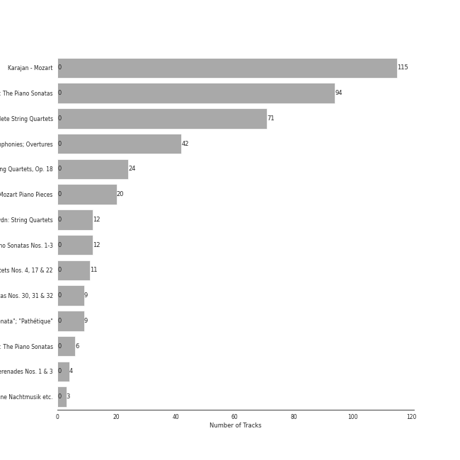

# classical era

432 songs

[See Track Features](audio_features.md)

[See Clusters](clusters/overview.md)

## Top Artists

| Art | Rank | Tracks | 💚 | Artist | 🔗 |
|:---|---:|---:|---:|:---|:---|
|  | 296 | 261 | 0 | [Ludwig van Beethoven](../../artists/ludwig_van_beethoven/overview.md) | [🔗](https://open.spotify.com/artist/2wOqMjp9TyABvtHdOSOTUS) |
|  | 434 | 159 | 0 | [Wolfgang Amadeus Mozart](../../artists/wolfgang_amadeus_mozart/overview.md) | [🔗](https://open.spotify.com/artist/4NJhFmfw43RLBLjQvxDuRS) |
|  | 434 | 157 | 0 | [Herbert von Karajan](../../artists/herbert_von_karajan/overview.md) | [🔗](https://open.spotify.com/artist/5zCaQxjl110XTrm4LQ1CxY) |
|  | 434 | 143 | 0 | [Berliner Philharmoniker](../../artists/berliner_philharmoniker/overview.md) | [🔗](https://open.spotify.com/artist/6uRJnvQ3f8whVnmeoecv5Z) |
|  | 155 | 103 | 0 | [Vladimir Ashkenazy](../../artists/vladimir_ashkenazy/overview.md) | [🔗](https://open.spotify.com/artist/20iZXzMb8LoWXOeca32i82) |
|  | 434 | 71 | 0 | [Tokyo String Quartet](../../artists/tokyo_string_quartet/overview.md) | [🔗](https://open.spotify.com/artist/15G9RnBNBDCFUMANna2CvO) |
|  | 142 | 35 | 0 | [Jerusalem Quartet](../../artists/jerusalem_quartet/overview.md) | [🔗](https://open.spotify.com/artist/7AnE8Jpu1vxLeXcs6OKYHE) |
|  | 434 | 21 | 0 | Mari Kodama | [🔗](https://open.spotify.com/artist/0s0wG03kPyu7MXERfcuxim) |
|  | 434 | 19 | 0 | Wiener Singverein | [🔗](https://open.spotify.com/artist/35QSympF887CO8h5eZHme2) |
|  | 434 | 14 | 0 | Wiener Philharmoniker | [🔗](https://open.spotify.com/artist/003f4bk13c6Q3gAUXv7dGJ) |

See all 58 artists

| Art | Rank | Tracks | 💚 | Artist | 🔗 |
|:---|---:|---:|---:|:---|:---|
|  | 434 | 13 | 0 | Anna Tomowa-Sintow | [🔗](https://open.spotify.com/artist/6NSIW1uEq8JZmxEkHMF17c) |
|  | 434 | 12 | 0 | Carmen Piazzini | [🔗](https://open.spotify.com/artist/6aQUOvrKLOquCAvIGdIwTx) |
|  | 434 | 12 | 0 | Joseph Haydn | [🔗](https://open.spotify.com/artist/656RXuyw7CE0dtjdPgjJV6) |
|  | 434 | 12 | 0 | The Amsterdam String Quartet | [🔗](https://open.spotify.com/artist/0kbgyaL9g2Eba79p2jiYlN) |
|  | 434 | 11 | 0 | Gerd Seifert | [🔗](https://open.spotify.com/artist/4aIYtx2Z5X9vRlysnruy66) |
|  | 434 | 8 | 0 | José van Dam | [🔗](https://open.spotify.com/artist/5qNUHMEhszyeXNYMn4sswd) |
|  | 434 | 7 | 0 | Agnes Baltsa | [🔗](https://open.spotify.com/artist/2amF56vDuTTbZJQsqUgbuC) |
|  | 434 | 6 | 0 | Anne-Sophie Mutter | [🔗](https://open.spotify.com/artist/6pzfUmBsQAKxOhy0NSi8zn) |
|  | 434 | 6 | 0 | András Schiff | [🔗](https://open.spotify.com/artist/24K6LTZFqBAvKsorwK0iXd) |
|  | 434 | 5 | 0 | Werner Krenn | [🔗](https://open.spotify.com/artist/3PuXD6h01YqjNWQ055CWxA) |
|  | 434 | 5 | 0 | Vinson Cole | [🔗](https://open.spotify.com/artist/2j6cP3f3TxyHzcKdWYSm6h) |
|  | 434 | 4 | 0 | Gottfried Hornik | [🔗](https://open.spotify.com/artist/6aFQ4LADfHVe08B5gQuE8X) |
|  | 434 | 4 | 0 | Cologne New Philharmonic Orchestra | [🔗](https://open.spotify.com/artist/4jSOT0xN5OKPgEfawfzInB) |
|  | 434 | 4 | 0 | Helga Muller-Molinari | [🔗](https://open.spotify.com/artist/3s5xNX5n6PAzpusMRhmHbA) |
|  | 434 | 4 | 0 | Manfred Klier | [🔗](https://open.spotify.com/artist/3KkpLfmwQob3Y75ePPdtse) |
|  | 434 | 4 | 0 | Mikhail Gantvarg | [🔗](https://open.spotify.com/artist/1SCRjxxRnRFsoctLKXIoZx) |
|  | 434 | 4 | 0 | Paata Burchuladze | [🔗](https://open.spotify.com/artist/1JzOJmq9kk0u7OWqzXkBcc) |
|  | 434 | 4 | 0 | Volker Hartung | [🔗](https://open.spotify.com/artist/19nzpbhd3Yv5PQXtWKZkhX) |
|  | 434 | 4 | 0 | The St. Petersburg Soloists | [🔗](https://open.spotify.com/artist/11K9yxwc8iVyEh0ya9v9XY) |
| | 434 | 3 | 0 | Ossip Schnirlin | [🔗](https://open.spotify.com/artist/7eI7DJSWlJy2W2337B9oTL) |
|  | 434 | 3 | 0 | Academy of St. Martin in the Fields | [🔗](https://open.spotify.com/artist/77CaCn32H4mOMQA7UElzfF) |
|  | 434 | 3 | 0 | Joseph Joachim | [🔗](https://open.spotify.com/artist/6QuJ4aZSRMebqwDXiJ3SuA) |
|  | 434 | 3 | 0 | Sir Neville Marriner | [🔗](https://open.spotify.com/artist/6NUhQz7eAEsZvjEHTKHux9) |
| | 434 | 3 | 0 | Sam Franko | [🔗](https://open.spotify.com/artist/3vkG71N5uQBzhzwEDr6icH) |
|  | 434 | 3 | 0 | Chor der Deutschen Oper Berlin | [🔗](https://open.spotify.com/artist/2KvV4gawnuMNG74DgSAQ0n) |
|  | 434 | 2 | 0 | Elisabeth Sombart | [🔗](https://open.spotify.com/artist/6pp4xqAWH1oHFQX0kJtVvO) |
|  | 434 | 2 | 0 | Roberte Mamou | [🔗](https://open.spotify.com/artist/6DsbdauTI2Fn2NN4B1EIUN) |
|  | 434 | 2 | 0 | Berliner Symphoniker | [🔗](https://open.spotify.com/artist/5pF76lplGIvEFGb8lI48hA) |
|  | 434 | 2 | 0 | Walter Hagen-Groll | [🔗](https://open.spotify.com/artist/5iMb1u0pxxzSPONrB4j0Zb) |
|  | 434 | 2 | 0 | Francisco Araiza | [🔗](https://open.spotify.com/artist/5M0cOgeTBOetAbsM4FDVDP) |
|  | 434 | 2 | 0 | Gerard Oskamp | [🔗](https://open.spotify.com/artist/4TWzdKT6XMuddLAoj6PgXi) |
|  | 434 | 2 | 0 | Munich Youth Orchestra | [🔗](https://open.spotify.com/artist/3jgBofW8eFrbtrsSbLy8Br) |
|  | 434 | 2 | 0 | Karin Ott | [🔗](https://open.spotify.com/artist/2sZHeIbU96txBewcnCJLj7) |
|  | 434 | 2 | 0 | Janet Perry | [🔗](https://open.spotify.com/artist/1bV3KjOPs1AI3OolJiYogN) |
|  | 434 | 2 | 0 | Edith Mathis | [🔗](https://open.spotify.com/artist/0eOythKkGSageuVFr6nDHf) |
| | 434 | 2 | 0 | Jordi Mora | [🔗](https://open.spotify.com/artist/0bE9Z0z4cxaixqTRU2O5BA) |
|  | 434 | 2 | 0 | Axel Gillison | [🔗](https://open.spotify.com/artist/05ukT24TP30K50Blikom8z) |
|  | 434 | 1 | 0 | Mostar Symphony Orchestra | [🔗](https://open.spotify.com/artist/70i7O3jytAajMDs0nV0Zbk) |
| | 434 | 1 | 0 | Wolfgang Bünten | [🔗](https://open.spotify.com/artist/6qZFjcGH1SfhbkrNfnzH7z) |
|  | 434 | 1 | 0 | Heinz Kruse | [🔗](https://open.spotify.com/artist/44kp24Y9MhmQ4RT64CUaV2) |
| | 434 | 1 | 0 | Tobias Pfulb | [🔗](https://open.spotify.com/artist/2GD6gK1wj1cD8TFGe2BpJC) |
| | 434 | 1 | 0 | Vestischen Chamber Orchestra | [🔗](https://open.spotify.com/artist/1m3ycS5catGCiLB0J5eKDG) |
|  | 434 | 1 | 0 | Helmut Froschauer | [🔗](https://open.spotify.com/artist/172Encqfd2ZhWAleNg1gbO) |
|  | 434 | 1 | 0 | Hanna Schwarz | [🔗](https://open.spotify.com/artist/0uzYuEP2MlAJ5FdVIYIalx) |
|  | 434 | 1 | 0 | Christian Schulz | [🔗](https://open.spotify.com/artist/0sqQ1nXbUwTWglq8jWopvZ) |
|  | 434 | 1 | 0 | Ilmar Lapinsch | [🔗](https://open.spotify.com/artist/0dI3iXIxXjAtMkzZCsOVEg) |
|  | 434 | 1 | 0 | Ratko Delorko | [🔗](https://open.spotify.com/artist/0E1sM06TDvSpGqNQBx8FV0) |
|  | 434 | 1 | 0 | Gints Berzins | [🔗](https://open.spotify.com/artist/0CqCB3JQz4h9k3qk74ihWT) |

## Most and least listened tracks
| Rank | ​ | Most listened tracks | Rank | ​​ | Least listened tracks |
|---:|:---|:---|---:|:---|:---|
| 566 |  | [String Quartet No. 3 in D Major, Op. 18: I. Allegro](../../artists/ludwig_van_beethoven/overview.md) | 1015 |  | [String Quartet No. 4 in C Minor, Op. 18 No. 4: I. Allegro ma non tanto](../../artists/ludwig_van_beethoven/overview.md) |
| 1015 |  | [Piano Sonata No. 12 in F Major, K. 332: II. Adagio](../../artists/wolfgang_amadeus_mozart/overview.md) | 1015 |  | [String Quartet No. 15 in A minor, Op. 132: I. Assai sostenuto - Allegro](../../artists/ludwig_van_beethoven/overview.md) |
| 1015 |  | [Die Zauberflöte, K. 620, Act II: No. 10, O Isis und Osiris](../../artists/wolfgang_amadeus_mozart/overview.md) | 1015 |  | [Die Zauberflöte, K. 620, Act II: No. 21, Finale: i. Die Strahlen der Sonne – Heil sei euch](../../artists/wolfgang_amadeus_mozart/overview.md) |
| 1015 |  | [Divertimento in D Major, K. 334 (Orch. Perf.): IV. Adagio - Recorded 1965](../../artists/wolfgang_amadeus_mozart/overview.md) | 1015 |  | [String Quartet No. 2 in G Major, Op. 18, No. 2: II. Adagio cantabile - Allegro](../../artists/ludwig_van_beethoven/overview.md) |
| 1015 |  | [Piano Concerto No. 27 in B-Flat Major, K. 595: II. Larghetto](../../artists/wolfgang_amadeus_mozart/overview.md) | 1015 |  | [Divertimento in B-Flat Major, K. 287 (Orch. Perf.): VI. Andante – Allegro molto - Recorded 1965](../../artists/wolfgang_amadeus_mozart/overview.md) |
| 1015 |  | [Piano Sonata No. 18 in E flat, Op. 31 No. 3 -"The Hunt": 1. Allegro](../../artists/ludwig_van_beethoven/overview.md) | 1015 |  | [Piano Sonata No. 14 in C-Sharp Minor, Op. 27 No. 2 "Moonlight": I. Adagio sostenuto](../../artists/ludwig_van_beethoven/overview.md) |
| 1015 |  | [Piano Sonata No. 31 in A flat, Op. 110: 3. Adagio ma non troppo](../../artists/ludwig_van_beethoven/overview.md) | 1015 |  | [Requiem, K. 626: V. Sanctus](../../artists/wolfgang_amadeus_mozart/overview.md) |
| 1015 |  | [Requiem, K. 626: IIId. Recordare](../../artists/wolfgang_amadeus_mozart/overview.md) | 1015 |  | [Requiem, K. 626: IVa. Domine Jesu](../../artists/wolfgang_amadeus_mozart/overview.md) |
| 1015 |  | [Piano Sonata No. 11 in B flat, Op. 22: 4. Rondo (Allegretto)](../../artists/ludwig_van_beethoven/overview.md) | 1015 |  | [Piano Sonata No. 20 in G, Op. 49 No. 2: 1. Allegro ma non troppo](../../artists/ludwig_van_beethoven/overview.md) |
| 1015 |  | [Symphony No. 7 in A Major, Op. 92: II. Allegretto](../../artists/ludwig_van_beethoven/overview.md) | 1015 |  | [Piano Sonata No. 30 in E Major, Op. 109: III. Gesangvoll, mit innigster Empfindung. Andante molto cantabile ed espressivo](../../artists/ludwig_van_beethoven/overview.md) |

## Top Albums

| Art | Rank | Tracks | 💚 | Album | Release Date | 🔗 |
|:---|---:|---:|---:|:---|:---|:---|
|  | 665 | 115 | 0 | Karajan - Mozart | 2020-06-16 | [🔗](https://open.spotify.com/album/1HSJhsMIW2EDD4YSSkbc9e) |
|  | 665 | 94 | 0 | Beethoven: The Piano Sonatas | 1995-01-01 | [🔗](https://open.spotify.com/album/7xbsSOswKgms1fUFuwKArz) |
|  | 665 | 71 | 0 | Beethoven: Complete String Quartets | 2010-10-12 | [🔗](https://open.spotify.com/album/4JhUG1lr4xztAcqyA0Jm3a) |
|  | 665 | 42 | 0 | Beethoven: 9 Symphonies; Overtures | 1993-01-01 | [🔗](https://open.spotify.com/album/2DQTNTznsteIZciZdyeWdj) |
|  | 386 | 24 | 0 | Beethoven: String Quartets, Op. 18 | 2015-08-31 | [🔗](https://open.spotify.com/album/37iUq5Dekt8uP5itTiVs2Q) |
|  | 665 | 20 | 0 | Mozart Piano Pieces | 2020-10-13 | [🔗](https://open.spotify.com/album/3AYEvo7R1gY4O5xJuMwy3U) |
|  | 665 | 12 | 0 | Haydn: String Quartets | 2008-01-01 | [🔗](https://open.spotify.com/album/1rNGG2I3AKJy9FWqUiitkc) |
|  | 665 | 12 | 0 | Beethoven: Piano Sonatas Nos. 1-3 | 2008-01-01 | [🔗](https://open.spotify.com/album/5CjMjZJnjdHHgwAVkqrvXq) |
|  | 665 | 11 | 0 | Mozart: String Quartets Nos. 4, 17 & 22 | 2011-02-22 | [🔗](https://open.spotify.com/album/1PxALR0DTaTJPL6ByBK266) |
|  | 665 | 9 | 0 | Beethoven: Piano Sonatas Nos. 30, 31 & 32 | 2012-03-06 | [🔗](https://open.spotify.com/album/478l1JdqbqDzcmmgrqw2zu) |

See all 14 albums

| Art | Rank | Tracks | 💚 | Album | Release Date | 🔗 |
|:---|---:|---:|---:|:---|:---|:---|
|  | 665 | 9 | 0 | Beethoven: Piano Sonatas "Moonlight"; "Appassionata"; "Pathétique" | 1983-01-01 | [🔗](https://open.spotify.com/album/0RCfE1YhkdrjnM3kXT3YLl) |
|  | 665 | 6 | 0 | Mozart: The Piano Sonatas | 1981-01-01 | [🔗](https://open.spotify.com/album/1qM2Z3rhkJLQIXnAQpIUdY) |
|  | 665 | 4 | 0 | Mozart: Symphony No. 40 in G Minor, Bassoon Concerto & Flute Serenades Nos. 1 & 3 | 2017-12-08 | [🔗](https://open.spotify.com/album/3WHqaCZ66SWzL7LyYnrn9y) |
|  | 665 | 3 | 0 | Mozart: Eine Kleine Nachtmusik etc. | 1986 | [🔗](https://open.spotify.com/album/5YCuibCDJrkVcS3UOAYqr9) |

## Top Record Labels

| Tracks | 💚 | Label |
|---:|---:|:---|
| 115 | 0 | [UME - Global Clearing House](../../labels/ume_-_global_clearing_house/overview.md) |
| 109 | 0 | [Decca Music Group Ltd.](../../labels/decca_music_group_ltd_/overview.md) |
| 106 | 0 | [harmonia mundi](../../labels/harmonia_mundi/overview.md) |
| 42 | 0 | [Deutsche Grammophon (DG)](../../labels/deutsche_grammophon_(dg)/overview.md) |
| 21 | 0 | [PENTATONE](../../labels/pentatone/overview.md) |
| 20 | 0 | [Warner Music Group - X5 Music Group](../../labels/warner_music_group_-_x5_music_group/overview.md) |
| 12 | 0 | [Channel Classics Records](../../labels/channel_classics_records/overview.md) |
| 4 | 0 | JPK Musik |
| 3 | 0 | [Warner Classics](../../labels/warner_classics/overview.md) |

## Years

| ​ | 10 newest albums | ​​ | 10 oldest albums |
|:---|:---|:---|:---|
|  | Mozart Piano Pieces (2020-10-13) |  | Mozart: The Piano Sonatas (1981-01-01) |
|  | Karajan - Mozart (2020-06-16) |  | Beethoven: Piano Sonatas "Moonlight"; "Appassionata"; "Pathétique" (1983-01-01) |
|  | Mozart: Symphony No. 40 in G Minor, Bassoon Concerto & Flute Serenades Nos. 1 & 3 (2017-12-08) |  | Mozart: Eine Kleine Nachtmusik etc. (1986) |
|  | Beethoven: String Quartets, Op. 18 (2015-08-31) |  | Beethoven: 9 Symphonies; Overtures (1993-01-01) |
|  | Beethoven: Piano Sonatas Nos. 30, 31 & 32 (2012-03-06) |  | Beethoven: The Piano Sonatas (1995-01-01) |
|  | Mozart: String Quartets Nos. 4, 17 & 22 (2011-02-22) |  | Haydn: String Quartets (2008-01-01) |
|  | Beethoven: Complete String Quartets (2010-10-12) |  | Beethoven: Piano Sonatas Nos. 1-3 (2008-01-01) |
|  | Haydn: String Quartets (2008-01-01) |  | Beethoven: Complete String Quartets (2010-10-12) |
|  | Beethoven: Piano Sonatas Nos. 1-3 (2008-01-01) |  | Mozart: String Quartets Nos. 4, 17 & 22 (2011-02-22) |
|  | Beethoven: The Piano Sonatas (1995-01-01) |  | Beethoven: Piano Sonatas Nos. 30, 31 & 32 (2012-03-06) |

