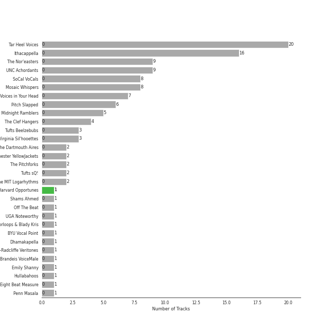
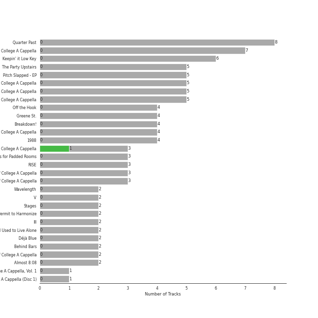

# college a cappella

[118 songs](college_a_cappella_tracks.md)

## Top Artists

See all 34 artists

|   Number of Tracks | Art                                                                                              | Artist                                           | 🔗                                                           |
|-------------------:|:-------------------------------------------------------------------------------------------------|:-------------------------------------------------|:------------------------------------------------------------|
|                 20 |  | [Tar Heel Voices](../artists/tar_heel_voices.md) | [🔗](https://open.spotify.com/artist/1apO6pJsV1nwuF2K8sEsDo) |
|                 16 |  | [Ithacappella](../artists/ithacappella.md)       | [🔗](https://open.spotify.com/artist/5bPTIGQvxRNjr6wl9yyAct) |
|                  9 |  | The Nor'easters                                  | [🔗](https://open.spotify.com/artist/1aLfVgwt8eBrpvHcutWmqe) |
|                  9 |  | UNC Achordants                                   | [🔗](https://open.spotify.com/artist/1TzZMeOCs4TMYtzgohPMAr) |
|                  8 |  | Mosaic Whispers                                  | [🔗](https://open.spotify.com/artist/0fP33MCfVUaPivyFYLZtoh) |
|                  7 |  | SoCal VoCals                                     | [🔗](https://open.spotify.com/artist/5L30XpwHG77eWCZtelTns9) |
|                  6 |  | Pitch Slapped                                    | [🔗](https://open.spotify.com/artist/7EH7jldX62OIsU1yU1SWE7) |
|                  6 |  | Voices in Your Head                              | [🔗](https://open.spotify.com/artist/44v8JgDySt9tkgfV3AWxBJ) |
|                  5 |  | University of Rochester Midnight Ramblers        | [🔗](https://open.spotify.com/artist/2Tv49uvEsNJXUpuFL7HuKu) |
|                  4 |  | The Clef Hangers                                 | [🔗](https://open.spotify.com/artist/5wUTXZIMX0mn6MzFA13qfO) |
|                  3 |  | Tufts Beelzebubs                                 | [🔗](https://open.spotify.com/artist/4VsNVAxuPxZrJMWE2Tprtq) |
|                  2 |  | The Dartmouth Aires                              | [🔗](https://open.spotify.com/artist/71Cez1b1NqsxIn5u8XNiQD) |
|                  2 |  | University of Rochester YellowJackets            | [🔗](https://open.spotify.com/artist/5PdBpsZXvnEbbTe1589fMO) |
|                  2 |  | The Pitchforks                                   | [🔗](https://open.spotify.com/artist/5IPABE7EhPLvUVsgM3dlZ8) |
|                  2 |  | Tufts sQ!                                        | [🔗](https://open.spotify.com/artist/21QIHECpmN2KwhpVhIWHpT) |
|                  2 |  | The MIT Logarhythms                              | [🔗](https://open.spotify.com/artist/1jz5HCLwsDkpBYz80n9wbR) |
|                  2 |  | The Virginia Sil'hooettes                        | [🔗](https://open.spotify.com/artist/0LKgClZwZKGhM5BkCzjfMX) |
|                  1 |                                                               | Shams Ahmed                                      | [🔗](https://open.spotify.com/artist/7rIkgg1ozqQIezA7c8Khf4) |
|                  1 |  | Off The Beat                                     | [🔗](https://open.spotify.com/artist/7aCUqnLkFEQd2FPL6RK1tW) |
|                  1 |  | UGA Noteworthy                                   | [🔗](https://open.spotify.com/artist/6MyHz1OaVtj1w2y6JTu2u5) |
|                  1 |                                                               | Roxorloops & Blady Kris                          | [🔗](https://open.spotify.com/artist/6HRJOlHBoo07WcZdXZAADI) |
|                  1 |  | BYU Vocal Point                                  | [🔗](https://open.spotify.com/artist/5zhxxb24WP6q6rbLHAn2UQ) |
|                  1 |  | The Harvard-Radcliffe Veritones                  | [🔗](https://open.spotify.com/artist/4Zjdnr698SzQDAPMx4oxy0) |
|                  1 |  | Brandeis VoiceMale                               | [🔗](https://open.spotify.com/artist/4DsnXPBijq5tMq5zAEfF1L) |
|                  1 |                                                               | Emily Shanny                                     | [🔗](https://open.spotify.com/artist/3oWiUIUDPWJmvB8wElpaO5) |
|                  1 |  | Hullabahoos                                      | [🔗](https://open.spotify.com/artist/3S1DEHnGNfWmamdZEyLs8I) |
|                  1 |  | Eight Beat Measure                               | [🔗](https://open.spotify.com/artist/3My1YRLewqqDXME2OkBpdZ) |
|                  1 |  | Penn Masala                                      | [🔗](https://open.spotify.com/artist/2MhJb1ljKttJewuYZTpXxr) |
|                  1 |                                                               | Beejul Khatri                                    | [🔗](https://open.spotify.com/artist/24SlCPf92d5VTzhI0ztENn) |
|                  1 |  | Tufts Jackson Jills                              | [🔗](https://open.spotify.com/artist/1dUJZ0lbobmanl4W14h0a2) |
|                  1 |  | Academical Village People                        | [🔗](https://open.spotify.com/artist/1Vjug1h4HXCeplbouQEbV3) |
|                  1 |  | The Virginia Gentlemen                           | [🔗](https://open.spotify.com/artist/0steWfkS4hwaErh84SlHMW) |
|                  1 |  | The Bostonians                                   | [🔗](https://open.spotify.com/artist/0gW6hG0g7pVNbHgvmYwHDl) |
|                  1 |  | The Buffalo Chips                                | [🔗](https://open.spotify.com/artist/0IAZ8PiZ0KqdMd191HDJ8t) |

## Top Albums

See all 47 albums

|   Number of Tracks | Art                                                                                              | Album                                        | 🔗                                                          |
|-------------------:|:-------------------------------------------------------------------------------------------------|:---------------------------------------------|:-----------------------------------------------------------|
|                  8 |  | Quarter Past                                 | [🔗](https://open.spotify.com/album/1pScBPjmT5w3s0BTgkdgJy) |
|                  7 |  | BOCA 2015: Best Of College A Cappella        | [🔗](https://open.spotify.com/album/0gyhBvJs1GiI31cMMmKLnK) |
|                  6 |  | Keepin' it Low Key                           | [🔗](https://open.spotify.com/album/4EmdqB8w7gEONRX5QLypQZ) |
|                  5 |  | The Party Upstairs                           | [🔗](https://open.spotify.com/album/2AIAKP2FxbYNjmwQgAkqZz) |
|                  5 |  | Pitch Slapped - EP                           | [🔗](https://open.spotify.com/album/5I08qbUSg8f48kenQs7Tg6) |
|                  5 |  | BOCA 2010: Best Of College A Cappella        | [🔗](https://open.spotify.com/album/3HSd3voAxPxS50UrfInBVJ) |
|                  5 |  | BOCA 2009: Best Of College A Cappella        | [🔗](https://open.spotify.com/album/50WaSkL4pVvz9Crsca7oNV) |
|                  5 |  | BOCA 2008: Best Of College A Cappella        | [🔗](https://open.spotify.com/album/4Z0ju0i47UZ2Y4icq2f3wZ) |
|                  4 |  | Off the Hook                                 | [🔗](https://open.spotify.com/album/1wfYTTpHsGxvIjDwsPLAAC) |
|                  4 |  | Greene St.                                   | [🔗](https://open.spotify.com/album/3qJMqi0VzTFGSDTTMUI5n7) |
|                  4 |  | Breakdown!                                   | [🔗](https://open.spotify.com/album/7u7dNsbxjcxVoffJELqtCV) |
|                  4 |  | BOCA 2014: Best Of College A Cappella        | [🔗](https://open.spotify.com/album/7rZoAMtoZ8s5mLIlUTWgVT) |
|                  4 |  | 1988                                         | [🔗](https://open.spotify.com/album/6nktHqHKPt8kT4ozUJvwrs) |
|                  3 |  | Songs for Padded Rooms                       | [🔗](https://open.spotify.com/album/0h3bmbpSuD01ha1k52E1uz) |
|                  3 |  | RISE                                         | [🔗](https://open.spotify.com/album/6V8819n4bdv7dA5mFdCIAo) |
|                  3 |  | BOCA 2013: Best of College A Cappella        | [🔗](https://open.spotify.com/album/6Pqey2mc4EWSfYNH3bifbO) |
|                  3 |  | BOCA 2012: Best Of College A Cappella        | [🔗](https://open.spotify.com/album/26eCHp86K2xLQj0B7Cr8he) |
|                  2 |  | Wavelength                                   | [🔗](https://open.spotify.com/album/56RyapLbZ4DESHfzD87X7F) |
|                  2 |  | V                                            | [🔗](https://open.spotify.com/album/7wPsYBhUlqtAgPr2hbbmP3) |
|                  2 |  | Stages                                       | [🔗](https://open.spotify.com/album/3mnYoDcAHKx6uA91f7rtAa) |
|                  2 |  | Permit to Harmonize                          | [🔗](https://open.spotify.com/album/4aHUBNFRDR1DzCO8GULLTD) |
|                  2 |  | III                                          | [🔗](https://open.spotify.com/album/3iFvXj07Frbs54rK9CzCIo) |
|                  2 |  | I Used to Live Alone                         | [🔗](https://open.spotify.com/album/0AmRRsaQVm5noeAB6LF8yA) |
|                  2 |  | Déjà Blue                                    | [🔗](https://open.spotify.com/album/1mZNLR8qY6GhhrnCmtEAv3) |
|                  2 |  | Behind Bars                                  | [🔗](https://open.spotify.com/album/40g8iY5VB5sTJ31943mAzQ) |
|                  2 |  | BOCA 2011: Best Of College A Cappella        | [🔗](https://open.spotify.com/album/27d96rqnXRtmrGBGHJzPBh) |
|                  2 |  | Almost 8:08                                  | [🔗](https://open.spotify.com/album/1gbG9XfNmlfNGEnOTH0f6N) |
|                  1 |  | Voices Only 2013 College A Cappella, Vol. 1  | [🔗](https://open.spotify.com/album/6zr4GyBIMy2GRvIGPflYaK) |
|                  1 |  | Voices Only 2009 College A Cappella (Disc 1) | [🔗](https://open.spotify.com/album/20PLlTE6r1hsQrmyhUW7oB) |
|                  1 |  | VoCabulary                                   | [🔗](https://open.spotify.com/album/6QTtvpKN8GebVCKsx8YRmJ) |
|                  1 |  | Unbound                                      | [🔗](https://open.spotify.com/album/5KqLmDu7Lui1qqdnItWDUs) |
|                  1 |  | The Mallard                                  | [🔗](https://open.spotify.com/album/2IV5LQ4DzCjAIVwYZMHYgo) |
|                  1 |  | Storming The Castle                          | [🔗](https://open.spotify.com/album/1wjibXmmViZMNA1HsMo7f6) |
|                  1 |  | Oasis                                        | [🔗](https://open.spotify.com/album/1VpHqAIW8Pu343GJa0UpRQ) |
|                  1 |  | Ignite                                       | [🔗](https://open.spotify.com/album/5O7GFH7FfXuuDlOfNH76Qq) |
|                  1 |  | ICCA 2016: The Extended Cuts                 | [🔗](https://open.spotify.com/album/07xYpylAQHOJoHStqUpKwp) |
|                  1 |  | House Rules                                  | [🔗](https://open.spotify.com/album/1fHxE6WZL6ouusBW4h9nE4) |
|                  1 |  | High Stakes Old Maid                         | [🔗](https://open.spotify.com/album/6sg9WsK06H588Y5VOmwj37) |
|                  1 |  | Fixate                                       | [🔗](https://open.spotify.com/album/2wDs6jkrCEPBJLnLLFWt7J) |
|                  1 |  | Equilibrium                                  | [🔗](https://open.spotify.com/album/6BeTGjWVDQLQhdSM5MBziy) |
|                  1 |  | Disturbia                                    | [🔗](https://open.spotify.com/album/3ypmasyBX16BmWt52owYaN) |
|                  1 |  | Defrosted                                    | [🔗](https://open.spotify.com/album/3DLNakCGffrhPaaj9rfepk) |
|                  1 |  | Best of BOCA: The First 20 Years             | [🔗](https://open.spotify.com/album/5bcLIouxn2oBiGvf4vvO6u) |
|                  1 |  | Before You Go                                | [🔗](https://open.spotify.com/album/00x5MddnbpBoWJWtubLhHH) |
|                  1 |  | BOCA 2016: Best Of College A Cappella        | [🔗](https://open.spotify.com/album/2AOr4esohQurJGXklhRH1a) |
|                  1 |  | Against the Grain                            | [🔗](https://open.spotify.com/album/27W6ijbmL6QPNrdQGncwDJ) |
|                  1 |  | A Swing and a Miss                           | [🔗](https://open.spotify.com/album/0qj5ECfme87sP5anevwf81) |

## Top Record Labels

See all 13 labels

|   Number of Tracks | Label                                                 |
|-------------------:|:------------------------------------------------------|
|                 36 | [Varsity Vocals](../labels/varsity_vocals.md)         |
|                 29 | [A Cappella Records](../labels/a_cappella_records.md) |
|                 12 | [Ithacappella](../labels/ithacappella.md)             |
|                  8 | UNC Achordants                                        |
|                  8 | Mosaic Whispers                                       |
|                  6 | Tar Heel Voices                                       |
|                  4 | The Nor'easters                                       |
|                  4 | 649668 Records DK2                                    |
|                  3 | The SoCal VoCals                                      |
|                  2 | Voices Only A Cappella                                |
|                  2 | The University of Rochester Midnight Ramblers         |
|                  2 | The Clef Hangers                                      |
|                  2 | SoCal VoCals                                          |

## Audio Features

| 10 most Danceable tracks         | 10 least Danceable tracks   |
|:---------------------------------|:----------------------------|
| Problem                          | Paranoid Android            |
| La Camisa Negra                  | White Flag                  |
| Toxic                            | Alive                       |
| Telephone                        | Stay                        |
| Waka Waka (This Time for Africa) | Fix You                     |
| Machine Gun                      | The Sound of Silence        |
| They                             | The Man Who Can't Be Moved  |
| Work Song                        | Wait It Out                 |
| Eine kleine Nachtmusik           | Falling Slowly              |
| Domino                           | We Found Love               |

| 10 most Energetic tracks                  | 10 least Energetic tracks   |
|:------------------------------------------|:----------------------------|
| Misery Business                           | Chandelier                  |
| Don't Stop Me Now                         | Honeybee                    |
| Russian Roulette                          | Say Something               |
| Telephone                                 | Poison & Wine               |
| Finesse - Remix                           | Demons                      |
| Don't Stop Believin'                      | Phoenix                     |
| Bang Bang                                 | Pure Imagination            |
| Too Close (feat. Roxorloops & Blady Kris) | Say Something               |
| Brand New Jones                           | The Sound of Silence        |
| Manwa Laage                               | Woods                       |

| 10 most Speechy tracks                    | 10 least Speechy tracks   |
|:------------------------------------------|:--------------------------|
| Don't Stop Me Now                         | All of Me                 |
| I'd Like To                               | We All Need Saving        |
| Cry Me a River                            | She Used to Be Mine       |
| Movin' On                                 | White Flag                |
| Waka Waka (This Time for Africa)          | Falling Slowly            |
| Too Close (feat. Roxorloops & Blady Kris) | Demons                    |
| Brand New Jones                           | We All Need Saving        |
| I Write Sins Not Tragedies                | Machine Gun               |
| Talk Dirty                                | Samson                    |
| Tightrope                                 | We Found Love             |

| 10 most Acoustic tracks   | 10 least Acoustic tracks   |
|:--------------------------|:---------------------------|
| Demons                    | Set Fire To The Rain       |
| Woods                     | Telephone                  |
| Big Yellow Taxi           | Sweater Weather            |
| Say Something             | Blown Away                 |
| We All Need Saving        | Don't You Worry Child      |
| The Sound of Silence      | Crazy In Love              |
| All of Me                 | Counting Stars             |
| She Used to Be Mine       | Problem                    |
| We Found Love             | Talk Dirty                 |
| Landslide                 | Domino                     |

| 10 most Instrumental tracks   | 10 least Instrumental tracks   |
|:------------------------------|:-------------------------------|
| Eine kleine Nachtmusik        | Can't Take My Eyes Off You     |
| Here (In Your Arms)           | Counting Stars                 |
| Falling Slowly                | I Write Sins Not Tragedies     |
| Home                          | Only the Good Die Young        |
| Demons                        | If I Ain't Got You             |
| Don't You Worry Child         | Somebody to Love               |
| Easy                          | Bird Set Free                  |
| Samson                        | She Used to Be Mine            |
| We Found Love                 | Apologize                      |
| Toxic                         | Domino                         |

| 10 most Live tracks   | 10 least Live tracks       |
|:----------------------|:---------------------------|
| Brand New Jones       | Problem                    |
| I'd Like To           | La Camisa Negra            |
| Smooth                | Say Something              |
| Talk Dirty            | There Goes My Baby         |
| Disturbia             | There Goes My Baby         |
| Wayfaring Stranger    | Demons                     |
| Elastic Heart         | I Write Sins Not Tragedies |
| That's What You Get   | Russian Roulette           |
| Alive                 | Africa                     |
| Telephone             | Paranoid Android           |

| 10 most Happy tracks             | 10 least Happy tracks   |
|:---------------------------------|:------------------------|
| Big Yellow Taxi                  | I Won't Give Up         |
| I Want You Back                  | Woods                   |
| Domino                           | Say Something           |
| Smooth                           | Poison & Wine           |
| Toxic                            | Falling Slowly          |
| I'd Like To                      | Wait It Out             |
| La Camisa Negra                  | She Used to Be Mine     |
| Waka Waka (This Time for Africa) | We Found Love           |
| Bang Bang                        | Phoenix                 |
| Brand New Jones                  | The Sound of Silence    |
