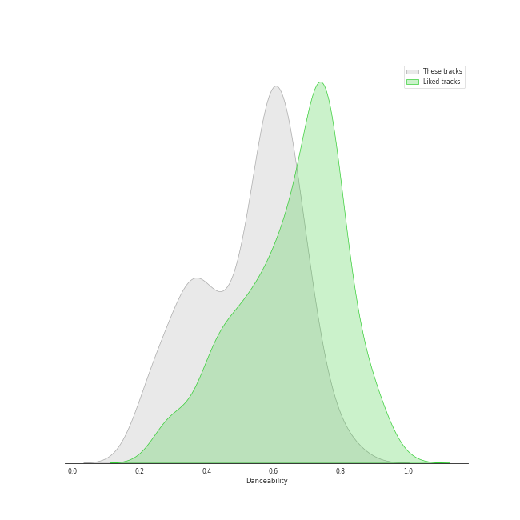
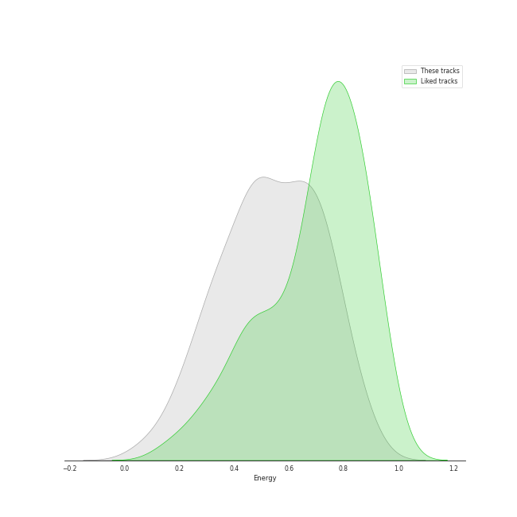
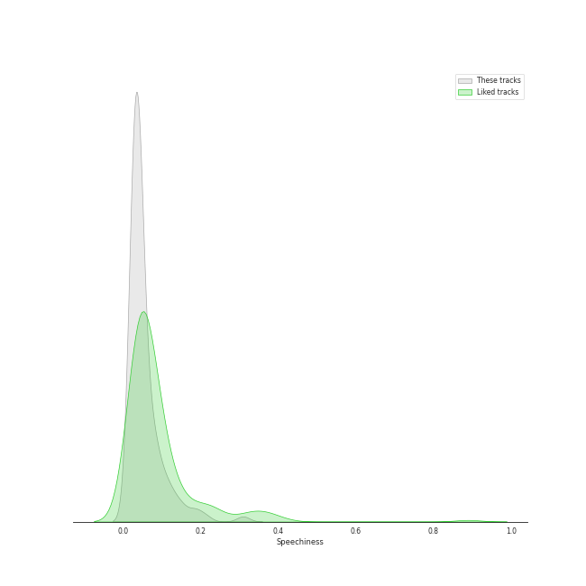
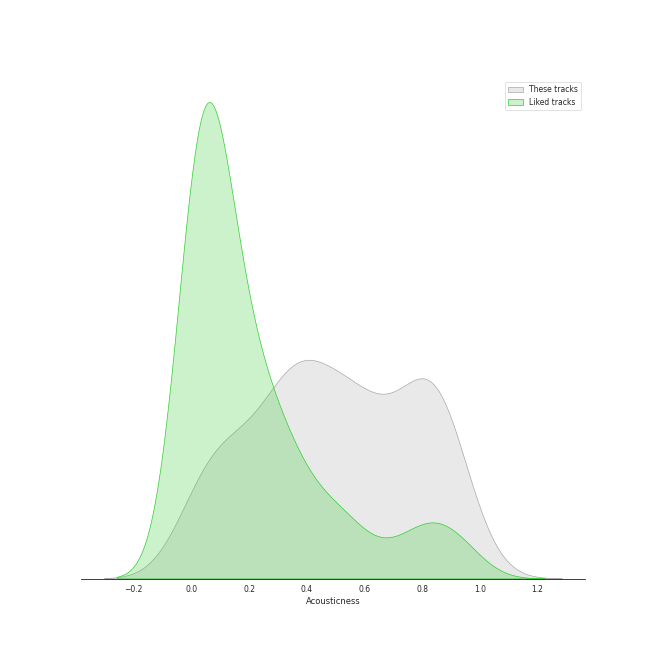
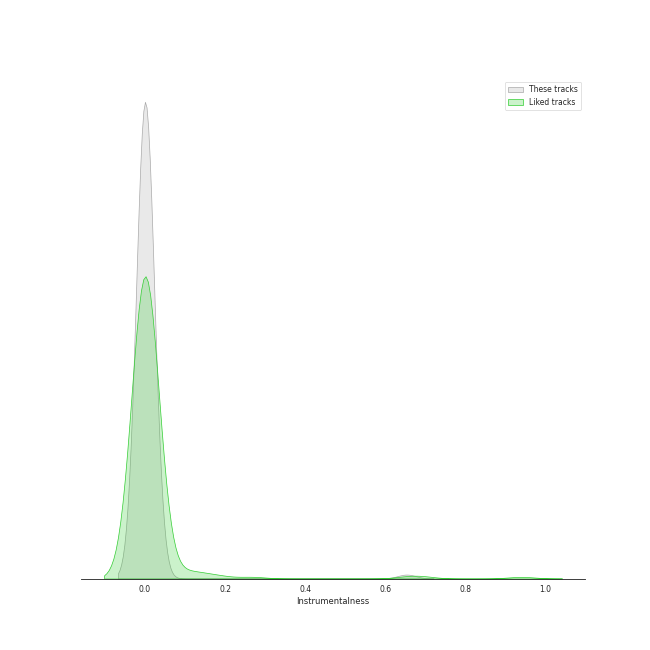
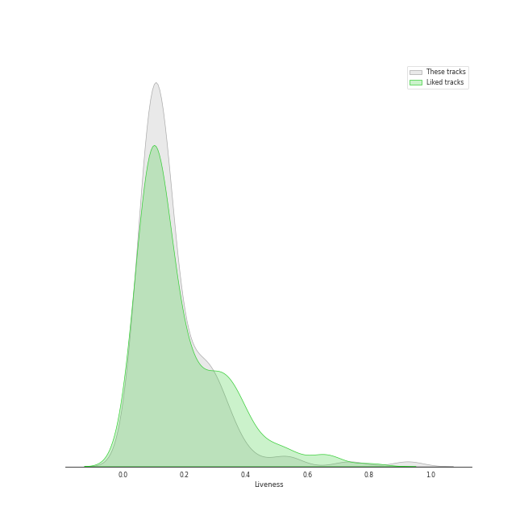
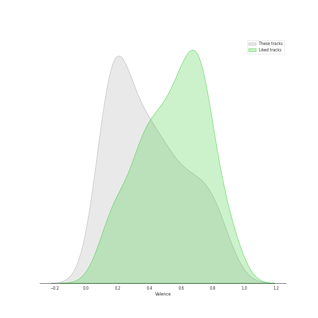
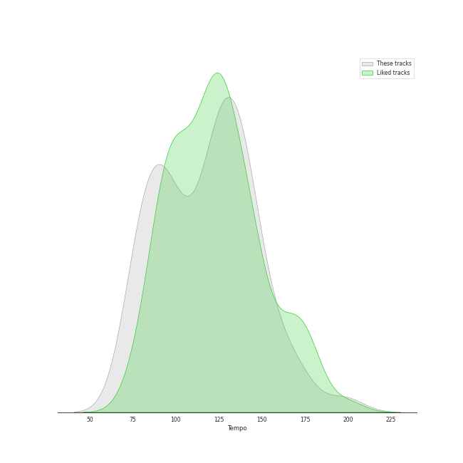

# Track Features for college a cappella

## Danceability

| ​ | 10 most Danceable tracks | ​​ | 10 least Danceable tracks |
|:---|:---|:---|:---|
|  | Problem (0.834) |  | We Found Love (0.203) |
|  | La Camisa Negra (0.812) |  | Falling Slowly (0.218) |
|  | Toxic (0.764) |  | Wait It Out (0.227) |
|  | Telephone (0.756) |  | The Man Who Can't Be Moved (0.231) |
|  | Waka Waka (This Time for Africa) (0.725) |  | The Sound of Silence (0.235) |
|  | Machine Gun (0.718) |  | Fix You (0.247) |
|  | They (0.717) |  | Stay (0.248) |
|  | Work Song (0.713) |  | Alive (0.258) |
|  | Eine kleine Nachtmusik (0.706) |  | White Flag (0.27) |
|  | Domino (0.704) |  | Paranoid Android (0.273) |

## Energy

| ​ | 10 most Energetic tracks | ​​ | 10 least Energetic tracks |
|:---|:---|:---|:---|
|  | Misery Business (0.888) |  | Woods (0.0582) |
|  | Don't Stop Me Now (0.883) |  | The Sound of Silence (0.115) |
|  | Russian Roulette (0.866) |  | Now I'm Listening (0.136) |
|  | Zak and Sara (0.856) |  | Say Something (0.152) |
|  | Telephone (0.832) |  | Pure Imagination (0.194) |
|  | Finesse - Remix (0.83) |  | Phoenix (0.206) |
|  | Bang Bang (0.809) |  | Demons (0.21) |
|  | Don't Stop Believin' (0.809) |  | Poison & Wine (0.219) |
|  | Too Close (feat. Roxorloops & Blady Kris) (0.804) |  | Say Something (0.236) |
|  | Brand New Jones (0.799) |  | Honeybee (0.243) |

## Speechiness

| ​ | 10 most Speechy tracks | ​​ | 10 least Speechy tracks |
|:---|:---|:---|:---|
|  | Don't Stop Me Now (0.31) |  | We Found Love (0.0244) |
|  | I'd Like To (0.213) |  | Samson (0.0256) |
|  | Cry Me a River (0.19) |  | Machine Gun (0.0264) |
|  | Movin' On (0.183) |  | We All Need Saving (0.0273) |
|  | Waka Waka (This Time for Africa) (0.161) |  | Demons (0.0276) |
|  | Too Close (feat. Roxorloops & Blady Kris) (0.146) |  | Stand (0.0278) |
|  | Brand New Jones (0.145) |  | Falling Slowly (0.0284) |
|  | I Write Sins Not Tragedies (0.133) |  | White Flag (0.0285) |
|  | Talk Dirty (0.123) |  | She Used to Be Mine (0.0288) |
|  | Tightrope (0.118) |  | We All Need Saving (0.0289) |

## Acousticness

| ​ | 10 most Acoustic tracks | ​​ | 10 least Acoustic tracks |
|:---|:---|:---|:---|
|  | Demons (0.972) |  | Domino (0.0113) |
|  | Woods (0.942) |  | Honeymoon Avenue (0.0169) |
|  | Big Yellow Taxi (0.936) |  | Talk Dirty (0.017) |
|  | Say Something (0.895) |  | Problem (0.0204) |
|  | We All Need Saving (0.888) |  | Counting Stars (0.0311) |
|  | The Sound of Silence (0.887) |  | Holding Out for a Hero (0.0379) |
|  | All of Me (0.884) |  | Crazy In Love (0.0437) |
|  | She Used to Be Mine (0.883) |  | Don't You Worry Child (0.0603) |
|  | We Found Love (0.872) |  | Blown Away (0.0614) |
|  | Landslide (0.867) |  | Sweater Weather (0.0751) |

## Instrumentalness

| ​ | 10 most Instrumental tracks | ​​ | 10 least Instrumental tracks |
|:---|:---|:---|:---|
|  | Eine kleine Nachtmusik (0.653) |  | Say Something (0.0) |
|  | Here (In Your Arms) (0.0273) |  | Brand New Jones (0.0) |
|  | Falling Slowly (0.019) |  | Closer (0.0) |
|  | Home (0.00371) |  | Without Your Love (0.0) |
|  | Demons (0.000816) |  | Phoenix (0.0) |
|  | Don't You Worry Child (0.000568) |  | Apologize (0.0) |
|  | Zak and Sara (0.000239) |  | Isn't She Lovely (0.0) |
|  | Easy (0.000198) |  | Radioactive Love (0.0) |
|  | Samson (0.000183) |  | We All Need Saving (0.0) |
|  | We Found Love (0.000108) |  | Sincerely, Jane (0.0) |

## Liveness

| ​ | 10 most Live tracks | ​​ | 10 least Live tracks |
|:---|:---|:---|:---|
|  | Brand New Jones (0.926) |  | Paranoid Android (0.0416) |
|  | I'd Like To (0.738) |  | Africa (0.0464) |
|  | Smooth (0.534) |  | Russian Roulette (0.0472) |
|  | Talk Dirty (0.53) |  | I Write Sins Not Tragedies (0.0582) |
|  | Disturbia (0.429) |  | Demons (0.0651) |
|  | Wayfaring Stranger (0.36) |  | There Goes My Baby (0.0673) |
|  | Elastic Heart (0.36) |  | There Goes My Baby (0.0677) |
|  | That's What You Get (0.354) |  | Say Something (0.0705) |
|  | Alive (0.339) |  | La Camisa Negra (0.0708) |
|  | Holding Out for a Hero (0.323) |  | Problem (0.0711) |

## Valence

| ​ | 10 most Happy tracks | ​​ | 10 least Happy tracks |
|:---|:---|:---|:---|
|  | Big Yellow Taxi (0.924) |  | The Sound of Silence (0.0476) |
|  | I Want You Back (0.91) |  | Phoenix (0.0658) |
|  | Domino (0.86) |  | We Found Love (0.0814) |
|  | Smooth (0.851) |  | She Used to Be Mine (0.0971) |
|  | Toxic (0.842) |  | Wait It Out (0.104) |
|  | I'd Like To (0.831) |  | Falling Slowly (0.107) |
|  | La Camisa Negra (0.812) |  | Poison & Wine (0.108) |
|  | Waka Waka (This Time for Africa) (0.811) |  | Say Something (0.116) |
|  | Bang Bang (0.803) |  | Woods (0.118) |
|  | Brand New Jones (0.784) |  | I Won't Give Up (0.125) |

## Tempo

| ​ | 10 most Fast tracks | ​​ | 10 least Fast tracks |
|:---|:---|:---|:---|
|  | Crazy In Love (198.465) |  | Speechless (72.971) |
|  | The Man Who Can't Be Moved (198.008) |  | Cry Me a River (72.975) |
|  | Morning Comes (174.708) |  | Russian Roulette (73.947) |
|  | Misery Business (171.956) |  | Hold My Heart (73.977) |
|  | I Write Sins Not Tragedies (169.807) |  | Halo (74.98) |
|  | Wanted (169.683) |  | We All Need Saving (75.47) |
|  | Only the Good Die Young (162.862) |  | Poison & Wine (76.106) |
|  | Tightrope (160.944) |  | There Goes My Baby (77.497) |
|  | Everybody Talks (160.597) |  | There Goes My Baby (77.996) |
|  | Who Are You (155.943) |  | We Found Love (78.559) |
