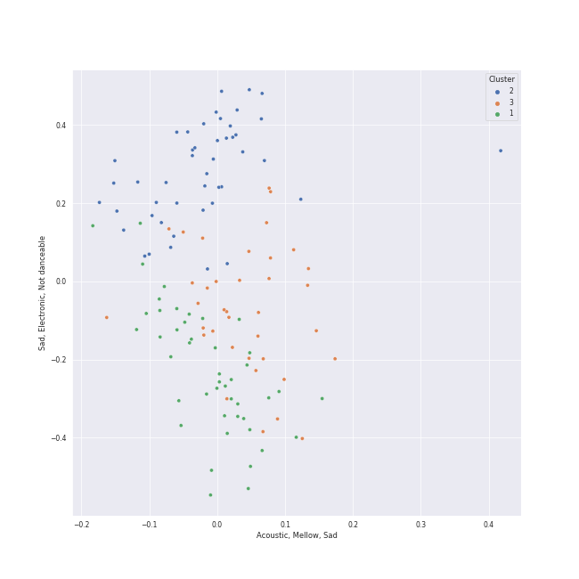

# Clusters in college a cappella

## Cluster #1

22 tracks

| Art | Track | Album | Artists | Label | Rank | 💚 | 🔗 |
|:---|:---|:---|:---|:---|---:|:---|:---|
|  | Cry Me a River | Songs for Padded Rooms | Voices in Your Head | [A Cappella Records](../../../../labels/a_cappella_records) | nan | | [🔗](https://open.spotify.com/track/7j2UXGaBVzCGe1zJ795Mv8) |
|  | Isn't She Lovely | Breakdown! | Ithacappella | 649668 Records DK2 | nan | | [🔗](https://open.spotify.com/track/0ZSOQ9LuxzBbGk9bJ4vVvl) |
|  | Here (In Your Arms) | BOCA 2009: Best Of College A Cappella | The MIT Logarhythms | [Varsity Vocals](../../../../labels/varsity_vocals) | nan | | [🔗](https://open.spotify.com/track/0eyAuLKMMEJRqiHFPhhFYI) |
|  | Got To Get You Into My Life | Pitch Slapped - EP | Pitch Slapped | [A Cappella Records](../../../../labels/a_cappella_records) | nan | | [🔗](https://open.spotify.com/track/3qBprB0ZTGZ9smH0YGgppn) |
|  | Can't Take My Eyes Off You | 1988 | Tar Heel Voices | Tar Heel Voices | nan | | [🔗](https://open.spotify.com/track/421iteTHiwbWZneFqAUQpS) |
|  | Counting Stars | 1988 | Tar Heel Voices | Tar Heel Voices | nan | | [🔗](https://open.spotify.com/track/497vByhCSwcQHKrLOqsXgA) |
|  | Machine Gun | Keepin' it Low Key | Tar Heel Voices | [A Cappella Records](../../../../labels/a_cappella_records) | nan | | [🔗](https://open.spotify.com/track/3p0txIEAiyVi0MBOd0AkmR) |
|  | Carry On Wayward Son | High Stakes Old Maid | UNC Achordants | [A Cappella Records](../../../../labels/a_cappella_records) | nan | | [🔗](https://open.spotify.com/track/20F6HiYBShG2uKe6eyX6JB) |
|  | Movin' On | BOCA 2010: Best Of College A Cappella | SoCal VoCals | [Varsity Vocals](../../../../labels/varsity_vocals) | nan | | [🔗](https://open.spotify.com/track/6ij7GL6J5e8l8gprJZ1sz7) |
|  | Put Your Records On | BOCA 2008: Best Of College A Cappella | Tufts sQ! | [Varsity Vocals](../../../../labels/varsity_vocals) | nan | | [🔗](https://open.spotify.com/track/3xE8DcaJYoDYMHgY9BDKdZ) |
## Cluster #2

47 tracks

| Art | Track | Album | Artists | Label | Rank | 💚 | 🔗 |
|:---|:---|:---|:---|:---|---:|:---|:---|
|  | Home | BOCA 2009: Best Of College A Cappella | The Pitchforks | [Varsity Vocals](../../../../labels/varsity_vocals) | nan | | [🔗](https://open.spotify.com/track/3NWCOrattfBSPxx6j5cGBr) |
|  | Sincerely, Jane | Equilibrium | The Nor'easters, Shams Ahmed, Emily Shanny, Beejul Khatri | The Nor'easters | nan | | [🔗](https://open.spotify.com/track/0hOFlYJaWWzMjHZJUl79mo) |
|  | Honeymoon Avenue | RISE | The Nor'easters | The Nor'easters | nan | | [🔗](https://open.spotify.com/track/6ja6rwUZNNfk07xqaiKyTS) |
|  | Too Close (feat. Roxorloops & Blady Kris) | The Party Upstairs | Ithacappella, Roxorloops & Blady Kris | [Ithacappella](../../../../labels/ithacappella) | nan | | [🔗](https://open.spotify.com/track/3mTJZn9RT8dd9cOXLq3Kgj) |
|  | Some Nights | The Party Upstairs | Ithacappella | [Ithacappella](../../../../labels/ithacappella) | nan | | [🔗](https://open.spotify.com/track/5ys1Y4xf0vaKR8HjonRl21) |
|  | Wally | Keepin' it Low Key | Tar Heel Voices | [A Cappella Records](../../../../labels/a_cappella_records) | nan | | [🔗](https://open.spotify.com/track/4dY5fF23LOemKIA9Q2uzxZ) |
|  | Sweater Weather | BOCA 2015: Best Of College A Cappella | Hullabahoos | [Varsity Vocals](../../../../labels/varsity_vocals) | nan | | [🔗](https://open.spotify.com/track/1cV1Q5LrLF4NdLgp1XuRvw) |
|  | Fireflies | Best of BOCA: The First 20 Years | University of Rochester Midnight Ramblers | [Varsity Vocals](../../../../labels/varsity_vocals) | nan | | [🔗](https://open.spotify.com/track/39g3TJTdQlakKOb1LHLkUP) |
|  | Don't Stop Believin' | BOCA 2008: Best Of College A Cappella | The Clef Hangers | [Varsity Vocals](../../../../labels/varsity_vocals) | nan | | [🔗](https://open.spotify.com/track/3j0EShkWclou2SnCRirqbj) |
|  | Some Nights | The Mallard | The Clef Hangers | The Clef Hangers | nan | | [🔗](https://open.spotify.com/track/553aS2CmFAuIlw8JKeN2q8) |
## Cluster #3

54 tracks

| Art | Track | Album | Artists | Label | Rank | 💚 | 🔗 |
|:---|:---|:---|:---|:---|---:|:---|:---|
|  | Home | I Used to Live Alone | Voices in Your Head | [A Cappella Records](../../../../labels/a_cappella_records) | nan | | [🔗](https://open.spotify.com/track/4NUlXRw52KIz9bQ58S4oYu) |
|  | Halo | Off the Hook | Ithacappella | [Ithacappella](../../../../labels/ithacappella) | nan | | [🔗](https://open.spotify.com/track/5qlpHkmxJntPok8hKIPcrY) |
|  | I Won't Give Up | The Party Upstairs | Ithacappella | [Ithacappella](../../../../labels/ithacappella) | nan | | [🔗](https://open.spotify.com/track/4fK1ojDf3LYPh4KhNWoQFi) |
|  | Elastic Heart | ICCA 2016: The Extended Cuts | Mosaic Whispers | Mosaic Whispers | nan | | [🔗](https://open.spotify.com/track/4Ek6v5gLQoBJuitIjPl5Fz) |
|  | Chandelier | 1988 | Tar Heel Voices | Tar Heel Voices | nan | | [🔗](https://open.spotify.com/track/18wXABY4rT8OWkluEuXir0) |
|  | Radioactive Love | Almost 8:08 | UNC Achordants | UNC Achordants | nan | | [🔗](https://open.spotify.com/track/0ZmWbHp88PBcWpUnQEkNK1) |
|  | Honeybee | Almost 8:08 | UNC Achordants | UNC Achordants | nan | | [🔗](https://open.spotify.com/track/0p2RFwAkiQEijgUvghNBJY) |
|  | Come Sail Away | BOCA 2008: Best Of College A Cappella | Tufts Beelzebubs | [Varsity Vocals](../../../../labels/varsity_vocals) | nan | | [🔗](https://open.spotify.com/track/4shx271boRWtwHWM2bTpGa) |
|  | Say (All I Need) | BOCA 2010: Best Of College A Cappella | The Virginia Sil'hooettes | [Varsity Vocals](../../../../labels/varsity_vocals) | nan | | [🔗](https://open.spotify.com/track/1t9VIvxuGPM3zx7kR5CbPB) |
|  | Let It Go | Fixate | The Clef Hangers | The Clef Hangers | nan | | [🔗](https://open.spotify.com/track/3WgDY81htmhTtSh7VWIl60) |