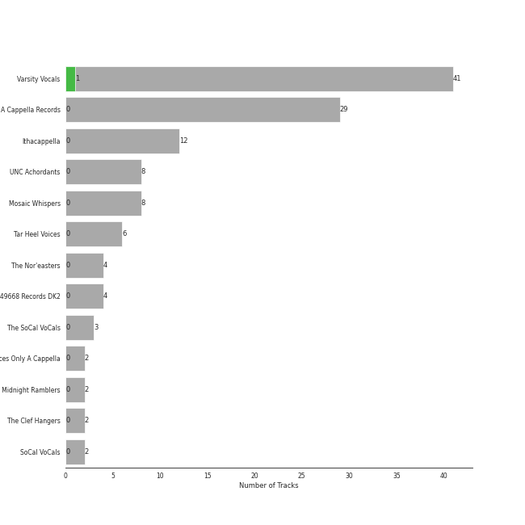
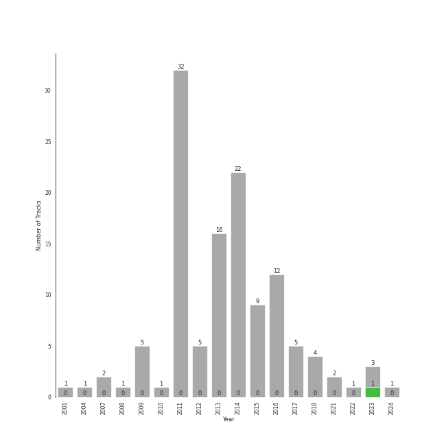

# college a cappella

[118 songs](tracks.md)

[See Track Features](audio_features.md)

[See Clusters](clusters/overview.md)

## Top Artists

| Art | Tracks | 💚 | Artist | 🔗 |
|:---|---:|---:|:---|:---|
|  | 20 | 0 | Tar Heel Voices | [🔗](https://open.spotify.com/artist/1apO6pJsV1nwuF2K8sEsDo) |
|  | 16 | 0 | Ithacappella | [🔗](https://open.spotify.com/artist/5bPTIGQvxRNjr6wl9yyAct) |
|  | 9 | 0 | The Nor'easters | [🔗](https://open.spotify.com/artist/1aLfVgwt8eBrpvHcutWmqe) |
|  | 9 | 0 | UNC Achordants | [🔗](https://open.spotify.com/artist/1TzZMeOCs4TMYtzgohPMAr) |
|  | 8 | 0 | Mosaic Whispers | [🔗](https://open.spotify.com/artist/0fP33MCfVUaPivyFYLZtoh) |
|  | 7 | 0 | SoCal VoCals | [🔗](https://open.spotify.com/artist/5L30XpwHG77eWCZtelTns9) |
|  | 6 | 0 | Pitch Slapped | [🔗](https://open.spotify.com/artist/7EH7jldX62OIsU1yU1SWE7) |
|  | 6 | 0 | Voices in Your Head | [🔗](https://open.spotify.com/artist/44v8JgDySt9tkgfV3AWxBJ) |
|  | 5 | 0 | University of Rochester Midnight Ramblers | [🔗](https://open.spotify.com/artist/2Tv49uvEsNJXUpuFL7HuKu) |
|  | 4 | 0 | The Clef Hangers | [🔗](https://open.spotify.com/artist/5wUTXZIMX0mn6MzFA13qfO) |

See all 34 artists

| Art | Tracks | 💚 | Artist | 🔗 |
|:---|---:|---:|:---|:---|
|  | 3 | 0 | Tufts Beelzebubs | [🔗](https://open.spotify.com/artist/4VsNVAxuPxZrJMWE2Tprtq) |
|  | 2 | 0 | The Dartmouth Aires | [🔗](https://open.spotify.com/artist/71Cez1b1NqsxIn5u8XNiQD) |
|  | 2 | 0 | University of Rochester YellowJackets | [🔗](https://open.spotify.com/artist/5PdBpsZXvnEbbTe1589fMO) |
|  | 2 | 0 | The Pitchforks | [🔗](https://open.spotify.com/artist/5IPABE7EhPLvUVsgM3dlZ8) |
|  | 2 | 0 | Tufts sQ! | [🔗](https://open.spotify.com/artist/21QIHECpmN2KwhpVhIWHpT) |
|  | 2 | 0 | The MIT Logarhythms | [🔗](https://open.spotify.com/artist/1jz5HCLwsDkpBYz80n9wbR) |
|  | 2 | 0 | The Virginia Sil'hooettes | [🔗](https://open.spotify.com/artist/0LKgClZwZKGhM5BkCzjfMX) |
| | 1 | 0 | Shams Ahmed | [🔗](https://open.spotify.com/artist/7rIkgg1ozqQIezA7c8Khf4) |
|  | 1 | 0 | Off The Beat | [🔗](https://open.spotify.com/artist/7aCUqnLkFEQd2FPL6RK1tW) |
|  | 1 | 0 | UGA Noteworthy | [🔗](https://open.spotify.com/artist/6MyHz1OaVtj1w2y6JTu2u5) |
| | 1 | 0 | Roxorloops & Blady Kris | [🔗](https://open.spotify.com/artist/6HRJOlHBoo07WcZdXZAADI) |
|  | 1 | 0 | BYU Vocal Point | [🔗](https://open.spotify.com/artist/5zhxxb24WP6q6rbLHAn2UQ) |
|  | 1 | 0 | The Harvard-Radcliffe Veritones | [🔗](https://open.spotify.com/artist/4Zjdnr698SzQDAPMx4oxy0) |
|  | 1 | 0 | Brandeis VoiceMale | [🔗](https://open.spotify.com/artist/4DsnXPBijq5tMq5zAEfF1L) |
| | 1 | 0 | Emily Shanny | [🔗](https://open.spotify.com/artist/3oWiUIUDPWJmvB8wElpaO5) |
|  | 1 | 0 | Hullabahoos | [🔗](https://open.spotify.com/artist/3S1DEHnGNfWmamdZEyLs8I) |
|  | 1 | 0 | Eight Beat Measure | [🔗](https://open.spotify.com/artist/3My1YRLewqqDXME2OkBpdZ) |
|  | 1 | 0 | Penn Masala | [🔗](https://open.spotify.com/artist/2MhJb1ljKttJewuYZTpXxr) |
| | 1 | 0 | Beejul Khatri | [🔗](https://open.spotify.com/artist/24SlCPf92d5VTzhI0ztENn) |
|  | 1 | 0 | Tufts Jackson Jills | [🔗](https://open.spotify.com/artist/1dUJZ0lbobmanl4W14h0a2) |
|  | 1 | 0 | Academical Village People | [🔗](https://open.spotify.com/artist/1Vjug1h4HXCeplbouQEbV3) |
|  | 1 | 0 | The Virginia Gentlemen | [🔗](https://open.spotify.com/artist/0steWfkS4hwaErh84SlHMW) |
|  | 1 | 0 | The Bostonians | [🔗](https://open.spotify.com/artist/0gW6hG0g7pVNbHgvmYwHDl) |
|  | 1 | 0 | The Buffalo Chips | [🔗](https://open.spotify.com/artist/0IAZ8PiZ0KqdMd191HDJ8t) |

## Top Albums

| Art | Tracks | 💚 | Album | Release Date | 🔗 |
|:---|---:|---:|:---|:---|:---|
|  | 8 | 0 | Quarter Past | 2014-11-18 | [🔗](https://open.spotify.com/album/1pScBPjmT5w3s0BTgkdgJy) |
|  | 7 | 0 | BOCA 2015: Best Of College A Cappella | 2014-12-19 | [🔗](https://open.spotify.com/album/0gyhBvJs1GiI31cMMmKLnK) |
|  | 6 | 0 | Keepin' it Low Key | 2013-01-18 | [🔗](https://open.spotify.com/album/4EmdqB8w7gEONRX5QLypQZ) |
|  | 5 | 0 | The Party Upstairs | 2013-12-13 | [🔗](https://open.spotify.com/album/2AIAKP2FxbYNjmwQgAkqZz) |
|  | 5 | 0 | Pitch Slapped - EP | 2011-04-08 | [🔗](https://open.spotify.com/album/5I08qbUSg8f48kenQs7Tg6) |
|  | 5 | 0 | BOCA 2010: Best Of College A Cappella | 2011-02-15 | [🔗](https://open.spotify.com/album/3HSd3voAxPxS50UrfInBVJ) |
|  | 5 | 0 | BOCA 2009: Best Of College A Cappella | 2011-02-15 | [🔗](https://open.spotify.com/album/50WaSkL4pVvz9Crsca7oNV) |
|  | 5 | 0 | BOCA 2008: Best Of College A Cappella | 2011-02-15 | [🔗](https://open.spotify.com/album/4Z0ju0i47UZ2Y4icq2f3wZ) |
|  | 4 | 0 | Off the Hook | 2011-12-10 | [🔗](https://open.spotify.com/album/1wfYTTpHsGxvIjDwsPLAAC) |
|  | 4 | 0 | Greene St. | 2016 | [🔗](https://open.spotify.com/album/3qJMqi0VzTFGSDTTMUI5n7) |

See all 47 albums

| Art | Tracks | 💚 | Album | Release Date | 🔗 |
|:---|---:|---:|:---|:---|:---|
|  | 4 | 0 | Breakdown! | 2009-12-05 | [🔗](https://open.spotify.com/album/7u7dNsbxjcxVoffJELqtCV) |
|  | 4 | 0 | BOCA 2014: Best Of College A Cappella | 2014-01-31 | [🔗](https://open.spotify.com/album/7rZoAMtoZ8s5mLIlUTWgVT) |
|  | 4 | 0 | 1988 | 2015-05-19 | [🔗](https://open.spotify.com/album/6nktHqHKPt8kT4ozUJvwrs) |
|  | 3 | 0 | Songs for Padded Rooms | 2011-05-21 | [🔗](https://open.spotify.com/album/0h3bmbpSuD01ha1k52E1uz) |
|  | 3 | 0 | RISE | 2016-02-09 | [🔗](https://open.spotify.com/album/6V8819n4bdv7dA5mFdCIAo) |
|  | 3 | 0 | BOCA 2013: Best of College A Cappella | 2016 | [🔗](https://open.spotify.com/album/6Pqey2mc4EWSfYNH3bifbO) |
|  | 3 | 0 | BOCA 2012: Best Of College A Cappella | 2012-01-01 | [🔗](https://open.spotify.com/album/26eCHp86K2xLQj0B7Cr8he) |
|  | 2 | 0 | Wavelength | 2015-04-10 | [🔗](https://open.spotify.com/album/56RyapLbZ4DESHfzD87X7F) |
|  | 2 | 0 | V | 2018 | [🔗](https://open.spotify.com/album/7wPsYBhUlqtAgPr2hbbmP3) |
|  | 2 | 0 | Stages | 2014-09-21 | [🔗](https://open.spotify.com/album/3mnYoDcAHKx6uA91f7rtAa) |
|  | 2 | 0 | Permit to Harmonize | 2013-03-01 | [🔗](https://open.spotify.com/album/4aHUBNFRDR1DzCO8GULLTD) |
|  | 2 | 0 | III | 2012-04-12 | [🔗](https://open.spotify.com/album/3iFvXj07Frbs54rK9CzCIo) |
|  | 2 | 0 | I Used to Live Alone | 2011-05-21 | [🔗](https://open.spotify.com/album/0AmRRsaQVm5noeAB6LF8yA) |
|  | 2 | 0 | Déjà Blue | 2015-04-11 | [🔗](https://open.spotify.com/album/1mZNLR8qY6GhhrnCmtEAv3) |
|  | 2 | 0 | Behind Bars | 2007-02-21 | [🔗](https://open.spotify.com/album/40g8iY5VB5sTJ31943mAzQ) |
|  | 2 | 0 | BOCA 2011: Best Of College A Cappella | 2011-01-11 | [🔗](https://open.spotify.com/album/27d96rqnXRtmrGBGHJzPBh) |
|  | 2 | 0 | Almost 8:08 | 2017-09-06 | [🔗](https://open.spotify.com/album/1gbG9XfNmlfNGEnOTH0f6N) |
|  | 1 | 0 | Voices Only 2013 College A Cappella, Vol. 1 | 2013-08-01 | [🔗](https://open.spotify.com/album/6zr4GyBIMy2GRvIGPflYaK) |
|  | 1 | 0 | Voices Only 2009 College A Cappella (Disc 1) | 2009-09-23 | [🔗](https://open.spotify.com/album/20PLlTE6r1hsQrmyhUW7oB) |
|  | 1 | 0 | VoCabulary | 2016-05-03 | [🔗](https://open.spotify.com/album/6QTtvpKN8GebVCKsx8YRmJ) |
|  | 1 | 0 | Unbound | 2017-07-13 | [🔗](https://open.spotify.com/album/5KqLmDu7Lui1qqdnItWDUs) |
|  | 1 | 0 | The Mallard | 2013-04-13 | [🔗](https://open.spotify.com/album/2IV5LQ4DzCjAIVwYZMHYgo) |
|  | 1 | 0 | Storming The Castle | 2021-06-09 | [🔗](https://open.spotify.com/album/1wjibXmmViZMNA1HsMo7f6) |
|  | 1 | 0 | Oasis | 2018 | [🔗](https://open.spotify.com/album/1VpHqAIW8Pu343GJa0UpRQ) |
|  | 1 | 0 | Ignite | 2021-06-28 | [🔗](https://open.spotify.com/album/5O7GFH7FfXuuDlOfNH76Qq) |
|  | 1 | 0 | ICCA 2016: The Extended Cuts | 2017-01-24 | [🔗](https://open.spotify.com/album/07xYpylAQHOJoHStqUpKwp) |
|  | 1 | 0 | House Rules | 2011-04-26 | [🔗](https://open.spotify.com/album/1fHxE6WZL6ouusBW4h9nE4) |
|  | 1 | 0 | High Stakes Old Maid | 2016 | [🔗](https://open.spotify.com/album/6sg9WsK06H588Y5VOmwj37) |
|  | 1 | 0 | Fixate | 2017-04-08 | [🔗](https://open.spotify.com/album/2wDs6jkrCEPBJLnLLFWt7J) |
|  | 1 | 0 | Equilibrium | 2013-11-17 | [🔗](https://open.spotify.com/album/6BeTGjWVDQLQhdSM5MBziy) |
|  | 1 | 0 | Disturbia | 2010-11-22 | [🔗](https://open.spotify.com/album/3ypmasyBX16BmWt52owYaN) |
|  | 1 | 0 | Defrosted | 2004-04-24 | [🔗](https://open.spotify.com/album/3DLNakCGffrhPaaj9rfepk) |
|  | 1 | 0 | Best of BOCA: The First 20 Years | 2014-04-15 | [🔗](https://open.spotify.com/album/5bcLIouxn2oBiGvf4vvO6u) |
|  | 1 | 0 | Before You Go | 2008-12-12 | [🔗](https://open.spotify.com/album/00x5MddnbpBoWJWtubLhHH) |
|  | 1 | 0 | BOCA 2016: Best Of College A Cappella | 2015-12-15 | [🔗](https://open.spotify.com/album/2AOr4esohQurJGXklhRH1a) |
|  | 1 | 0 | Against the Grain | 2001-04-24 | [🔗](https://open.spotify.com/album/27W6ijbmL6QPNrdQGncwDJ) |
|  | 1 | 0 | A Swing and a Miss | 2018-04-26 | [🔗](https://open.spotify.com/album/0qj5ECfme87sP5anevwf81) |

## Top Record Labels

| Tracks | 💚 | Label |
|---:|---:|:---|
| 36 | 0 | [Varsity Vocals](../../labels/varsity_vocals/overview.md) |
| 29 | 0 | [A Cappella Records](../../labels/a_cappella_records/overview.md) |
| 12 | 0 | [Ithacappella](../../labels/ithacappella/overview.md) |
| 8 | 0 | UNC Achordants |
| 8 | 0 | Mosaic Whispers |
| 6 | 0 | Tar Heel Voices |
| 4 | 0 | The Nor'easters |
| 4 | 0 | 649668 Records DK2 |
| 3 | 0 | The SoCal VoCals |
| 2 | 0 | Voices Only A Cappella |

See all 13 labels

| Tracks | 💚 | Label |
|---:|---:|:---|
| 2 | 0 | The University of Rochester Midnight Ramblers |
| 2 | 0 | The Clef Hangers |
| 2 | 0 | SoCal VoCals |

## Years

| ​ | 10 newest albums | ​​ | 10 oldest albums |
|:---|:---|:---|:---|
|  | Ignite (2021-06-28) |  | Against the Grain (2001-04-24) |
|  | Storming The Castle (2021-06-09) |  | Defrosted (2004-04-24) |
|  | A Swing and a Miss (2018-04-26) |  | Behind Bars (2007-02-21) |
|  | V (2018) |  | Before You Go (2008-12-12) |
|  | Oasis (2018) |  | Voices Only 2009 College A Cappella (Disc 1) (2009-09-23) |
|  | Almost 8:08 (2017-09-06) |  | Breakdown! (2009-12-05) |
|  | Unbound (2017-07-13) |  | Disturbia (2010-11-22) |
|  | Fixate (2017-04-08) |  | BOCA 2011: Best Of College A Cappella (2011-01-11) |
|  | ICCA 2016: The Extended Cuts (2017-01-24) |  | BOCA 2009: Best Of College A Cappella (2011-02-15) |
|  | VoCabulary (2016-05-03) |  | BOCA 2010: Best Of College A Cappella (2011-02-15) |

