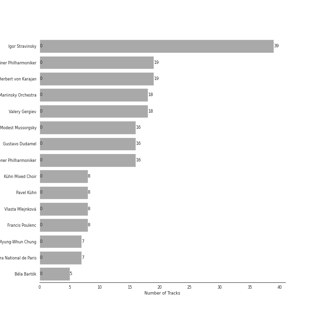
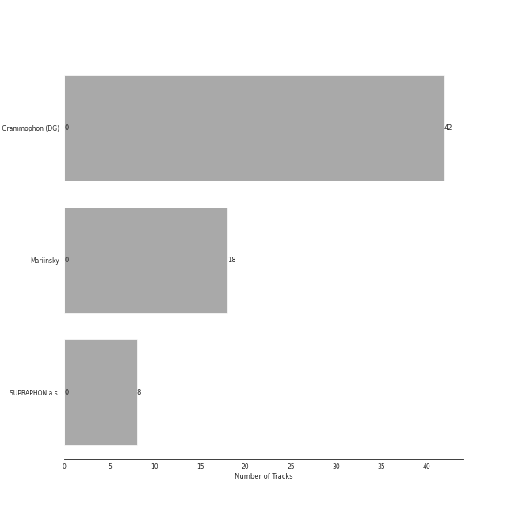

# early modern classical

[48 songs](early_modern_classical_tracks.md)

## Top Artists

See all 10 artists

| Number of Tracks | Art | Artist | 🔗 |
|---:|:---|:---|:---|
| 39 |  | [Igor Stravinsky](../artists/igor_stravinsky.md) | [🔗](https://open.spotify.com/artist/7ie36YytMoKtPiL7tUvmoE) |
| 19 |  | [Berliner Philharmoniker](../artists/berliner_philharmoniker.md) | [🔗](https://open.spotify.com/artist/6uRJnvQ3f8whVnmeoecv5Z) |
| 19 |  | [Herbert von Karajan](../artists/herbert_von_karajan.md) | [🔗](https://open.spotify.com/artist/5zCaQxjl110XTrm4LQ1CxY) |
| 18 |  | [Mariinsky Orchestra](../artists/mariinsky_orchestra.md) | [🔗](https://open.spotify.com/artist/2rRUfv2w535SEUV1YO5SP6) |
| 18 |  | [Valery Gergiev](../artists/valery_gergiev.md) | [🔗](https://open.spotify.com/artist/2LxnoYPOe0FCLC82R3xgO2) |
| 7 |  | Orchestre de l'Opéra Bastille | [🔗](https://open.spotify.com/artist/4w8yzPixoCNwxRpUZYpWpP) |
| 7 |  | Myung-Whun Chung | [🔗](https://open.spotify.com/artist/4hdiwtmc6OEFFxpSlwwmby) |
| 5 |  | Béla Bartók | [🔗](https://open.spotify.com/artist/5zyNXVd952fWOjkdGHCvPd) |
| 4 |  | [Jerusalem Quartet](../artists/jerusalem_quartet.md) | [🔗](https://open.spotify.com/artist/7AnE8Jpu1vxLeXcs6OKYHE) |
| 4 |  | Maurice Ravel | [🔗](https://open.spotify.com/artist/17hR0sYHpx7VYTMRfFUOmY) |

## Top Albums

See all 4 albums

| Number of Tracks | Art | Album | Release Date | 🔗 |
|---:|:---|:---|:---|:---|
| 19 |  | Stravinsky: The Rite of Spring / Bartók: Concerto for Orchestra | 2007-01-01 | [🔗](https://open.spotify.com/album/317b74rpNBO2uhaJFyMaxJ) |
| 18 |  | Stravinsky: Petrushka, Jeu de cartes | 2018-10-19 | [🔗](https://open.spotify.com/album/19fQbFNjlfXgBAFqftKzWA) |
| 7 |  | Stravinsky: The Firebird (Ballet Suite) | 2009-01-01 | [🔗](https://open.spotify.com/album/2q1xMRl4AcA7rI8GfGnmvD) |
| 4 |  | Debussy & Ravel: String Quartets | 2018-05-25 | [🔗](https://open.spotify.com/album/77Eg2dHidrefgsS3GZ88nK) |

## Top Record Labels

See all 3 labels

| Number of Tracks | Label |
|---:|:---|
| 26 | [Deutsche Grammophon (DG)](../labels/deutsche_grammophon__dg_.md) |
| 18 | [Mariinsky](../labels/mariinsky.md) |
| 4 | [harmonia mundi](../labels/harmonia_mundi.md) |

## Audio Features

| 10 most Danceable tracks | 10 least Danceable tracks |
|:---|:---|
| Le Sacre du Printemps - Revised version for Orchestra (published 1947) / Part 2: The Sacrifice: Sacrificial Dance (The Chosen One) (0.59) | The Firebird (L'oiseau De Feu) - Suite (1919): Round Dance Of The Princesses (0.0797) |
| Petrushka: Third Scene: II. Dance of the Ballerina (1911 original version) (0.58) | The Firebird (L'oiseau De Feu) - Suite (1919): Introduction (0.083) |
| Le Sacre du Printemps - Revised version for Orchestra (published 1947) / Part 2: The Sacrifice: Evocation of the Ancestors (0.539) | Le Sacre du Printemps - Revised version for Orchestra (published 1947) / Part 2: The Sacrifice: Mystic Circles of the Young Girls (0.108) |
| Petrushka: Fourth Scene: V. Dance of the Coachmen and Grooms (1911 original version) (0.51) | Concerto for Orchestra, Sz. 116: 3. Elegia (Andante, non troppo) (0.112) |
| Le Sacre du Printemps - Revised version for Orchestra (published 1947) / Part 1: The Adoration of the Earth: The Augurs of Spring: Dances of the Young Girls (0.508) | Quatuor en Fa Majeur, M. 35: III. Très lent (0.112) |
| Le Sacre du Printemps - Revised version for Orchestra (published 1947) / Part 2: The Sacrifice: Glorification of the Chosen One (0.507) | The Firebird (L'oiseau De Feu) - Suite (1919): Finale (0.123) |
| The Firebird (L'oiseau De Feu) - Suite (1919): 3. Variation Of The Firebird (0.458) | Petrushka: Fourth Scene: III. A Peasant Enters with a Bear (1911 original version) (0.138) |
| Le Sacre du Printemps - Revised version for Orchestra (published 1947) / Part 1: The Adoration of the Earth: Ritual of Abduction (0.413) | Le Sacre du Printemps - Revised version for Orchestra (published 1947) / Part 1: The Adoration of the Earth: Procession of the Sage (0.147) |
| Jeu de cartes: III. Third Deal (0.404) | The Firebird (L'oiseau De Feu) - Suite (1919): Berceuse (0.152) |
| Jeu de cartes: II. Second Deal (0.398) | Le Sacre du Printemps - Revised version for Orchestra (published 1947) / Part 1: The Adoration of the Earth: Introduction (0.156) |

| 10 most Energetic tracks | 10 least Energetic tracks |
|:---|:---|
| Le Sacre du Printemps - Revised version for Orchestra (published 1947) / Part 1: The Adoration of the Earth: Procession of the Sage (0.7) | Le Sacre du Printemps - Revised version for Orchestra (published 1947) / Part 1: The Adoration of the Earth: The Sage (0.000239) |
| Le Sacre du Printemps - Revised version for Orchestra (published 1947) / Part 1: The Adoration of the Earth: Ritual of Abduction (0.555) | The Firebird (L'oiseau De Feu) - Suite (1919): Introduction (0.00108) |
| Le Sacre du Printemps - Revised version for Orchestra (published 1947) / Part 1: The Adoration of the Earth: Dance of the Earth (0.509) | The Firebird (L'oiseau De Feu) - Suite (1919): Berceuse (0.00403) |
| Le Sacre du Printemps - Revised version for Orchestra (published 1947) / Part 2: The Sacrifice: Sacrificial Dance (The Chosen One) (0.46) | The Firebird (L'oiseau De Feu) - Suite (1919): Round Dance Of The Princesses (0.00617) |
| Petrushka: Fourth Scene: I. The Shrovetide Fair (towards evening) (1911 original version) (0.453) | Petrushka: First Scene: III. The Conjuring Trick (1911 original version) (0.011) |
| Le Sacre du Printemps - Revised version for Orchestra (published 1947) / Part 2: The Sacrifice: Glorification of the Chosen One (0.447) | Petrushka: Fourth Scene: VII. Petrushka's Death (1911 original version) (0.0123) |
| Le Sacre du Printemps - Revised version for Orchestra (published 1947) / Part 1: The Adoration of the Earth: Ritual of the Rival Tribes (0.435) | Le Sacre du Printemps - Revised version for Orchestra (published 1947) / Part 2: The Sacrifice: Ritual Action of the Ancestors (0.0216) |
| Petrushka: Fourth Scene: VI. The Mummers (1911 original version) (0.359) | Le Sacre du Printemps - Revised version for Orchestra (published 1947) / Part 2: The Sacrifice: Introduction (0.0217) |
| Petrushka: First Scene: IV. Russian Dance (1911 original version) (0.331) | Concerto for Orchestra, Sz. 116: 4. Intermezzo interrotto (Allegretto) (0.0285) |
| The Firebird (L'oiseau De Feu) - Suite (1919): Infernal Dance Of King Kaschei (0.325) | Le Sacre du Printemps - Revised version for Orchestra (published 1947) / Part 2: The Sacrifice: Mystic Circles of the Young Girls (0.0294) |

| 10 most Speechy tracks | 10 least Speechy tracks |
|:---|:---|
| The Firebird (L'oiseau De Feu) - Suite (1919): Dance Of The Firebird (0.167) | Le Sacre du Printemps - Revised version for Orchestra (published 1947) / Part 1: The Adoration of the Earth: Dance of the Earth (0.0292) |
| Le Sacre du Printemps - Revised version for Orchestra (published 1947) / Part 2: The Sacrifice: Glorification of the Chosen One (0.0935) | Le Sacre du Printemps - Revised version for Orchestra (published 1947) / Part 1: The Adoration of the Earth: The Augurs of Spring: Dances of the Young Girls (0.0293) |
| Petrushka: Fourth Scene: VI. The Mummers (1911 original version) (0.083) | Petrushka: Fourth Scene: III. A Peasant Enters with a Bear (1911 original version) (0.0313) |
| Le Sacre du Printemps - Revised version for Orchestra (published 1947) / Part 2: The Sacrifice: Sacrificial Dance (The Chosen One) (0.0741) | Le Sacre du Printemps - Revised version for Orchestra (published 1947) / Part 2: The Sacrifice: Ritual Action of the Ancestors (0.0319) |
| The Firebird (L'oiseau De Feu) - Suite (1919): Infernal Dance Of King Kaschei (0.0689) | Le Sacre du Printemps - Revised version for Orchestra (published 1947) / Part 1: The Adoration of the Earth: Spring Rounds (0.0346) |
| Petrushka: Third Scene: III. Waltz (The Ballerina and the Moor) (1911 original version) (0.0644) | The Firebird (L'oiseau De Feu) - Suite (1919): Finale (0.0351) |
| Quatuor en Fa Majeur, M. 35: I. Allegro moderato (0.0584) | Petrushka: Fourth Scene: I. The Shrovetide Fair (towards evening) (1911 original version) (0.0359) |
| Concerto for Orchestra, Sz. 116: 5. Finale (Pesante - Presto) (0.0555) | Le Sacre du Printemps - Revised version for Orchestra (published 1947) / Part 2: The Sacrifice: Introduction (0.0359) |
| Petrushka: Third Scene: II. Dance of the Ballerina (1911 original version) (0.0518) | The Firebird (L'oiseau De Feu) - Suite (1919): Introduction (0.036) |
| Le Sacre du Printemps - Revised version for Orchestra (published 1947) / Part 2: The Sacrifice: Evocation of the Ancestors (0.051) | Petrushka: Fourth Scene: VII. Petrushka's Death (1911 original version) (0.0362) |

| 10 most Acoustic tracks | 10 least Acoustic tracks |
|:---|:---|
| Petrushka: Fourth Scene: III. A Peasant Enters with a Bear (1911 original version) (0.983) | Le Sacre du Printemps - Revised version for Orchestra (published 1947) / Part 1: The Adoration of the Earth: The Sage (0.591) |
| Le Sacre du Printemps - Revised version for Orchestra (published 1947) / Part 2: The Sacrifice: Mystic Circles of the Young Girls (0.981) | Le Sacre du Printemps - Revised version for Orchestra (published 1947) / Part 1: The Adoration of the Earth: Procession of the Sage (0.612) |
| Petrushka: Fourth Scene: II. Dance of the Wet-Nurses (1911 original version) (0.978) | Le Sacre du Printemps - Revised version for Orchestra (published 1947) / Part 1: The Adoration of the Earth: Dance of the Earth (0.712) |
| Petrushka: First Scene: I. The Shrovetide Fair (Introduction) (1911 original version) (0.975) | The Firebird (L'oiseau De Feu) - Suite (1919): Finale (0.73) |
| Petrushka: Fourth Scene: IV. The Gypsy Girls Dance (1911 original version) (0.972) | Le Sacre du Printemps - Revised version for Orchestra (published 1947) / Part 2: The Sacrifice: Sacrificial Dance (The Chosen One) (0.802) |
| Jeu de cartes: I. First Deal (0.966) | Petrushka: First Scene: III. The Conjuring Trick (1911 original version) (0.817) |
| Le Sacre du Printemps - Revised version for Orchestra (published 1947) / Part 1: The Adoration of the Earth: Introduction (0.966) | Petrushka: Fourth Scene: VII. Petrushka's Death (1911 original version) (0.82) |
| Petrushka: Third Scene: II. Dance of the Ballerina (1911 original version) (0.962) | Petrushka: Fourth Scene: V. Dance of the Coachmen and Grooms (1911 original version) (0.841) |
| The Firebird (L'oiseau De Feu) - Suite (1919): Round Dance Of The Princesses (0.962) | Le Sacre du Printemps - Revised version for Orchestra (published 1947) / Part 2: The Sacrifice: Introduction (0.861) |
| Petrushka: First Scene: II. The Crowds (1911 original version) (0.961) | The Firebird (L'oiseau De Feu) - Suite (1919): Berceuse (0.868) |

| 10 most Instrumental tracks | 10 least Instrumental tracks |
|:---|:---|
| Le Sacre du Printemps - Revised version for Orchestra (published 1947) / Part 1: The Adoration of the Earth: Introduction (0.972) | Le Sacre du Printemps - Revised version for Orchestra (published 1947) / Part 1: The Adoration of the Earth: The Sage (0.000308) |
| The Firebird (L'oiseau De Feu) - Suite (1919): Dance Of The Firebird (0.951) | Petrushka: First Scene: III. The Conjuring Trick (1911 original version) (0.000393) |
| Le Sacre du Printemps - Revised version for Orchestra (published 1947) / Part 1: The Adoration of the Earth: Ritual of Abduction (0.945) | Petrushka: Fourth Scene: VII. Petrushka's Death (1911 original version) (0.00603) |
| Petrushka: Fourth Scene: II. Dance of the Wet-Nurses (1911 original version) (0.945) | The Firebird (L'oiseau De Feu) - Suite (1919): 3. Variation Of The Firebird (0.054) |
| Petrushka: First Scene: I. The Shrovetide Fair (Introduction) (1911 original version) (0.941) | Le Sacre du Printemps - Revised version for Orchestra (published 1947) / Part 2: The Sacrifice: Introduction (0.0623) |
| Le Sacre du Printemps - Revised version for Orchestra (published 1947) / Part 2: The Sacrifice: Evocation of the Ancestors (0.938) | Quatuor en Fa Majeur, M. 35: II. Assez vif, très rythmé (0.326) |
| Petrushka: Fourth Scene: VI. The Mummers (1911 original version) (0.936) | Quatuor en Fa Majeur, M. 35: III. Très lent (0.404) |
| Petrushka: Fourth Scene: III. A Peasant Enters with a Bear (1911 original version) (0.933) | The Firebird (L'oiseau De Feu) - Suite (1919): Round Dance Of The Princesses (0.506) |
| Petrushka: Third Scene: I. The Moor's Cell (1911 original version) (0.933) | The Firebird (L'oiseau De Feu) - Suite (1919): Finale (0.509) |
| Le Sacre du Printemps - Revised version for Orchestra (published 1947) / Part 1: The Adoration of the Earth: Spring Rounds (0.929) | Le Sacre du Printemps - Revised version for Orchestra (published 1947) / Part 1: The Adoration of the Earth: Procession of the Sage (0.509) |

| 10 most Live tracks | 10 least Live tracks |
|:---|:---|
| The Firebird (L'oiseau De Feu) - Suite (1919): 3. Variation Of The Firebird (0.743) | The Firebird (L'oiseau De Feu) - Suite (1919): Finale (0.0658) |
| Le Sacre du Printemps - Revised version for Orchestra (published 1947) / Part 1: The Adoration of the Earth: The Augurs of Spring: Dances of the Young Girls (0.669) | Le Sacre du Printemps - Revised version for Orchestra (published 1947) / Part 1: The Adoration of the Earth: Introduction (0.0674) |
| Petrushka: First Scene: IV. Russian Dance (1911 original version) (0.558) | Concerto for Orchestra, Sz. 116: 1. Introduzione (Andante non troppo - Allegro vivace (0.0751) |
| Petrushka: Fourth Scene: V. Dance of the Coachmen and Grooms (1911 original version) (0.537) | Le Sacre du Printemps - Revised version for Orchestra (published 1947) / Part 1: The Adoration of the Earth: Dance of the Earth (0.0801) |
| Petrushka: Fourth Scene: I. The Shrovetide Fair (towards evening) (1911 original version) (0.505) | Le Sacre du Printemps - Revised version for Orchestra (published 1947) / Part 2: The Sacrifice: Glorification of the Chosen One (0.0838) |
| Jeu de cartes: I. First Deal (0.366) | The Firebird (L'oiseau De Feu) - Suite (1919): Round Dance Of The Princesses (0.0859) |
| Concerto for Orchestra, Sz. 116: 4. Intermezzo interrotto (Allegretto) (0.364) | Le Sacre du Printemps - Revised version for Orchestra (published 1947) / Part 2: The Sacrifice: Sacrificial Dance (The Chosen One) (0.0907) |
| Le Sacre du Printemps - Revised version for Orchestra (published 1947) / Part 1: The Adoration of the Earth: Ritual of Abduction (0.349) | Petrushka: Third Scene: III. Waltz (The Ballerina and the Moor) (1911 original version) (0.0908) |
| Petrushka: Fourth Scene: III. A Peasant Enters with a Bear (1911 original version) (0.343) | The Firebird (L'oiseau De Feu) - Suite (1919): Berceuse (0.0909) |
| Petrushka: First Scene: I. The Shrovetide Fair (Introduction) (1911 original version) (0.328) | Petrushka: Fourth Scene: VI. The Mummers (1911 original version) (0.0931) |

| 10 most Happy tracks | 10 least Happy tracks |
|:---|:---|
| Petrushka: Third Scene: II. Dance of the Ballerina (1911 original version) (0.907) | Le Sacre du Printemps - Revised version for Orchestra (published 1947) / Part 1: The Adoration of the Earth: The Sage (0.0) |
| Petrushka: Fourth Scene: II. Dance of the Wet-Nurses (1911 original version) (0.657) | The Firebird (L'oiseau De Feu) - Suite (1919): Dance Of The Firebird (0.0) |
| Le Sacre du Printemps - Revised version for Orchestra (published 1947) / Part 1: The Adoration of the Earth: The Augurs of Spring: Dances of the Young Girls (0.587) | Concerto for Orchestra, Sz. 116: 3. Elegia (Andante, non troppo) (0.0312) |
| Le Sacre du Printemps - Revised version for Orchestra (published 1947) / Part 1: The Adoration of the Earth: Ritual of Abduction (0.453) | Quatuor en Fa Majeur, M. 35: III. Très lent (0.0349) |
| Petrushka: First Scene: IV. Russian Dance (1911 original version) (0.424) | Le Sacre du Printemps - Revised version for Orchestra (published 1947) / Part 1: The Adoration of the Earth: Introduction (0.037) |
| Le Sacre du Printemps - Revised version for Orchestra (published 1947) / Part 1: The Adoration of the Earth: Ritual of the Rival Tribes (0.393) | Petrushka: Fourth Scene: VII. Petrushka's Death (1911 original version) (0.0377) |
| Petrushka: Fourth Scene: IV. The Gypsy Girls Dance (1911 original version) (0.331) | Petrushka: Fourth Scene: III. A Peasant Enters with a Bear (1911 original version) (0.0379) |
| Jeu de cartes: III. Third Deal (0.316) | Concerto for Orchestra, Sz. 116: 1. Introduzione (Andante non troppo - Allegro vivace (0.0379) |
| The Firebird (L'oiseau De Feu) - Suite (1919): 3. Variation Of The Firebird (0.264) | Le Sacre du Printemps - Revised version for Orchestra (published 1947) / Part 2: The Sacrifice: Introduction (0.0385) |
| Petrushka: First Scene: I. The Shrovetide Fair (Introduction) (1911 original version) (0.253) | The Firebird (L'oiseau De Feu) - Suite (1919): Round Dance Of The Princesses (0.0387) |
