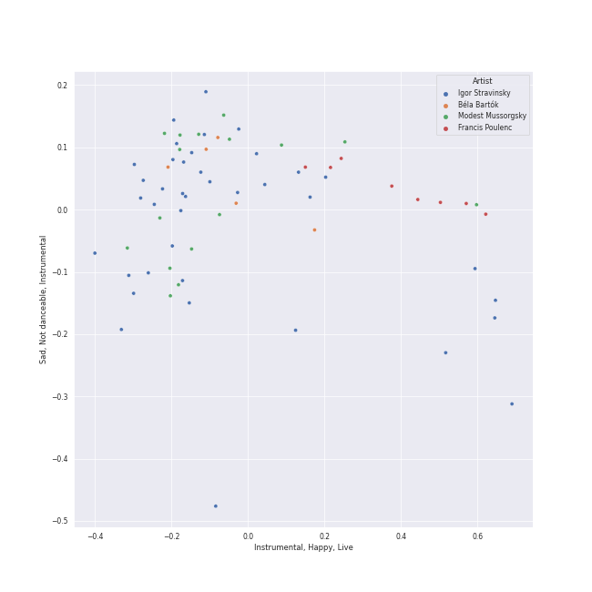
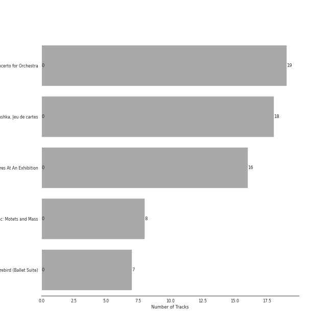

# early modern classical

[48 songs](early_modern_classical_tracks.md)

## Top Artists

See all 10 artists

|   Number of Tracks | Art                                                                                              | Artist                                                           | 🔗                                                           |
|-------------------:|:-------------------------------------------------------------------------------------------------|:-----------------------------------------------------------------|:------------------------------------------------------------|
|                 39 |  | [Igor Stravinsky](../artists/igor_stravinsky.md)                 | [🔗](https://open.spotify.com/artist/7ie36YytMoKtPiL7tUvmoE) |
|                 19 |  | [Berliner Philharmoniker](../artists/berliner_philharmoniker.md) | [🔗](https://open.spotify.com/artist/6uRJnvQ3f8whVnmeoecv5Z) |
|                 19 |  | [Herbert von Karajan](../artists/herbert_von_karajan.md)         | [🔗](https://open.spotify.com/artist/5zCaQxjl110XTrm4LQ1CxY) |
|                 18 |  | [Mariinsky Orchestra](../artists/mariinsky_orchestra.md)         | [🔗](https://open.spotify.com/artist/2rRUfv2w535SEUV1YO5SP6) |
|                 18 |  | [Valery Gergiev](../artists/valery_gergiev.md)                   | [🔗](https://open.spotify.com/artist/2LxnoYPOe0FCLC82R3xgO2) |
|                  7 |  | Orchestre de l'Opéra Bastille                                    | [🔗](https://open.spotify.com/artist/4w8yzPixoCNwxRpUZYpWpP) |
|                  7 |  | Myung-Whun Chung                                                 | [🔗](https://open.spotify.com/artist/4hdiwtmc6OEFFxpSlwwmby) |
|                  5 |  | Béla Bartók                                                      | [🔗](https://open.spotify.com/artist/5zyNXVd952fWOjkdGHCvPd) |
|                  4 |  | [Jerusalem Quartet](../artists/jerusalem_quartet.md)             | [🔗](https://open.spotify.com/artist/7AnE8Jpu1vxLeXcs6OKYHE) |
|                  4 |  | Maurice Ravel                                                    | [🔗](https://open.spotify.com/artist/17hR0sYHpx7VYTMRfFUOmY) |

## Top Albums

See all 4 albums

|   Number of Tracks | Art                                                                                              | Album                                                           | 🔗                                                          |
|-------------------:|:-------------------------------------------------------------------------------------------------|:----------------------------------------------------------------|:-----------------------------------------------------------|
|                 19 |  | Stravinsky: The Rite of Spring / Bartók: Concerto for Orchestra | [🔗](https://open.spotify.com/album/317b74rpNBO2uhaJFyMaxJ) |
|                 18 |  | Stravinsky: Petrushka, Jeu de cartes                            | [🔗](https://open.spotify.com/album/19fQbFNjlfXgBAFqftKzWA) |
|                  7 |  | Stravinsky: The Firebird (Ballet Suite)                         | [🔗](https://open.spotify.com/album/2q1xMRl4AcA7rI8GfGnmvD) |
|                  4 |  | Debussy & Ravel: String Quartets                                | [🔗](https://open.spotify.com/album/77Eg2dHidrefgsS3GZ88nK) |

## Top Record Labels

See all 3 labels

|   Number of Tracks | Label                                                             |
|-------------------:|:------------------------------------------------------------------|
|                 26 | [Deutsche Grammophon (DG)](../labels/deutsche_grammophon__dg_.md) |
|                 18 | [Mariinsky](../labels/mariinsky.md)                               |
|                  4 | [harmonia mundi](../labels/harmonia_mundi.md)                     |

## Audio Features

| 10 most Danceable tracks                                                                                                                                     | 10 least Danceable tracks                                                                                                           |
|:-------------------------------------------------------------------------------------------------------------------------------------------------------------|:------------------------------------------------------------------------------------------------------------------------------------|
| Le Sacre du Printemps - Revised version for Orchestra (published 1947) / Part 2: The Sacrifice: Sacrificial Dance (The Chosen One)                           | Le Sacre du Printemps - Revised version for Orchestra (published 1947) / Part 1: The Adoration of the Earth: Introduction           |
| Petrushka: Third Scene: II. Dance of the Ballerina (1911 original version)                                                                                   | The Firebird (L'oiseau De Feu) - Suite (1919): Berceuse                                                                             |
| Le Sacre du Printemps - Revised version for Orchestra (published 1947) / Part 2: The Sacrifice: Evocation of the Ancestors                                   | Le Sacre du Printemps - Revised version for Orchestra (published 1947) / Part 1: The Adoration of the Earth: Procession of the Sage |
| Petrushka: Fourth Scene: V. Dance of the Coachmen and Grooms (1911 original version)                                                                         | Petrushka: Fourth Scene: III. A Peasant Enters with a Bear (1911 original version)                                                  |
| Le Sacre du Printemps - Revised version for Orchestra (published 1947) / Part 1: The Adoration of the Earth: The Augurs of Spring: Dances of the Young Girls | The Firebird (L'oiseau De Feu) - Suite (1919): Finale                                                                               |
| Le Sacre du Printemps - Revised version for Orchestra (published 1947) / Part 2: The Sacrifice: Glorification of the Chosen One                              | Concerto for Orchestra, Sz. 116: 3. Elegia (Andante, non troppo)                                                                    |
| The Firebird (L'oiseau De Feu) - Suite (1919): 3. Variation Of The Firebird                                                                                  | Quatuor en Fa Majeur, M. 35: III. Très lent                                                                                         |
| Le Sacre du Printemps - Revised version for Orchestra (published 1947) / Part 1: The Adoration of the Earth: Ritual of Abduction                             | Le Sacre du Printemps - Revised version for Orchestra (published 1947) / Part 2: The Sacrifice: Mystic Circles of the Young Girls   |
| Jeu de cartes: III. Third Deal                                                                                                                               | The Firebird (L'oiseau De Feu) - Suite (1919): Introduction                                                                         |
| Jeu de cartes: II. Second Deal                                                                                                                               | The Firebird (L'oiseau De Feu) - Suite (1919): Round Dance Of The Princesses                                                        |

| 10 most Energetic tracks                                                                                                                | 10 least Energetic tracks                                                                                                         |
|:----------------------------------------------------------------------------------------------------------------------------------------|:----------------------------------------------------------------------------------------------------------------------------------|
| Le Sacre du Printemps - Revised version for Orchestra (published 1947) / Part 1: The Adoration of the Earth: Procession of the Sage     | Le Sacre du Printemps - Revised version for Orchestra (published 1947) / Part 2: The Sacrifice: Mystic Circles of the Young Girls |
| Le Sacre du Printemps - Revised version for Orchestra (published 1947) / Part 1: The Adoration of the Earth: Ritual of Abduction        | Concerto for Orchestra, Sz. 116: 4. Intermezzo interrotto (Allegretto)                                                            |
| Le Sacre du Printemps - Revised version for Orchestra (published 1947) / Part 1: The Adoration of the Earth: Dance of the Earth         | Le Sacre du Printemps - Revised version for Orchestra (published 1947) / Part 2: The Sacrifice: Introduction                      |
| Le Sacre du Printemps - Revised version for Orchestra (published 1947) / Part 2: The Sacrifice: Sacrificial Dance (The Chosen One)      | Le Sacre du Printemps - Revised version for Orchestra (published 1947) / Part 2: The Sacrifice: Ritual Action of the Ancestors    |
| Petrushka: Fourth Scene: I. The Shrovetide Fair (towards evening) (1911 original version)                                               | Petrushka: Fourth Scene: VII. Petrushka's Death (1911 original version)                                                           |
| Le Sacre du Printemps - Revised version for Orchestra (published 1947) / Part 2: The Sacrifice: Glorification of the Chosen One         | Petrushka: First Scene: III. The Conjuring Trick (1911 original version)                                                          |
| Le Sacre du Printemps - Revised version for Orchestra (published 1947) / Part 1: The Adoration of the Earth: Ritual of the Rival Tribes | The Firebird (L'oiseau De Feu) - Suite (1919): Round Dance Of The Princesses                                                      |
| Petrushka: Fourth Scene: VI. The Mummers (1911 original version)                                                                        | The Firebird (L'oiseau De Feu) - Suite (1919): Berceuse                                                                           |
| Petrushka: First Scene: IV. Russian Dance (1911 original version)                                                                       | The Firebird (L'oiseau De Feu) - Suite (1919): Introduction                                                                       |
| The Firebird (L'oiseau De Feu) - Suite (1919): Infernal Dance Of King Kaschei                                                           | Le Sacre du Printemps - Revised version for Orchestra (published 1947) / Part 1: The Adoration of the Earth: The Sage             |

| 10 most Speechy tracks                                                                                                             | 10 least Speechy tracks                                                                                                                                      |
|:-----------------------------------------------------------------------------------------------------------------------------------|:-------------------------------------------------------------------------------------------------------------------------------------------------------------|
| The Firebird (L'oiseau De Feu) - Suite (1919): Dance Of The Firebird                                                               | Petrushka: Fourth Scene: VII. Petrushka's Death (1911 original version)                                                                                      |
| Le Sacre du Printemps - Revised version for Orchestra (published 1947) / Part 2: The Sacrifice: Glorification of the Chosen One    | The Firebird (L'oiseau De Feu) - Suite (1919): Introduction                                                                                                  |
| Petrushka: Fourth Scene: VI. The Mummers (1911 original version)                                                                   | Le Sacre du Printemps - Revised version for Orchestra (published 1947) / Part 2: The Sacrifice: Introduction                                                 |
| Le Sacre du Printemps - Revised version for Orchestra (published 1947) / Part 2: The Sacrifice: Sacrificial Dance (The Chosen One) | Petrushka: Fourth Scene: I. The Shrovetide Fair (towards evening) (1911 original version)                                                                    |
| The Firebird (L'oiseau De Feu) - Suite (1919): Infernal Dance Of King Kaschei                                                      | The Firebird (L'oiseau De Feu) - Suite (1919): Finale                                                                                                        |
| Petrushka: Third Scene: III. Waltz (The Ballerina and the Moor) (1911 original version)                                            | Le Sacre du Printemps - Revised version for Orchestra (published 1947) / Part 1: The Adoration of the Earth: Spring Rounds                                   |
| Quatuor en Fa Majeur, M. 35: I. Allegro moderato                                                                                   | Le Sacre du Printemps - Revised version for Orchestra (published 1947) / Part 2: The Sacrifice: Ritual Action of the Ancestors                               |
| Concerto for Orchestra, Sz. 116: 5. Finale (Pesante - Presto)                                                                      | Petrushka: Fourth Scene: III. A Peasant Enters with a Bear (1911 original version)                                                                           |
| Petrushka: Third Scene: II. Dance of the Ballerina (1911 original version)                                                         | Le Sacre du Printemps - Revised version for Orchestra (published 1947) / Part 1: The Adoration of the Earth: The Augurs of Spring: Dances of the Young Girls |
| Le Sacre du Printemps - Revised version for Orchestra (published 1947) / Part 2: The Sacrifice: Evocation of the Ancestors         | Le Sacre du Printemps - Revised version for Orchestra (published 1947) / Part 1: The Adoration of the Earth: Dance of the Earth                              |

| 10 most Acoustic tracks                                                                                                           | 10 least Acoustic tracks                                                                                                            |
|:----------------------------------------------------------------------------------------------------------------------------------|:------------------------------------------------------------------------------------------------------------------------------------|
| Petrushka: Fourth Scene: III. A Peasant Enters with a Bear (1911 original version)                                                | The Firebird (L'oiseau De Feu) - Suite (1919): Berceuse                                                                             |
| Le Sacre du Printemps - Revised version for Orchestra (published 1947) / Part 2: The Sacrifice: Mystic Circles of the Young Girls | Le Sacre du Printemps - Revised version for Orchestra (published 1947) / Part 2: The Sacrifice: Introduction                        |
| Petrushka: Fourth Scene: II. Dance of the Wet-Nurses (1911 original version)                                                      | Petrushka: Fourth Scene: V. Dance of the Coachmen and Grooms (1911 original version)                                                |
| Petrushka: First Scene: I. The Shrovetide Fair (Introduction) (1911 original version)                                             | Petrushka: Fourth Scene: VII. Petrushka's Death (1911 original version)                                                             |
| Petrushka: Fourth Scene: IV. The Gypsy Girls Dance (1911 original version)                                                        | Petrushka: First Scene: III. The Conjuring Trick (1911 original version)                                                            |
| Jeu de cartes: I. First Deal                                                                                                      | Le Sacre du Printemps - Revised version for Orchestra (published 1947) / Part 2: The Sacrifice: Sacrificial Dance (The Chosen One)  |
| Le Sacre du Printemps - Revised version for Orchestra (published 1947) / Part 1: The Adoration of the Earth: Introduction         | The Firebird (L'oiseau De Feu) - Suite (1919): Finale                                                                               |
| The Firebird (L'oiseau De Feu) - Suite (1919): Round Dance Of The Princesses                                                      | Le Sacre du Printemps - Revised version for Orchestra (published 1947) / Part 1: The Adoration of the Earth: Dance of the Earth     |
| Petrushka: Third Scene: II. Dance of the Ballerina (1911 original version)                                                        | Le Sacre du Printemps - Revised version for Orchestra (published 1947) / Part 1: The Adoration of the Earth: Procession of the Sage |
| Petrushka: First Scene: II. The Crowds (1911 original version)                                                                    | Le Sacre du Printemps - Revised version for Orchestra (published 1947) / Part 1: The Adoration of the Earth: The Sage               |

| 10 most Instrumental tracks                                                                                                      | 10 least Instrumental tracks                                                                                                        |
|:---------------------------------------------------------------------------------------------------------------------------------|:------------------------------------------------------------------------------------------------------------------------------------|
| Le Sacre du Printemps - Revised version for Orchestra (published 1947) / Part 1: The Adoration of the Earth: Introduction        | Le Sacre du Printemps - Revised version for Orchestra (published 1947) / Part 1: The Adoration of the Earth: Procession of the Sage |
| The Firebird (L'oiseau De Feu) - Suite (1919): Dance Of The Firebird                                                             | The Firebird (L'oiseau De Feu) - Suite (1919): Finale                                                                               |
| Le Sacre du Printemps - Revised version for Orchestra (published 1947) / Part 1: The Adoration of the Earth: Ritual of Abduction | The Firebird (L'oiseau De Feu) - Suite (1919): Round Dance Of The Princesses                                                        |
| Petrushka: Fourth Scene: II. Dance of the Wet-Nurses (1911 original version)                                                     | Quatuor en Fa Majeur, M. 35: III. Très lent                                                                                         |
| Petrushka: First Scene: I. The Shrovetide Fair (Introduction) (1911 original version)                                            | Quatuor en Fa Majeur, M. 35: II. Assez vif, très rythmé                                                                             |
| Le Sacre du Printemps - Revised version for Orchestra (published 1947) / Part 2: The Sacrifice: Evocation of the Ancestors       | Le Sacre du Printemps - Revised version for Orchestra (published 1947) / Part 2: The Sacrifice: Introduction                        |
| Petrushka: Fourth Scene: VI. The Mummers (1911 original version)                                                                 | The Firebird (L'oiseau De Feu) - Suite (1919): 3. Variation Of The Firebird                                                         |
| Petrushka: Third Scene: I. The Moor's Cell (1911 original version)                                                               | Petrushka: Fourth Scene: VII. Petrushka's Death (1911 original version)                                                             |
| Petrushka: Fourth Scene: III. A Peasant Enters with a Bear (1911 original version)                                               | Petrushka: First Scene: III. The Conjuring Trick (1911 original version)                                                            |
| Le Sacre du Printemps - Revised version for Orchestra (published 1947) / Part 1: The Adoration of the Earth: Spring Rounds       | Le Sacre du Printemps - Revised version for Orchestra (published 1947) / Part 1: The Adoration of the Earth: The Sage               |

| 10 most Live tracks                                                                                                                                          | 10 least Live tracks                                                                                                               |
|:-------------------------------------------------------------------------------------------------------------------------------------------------------------|:-----------------------------------------------------------------------------------------------------------------------------------|
| The Firebird (L'oiseau De Feu) - Suite (1919): 3. Variation Of The Firebird                                                                                  | Petrushka: Fourth Scene: VI. The Mummers (1911 original version)                                                                   |
| Le Sacre du Printemps - Revised version for Orchestra (published 1947) / Part 1: The Adoration of the Earth: The Augurs of Spring: Dances of the Young Girls | The Firebird (L'oiseau De Feu) - Suite (1919): Berceuse                                                                            |
| Petrushka: First Scene: IV. Russian Dance (1911 original version)                                                                                            | Petrushka: Third Scene: III. Waltz (The Ballerina and the Moor) (1911 original version)                                            |
| Petrushka: Fourth Scene: V. Dance of the Coachmen and Grooms (1911 original version)                                                                         | Le Sacre du Printemps - Revised version for Orchestra (published 1947) / Part 2: The Sacrifice: Sacrificial Dance (The Chosen One) |
| Petrushka: Fourth Scene: I. The Shrovetide Fair (towards evening) (1911 original version)                                                                    | The Firebird (L'oiseau De Feu) - Suite (1919): Round Dance Of The Princesses                                                       |
| Jeu de cartes: I. First Deal                                                                                                                                 | Le Sacre du Printemps - Revised version for Orchestra (published 1947) / Part 2: The Sacrifice: Glorification of the Chosen One    |
| Concerto for Orchestra, Sz. 116: 4. Intermezzo interrotto (Allegretto)                                                                                       | Le Sacre du Printemps - Revised version for Orchestra (published 1947) / Part 1: The Adoration of the Earth: Dance of the Earth    |
| Le Sacre du Printemps - Revised version for Orchestra (published 1947) / Part 1: The Adoration of the Earth: Ritual of Abduction                             | Concerto for Orchestra, Sz. 116: 1. Introduzione (Andante non troppo - Allegro vivace                                              |
| Petrushka: Fourth Scene: III. A Peasant Enters with a Bear (1911 original version)                                                                           | Le Sacre du Printemps - Revised version for Orchestra (published 1947) / Part 1: The Adoration of the Earth: Introduction          |
| Petrushka: First Scene: I. The Shrovetide Fair (Introduction) (1911 original version)                                                                        | The Firebird (L'oiseau De Feu) - Suite (1919): Finale                                                                              |

| 10 most Happy tracks                                                                                                                                         | 10 least Happy tracks                                                                                                     |
|:-------------------------------------------------------------------------------------------------------------------------------------------------------------|:--------------------------------------------------------------------------------------------------------------------------|
| Petrushka: Third Scene: II. Dance of the Ballerina (1911 original version)                                                                                   | The Firebird (L'oiseau De Feu) - Suite (1919): Round Dance Of The Princesses                                              |
| Petrushka: Fourth Scene: II. Dance of the Wet-Nurses (1911 original version)                                                                                 | Le Sacre du Printemps - Revised version for Orchestra (published 1947) / Part 2: The Sacrifice: Introduction              |
| Le Sacre du Printemps - Revised version for Orchestra (published 1947) / Part 1: The Adoration of the Earth: The Augurs of Spring: Dances of the Young Girls | Concerto for Orchestra, Sz. 116: 1. Introduzione (Andante non troppo - Allegro vivace                                     |
| Le Sacre du Printemps - Revised version for Orchestra (published 1947) / Part 1: The Adoration of the Earth: Ritual of Abduction                             | Petrushka: Fourth Scene: III. A Peasant Enters with a Bear (1911 original version)                                        |
| Petrushka: First Scene: IV. Russian Dance (1911 original version)                                                                                            | Petrushka: Fourth Scene: VII. Petrushka's Death (1911 original version)                                                   |
| Le Sacre du Printemps - Revised version for Orchestra (published 1947) / Part 1: The Adoration of the Earth: Ritual of the Rival Tribes                      | Le Sacre du Printemps - Revised version for Orchestra (published 1947) / Part 1: The Adoration of the Earth: Introduction |
| Petrushka: Fourth Scene: IV. The Gypsy Girls Dance (1911 original version)                                                                                   | Quatuor en Fa Majeur, M. 35: III. Très lent                                                                               |
| Jeu de cartes: III. Third Deal                                                                                                                               | Concerto for Orchestra, Sz. 116: 3. Elegia (Andante, non troppo)                                                          |
| The Firebird (L'oiseau De Feu) - Suite (1919): 3. Variation Of The Firebird                                                                                  | The Firebird (L'oiseau De Feu) - Suite (1919): Dance Of The Firebird                                                      |
| Petrushka: First Scene: I. The Shrovetide Fair (Introduction) (1911 original version)                                                                        | Le Sacre du Printemps - Revised version for Orchestra (published 1947) / Part 1: The Adoration of the Earth: The Sage     |
