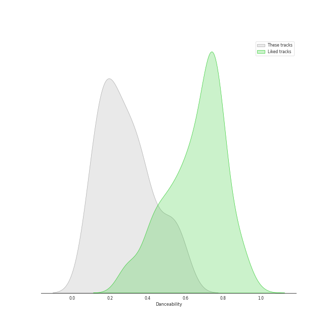
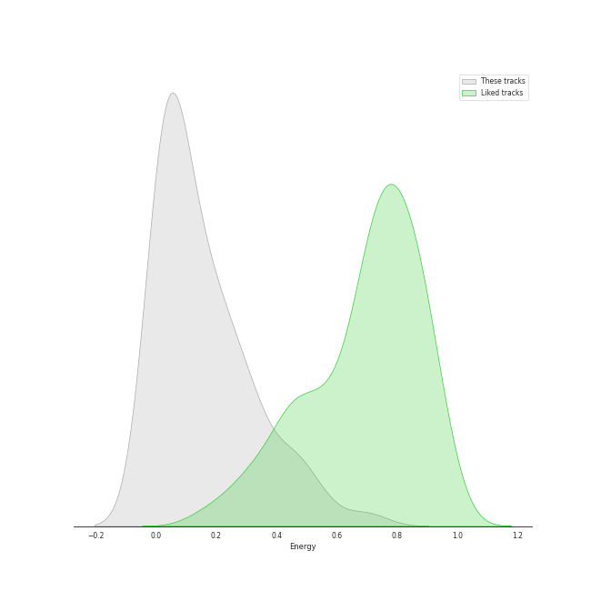
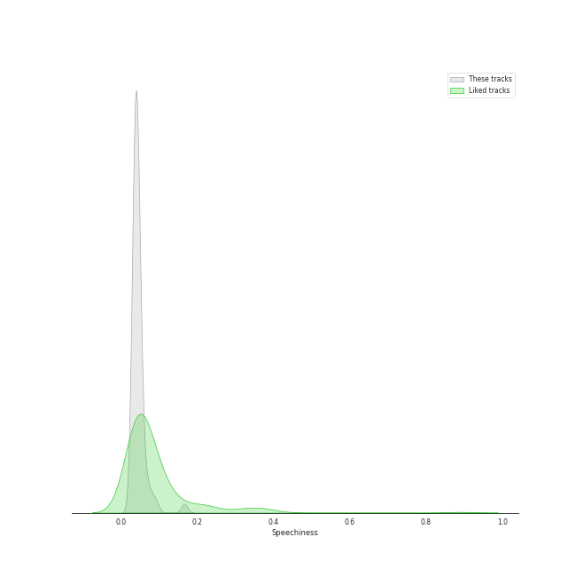
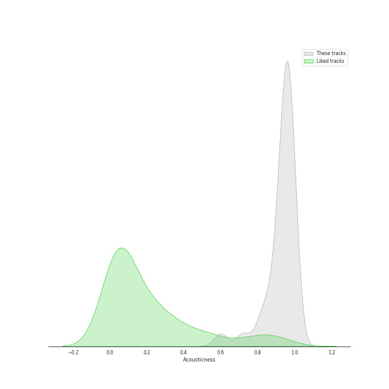
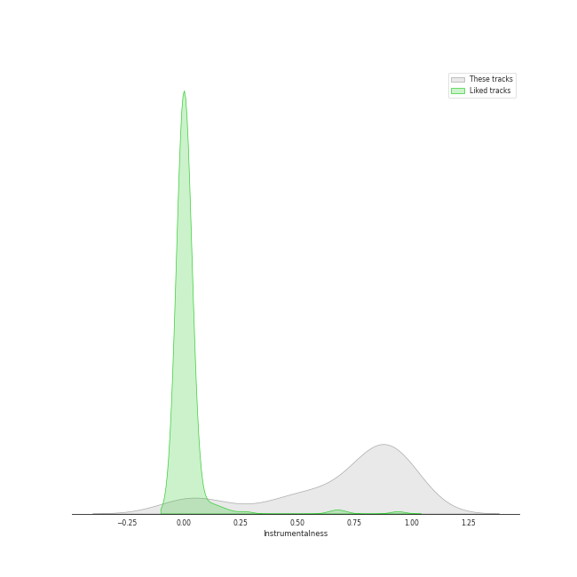
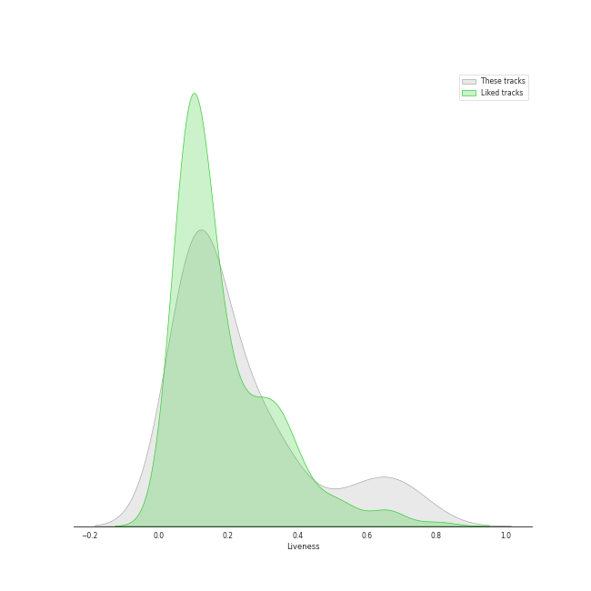
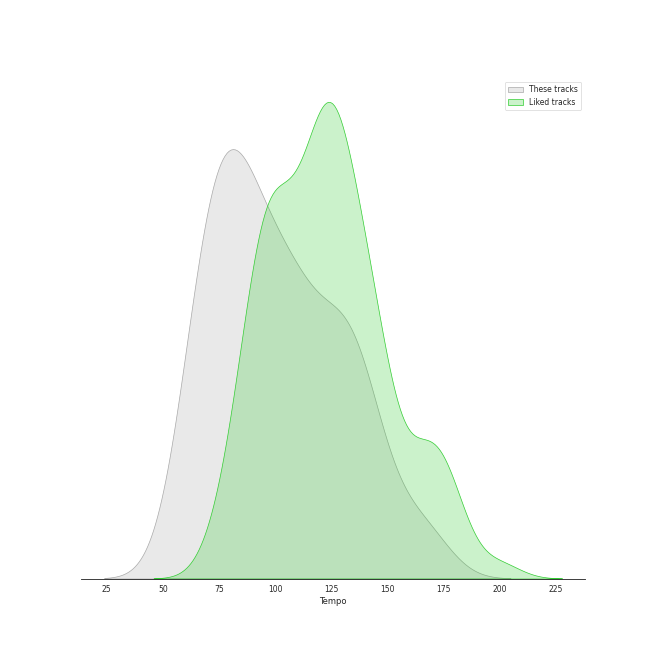

# Track Features for early modern classical

## Danceability

| ​ | 10 most Danceable tracks | ​​ | 10 least Danceable tracks |
|:---|:---|:---|:---|
|  | Le Sacre du Printemps - Revised version for Orchestra (published 1947) / Part 2: The Sacrifice: Sacrificial Dance (The Chosen One) (0.59) |  | The Firebird (L'oiseau De Feu) - Suite (1919): Round Dance Of The Princesses (0.0797) |
|  | Petrushka: Third Scene: II. Dance of the Ballerina (1911 original version) (0.58) |  | Pictures at an Exhibition (Orch. Ravel): II. The Old Castle (0.0799) |
|  | Pictures at an Exhibition (Orch. Ravel): V. Ballet of the Unhatched Chicks (0.571) |  | The Firebird (L'oiseau De Feu) - Suite (1919): Introduction (0.083) |
|  | 4 Motets pour le temps de Noël, FP 152: No. 4, Hodie Christus natus est (0.57) |  | 4 Motets pour un temps de pénitence, FP 97: No. 3, Tenebrae factae sunt (0.0963) |
|  | Pictures at an Exhibition (Orch. Ravel): Promenade III (0.543) |  | Le Sacre du Printemps - Revised version for Orchestra (published 1947) / Part 2: The Sacrifice: Mystic Circles of the Young Girls (0.108) |
|  | Le Sacre du Printemps - Revised version for Orchestra (published 1947) / Part 2: The Sacrifice: Evocation of the Ancestors (0.539) |  | Concerto for Orchestra, Sz. 116: 3. Elegia (Andante, non troppo) (0.112) |
|  | Petrushka: Fourth Scene: V. Dance of the Coachmen and Grooms (1911 original version) (0.51) |  | The Firebird (L'oiseau De Feu) - Suite (1919): Finale (0.123) |
|  | Le Sacre du Printemps - Revised version for Orchestra (published 1947) / Part 1: The Adoration of the Earth: The Augurs of Spring: Dances of the Young Girls (0.508) |  | Pictures at an Exhibition (Orch. Ravel): Promenade II (0.137) |
|  | Le Sacre du Printemps - Revised version for Orchestra (published 1947) / Part 2: The Sacrifice: Glorification of the Chosen One (0.507) |  | Petrushka: Fourth Scene: III. A Peasant Enters with a Bear (1911 original version) (0.138) |
|  | Pictures at an Exhibition (Orch. Ravel): VII. The Market at Limoges (0.48) |  | Pictures at an Exhibition (Orch. Ravel): X. The Great Gate of Kiev (0.143) |

## Energy

| ​ | 10 most Energetic tracks | ​​ | 10 least Energetic tracks |
|:---|:---|:---|:---|
|  | Le Sacre du Printemps - Revised version for Orchestra (published 1947) / Part 1: The Adoration of the Earth: Procession of the Sage (0.7) |  | Le Sacre du Printemps - Revised version for Orchestra (published 1947) / Part 1: The Adoration of the Earth: The Sage (0.000239) |
|  | Le Sacre du Printemps - Revised version for Orchestra (published 1947) / Part 1: The Adoration of the Earth: Ritual of Abduction (0.555) |  | Pictures at an Exhibition (Orch. Ravel): VIIIa. Catacombae (Sepulchrum Romanum) (0.000845) |
|  | Le Sacre du Printemps - Revised version for Orchestra (published 1947) / Part 1: The Adoration of the Earth: Dance of the Earth (0.509) |  | The Firebird (L'oiseau De Feu) - Suite (1919): Introduction (0.00108) |
|  | Le Sacre du Printemps - Revised version for Orchestra (published 1947) / Part 2: The Sacrifice: Sacrificial Dance (The Chosen One) (0.46) |  | Pictures at an Exhibition (Orch. Ravel): Promenade II (0.00371) |
|  | Petrushka: Fourth Scene: I. The Shrovetide Fair (towards evening) (1911 original version) (0.453) |  | The Firebird (L'oiseau De Feu) - Suite (1919): Berceuse (0.00403) |
|  | Le Sacre du Printemps - Revised version for Orchestra (published 1947) / Part 2: The Sacrifice: Glorification of the Chosen One (0.447) |  | The Firebird (L'oiseau De Feu) - Suite (1919): Round Dance Of The Princesses (0.00617) |
|  | Le Sacre du Printemps - Revised version for Orchestra (published 1947) / Part 1: The Adoration of the Earth: Ritual of the Rival Tribes (0.435) |  | Pictures at an Exhibition (Orch. Ravel): II. The Old Castle (0.00788) |
|  | Petrushka: Fourth Scene: VI. The Mummers (1911 original version) (0.359) |  | Pictures at an Exhibition (Orch. Ravel): VIIIb. Cum mortuis in lingua mortua (0.00794) |
|  | Petrushka: First Scene: IV. Russian Dance (1911 original version) (0.331) |  | Petrushka: First Scene: III. The Conjuring Trick (1911 original version) (0.011) |
|  | The Firebird (L'oiseau De Feu) - Suite (1919): Infernal Dance Of King Kaschei (0.325) |  | Petrushka: Fourth Scene: VII. Petrushka's Death (1911 original version) (0.0123) |

## Speechiness

| ​ | 10 most Speechy tracks | ​​ | 10 least Speechy tracks |
|:---|:---|:---|:---|
|  | The Firebird (L'oiseau De Feu) - Suite (1919): Dance Of The Firebird (0.167) |  | Le Sacre du Printemps - Revised version for Orchestra (published 1947) / Part 1: The Adoration of the Earth: Dance of the Earth (0.0292) |
|  | Le Sacre du Printemps - Revised version for Orchestra (published 1947) / Part 2: The Sacrifice: Glorification of the Chosen One (0.0935) |  | Le Sacre du Printemps - Revised version for Orchestra (published 1947) / Part 1: The Adoration of the Earth: The Augurs of Spring: Dances of the Young Girls (0.0293) |
|  | Petrushka: Fourth Scene: VI. The Mummers (1911 original version) (0.083) |  | Pictures at an Exhibition (Orch. Ravel): IV. Bydlo (0.0311) |
|  | Le Sacre du Printemps - Revised version for Orchestra (published 1947) / Part 2: The Sacrifice: Sacrificial Dance (The Chosen One) (0.0741) |  | Petrushka: Fourth Scene: III. A Peasant Enters with a Bear (1911 original version) (0.0313) |
|  | The Firebird (L'oiseau De Feu) - Suite (1919): Infernal Dance Of King Kaschei (0.0689) |  | Le Sacre du Printemps - Revised version for Orchestra (published 1947) / Part 2: The Sacrifice: Ritual Action of the Ancestors (0.0319) |
|  | Petrushka: Third Scene: III. Waltz (The Ballerina and the Moor) (1911 original version) (0.0644) |  | Pictures at an Exhibition (Orch. Ravel): Promenade III (0.0345) |
|  | Pictures at an Exhibition (Orch. Ravel): I. Gnomus (0.0571) |  | Le Sacre du Printemps - Revised version for Orchestra (published 1947) / Part 1: The Adoration of the Earth: Spring Rounds (0.0346) |
|  | 4 Motets pour un temps de pénitence, FP 97: No. 4, Tristis est anima mea (0.0568) |  | The Firebird (L'oiseau De Feu) - Suite (1919): Finale (0.0351) |
|  | Concerto for Orchestra, Sz. 116: 5. Finale (Pesante - Presto) (0.0555) |  | Pictures at an Exhibition (Orch. Ravel): X. The Great Gate of Kiev (0.0359) |
|  | Pictures at an Exhibition (Orch. Ravel): V. Ballet of the Unhatched Chicks (0.0532) |  | Petrushka: Fourth Scene: I. The Shrovetide Fair (towards evening) (1911 original version) (0.0359) |

## Acousticness

| ​ | 10 most Acoustic tracks | ​​ | 10 least Acoustic tracks |
|:---|:---|:---|:---|
|  | 4 Motets pour un temps de pénitence, FP 97: No. 1, Timor et tremor (0.995) |  | Le Sacre du Printemps - Revised version for Orchestra (published 1947) / Part 1: The Adoration of the Earth: The Sage (0.591) |
|  | 4 Motets pour un temps de pénitence, FP 97: No. 2, Vinea mea electa (0.995) |  | Le Sacre du Printemps - Revised version for Orchestra (published 1947) / Part 1: The Adoration of the Earth: Procession of the Sage (0.612) |
|  | 4 Motets pour le temps de Noël, FP 152: No. 2, Quem vidistis pastores (0.995) |  | Le Sacre du Printemps - Revised version for Orchestra (published 1947) / Part 1: The Adoration of the Earth: Dance of the Earth (0.712) |
|  | 4 Motets pour le temps de Noël, FP 152: No. 4, Hodie Christus natus est (0.995) |  | The Firebird (L'oiseau De Feu) - Suite (1919): Finale (0.73) |
|  | Pictures at an Exhibition (Orch. Ravel): Promenade II (0.994) |  | Le Sacre du Printemps - Revised version for Orchestra (published 1947) / Part 2: The Sacrifice: Sacrificial Dance (The Chosen One) (0.802) |
|  | 4 Motets pour le temps de Noël, FP 152: No. 3, Videntes stellam (0.994) |  | Petrushka: First Scene: III. The Conjuring Trick (1911 original version) (0.817) |
|  | 4 Motets pour un temps de pénitence, FP 97: No. 3, Tenebrae factae sunt (0.993) |  | Petrushka: Fourth Scene: VII. Petrushka's Death (1911 original version) (0.82) |
|  | 4 Motets pour le temps de Noël, FP 152: No. 1, Magnum mysterium (0.992) |  | Petrushka: Fourth Scene: V. Dance of the Coachmen and Grooms (1911 original version) (0.841) |
|  | 4 Motets pour un temps de pénitence, FP 97: No. 4, Tristis est anima mea (0.992) |  | Le Sacre du Printemps - Revised version for Orchestra (published 1947) / Part 2: The Sacrifice: Introduction (0.861) |
|  | Pictures at an Exhibition (Orch. Ravel): III. Tuileries Gardens (0.991) |  | The Firebird (L'oiseau De Feu) - Suite (1919): Berceuse (0.868) |

## Instrumentalness

| ​ | 10 most Instrumental tracks | ​​ | 10 least Instrumental tracks |
|:---|:---|:---|:---|
|  | Pictures at an Exhibition (Orch. Ravel): IV. Bydlo (0.983) |  | 4 Motets pour le temps de Noël, FP 152: No. 4, Hodie Christus natus est (0.000134) |
|  | Le Sacre du Printemps - Revised version for Orchestra (published 1947) / Part 1: The Adoration of the Earth: Introduction (0.972) |  | Le Sacre du Printemps - Revised version for Orchestra (published 1947) / Part 1: The Adoration of the Earth: The Sage (0.000308) |
|  | Pictures at an Exhibition (Orch. Ravel): Promenade I (0.962) |  | Petrushka: First Scene: III. The Conjuring Trick (1911 original version) (0.000393) |
|  | The Firebird (L'oiseau De Feu) - Suite (1919): Dance Of The Firebird (0.951) |  | 4 Motets pour le temps de Noël, FP 152: No. 2, Quem vidistis pastores (0.00129) |
|  | Pictures at an Exhibition (Orch. Ravel): VIIIb. Cum mortuis in lingua mortua (0.95) |  | Petrushka: Fourth Scene: VII. Petrushka's Death (1911 original version) (0.00603) |
|  | Pictures at an Exhibition (Orch. Ravel): VII. The Market at Limoges (0.948) |  | The Firebird (L'oiseau De Feu) - Suite (1919): 3. Variation Of The Firebird (0.054) |
|  | Le Sacre du Printemps - Revised version for Orchestra (published 1947) / Part 1: The Adoration of the Earth: Ritual of Abduction (0.945) |  | Pictures at an Exhibition (Orch. Ravel): VIIIa. Catacombae (Sepulchrum Romanum) (0.0557) |
|  | Petrushka: Fourth Scene: II. Dance of the Wet-Nurses (1911 original version) (0.945) |  | Le Sacre du Printemps - Revised version for Orchestra (published 1947) / Part 2: The Sacrifice: Introduction (0.0623) |
|  | Petrushka: First Scene: I. The Shrovetide Fair (Introduction) (1911 original version) (0.941) |  | 4 Motets pour un temps de pénitence, FP 97: No. 4, Tristis est anima mea (0.115) |
|  | Le Sacre du Printemps - Revised version for Orchestra (published 1947) / Part 2: The Sacrifice: Evocation of the Ancestors (0.938) |  | 4 Motets pour un temps de pénitence, FP 97: No. 1, Timor et tremor (0.17) |

## Liveness

| ​ | 10 most Live tracks | ​​ | 10 least Live tracks |
|:---|:---|:---|:---|
|  | Pictures at an Exhibition (Orch. Ravel): VIIIb. Cum mortuis in lingua mortua (0.767) |  | Pictures at an Exhibition (Orch. Ravel): Promenade IV (0.0644) |
|  | The Firebird (L'oiseau De Feu) - Suite (1919): 3. Variation Of The Firebird (0.743) |  | The Firebird (L'oiseau De Feu) - Suite (1919): Finale (0.0658) |
|  | Pictures at an Exhibition (Orch. Ravel): IX. The Hut on Chicken's Legs (0.689) |  | Le Sacre du Printemps - Revised version for Orchestra (published 1947) / Part 1: The Adoration of the Earth: Introduction (0.0674) |
|  | Le Sacre du Printemps - Revised version for Orchestra (published 1947) / Part 1: The Adoration of the Earth: The Augurs of Spring: Dances of the Young Girls (0.669) |  | Concerto for Orchestra, Sz. 116: 1. Introduzione (Andante non troppo - Allegro vivace (0.0751) |
|  | Pictures at an Exhibition (Orch. Ravel): VII. The Market at Limoges (0.65) |  | 4 Motets pour le temps de Noël, FP 152: No. 1, Magnum mysterium (0.0799) |
|  | Pictures at an Exhibition (Orch. Ravel): I. Gnomus (0.648) |  | Le Sacre du Printemps - Revised version for Orchestra (published 1947) / Part 1: The Adoration of the Earth: Dance of the Earth (0.0801) |
|  | Night on Bald Mountain (0.628) |  | 4 Motets pour le temps de Noël, FP 152: No. 3, Videntes stellam (0.0824) |
|  | Petrushka: First Scene: IV. Russian Dance (1911 original version) (0.558) |  | 4 Motets pour un temps de pénitence, FP 97: No. 1, Timor et tremor (0.0826) |
|  | Petrushka: Fourth Scene: V. Dance of the Coachmen and Grooms (1911 original version) (0.537) |  | Le Sacre du Printemps - Revised version for Orchestra (published 1947) / Part 2: The Sacrifice: Glorification of the Chosen One (0.0838) |
|  | Petrushka: Fourth Scene: I. The Shrovetide Fair (towards evening) (1911 original version) (0.505) |  | 4 Motets pour un temps de pénitence, FP 97: No. 2, Vinea mea electa (0.0856) |

## Valence

| ​ | 10 most Happy tracks | ​​ | 10 least Happy tracks |
|:---|:---|:---|:---|
|  | Petrushka: Third Scene: II. Dance of the Ballerina (1911 original version) (0.907) |  | Le Sacre du Printemps - Revised version for Orchestra (published 1947) / Part 1: The Adoration of the Earth: The Sage (0.0) |
|  | Pictures at an Exhibition (Orch. Ravel): V. Ballet of the Unhatched Chicks (0.869) |  | The Firebird (L'oiseau De Feu) - Suite (1919): Dance Of The Firebird (0.0) |
|  | Petrushka: Fourth Scene: II. Dance of the Wet-Nurses (1911 original version) (0.657) |  | Concerto for Orchestra, Sz. 116: 3. Elegia (Andante, non troppo) (0.0312) |
|  | Le Sacre du Printemps - Revised version for Orchestra (published 1947) / Part 1: The Adoration of the Earth: The Augurs of Spring: Dances of the Young Girls (0.587) |  | Pictures at an Exhibition (Orch. Ravel): II. The Old Castle (0.0345) |
|  | Pictures at an Exhibition (Orch. Ravel): VII. The Market at Limoges (0.536) |  | 4 Motets pour un temps de pénitence, FP 97: No. 4, Tristis est anima mea (0.037) |
|  | 4 Motets pour le temps de Noël, FP 152: No. 4, Hodie Christus natus est (0.521) |  | Le Sacre du Printemps - Revised version for Orchestra (published 1947) / Part 1: The Adoration of the Earth: Introduction (0.037) |
|  | Le Sacre du Printemps - Revised version for Orchestra (published 1947) / Part 1: The Adoration of the Earth: Ritual of Abduction (0.453) |  | Petrushka: Fourth Scene: VII. Petrushka's Death (1911 original version) (0.0377) |
|  | Petrushka: First Scene: IV. Russian Dance (1911 original version) (0.424) |  | Petrushka: Fourth Scene: III. A Peasant Enters with a Bear (1911 original version) (0.0379) |
|  | Pictures at an Exhibition (Orch. Ravel): Promenade III (0.397) |  | Concerto for Orchestra, Sz. 116: 1. Introduzione (Andante non troppo - Allegro vivace (0.0379) |
|  | Le Sacre du Printemps - Revised version for Orchestra (published 1947) / Part 1: The Adoration of the Earth: Ritual of the Rival Tribes (0.393) |  | Pictures at an Exhibition (Orch. Ravel): VIIIb. Cum mortuis in lingua mortua (0.038) |

## Tempo

| ​ | 10 most Fast tracks | ​​ | 10 least Fast tracks |
|:---|:---|:---|:---|
|  | 4 Motets pour le temps de Noël, FP 152: No. 2, Quem vidistis pastores (168.573) |  | Pictures at an Exhibition (Orch. Ravel): I. Gnomus (60.214) |
|  | Pictures at an Exhibition (Orch. Ravel): IX. The Hut on Chicken's Legs (165.944) |  | Petrushka: Fourth Scene: III. A Peasant Enters with a Bear (1911 original version) (63.584) |
|  | The Firebird (L'oiseau De Feu) - Suite (1919): Infernal Dance Of King Kaschei (162.033) |  | Le Sacre du Printemps - Revised version for Orchestra (published 1947) / Part 1: The Adoration of the Earth: Spring Rounds (64.022) |
|  | Jeu de cartes: III. Third Deal (148.121) |  | Le Sacre du Printemps - Revised version for Orchestra (published 1947) / Part 2: The Sacrifice: Introduction (64.987) |
|  | Petrushka: Fourth Scene: VI. The Mummers (1911 original version) (146.396) |  | 4 Motets pour un temps de pénitence, FP 97: No. 3, Tenebrae factae sunt (66.871) |
|  | Petrushka: Fourth Scene: IV. The Gypsy Girls Dance (1911 original version) (141.274) |  | 4 Motets pour un temps de pénitence, FP 97: No. 4, Tristis est anima mea (68.266) |
|  | The Firebird (L'oiseau De Feu) - Suite (1919): Dance Of The Firebird (139.059) |  | Pictures at an Exhibition (Orch. Ravel): VIIIb. Cum mortuis in lingua mortua (68.548) |
|  | Petrushka: Fourth Scene: VII. Petrushka's Death (1911 original version) (136.681) |  | Night on Bald Mountain (68.687) |
|  | Petrushka: First Scene: I. The Shrovetide Fair (Introduction) (1911 original version) (136.598) |  | Le Sacre du Printemps - Revised version for Orchestra (published 1947) / Part 1: The Adoration of the Earth: Introduction (68.971) |
|  | The Firebird (L'oiseau De Feu) - Suite (1919): Berceuse (134.82) |  | Pictures at an Exhibition (Orch. Ravel): X. The Great Gate of Kiev (69.224) |
