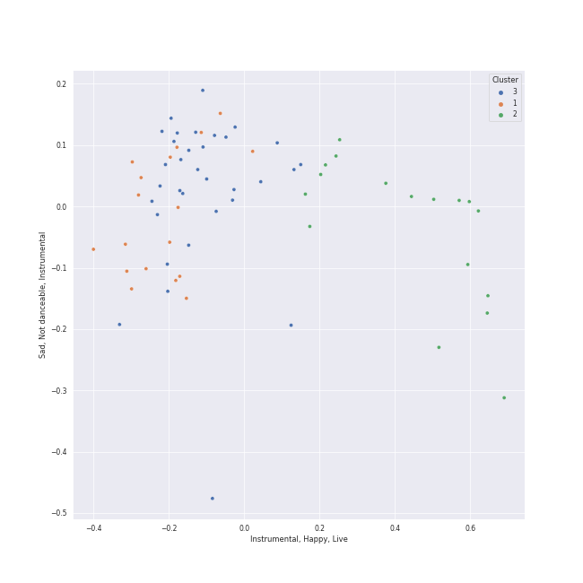

# Clusters in early modern classical

## Cluster #1

11 tracks

| Art | Track | Album | Artists | Label | 💚 | 🔗 |
|:---|:---|:---|:---|:---|:---|:---|
|  | 4 Motets pour le temps de Noël, FP 152: No. 2, Quem vidistis pastores | Poulenc: Motets and Mass | Francis Poulenc, Vlasta Mlejnková, Kühn Mixed Choir, Pavel Kühn | SUPRAPHON a.s. | | [🔗](https://open.spotify.com/track/4zQimzq6FcSoAAWj0cfvAX) |
|  | 4 Motets pour le temps de Noël, FP 152: No. 4, Hodie Christus natus est | Poulenc: Motets and Mass | Francis Poulenc, Vlasta Mlejnková, Kühn Mixed Choir, Pavel Kühn | SUPRAPHON a.s. | | [🔗](https://open.spotify.com/track/0PDnRCf3AnUUjAYSXVok55) |
|  | 4 Motets pour un temps de pénitence, FP 97: No. 1, Timor et tremor | Poulenc: Motets and Mass | Francis Poulenc, Vlasta Mlejnková, Kühn Mixed Choir, Pavel Kühn | SUPRAPHON a.s. | | [🔗](https://open.spotify.com/track/67NRQzKiJzlayRlmZ4zbKc) |
|  | 4 Motets pour un temps de pénitence, FP 97: No. 3, Tenebrae factae sunt | Poulenc: Motets and Mass | Francis Poulenc, Vlasta Mlejnková, Kühn Mixed Choir, Pavel Kühn | SUPRAPHON a.s. | | [🔗](https://open.spotify.com/track/1pEgzXriotJRGrgrmE2eHR) |
|  | 4 Motets pour un temps de pénitence, FP 97: No. 4, Tristis est anima mea | Poulenc: Motets and Mass | Francis Poulenc, Vlasta Mlejnková, Kühn Mixed Choir, Pavel Kühn | SUPRAPHON a.s. | | [🔗](https://open.spotify.com/track/0of2TShrStNkbPvZQLeiNh) |
|  | Le Sacre du Printemps - Revised version for Orchestra (published 1947) / Part 1: The Adoration of the Earth: Procession of the Sage | Stravinsky: The Rite of Spring / Bartók: Concerto for Orchestra | Igor Stravinsky, [Berliner Philharmoniker](../../../../artists/berliner_philharmoniker/overview.md), [Herbert von Karajan](../../../../artists/herbert_von_karajan/overview.md) | [Deutsche Grammophon (DG)](../../../../labels/deutsche_grammophon__dg_) | | [🔗](https://open.spotify.com/track/2QvLnMMENk5ynysBiOlAWj) |
|  | Le Sacre du Printemps - Revised version for Orchestra (published 1947) / Part 1: The Adoration of the Earth: The Sage | Stravinsky: The Rite of Spring / Bartók: Concerto for Orchestra | Igor Stravinsky, [Berliner Philharmoniker](../../../../artists/berliner_philharmoniker/overview.md), [Herbert von Karajan](../../../../artists/herbert_von_karajan/overview.md) | [Deutsche Grammophon (DG)](../../../../labels/deutsche_grammophon__dg_) | | [🔗](https://open.spotify.com/track/4VH5yqdpZBV07hlvvjZm2u) |
|  | Le Sacre du Printemps - Revised version for Orchestra (published 1947) / Part 2: The Sacrifice: Introduction | Stravinsky: The Rite of Spring / Bartók: Concerto for Orchestra | Igor Stravinsky, [Berliner Philharmoniker](../../../../artists/berliner_philharmoniker/overview.md), [Herbert von Karajan](../../../../artists/herbert_von_karajan/overview.md) | [Deutsche Grammophon (DG)](../../../../labels/deutsche_grammophon__dg_) | | [🔗](https://open.spotify.com/track/6GS9MQgfnbFp3yPL2uNAF8) |
|  | Petrushka: First Scene: III. The Conjuring Trick (1911 original version) | Stravinsky: Petrushka, Jeu de cartes | Igor Stravinsky, Valery Gergiev, Mariinsky Orchestra | [Mariinsky](../../../../labels/mariinsky) | | [🔗](https://open.spotify.com/track/5Ngr7bpBvlYNojEpw72eJ7) |
|  | Petrushka: Fourth Scene: VII. Petrushka's Death (1911 original version) | Stravinsky: Petrushka, Jeu de cartes | Igor Stravinsky, Valery Gergiev, Mariinsky Orchestra | [Mariinsky](../../../../labels/mariinsky) | | [🔗](https://open.spotify.com/track/5vmh1dWU5B7GIt4gxcTiYy) |
## Cluster #2

17 tracks

| Art | Track | Album | Artists | Label | 💚 | 🔗 |
|:---|:---|:---|:---|:---|:---|:---|
|  | Le Sacre du Printemps - Revised version for Orchestra (published 1947) / Part 1: The Adoration of the Earth: Ritual of Abduction | Stravinsky: The Rite of Spring / Bartók: Concerto for Orchestra | Igor Stravinsky, [Berliner Philharmoniker](../../../../artists/berliner_philharmoniker/overview.md), [Herbert von Karajan](../../../../artists/herbert_von_karajan/overview.md) | [Deutsche Grammophon (DG)](../../../../labels/deutsche_grammophon__dg_) | | [🔗](https://open.spotify.com/track/5oEcuGFmXXSI3mJSXDUZVL) |
|  | Le Sacre du Printemps - Revised version for Orchestra (published 1947) / Part 1: The Adoration of the Earth: Ritual of the Rival Tribes | Stravinsky: The Rite of Spring / Bartók: Concerto for Orchestra | Igor Stravinsky, [Berliner Philharmoniker](../../../../artists/berliner_philharmoniker/overview.md), [Herbert von Karajan](../../../../artists/herbert_von_karajan/overview.md) | [Deutsche Grammophon (DG)](../../../../labels/deutsche_grammophon__dg_) | | [🔗](https://open.spotify.com/track/6DmCs7oYITGEnfX7lsOe2O) |
|  | Le Sacre du Printemps - Revised version for Orchestra (published 1947) / Part 2: The Sacrifice: Glorification of the Chosen One | Stravinsky: The Rite of Spring / Bartók: Concerto for Orchestra | Igor Stravinsky, [Berliner Philharmoniker](../../../../artists/berliner_philharmoniker/overview.md), [Herbert von Karajan](../../../../artists/herbert_von_karajan/overview.md) | [Deutsche Grammophon (DG)](../../../../labels/deutsche_grammophon__dg_) | | [🔗](https://open.spotify.com/track/2l5yd2V024l1u6bJ2vmOFM) |
|  | Jeu de cartes: II. Second Deal | Stravinsky: Petrushka, Jeu de cartes | Igor Stravinsky, Valery Gergiev, Mariinsky Orchestra | [Mariinsky](../../../../labels/mariinsky) | | [🔗](https://open.spotify.com/track/01sFYbEnNAR4ZBChyKR1XG) |
|  | Jeu de cartes: III. Third Deal | Stravinsky: Petrushka, Jeu de cartes | Igor Stravinsky, Valery Gergiev, Mariinsky Orchestra | [Mariinsky](../../../../labels/mariinsky) | | [🔗](https://open.spotify.com/track/1RmGFbd7C1jv5oBNRHX7cv) |
|  | Petrushka: First Scene: I. The Shrovetide Fair (Introduction) (1911 original version) | Stravinsky: Petrushka, Jeu de cartes | Igor Stravinsky, Valery Gergiev, Mariinsky Orchestra | [Mariinsky](../../../../labels/mariinsky) | | [🔗](https://open.spotify.com/track/0aRVTTqvik5P7H0WrUwIhu) |
|  | Petrushka: First Scene: II. The Crowds (1911 original version) | Stravinsky: Petrushka, Jeu de cartes | Igor Stravinsky, Valery Gergiev, Mariinsky Orchestra | [Mariinsky](../../../../labels/mariinsky) | | [🔗](https://open.spotify.com/track/2Rb1R3QTqNACnDrwZdt5Ic) |
|  | Petrushka: First Scene: IV. Russian Dance (1911 original version) | Stravinsky: Petrushka, Jeu de cartes | Igor Stravinsky, Valery Gergiev, Mariinsky Orchestra | [Mariinsky](../../../../labels/mariinsky) | | [🔗](https://open.spotify.com/track/44YT5PBqXUE1mCPBZWX7J4) |
|  | Petrushka: Fourth Scene: IV. The Gypsy Girls Dance (1911 original version) | Stravinsky: Petrushka, Jeu de cartes | Igor Stravinsky, Valery Gergiev, Mariinsky Orchestra | [Mariinsky](../../../../labels/mariinsky) | | [🔗](https://open.spotify.com/track/1AmGUA9QW34e9clnXYFdWn) |
|  | Petrushka: Fourth Scene: VI. The Mummers (1911 original version) | Stravinsky: Petrushka, Jeu de cartes | Igor Stravinsky, Valery Gergiev, Mariinsky Orchestra | [Mariinsky](../../../../labels/mariinsky) | | [🔗](https://open.spotify.com/track/31pNUdNPljYjMahrE35C8h) |
## Cluster #3

24 tracks

| Art | Track | Album | Artists | Label | 💚 | 🔗 |
|:---|:---|:---|:---|:---|:---|:---|
|  | Concerto for Orchestra, Sz. 116: 1. Introduzione (Andante non troppo - Allegro vivace | Stravinsky: The Rite of Spring / Bartók: Concerto for Orchestra | Béla Bartók, [Berliner Philharmoniker](../../../../artists/berliner_philharmoniker/overview.md), [Herbert von Karajan](../../../../artists/herbert_von_karajan/overview.md) | [Deutsche Grammophon (DG)](../../../../labels/deutsche_grammophon__dg_) | | [🔗](https://open.spotify.com/track/2xGEjbQPRhl8fiECYoLSr6) |
|  | Concerto for Orchestra, Sz. 116: 2. Giuoco della coppie (Allegretto scherzando) | Stravinsky: The Rite of Spring / Bartók: Concerto for Orchestra | Béla Bartók, [Berliner Philharmoniker](../../../../artists/berliner_philharmoniker/overview.md), [Herbert von Karajan](../../../../artists/herbert_von_karajan/overview.md) | [Deutsche Grammophon (DG)](../../../../labels/deutsche_grammophon__dg_) | | [🔗](https://open.spotify.com/track/6Mc9Vhvj1ViMOLQsuz3tBi) |
|  | Concerto for Orchestra, Sz. 116: 3. Elegia (Andante, non troppo) | Stravinsky: The Rite of Spring / Bartók: Concerto for Orchestra | Béla Bartók, [Berliner Philharmoniker](../../../../artists/berliner_philharmoniker/overview.md), [Herbert von Karajan](../../../../artists/herbert_von_karajan/overview.md) | [Deutsche Grammophon (DG)](../../../../labels/deutsche_grammophon__dg_) | | [🔗](https://open.spotify.com/track/3WEuXrfUf7meRWvdklzN8I) |
|  | Concerto for Orchestra, Sz. 116: 5. Finale (Pesante - Presto) | Stravinsky: The Rite of Spring / Bartók: Concerto for Orchestra | Béla Bartók, [Berliner Philharmoniker](../../../../artists/berliner_philharmoniker/overview.md), [Herbert von Karajan](../../../../artists/herbert_von_karajan/overview.md) | [Deutsche Grammophon (DG)](../../../../labels/deutsche_grammophon__dg_) | | [🔗](https://open.spotify.com/track/6pTDV5wsqZaCNlgnWLhfoF) |
|  | Le Sacre du Printemps - Revised version for Orchestra (published 1947) / Part 1: The Adoration of the Earth: Spring Rounds | Stravinsky: The Rite of Spring / Bartók: Concerto for Orchestra | Igor Stravinsky, [Berliner Philharmoniker](../../../../artists/berliner_philharmoniker/overview.md), [Herbert von Karajan](../../../../artists/herbert_von_karajan/overview.md) | [Deutsche Grammophon (DG)](../../../../labels/deutsche_grammophon__dg_) | | [🔗](https://open.spotify.com/track/04l27PkpdTLSNXE1ZHtlkA) |
|  | Le Sacre du Printemps - Revised version for Orchestra (published 1947) / Part 2: The Sacrifice: Ritual Action of the Ancestors | Stravinsky: The Rite of Spring / Bartók: Concerto for Orchestra | Igor Stravinsky, [Berliner Philharmoniker](../../../../artists/berliner_philharmoniker/overview.md), [Herbert von Karajan](../../../../artists/herbert_von_karajan/overview.md) | [Deutsche Grammophon (DG)](../../../../labels/deutsche_grammophon__dg_) | | [🔗](https://open.spotify.com/track/41g1p1wDLuNnZNDLa13QIR) |
|  | The Firebird (L'oiseau De Feu) - Suite (1919): Infernal Dance Of King Kaschei | Stravinsky: The Firebird (Ballet Suite) | Igor Stravinsky, Orchestre de l'Opéra National de Paris, Myung-Whun Chung | [Deutsche Grammophon (DG)](../../../../labels/deutsche_grammophon__dg_) | | [🔗](https://open.spotify.com/track/0s2MfCDScTP72VvdNy99dy) |
|  | The Firebird (L'oiseau De Feu) - Suite (1919): Introduction | Stravinsky: The Firebird (Ballet Suite) | Igor Stravinsky, Orchestre de l'Opéra National de Paris, Myung-Whun Chung | [Deutsche Grammophon (DG)](../../../../labels/deutsche_grammophon__dg_) | | [🔗](https://open.spotify.com/track/2UWqLhazLDNaSK6PlgMhXc) |
|  | Petrushka: Second Scene: I. Petrushka's Cell (1911 original version) | Stravinsky: Petrushka, Jeu de cartes | Igor Stravinsky, Valery Gergiev, Mariinsky Orchestra | [Mariinsky](../../../../labels/mariinsky) | | [🔗](https://open.spotify.com/track/6g0qWuKnsE1js5mo4HAigx) |
|  | Petrushka: Third Scene: III. Waltz (The Ballerina and the Moor) (1911 original version) | Stravinsky: Petrushka, Jeu de cartes | Igor Stravinsky, Valery Gergiev, Mariinsky Orchestra | [Mariinsky](../../../../labels/mariinsky) | | [🔗](https://open.spotify.com/track/5Nz0PKTW9OgraAtvjYJvO9) |