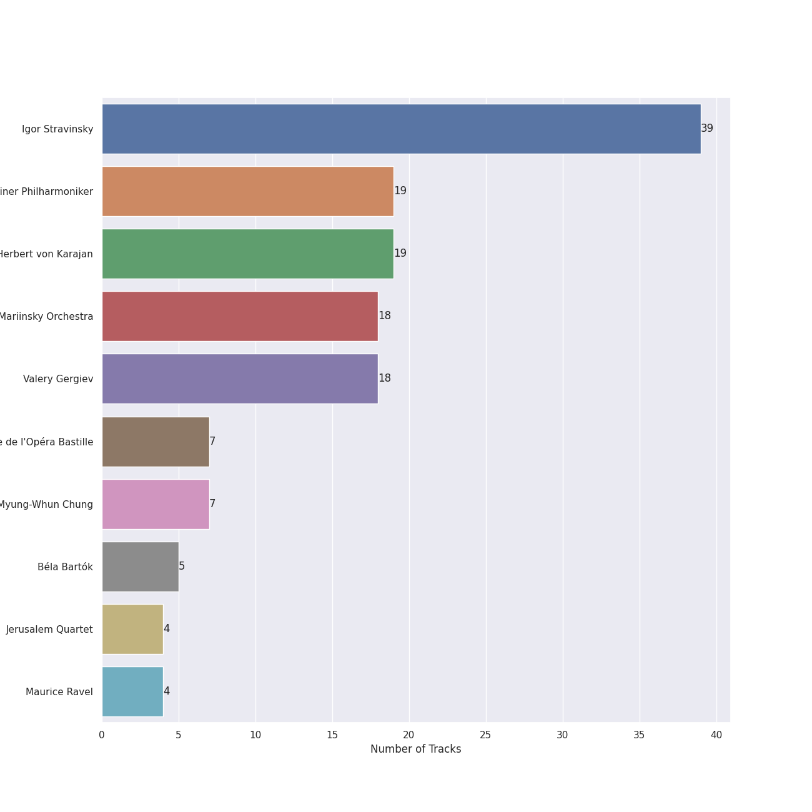
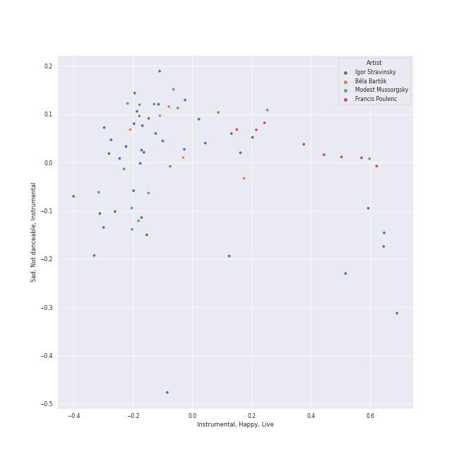
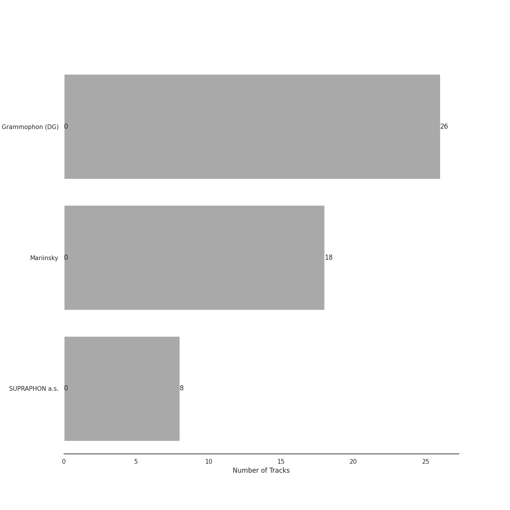
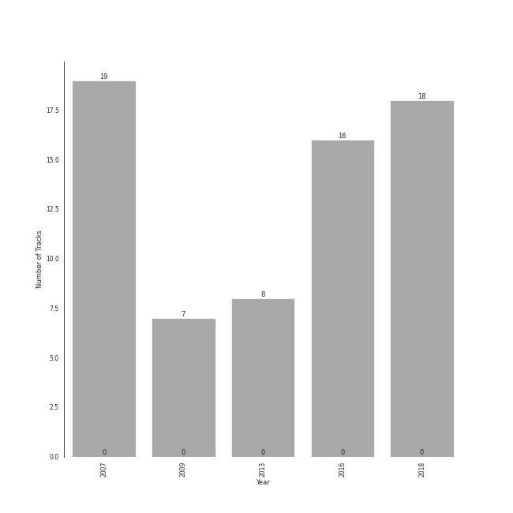

# early modern classical

68 songs

[See Track Features](audio_features.md)

[See Clusters](clusters/overview.md)

## Top Artists

| Art | Rank | Tracks | 💚 | Artist | 🔗 |
|:---|---:|---:|---:|:---|:---|
|  | 404 | 39 | 0 | Igor Stravinsky | [🔗](https://open.spotify.com/artist/7ie36YytMoKtPiL7tUvmoE) |
|  | 404 | 19 | 0 | [Berliner Philharmoniker](../../artists/berliner_philharmoniker/overview.md) | [🔗](https://open.spotify.com/artist/6uRJnvQ3f8whVnmeoecv5Z) |
|  | 404 | 19 | 0 | [Herbert von Karajan](../../artists/herbert_von_karajan/overview.md) | [🔗](https://open.spotify.com/artist/5zCaQxjl110XTrm4LQ1CxY) |
|  | 404 | 18 | 0 | Mariinsky Orchestra | [🔗](https://open.spotify.com/artist/2rRUfv2w535SEUV1YO5SP6) |
|  | 404 | 18 | 0 | Valery Gergiev | [🔗](https://open.spotify.com/artist/2LxnoYPOe0FCLC82R3xgO2) |
|  | 404 | 16 | 0 | Modest Mussorgsky | [🔗](https://open.spotify.com/artist/284mnx33IWcymQEpMxyfHl) |
|  | 404 | 16 | 0 | Gustavo Dudamel | [🔗](https://open.spotify.com/artist/0cxXnDhpgxcMMkKddhORHY) |
|  | 404 | 16 | 0 | Wiener Philharmoniker | [🔗](https://open.spotify.com/artist/003f4bk13c6Q3gAUXv7dGJ) |
|  | 404 | 8 | 0 | Kühn Mixed Choir | [🔗](https://open.spotify.com/artist/7coad48I6XW2msLS0ms53T) |
|  | 404 | 8 | 0 | Pavel Kühn | [🔗](https://open.spotify.com/artist/7bzLxD5IZSXMmuuqnZ7MfY) |

See all 15 artists

| Art | Rank | Tracks | 💚 | Artist | 🔗 |
|:---|---:|---:|---:|:---|:---|
|  | 404 | 8 | 0 | Vlasta Mlejnková | [🔗](https://open.spotify.com/artist/775Rkua0PHENjo1sFIyApV) |
|  | 404 | 8 | 0 | Francis Poulenc | [🔗](https://open.spotify.com/artist/4IAWVxo2fpTBPn6k7GZ3eY) |
|  | 404 | 7 | 0 | Myung-Whun Chung | [🔗](https://open.spotify.com/artist/4hdiwtmc6OEFFxpSlwwmby) |
|  | 404 | 7 | 0 | Orchestre de l'Opéra National de Paris | [🔗](https://open.spotify.com/artist/1hro5WQTcOb7fRCEUQEZtK) |
|  | 404 | 5 | 0 | Béla Bartók | [🔗](https://open.spotify.com/artist/5zyNXVd952fWOjkdGHCvPd) |

## Most and least listened tracks
| Rank | ​ | Most listened tracks | Rank | ​​ | Least listened tracks |
|---:|:---|:---|---:|:---|:---|
| 870 |  | Jeu de cartes: II. Second Deal | 870 |  | Pictures at an Exhibition (Orch. Ravel): Promenade II |
| 870 |  | The Rite of Spring, K15, Pt. 1: IV. Spring Rounds | 870 |  | Pictures at an Exhibition (Orch. Ravel): II. The Old Castle |
| 870 |  | Pictures at an Exhibition (Orch. Ravel): Promenade III | 870 |  | Pictures at an Exhibition (Orch. Ravel): Promenade IV |
| 870 |  | Pictures at an Exhibition (Orch. Ravel): X. The Great Gate of Kiev | 870 |  | Pictures at an Exhibition (Orch. Ravel): V. Ballet of the Unhatched Chicks |
| 870 |  | 4 Motets pour le temps de Noël, FP 152: No. 4, Hodie Christus natus est | 870 |  | Concerto for Orchestra, Sz. 116: 5. Finale (Pesante - Presto) |
| 870 |  | Petrushka: Third Scene: I. The Moor's Cell (1911 original version) | 870 |  | Pictures at an Exhibition (Orch. Ravel): VIIIa. Catacombae (Sepulchrum Romanum) |
| 870 |  | Petrushka: First Scene: I. The Shrovetide Fair (Introduction) (1911 original version) | 870 |  | Petrushka: Second Scene: I. Petrushka's Cell (1911 original version) |
| 870 |  | Petrushka: Fourth Scene: V. Dance of the Coachmen and Grooms (1911 original version) | 870 |  | Night on Bald Mountain |
| 870 |  | The Firebird (L'oiseau De Feu) - Suite (1919): Finale | 870 |  | The Firebird (L'oiseau De Feu) - Suite (1919): Berceuse |
| 870 |  | 4 Motets pour un temps de pénitence, FP 97: No. 4, Tristis est anima mea | 870 |  | Concerto for Orchestra, Sz. 116: 2. Giuoco della coppie (Allegretto scherzando) |

## Top Albums

| Art | Rank | Tracks | 💚 | Album | Release Date | 🔗 |
|:---|---:|---:|---:|:---|:---|:---|
|  | 583 | 19 | 0 | Stravinsky: The Rite of Spring / Bartók: Concerto for Orchestra | 2007-01-01 | [🔗](https://open.spotify.com/album/317b74rpNBO2uhaJFyMaxJ) |
|  | 583 | 18 | 0 | Stravinsky: Petrushka, Jeu de cartes | 2018-10-19 | [🔗](https://open.spotify.com/album/19fQbFNjlfXgBAFqftKzWA) |
|  | 583 | 16 | 0 | Mussorgsky: Pictures At An Exhibition | 2016-12-02 | [🔗](https://open.spotify.com/album/1b2aoeaYZZBWmJoavOQhnd) |
|  | 583 | 8 | 0 | Poulenc: Motets and Mass | 2013-01-30 | [🔗](https://open.spotify.com/album/6czmOzWnyfS71jDpRxZDam) |
|  | 583 | 7 | 0 | Stravinsky: The Firebird (Ballet Suite) | 2009-01-01 | [🔗](https://open.spotify.com/album/2q1xMRl4AcA7rI8GfGnmvD) |

## Top Record Labels

| Tracks | 💚 | Label |
|---:|---:|:---|
| 42 | 0 | [Deutsche Grammophon (DG)](../../labels/deutsche_grammophon_(dg)/overview.md) |
| 18 | 0 | [Mariinsky](../../labels/mariinsky/overview.md) |
| 8 | 0 | SUPRAPHON a.s. |

## Years

| ​ | 10 newest albums | ​​ | 10 oldest albums |
|:---|:---|:---|:---|
|  | Stravinsky: Petrushka, Jeu de cartes (2018-10-19) |  | Stravinsky: The Rite of Spring / Bartók: Concerto for Orchestra (2007-01-01) |
|  | Mussorgsky: Pictures At An Exhibition (2016-12-02) |  | Stravinsky: The Firebird (Ballet Suite) (2009-01-01) |
|  | Poulenc: Motets and Mass (2013-01-30) |  | Poulenc: Motets and Mass (2013-01-30) |
|  | Stravinsky: The Firebird (Ballet Suite) (2009-01-01) |  | Mussorgsky: Pictures At An Exhibition (2016-12-02) |
|  | Stravinsky: The Rite of Spring / Bartók: Concerto for Orchestra (2007-01-01) |  | Stravinsky: Petrushka, Jeu de cartes (2018-10-19) |

