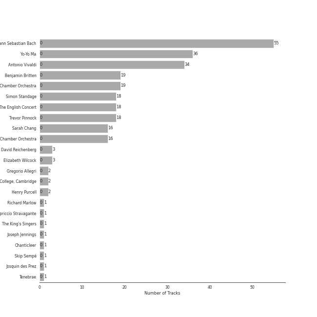
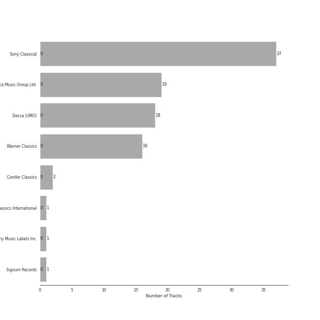

# early music

[94 songs](early_music_tracks.md)

## Top Artists

See all 23 artists

| Number of Tracks | Art | Artist | 🔗 |
|---:|:---|:---|:---|
| 55 |  | [Johann Sebastian Bach](../artists/johann_sebastian_bach.md) | [🔗](https://open.spotify.com/artist/5aIqB5nVVvmFsvSdExz408) |
| 36 |  | [Yo-Yo Ma](../artists/yo_yo_ma.md) | [🔗](https://open.spotify.com/artist/5Dl3HXZjG6ZOWT5cV375lk) |
| 34 |  | [Antonio Vivaldi](../artists/antonio_vivaldi.md) | [🔗](https://open.spotify.com/artist/2QOIawHpSlOwXDvSqQ9YJR) |
| 19 |  | [Benjamin Britten](../artists/benjamin_britten.md) | [🔗](https://open.spotify.com/artist/7MJ1pB5d6Vjmzep2zQlorn) |
| 19 |  | [English Chamber Orchestra](../artists/english_chamber_orchestra.md) | [🔗](https://open.spotify.com/artist/2DO4p3CPDnInsJfg0jFfaF) |
| 18 |  | [Simon Standage](../artists/simon_standage.md) | [🔗](https://open.spotify.com/artist/2jIBkRzVUboTbp05rJnKeT) |
| 18 |  | [The English Concert](../artists/the_english_concert.md) | [🔗](https://open.spotify.com/artist/2Oz3z7PPQUMU2KNYgcO1sA) |
| 18 |  | [Trevor Pinnock](../artists/trevor_pinnock.md) | [🔗](https://open.spotify.com/artist/25mbgceDJKxXGP8c5FmC83) |
| 16 |  | [Sarah Chang](../artists/sarah_chang.md) | [🔗](https://open.spotify.com/artist/5duxfFAQVkDT9g261fKlMP) |
| 16 |  | [Orpheus Chamber Orchestra](../artists/orpheus_chamber_orchestra.md) | [🔗](https://open.spotify.com/artist/35pZsti1RSA5Zv98jAm8kX) |
| 3 |  | David Reichenberg | [🔗](https://open.spotify.com/artist/5xA5sW0D3BUAyL02XcDkYv) |
| 3 |  | Elizabeth Wilcock | [🔗](https://open.spotify.com/artist/1OfYCRcS14pyRVrO0qTCbs) |
| 2 |  | Gregorio Allegri | [🔗](https://open.spotify.com/artist/4I47QTluHCo2t2Gj6V7AIG) |
| 2 |  | The Choir Of Trinity College, Cambridge | [🔗](https://open.spotify.com/artist/3x8rZy1i6FwWOWKwfRT1Ab) |
| 2 |  | Henry Purcell | [🔗](https://open.spotify.com/artist/3tMLo1k3iUo82coMLWXzxq) |
| 1 |  | Richard Marlow | [🔗](https://open.spotify.com/artist/7rrfp80BJeAa0lpBnNgRNK) |
| 1 |  | Capriccio Stravagante | [🔗](https://open.spotify.com/artist/7Hb8ewIvJmuQPAQ5MMVXJE) |
| 1 |  | [The King's Singers](../artists/the_king_s_singers.md) | [🔗](https://open.spotify.com/artist/5lR7yDVN4z9kahOiUSlMhe) |
| 1 |  | Joseph Jennings | [🔗](https://open.spotify.com/artist/5A3ntUGTCKttzOwkoF9AUY) |
| 1 |  | Chanticleer | [🔗](https://open.spotify.com/artist/4p6DfIA6NnKmWeRgDJPLT0) |
| 1 |  | Skip Sempé | [🔗](https://open.spotify.com/artist/3DSclbx4DSkyIvouHCxHHZ) |
| 1 |  | Josquin des Prez | [🔗](https://open.spotify.com/artist/31f23hmZawdqgp0sECAzE8) |
| 1 |  | Tenebrae | [🔗](https://open.spotify.com/artist/0vUnn6Eje2O5yxEj35touD) |

## Top Albums

See all 8 albums

| Number of Tracks | Art | Album | Release Date | 🔗 |
|---:|:---|:---|:---|:---|
| 36 |  | Bach: Unaccompanied Cello Suites (Remastered) | 1983 | [🔗](https://open.spotify.com/album/2OpnKgmVYPEN2GldgBponI) |
| 19 |  | Bach, J.S.: Brandenburg Concertos etc. | 1995-01-01 | [🔗](https://open.spotify.com/album/11FzhwtOFCPB4vpgWo33xV) |
| 18 |  | Vivaldi: Four Seasons | 2008-01-01 | [🔗](https://open.spotify.com/album/4Uc1Cus3I9LjkI2XwtQnfc) |
| 16 |  | Vivaldi: The Four Seasons. | 2007-10-01 | [🔗](https://open.spotify.com/album/4YpaKMCcb65yOoee75UUOh) |
| 2 |  | Allegri - Miserere | 1994-02-15 | [🔗](https://open.spotify.com/album/6DXPSePAsqcD40WQsSnasD) |
| 1 |  | Purcell : Anthems & Sacred Songs [Evening Prayer] | 2003-08-29 | [🔗](https://open.spotify.com/album/7K8qhv7euF0xd6DiqoReDK) |
| 1 |  | Cappella | 2013 | [🔗](https://open.spotify.com/album/3n6JxpdWnHkazMCQxKK5qI) |
| 1 |  | Allegri Miserere | 2006-10-03 | [🔗](https://open.spotify.com/album/3fvFlaBBbAFO0QCrSTbfaU) |

## Top Record Labels

See all 8 labels

| Number of Tracks | Label |
|---:|:---|
| 37 | [Sony Classical](../labels/sony_classical.md) |
| 19 | [Decca Music Group Ltd.](../labels/decca_music_group_ltd_.md) |
| 18 | [Decca (UMO)](../labels/decca__umo_.md) |
| 16 | [Warner Classics](../labels/warner_classics.md) |
| 2 | Conifer Classics |
| 1 | Warner Classics International |
| 1 | [Sony Music Labels Inc.](../labels/sony_music_labels_inc_.md) |
| 1 | Signum Records |

## Audio Features

| 10 most Danceable tracks | 10 least Danceable tracks |
|:---|:---|
| Brandenburg Concerto No. 2 in F, BWV 1047: 3. Allegro assai | Cello Suite No. 5 in C Minor, BWV 1011: IV. Sarabande |
| Brandenburg Concerto No. 2 in F, BWV 1047: 1. (Allegro) | Cello Suite No. 2 in D Minor, BWV 1008: IV. Sarabande |
| Concerto for Oboe, Violin, Strings and Continuo in B Flat Major, RV 548: I. (Allegro) | Cello Suite No. 5 in C Minor, BWV 1011: II. Allemande |
| Concerto for Oboe, Violin, Strings and Continuo in B Flat Major, RV 548: III. Allegro | Concerto for Violin and Strings in E Major, Op. 8, No. 1, RV 269 "La Primavera": II. Largo |
| Vivaldi: L'estro armonico, Violin Concerto in A Minor, Op. 3 No. 6, RV 356: I. Allegro | Cello Suite No. 1 in G Major, BWV 1007: IV. Sarabande |
| Brandenburg Concerto No. 3 in G, BWV 1048: 3. Allegro | Brandenburg Concerto No. 6 in B flat, BWV 1051: 2. Adagio ma non tanto |
| Violin Concerto in E Major, Op. 8, No. 1, RV 269 "La Primavera": I. Allegro | Cello Suite No. 3 in C Major, BWV 1009: IV. Sarabande |
| Brandenburg Concerto No. 1 in F, BWV 1046: 5. Polacca; Trio II | Cello Suite No. 4 in E-Flat Major, BWV 1010: IV. Sarabande |
| Vivaldi: Violin Concerto in G Minor, Op. 12 No. 1, RV 317: I. Allegro aperto | Cello Suite No. 6 in D Major, BWV 1012: II. Allemande |
| Brandenburg Concerto No. 6 in B flat, BWV 1051: 3. Allegro | Cello Suite No. 6 in D Major, BWV 1012: IV. Sarabande |

| 10 most Energetic tracks | 10 least Energetic tracks |
|:---|:---|
| Violin Concerto in G Minor, Op. 8, No. 2, RV 315 "L'estate": III. Presto (Tempo impetuoso d'estate) | Vivaldi: The Four Seasons, Violin Concerto in F Major, Op. 8 No. 3, RV 293 "Autumn": II. Adagio molto |
| Vivaldi: The Four Seasons, Violin Concerto in G Minor, Op. 8 No. 2, RV 315 "Summer": III. Presto | Cello Suite No. 5 in C Minor, BWV 1011: IV. Sarabande |
| Brandenburg Concerto No. 2 in F, BWV 1047: 3. Allegro assai | Miserere mei, Deus |
| Brandenburg Concerto No. 3 in G, BWV 1048: 3. Allegro | Concerto for Violin and Strings in F Major, Op. 8, No. 3, RV 293 "L'autunno": II. Adagio molto (Ubriachi dormienti) |
| Brandenburg Concerto No. 2 in F, BWV 1047: 1. (Allegro) | Hear my prayer, O Lord |
| Brandenburg Concerto No. 4 in G, BWV 1049: 3. Presto | Vivaldi: The Four Seasons, Violin Concerto in G Minor, Op. 8 No. 2, RV 315 "Summer": II. Adagio |
| Brandenburg Concerto No. 1 in F, BWV 1046: 3. Allegro | Concerto for Oboe, Violin, Strings and Continuo in B Flat Major, RV 548: II. Largo |
| Violin Concerto in F Minor, Op. 8, No. 4, RV 297 "L'inverno": I. Allegro non molto | Cello Suite No. 1 in G Major, BWV 1007: IV. Sarabande |
| Brandenburg Concerto No. 1 in F, BWV 1046: 1. (Allegro) | Vivaldi: Violin Concerto in G Minor, Op. 12 No. 1, RV 317: II. Largo |
| Brandenburg Concerto No. 3 in G, BWV 1048: 1. (Allegro) | Vivaldi: The Four Seasons, Violin Concerto in E Major, Op. 8 No. 1, RV 269 "Spring": II. Largo e pianissimo sempre |

| 10 most Speechy tracks | 10 least Speechy tracks |
|:---|:---|
| Vivaldi: The Four Seasons, Violin Concerto in F Minor, Op. 8 No. 4, RV 297 "Winter": III. Allegro | Violin Concerto in G Minor, Op. 8, No. 2, RV 315 "L'estate": III. Presto (Tempo impetuoso d'estate) |
| Cello Suite No. 1 in G Major, BWV 1007: II. Allemande | Concerto for Oboe, Violin, Strings and Continuo in B Flat Major, RV 548: III. Allegro |
| Cello Suite No. 6 in D Major, BWV 1012: I. Prélude | Violin Concerto in E Major, Op. 8, No. 1, RV 269 "La Primavera": I. Allegro |
| Cello Suite No. 1 in G Major, BWV 1007: I. Prélude | Concerto for Violin and Strings in F Major, Op. 8, No. 3, RV 293 "L'autunno": II. Adagio molto (Ubriachi dormienti) |
| Brandenburg Concerto No. 5 in D, BWV 1050: 3. Allegro | Concerto for Violin and Strings in E Major, Op. 8, No. 1, RV 269 "La Primavera": III. Allegro (Danza pastorale) |
| Brandenburg Concerto No. 3 in G, BWV 1048: 1. (Allegro) | Concerto for Oboe, Violin, Strings and Continuo in B Flat Major, RV 548: I. (Allegro) |
| Brandenburg Concerto No. 2 in F, BWV 1047: 3. Allegro assai | Brandenburg Concerto No. 4 in G, BWV 1049: 3. Presto |
| Brandenburg Concerto No. 4 in G, BWV 1049: 1. Allegro | Cello Suite No. 1 in G Major, BWV 1007: III. Courante |
| Concerto for 2 Violins, Strings and Continuo in G Major, RV 516: I. Allegro molto | Purcell: Hear My Prayer, O Lord, Z. 15 |
| Cello Suite No. 1 in G Major, BWV 1007: VI. Gigue | Brandenburg Concerto No. 1 in F, BWV 1046: 2. Adagio |

| 10 most Acoustic tracks | 10 least Acoustic tracks |
|:---|:---|
| Ave Maria | Vivaldi: The Four Seasons, Violin Concerto in F Major, Op. 8 No. 3, RV 293 "Autumn": II. Adagio molto |
| Purcell: Hear My Prayer, O Lord, Z. 15 | Concerto for Violin and Strings in F Major, Op. 8, No. 3, RV 293 "L'autunno": II. Adagio molto (Ubriachi dormienti) |
| Hear my prayer, O Lord | Vivaldi: The Four Seasons, Violin Concerto in F Minor, Op. 8 No. 4, RV 297 "Winter": II. Largo |
| Miserere mei, Deus | Concerto for Violin and Strings in E Major, Op. 8, No. 1, RV 269 "La Primavera": III. Allegro (Danza pastorale) |
| Cello Suite No. 6 in D Major, BWV 1012: I. Prélude | Violin Concerto in F Minor, Op. 8, No. 4, RV 297 "L'inverno": II. Largo |
| Cello Suite No. 6 in D Major, BWV 1012: II. Allemande | Vivaldi: The Four Seasons, Violin Concerto in G Minor, Op. 8 No. 2, RV 315 "Summer": I. Allegro non molto |
| Cello Suite No. 2 in D Minor, BWV 1008: V. Menuets I & II | Vivaldi: The Four Seasons, Violin Concerto in E Major, Op. 8 No. 1, RV 269 "Spring": III. Allegro |
| Cello Suite No. 6 in D Major, BWV 1012: V. Gavottes I & II | Concerto for Violin and Strings in G Minor, Op. 8, No. 2, RV 315 "L'estate": I. Allegro non molto - Allegro |
| Brandenburg Concerto No. 1 in F, BWV 1046: 4. Menuetto: Trio I | Concerto for Oboe, Violin, Strings and Continuo in B Flat Major, RV 548: II. Largo |
| Vivaldi: The Four Seasons, Violin Concerto in E Major, Op. 8 No. 1, RV 269 "Spring": II. Largo e pianissimo sempre | Brandenburg Concerto No. 1 in F, BWV 1046: 2. Adagio |

| 10 most Instrumental tracks | 10 least Instrumental tracks |
|:---|:---|
| Cello Suite No. 2 in D Minor, BWV 1008: I. Prélude | Violin Concerto in F Minor, Op. 8, No. 4, RV 297 "L'inverno": II. Largo |
| Cello Suite No. 2 in D Minor, BWV 1008: III. Courante | Concerto for Violin and Strings in F Major, Op. 8, No. 3, RV 293 "L'autunno": II. Adagio molto (Ubriachi dormienti) |
| Cello Suite No. 2 in D Minor, BWV 1008: II. Allemande | Concerto for 2 Violins, Strings and Continuo in G Major, RV 516: II. Andante (molto) |
| Cello Suite No. 5 in C Minor, BWV 1011: II. Allemande | Concerto for Violin and Strings in E Major, Op. 8, No. 1, RV 269 "La Primavera": III. Allegro (Danza pastorale) |
| Cello Suite No. 4 in E-Flat Major, BWV 1010: III. Courante | Concerto for 2 Violins, Strings and Continuo in G Major, RV 516: I. Allegro molto |
| Cello Suite No. 3 in C Major, BWV 1009: V. Bourrées I & II | Concerto for 2 Violins, Strings and Continuo in G Major, RV 516: III. Allegro |
| Cello Suite No. 2 in D Minor, BWV 1008: VI. Gigue | Vivaldi: The Four Seasons, Violin Concerto in F Minor, Op. 8 No. 4, RV 297 "Winter": II. Largo |
| Cello Suite No. 5 in C Minor, BWV 1011: VI. Gigue | Violin Concerto in F Minor, Op. 8, No. 4, RV 297 "L'inverno": III. Allegro |
| Cello Suite No. 6 in D Major, BWV 1012: III. Courante | Concerto for Violin and Strings in G Minor, Op. 8, No. 2, RV 315 "L'estate": I. Allegro non molto - Allegro |
| Cello Suite No. 1 in G Major, BWV 1007: II. Allemande | Concerto for Violin and Strings in G Minor, Op. 8, No. 2, RV 315 "L'estate": II. Adagio - Presto - Adagio |

| 10 most Live tracks | 10 least Live tracks |
|:---|:---|
| Cello Suite No. 6 in D Major, BWV 1012: V. Gavottes I & II | Concerto for Violin and Strings in F Major, Op. 8, No. 3, RV 293 "L'autunno": II. Adagio molto (Ubriachi dormienti) |
| Brandenburg Concerto No. 4 in G, BWV 1049: 1. Allegro | Concerto for Violin and Strings in E Major, Op. 8, No. 1, RV 269 "La Primavera": III. Allegro (Danza pastorale) |
| Concerto for Oboe, Violin, Strings and Continuo in B Flat Major, RV 548: I. (Allegro) | Vivaldi: The Four Seasons, Violin Concerto in F Minor, Op. 8 No. 4, RV 297 "Winter": I. Allegro non molto |
| Vivaldi: The Four Seasons, Violin Concerto in G Minor, Op. 8 No. 2, RV 315 "Summer": II. Adagio | Vivaldi: The Four Seasons, Violin Concerto in E Major, Op. 8 No. 1, RV 269 "Spring": II. Largo e pianissimo sempre |
| Violin Concerto in G Minor, Op. 8, No. 2, RV 315 "L'estate": III. Presto (Tempo impetuoso d'estate) | Concerto for Violin and Strings in E Major, Op. 8, No. 1, RV 269 "La Primavera": II. Largo |
| Cello Suite No. 4 in E-Flat Major, BWV 1010: II. Allemande | Violin Concerto in F Major, Op. 8, No. 3, RV 293 "L'autunno": I. Allegro (Ballo, e canto de' villanelli) |
| Cello Suite No. 3 in C Major, BWV 1009: I. Prélude | Concerto for 2 Violins, Strings and Continuo in G Major, RV 516: III. Allegro |
| Brandenburg Concerto No. 4 in G, BWV 1049: 3. Presto | Cello Suite No. 1 in G Major, BWV 1007: I. Prélude |
| Cello Suite No. 1 in G Major, BWV 1007: V. Menuets I & II | Violin Concerto in F Minor, Op. 8, No. 4, RV 297 "L'inverno": I. Allegro non molto |
| Concerto for Violin and Strings in G Minor, Op. 8, No. 2, RV 315 "L'estate": II. Adagio - Presto - Adagio | Miserere mei, Deus |

| 10 most Happy tracks | 10 least Happy tracks |
|:---|:---|
| Brandenburg Concerto No. 2 in F, BWV 1047: 3. Allegro assai | Miserere mei, Deus |
| Cello Suite No. 3 in C Major, BWV 1009: III. Courante | Vivaldi: The Four Seasons, Violin Concerto in F Major, Op. 8 No. 3, RV 293 "Autumn": II. Adagio molto |
| Cello Suite No. 4 in E-Flat Major, BWV 1010: VI. Gigue | Miserere |
| Cello Suite No. 2 in D Minor, BWV 1008: III. Courante | Hear my prayer, O Lord |
| Cello Suite No. 6 in D Major, BWV 1012: V. Gavottes I & II | Concerto for Violin and Strings in F Major, Op. 8, No. 3, RV 293 "L'autunno": II. Adagio molto (Ubriachi dormienti) |
| Brandenburg Concerto No. 3 in G, BWV 1048: 3. Allegro | Vivaldi: The Four Seasons, Violin Concerto in G Minor, Op. 8 No. 2, RV 315 "Summer": II. Adagio |
| Brandenburg Concerto No. 2 in F, BWV 1047: 1. (Allegro) | Purcell: Hear My Prayer, O Lord, Z. 15 |
| Brandenburg Concerto No. 1 in F, BWV 1046: 3. Allegro | Brandenburg Concerto No. 1 in F, BWV 1046: 2. Adagio |
| Cello Suite No. 6 in D Major, BWV 1012: III. Courante | Vivaldi: Violin Concerto in G Minor, Op. 12 No. 1, RV 317: II. Largo |
| Cello Suite No. 2 in D Minor, BWV 1008: VI. Gigue | Cello Suite No. 2 in D Minor, BWV 1008: IV. Sarabande |
