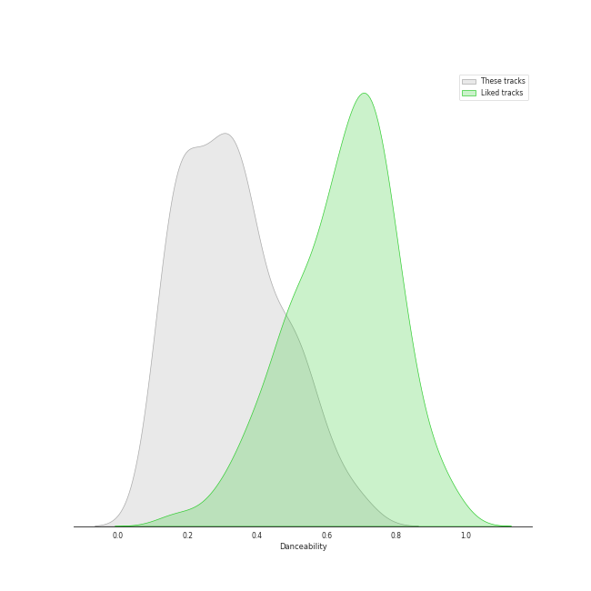
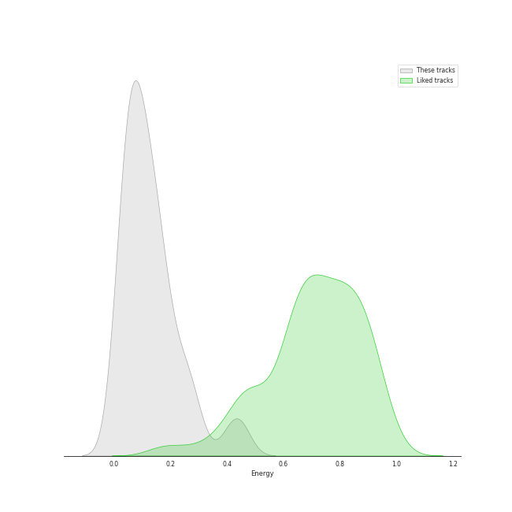
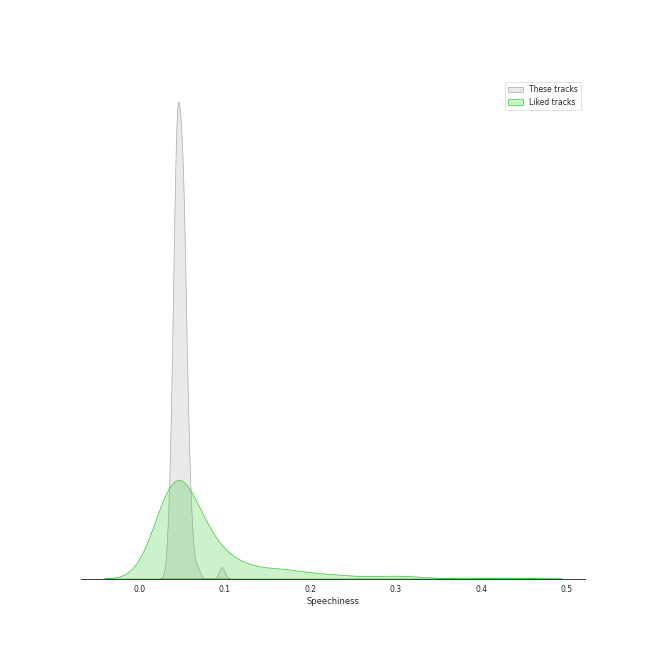
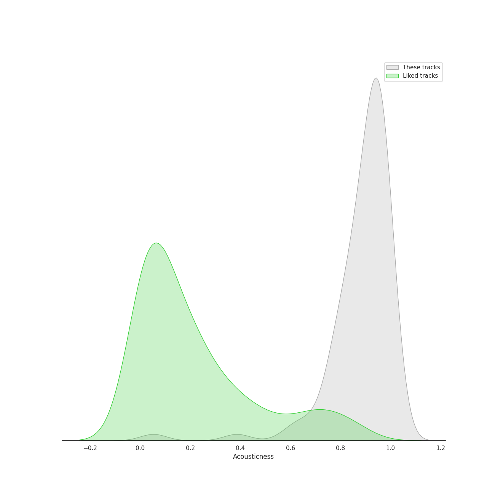
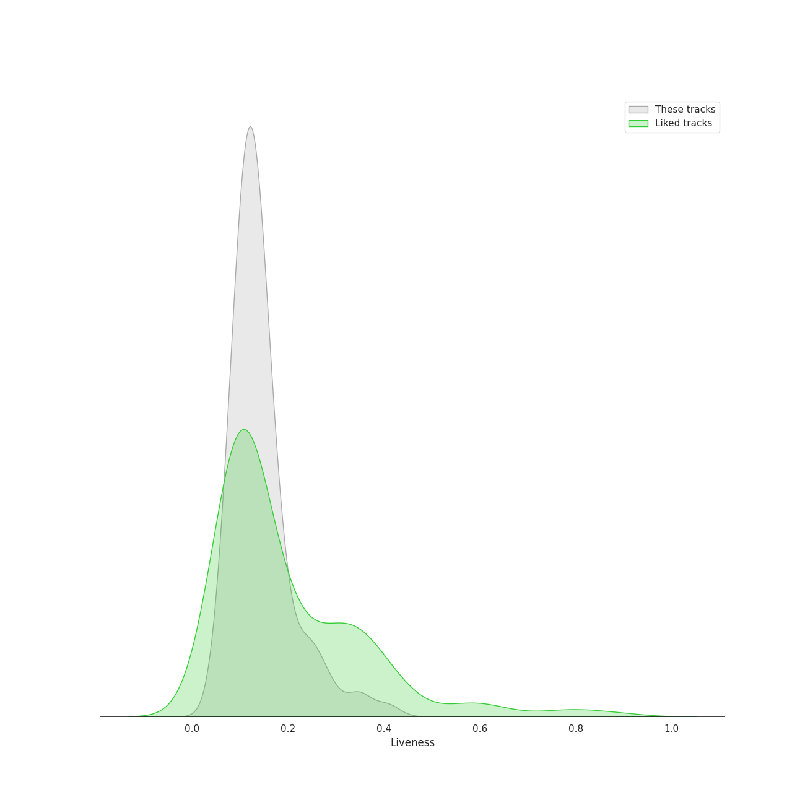
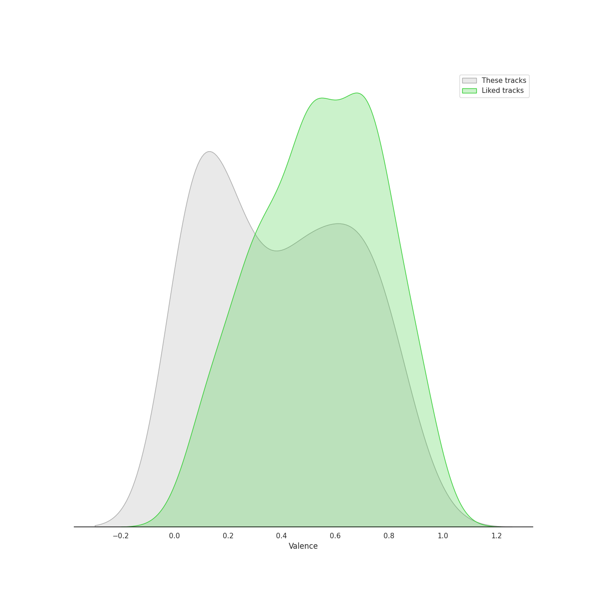
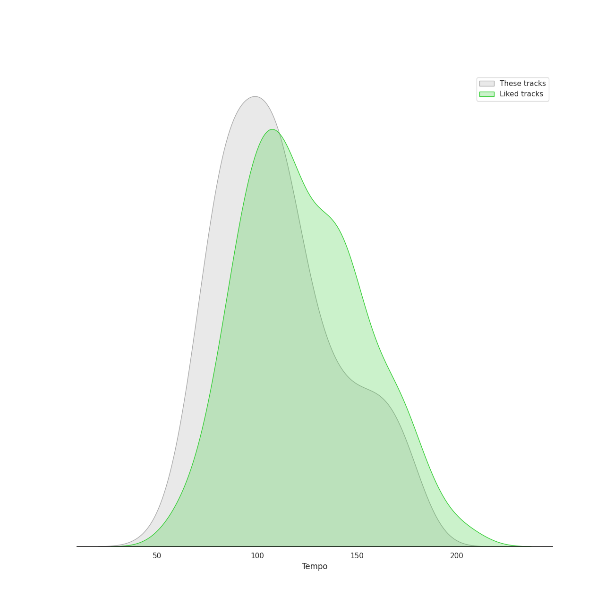

# Track Features for early music

## Danceability

| ​ | 10 most Danceable tracks | ​​ | 10 least Danceable tracks |
|:---|:---|:---|:---|
|  | Brandenburg Concerto No. 2 in F, BWV 1047: 3. Allegro assai (0.691) |  | Cello Suite No. 2 in D Minor, BWV 1008: IV. Sarabande (0.106) |
|  | Brandenburg Concerto No. 2 in F, BWV 1047: 1. (Allegro) (0.687) |  | Cello Suite No. 4 in E-Flat Major, BWV 1010: IV. Sarabande (0.108) |
|  | Concerto for Oboe, Violin, Strings and Continuo in B Flat Major, RV 548: III. Allegro (0.602) |  | Brandenburg Concerto No. 6 in B flat, BWV 1051: 2. Adagio ma non tanto (0.115) |
|  | Vivaldi: L'estro armonico, Violin Concerto in A Minor, Op. 3 No. 6, RV 356: I. Allegro (0.601) |  | Brandenburg Concerto No. 2 in F, BWV 1047: 2. Andante (0.146) |
|  | Concerto for Oboe, Violin, Strings and Continuo in B Flat Major, RV 548: I. (Allegro) (0.597) |  | Vivaldi: The Four Seasons, Violin Concerto in G Minor, Op. 8 No. 2, RV 315 "Summer": II. Adagio (0.147) |
|  | Brandenburg Concerto No. 3 in G, BWV 1048: 3. Allegro (0.594) |  | Cello Suite No. 6 in D Major, BWV 1012: II. Allemande (0.147) |
|  | Brandenburg Concerto No. 1 in F, BWV 1046: 5. Polacca; Trio II (0.534) |  | Miserere (0.15) |
|  | Vivaldi: Violin Concerto in G Minor, Op. 12 No. 1, RV 317: I. Allegro aperto (0.534) |  | Ave Maria (0.15) |
|  | Brandenburg Concerto No. 6 in B flat, BWV 1051: 3. Allegro (0.528) |  | Purcell: Hear My Prayer, O Lord, Z. 15 (0.151) |
|  | Vivaldi: Violin Concerto in G Minor, Op. 12 No. 1, RV 317: III. Allegro (0.528) |  | Hear my prayer, O Lord (0.153) |

## Energy

| ​ | 10 most Energetic tracks | ​​ | 10 least Energetic tracks |
|:---|:---|:---|:---|
|  | Violin Concerto in G Minor, Op. 8, No. 2, RV 315 "L'estate": III. Presto (Tempo impetuoso d'estate) (0.449) |  | Vivaldi: The Four Seasons, Violin Concerto in F Major, Op. 8 No. 3, RV 293 "Autumn": II. Adagio molto (0.00782) |
|  | Vivaldi: The Four Seasons, Violin Concerto in G Minor, Op. 8 No. 2, RV 315 "Summer": III. Presto (0.445) |  | Cello Suite No. 5 in C Minor, BWV 1011: IV. Sarabande (0.0141) |
|  | Brandenburg Concerto No. 2 in F, BWV 1047: 3. Allegro assai (0.441) |  | Miserere mei, Deus (0.0199) |
|  | Brandenburg Concerto No. 3 in G, BWV 1048: 3. Allegro (0.426) |  | Concerto for Violin and Strings in F Major, Op. 8, No. 3, RV 293 "L'autunno": II. Adagio molto (Ubriachi dormienti) (0.0216) |
|  | Brandenburg Concerto No. 2 in F, BWV 1047: 1. (Allegro) (0.398) |  | Hear my prayer, O Lord (0.0236) |
|  | Brandenburg Concerto No. 4 in G, BWV 1049: 3. Presto (0.286) |  | Vivaldi: The Four Seasons, Violin Concerto in G Minor, Op. 8 No. 2, RV 315 "Summer": II. Adagio (0.0243) |
|  | Brandenburg Concerto No. 1 in F, BWV 1046: 3. Allegro (0.284) |  | Cello Suite No. 1 in G Major, BWV 1007: IV. Sarabande (0.026) |
|  | Violin Concerto in F Minor, Op. 8, No. 4, RV 297 "L'inverno": I. Allegro non molto (0.282) |  | Concerto for Oboe, Violin, Strings and Continuo in B Flat Major, RV 548: II. Largo (0.027) |
|  | Brandenburg Concerto No. 1 in F, BWV 1046: 1. (Allegro) (0.275) |  | Vivaldi: Violin Concerto in G Minor, Op. 12 No. 1, RV 317: II. Largo (0.0288) |
|  | Brandenburg Concerto No. 3 in G, BWV 1048: 1. (Allegro) (0.26) |  | Vivaldi: The Four Seasons, Violin Concerto in E Major, Op. 8 No. 1, RV 269 "Spring": II. Largo e pianissimo sempre (0.0289) |

## Speechiness

| ​ | 10 most Speechy tracks | ​​ | 10 least Speechy tracks |
|:---|:---|:---|:---|
|  | Vivaldi: The Four Seasons, Violin Concerto in F Minor, Op. 8 No. 4, RV 297 "Winter": III. Allegro (0.0963) |  | Violin Concerto in G Minor, Op. 8, No. 2, RV 315 "L'estate": III. Presto (Tempo impetuoso d'estate) (0.0336) |
|  | Cello Suite No. 1 in G Major, BWV 1007: I. Prélude (0.0688) |  | Concerto for Oboe, Violin, Strings and Continuo in B Flat Major, RV 548: III. Allegro (0.0352) |
|  | Brandenburg Concerto No. 5 in D, BWV 1050: 3. Allegro (0.0596) |  | Concerto for Violin and Strings in F Major, Op. 8, No. 3, RV 293 "L'autunno": II. Adagio molto (Ubriachi dormienti) (0.0374) |
|  | Cello Suite No. 2 in D Minor, BWV 1008: II. Allemande (0.0578) |  | Concerto for Oboe, Violin, Strings and Continuo in B Flat Major, RV 548: I. (Allegro) (0.0377) |
|  | Cello Suite No. 6 in D Major, BWV 1012: I. Prélude (0.0577) |  | Brandenburg Concerto No. 4 in G, BWV 1049: 3. Presto (0.038) |
|  | Brandenburg Concerto No. 3 in G, BWV 1048: 1. (Allegro) (0.0572) |  | Concerto for Violin and Strings in E Major, Op. 8, No. 1, RV 269 "La Primavera": III. Allegro (Danza pastorale) (0.0383) |
|  | Cello Suite No. 5 in C Minor, BWV 1011: VI. Gigue (0.0572) |  | Purcell: Hear My Prayer, O Lord, Z. 15 (0.0397) |
|  | Brandenburg Concerto No. 2 in F, BWV 1047: 3. Allegro assai (0.0568) |  | Brandenburg Concerto No. 1 in F, BWV 1046: 2. Adagio (0.04) |
|  | Brandenburg Concerto No. 4 in G, BWV 1049: 1. Allegro (0.0566) |  | Cello Suite No. 1 in G Major, BWV 1007: IV. Sarabande (0.04) |
|  | Concerto for 2 Violins, Strings and Continuo in G Major, RV 516: I. Allegro molto (0.0557) |  | Concerto for 2 Violins, Strings and Continuo in G Major, RV 516: III. Allegro (0.0402) |

## Acousticness

| ​ | 10 most Acoustic tracks | ​​ | 10 least Acoustic tracks |
|:---|:---|:---|:---|
|  | Ave Maria (0.991) |  | Vivaldi: The Four Seasons, Violin Concerto in F Major, Op. 8 No. 3, RV 293 "Autumn": II. Adagio molto (0.0524) |
|  | Purcell: Hear My Prayer, O Lord, Z. 15 (0.99) |  | Concerto for Violin and Strings in F Major, Op. 8, No. 3, RV 293 "L'autunno": II. Adagio molto (Ubriachi dormienti) (0.391) |
|  | Hear my prayer, O Lord (0.99) |  | Vivaldi: The Four Seasons, Violin Concerto in F Minor, Op. 8 No. 4, RV 297 "Winter": II. Largo (0.596) |
|  | Miserere mei, Deus (0.986) |  | Concerto for Violin and Strings in E Major, Op. 8, No. 1, RV 269 "La Primavera": III. Allegro (Danza pastorale) (0.645) |
|  | Cello Suite No. 6 in D Major, BWV 1012: II. Allemande (0.979) |  | Violin Concerto in F Minor, Op. 8, No. 4, RV 297 "L'inverno": II. Largo (0.656) |
|  | Brandenburg Concerto No. 1 in F, BWV 1046: 4. Menuetto: Trio I (0.978) |  | Vivaldi: The Four Seasons, Violin Concerto in G Minor, Op. 8 No. 2, RV 315 "Summer": I. Allegro non molto (0.71) |
|  | Cello Suite No. 6 in D Major, BWV 1012: I. Prélude (0.977) |  | Vivaldi: The Four Seasons, Violin Concerto in E Major, Op. 8 No. 1, RV 269 "Spring": III. Allegro (0.761) |
|  | Cello Suite No. 2 in D Minor, BWV 1008: V. Menuets I & II (0.977) |  | Concerto for Violin and Strings in G Minor, Op. 8, No. 2, RV 315 "L'estate": I. Allegro non molto - Allegro (0.762) |
|  | Vivaldi: The Four Seasons, Violin Concerto in E Major, Op. 8 No. 1, RV 269 "Spring": II. Largo e pianissimo sempre (0.977) |  | Concerto for Oboe, Violin, Strings and Continuo in B Flat Major, RV 548: II. Largo (0.763) |
|  | Brandenburg Concerto No. 5 in D, BWV 1050: 2. Affetuoso (0.976) |  | Concerto for Violin and Strings in G Minor, Op. 8, No. 2, RV 315 "L'estate": II. Adagio - Presto - Adagio (0.78) |

## Instrumentalness

| ​ | 10 most Instrumental tracks | ​​ | 10 least Instrumental tracks |
|:---|:---|:---|:---|
|  | Cello Suite No. 2 in D Minor, BWV 1008: I. Prélude (0.934) |  | Violin Concerto in F Minor, Op. 8, No. 4, RV 297 "L'inverno": II. Largo (0.0) |
|  | Cello Suite No. 4 in E-Flat Major, BWV 1010: II. Allemande (0.93) |  | Concerto for Violin and Strings in F Major, Op. 8, No. 3, RV 293 "L'autunno": II. Adagio molto (Ubriachi dormienti) (2.04e-06) |
|  | Cello Suite No. 2 in D Minor, BWV 1008: III. Courante (0.927) |  | Concerto for 2 Violins, Strings and Continuo in G Major, RV 516: II. Andante (molto) (1.26e-05) |
|  | Cello Suite No. 4 in E-Flat Major, BWV 1010: I. Prélude (0.92) |  | Concerto for Violin and Strings in E Major, Op. 8, No. 1, RV 269 "La Primavera": III. Allegro (Danza pastorale) (1.42e-05) |
|  | Cello Suite No. 3 in C Major, BWV 1009: II. Allemande (0.914) |  | Concerto for 2 Violins, Strings and Continuo in G Major, RV 516: I. Allegro molto (5.03e-05) |
|  | Cello Suite No. 3 in C Major, BWV 1009: V. Bourrées I & II (0.907) |  | Concerto for 2 Violins, Strings and Continuo in G Major, RV 516: III. Allegro (0.000133) |
|  | Cello Suite No. 2 in D Minor, BWV 1008: II. Allemande (0.905) |  | Vivaldi: The Four Seasons, Violin Concerto in F Minor, Op. 8 No. 4, RV 297 "Winter": II. Largo (0.000226) |
|  | Cello Suite No. 3 in C Major, BWV 1009: I. Prélude (0.9) |  | Violin Concerto in F Minor, Op. 8, No. 4, RV 297 "L'inverno": III. Allegro (0.000243) |
|  | Cello Suite No. 5 in C Minor, BWV 1011: II. Allemande (0.898) |  | Concerto for Violin and Strings in G Minor, Op. 8, No. 2, RV 315 "L'estate": II. Adagio - Presto - Adagio (0.000334) |
|  | Brandenburg Concerto No. 1 in F, BWV 1046: 4. Menuetto: Trio I (0.89) |  | Concerto for Violin and Strings in G Minor, Op. 8, No. 2, RV 315 "L'estate": I. Allegro non molto - Allegro (0.000342) |

## Liveness

| ​ | 10 most Live tracks | ​​ | 10 least Live tracks |
|:---|:---|:---|:---|
|  | Cello Suite No. 6 in D Major, BWV 1012: V. Gavottes I & II (0.399) |  | Concerto for Violin and Strings in F Major, Op. 8, No. 3, RV 293 "L'autunno": II. Adagio molto (Ubriachi dormienti) (0.0551) |
|  | Cello Suite No. 1 in G Major, BWV 1007: V. Menuets I & II (0.366) |  | Concerto for Violin and Strings in E Major, Op. 8, No. 1, RV 269 "La Primavera": III. Allegro (Danza pastorale) (0.0639) |
|  | Brandenburg Concerto No. 4 in G, BWV 1049: 1. Allegro (0.354) |  | Vivaldi: The Four Seasons, Violin Concerto in F Minor, Op. 8 No. 4, RV 297 "Winter": I. Allegro non molto (0.0703) |
|  | Cello Suite No. 3 in C Major, BWV 1009: VI. Gigue (0.342) |  | Vivaldi: The Four Seasons, Violin Concerto in E Major, Op. 8 No. 1, RV 269 "Spring": II. Largo e pianissimo sempre (0.0705) |
|  | Cello Suite No. 3 in C Major, BWV 1009: II. Allemande (0.341) |  | Concerto for Violin and Strings in E Major, Op. 8, No. 1, RV 269 "La Primavera": II. Largo (0.0715) |
|  | Concerto for Oboe, Violin, Strings and Continuo in B Flat Major, RV 548: I. (Allegro) (0.341) |  | Violin Concerto in F Major, Op. 8, No. 3, RV 293 "L'autunno": I. Allegro (Ballo, e canto de' villanelli) (0.0717) |
|  | Cello Suite No. 3 in C Major, BWV 1009: I. Prélude (0.333) |  | Concerto for 2 Violins, Strings and Continuo in G Major, RV 516: III. Allegro (0.0731) |
|  | Cello Suite No. 2 in D Minor, BWV 1008: III. Courante (0.333) |  | Violin Concerto in F Minor, Op. 8, No. 4, RV 297 "L'inverno": I. Allegro non molto (0.0771) |
|  | Vivaldi: The Four Seasons, Violin Concerto in G Minor, Op. 8 No. 2, RV 315 "Summer": II. Adagio (0.293) |  | Miserere mei, Deus (0.0815) |
|  | Violin Concerto in G Minor, Op. 8, No. 2, RV 315 "L'estate": III. Presto (Tempo impetuoso d'estate) (0.279) |  | Concerto for 2 Violins, Strings and Continuo in G Major, RV 516: I. Allegro molto (0.0827) |

## Valence

| ​ | 10 most Happy tracks | ​​ | 10 least Happy tracks |
|:---|:---|:---|:---|
|  | Brandenburg Concerto No. 2 in F, BWV 1047: 3. Allegro assai (0.931) |  | Miserere mei, Deus (0.031) |
|  | Cello Suite No. 4 in E-Flat Major, BWV 1010: VI. Gigue (0.889) |  | Vivaldi: The Four Seasons, Violin Concerto in F Major, Op. 8 No. 3, RV 293 "Autumn": II. Adagio molto (0.0323) |
|  | Cello Suite No. 3 in C Major, BWV 1009: III. Courante (0.882) |  | Miserere (0.0356) |
|  | Cello Suite No. 2 in D Minor, BWV 1008: III. Courante (0.835) |  | Hear my prayer, O Lord (0.0357) |
|  | Cello Suite No. 6 in D Major, BWV 1012: V. Gavottes I & II (0.832) |  | Concerto for Violin and Strings in F Major, Op. 8, No. 3, RV 293 "L'autunno": II. Adagio molto (Ubriachi dormienti) (0.0358) |
|  | Brandenburg Concerto No. 3 in G, BWV 1048: 3. Allegro (0.809) |  | Vivaldi: The Four Seasons, Violin Concerto in G Minor, Op. 8 No. 2, RV 315 "Summer": II. Adagio (0.0375) |
|  | Cello Suite No. 1 in G Major, BWV 1007: VI. Gigue (0.806) |  | Purcell: Hear My Prayer, O Lord, Z. 15 (0.0382) |
|  | Brandenburg Concerto No. 2 in F, BWV 1047: 1. (Allegro) (0.79) |  | Brandenburg Concerto No. 1 in F, BWV 1046: 2. Adagio (0.0385) |
|  | Cello Suite No. 6 in D Major, BWV 1012: III. Courante (0.789) |  | Vivaldi: Violin Concerto in G Minor, Op. 12 No. 1, RV 317: II. Largo (0.0389) |
|  | Brandenburg Concerto No. 1 in F, BWV 1046: 3. Allegro (0.786) |  | Cello Suite No. 2 in D Minor, BWV 1008: IV. Sarabande (0.0414) |

## Tempo

| ​ | 10 most Fast tracks | ​​ | 10 least Fast tracks |
|:---|:---|:---|:---|
|  | Violin Concerto in E Major, Op. 8, No. 1, RV 269 "La Primavera": I. Allegro (208.961) |  | Cello Suite No. 2 in D Minor, BWV 1008: V. Menuets I & II (65.461) |
|  | Brandenburg Concerto No. 2 in F, BWV 1047: 2. Andante (177.194) |  | Brandenburg Concerto No. 5 in D, BWV 1050: 2. Affetuoso (68.517) |
|  | Brandenburg Concerto No. 4 in G, BWV 1049: 1. Allegro (175.012) |  | Brandenburg Concerto No. 1 in F, BWV 1046: 4. Menuetto: Trio I (69.143) |
|  | Brandenburg Concerto No. 1 in F, BWV 1046: 3. Allegro (172.615) |  | Cello Suite No. 6 in D Major, BWV 1012: VI. Gigue (69.973) |
|  | Concerto for Violin and Strings in G Minor, Op. 8, No. 2, RV 315 "L'estate": II. Adagio - Presto - Adagio (169.233) |  | Miserere (73.132) |
|  | Violin Concerto in F Major, Op. 8, No. 3, RV 293 "L'autunno": III. Allegro (La caccia) (163.261) |  | Cello Suite No. 5 in C Minor, BWV 1011: V. Gavottes I & II (75.333) |
|  | Violin Concerto in F Minor, Op. 8, No. 4, RV 297 "L'inverno": I. Allegro non molto (160.27) |  | Vivaldi: The Four Seasons, Violin Concerto in F Minor, Op. 8 No. 4, RV 297 "Winter": III. Allegro (75.805) |
|  | Brandenburg Concerto No. 1 in F, BWV 1046: 1. (Allegro) (159.382) |  | Cello Suite No. 1 in G Major, BWV 1007: I. Prélude (77.423) |
|  | Cello Suite No. 6 in D Major, BWV 1012: V. Gavottes I & II (158.235) |  | Violin Concerto in F Minor, Op. 8, No. 4, RV 297 "L'inverno": II. Largo (78.92) |
|  | Vivaldi: The Four Seasons, Violin Concerto in F Minor, Op. 8 No. 4, RV 297 "Winter": I. Allegro non molto (156.176) |  | Cello Suite No. 5 in C Minor, BWV 1011: IV. Sarabande (79.802) |
