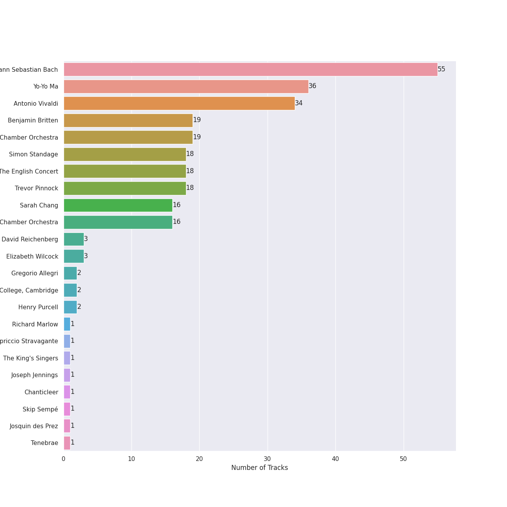
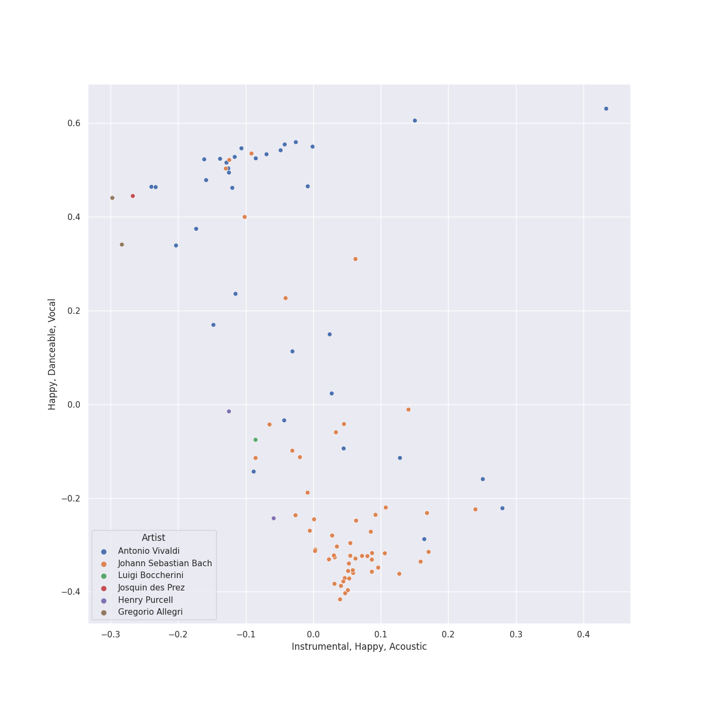
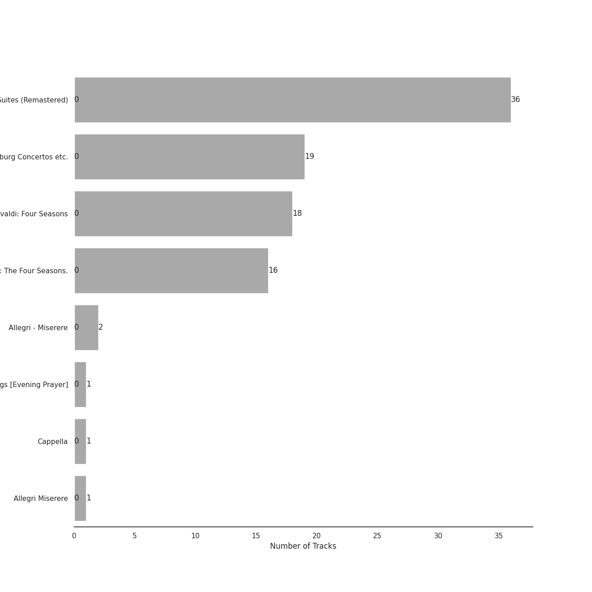
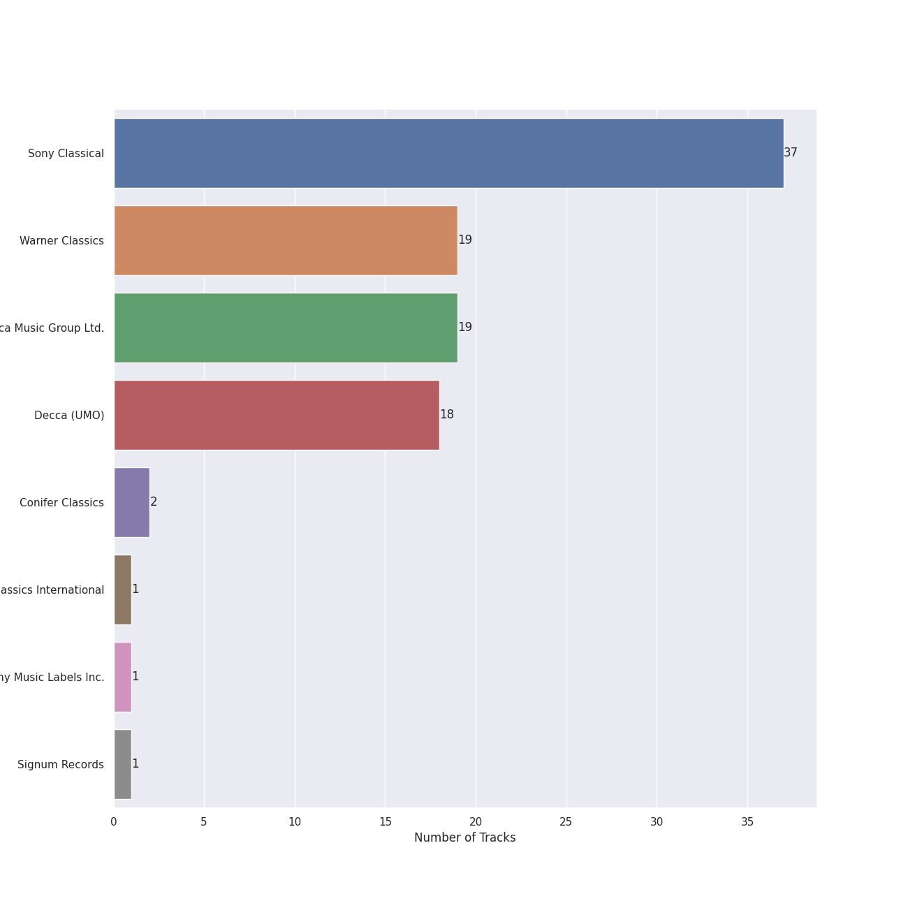
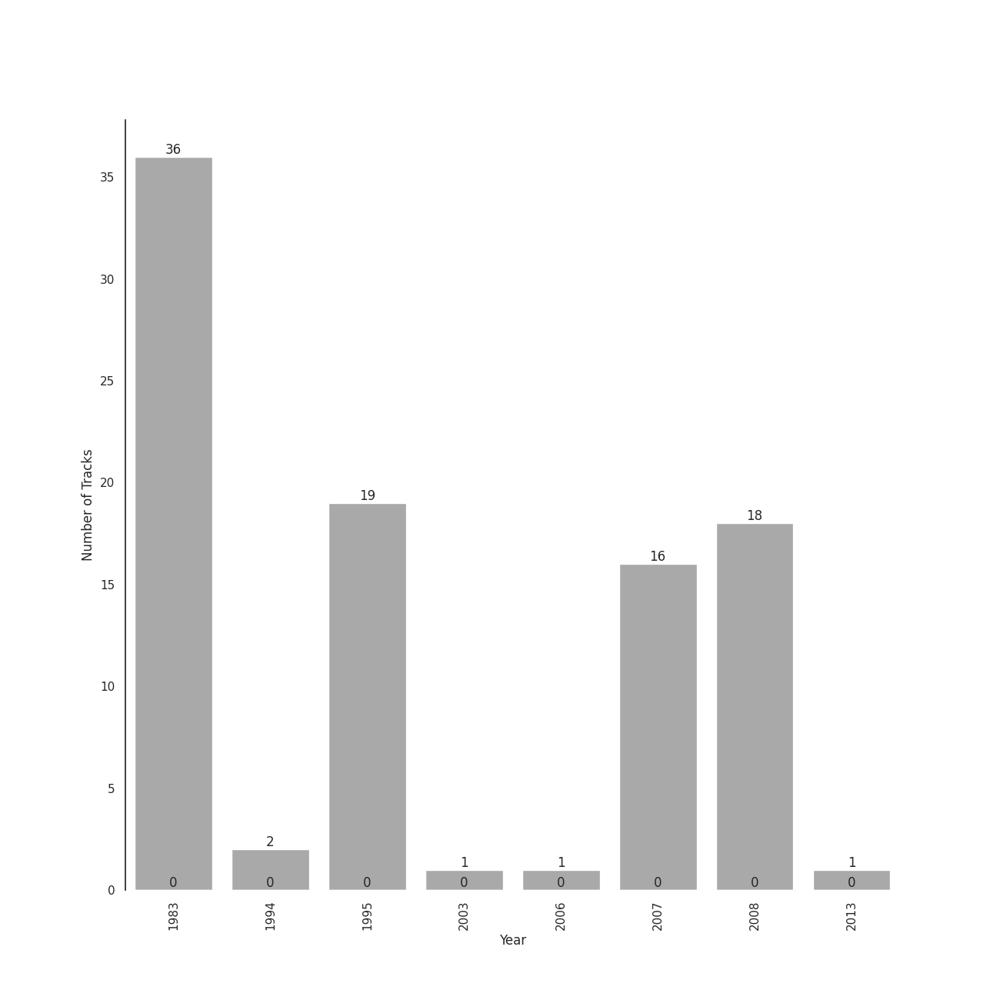

# early music

94 songs

[See Track Features](audio_features.md)

[See Clusters](clusters/overview.md)

## Top Artists

| Art | Rank | Tracks | 💚 | Artist | 🔗 |
|:---|---:|---:|---:|:---|:---|
|  | 413 | 55 | 0 | [Johann Sebastian Bach](../../artists/johann_sebastian_bach/overview.md) | [🔗](https://open.spotify.com/artist/5aIqB5nVVvmFsvSdExz408) |
|  | 413 | 36 | 0 | Yo-Yo Ma | [🔗](https://open.spotify.com/artist/5Dl3HXZjG6ZOWT5cV375lk) |
|  | 413 | 34 | 0 | Antonio Vivaldi | [🔗](https://open.spotify.com/artist/2QOIawHpSlOwXDvSqQ9YJR) |
|  | 413 | 19 | 0 | Benjamin Britten | [🔗](https://open.spotify.com/artist/7MJ1pB5d6Vjmzep2zQlorn) |
|  | 413 | 19 | 0 | English Chamber Orchestra | [🔗](https://open.spotify.com/artist/2DO4p3CPDnInsJfg0jFfaF) |
|  | 413 | 18 | 0 | Simon Standage | [🔗](https://open.spotify.com/artist/2jIBkRzVUboTbp05rJnKeT) |
|  | 413 | 18 | 0 | The English Concert | [🔗](https://open.spotify.com/artist/2Oz3z7PPQUMU2KNYgcO1sA) |
|  | 413 | 18 | 0 | Trevor Pinnock | [🔗](https://open.spotify.com/artist/25mbgceDJKxXGP8c5FmC83) |
|  | 413 | 16 | 0 | Sarah Chang | [🔗](https://open.spotify.com/artist/5duxfFAQVkDT9g261fKlMP) |
|  | 413 | 16 | 0 | Orpheus Chamber Orchestra | [🔗](https://open.spotify.com/artist/35pZsti1RSA5Zv98jAm8kX) |

See all 23 artists

| Art | Rank | Tracks | 💚 | Artist | 🔗 |
|:---|---:|---:|---:|:---|:---|
|  | 413 | 3 | 0 | David Reichenberg | [🔗](https://open.spotify.com/artist/5xA5sW0D3BUAyL02XcDkYv) |
|  | 413 | 3 | 0 | Elizabeth Wilcock | [🔗](https://open.spotify.com/artist/1OfYCRcS14pyRVrO0qTCbs) |
|  | 413 | 2 | 0 | Gregorio Allegri | [🔗](https://open.spotify.com/artist/4I47QTluHCo2t2Gj6V7AIG) |
|  | 413 | 2 | 0 | The Choir Of Trinity College, Cambridge | [🔗](https://open.spotify.com/artist/3x8rZy1i6FwWOWKwfRT1Ab) |
|  | 413 | 2 | 0 | Henry Purcell | [🔗](https://open.spotify.com/artist/3tMLo1k3iUo82coMLWXzxq) |
|  | 413 | 1 | 0 | Richard Marlow | [🔗](https://open.spotify.com/artist/7rrfp80BJeAa0lpBnNgRNK) |
|  | 413 | 1 | 0 | Capriccio Stravagante | [🔗](https://open.spotify.com/artist/7Hb8ewIvJmuQPAQ5MMVXJE) |
|  | 413 | 1 | 0 | The King's Singers | [🔗](https://open.spotify.com/artist/5lR7yDVN4z9kahOiUSlMhe) |
|  | 413 | 1 | 0 | Joseph Jennings | [🔗](https://open.spotify.com/artist/5A3ntUGTCKttzOwkoF9AUY) |
|  | 413 | 1 | 0 | Chanticleer | [🔗](https://open.spotify.com/artist/4p6DfIA6NnKmWeRgDJPLT0) |
|  | 413 | 1 | 0 | Skip Sempé | [🔗](https://open.spotify.com/artist/3DSclbx4DSkyIvouHCxHHZ) |
|  | 413 | 1 | 0 | Josquin des Prez | [🔗](https://open.spotify.com/artist/31f23hmZawdqgp0sECAzE8) |
|  | 413 | 1 | 0 | Tenebrae | [🔗](https://open.spotify.com/artist/0vUnn6Eje2O5yxEj35touD) |

## Most and least listened tracks
| Rank | ​ | Most listened tracks | Rank | ​​ | Least listened tracks |
|---:|:---|:---|---:|:---|:---|
| 917 |  | Concerto for Violin and Strings in F Major, Op. 8, No. 3, RV 293 "L'autunno": II. Adagio molto (Ubriachi dormienti) | 917 |  | [Cello Suite No. 4 in E-Flat Major, BWV 1010: V. Bourrées I & II](../../artists/johann_sebastian_bach/overview.md) |
| 917 |  | [Brandenburg Concerto No. 6 in B flat, BWV 1051: 1. --](../../artists/johann_sebastian_bach/overview.md) | 917 |  | [Cello Suite No. 1 in G Major, BWV 1007: IV. Sarabande](../../artists/johann_sebastian_bach/overview.md) |
| 917 |  | Vivaldi: The Four Seasons, Violin Concerto in F Major, Op. 8 No. 3, RV 293 "Autumn": II. Adagio molto | 917 |  | [Cello Suite No. 6 in D Major, BWV 1012: I. Prélude](../../artists/johann_sebastian_bach/overview.md) |
| 917 |  | Vivaldi: Violin Concerto in G Minor, Op. 12 No. 1, RV 317: III. Allegro | 917 |  | [Cello Suite No. 5 in C Minor, BWV 1011: I. Prélude](../../artists/johann_sebastian_bach/overview.md) |
| 917 |  | Vivaldi: The Four Seasons, Violin Concerto in F Major, Op. 8 No. 3, RV 293 "Autumn": I. Allegro | 917 |  | [Brandenburg Concerto No. 4 in G, BWV 1049: 1. Allegro](../../artists/johann_sebastian_bach/overview.md) |
| 917 |  | Violin Concerto in F Minor, Op. 8, No. 4, RV 297 "L'inverno": II. Largo | 917 |  | [Brandenburg Concerto No. 5 in D, BWV 1050: 1. Allegro](../../artists/johann_sebastian_bach/overview.md) |
| 917 |  | [Cello Suite No. 4 in E-Flat Major, BWV 1010: I. Prélude](../../artists/johann_sebastian_bach/overview.md) | 917 |  | [Cello Suite No. 5 in C Minor, BWV 1011: III. Courante](../../artists/johann_sebastian_bach/overview.md) |
| 917 |  | [Brandenburg Concerto No. 1 in F, BWV 1046: 1. (Allegro)](../../artists/johann_sebastian_bach/overview.md) | 917 |  | [Brandenburg Concerto No. 1 in F, BWV 1046: 4. Menuetto: Trio I](../../artists/johann_sebastian_bach/overview.md) |
| 917 |  | Vivaldi: The Four Seasons, Violin Concerto in G Minor, Op. 8 No. 2, RV 315 "Summer": I. Allegro non molto | 917 |  | [Cello Suite No. 1 in G Major, BWV 1007: VI. Gigue](../../artists/johann_sebastian_bach/overview.md) |
| 917 |  | [Cello Suite No. 6 in D Major, BWV 1012: VI. Gigue](../../artists/johann_sebastian_bach/overview.md) | 917 |  | [Cello Suite No. 1 in G Major, BWV 1007: III. Courante](../../artists/johann_sebastian_bach/overview.md) |

## Top Albums

| Art | Rank | Tracks | 💚 | Album | Release Date | 🔗 |
|:---|---:|---:|---:|:---|:---|:---|
|  | 610 | 36 | 0 | Bach: Unaccompanied Cello Suites (Remastered) | 1983 | [🔗](https://open.spotify.com/album/2OpnKgmVYPEN2GldgBponI) |
|  | 610 | 19 | 0 | Bach, J.S.: Brandenburg Concertos etc. | 1995-01-01 | [🔗](https://open.spotify.com/album/11FzhwtOFCPB4vpgWo33xV) |
|  | 610 | 18 | 0 | Vivaldi: Four Seasons | 2008-01-01 | [🔗](https://open.spotify.com/album/4Uc1Cus3I9LjkI2XwtQnfc) |
|  | 610 | 16 | 0 | Vivaldi: The Four Seasons. | 2007-10-01 | [🔗](https://open.spotify.com/album/4YpaKMCcb65yOoee75UUOh) |
|  | 610 | 2 | 0 | Allegri - Miserere | 1994-02-15 | [🔗](https://open.spotify.com/album/6DXPSePAsqcD40WQsSnasD) |
|  | 610 | 1 | 0 | Purcell: Anthems & Sacred Songs | 2003-08-29 | [🔗](https://open.spotify.com/album/7K8qhv7euF0xd6DiqoReDK) |
|  | 610 | 1 | 0 | Cappella | 2013 | [🔗](https://open.spotify.com/album/3n6JxpdWnHkazMCQxKK5qI) |
|  | 610 | 1 | 0 | Allegri Miserere | 2006-10-03 | [🔗](https://open.spotify.com/album/3fvFlaBBbAFO0QCrSTbfaU) |

## Top Record Labels

| Tracks | 💚 | Label |
|---:|---:|:---|
| 37 | 0 | [Sony Classical](../../labels/sony_classical/overview.md) |
| 19 | 0 | [Decca Music Group Ltd.](../../labels/decca_music_group_ltd_/overview.md) |
| 18 | 0 | [Decca (UMO)](../../labels/decca_(umo)/overview.md) |
| 16 | 0 | [Warner Classics](../../labels/warner_classics/overview.md) |
| 2 | 0 | Conifer Classics |
| 1 | 0 | Warner Classics International |
| 1 | 0 | [Sony Music Labels Inc.](../../labels/sony_music_labels_inc_/overview.md) |
| 1 | 0 | Signum Records |

## Years

| ​ | 10 newest albums | ​​ | 10 oldest albums |
|:---|:---|:---|:---|
|  | Cappella (2013) |  | Bach: Unaccompanied Cello Suites (Remastered) (1983) |
|  | Vivaldi: Four Seasons (2008-01-01) |  | Allegri - Miserere (1994-02-15) |
|  | Vivaldi: The Four Seasons. (2007-10-01) |  | Bach, J.S.: Brandenburg Concertos etc. (1995-01-01) |
|  | Allegri Miserere (2006-10-03) |  | Purcell: Anthems & Sacred Songs (2003-08-29) |
|  | Purcell: Anthems & Sacred Songs (2003-08-29) |  | Allegri Miserere (2006-10-03) |
|  | Bach, J.S.: Brandenburg Concertos etc. (1995-01-01) |  | Vivaldi: The Four Seasons. (2007-10-01) |
|  | Allegri - Miserere (1994-02-15) |  | Vivaldi: Four Seasons (2008-01-01) |
|  | Bach: Unaccompanied Cello Suites (Remastered) (1983) |  | Cappella (2013) |

