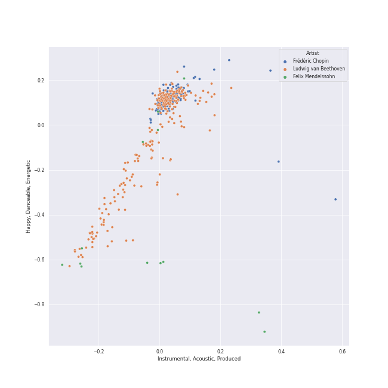
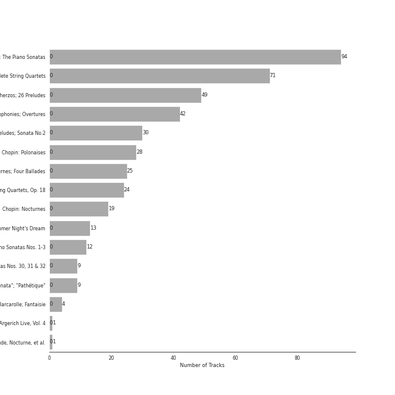

# early romantic era

[431 songs](early_romantic_era_tracks.md)

## Top Artists

See all 25 artists

| Number of Tracks | Art | Artist | 🔗 |
|---:|:---|:---|:---|
| 261 |  | [Ludwig van Beethoven](../artists/ludwig_van_beethoven.md) | [🔗](https://open.spotify.com/artist/2wOqMjp9TyABvtHdOSOTUS) |
| 205 |  | [Vladimir Ashkenazy](../artists/vladimir_ashkenazy.md) | [🔗](https://open.spotify.com/artist/20iZXzMb8LoWXOeca32i82) |
| 157 |  | [Frédéric Chopin](../artists/fr_d_ric_chopin.md) | [🔗](https://open.spotify.com/artist/7y97mc3bZRFXzT2szRM4L4) |
| 71 |  | [Tokyo String Quartet](../artists/tokyo_string_quartet.md) | [🔗](https://open.spotify.com/artist/15G9RnBNBDCFUMANna2CvO) |
| 42 |  | [Berliner Philharmoniker](../artists/berliner_philharmoniker.md) | [🔗](https://open.spotify.com/artist/6uRJnvQ3f8whVnmeoecv5Z) |
| 42 |  | [Herbert von Karajan](../artists/herbert_von_karajan.md) | [🔗](https://open.spotify.com/artist/5zCaQxjl110XTrm4LQ1CxY) |
| 31 |  | [Martha Argerich](../artists/martha_argerich.md) | [🔗](https://open.spotify.com/artist/66MvLAvLznk5UOvASVGjk4) |
| 24 |  | [Jerusalem Quartet](../artists/jerusalem_quartet.md) | [🔗](https://open.spotify.com/artist/7AnE8Jpu1vxLeXcs6OKYHE) |
| 21 |  | [Mari Kodama](../artists/mari_kodama.md) | [🔗](https://open.spotify.com/artist/0s0wG03kPyu7MXERfcuxim) |
| 19 |  | [Maurizio Pollini](../artists/maurizio_pollini.md) | [🔗](https://open.spotify.com/artist/2VIdKQmRHnWofsR4odfFOh) |
| 13 |  | [Felix Mendelssohn](../artists/felix_mendelssohn.md) | [🔗](https://open.spotify.com/artist/6MF58APd3YV72Ln2eVg710) |
| 13 |  | [John Eliot Gardiner](../artists/john_eliot_gardiner.md) | [🔗](https://open.spotify.com/artist/1qIRoGEKXINqrCx5N1engi) |
| 12 |  | [London Symphony Orchestra](../artists/london_symphony_orchestra.md) | [🔗](https://open.spotify.com/artist/5yxyJsFanEAuwSM5kOuZKc) |
| 8 |  | Alexander Knox | [🔗](https://open.spotify.com/artist/4vzwv4zzBTlG8qsFCqP2Yv) |
| 6 |  | Ceri-lyn Cissone | [🔗](https://open.spotify.com/artist/6F3jOFmhUwRxRdWAZU6G1A) |
| 4 |  | Frankie Wakefield | [🔗](https://open.spotify.com/artist/7jobsaZIFhejECE605yxx6) |
| 4 |  | Krystian Zimerman | [🔗](https://open.spotify.com/artist/43wuPaPcZVMJQWLRaPR4Yz) |
| 2 |  | The Monteverdi Choir | [🔗](https://open.spotify.com/artist/0Cqfz92flAzrp94pgN1jEW) |
| 1 |  | José van Dam | [🔗](https://open.spotify.com/artist/5qNUHMEhszyeXNYMn4sswd) |
| 1 |  | [Wiener Singverein](../artists/wiener_singverein.md) | [🔗](https://open.spotify.com/artist/35QSympF887CO8h5eZHme2) |
| 1 |  | Vinson Cole | [🔗](https://open.spotify.com/artist/2j6cP3f3TxyHzcKdWYSm6h) |
| 1 |  | Nikolai Lugansky | [🔗](https://open.spotify.com/artist/2bMfnyPOgNaeK8WNnXNXud) |
| 1 |  | Agnes Baltsa | [🔗](https://open.spotify.com/artist/2amF56vDuTTbZJQsqUgbuC) |
| 1 |  | Janet Perry | [🔗](https://open.spotify.com/artist/1bV3KjOPs1AI3OolJiYogN) |
| 1 |  | Helmut Froschauer | [🔗](https://open.spotify.com/artist/172Encqfd2ZhWAleNg1gbO) |

## Top Albums

See all 16 albums

| Number of Tracks | Art | Album | Release Date | 🔗 |
|---:|:---|:---|:---|:---|
| 94 |  | Beethoven: The Piano Sonatas | 1995-01-01 | [🔗](https://open.spotify.com/album/7xbsSOswKgms1fUFuwKArz) |
| 71 |  | Beethoven: Complete String Quartets | 2010-10-12 | [🔗](https://open.spotify.com/album/4JhUG1lr4xztAcqyA0Jm3a) |
| 49 |  | Chopin: Waltzes; 4 Scherzos; 26 Preludes | 1999-01-01 | [🔗](https://open.spotify.com/album/0yCrQ6dCqiI6ldqI8LPqWB) |
| 42 |  | Beethoven: 9 Symphonies; Overtures | 1993-01-01 | [🔗](https://open.spotify.com/album/2DQTNTznsteIZciZdyeWdj) |
| 30 |  | Chopin: Preludes; Sonata No.2 | 2002-01-01 | [🔗](https://open.spotify.com/album/33YXJqoFV5AQwbo4yfk22n) |
| 28 |  | Chopin: Polonaises | 1996-01-01 | [🔗](https://open.spotify.com/album/19ofW4fqCAR2uQJKVWw6L6) |
| 25 |  | Chopin: Nocturnes; Four Ballades | 1997-01-01 | [🔗](https://open.spotify.com/album/0lrM7kR5o7iqkajLKIlzRg) |
| 24 |  | Beethoven: String Quartets, Op. 18 | 2015-08-31 | [🔗](https://open.spotify.com/album/37iUq5Dekt8uP5itTiVs2Q) |
| 19 |  | Chopin: Nocturnes | 2005-01-01 | [🔗](https://open.spotify.com/album/2aoSpTAjFaMvaZeruqnCVv) |
| 13 |  | Mendelssohn: A Midsummer Night's Dream | 2017-02-03 | [🔗](https://open.spotify.com/album/60J66evwnrnfH03HgDTrwN) |
| 12 |  | Beethoven: Piano Sonatas Nos. 1-3 | 2008-01-01 | [🔗](https://open.spotify.com/album/5CjMjZJnjdHHgwAVkqrvXq) |
| 9 |  | Beethoven: Piano Sonatas Nos. 30, 31 & 32 | 2012-03-06 | [🔗](https://open.spotify.com/album/478l1JdqbqDzcmmgrqw2zu) |
| 9 |  | Beethoven: Piano Sonatas "Moonlight"; "Appassionata"; "Pathétique" | 1983-01-01 | [🔗](https://open.spotify.com/album/0RCfE1YhkdrjnM3kXT3YLl) |
| 4 |  | Chopin: Ballades; Barcarolle; Fantaisie | 1988-01-01 | [🔗](https://open.spotify.com/album/5c9v5oU43Oo22MSG8EKFp2) |
| 1 |  | Martha Argerich Live, Vol. 4 | 2017-01-20 | [🔗](https://open.spotify.com/album/69aoRIAIVb2TbIuxmxKYCR) |
| 1 |  | Chopin: Piano Sonata No. 3, Fantasie-impromptu, Prélude, Nocturne, et al. | 2010-04-05 | [🔗](https://open.spotify.com/album/5QmPVpRux60kcHndJOl6bF) |

## Top Record Labels

See all 7 labels

| Number of Tracks | Label |
|---:|:---|
| 205 | [Decca Music Group Ltd.](../labels/decca_music_group_ltd_.md) |
| 95 | [harmonia mundi](../labels/harmonia_mundi.md) |
| 95 | [Deutsche Grammophon (DG)](../labels/deutsche_grammophon__dg_.md) |
| 21 | [PENTATONE](../labels/pentatone.md) |
| 13 | [Lso Live](../labels/lso_live.md) |
| 1 | Onyx Classics |
| 1 | DOREMI |

## Audio Features

| 10 most Danceable tracks | 10 least Danceable tracks |
|:---|:---|
| 24 Préludes, Op. 28: No. 20 in C Minor: Largo | Symphony No. 9 In D Minor, Op. 125 - "Choral": 3. Adagio molto e cantabile |
| 24 Préludes, Op. 28: No. 20 in C Minor: Largo | Symphony No. 3 In E Flat, Op. 55 -"Eroica": 2. Marcia funebre (Adagio assai) |
| 24 Préludes, Op. 28: No. 10 in C-Sharp Minor: Molto allegro | String Quartet No. 8 in E Minor, Op. 59 No. 2: II. Molto adagio |
| A Midsummer Night's Dream, Incidental Music, Op. 61: "Ay Me! For Aught That I Could Ever Read" | Symphony No. 6 In F, Op. 68 -"Pastoral": 2. Szene am Bach: (Andante molto mosso) |
| Piano Sonata No. 12 in A flat, Op. 26: 3. Marcia funebre sulla morte d'un Eroe | String Quartet No. 15 in A minor, Op. 132: III. Molto adagio |
| 24 Préludes, Op. 28: No. 7 in A Major: Andantino | String Quartet No. 16 in F Major, Op. 135: III. Lento assai, cantate e tranquillo - Più lento |
| 24 Préludes, Op. 28: No. 7 in A Major | 24 Préludes, Op. 28: No. 13 in F-Sharp Major: Lento |
| String Quartet No. 2 in G Major, Op. 18, No. 2: IV. Allegro molto, quasi presto | String Quartet No. 1 in F Major, Op. 18 No. 1: II. Adagio affettuoso ed appassionato |
| Feuille d'album in E, Op. posth. | Symphony No. 4 In B Flat, Op. 60: 2. Adagio |
| Piano Sonata No. 2 in A, Op. 2 No. 2: 3. Scherzo (Allegretto) | Symphony No. 5 In C Minor, Op. 67: 2. Andante con moto |

| 10 most Energetic tracks | 10 least Energetic tracks |
|:---|:---|
| 24 Préludes, Op. 28: No. 22 in G Minor | Piano Sonata No. 21 in C Major, Op. 53 "Waldstein": II. Introduzione (Adagio molto) |
| 24 Préludes, Op. 28: No. 14 in E-Flat Minor | 24 Préludes, Op. 28: No. 7 in A Major |
| Polonaise No. 6 in A-Flat Major, Op. 53, "Heroic" | Piano Sonata No. 31 in A flat, Op. 110: 3. Adagio ma non troppo |
| 24 Préludes, Op. 28: No. 24 in D Minor: Allegro appassionato | 24 Préludes, Op. 28: No. 7 in A Major: Andantino |
| 24 Préludes, Op. 28: No. 22 in G Minor: Molto agitato | 24 Préludes, Op. 28: No. 2 in A Minor |
| Galop Marquis | 24 Préludes, Op. 28: No. 13 in F-Sharp Major: Lento |
| Symphony No. 7 In A, Op. 92: 4. Allegro con brio | 24 Préludes, Op. 28: No. 2 in A Minor: Lento |
| Symphony No. 5 In C Minor, Op. 67: 4. Allegro | Piano Sonata No. 14 in C-Sharp Minor, Op. 27 No. 2 "Moonlight": I. Adagio sostenuto |
| Symphony No. 9 In D Minor, Op. 125 - "Choral" / 4.: "O Freunde nicht diese Töne" - | Piano Sonata No. 31 in A-Flat Major, Op. 110: III. Adagio ma non troppo - |
| Piano Sonata No. 6 in F, Op. 10 No. 2: 3. Presto | Piano Sonata No. 2 in A, Op. 2 No. 2: 2. Largo appassionato |

| 10 most Speechy tracks | 10 least Speechy tracks |
|:---|:---|
| 24 Préludes, Op. 28: No. 20 in C Minor: Largo | 24 Préludes, Op. 28: No. 24 in D Minor: Allegro appassionato |
| A Midsummer Night's Dream, Incidental Music, Op. 61: No. 2, L'istesso tempo | 24 Préludes, Op. 28: No. 12. in G-Sharp Minor |
| 24 Préludes, Op. 28: No. 20 in C Minor: Largo | 24 Préludes, Op. 28: No. 3 in G Major: Vivace |
| A Midsummer Night's Dream, Incidental Music, Op. 61: "Ay Me! For Aught That I Could Ever Read" | Polonaise No. 6 in A flat, Op. 53 -"Heroic" |
| Piano Sonata No. 21 in C Major, Op. 53 "Waldstein": II. Introduzione (Adagio molto) | A Midsummer Night's Dream, Incidental Music, Op. 61: No. 1, Scherzo |
| Piano Sonata No. 19 in G minor, Op. 49 No. 1: 2. Rondo (Allegro) | 24 Préludes, Op. 28: No. 8 in F-Sharp Minor |
| A Midsummer Night's Dream, Incidental Music, Op. 61: No. 2a, Allegro vivace | Piano Sonata No. 25 in G, Op. 79: 3. Vivace |
| 24 Préludes, Op. 28: No. 10 in C-Sharp Minor: Molto allegro | Piano Sonata No. 12 in A flat, Op. 26: 4. Allegro |
| String Quartet No. 11 in F Minor, Op. 95 "Quartetto serioso": III. Allegro assai - Vivace ma serioso | 24 Préludes, Op. 28: No. 22 in G Minor |
| 24 Préludes, Op. 28: No. 7 in A Major | 24 Préludes, Op. 28: No. 24 in D Minor: Allegro appassionato |

| 10 most Acoustic tracks | 10 least Acoustic tracks |
|:---|:---|
| Nocturne No. 11 In G Minor, Op. 37 No. 1 | A Midsummer Night's Dream, Incidental Music, Op. 61: "Ay Me! For Aught That I Could Ever Read" |
| Nocturne No. 12 In G, Op. 37 No. 2 | A Midsummer Night's Dream, Incidental Music, Op. 61: No. 2, L'istesso tempo |
| Wiosna, B117 (arr. from Op. 74/2) | A Midsummer Night's Dream, Incidental Music, Op. 61: No. 8, Andante |
| Waltz No. 18 in E flat, Op. posth. | A Midsummer Night's Dream, Incidental Music, Op. 61: No. 2a, Allegro vivace |
| Piano Sonata No. 9 in E, Op. 14 No. 1: 2. Allegretto | A Midsummer Night's Dream, Incidental Music, Op. 61: No. 4, Andante |
| 24 Préludes, Op. 28: No. 13 in F-Sharp Major | Symphony No. 6 In F, Op. 68 -"Pastoral": 4. Gewitter, Sturm (Allegro) |
| Piano Sonata No. 25 in G, Op. 79: 2. Andante | Symphony No. 7 In A, Op. 92: 4. Allegro con brio |
| Nocturne No. 10 in A-Flat Major, Op. 32 No. 2 | String Quartet No. 15 in A minor, Op. 132: III. Molto adagio |
| Piano Sonata No. 19 in G minor, Op. 49 No. 1: 1. Andante | String Quartet No. 16 in F Major, Op. 135: III. Lento assai, cantate e tranquillo - Più lento |
| Piano Sonata No. 1 in F Minor, Op. 2, No. 1: III. Menuetto: Allegretto | String Quartet No. 11 in F Minor, Op. 95 "Serioso": I. Allegro con brio |

| 10 most Instrumental tracks | 10 least Instrumental tracks |
|:---|:---|
| String Quartet No. 14 in C-Sharp Minor, Op. 131: VI. Adagio quasi un poco andante | A Midsummer Night's Dream, Incidental Music, Op. 61: No. 2, L'istesso tempo |
| 24 Préludes, Op. 28: No. 10 in C-Sharp Minor | A Midsummer Night's Dream, Incidental Music, Op. 61: No. 4, Andante |
| Nocturne No. 8 In D Flat, Op. 27 No. 2 - 2005 Recording | A Midsummer Night's Dream, Incidental Music, Op. 61: "Ay Me! For Aught That I Could Ever Read" |
| 24 Préludes, Op. 28: No. 7 in A Major: Andantino | A Midsummer Night's Dream, Incidental Music, Op. 61: No. 8, Andante |
| 24 Préludes, Op. 28: No. 11 in B Major | A Midsummer Night's Dream, Incidental Music, Op. 61: Finale. Allegro di molto |
| 24 Préludes, Op. 28: No. 10 in C-Sharp Minor: Molto allegro | A Midsummer Night's Dream, Incidental Music, Op. 61: No. 2a, Allegro vivace |
| Nocturne No. 2 In E Flat, Op. 9 No. 2 | A Midsummer Night's Dream, Incidental Music, Op. 61: No. 3, Lied mit Chor |
| Nocturne No. 6 in G Minor, Op. 15 No. 3 | String Quartet No. 6 in B-Flat Major, Op. 18 No. 6: II. Adagio ma non troppo |
| A Midsummer Night's Dream, Incidental Music, Op. 61: No. 1, Scherzo | A Midsummer Night's Dream, Incidental Music, Op. 61: No. 5, Allegro appassionato |
| Waltz No. 15 in E Major, Op. posth. | String Quartet No. 2 in G Major, Op. 18, No. 2: I. Allegro |

| 10 most Live tracks | 10 least Live tracks |
|:---|:---|
| Polonaise No. 6 in A-Flat Major, Op. 53, "Heroic" | String Quartet No. 3 in D Major, Op. 18: I. Allegro |
| A Midsummer Night's Dream, Incidental Music, Op. 61: No. 4, Andante | Ballade No. 2 in F Major, Op. 38 |
| String Quartet No. 2 in G Major, Op. 18, No. 2: III. Scherzo (Allegro) - Trio | 24 Préludes, Op. 28: No. 7 in A Major: Andantino |
| Symphony No. 5 In C Minor, Op. 67: 3. Allegro | Piano Sonata No. 32 in C minor, Op. 111: 2. Arietta (Adagio molto semplice e cantabile) |
| A Midsummer Night's Dream, Incidental Music, Op. 61: No. 2a, Allegro vivace | Symphony No. 1 In C, Op. 21: 3. Menuetto (Allegro molto e vivace) |
| Symphony No. 9 In D Minor, Op. 125 - "Choral" - Excerpt From 4th Movement: 4. Presto | Scherzo No. 1 In B Minor, Op. 20 |
| String Quartet No. 10 in E-Flat Major, Op. 74 "Harp": III. Presto - Più presto quasi prestissimo | Piano Sonata No. 8 in C Minor, Op. 13 "Pathétique": III. Rondo (Allegro) |
| A Midsummer Night's Dream, Incidental Music, Op. 61: No. 8, Andante | Nocturne No. 15 in F Minor, Op. 55 No. 1 |
| String Quartet No. 13 in B-Flat Major, Op. 130: I. Adagio ma non troppo – Allegro | Piano Sonata No. 31 in A flat, Op. 110: 1. Moderato cantabile molto espressivo |
| String Quartet No. 3 in D Major, Op. 18: III. Allegro | A Midsummer Night's Dream, Incidental Music, Op. 61: No. 3, Lied mit Chor |

| 10 most Happy tracks | 10 least Happy tracks |
|:---|:---|
| Galop Marquis | 24 Préludes, Op. 28: No. 7 in A Major: Andantino |
| Waltz No. 16 in A flat, Op. posth. | 24 Préludes, Op. 28: No. 9 in E Major: Largo |
| Piano Sonata No. 6 in F, Op. 10 No. 2: 3. Presto | 24 Préludes, Op. 28: No. 9 in E Major |
| Piano Sonata No. 25 in G, Op. 79: 3. Vivace | String Quartet No. 16 in F Major, Op. 135: III. Lento assai, cantate e tranquillo - Più lento |
| String Quartet No. 6 in B-Flat Major, Op. 18 No. 6: III. Scherzo (Allegro) - Trio | A Midsummer Night's Dream, Incidental Music, Op. 61: No. 7, Nocturne. Con moto tranquillo |
| 24 Préludes, Op. 28: No. 11 in B Major: Vivace | 24 Préludes, Op. 28: No. 4 in E Minor: Largo |
| String Quartet No. 6 in B-Flat Major, Op. 18 No. 6: III. Scherzo (Allegro) - Trio | Piano Sonata No. 31 in A-Flat Major, Op. 110: III. Adagio ma non troppo - |
| Fugue in A minor | Piano Sonata No. 29 in B flat, Op. 106 -"Hammerklavier": 3. Adagio sostenuto |
| Piano Sonata No. 12 in A flat, Op. 26: 4. Allegro | Etude in A flat, Op. posth. " Méthode des méthodes " |
| Piano Sonata No. 31 in A-Flat Major, Op. 110: II. Allegro molto | Ballade No. 2 in F Major, Op. 38 |
