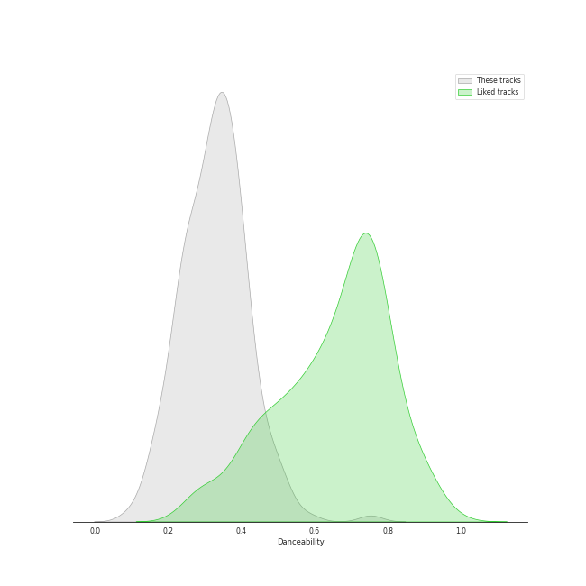
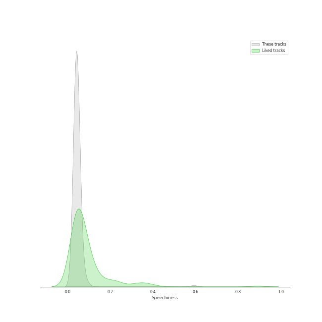
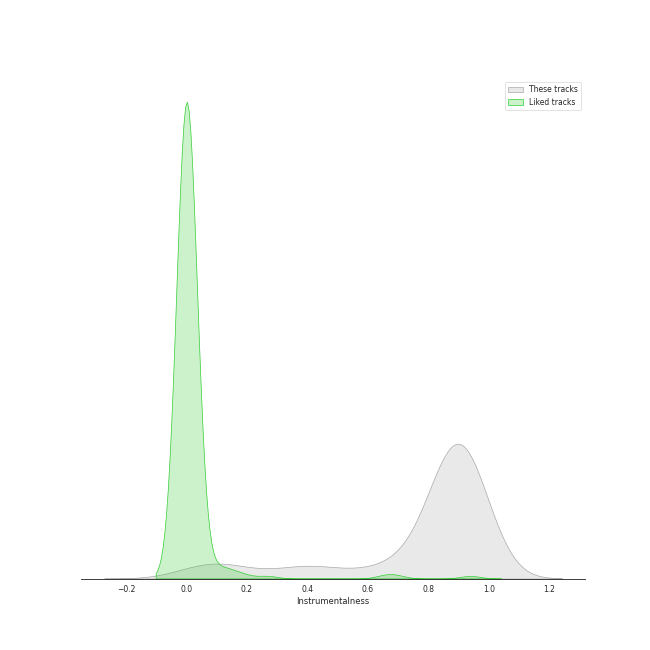
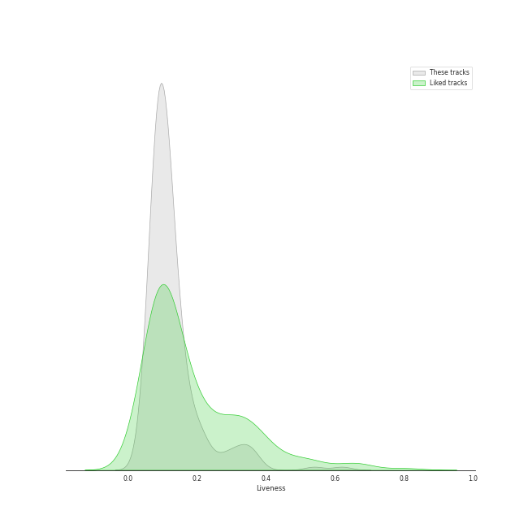
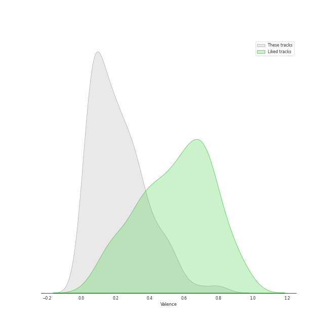
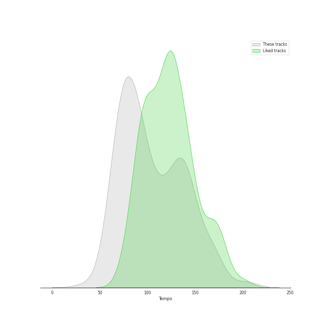

# Track Features for early romantic era

## Danceability

| ​ | 10 most Danceable tracks | ​​ | 10 least Danceable tracks |
|:---|:---|:---|:---|
|  | 24 Préludes, Op. 28: No. 20 in C Minor: Largo (0.753) |  | Symphony No. 9 in D Minor, Op. 125 "Choral": III. Adagio molto e cantabile (0.062) |
|  | 24 Préludes, Op. 28: No. 20 in C Minor: Largo (0.653) |  | Symphony No. 3 in E Flat Major, Op. 55 "Eroica": II. Marcia funebre. Adagio assai (0.0871) |
|  | 24 Préludes, Op. 28: No. 10 in C-Sharp Minor: Molto allegro (0.629) |  | String Quartet No. 8 in E Minor, Op. 59 No. 2: II. Molto adagio (0.0914) |
|  | A Midsummer Night's Dream, Incidental Music, Op. 61: "Ay Me! For Aught That I Could Ever Read" (0.614) |  | Symphony No. 6 in F Major, Op. 68 "Pastoral": II. Szene am Bach. Andante molto mosso (0.103) |
|  | Piano Sonata No. 12 in A flat, Op. 26: 3. Marcia funebre sulla morte d'un Eroe (0.584) |  | String Quartet No. 15 in A minor, Op. 132: III. Molto adagio (0.105) |
|  | 24 Préludes, Op. 28: No. 7 in A Major: Andantino (0.58) |  | String Quartet No. 16 in F Major, Op. 135: III. Lento assai, cantate e tranquillo - Più lento (0.111) |
|  | String Quartet No. 2 in G Major, Op. 18, No. 2: IV. Allegro molto, quasi presto (0.527) |  | 24 Préludes, Op. 28: No. 13 in F-Sharp Major: Lento (0.124) |
|  | Feuille d'album in E, Op. posth. (0.521) |  | Symphony No. 4 in B Flat Major, Op. 60: II. Adagio (0.125) |
|  | Piano Sonata No. 2 in A, Op. 2 No. 2: 3. Scherzo (Allegretto) (0.521) |  | String Quartet No. 1 in F Major, Op. 18 No. 1: II. Adagio affettuoso ed appassionato (0.125) |
|  | A Midsummer Night's Dream, Incidental Music, Op. 61: No. 1, Scherzo (0.505) |  | Symphony No. 5 in C Minor, Op. 67: II. Andante con moto (0.126) |

## Energy

| ​ | 10 most Energetic tracks | ​​ | 10 least Energetic tracks |
|:---|:---|:---|:---|
|  | 24 Préludes, Op. 28: No. 22 in G Minor (0.641) |  | Piano Sonata No. 21 in C Major, Op. 53 "Waldstein": II. Introduzione (Adagio molto) (0.00157) |
|  | 24 Préludes, Op. 28: No. 14 in E-Flat Minor (0.441) |  | Piano Sonata No. 31 in A flat, Op. 110: 3. Adagio ma non troppo (0.00168) |
|  | Polonaise No. 6 in A-Flat Major, Op. 53, "Heroic" (0.413) |  | 24 Préludes, Op. 28: No. 7 in A Major (0.00168) |
|  | 24 Préludes, Op. 28: No. 24 in D Minor: Allegro appassionato (0.399) |  | 24 Préludes, Op. 28: No. 7 in A Major: Andantino (0.00174) |
|  | 24 Préludes, Op. 28: No. 22 in G Minor: Molto agitato (0.392) |  | 24 Préludes, Op. 28: No. 2 in A Minor (0.00189) |
|  | Galop Marquis (0.389) |  | 24 Préludes, Op. 28: No. 13 in F-Sharp Major: Lento (0.0019) |
|  | Symphony No. 7 in A Major, Op. 92: IV. Allegro con brio (0.385) |  | 24 Préludes, Op. 28: No. 2 in A Minor: Lento (0.00223) |
|  | Symphony No. 5 in C Minor, Op. 67: IV. Finale. Allegro (0.358) |  | Piano Sonata No. 14 in C-Sharp Minor, Op. 27 No. 2 "Moonlight": I. Adagio sostenuto (0.0025) |
|  | Symphony No. 9 in D Minor, Op. 125 "Choral": IVc-j. Presto. O Freunde nicht diese Töne – Prestissimo (0.355) |  | Piano Sonata No. 31 in A-Flat Major, Op. 110: III. Adagio ma non troppo (0.00293) |
|  | Piano Sonata No. 6 in F, Op. 10 No. 2: 3. Presto (0.351) |  | Piano Sonata No. 2 in A, Op. 2 No. 2: 2. Largo appassionato (0.00343) |

## Speechiness

| ​ | 10 most Speechy tracks | ​​ | 10 least Speechy tracks |
|:---|:---|:---|:---|
|  | 24 Préludes, Op. 28: No. 20 in C Minor: Largo (0.886) |  | 24 Préludes, Op. 28: No. 24 in D Minor: Allegro appassionato (0.0298) |
|  | A Midsummer Night's Dream, Incidental Music, Op. 61: No. 2, L'istesso tempo (0.676) |  | 24 Préludes, Op. 28: No. 12. in G-Sharp Minor (0.03) |
|  | 24 Préludes, Op. 28: No. 20 in C Minor: Largo (0.592) |  | 24 Préludes, Op. 28: No. 3 in G Major: Vivace (0.03) |
|  | A Midsummer Night's Dream, Incidental Music, Op. 61: "Ay Me! For Aught That I Could Ever Read" (0.524) |  | Polonaise No. 6 in A flat, Op. 53 -"Heroic" (0.0308) |
|  | Piano Sonata No. 21 in C Major, Op. 53 "Waldstein": II. Introduzione (Adagio molto) (0.0974) |  | 24 Préludes, Op. 28: No. 8 in F-Sharp Minor (0.0313) |
|  | Piano Sonata No. 19 in G minor, Op. 49 No. 1: 2. Rondo (Allegro) (0.0889) |  | A Midsummer Night's Dream, Incidental Music, Op. 61: No. 1, Scherzo (0.0314) |
|  | A Midsummer Night's Dream, Incidental Music, Op. 61: No. 2a, Allegro vivace (0.0884) |  | Piano Sonata No. 25 in G, Op. 79: 3. Vivace (0.0322) |
|  | 24 Préludes, Op. 28: No. 7 in A Major (0.0812) |  | Piano Sonata No. 12 in A flat, Op. 26: 4. Allegro (0.0323) |
|  | 24 Préludes, Op. 28: No. 10 in C-Sharp Minor: Molto allegro (0.081) |  | 24 Préludes, Op. 28: No. 22 in G Minor (0.0324) |
|  | String Quartet No. 11 in F Minor, Op. 95 "Quartetto serioso": III. Allegro assai - Vivace ma serioso (0.0807) |  | 24 Préludes, Op. 28: No. 24 in D Minor: Allegro appassionato (0.0325) |

## Acousticness

| ​ | 10 most Acoustic tracks | ​​ | 10 least Acoustic tracks |
|:---|:---|:---|:---|
|  | Nocturne No. 11 In G Minor, Op. 37 No. 1 (0.996) |  | A Midsummer Night's Dream, Incidental Music, Op. 61: "Ay Me! For Aught That I Could Ever Read" (0.41) |
|  | Nocturne No. 12 In G, Op. 37 No. 2 (0.996) |  | A Midsummer Night's Dream, Incidental Music, Op. 61: No. 2, L'istesso tempo (0.69) |
|  | Wiosna, B117 (arr. from Op. 74/2) (0.996) |  | A Midsummer Night's Dream, Incidental Music, Op. 61: No. 8, Andante (0.715) |
|  | Feuille d'album in E, Op. posth. (0.995) |  | A Midsummer Night's Dream, Incidental Music, Op. 61: No. 2a, Allegro vivace (0.745) |
|  | 24 Préludes, Op. 28: No. 13 in F-Sharp Major (0.995) |  | A Midsummer Night's Dream, Incidental Music, Op. 61: No. 4, Andante (0.75) |
|  | Piano Sonata No. 25 in G, Op. 79: 2. Andante (0.995) |  | Symphony No. 6 in F Major, Op. 68 "Pastoral": IV. Gewitter, Sturm. Allegro (0.792) |
|  | Piano Sonata No. 19 in G minor, Op. 49 No. 1: 1. Andante (0.995) |  | Symphony No. 7 in A Major, Op. 92: IV. Allegro con brio (0.847) |
|  | Piano Sonata No. 9 in E, Op. 14 No. 1: 2. Allegretto (0.995) |  | String Quartet No. 15 in A minor, Op. 132: III. Molto adagio (0.865) |
|  | 24 Préludes, Op. 28: No. 6 in B Minor: Lento assai (0.995) |  | String Quartet No. 16 in F Major, Op. 135: III. Lento assai, cantate e tranquillo - Più lento (0.869) |
|  | Nocturne No. 9 In B, Op. 32 No. 1 (0.995) |  | String Quartet No. 11 in F Minor, Op. 95 "Serioso": I. Allegro con brio (0.877) |

## Instrumentalness

| ​ | 10 most Instrumental tracks | ​​ | 10 least Instrumental tracks |
|:---|:---|:---|:---|
|  | String Quartet No. 14 in C-Sharp Minor, Op. 131: VI. Adagio quasi un poco andante (0.97) |  | A Midsummer Night's Dream, Incidental Music, Op. 61: "Ay Me! For Aught That I Could Ever Read" (0.0) |
|  | 24 Préludes, Op. 28: No. 10 in C-Sharp Minor (0.964) |  | A Midsummer Night's Dream, Incidental Music, Op. 61: No. 8, Andante (0.0) |
|  | Nocturne No. 8 In D Flat, Op. 27 No. 2 - 2005 Recording (0.959) |  | A Midsummer Night's Dream, Incidental Music, Op. 61: No. 4, Andante (0.0) |
|  | 24 Préludes, Op. 28: No. 11 in B Major (0.956) |  | A Midsummer Night's Dream, Incidental Music, Op. 61: No. 2, L'istesso tempo (0.0) |
|  | 24 Préludes, Op. 28: No. 7 in A Major: Andantino (0.956) |  | A Midsummer Night's Dream, Incidental Music, Op. 61: Finale. Allegro di molto (3.2e-06) |
|  | 24 Préludes, Op. 28: No. 10 in C-Sharp Minor: Molto allegro (0.955) |  | A Midsummer Night's Dream, Incidental Music, Op. 61: No. 2a, Allegro vivace (1.33e-05) |
|  | Nocturne No. 2 In E Flat, Op. 9 No. 2 (0.953) |  | A Midsummer Night's Dream, Incidental Music, Op. 61: No. 3, Lied mit Chor (0.00137) |
|  | Nocturne No. 6 in G Minor, Op. 15 No. 3 (0.952) |  | String Quartet No. 6 in B-Flat Major, Op. 18 No. 6: II. Adagio ma non troppo (0.00346) |
|  | A Midsummer Night's Dream, Incidental Music, Op. 61: No. 1, Scherzo (0.952) |  | A Midsummer Night's Dream, Incidental Music, Op. 61: No. 5, Allegro appassionato (0.00512) |
|  | Piano Sonata No. 31 in A-Flat Major, Op. 110: II. Allegro molto (0.949) |  | String Quartet No. 2 in G Major, Op. 18, No. 2: I. Allegro (0.0207) |

## Liveness

| ​ | 10 most Live tracks | ​​ | 10 least Live tracks |
|:---|:---|:---|:---|
|  | Polonaise No. 6 in A-Flat Major, Op. 53, "Heroic" (0.682) |  | String Quartet No. 3 in D Major, Op. 18: I. Allegro (0.045) |
|  | A Midsummer Night's Dream, Incidental Music, Op. 61: No. 4, Andante (0.626) |  | Ballade No. 2 in F Major, Op. 38 (0.0494) |
|  | String Quartet No. 2 in G Major, Op. 18, No. 2: III. Scherzo (Allegro) - Trio (0.62) |  | 24 Préludes, Op. 28: No. 7 in A Major: Andantino (0.0504) |
|  | Symphony No. 5 in C Minor, Op. 67: III. Scherzo. Allegro (0.614) |  | Piano Sonata No. 32 in C minor, Op. 111: 2. Arietta (Adagio molto semplice e cantabile) (0.0511) |
|  | A Midsummer Night's Dream, Incidental Music, Op. 61: No. 2a, Allegro vivace (0.539) |  | Symphony No. 1 in C Major, Op. 21: III. Menuetto. Allegro molto e vivace (0.0554) |
|  | Symphony No. 9 in D Minor, Op. 125 "Choral": IVa-b. Presto – Allegro assai (0.535) |  | Scherzo No. 1 In B Minor, Op. 20 (0.0569) |
|  | String Quartet No. 10 in E-Flat Major, Op. 74 "Harp": III. Presto - Più presto quasi prestissimo (0.52) |  | Piano Sonata No. 8 in C Minor, Op. 13 "Pathétique": III. Rondo (Allegro) (0.0575) |
|  | A Midsummer Night's Dream, Incidental Music, Op. 61: No. 8, Andante (0.488) |  | Nocturne No. 15 in F Minor, Op. 55 No. 1 (0.0584) |
|  | String Quartet No. 13 in B-Flat Major, Op. 130: I. Adagio ma non troppo – Allegro (0.402) |  | Piano Sonata No. 31 in A flat, Op. 110: 1. Moderato cantabile molto espressivo (0.0588) |
|  | String Quartet No. 3 in D Major, Op. 18: III. Allegro (0.386) |  | A Midsummer Night's Dream, Incidental Music, Op. 61: No. 3, Lied mit Chor (0.0609) |

## Valence

| ​ | 10 most Happy tracks | ​​ | 10 least Happy tracks |
|:---|:---|:---|:---|
|  | Galop Marquis (0.893) |  | 24 Préludes, Op. 28: No. 7 in A Major: Andantino (0.0) |
|  | Waltz No. 16 in A flat, Op. posth. (0.89) |  | 24 Préludes, Op. 28: No. 9 in E Major: Largo (0.0292) |
|  | Piano Sonata No. 6 in F, Op. 10 No. 2: 3. Presto (0.814) |  | 24 Préludes, Op. 28: No. 9 in E Major (0.0329) |
|  | Piano Sonata No. 25 in G, Op. 79: 3. Vivace (0.791) |  | String Quartet No. 16 in F Major, Op. 135: III. Lento assai, cantate e tranquillo - Più lento (0.0347) |
|  | String Quartet No. 6 in B-Flat Major, Op. 18 No. 6: III. Scherzo (Allegro) - Trio (0.705) |  | A Midsummer Night's Dream, Incidental Music, Op. 61: No. 7, Nocturne. Con moto tranquillo (0.0353) |
|  | 24 Préludes, Op. 28: No. 11 in B Major: Vivace (0.701) |  | 24 Préludes, Op. 28: No. 4 in E Minor: Largo (0.0354) |
|  | String Quartet No. 6 in B-Flat Major, Op. 18 No. 6: III. Scherzo (Allegro) - Trio (0.694) |  | Piano Sonata No. 31 in A-Flat Major, Op. 110: III. Adagio ma non troppo (0.0355) |
|  | Fugue in A minor (0.657) |  | Piano Sonata No. 29 in B flat, Op. 106 -"Hammerklavier": 3. Adagio sostenuto (0.0356) |
|  | Piano Sonata No. 31 in A-Flat Major, Op. 110: II. Allegro molto (0.652) |  | Etude in A flat, Op. posth. " Méthode des méthodes " (0.0362) |
|  | Piano Sonata No. 12 in A flat, Op. 26: 4. Allegro (0.652) |  | Ballade No. 2 in F Major, Op. 38 (0.0364) |

## Tempo

| ​ | 10 most Fast tracks | ​​ | 10 least Fast tracks |
|:---|:---|:---|:---|
|  | 24 Préludes, Op. 28: No. 6 in B Minor: Lento assai (203.905) |  | 24 Préludes, Op. 28: No. 20 in C Minor: Largo (34.105) |
|  | Piano Sonata No. 29 in B flat, Op. 106 -"Hammerklavier": 2. Scherzo (Assai vivace - Presto - Prestissimo - Tempo I) (203.867) |  | 24 Préludes, Op. 28: No. 8 in F-Sharp Minor: Molto agitato (53.925) |
|  | String Quartet No. 11 in F Minor, Op. 95 "Quartetto serioso": III. Allegro assai - Vivace ma serioso (179.045) |  | Piano Sonata No. 2 in B-Flat Minor, Op. 35: III. Marche funèbre (54.525) |
|  | A Midsummer Night's Dream, Incidental Music, Op. 61: Finale. Allegro di molto (175.796) |  | Nocturne No. 8 In D Flat, Op. 27 No. 2 - 2005 Recording (55.543) |
|  | String Quartet No. 12 in E-Flat Major, Op. 127: III. Scherzando vivace (174.606) |  | Waltz No. 11 in G-Flat Major, Op. 70 No. 1 (58.131) |
|  | 24 Préludes, Op. 28: No. 19 in E-Flat Major: Vivace (174.421) |  | 24 Préludes, Op. 28: No. 7 in A Major: Andantino (59.272) |
|  | String Quartet No. 6 in B-Flat Major, Op. 18 No. 6: III. Scherzo (Allegro) - Trio (172.548) |  | 24 Préludes, Op. 28: No. 18 in F Minor: Molto allegro (59.67) |
|  | Piano Sonata No. 9 in E, Op. 14 No. 1: 1. Allegro (172.047) |  | Symphony No. 7 in A Major, Op. 92: III. Presto – Assai meno presto (59.821) |
|  | String Quartet No. 3 in D Major, Op. 18: IV. Presto (171.742) |  | Piano Sonata No. 13 in E flat, Op. 27 No. 1: 3. Adagio con espressione (60.671) |
|  | String Quartet No. 6 in B-Flat Major, Op. 18 No. 6: III. Scherzo (Allegro) - Trio (171.063) |  | Egmont, Op. 84: Overture (62.227) |
