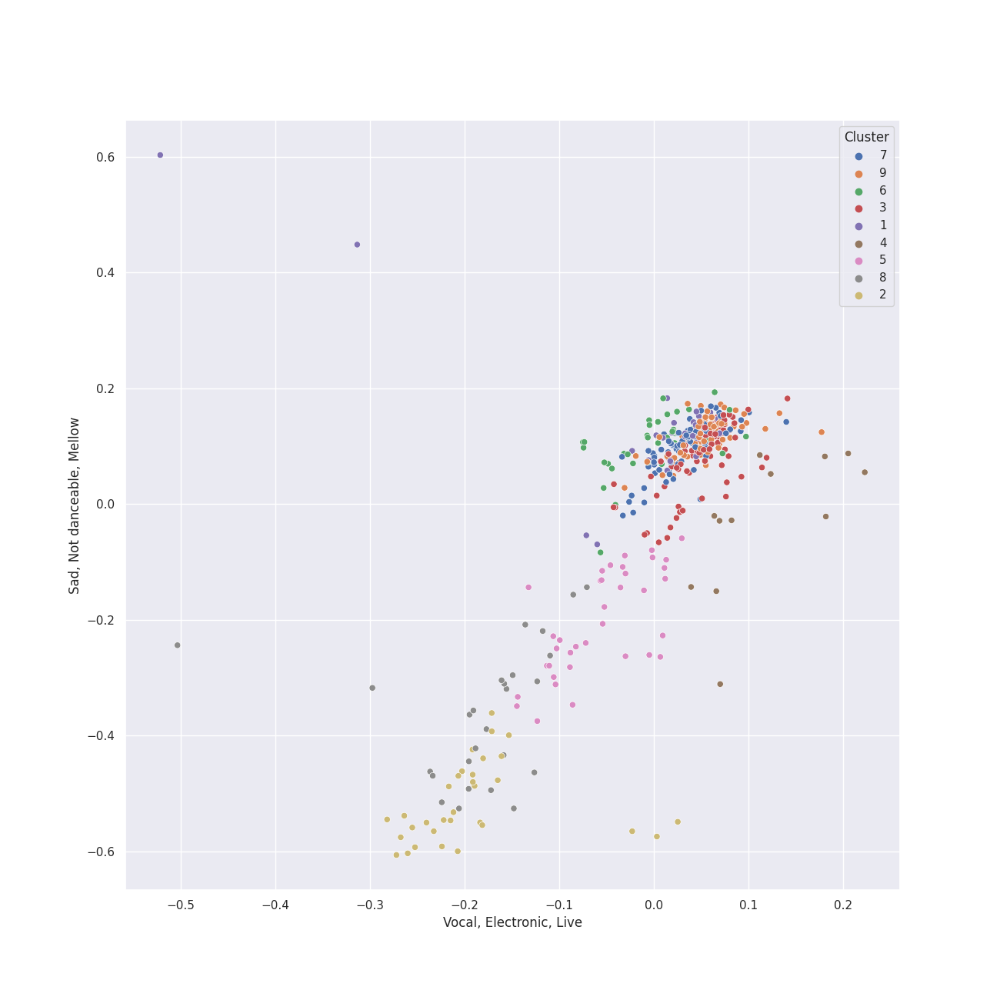

# Clusters in early romantic era

## Cluster #1

29 tracks

| Art | Track | Album | Artists | Label | 💚 | 🔗 |
|:---|:---|:---|:---|:---|:---|:---|
|  | Polonaise in G minor, Op. posth. | Chopin: Polonaises | [Frédéric Chopin](../../../../artists/frédéric_chopin/overview.md), [Vladimir Ashkenazy](../../../../artists/vladimir_ashkenazy/overview.md) | [Decca Music Group Ltd.](../../../../labels/decca_music_group_ltd_) | | [🔗](https://open.spotify.com/track/4JXQYuYn9NLqe9iVVAl21T) |
|  | Waltz No. 1 in E-Flat Major, Op. 18 "Grande valse brillante" | Chopin: Waltzes; 4 Scherzos; 26 Preludes | [Frédéric Chopin](../../../../artists/frédéric_chopin/overview.md), [Vladimir Ashkenazy](../../../../artists/vladimir_ashkenazy/overview.md) | [Decca Music Group Ltd.](../../../../labels/decca_music_group_ltd_) | | [🔗](https://open.spotify.com/track/1vWAWChbVffjnpl6PPzUA4) |
|  | Waltz No. 15 in E Major, Op. posth. | Chopin: Waltzes; 4 Scherzos; 26 Preludes | [Frédéric Chopin](../../../../artists/frédéric_chopin/overview.md), [Vladimir Ashkenazy](../../../../artists/vladimir_ashkenazy/overview.md) | [Decca Music Group Ltd.](../../../../labels/decca_music_group_ltd_) | | [🔗](https://open.spotify.com/track/5sbIyLgUYKMPD0RdpAdeUf) |
|  | Waltz No. 17 in E flat, Op. posth. | Chopin: Waltzes; 4 Scherzos; 26 Preludes | [Frédéric Chopin](../../../../artists/frédéric_chopin/overview.md), [Vladimir Ashkenazy](../../../../artists/vladimir_ashkenazy/overview.md) | [Decca Music Group Ltd.](../../../../labels/decca_music_group_ltd_) | | [🔗](https://open.spotify.com/track/4Mly8lJA2TBdN10JDgMCZm) |
|  | Piano Sonata No. 18 in E flat, Op. 31 No. 3 -"The Hunt": 3. Menuetto (Moderato e grazioso) | Beethoven: The Piano Sonatas | [Ludwig van Beethoven](../../../../artists/ludwig_van_beethoven/overview.md), [Vladimir Ashkenazy](../../../../artists/vladimir_ashkenazy/overview.md) | [Decca Music Group Ltd.](../../../../labels/decca_music_group_ltd_) | | [🔗](https://open.spotify.com/track/0Ug52ip9Z9uCWXhicp3lb7) |
|  | Piano Sonata No. 5 in C minor, Op. 10 No. 1: 1. Allegro molto e con brio | Beethoven: The Piano Sonatas | [Ludwig van Beethoven](../../../../artists/ludwig_van_beethoven/overview.md), [Vladimir Ashkenazy](../../../../artists/vladimir_ashkenazy/overview.md) | [Decca Music Group Ltd.](../../../../labels/decca_music_group_ltd_) | | [🔗](https://open.spotify.com/track/23esxSOldUXZFyucgRXauX) |
|  | Piano Sonata No. 5 in C minor, Op. 10 No. 1: 3. Finale (Prestissimo) | Beethoven: The Piano Sonatas | [Ludwig van Beethoven](../../../../artists/ludwig_van_beethoven/overview.md), [Vladimir Ashkenazy](../../../../artists/vladimir_ashkenazy/overview.md) | [Decca Music Group Ltd.](../../../../labels/decca_music_group_ltd_) | | [🔗](https://open.spotify.com/track/2jCWcL2WI97EZU9Im0xVrd) |
|  | Piano Sonata No. 6 in F, Op. 10 No. 2: 1. Allegro | Beethoven: The Piano Sonatas | [Ludwig van Beethoven](../../../../artists/ludwig_van_beethoven/overview.md), [Vladimir Ashkenazy](../../../../artists/vladimir_ashkenazy/overview.md) | [Decca Music Group Ltd.](../../../../labels/decca_music_group_ltd_) | | [🔗](https://open.spotify.com/track/66Jfdc0nO0rGPxOQN6yfXz) |
|  | Piano Sonata No. 1 in F Minor, Op. 2 No. 1: I. Allegro | Beethoven: Piano Sonatas Nos. 1-3 | [Ludwig van Beethoven](../../../../artists/ludwig_van_beethoven/overview.md), Mari Kodama | [PENTATONE](../../../../labels/pentatone) | | [🔗](https://open.spotify.com/track/3L3B58di5ewulHGTfnh59h) |
|  | Piano Sonata No. 2 in A Major, Op. 2 No. 2: III. Scherzo & Trio. Allegretto | Beethoven: Piano Sonatas Nos. 1-3 | [Ludwig van Beethoven](../../../../artists/ludwig_van_beethoven/overview.md), Mari Kodama | [PENTATONE](../../../../labels/pentatone) | | [🔗](https://open.spotify.com/track/7DRrwoL7liyTdEFvfvD6k9) |
## Cluster #2

32 tracks

| Art | Track | Album | Artists | Label | 💚 | 🔗 |
|:---|:---|:---|:---|:---|:---|:---|
|  | A Midsummer Night's Dream, Incidental Music, Op. 61: No. 5, Allegro appassionato | Mendelssohn: A Midsummer Night's Dream | Felix Mendelssohn, London Symphony Orchestra, Ceri-lyn Cissone, John Eliot Gardiner, Alexander Knox | [Lso Live](../../../../labels/lso_live) | | [🔗](https://open.spotify.com/track/5XWKRz9i2PQWI3PsW0FmQj) |
|  | A Midsummer Night's Dream, Incidental Music, Op. 61: No. 9, Hochzeitmarsch "Wedding March" - No. 12, Allegro vivace come primo | Mendelssohn: A Midsummer Night's Dream | Felix Mendelssohn, London Symphony Orchestra, John Eliot Gardiner, Alexander Knox | [Lso Live](../../../../labels/lso_live) | | [🔗](https://open.spotify.com/track/1ipR2jLKKgr7X9xJyd54Kx) |
|  | String Quartet No. 12 in E-Flat Major, Op. 127: I. Maestoso - Allegro | Beethoven: Complete String Quartets | [Ludwig van Beethoven](../../../../artists/ludwig_van_beethoven/overview.md), [Tokyo String Quartet](../../../../artists/tokyo_string_quartet/overview.md) | [harmonia mundi](../../../../labels/harmonia_mundi) | | [🔗](https://open.spotify.com/track/1Oj4z7SesvJsdi52adQHkG) |
|  | String Quartet No. 14 in C-Sharp Minor, Op. 131: III. Allegro moderato - Adagio - Piu vivace | Beethoven: Complete String Quartets | [Ludwig van Beethoven](../../../../artists/ludwig_van_beethoven/overview.md), [Tokyo String Quartet](../../../../artists/tokyo_string_quartet/overview.md) | [harmonia mundi](../../../../labels/harmonia_mundi) | | [🔗](https://open.spotify.com/track/0qAphY2YKqhNBrYaWucjQu) |
|  | String Quartet No. 3 in D Major, Op. 18: I. Allegro | Beethoven: Complete String Quartets | [Ludwig van Beethoven](../../../../artists/ludwig_van_beethoven/overview.md), [Tokyo String Quartet](../../../../artists/tokyo_string_quartet/overview.md) | [harmonia mundi](../../../../labels/harmonia_mundi) | | [🔗](https://open.spotify.com/track/4UbcuUdeuzNJDajkn0ger7) |
|  | String Quartet No. 3 in D Major, Op. 18: II. Andante con moto | Beethoven: Complete String Quartets | [Ludwig van Beethoven](../../../../artists/ludwig_van_beethoven/overview.md), [Tokyo String Quartet](../../../../artists/tokyo_string_quartet/overview.md) | [harmonia mundi](../../../../labels/harmonia_mundi) | | [🔗](https://open.spotify.com/track/2V5dO6szHHSoAqIRTJViYA) |
|  | String Quartet No. 4 in C Minor, Op. 18 No. 4: III. Menuetto (Allegro) - Trio | Beethoven: Complete String Quartets | [Ludwig van Beethoven](../../../../artists/ludwig_van_beethoven/overview.md), [Tokyo String Quartet](../../../../artists/tokyo_string_quartet/overview.md) | [harmonia mundi](../../../../labels/harmonia_mundi) | | [🔗](https://open.spotify.com/track/0FDBvZ6wjjGW15jlH3vVFt) |
|  | String Quartet No. 5 in A Major, Op. 18 No. 5: II. Menuetto - Trio | Beethoven: Complete String Quartets | [Ludwig van Beethoven](../../../../artists/ludwig_van_beethoven/overview.md), [Tokyo String Quartet](../../../../artists/tokyo_string_quartet/overview.md) | [harmonia mundi](../../../../labels/harmonia_mundi) | | [🔗](https://open.spotify.com/track/33qw9cPdfAYL9nYW6Y1ODN) |
|  | String Quartet No. 5 in A Major, Op. 18 No. 5: III. Andante cantabile | Beethoven: Complete String Quartets | [Ludwig van Beethoven](../../../../artists/ludwig_van_beethoven/overview.md), [Tokyo String Quartet](../../../../artists/tokyo_string_quartet/overview.md) | [harmonia mundi](../../../../labels/harmonia_mundi) | | [🔗](https://open.spotify.com/track/4WOEg6BxJIlMVx3mz8gJSw) |
|  | String Quartet No. 6 in B-Flat Major, Op. 18 No. 6: II. Adagio ma non troppo | Beethoven: String Quartets, Op. 18 | [Ludwig van Beethoven](../../../../artists/ludwig_van_beethoven/overview.md), [Jerusalem Quartet](../../../../artists/jerusalem_quartet/overview.md) | [harmonia mundi](../../../../labels/harmonia_mundi) | | [🔗](https://open.spotify.com/track/5haDu6D9Afpa5GIt5wVWMb) |
## Cluster #3

94 tracks

| Art | Track | Album | Artists | Label | 💚 | 🔗 |
|:---|:---|:---|:---|:---|:---|:---|
|  | Barcarolle in F-Sharp Major, Op. 60 | Chopin: Polonaises | [Frédéric Chopin](../../../../artists/frédéric_chopin/overview.md), [Vladimir Ashkenazy](../../../../artists/vladimir_ashkenazy/overview.md) | [Decca Music Group Ltd.](../../../../labels/decca_music_group_ltd_) | | [🔗](https://open.spotify.com/track/5XYA3OqUUlTwmd68LoRZ41) |
|  | Polonaise No. 1 in C sharp minor, Op. 26 No. 1 | Chopin: Polonaises | [Frédéric Chopin](../../../../artists/frédéric_chopin/overview.md), [Vladimir Ashkenazy](../../../../artists/vladimir_ashkenazy/overview.md) | [Decca Music Group Ltd.](../../../../labels/decca_music_group_ltd_) | | [🔗](https://open.spotify.com/track/1OCezcm1Sy4qHouo4S5pYp) |
|  | Nocturne No. 14 in F sharp minor, Op. 48 No. 2 | Chopin: Nocturnes; Four Ballades | [Frédéric Chopin](../../../../artists/frédéric_chopin/overview.md), [Vladimir Ashkenazy](../../../../artists/vladimir_ashkenazy/overview.md) | [Decca Music Group Ltd.](../../../../labels/decca_music_group_ltd_) | | [🔗](https://open.spotify.com/track/21V4PYCwr3bPUQ3g2MRiVi) |
|  | Nocturne No. 18 in E Major, Op. 62 No. 2 | Chopin: Nocturnes; Four Ballades | [Frédéric Chopin](../../../../artists/frédéric_chopin/overview.md), [Vladimir Ashkenazy](../../../../artists/vladimir_ashkenazy/overview.md) | [Decca Music Group Ltd.](../../../../labels/decca_music_group_ltd_) | | [🔗](https://open.spotify.com/track/6la3MMpUCkvxN2HgoQWvf3) |
|  | 24 Préludes, Op. 28: No. 17 in A-Flat Major: Allegretto | Chopin: Preludes; Sonata No.2 | [Frédéric Chopin](../../../../artists/frédéric_chopin/overview.md), Martha Argerich | [Deutsche Grammophon (DG)](../../../../labels/deutsche_grammophon_(dg)) | | [🔗](https://open.spotify.com/track/2vRgcveY6WFFyyKdjRmJRO) |
|  | 24 Préludes, Op. 28: No. 21 in B-Flat Major | Chopin: Preludes; Sonata No.2 | [Frédéric Chopin](../../../../artists/frédéric_chopin/overview.md), Martha Argerich | [Deutsche Grammophon (DG)](../../../../labels/deutsche_grammophon_(dg)) | | [🔗](https://open.spotify.com/track/7IOQW4DHliCO1l7xG9dL80) |
|  | Nocturne No. 16 In E Flat, Op. 55 No. 2 | Chopin: Nocturnes | [Frédéric Chopin](../../../../artists/frédéric_chopin/overview.md), Maurizio Pollini | [Deutsche Grammophon (DG)](../../../../labels/deutsche_grammophon_(dg)) | | [🔗](https://open.spotify.com/track/7r9DH7AvvijvMXFMGMsdqK) |
|  | Nocturne No. 19 In E Minor, Op. 72 No. 1 | Chopin: Nocturnes | [Frédéric Chopin](../../../../artists/frédéric_chopin/overview.md), Maurizio Pollini | [Deutsche Grammophon (DG)](../../../../labels/deutsche_grammophon_(dg)) | | [🔗](https://open.spotify.com/track/068BPNYklLpBX6VhMCKsUX) |
|  | Fantaisie-impromptu in C-Sharp Minor, Op. 66: Fantaisie-impromptu in C-Sharp Minor, Op. 66 | Chopin: Piano Sonata No. 3, Fantasie-impromptu, Prélude, Nocturne, et al. | [Frédéric Chopin](../../../../artists/frédéric_chopin/overview.md), Nikolai Lugansky | Onyx Classics | | [🔗](https://open.spotify.com/track/2D2fqN3hLbBhQUickM3hpG) |
|  | Piano Sonata No. 21 in C Major, Op. 53 "Waldstein": I. Allegro con brio | Beethoven: The Piano Sonatas | [Ludwig van Beethoven](../../../../artists/ludwig_van_beethoven/overview.md), [Vladimir Ashkenazy](../../../../artists/vladimir_ashkenazy/overview.md) | [Decca Music Group Ltd.](../../../../labels/decca_music_group_ltd_) | | [🔗](https://open.spotify.com/track/6mhZMduiw9NIIRk75k9WVy) |
## Cluster #4

12 tracks

| Art | Track | Album | Artists | Label | 💚 | 🔗 |
|:---|:---|:---|:---|:---|:---|:---|
|  | Polonaise No. 6 in A-Flat Major, Op. 53, "Heroic" | Martha Argerich Live, Vol. 4 | [Frédéric Chopin](../../../../artists/frédéric_chopin/overview.md), Martha Argerich | DOREMI | | [🔗](https://open.spotify.com/track/3QC8VK73CinEi0ZV8Jf9B5) |
|  | Symphony No. 2 In D, Op. 36: 4. Allegro molto | Beethoven: 9 Symphonies; Overtures | [Ludwig van Beethoven](../../../../artists/ludwig_van_beethoven/overview.md), [Berliner Philharmoniker](../../../../artists/berliner_philharmoniker/overview.md), [Herbert von Karajan](../../../../artists/herbert_von_karajan/overview.md) | [Deutsche Grammophon (DG)](../../../../labels/deutsche_grammophon_(dg)) | | [🔗](https://open.spotify.com/track/4MH1pSRa3UjoubxDXDU8zc) |
|  | Symphony No. 4 In B Flat, Op. 60: 4. Allegro ma non troppo | Beethoven: 9 Symphonies; Overtures | [Ludwig van Beethoven](../../../../artists/ludwig_van_beethoven/overview.md), [Berliner Philharmoniker](../../../../artists/berliner_philharmoniker/overview.md), [Herbert von Karajan](../../../../artists/herbert_von_karajan/overview.md) | [Deutsche Grammophon (DG)](../../../../labels/deutsche_grammophon_(dg)) | | [🔗](https://open.spotify.com/track/62RfH6r3t6Yj90IgiQhHn4) |
|  | Symphony No. 8 in F Major, Op. 93: I. Allegro vivace e con brio | Beethoven: 9 Symphonies; Overtures | [Ludwig van Beethoven](../../../../artists/ludwig_van_beethoven/overview.md), [Berliner Philharmoniker](../../../../artists/berliner_philharmoniker/overview.md), [Herbert von Karajan](../../../../artists/herbert_von_karajan/overview.md) | [Deutsche Grammophon (DG)](../../../../labels/deutsche_grammophon_(dg)) | | [🔗](https://open.spotify.com/track/3pmLgmjUUe2iCzNIYN0ail) |
|  | String Quartet No. 10 in E-Flat Major, Op. 74 "Harp": III. Presto - Più presto quasi prestissimo | Beethoven: Complete String Quartets | [Ludwig van Beethoven](../../../../artists/ludwig_van_beethoven/overview.md), [Tokyo String Quartet](../../../../artists/tokyo_string_quartet/overview.md) | [harmonia mundi](../../../../labels/harmonia_mundi) | | [🔗](https://open.spotify.com/track/0EJIwpF1aRZ7vW9ihTlb5T) |
|  | String Quartet No. 5 in A Major, Op. 18 No. 5: IV. Allegro | Beethoven: Complete String Quartets | [Ludwig van Beethoven](../../../../artists/ludwig_van_beethoven/overview.md), [Tokyo String Quartet](../../../../artists/tokyo_string_quartet/overview.md) | [harmonia mundi](../../../../labels/harmonia_mundi) | | [🔗](https://open.spotify.com/track/1xooWRi29x4214VEUWnhlV) |
|  | String Quartet No. 1 in F Major, Op. 18 No. 1: IV. Allegro | Beethoven: String Quartets, Op. 18 | [Ludwig van Beethoven](../../../../artists/ludwig_van_beethoven/overview.md), [Jerusalem Quartet](../../../../artists/jerusalem_quartet/overview.md) | [harmonia mundi](../../../../labels/harmonia_mundi) | | [🔗](https://open.spotify.com/track/37ygTHqOZWYgHuBSEZ8M3V) |
|  | String Quartet No. 2 in G Major, Op. 18, No. 2: III. Scherzo (Allegro) - Trio | Beethoven: String Quartets, Op. 18 | [Ludwig van Beethoven](../../../../artists/ludwig_van_beethoven/overview.md), [Jerusalem Quartet](../../../../artists/jerusalem_quartet/overview.md) | [harmonia mundi](../../../../labels/harmonia_mundi) | | [🔗](https://open.spotify.com/track/5NFYYgZwkSOTpOZNeqiinF) |
|  | String Quartet No. 3 in D Major, Op. 18: III. Allegro | Beethoven: String Quartets, Op. 18 | [Ludwig van Beethoven](../../../../artists/ludwig_van_beethoven/overview.md), [Jerusalem Quartet](../../../../artists/jerusalem_quartet/overview.md) | [harmonia mundi](../../../../labels/harmonia_mundi) | | [🔗](https://open.spotify.com/track/3YHXYUEz37g5r42bPc73bB) |
|  | String Quartet No. 5 in A Major, Op. 18 No. 5: IV. Allegro | Beethoven: String Quartets, Op. 18 | [Ludwig van Beethoven](../../../../artists/ludwig_van_beethoven/overview.md), [Jerusalem Quartet](../../../../artists/jerusalem_quartet/overview.md) | [harmonia mundi](../../../../labels/harmonia_mundi) | | [🔗](https://open.spotify.com/track/5AByXPX7vW0d89Du16H7U6) |
## Cluster #5

37 tracks

| Art | Track | Album | Artists | Label | 💚 | 🔗 |
|:---|:---|:---|:---|:---|:---|:---|
|  | Overture "Coriolan", Op. 62 | Beethoven: 9 Symphonies; Overtures | [Ludwig van Beethoven](../../../../artists/ludwig_van_beethoven/overview.md), [Berliner Philharmoniker](../../../../artists/berliner_philharmoniker/overview.md), [Herbert von Karajan](../../../../artists/herbert_von_karajan/overview.md) | [Deutsche Grammophon (DG)](../../../../labels/deutsche_grammophon_(dg)) | | [🔗](https://open.spotify.com/track/3JMmtvBklNEhWY9TfhKTw9) |
|  | Overture "Leonore No. 3", Op. 72b | Beethoven: 9 Symphonies; Overtures | [Ludwig van Beethoven](../../../../artists/ludwig_van_beethoven/overview.md), [Berliner Philharmoniker](../../../../artists/berliner_philharmoniker/overview.md), [Herbert von Karajan](../../../../artists/herbert_von_karajan/overview.md) | [Deutsche Grammophon (DG)](../../../../labels/deutsche_grammophon_(dg)) | | [🔗](https://open.spotify.com/track/1qP4L90ZORZad6pqdLMyci) |
|  | Symphony No. 4 In B Flat, Op. 60: 1. Adagio - Allegro vivace | Beethoven: 9 Symphonies; Overtures | [Ludwig van Beethoven](../../../../artists/ludwig_van_beethoven/overview.md), [Berliner Philharmoniker](../../../../artists/berliner_philharmoniker/overview.md), [Herbert von Karajan](../../../../artists/herbert_von_karajan/overview.md) | [Deutsche Grammophon (DG)](../../../../labels/deutsche_grammophon_(dg)) | | [🔗](https://open.spotify.com/track/7h3gKAftaUcgjzQbprBaUq) |
|  | Symphony No. 6 In F, Op. 68 -"Pastoral": 4. Gewitter, Sturm (Allegro) | Beethoven: 9 Symphonies; Overtures | [Ludwig van Beethoven](../../../../artists/ludwig_van_beethoven/overview.md), [Berliner Philharmoniker](../../../../artists/berliner_philharmoniker/overview.md), [Herbert von Karajan](../../../../artists/herbert_von_karajan/overview.md) | [Deutsche Grammophon (DG)](../../../../labels/deutsche_grammophon_(dg)) | | [🔗](https://open.spotify.com/track/2ApZ6x9XISWdn9eIu8SDCO) |
|  | String Quartet No. 11 in F Minor, Op. 95 "Quartetto serioso": II. Allegretto ma non troppo | Beethoven: Complete String Quartets | [Ludwig van Beethoven](../../../../artists/ludwig_van_beethoven/overview.md), [Tokyo String Quartet](../../../../artists/tokyo_string_quartet/overview.md) | [harmonia mundi](../../../../labels/harmonia_mundi) | | [🔗](https://open.spotify.com/track/226cSHopDmYFnLbzeGi5HV) |
|  | String Quartet No. 11 in F Minor, Op. 95 "Quartetto serioso": IV. Larghetto espressivo – Allegretto agitato – Allegro | Beethoven: Complete String Quartets | [Ludwig van Beethoven](../../../../artists/ludwig_van_beethoven/overview.md), [Tokyo String Quartet](../../../../artists/tokyo_string_quartet/overview.md) | [harmonia mundi](../../../../labels/harmonia_mundi) | | [🔗](https://open.spotify.com/track/51TlHN7aV2jUH1wNIJvgKS) |
|  | String Quartet No. 15 in A minor, Op. 132: II. Allegro ma non tanto | Beethoven: Complete String Quartets | [Ludwig van Beethoven](../../../../artists/ludwig_van_beethoven/overview.md), [Tokyo String Quartet](../../../../artists/tokyo_string_quartet/overview.md) | [harmonia mundi](../../../../labels/harmonia_mundi) | | [🔗](https://open.spotify.com/track/52afsywDcOS3ApCQET7k5J) |
|  | String Quartet No. 8 in E Minor, Op. 59 No. 2: III. Allegretto | Beethoven: Complete String Quartets | [Ludwig van Beethoven](../../../../artists/ludwig_van_beethoven/overview.md), [Tokyo String Quartet](../../../../artists/tokyo_string_quartet/overview.md) | [harmonia mundi](../../../../labels/harmonia_mundi) | | [🔗](https://open.spotify.com/track/1e0KnK30nx7GxphZVx7DFI) |
|  | String Quartet No. 9 in C Major, Op. 59 No. 3: I. Introduzione (Andante con moto - Allegro vivace) | Beethoven: Complete String Quartets | [Ludwig van Beethoven](../../../../artists/ludwig_van_beethoven/overview.md), [Tokyo String Quartet](../../../../artists/tokyo_string_quartet/overview.md) | [harmonia mundi](../../../../labels/harmonia_mundi) | | [🔗](https://open.spotify.com/track/5bUQPchwRlyhMMNP7OYrcW) |
|  | String Quartet No. 1 in F Major, Op. 18 No. 1: II. Adagio affettuoso ed appassionato | Beethoven: String Quartets, Op. 18 | [Ludwig van Beethoven](../../../../artists/ludwig_van_beethoven/overview.md), [Jerusalem Quartet](../../../../artists/jerusalem_quartet/overview.md) | [harmonia mundi](../../../../labels/harmonia_mundi) | | [🔗](https://open.spotify.com/track/74Din3wPGdlksjg6kz68Mw) |
## Cluster #6

37 tracks

| Art | Track | Album | Artists | Label | 💚 | 🔗 |
|:---|:---|:---|:---|:---|:---|:---|
|  | 2 Bourrees, B160b | Chopin: Polonaises | [Frédéric Chopin](../../../../artists/frédéric_chopin/overview.md), [Vladimir Ashkenazy](../../../../artists/vladimir_ashkenazy/overview.md) | [Decca Music Group Ltd.](../../../../labels/decca_music_group_ltd_) | | [🔗](https://open.spotify.com/track/0NQBcvME4NKAruNFixVDa8) |
|  | 24 Préludes, Op. 28: No. 12. in G-Sharp Minor | Chopin: Preludes; Sonata No.2 | [Frédéric Chopin](../../../../artists/frédéric_chopin/overview.md), Martha Argerich | [Deutsche Grammophon (DG)](../../../../labels/deutsche_grammophon_(dg)) | | [🔗](https://open.spotify.com/track/0SB6a6YMfoGPVLD1Jgc1rn) |
|  | Symphony No. 2 In D, Op. 36: 3. Scherzo (Allegro) | Beethoven: 9 Symphonies; Overtures | [Ludwig van Beethoven](../../../../artists/ludwig_van_beethoven/overview.md), [Berliner Philharmoniker](../../../../artists/berliner_philharmoniker/overview.md), [Herbert von Karajan](../../../../artists/herbert_von_karajan/overview.md) | [Deutsche Grammophon (DG)](../../../../labels/deutsche_grammophon_(dg)) | | [🔗](https://open.spotify.com/track/64v8YQdGgHATztGNTmtAP8) |
|  | Piano Sonata No. 12 in A flat, Op. 26: 2. Scherzo (Allegro molto) | Beethoven: The Piano Sonatas | [Ludwig van Beethoven](../../../../artists/ludwig_van_beethoven/overview.md), [Vladimir Ashkenazy](../../../../artists/vladimir_ashkenazy/overview.md) | [Decca Music Group Ltd.](../../../../labels/decca_music_group_ltd_) | | [🔗](https://open.spotify.com/track/1ceRZjxysooUhNqjsvetIF) |
|  | Piano Sonata No. 12 in A flat, Op. 26: 4. Allegro | Beethoven: The Piano Sonatas | [Ludwig van Beethoven](../../../../artists/ludwig_van_beethoven/overview.md), [Vladimir Ashkenazy](../../../../artists/vladimir_ashkenazy/overview.md) | [Decca Music Group Ltd.](../../../../labels/decca_music_group_ltd_) | | [🔗](https://open.spotify.com/track/31AZdDNdlQCUezidrDWH47) |
|  | Piano Sonata No. 19 in G minor, Op. 49 No. 1: 2. Rondo (Allegro) | Beethoven: The Piano Sonatas | [Ludwig van Beethoven](../../../../artists/ludwig_van_beethoven/overview.md), [Vladimir Ashkenazy](../../../../artists/vladimir_ashkenazy/overview.md) | [Decca Music Group Ltd.](../../../../labels/decca_music_group_ltd_) | | [🔗](https://open.spotify.com/track/2yYoMpdah6zLxZakpCFs9I) |
|  | Piano Sonata No. 25 in G, Op. 79: 1. Presto alla tedesca | Beethoven: The Piano Sonatas | [Ludwig van Beethoven](../../../../artists/ludwig_van_beethoven/overview.md), [Vladimir Ashkenazy](../../../../artists/vladimir_ashkenazy/overview.md) | [Decca Music Group Ltd.](../../../../labels/decca_music_group_ltd_) | | [🔗](https://open.spotify.com/track/51etNICsNf6ltMHZ4I0i2q) |
|  | Piano Sonata No. 3 in C, Op. 2 No. 3: 3. Scherzo (Allegro) | Beethoven: The Piano Sonatas | [Ludwig van Beethoven](../../../../artists/ludwig_van_beethoven/overview.md), [Vladimir Ashkenazy](../../../../artists/vladimir_ashkenazy/overview.md) | [Decca Music Group Ltd.](../../../../labels/decca_music_group_ltd_) | | [🔗](https://open.spotify.com/track/0cG1eHAxX9qgBoHkmJMEhl) |
|  | Piano Sonata No. 3 in C Major, Op. 2 No. 3: III. Scherzo & Trio. Allegro | Beethoven: Piano Sonatas Nos. 1-3 | [Ludwig van Beethoven](../../../../artists/ludwig_van_beethoven/overview.md), Mari Kodama | [PENTATONE](../../../../labels/pentatone) | | [🔗](https://open.spotify.com/track/5Sm6qqdwaG8VbduSsEVyM6) |
|  | String Quartet No. 16 in F Major, Op. 135: II. Vivace | Beethoven: Complete String Quartets | [Ludwig van Beethoven](../../../../artists/ludwig_van_beethoven/overview.md), [Tokyo String Quartet](../../../../artists/tokyo_string_quartet/overview.md) | [harmonia mundi](../../../../labels/harmonia_mundi) | | [🔗](https://open.spotify.com/track/6MLcMKBVoM7iPeTTkGwWlg) |
## Cluster #7

83 tracks

| Art | Track | Album | Artists | Label | 💚 | 🔗 |
|:---|:---|:---|:---|:---|:---|:---|
|  | 24 Préludes, Op. 28: No. 1 in C Major: Agitato | Chopin: Waltzes; 4 Scherzos; 26 Preludes | [Frédéric Chopin](../../../../artists/frédéric_chopin/overview.md), [Vladimir Ashkenazy](../../../../artists/vladimir_ashkenazy/overview.md) | [Decca Music Group Ltd.](../../../../labels/decca_music_group_ltd_) | | [🔗](https://open.spotify.com/track/2Yf9vmbIP7T5ePTWJBRHLB) |
|  | Waltz No. 2 in A flat major, Op. 34 No. 1 "Valse brillante" | Chopin: Waltzes; 4 Scherzos; 26 Preludes | [Frédéric Chopin](../../../../artists/frédéric_chopin/overview.md), [Vladimir Ashkenazy](../../../../artists/vladimir_ashkenazy/overview.md) | [Decca Music Group Ltd.](../../../../labels/decca_music_group_ltd_) | | [🔗](https://open.spotify.com/track/6rNiQAbUis4ZH4kALwJzK2) |
|  | Waltz No. 4 in F Major, Op. 34 No. 3 | Chopin: Waltzes; 4 Scherzos; 26 Preludes | [Frédéric Chopin](../../../../artists/frédéric_chopin/overview.md), [Vladimir Ashkenazy](../../../../artists/vladimir_ashkenazy/overview.md) | [Decca Music Group Ltd.](../../../../labels/decca_music_group_ltd_) | | [🔗](https://open.spotify.com/track/663LMA5z3qtBuiFLhnjvvI) |
|  | Piano Sonata No. 1 in F minor, Op. 2 No. 1: 3. Menuetto (Allegretto) | Beethoven: The Piano Sonatas | [Ludwig van Beethoven](../../../../artists/ludwig_van_beethoven/overview.md), [Vladimir Ashkenazy](../../../../artists/vladimir_ashkenazy/overview.md) | [Decca Music Group Ltd.](../../../../labels/decca_music_group_ltd_) | | [🔗](https://open.spotify.com/track/67SOOKfcONBy6SdpoVz2bL) |
|  | Piano Sonata No. 1 in F minor, Op. 2 No. 1: 4. Prestissimo | Beethoven: The Piano Sonatas | [Ludwig van Beethoven](../../../../artists/ludwig_van_beethoven/overview.md), [Vladimir Ashkenazy](../../../../artists/vladimir_ashkenazy/overview.md) | [Decca Music Group Ltd.](../../../../labels/decca_music_group_ltd_) | | [🔗](https://open.spotify.com/track/1Wrn95wC9svYqRRPovuW8x) |
|  | Piano Sonata No. 11 in B flat, Op. 22: 1. Allegro con brio | Beethoven: The Piano Sonatas | [Ludwig van Beethoven](../../../../artists/ludwig_van_beethoven/overview.md), [Vladimir Ashkenazy](../../../../artists/vladimir_ashkenazy/overview.md) | [Decca Music Group Ltd.](../../../../labels/decca_music_group_ltd_) | | [🔗](https://open.spotify.com/track/0JGm7LxCumF7nRrUlF5QIt) |
|  | Piano Sonata No. 19 in G minor, Op. 49 No. 1: 1. Andante | Beethoven: The Piano Sonatas | [Ludwig van Beethoven](../../../../artists/ludwig_van_beethoven/overview.md), [Vladimir Ashkenazy](../../../../artists/vladimir_ashkenazy/overview.md) | [Decca Music Group Ltd.](../../../../labels/decca_music_group_ltd_) | | [🔗](https://open.spotify.com/track/6fnnJxQzSmNrgZubGxEfoR) |
|  | Piano Sonata No. 4 in E flat, Op. 7: 3. Allegro | Beethoven: The Piano Sonatas | [Ludwig van Beethoven](../../../../artists/ludwig_van_beethoven/overview.md), [Vladimir Ashkenazy](../../../../artists/vladimir_ashkenazy/overview.md) | [Decca Music Group Ltd.](../../../../labels/decca_music_group_ltd_) | | [🔗](https://open.spotify.com/track/7mjP1zIbYt98zXkL5HUIBs) |
|  | Piano Sonata No. 4 in E flat, Op. 7: 4. Rondo (Poco allegretto e grazioso) | Beethoven: The Piano Sonatas | [Ludwig van Beethoven](../../../../artists/ludwig_van_beethoven/overview.md), [Vladimir Ashkenazy](../../../../artists/vladimir_ashkenazy/overview.md) | [Decca Music Group Ltd.](../../../../labels/decca_music_group_ltd_) | | [🔗](https://open.spotify.com/track/1f64W90KNdGhGzoElkVy3G) |
|  | Piano Sonata No. 7 in D, Op. 10 No. 3: 1. Presto | Beethoven: The Piano Sonatas | [Ludwig van Beethoven](../../../../artists/ludwig_van_beethoven/overview.md), [Vladimir Ashkenazy](../../../../artists/vladimir_ashkenazy/overview.md) | [Decca Music Group Ltd.](../../../../labels/decca_music_group_ltd_) | | [🔗](https://open.spotify.com/track/5bydS2TjR8Ac2P72MDC5Wr) |
## Cluster #8

26 tracks

| Art | Track | Album | Artists | Label | 💚 | 🔗 |
|:---|:---|:---|:---|:---|:---|:---|
|  | Symphony No. 3 In E Flat, Op. 55 -"Eroica": 3. Scherzo (Allegro vivace) | Beethoven: 9 Symphonies; Overtures | [Ludwig van Beethoven](../../../../artists/ludwig_van_beethoven/overview.md), [Berliner Philharmoniker](../../../../artists/berliner_philharmoniker/overview.md), [Herbert von Karajan](../../../../artists/herbert_von_karajan/overview.md) | [Deutsche Grammophon (DG)](../../../../labels/deutsche_grammophon_(dg)) | | [🔗](https://open.spotify.com/track/5b3322i4oAchfQQfcwZcxV) |
|  | String Quartet No. 1 in F Major, Op. 18 No. 1: III. Scherzo (Allegro molto) - Trio | Beethoven: Complete String Quartets | [Ludwig van Beethoven](../../../../artists/ludwig_van_beethoven/overview.md), [Tokyo String Quartet](../../../../artists/tokyo_string_quartet/overview.md) | [harmonia mundi](../../../../labels/harmonia_mundi) | | [🔗](https://open.spotify.com/track/6Qa7Y6Mv50TeLSRR5YMdfC) |
|  | String Quartet No. 12 in E-Flat Major, Op. 127: III. Scherzando vivace | Beethoven: Complete String Quartets | [Ludwig van Beethoven](../../../../artists/ludwig_van_beethoven/overview.md), [Tokyo String Quartet](../../../../artists/tokyo_string_quartet/overview.md) | [harmonia mundi](../../../../labels/harmonia_mundi) | | [🔗](https://open.spotify.com/track/6KdYWkuYKvlQXUIUVAm791) |
|  | String Quartet No. 13 in B-Flat Major, Op. 130: VI. Finale (Allegro) | Beethoven: Complete String Quartets | [Ludwig van Beethoven](../../../../artists/ludwig_van_beethoven/overview.md), [Tokyo String Quartet](../../../../artists/tokyo_string_quartet/overview.md) | [harmonia mundi](../../../../labels/harmonia_mundi) | | [🔗](https://open.spotify.com/track/4NXLgjsrr00FjE44RR7Uhk) |
|  | String Quartet No. 3 in D Major, Op. 18: III. Allegro | Beethoven: Complete String Quartets | [Ludwig van Beethoven](../../../../artists/ludwig_van_beethoven/overview.md), [Tokyo String Quartet](../../../../artists/tokyo_string_quartet/overview.md) | [harmonia mundi](../../../../labels/harmonia_mundi) | | [🔗](https://open.spotify.com/track/5G6akNf0PvWHz7vtgEmPzn) |
|  | String Quartet No. 4 in C Minor, Op. 18 No. 4: I. Allegro ma non tanto | Beethoven: Complete String Quartets | [Ludwig van Beethoven](../../../../artists/ludwig_van_beethoven/overview.md), [Tokyo String Quartet](../../../../artists/tokyo_string_quartet/overview.md) | [harmonia mundi](../../../../labels/harmonia_mundi) | | [🔗](https://open.spotify.com/track/1c0mONBrFPz4jknNod5sQ2) |
|  | String Quartet No. 4 in C Minor, Op. 18, No. 4: II. Andante scherzoso quasi allegretto | Beethoven: Complete String Quartets | [Ludwig van Beethoven](../../../../artists/ludwig_van_beethoven/overview.md), [Tokyo String Quartet](../../../../artists/tokyo_string_quartet/overview.md) | [harmonia mundi](../../../../labels/harmonia_mundi) | | [🔗](https://open.spotify.com/track/2uWikiA8JLez9gK0yHJ4io) |
|  | String Quartet No. 5 in A Major, Op. 18 No. 5: I. Allegro | Beethoven: Complete String Quartets | [Ludwig van Beethoven](../../../../artists/ludwig_van_beethoven/overview.md), [Tokyo String Quartet](../../../../artists/tokyo_string_quartet/overview.md) | [harmonia mundi](../../../../labels/harmonia_mundi) | | [🔗](https://open.spotify.com/track/1JEQuOAmBYecUKo7rnBfs6) |
|  | String Quartet No. 2 in G Major, Op. 18, No. 2: I. Allegro | Beethoven: String Quartets, Op. 18 | [Ludwig van Beethoven](../../../../artists/ludwig_van_beethoven/overview.md), [Jerusalem Quartet](../../../../artists/jerusalem_quartet/overview.md) | [harmonia mundi](../../../../labels/harmonia_mundi) | | [🔗](https://open.spotify.com/track/558uK4J0UIghC9WVf1lAuk) |
|  | String Quartet No. 4 in C Minor, Op. 18 No. 4: II. Andante scherzoso quasi allegretto | Beethoven: String Quartets, Op. 18 | [Ludwig van Beethoven](../../../../artists/ludwig_van_beethoven/overview.md), [Jerusalem Quartet](../../../../artists/jerusalem_quartet/overview.md) | [harmonia mundi](../../../../labels/harmonia_mundi) | | [🔗](https://open.spotify.com/track/3utDQmK6hHWqyHGQUJ1mHN) |
## Cluster #9

81 tracks

| Art | Track | Album | Artists | Label | 💚 | 🔗 |
|:---|:---|:---|:---|:---|:---|:---|
|  | Polonaise No. 10 in F Minor, Op. 71 No. 3 | Chopin: Polonaises | [Frédéric Chopin](../../../../artists/frédéric_chopin/overview.md), [Vladimir Ashkenazy](../../../../artists/vladimir_ashkenazy/overview.md) | [Decca Music Group Ltd.](../../../../labels/decca_music_group_ltd_) | | [🔗](https://open.spotify.com/track/4Z1UxWGoY904w8k9mszKM7) |
|  | Nocturne No. 10 in A-Flat Major, Op. 32 No. 2 | Chopin: Nocturnes; Four Ballades | [Frédéric Chopin](../../../../artists/frédéric_chopin/overview.md), [Vladimir Ashkenazy](../../../../artists/vladimir_ashkenazy/overview.md) | [Decca Music Group Ltd.](../../../../labels/decca_music_group_ltd_) | | [🔗](https://open.spotify.com/track/48yLOxQazsbzSdz3Rq8qev) |
|  | Nocturne No. 2 in E-Flat Major, Op. 9 No. 2 | Chopin: Nocturnes; Four Ballades | [Frédéric Chopin](../../../../artists/frédéric_chopin/overview.md), [Vladimir Ashkenazy](../../../../artists/vladimir_ashkenazy/overview.md) | [Decca Music Group Ltd.](../../../../labels/decca_music_group_ltd_) | | [🔗](https://open.spotify.com/track/6Y6TlK3fa3P2lGvHAM5yLq) |
|  | Nocturne No. 5 in F-Sharp Major, Op. 15 No. 2 | Chopin: Nocturnes; Four Ballades | [Frédéric Chopin](../../../../artists/frédéric_chopin/overview.md), [Vladimir Ashkenazy](../../../../artists/vladimir_ashkenazy/overview.md) | [Decca Music Group Ltd.](../../../../labels/decca_music_group_ltd_) | | [🔗](https://open.spotify.com/track/3pMMV07c8cnoEq4cCPwZnV) |
|  | Scherzo No. 2 in B Flat Minor, Op. 31 | Chopin: Waltzes; 4 Scherzos; 26 Preludes | [Frédéric Chopin](../../../../artists/frédéric_chopin/overview.md), [Vladimir Ashkenazy](../../../../artists/vladimir_ashkenazy/overview.md) | [Decca Music Group Ltd.](../../../../labels/decca_music_group_ltd_) | | [🔗](https://open.spotify.com/track/3O2O8b69mNozAOATbfbKDP) |
|  | Piano Sonata No. 17 in D minor, Op. 31 No. 2 -"Tempest": 2. Adagio | Beethoven: The Piano Sonatas | [Ludwig van Beethoven](../../../../artists/ludwig_van_beethoven/overview.md), [Vladimir Ashkenazy](../../../../artists/vladimir_ashkenazy/overview.md) | [Decca Music Group Ltd.](../../../../labels/decca_music_group_ltd_) | | [🔗](https://open.spotify.com/track/3HtCNpL6JQ5k5Mqtee3kWc) |
|  | Piano Sonata No. 21 in C Major, Op. 53 "Waldstein": III. Rondo (Allegretto moderato - Prestissimo) | Beethoven: The Piano Sonatas | [Ludwig van Beethoven](../../../../artists/ludwig_van_beethoven/overview.md), [Vladimir Ashkenazy](../../../../artists/vladimir_ashkenazy/overview.md) | [Decca Music Group Ltd.](../../../../labels/decca_music_group_ltd_) | | [🔗](https://open.spotify.com/track/3yIWNNQnAQeCmPgjEZ8UwX) |
|  | Piano Sonata No. 30 in E, Op. 109: 3. Gesangvoll, mit innigster Empfindung (Andante molto cantabile ed espressivo) | Beethoven: The Piano Sonatas | [Ludwig van Beethoven](../../../../artists/ludwig_van_beethoven/overview.md), [Vladimir Ashkenazy](../../../../artists/vladimir_ashkenazy/overview.md) | [Decca Music Group Ltd.](../../../../labels/decca_music_group_ltd_) | | [🔗](https://open.spotify.com/track/6i4hjBqCkGirJ0EHRfmbBk) |
|  | Piano Sonata No. 6 in F, Op. 10 No. 2: 2. Allegretto | Beethoven: The Piano Sonatas | [Ludwig van Beethoven](../../../../artists/ludwig_van_beethoven/overview.md), [Vladimir Ashkenazy](../../../../artists/vladimir_ashkenazy/overview.md) | [Decca Music Group Ltd.](../../../../labels/decca_music_group_ltd_) | | [🔗](https://open.spotify.com/track/4gThvgaLCcABLJIFFKTlig) |
|  | Piano Sonata No. 31 in A-Flat Major, Op. 110: I. Moderato cantabile molto espressivo | Beethoven: Piano Sonatas Nos. 30, 31 & 32 | [Ludwig van Beethoven](../../../../artists/ludwig_van_beethoven/overview.md), Mari Kodama | [PENTATONE](../../../../labels/pentatone) | | [🔗](https://open.spotify.com/track/1rzoA7LbmuzUX7zPZfAEOm) |