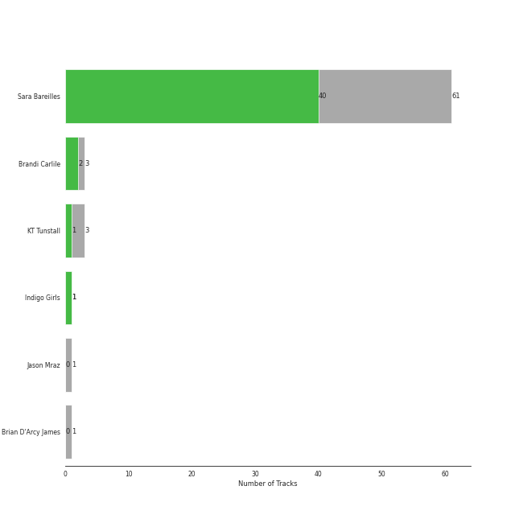
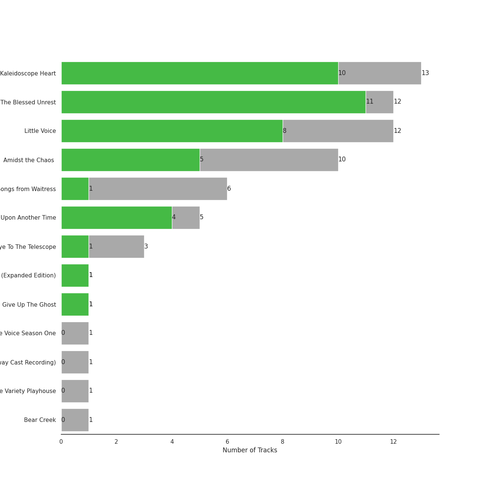
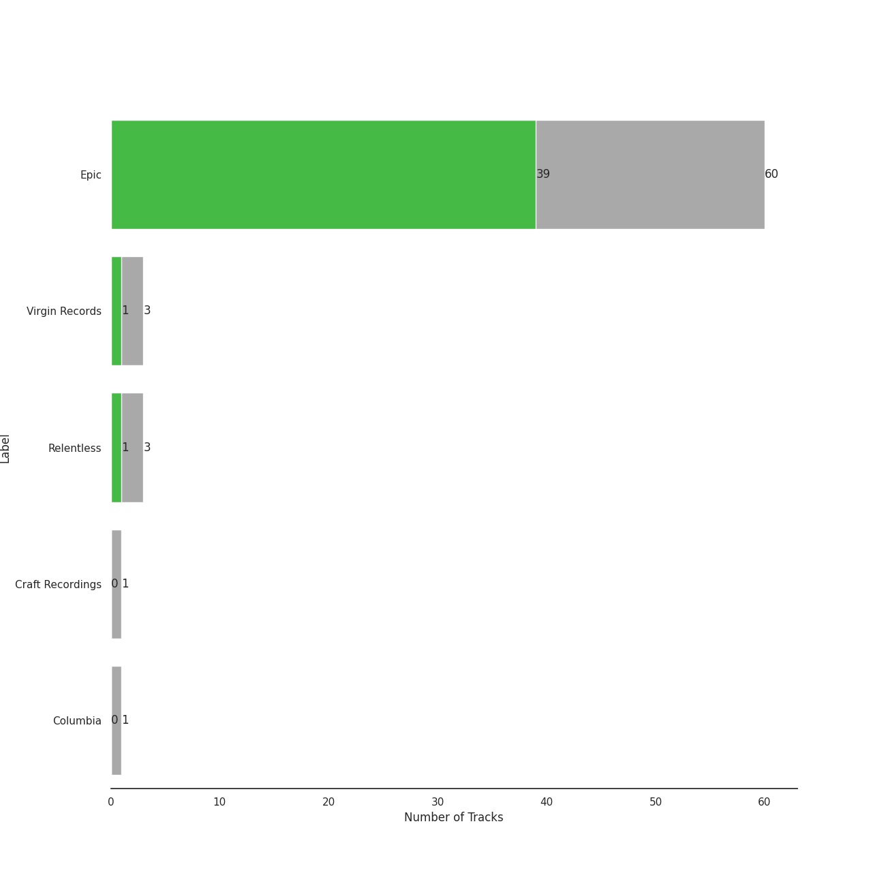
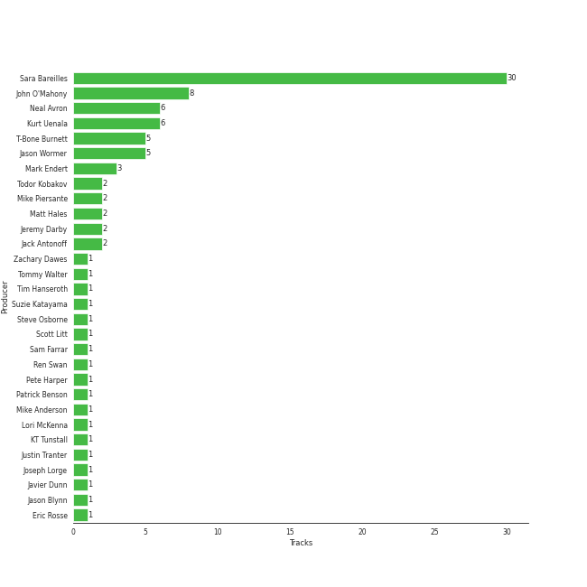
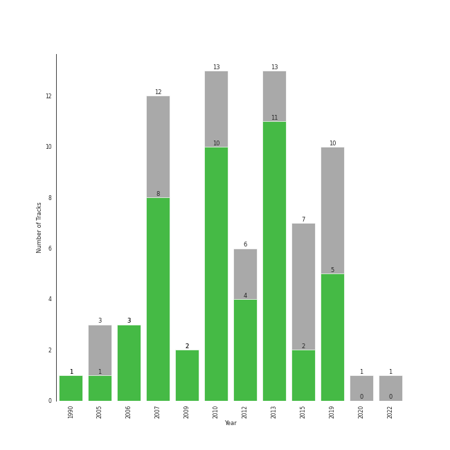

# ectofolk

72 songs

[See Track Features](audio_features.md)

[See Clusters](clusters/overview.md)

## Top Artists

| Art | Tracks | 💚 | Artist | 🔗 |
|:---|---:|---:|:---|:---|
|  | 61 | 40 | [Sara Bareilles](../../artists/sara_bareilles/overview.md) | [🔗](https://open.spotify.com/artist/2Sqr0DXoaYABbjBo9HaMkM) |
|  | 4 | 4 | Regina Spektor | [🔗](https://open.spotify.com/artist/3z6Gk257P9jNcZbBXJNX5i) |
|  | 3 | 2 | Brandi Carlile | [🔗](https://open.spotify.com/artist/2sG4zTOLvjKG1PSoOyf5Ej) |
|  | 3 | 1 | KT Tunstall | [🔗](https://open.spotify.com/artist/5zzrJD2jXrE9dZ1AklRFcL) |
|  | 1 | 1 | Indigo Girls | [🔗](https://open.spotify.com/artist/4wM29TDTr3HI0qFY3KoSFG) |
|  | 1 | 0 | Jason Mraz | [🔗](https://open.spotify.com/artist/4phGZZrJZRo4ElhRtViYdl) |
|  | 1 | 0 | Brian D'Arcy James | [🔗](https://open.spotify.com/artist/3oYQrBzEQNpxnjWXP54B4n) |

## Most and least listened tracks
| ​ | Most listened tracks | Score | ​​ | Least listened tracks | Score |
|:---|:---|---:|:---|:---|---:|
|  | [Many the Miles](../../artists/sara_bareilles/overview.md) | 367 |  | [Say You're Sorry](../../artists/sara_bareilles/overview.md) | 0 |
|  | [Lie To Me](../../artists/sara_bareilles/overview.md) | 289 |  | [Sweet As Whole](../../artists/sara_bareilles/overview.md) | 0 |
|  | [I Choose You](../../artists/sara_bareilles/overview.md) | 191 |  | [Satellite Call](../../artists/sara_bareilles/overview.md) | 0 |
|  | [Machine Gun](../../artists/sara_bareilles/overview.md) | 163 |  | Eet | 0 |
|  | [Fairytale](../../artists/sara_bareilles/overview.md) | 161 |  | The Eye | 0 |
|  | [Between the Lines](../../artists/sara_bareilles/overview.md) | 103 |  | [Breathe Again](../../artists/sara_bareilles/overview.md) | 0 |
|  | [Not Alone](../../artists/sara_bareilles/overview.md) | 60 |  | [Manhattan](../../artists/sara_bareilles/overview.md) | 0 |
|  | [Poetry by Dead Men](../../artists/sara_bareilles/overview.md) | 49 |  | [Come Round Soon](../../artists/sara_bareilles/overview.md) | 0 |
|  | [Hercules](../../artists/sara_bareilles/overview.md) | 29 |  | [Eden](../../artists/sara_bareilles/overview.md) | 0 |
|  | [Uncharted](../../artists/sara_bareilles/overview.md) | 0 |  | Black Horse And The Cherry Tree | 0 |

## Top Albums

| Art | Tracks | 💚 | Album | Release Date | 🔗 |
|:---|---:|---:|:---|:---|:---|
|  | 13 | 10 | Kaleidoscope Heart | 2010-09-07 | [🔗](https://open.spotify.com/album/627ukPRwYxyBREHxBq0vGJ) |
|  | 12 | 12 | The Blessed Unrest | 2013-07-16 | [🔗](https://open.spotify.com/album/7lpbyGc4fHsQkBTsfWVBhp) |
|  | 12 | 8 | Little Voice | 2007-07-03 | [🔗](https://open.spotify.com/album/2Z9WUERfMjOgQ6ze9TcGbF) |
|  | 10 | 5 | Amidst the Chaos (Bonus Version) | 2019-05-10 | [🔗](https://open.spotify.com/album/5x2sDapUIdq0qk1ezff3gm) |
|  | 6 | 1 | What's Inside: Songs from Waitress | 2015-11-06 | [🔗](https://open.spotify.com/album/1s6codM2ZAB008t9GTyaEk) |
|  | 5 | 4 | Once Upon Another Time | 2012-05-22 | [🔗](https://open.spotify.com/album/1PrqYZJRzGNf8AsSOraxnZ) |
|  | 3 | 3 | Begin to Hope | 2006-06-13 | [🔗](https://open.spotify.com/album/4L4tcx3itXbtx5kuchKhFE) |
|  | 3 | 1 | Eye To The Telescope | 2005-01-01 | [🔗](https://open.spotify.com/album/3j70PDKieTWQAwas3bPHRZ) |
|  | 1 | 1 | The Firewatcher's Daughter | 2015-03-06 | [🔗](https://open.spotify.com/album/5ZpxRLVRkCZ2BXXW1KYbTB) |
|  | 1 | 1 | Nomads · Indians · Saints (Expanded Edition) | 1990-09-21 | [🔗](https://open.spotify.com/album/1KpKdn4HLsD9OAN6GEYAIb) |

See all 16 albums

| Art | Tracks | 💚 | Album | Release Date | 🔗 |
|:---|---:|---:|:---|:---|:---|
|  | 1 | 1 | Give Up The Ghost | 2009-10-05 | [🔗](https://open.spotify.com/album/1NhFksWs1Nsz6wQI8ysTkv) |
|  | 1 | 1 | Far | 2009-06-09 | [🔗](https://open.spotify.com/album/5t0lQDPLF22wmWCtSZkIVv) |
|  | 1 | 0 | More Love - Songs from Little Voice Season One | 2020-09-04 | [🔗](https://open.spotify.com/album/52fzvqGSm991mT6pBgAS6g) |
|  | 1 | 0 | Into The Woods (2022 Broadway Cast Recording) | 2022-09-30 | [🔗](https://open.spotify.com/album/5z6BFXI711HbSAXDjgOAHE) |
|  | 1 | 0 | Brave Enough: Live at the Variety Playhouse | 2013-10-22 | [🔗](https://open.spotify.com/album/7L4ZgnQqEhCEsV9GnMeXtE) |
|  | 1 | 0 | Bear Creek | 2012-06-04 | [🔗](https://open.spotify.com/album/5b8YTIrc88vdnfRguZqvVE) |

## Top Record Labels

| Tracks | 💚 | Label |
|---:|---:|:---|
| 61 | 41 | [Epic](../../labels/epic/overview.md) |
| 4 | 4 | Sire |
| 3 | 1 | [Virgin Records](../../labels/virgin_records/overview.md) |
| 3 | 1 | Relentless |
| 2 | 1 | [Columbia](../../labels/columbia/overview.md) |
| 1 | 1 | ATO Records |
| 1 | 0 | [Craft Recordings](../../labels/craft_recordings/overview.md) |

## Top Producers

| Art | Producer | Tracks | Credit Types |
|:---|:---|---:|:---|
|  | [Sara Bareilles](../../artists/sara_bareilles/overview.md) | 31 | Lyricist, Songwriter, Producer |
| | John O'Mahony | 9 | Producer |
| | Kurt Uenala | 7 | Producer |
| | Neal Avron | 6 | Arranger, Producer |
| | Jason Wormer | 5 | Producer |
| | T-Bone Burnett | 5 | Producer |
|  | Regina Spektor | 4 | Lyricist, Producer, Songwriter |
| | Mark Endert | 3 | Producer |
| | Craig Bishop | 3 | Producer |
| | David Kahne | 3 | Producer |

View all

| Art | Producer | Tracks | Credit Types |
|:---|:---|---:|:---|
| | Todor Kobakov | 2 | Arranger |
| | Jeremy Darby | 2 | Producer |
| | Mike Piersante | 2 | Producer |
| | Matt Hales | 2 | Songwriter |
| | [Jack Antonoff](../../producers/jack_antonoff/overview.md) | 2 | Songwriter |
| | Pete Harper | 1 | Songwriter |
| | Aaron Sterling | 1 | Songwriter |
| | Tommy Walter | 1 | Producer |
| | Javier Dunn | 1 | Songwriter |
| | Jason Blynn | 1 | Songwriter |
| | Ren Swan | 1 | Producer |
| | Steve Osborne | 1 | Producer |
| | Patrick Benson | 1 | Producer |
| | Adam Hawkins | 1 | Producer |
|  | Brandi Carlile | 1 | Songwriter |
| | Zachary Dawes | 1 | Producer |
| | Bruno Ellingham | 1 | Producer |
| | Michael Brauer | 1 | Producer |
| | Eric Rosse | 1 | Producer |
| | Mike Anderson | 1 | Songwriter |
| | Tim Hanseroth | 1 | Songwriter |
| | Justin Tranter | 1 | Songwriter |
| | Joseph Lorge | 1 | Producer |
| | Emily Saliers | 1 | Lyricist, Songwriter |
| | Mike Elizondo | 1 | Producer |
| | Suzie Katayama | 1 | Arranger |
| | Carl Lieberman, RPT | 1 | Producer |
| | Lori McKenna | 1 | Songwriter |
|  | KT Tunstall | 1 | Lyricist, Songwriter |
| | Andy Green | 1 | Producer |
|  | Emily King | 1 | Songwriter |
| | Scott Litt | 1 | Producer |
| | Sam Farrar | 1 | Songwriter |

## Years

| ​ | 10 newest albums | ​​ | 10 oldest albums |
|:---|:---|:---|:---|
|  | Into The Woods (2022 Broadway Cast Recording) (2022-09-30) |  | Nomads · Indians · Saints (Expanded Edition) (1990-09-21) |
|  | More Love - Songs from Little Voice Season One (2020-09-04) |  | Eye To The Telescope (2005-01-01) |
|  | Amidst the Chaos (Bonus Version) (2019-05-10) |  | Begin to Hope (2006-06-13) |
|  | What's Inside: Songs from Waitress (2015-11-06) |  | Little Voice (2007-07-03) |
|  | The Firewatcher's Daughter (2015-03-06) |  | Far (2009-06-09) |
|  | Brave Enough: Live at the Variety Playhouse (2013-10-22) |  | Give Up The Ghost (2009-10-05) |
|  | The Blessed Unrest (2013-07-16) |  | Kaleidoscope Heart (2010-09-07) |
|  | Bear Creek (2012-06-04) |  | Once Upon Another Time (2012-05-22) |
|  | Once Upon Another Time (2012-05-22) |  | Bear Creek (2012-06-04) |
|  | Kaleidoscope Heart (2010-09-07) |  | The Blessed Unrest (2013-07-16) |

