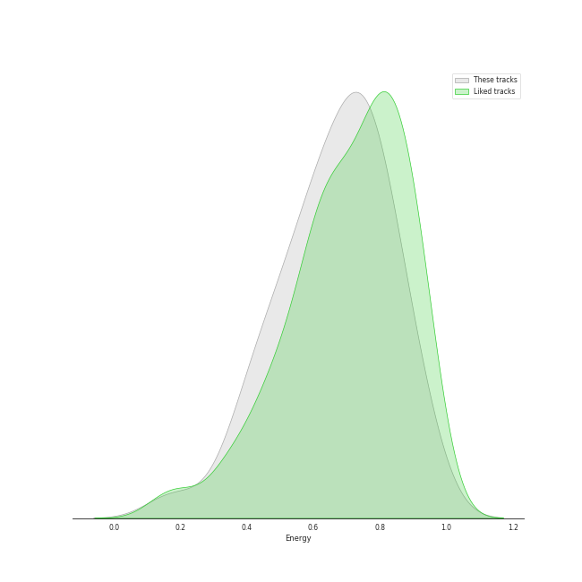
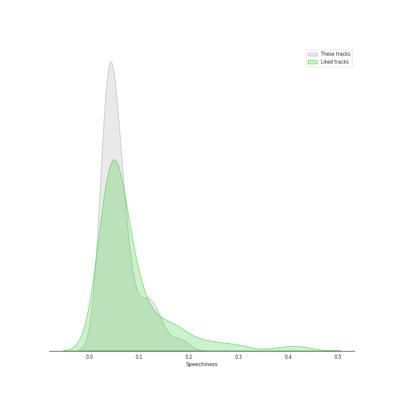
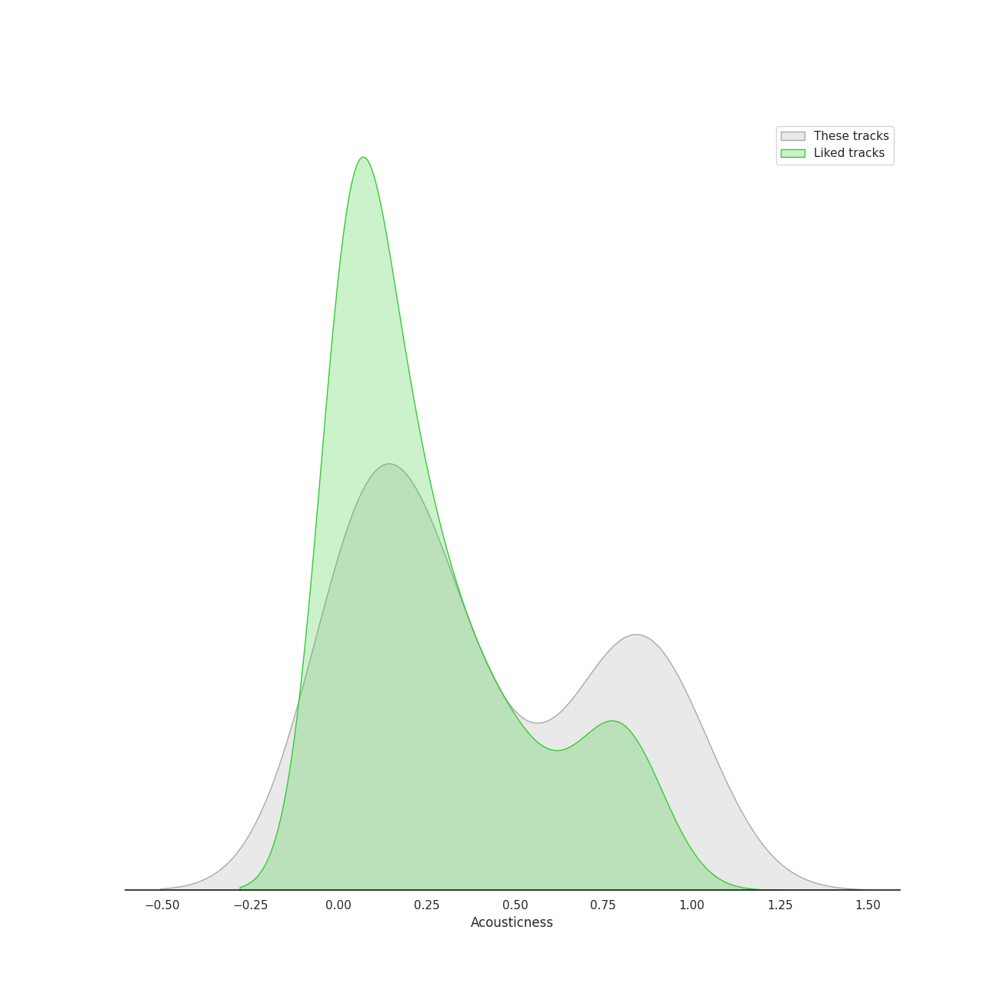
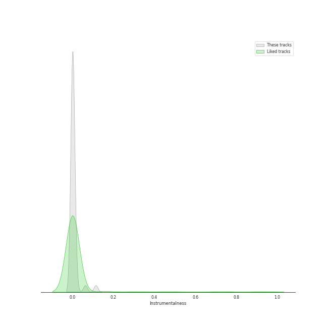
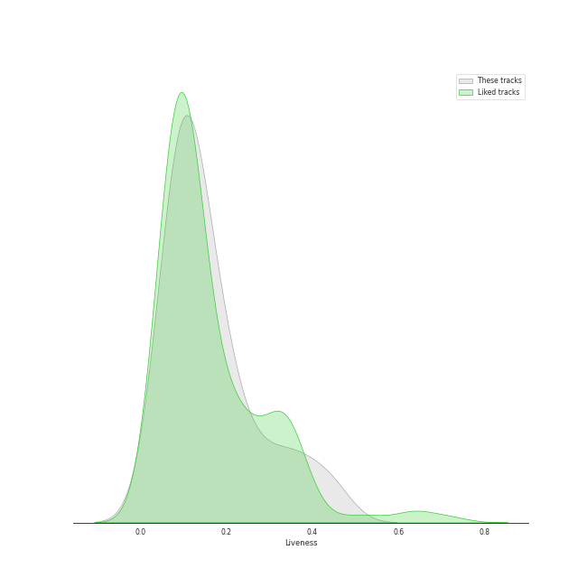
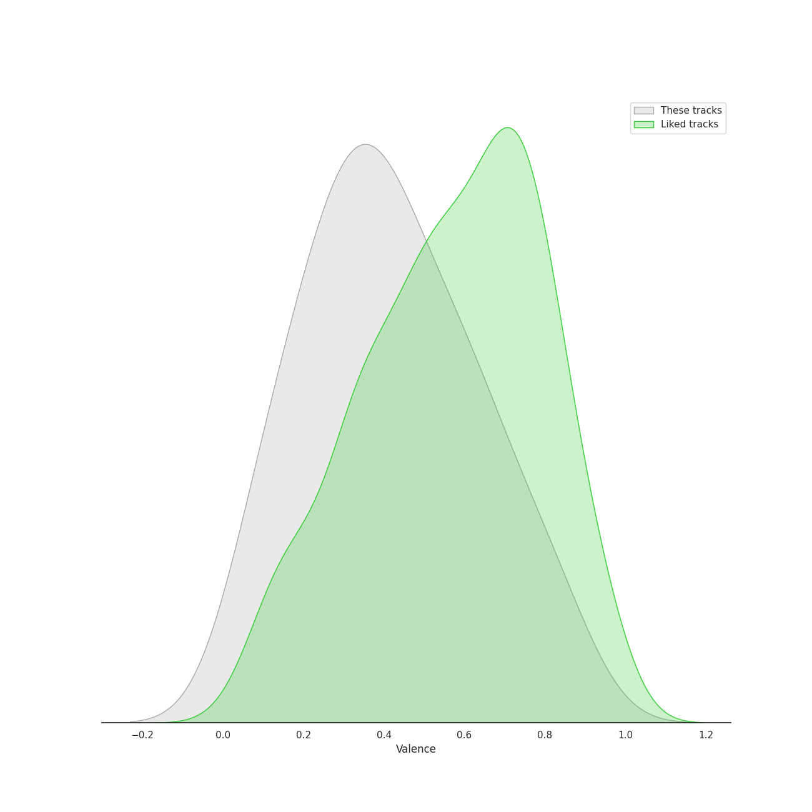

# Track Features for electropop

## Danceability

| ​ | 10 most Danceable tracks | ​​ | 10 least Danceable tracks |
|:---|:---|:---|:---|
|  | Good Intent (0.851) |  | What Kind Of Man (0.313) |
|  | Replay! (0.806) |  | Kiss With A Fist (0.367) |
|  | LA Type (0.773) |  | Seven Devils (0.368) |
|  | Recovery (0.767) |  | How Big, How Blue, How Beautiful (0.372) |
|  | Settle Down (0.763) |  | Waltz Me to the Grave (0.394) |
|  | Without Me (0.752) |  | Foolish Thinking (0.416) |
|  | Hunger (0.729) |  | Delilah (0.426) |
|  | Say My Name (0.722) |  | No Light, No Light (0.429) |
|  | Lollipop (0.711) |  | I'm Not Calling You A Liar (0.44) |
|  | Lightyears (0.682) |  | Never Let Me Go (0.461) |

## Energy

| ​ | 10 most Energetic tracks | ​​ | 10 least Energetic tracks |
|:---|:---|:---|:---|
|  | Cameo Lover (0.922) |  | Foolish Thinking (0.176) |
|  | Like They Do on the TV (0.911) |  | Waltz Me to the Grave (0.352) |
|  | Delilah (0.87) |  | Plain Gold Ring (0.39) |
|  | Rabbit Heart (Raise It Up) (0.865) |  | Between Two Lungs (0.418) |
|  | Grace Kelly (0.82) |  | Happy Ending (0.446) |
|  | Lover To Lover (0.809) |  | Say My Name (0.451) |
|  | Shake It Out (0.804) |  | Without Me (0.488) |
|  | Kiss With A Fist (0.802) |  | I'm Not Calling You A Liar (0.506) |
|  | Recovery (0.8) |  | Old Flame (0.51) |
|  | Dog Days Are Over (0.795) |  | How Big, How Blue, How Beautiful (0.539) |

## Speechiness

| ​ | 10 most Speechy tracks | ​​ | 10 least Speechy tracks |
|:---|:---|:---|:---|
|  | LA Type (0.183) |  | Bad At Love (0.0296) |
|  | Like They Do on the TV (0.134) |  | Happy Ending (0.03) |
|  | Say My Name (0.125) |  | Lover To Lover (0.0309) |
|  | Kiss With A Fist (0.114) |  | What The Water Gave Me (0.0319) |
|  | SUGA's Interlude (0.105) |  | You've Got The Love (0.0324) |
|  | Replay! (0.0813) |  | How Big, How Blue, How Beautiful (0.0324) |
|  | Dog Days Are Over (0.0788) |  | Old Flame (0.0342) |
|  | Recovery (0.0781) |  | The Good War (0.0343) |
|  | Without Me (0.0705) |  | Shake It Out (0.0358) |
|  | I'm Not Calling You A Liar (0.0667) |  | Free (0.0363) |

## Acousticness

| ​ | 10 most Acoustic tracks | ​​ | 10 least Acoustic tracks |
|:---|:---|:---|:---|
|  | Foolish Thinking (0.917) |  | Kiss With A Fist (0.00254) |
|  | Plain Gold Ring (0.9) |  | You've Got The Love (0.00475) |
|  | How Big, How Blue, How Beautiful (0.605) |  | Recovery (0.00747) |
|  | Happy Ending (0.537) |  | Free (0.00777) |
|  | Hunger (0.53) |  | Seven Devils (0.00913) |
|  | Waltz Me to the Grave (0.374) |  | What The Water Gave Me (0.00933) |
|  | I'm Not Calling You A Liar (0.369) |  | Shake It Out (0.0104) |
|  | Without Me (0.297) |  | Lightyears (0.0114) |
|  | Never Let Me Go (0.295) |  | No Light, No Light (0.0125) |
|  | Old Flame (0.288) |  | Grace Kelly (0.0194) |

## Instrumentalness

| ​ | 10 most Instrumental tracks | ​​ | 10 least Instrumental tracks |
|:---|:---|:---|:---|
|  | Like They Do on the TV (0.114) |  | You've Got The Love (0.0) |
|  | Top of the World (0.0626) |  | Happy Ending (0.0) |
|  | Lightyears (0.0149) |  | Say My Name (0.0) |
|  | Grace Kelly (0.0133) |  | What Kind Of Man (0.0) |
|  | Foolish Thinking (0.00957) |  | The Good War (0.0) |
|  | Dog Days Are Over (0.00255) |  | Delilah (0.0) |
|  | Recovery (0.00245) |  | Shake It Out (0.0) |
|  | Replay! (0.00234) |  | SUGA's Interlude (0.0) |
|  | Plain Gold Ring (0.00222) |  | LA Type (0.0) |
|  | Free (0.00196) |  | Hunger (0.0) |

## Liveness

| ​ | 10 most Live tracks | ​​ | 10 least Live tracks |
|:---|:---|:---|:---|
|  | No Light, No Light (0.444) |  | SUGA's Interlude (0.0425) |
|  | Never Let Me Go (0.383) |  | Seven Devils (0.0477) |
|  | Grace Kelly (0.361) |  | Say My Name (0.0596) |
|  | Lover To Lover (0.347) |  | Replay! (0.063) |
|  | Old Flame (0.305) |  | Kiss With A Fist (0.0654) |
|  | I'm Not Calling You A Liar (0.282) |  | Lightyears (0.0731) |
|  | Rabbit Heart (Raise It Up) (0.266) |  | Settle Down (0.0733) |
|  | Somebody Else (0.209) |  | The Good War (0.0832) |
|  | Good Intent (0.204) |  | Recovery (0.0893) |
|  | Happy Ending (0.201) |  | Bad At Love (0.0893) |

## Valence

| ​ | 10 most Happy tracks | ​​ | 10 least Happy tracks |
|:---|:---|:---|:---|
|  | Lollipop (0.857) |  | Free (0.0494) |
|  | Good Intent (0.834) |  | Waltz Me to the Grave (0.0748) |
|  | Recovery (0.771) |  | How Big, How Blue, How Beautiful (0.0825) |
|  | LA Type (0.761) |  | The Good War (0.0928) |
|  | Grace Kelly (0.685) |  | Old Flame (0.0932) |
|  | Cameo Lover (0.669) |  | No Light, No Light (0.162) |
|  | Like They Do on the TV (0.645) |  | What The Water Gave Me (0.184) |
|  | Kiss With A Fist (0.631) |  | Seven Devils (0.211) |
|  | Bad At Love (0.612) |  | Shake It Out (0.221) |
|  | Say My Name (0.571) |  | What Kind Of Man (0.224) |

## Tempo

| ​ | 10 most Fast tracks | ​​ | 10 least Fast tracks |
|:---|:---|:---|:---|
|  | Like They Do on the TV (199.23) |  | Seven Devils (58.534) |
|  | Free (174.806) |  | Old Flame (77.61) |
|  | Delilah (169.946) |  | Plain Gold Ring (85.304) |
|  | Limbo (165.02) |  | Settle Down (93.994) |
|  | Say My Name (164.035) |  | Lollipop (96.001) |
|  | SUGA's Interlude (153.836) |  | Happy Ending (96.043) |
|  | Top of the World (150.039) |  | Kiss With A Fist (107.13) |
|  | Between Two Lungs (149.969) |  | Shake It Out (107.486) |
|  | Dog Days Are Over (149.966) |  | You've Got The Love (109.938) |
|  | LA Type (149.062) |  | Lightyears (110.009) |
