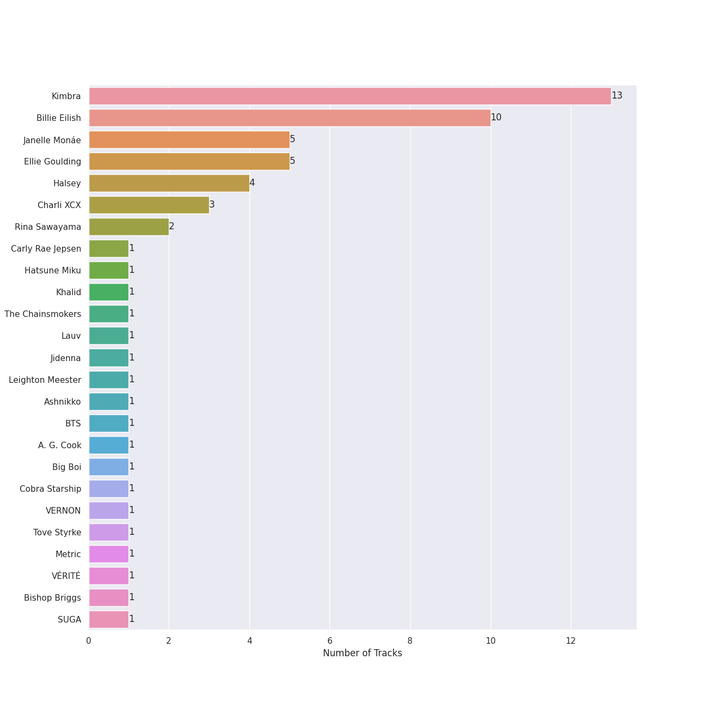
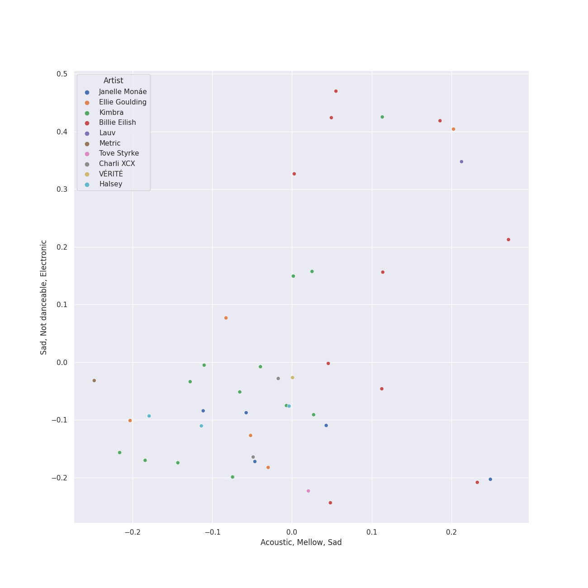
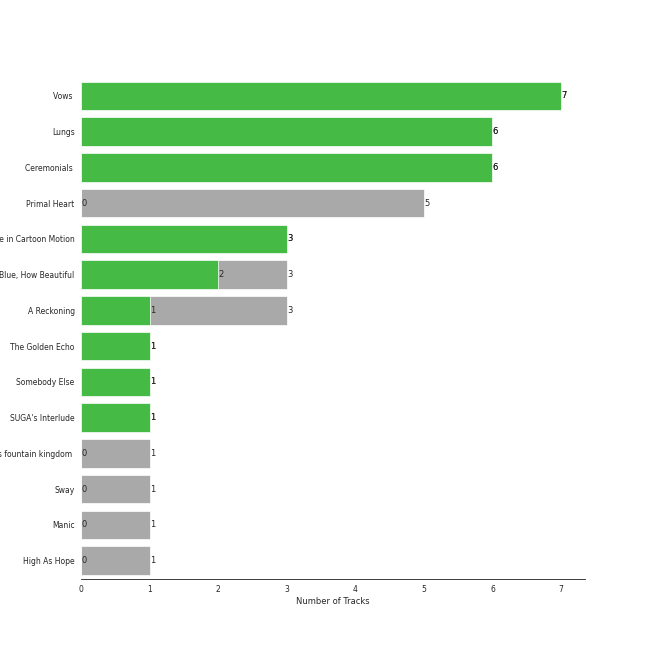
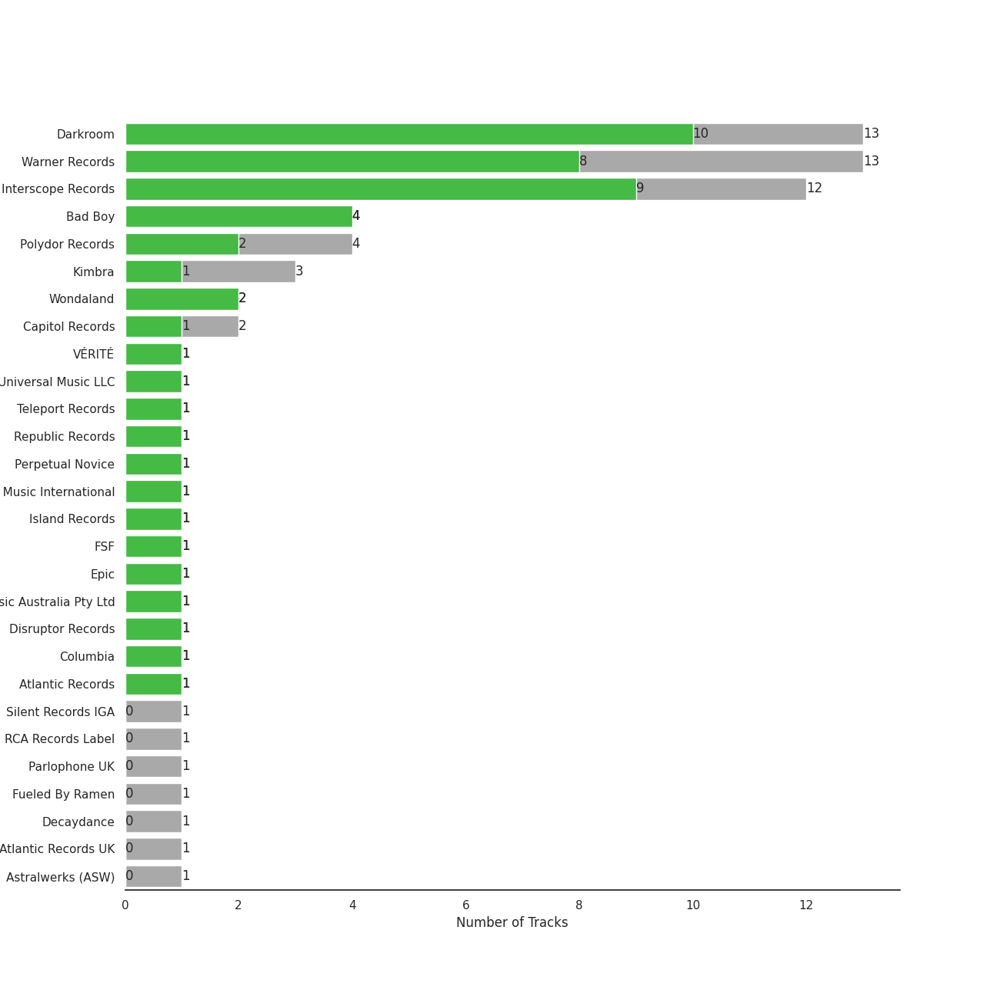
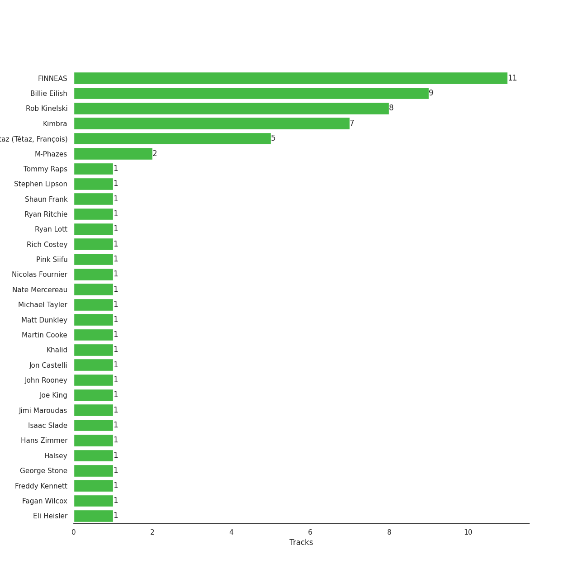
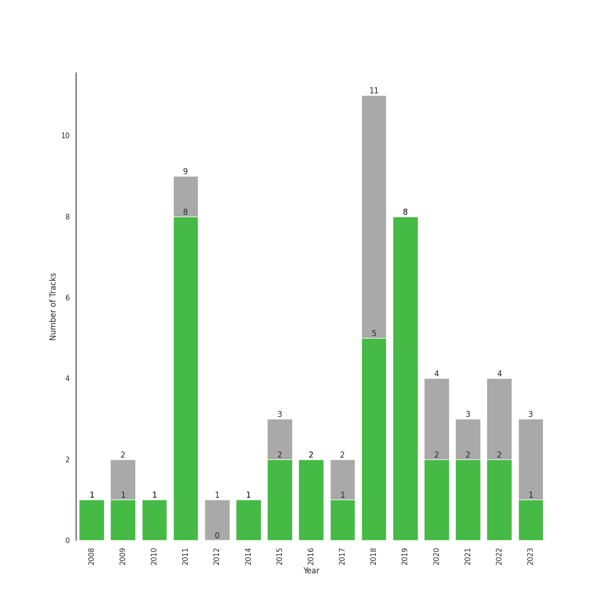

# electropop

42 songs

[See Track Features](audio_features.md)

[See Clusters](clusters/overview.md)

## Top Artists

| Art | Tracks | 💚 | Artist | 🔗 |
|:---|---:|---:|:---|:---|
|  | 16 | 14 | [Florence + The Machine](../../artists/florence_+_the_machine/overview.md) | [🔗](https://open.spotify.com/artist/1moxjboGR7GNWYIMWsRjgG) |
|  | 16 | 9 | [Kimbra](../../artists/kimbra/overview.md) | [🔗](https://open.spotify.com/artist/6hk7Yq1DU9QcCCrz9uc0Ti) |
|  | 3 | 3 | MIKA | [🔗](https://open.spotify.com/artist/5MmVJVhhYKQ86izuGHzJYA) |
|  | 3 | 1 | Halsey | [🔗](https://open.spotify.com/artist/26VFTg2z8YR0cCuwLzESi2) |
|  | 2 | 1 | Rina Sawayama | [🔗](https://open.spotify.com/artist/2KEqzdPS7M5YwGmiuPTdr5) |
|  | 1 | 1 | Pink Siifu | [🔗](https://open.spotify.com/artist/40ZElxHldNyvn7x8WRC6fh) |
|  | 1 | 1 | [BTS](../../artists/bts/overview.md) | [🔗](https://open.spotify.com/artist/3Nrfpe0tUJi4K4DXYWgMUX) |
| | 1 | 1 | Tommy Raps | [🔗](https://open.spotify.com/artist/2jDVhHiltj9mEWoIGdBg3z) |
|  | 1 | 1 | VÉRITÉ | [🔗](https://open.spotify.com/artist/1Fr6agZ6iSM5Ynn2k4C8sc) |
|  | 1 | 1 | SUGA | [🔗](https://open.spotify.com/artist/0ebNdVaOfp6N0oZ1guIxM8) |

See all 12 artists

| Art | Tracks | 💚 | Artist | 🔗 |
|:---|---:|---:|:---|:---|
|  | 1 | 0 | Tove Styrke | [🔗](https://open.spotify.com/artist/2QSPrJfYeRXaltEEiriXN9) |
|  | 1 | 0 | Ryan Lott | [🔗](https://open.spotify.com/artist/0rLLyTr5rx0qYKb63MdVW9) |

## Most and least listened tracks
| ​ | Most listened tracks | Rank | ​​ | Least listened tracks | Rank |
|:---|:---|---:|:---|:---|---:|
|  | [Never Let Me Go](../../artists/florence_+_the_machine/overview.md) | 374 |  | [Recovery](../../artists/kimbra/overview.md) | nan |
|  | [Settle Down](../../artists/kimbra/overview.md) | 443 |  | [Kiss With A Fist](../../artists/florence_+_the_machine/overview.md) | nan |
|  | [What The Water Gave Me](../../artists/florence_+_the_machine/overview.md) | 479 |  | [Lightyears](../../artists/kimbra/overview.md) | nan |
|  | SUGA's Interlude | 499 |  | [Top of the World](../../artists/kimbra/overview.md) | nan |
|  | [Seven Devils](../../artists/florence_+_the_machine/overview.md) | 686 |  | Lollipop | nan |
|  | [Limbo](../../artists/kimbra/overview.md) | 720 |  | [Lover To Lover](../../artists/florence_+_the_machine/overview.md) | nan |
|  | Bad At Love | nan |  | XS | nan |
|  | [Two Way Street](../../artists/kimbra/overview.md) | nan |  | [Dog Days Are Over](../../artists/florence_+_the_machine/overview.md) | nan |
|  | Grace Kelly | nan |  | Happy Ending | nan |
|  | [How Big, How Blue, How Beautiful](../../artists/florence_+_the_machine/overview.md) | nan |  | [Like They Do on the TV](../../artists/kimbra/overview.md) | nan |

## Top Albums

| Art | Tracks | 💚 | Album | Release Date | 🔗 |
|:---|---:|---:|:---|:---|:---|
|  | 7 | 7 | Vows (Deluxe Version) | 2011 | [🔗](https://open.spotify.com/album/6V9rvW05Um5bIHePPfeI8p) |
|  | 6 | 6 | Lungs (Deluxe Edition) | 2009 | [🔗](https://open.spotify.com/album/2FgknX5e7fJlriQtxvpLhZ) |
|  | 6 | 6 | Ceremonials (Deluxe Edition) | 2011-01-01 | [🔗](https://open.spotify.com/album/5SxudoALxEAVh9l83kSebx) |
|  | 5 | 0 | Primal Heart | 2018-04-20 | [🔗](https://open.spotify.com/album/4pj0BkJ7u39i009oqe8V79) |
|  | 3 | 3 | Life in Cartoon Motion | 2007-02-05 | [🔗](https://open.spotify.com/album/4wKkXYJXQWDa9sndBSx0gI) |
|  | 3 | 2 | How Big, How Blue, How Beautiful | 2015-06-01 | [🔗](https://open.spotify.com/album/2btszoya78vyT8fwelmVnz) |
|  | 3 | 1 | A Reckoning | 2023-01-27 | [🔗](https://open.spotify.com/album/2LXTIciAcMZ6wa96d9sLnM) |
|  | 2 | 1 | SAWAYAMA | 2020-04-17 | [🔗](https://open.spotify.com/album/3stadz88XVpHcXnVYMHc4J) |
|  | 1 | 1 | The Golden Echo | 2014-08-15 | [🔗](https://open.spotify.com/album/66hoUkjxM7tVQwu7bZocwP) |
|  | 1 | 1 | Somebody Else | 2016-09-09 | [🔗](https://open.spotify.com/album/3Q4yhhyFA2cpZq2FGOgMwU) |

See all 15 albums

| Art | Tracks | 💚 | Album | Release Date | 🔗 |
|:---|---:|---:|:---|:---|:---|
|  | 1 | 1 | SUGA's Interlude | 2019-12-06 | [🔗](https://open.spotify.com/album/0JfaSjTaej3QB27ofjnbQV) |
|  | 1 | 0 | hopeless fountain kingdom (Deluxe) | 2017-06-02 | [🔗](https://open.spotify.com/album/7GjG91tyHQNGEHzKJaqOi0) |
|  | 1 | 0 | Sway | 2018-05-04 | [🔗](https://open.spotify.com/album/3fSRbKgYW6kcR1ZFMaaNV4) |
|  | 1 | 0 | Manic | 2020-01-17 | [🔗](https://open.spotify.com/album/68enXe5XcJdciSDAZr0Alr) |
|  | 1 | 0 | High As Hope | 2018-06-29 | [🔗](https://open.spotify.com/album/0pKZJj9GzcKPCS8r4IaksA) |

## Top Record Labels

| Tracks | 💚 | Label |
|---:|---:|:---|
| 15 | 14 | [Universal-Island Records Ltd.](../../labels/universal-island_records_ltd_/overview.md) |
| 13 | 8 | [Warner Records](../../labels/warner_records/overview.md) |
| 3 | 3 | Island UK |
| 3 | 3 | Casablanca Records |
| 3 | 1 | Kimbra |
| 2 | 1 | Dirty Hit |
| 2 | 1 | [Capitol Records](../../labels/capitol_records/overview.md) |
| 1 | 1 | VÉRITÉ |
| 1 | 0 | [RCA Records Label](../../labels/rca_records_label/overview.md) |
| 1 | 0 | [EMI](../../labels/emi/overview.md) |

See all 11 labels

| Tracks | 💚 | Label |
|---:|---:|:---|
| 1 | 0 | Astralwerks (ASW) |

## Top Producers

| Art | Producer | Tracks | Credit Types |
|:---|:---|---:|:---|
| | [Florence Welch](../../producers/florence_welch/overview.md) | 12 | Lyricist, Songwriter |
| | [Paul Epworth](../../producers/paul_epworth/overview.md) | 7 | Producer, Lyricist, Songwriter |
|  | [Kimbra](../../artists/kimbra/overview.md) | 7 | Lyricist, Producer, Songwriter |
| | Isabella Summers | 6 | Songwriter, Producer, Lyricist |
| | [François Tétaz (Tétaz, François)](../../producers/françois_tétaz_(tétaz,_françois)/overview.md) | 5 | Lyricist, Producer, Songwriter |
| | Craig Silvey | 4 | Producer |
| | Cenzo Townshend | 4 | Producer |
| | Jimmy Robertson | 3 | Producer |
| | James Ford | 3 | Producer |
|  | MIKA | 3 | Lyricist, Songwriter, Producer |

View all

| Art | Producer | Tracks | Credit Types |
|:---|:---|---:|:---|
| | [Mark "Spike" Stent](../../producers/mark__spike__stent/overview.md) | 3 | Producer |
| | Sally Herbert | 3 | Arranger |
| | Markus Dravs | 2 | Producer |
| | Tom Elmhirst | 2 | Producer |
| | [Kid Harpoon](../../producers/kid_harpoon/overview.md) | 2 | Songwriter |
| | Robin Baynton | 2 | Producer |
| | Bullion | 2 | Producer |
| | M-Phazes | 2 | Producer |
| | Greg Wells | 2 | Producer |
| | Mat Bartram | 1 | Producer |
|  | Pink Siifu | 1 | Lyricist, Songwriter |
| | Josh Diamond | 1 | Songwriter |
| | Fabien Waltmann | 1 | Producer |
| | Nicole Morier | 1 | Songwriter |
| | Will Owen | 1 | Arranger |
| | Rush | 1 | Songwriter |
| | Fagan Wilcox | 1 | Producer |
| | Nicolas Fournier | 1 | Producer |
| | Brian Degraw | 1 | Songwriter |
| | Dan Warner | 1 | Songwriter |
| | Francis White | 1 | Lyricist, Songwriter |
| | Bram Inscore | 1 | Producer, Songwriter |
| | Ryan Ritchie | 1 | Producer |
| | Ali Helnwein | 1 | Arranger |
| | Rich Costey | 1 | Producer |
| | Lizzi Bougatsos | 1 | Songwriter |
| | Jodi Marr | 1 | Songwriter |
| | Daniel Johns | 1 | Songwriter |
| | John Bellamy | 1 | Songwriter |
|  | Ryan Lott | 1 | Producer |
| | Arnecia Michelle Harris | 1 | Songwriter |
| | Eli Crews | 1 | Producer |
| | Pete Prokopiw | 1 | Producer |
| | Martin Cooke | 1 | Producer |
| | Joe Chiccarelli | 1 | Producer |
| | Earl Burroughs | 1 | Songwriter |
| | Anthony B. Stephens | 1 | Songwriter |
| | Tommy Raps | 1 | Lyricist, Songwriter |
|  | Rina Sawayama | 1 | Songwriter |
| | Jimi Maroudas | 1 | Producer |
| | John Rooney | 1 | Producer |
| | Tim Dewit | 1 | Songwriter |
| | George Stone | 1 | Lyricist, Songwriter |
| | Bo Hill | 1 | Producer |
| | Jon Castelli | 1 | Producer |
| | Mark "Top" Rankin | 1 | Producer |
| | Joe Zook | 1 | Producer |
| | John Merchant | 1 | Songwriter |
| | Charlie Hugall | 1 | Producer |
| | Blue Sky Black Death | 1 | Songwriter |
| | Nate Mercereau | 1 | Producer, Songwriter |
| | Chris Nicolaides | 1 | Producer |
| | Michael Tayler | 1 | Producer |

## Years

| ​ | 10 newest albums | ​​ | 10 oldest albums |
|:---|:---|:---|:---|
|  | A Reckoning (2023-01-27) |  | Life in Cartoon Motion (2007-02-05) |
|  | SAWAYAMA (2020-04-17) |  | Lungs (Deluxe Edition) (2009) |
|  | Manic (2020-01-17) |  | Vows (Deluxe Version) (2011) |
|  | SUGA's Interlude (2019-12-06) |  | Ceremonials (Deluxe Edition) (2011-01-01) |
|  | High As Hope (2018-06-29) |  | The Golden Echo (2014-08-15) |
|  | Sway (2018-05-04) |  | How Big, How Blue, How Beautiful (2015-06-01) |
|  | Primal Heart (2018-04-20) |  | Somebody Else (2016-09-09) |
|  | hopeless fountain kingdom (Deluxe) (2017-06-02) |  | hopeless fountain kingdom (Deluxe) (2017-06-02) |
|  | Somebody Else (2016-09-09) |  | Primal Heart (2018-04-20) |
|  | How Big, How Blue, How Beautiful (2015-06-01) |  | Sway (2018-05-04) |

