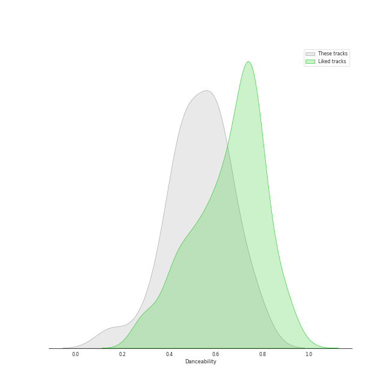
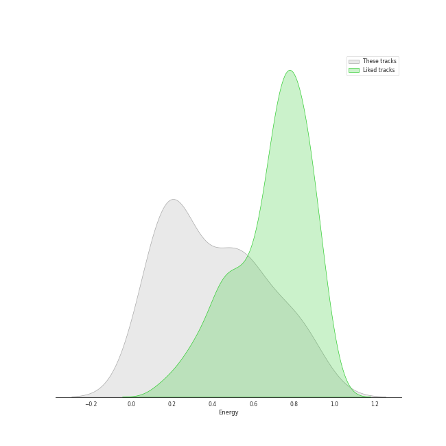
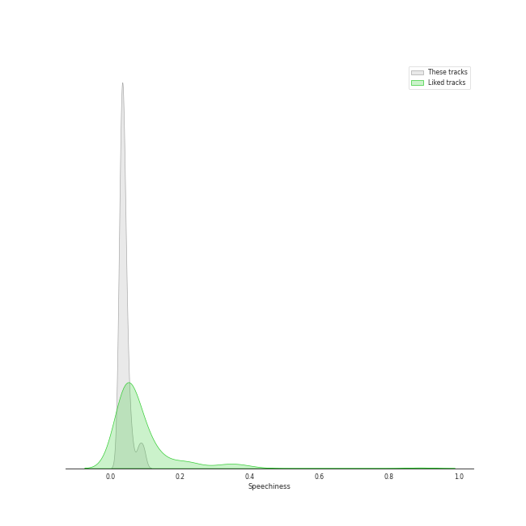
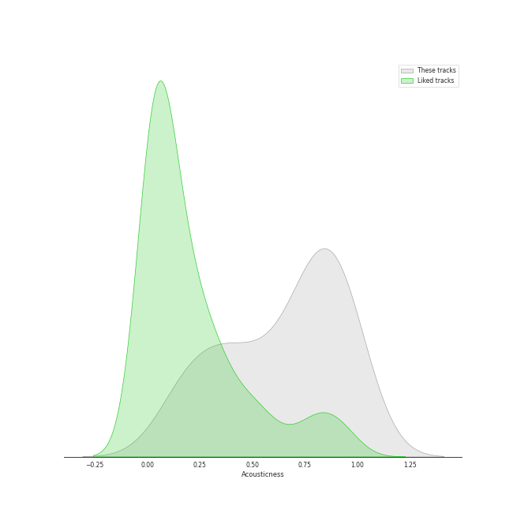
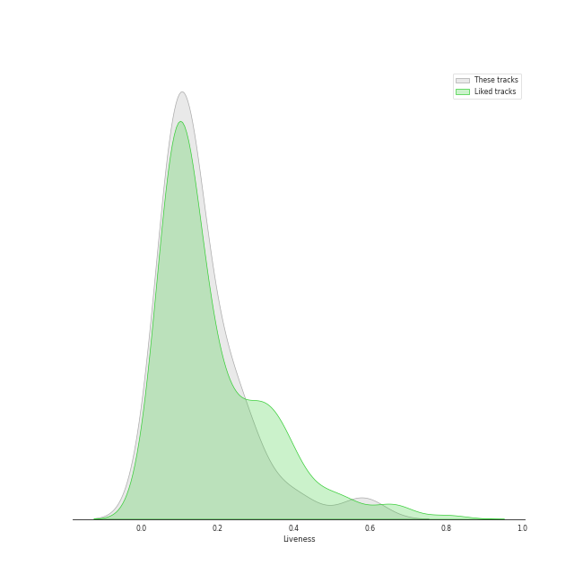
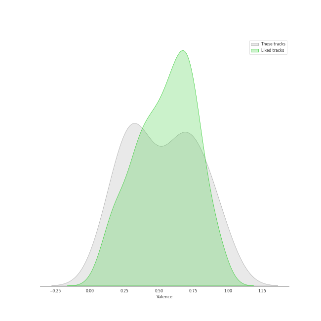
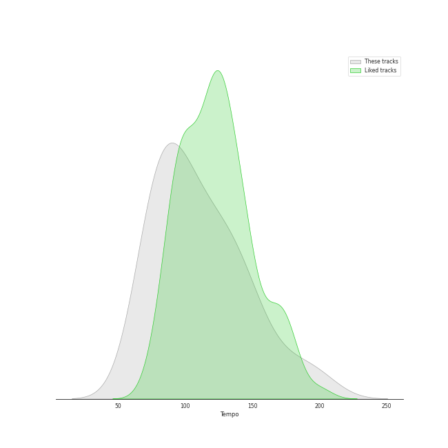

# Track Features for folk

## Danceability

| ​ | 10 most Danceable tracks | ​​ | 10 least Danceable tracks |
|:---|:---|:---|:---|
|  | You Can Call Me Al (0.776) |  | Bridge Over Troubled Water (0.149) |
|  | Cecilia (0.755) |  | Mykonos (0.3) |
|  | I Feel the Earth Move (0.711) |  | The Boxer (0.351) |
|  | A Case of You (0.693) |  | Caroline (0.409) |
|  | White Winter Hymnal (0.629) |  | The Pirate of Penance (0.429) |
|  | White Winter Hymnal (0.628) |  | I Had a King (0.439) |
|  | Carey (0.626) |  | The Boxer (0.439) |
|  | Hammer And A Nail (0.615) |  | The Dawntreader (0.444) |
|  | Big Yellow Taxi (0.611) |  | Blue (0.463) |
|  | Moondance - 2013 Remaster (0.606) |  | Cat's in the Cradle (0.489) |

## Energy

| ​ | 10 most Energetic tracks | ​​ | 10 least Energetic tracks |
|:---|:---|:---|:---|
|  | Cecilia (0.876) |  | The Boxer (0.0802) |
|  | Caroline (0.853) |  | Blue (0.102) |
|  | Hammer And A Nail (0.811) |  | The Dawntreader (0.103) |
|  | You Can Call Me Al (0.763) |  | I Can't Make You Love Me (0.149) |
|  | Can I Believe You (0.755) |  | I Had a King (0.151) |
|  | Free Man in Paris (0.62) |  | So Far Away (0.172) |
|  | Brown Eyed Girl (0.583) |  | The Pirate of Penance (0.185) |
|  | Cat's in the Cradle (0.578) |  | Crazy Love - 2013 Remaster (0.188) |
|  | I Feel the Earth Move (0.576) |  | A Case of You (0.201) |
|  | Carey (0.542) |  | Bridge Over Troubled Water (0.206) |

## Speechiness

| ​ | 10 most Speechy tracks | ​​ | 10 least Speechy tracks |
|:---|:---|:---|:---|
|  | Crazy Love - 2013 Remaster (0.0959) |  | White Winter Hymnal (0.0268) |
|  | Crazy Love (0.0819) |  | White Winter Hymnal (0.0268) |
|  | The Boxer (0.0615) |  | A Case of You (0.0288) |
|  | You Can Call Me Al (0.0534) |  | Can I Believe You (0.03) |
|  | Mrs. Robinson - From "The Graduate" Soundtrack (0.0497) |  | The Sound of Silence - Acoustic Version (0.0301) |
|  | Caroline (0.0458) |  | I Feel the Earth Move (0.0305) |
|  | The Boxer (0.0451) |  | Mykonos (0.0305) |
|  | Blue (0.0436) |  | Hammer And A Nail (0.0306) |
|  | Cat's in the Cradle (0.0418) |  | I Can't Make You Love Me (0.0319) |
|  | The Pirate of Penance (0.0392) |  | Bridge Over Troubled Water (0.0323) |

## Acousticness

| ​ | 10 most Acoustic tracks | ​​ | 10 least Acoustic tracks |
|:---|:---|:---|:---|
|  | Blue (0.989) |  | Hammer And A Nail (0.112) |
|  | The Pirate of Penance (0.973) |  | You Can Call Me Al (0.182) |
|  | I Had a King (0.968) |  | Brown Eyed Girl (0.185) |
|  | The Dawntreader (0.957) |  | Cat's in the Cradle (0.234) |
|  | The Boxer (0.93) |  | Caroline (0.266) |
|  | A Case of You (0.9) |  | Can I Believe You (0.354) |
|  | So Far Away (0.897) |  | Cecilia (0.357) |
|  | Crazy Love (0.85) |  | Mykonos (0.395) |
|  | I Can't Make You Love Me (0.846) |  | White Winter Hymnal (0.438) |
|  | Crazy Love - 2013 Remaster (0.841) |  | White Winter Hymnal (0.44) |

## Instrumentalness

| ​ | 10 most Instrumental tracks | ​​ | 10 least Instrumental tracks |
|:---|:---|:---|:---|
|  | Can I Believe You (0.0664) |  | White Winter Hymnal (0.0) |
|  | I Had a King (0.0108) |  | Carey (0.0) |
|  | You Can Call Me Al (0.00647) |  | Hammer And A Nail (0.0) |
|  | Blue (0.00354) |  | Free Man in Paris (0.0) |
|  | I Feel the Earth Move (0.00226) |  | Cat's in the Cradle (0.0) |
|  | Mykonos (0.000834) |  | White Winter Hymnal (0.0) |
|  | Bridge Over Troubled Water (0.000649) |  | Brown Eyed Girl (0.0) |
|  | The Boxer (0.000339) |  | Caroline (0.0) |
|  | The Dawntreader (0.000153) |  | The Sound of Silence - Acoustic Version (0.0) |
|  | I Can't Make You Love Me (9.65e-05) |  | Big Yellow Taxi (0.0) |

## Liveness

| ​ | 10 most Live tracks | ​​ | 10 least Live tracks |
|:---|:---|:---|:---|
|  | Big Yellow Taxi (0.581) |  | I Feel the Earth Move (0.0528) |
|  | Brown Eyed Girl (0.406) |  | The Boxer (0.0619) |
|  | Caroline (0.311) |  | Free Man in Paris (0.0691) |
|  | Crazy Love (0.27) |  | Mrs. Robinson - From "The Graduate" Soundtrack (0.0747) |
|  | White Winter Hymnal (0.244) |  | So Far Away (0.0753) |
|  | White Winter Hymnal (0.243) |  | You Can Call Me Al (0.077) |
|  | I Can't Make You Love Me (0.236) |  | That Wasn't Me (0.0888) |
|  | Crazy Love - 2013 Remaster (0.228) |  | Carey (0.0949) |
|  | Cecilia (0.22) |  | The Dawntreader (0.101) |
|  | The Boxer (0.16) |  | Hammer And A Nail (0.103) |

## Valence

| ​ | 10 most Happy tracks | ​​ | 10 least Happy tracks |
|:---|:---|:---|:---|
|  | Big Yellow Taxi (0.97) |  | I Can't Make You Love Me (0.113) |
|  | Cecilia (0.954) |  | I Had a King (0.136) |
|  | Brown Eyed Girl (0.908) |  | The Pirate of Penance (0.162) |
|  | You Can Call Me Al (0.82) |  | The Dawntreader (0.235) |
|  | Mrs. Robinson - From "The Graduate" Soundtrack (0.813) |  | That Wasn't Me (0.249) |
|  | Caroline (0.802) |  | Bridge Over Troubled Water (0.264) |
|  | Carey (0.769) |  | Crazy Love (0.325) |
|  | Hammer And A Nail (0.756) |  | The Sound of Silence - Acoustic Version (0.328) |
|  | White Winter Hymnal (0.711) |  | Crazy Love - 2013 Remaster (0.334) |
|  | White Winter Hymnal (0.68) |  | Mykonos (0.342) |

## Tempo

| ​ | 10 most Fast tracks | ​​ | 10 least Fast tracks |
|:---|:---|:---|:---|
|  | Caroline (199.225) |  | Moondance - 2013 Remaster (67.409) |
|  | The Boxer (181.849) |  | Carey (75.368) |
|  | Brown Eyed Girl (150.566) |  | Can I Believe You (77.415) |
|  | Hammer And A Nail (145.152) |  | Crazy Love - 2013 Remaster (77.464) |
|  | So Far Away (143.837) |  | Crazy Love (77.539) |
|  | That Wasn't Me (135.257) |  | Cat's in the Cradle (78.111) |
|  | Blue (133.946) |  | Bridge Over Troubled Water (79.764) |
|  | You Can Call Me Al (128.433) |  | Free Man in Paris (81.429) |
|  | White Winter Hymnal (124.932) |  | Mykonos (82.985) |
|  | White Winter Hymnal (124.92) |  | Big Yellow Taxi (85.527) |
