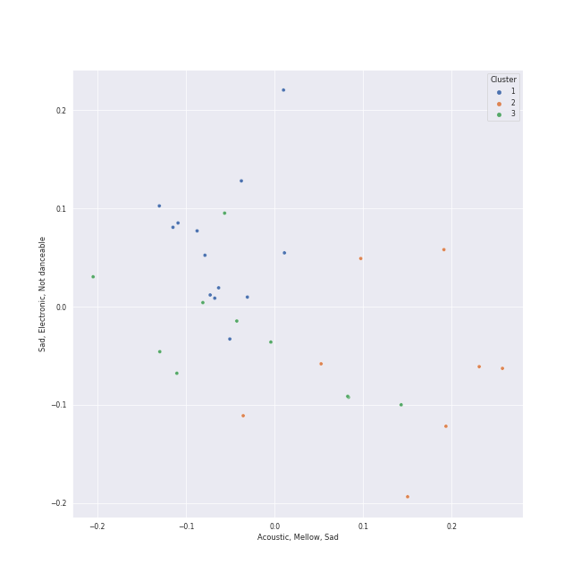

# Clusters in folk

## Cluster #1

9 tracks

| Art | Track | Album | Artists | Label | Rank | 💚 | 🔗 |
|:---|:---|:---|:---|:---|---:|:---|:---|
|  | Moondance - 2013 Remaster | Moondance (Deluxe Edition) | Van Morrison | [Warner Records](../../../../labels/warner_records) | nan | 💚 | [🔗](https://open.spotify.com/track/683b4ikwa62JevCjwrmfg6) |
|  | White Winter Hymnal | Fleet Foxes | Fleet Foxes | Sub Pop Records | 386 | 💚 | [🔗](https://open.spotify.com/track/0GegHVxeozw3rdjte45Bfx) |
|  | Carey | Blue | [Joni Mitchell](../../../../artists/joni_mitchell/overview.md) | [Rhino](../../../../labels/rhino) | nan | 💚 | [🔗](https://open.spotify.com/track/11dUk8E2z8Oj1JURwl7GJd) |
|  | A Case of You | Blue | [Joni Mitchell](../../../../artists/joni_mitchell/overview.md) | [Rhino](../../../../labels/rhino) | nan | 💚 | [🔗](https://open.spotify.com/track/7shVwhUdVbHpykOfbzvDc1) |
|  | Free Man in Paris | Court and Spark | [Joni Mitchell](../../../../artists/joni_mitchell/overview.md) | [Rhino](../../../../labels/rhino) | nan | 💚 | [🔗](https://open.spotify.com/track/2by5mqpQ1ZP2G5FOIccMnu) |
|  | Big Yellow Taxi | Ladies of the Canyon | [Joni Mitchell](../../../../artists/joni_mitchell/overview.md) | [Rhino](../../../../labels/rhino) | nan | 💚 | [🔗](https://open.spotify.com/track/6UkMcAA19lTdjs22jtB7o2) |
|  | Mrs. Robinson - From "The Graduate" Soundtrack | Bookends | [Simon & Garfunkel](../../../../artists/simon___garfunkel/overview.md) | [Columbia](../../../../labels/columbia) | nan | 💚 | [🔗](https://open.spotify.com/track/0iOZM63lendWRTTeKhZBSC) |
|  | The Boxer | Bridge Over Troubled Water | [Simon & Garfunkel](../../../../artists/simon___garfunkel/overview.md) | [Columbia](../../../../labels/columbia) | nan | 💚 | [🔗](https://open.spotify.com/track/76TZCvJ8GitQ2FA1q5dKu0) |
|  | I Feel the Earth Move | Tapestry | Carole King | Ode, [Epic](../../../../labels/epic), [Legacy](../../../../labels/legacy) | nan | | [🔗](https://open.spotify.com/track/1BWsOxeMx83OrKGCV4gxly) |
## Cluster #2

8 tracks

| Art | Track | Album | Artists | Label | Rank | 💚 | 🔗 |
|:---|:---|:---|:---|:---|---:|:---|:---|
|  | Brown Eyed Girl | Blowin' Your Mind! | Van Morrison | [Columbia](../../../../labels/columbia), [Legacy](../../../../labels/legacy) | nan | 💚 | [🔗](https://open.spotify.com/track/3yrSvpt2l1xhsV9Em88Pul) |
|  | Mykonos | First Collection 2006-2009 | Fleet Foxes | Sub Pop Records | nan | 💚 | [🔗](https://open.spotify.com/track/2s7pyee9w04uQy3cNKzey9) |
|  | Can I Believe You | Shore | Fleet Foxes | Anti/Epitaph | nan | 💚 | [🔗](https://open.spotify.com/track/3pYB28IRzhtR5cHXLINchp) |
|  | Caroline | Give Up The Ghost | Brandi Carlile | [Columbia](../../../../labels/columbia) | nan | 💚 | [🔗](https://open.spotify.com/track/4DVgaZDTvz72q3jAepAAbe) |
|  | Cecilia | Bridge Over Troubled Water | [Simon & Garfunkel](../../../../artists/simon___garfunkel/overview.md) | [Columbia](../../../../labels/columbia) | nan | 💚 | [🔗](https://open.spotify.com/track/6QhXQOpyYvbpdbyjgAqKdY) |
|  | You Can Call Me Al | Graceland (25th Anniversary Deluxe Edition) | Paul Simon | Legacy Recordings | nan | 💚 | [🔗](https://open.spotify.com/track/0qxYx4F3vm1AOnfux6dDxP) |
|  | Hammer And A Nail | Nomads · Indians · Saints (Expanded Edition) | Indigo Girls | [Epic](../../../../labels/epic) | nan | 💚 | [🔗](https://open.spotify.com/track/2OV25P5lmVqnjKnWfj0FeP) |
|  | Cat's in the Cradle | Verities & Balderdash | Harry Chapin | [Rhino/Elektra](../../../../labels/rhino) | nan | 💚 | [🔗](https://open.spotify.com/track/2obblQ6tcePeOEVJV6nEGD) |
## Cluster #3

13 tracks

| Art | Track | Album | Artists | Label | Rank | 💚 | 🔗 |
|:---|:---|:---|:---|:---|---:|:---|:---|
|  | Crazy Love | The Essential Van Morrison | Van Morrison | Legacy Recordings | nan | | [🔗](https://open.spotify.com/track/04glHdRn4SgTADxKoKzOoO) |
|  | Crazy Love - 2013 Remaster | Moondance (Expanded Edition) | Van Morrison | [Warner Records](../../../../labels/warner_records) | nan | | [🔗](https://open.spotify.com/track/2hjAc6x8EoSLhGxRNg8KEw) |
|  | The Dawntreader | Song to a Seagull | [Joni Mitchell](../../../../artists/joni_mitchell/overview.md) | [Rhino](../../../../labels/rhino) | nan | | [🔗](https://open.spotify.com/track/0KE9YElZqPumrpm9ovtXlN) |
|  | The Pirate of Penance | Song to a Seagull | [Joni Mitchell](../../../../artists/joni_mitchell/overview.md) | [Rhino](../../../../labels/rhino) | nan | | [🔗](https://open.spotify.com/track/53QbBfo0PTUKfOBM0YoPU7) |
|  | I Had a King | Song to a Seagull | [Joni Mitchell](../../../../artists/joni_mitchell/overview.md) | [Rhino](../../../../labels/rhino) | nan | 💚 | [🔗](https://open.spotify.com/track/6rj2z2taVIxPRnzx5LJkGm) |
|  | The Eye | The Firewatcher's Daughter | Brandi Carlile | ATO Records | nan | 💚 | [🔗](https://open.spotify.com/track/0Plf9mewMoYkwEvncCjfxS) |
|  | That Wasn't Me | Bear Creek | Brandi Carlile | [Columbia](../../../../labels/columbia) | nan | 💚 | [🔗](https://open.spotify.com/track/6iqAJh3X8bf94eo4reme5L) |
|  | The Sound of Silence - Acoustic Version | Wednesday Morning, 3 A.M. | [Simon & Garfunkel](../../../../artists/simon___garfunkel/overview.md) | [Columbia](../../../../labels/columbia) | nan | 💚 | [🔗](https://open.spotify.com/track/5y788ya4NvwhBznoDIcXwK) |
|  | The Boxer | Good Vibrations | Paul Simon, The King's Singers | RCA Victor | nan | | [🔗](https://open.spotify.com/track/5lRqY3uEKRCqSA0vXI4Lf7) |
|  | So Far Away | Tapestry | Carole King | Ode, [Epic](../../../../labels/epic), [Legacy](../../../../labels/legacy) | nan | | [🔗](https://open.spotify.com/track/4HHge4zAyIw3pkrtFzmwCl) |