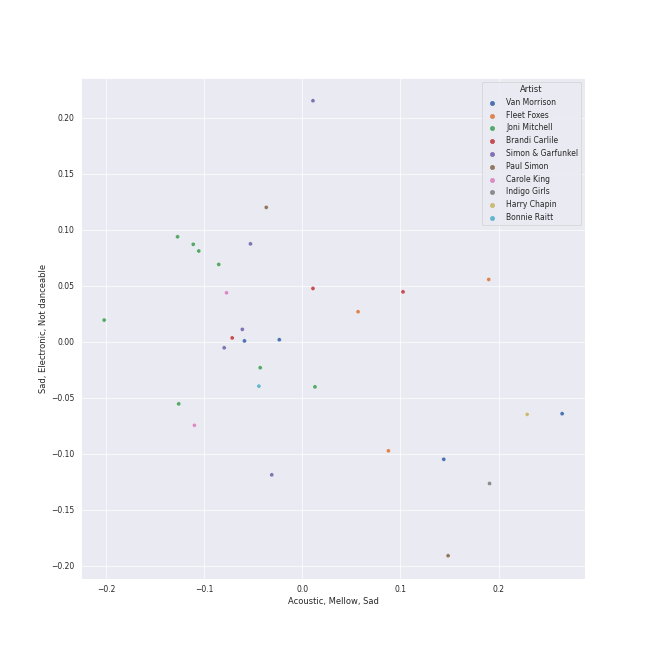
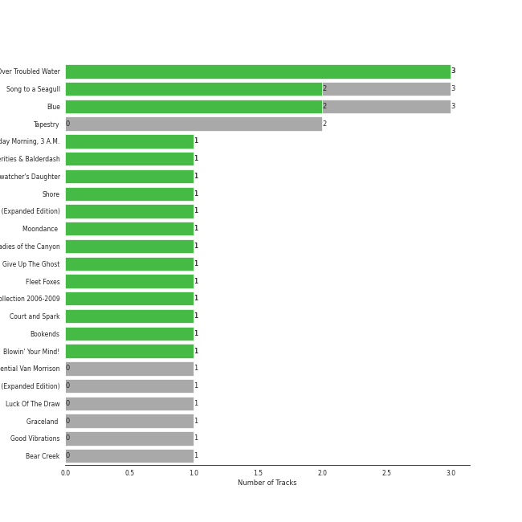
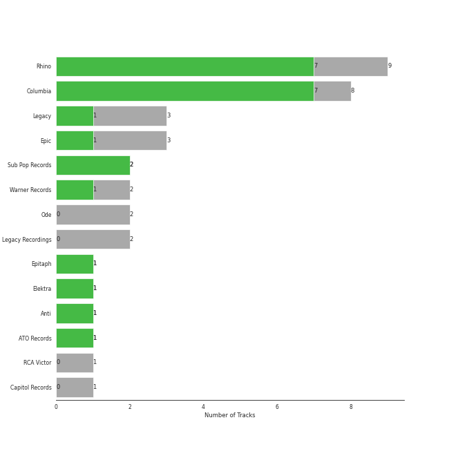
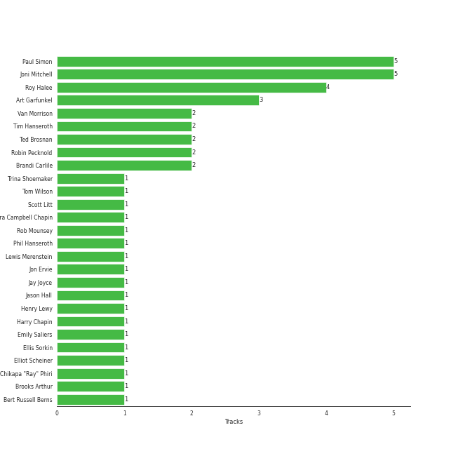
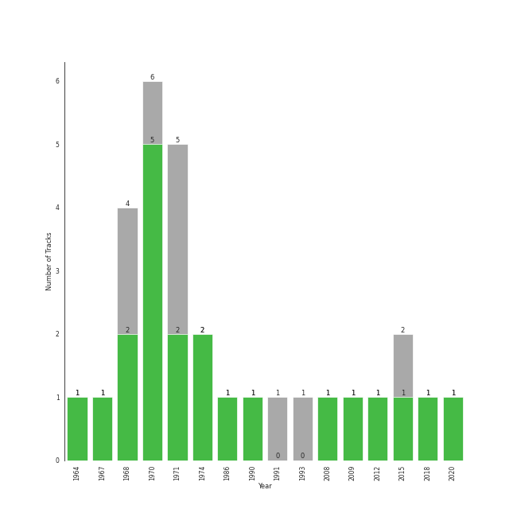

# folk

30 songs

[See Track Features](audio_features.md)

[See Clusters](clusters/overview.md)

## Top Artists

| Art | Rank | Tracks | 💚 | Artist | 🔗 |
|:---|---:|---:|---:|:---|:---|
|  | 395 | 8 | 5 | [Joni Mitchell](../../artists/joni_mitchell/overview.md) | [🔗](https://open.spotify.com/artist/5hW4L92KnC6dX9t7tYM4Ve) |
|  | 427 | 5 | 5 | [Simon & Garfunkel](../../artists/simon___garfunkel/overview.md) | [🔗](https://open.spotify.com/artist/70cRZdQywnSFp9pnc2WTCE) |
|  | 206 | 3 | 3 | Fleet Foxes | [🔗](https://open.spotify.com/artist/4EVpmkEwrLYEg6jIsiPMIb) |
|  | 427 | 3 | 3 | Brandi Carlile | [🔗](https://open.spotify.com/artist/2sG4zTOLvjKG1PSoOyf5Ej) |
|  | 427 | 4 | 2 | Van Morrison | [🔗](https://open.spotify.com/artist/44NX2ffIYHr6D4n7RaZF7A) |
|  | 427 | 2 | 1 | Paul Simon | [🔗](https://open.spotify.com/artist/2CvCyf1gEVhI0mX6aFXmVI) |
|  | 427 | 1 | 1 | Indigo Girls | [🔗](https://open.spotify.com/artist/4wM29TDTr3HI0qFY3KoSFG) |
|  | 427 | 1 | 1 | Harry Chapin | [🔗](https://open.spotify.com/artist/42q4Ivs7tAiCZ5C7eG5q4c) |
|  | 207 | 1 | 1 | Elton John | [🔗](https://open.spotify.com/artist/3PhoLpVuITZKcymswpck5b) |
|  | 427 | 2 | 0 | Carole King | [🔗](https://open.spotify.com/artist/319yZVtYM9MBGqmSQnMyY6) |

See all 12 artists

| Art | Rank | Tracks | 💚 | Artist | 🔗 |
|:---|---:|---:|---:|:---|:---|
|  | 427 | 1 | 0 | The King's Singers | [🔗](https://open.spotify.com/artist/5lR7yDVN4z9kahOiUSlMhe) |
|  | 427 | 1 | 0 | Bonnie Raitt | [🔗](https://open.spotify.com/artist/4KDyYWR7IpxZ7xrdYbKrqY) |

## Most and least listened tracks
| Rank | ​ | Most listened tracks | Rank | ​​ | Least listened tracks |
|---:|:---|:---|---:|:---|:---|
| 496 |  | White Winter Hymnal | 955 |  | [A Case of You](../../artists/joni_mitchell/overview.md) |
| 867 |  | [The Dawntreader](../../artists/joni_mitchell/overview.md) | 955 |  | [The Boxer](../../artists/simon___garfunkel/overview.md) |
| 955 |  | Crazy Love | 955 |  | [I Had a King](../../artists/joni_mitchell/overview.md) |
| 955 |  | The Eye | 955 |  | [Bridge Over Troubled Water](../../artists/simon___garfunkel/overview.md) |
| 955 |  | [Mrs. Robinson - From "The Graduate" Soundtrack](../../artists/simon___garfunkel/overview.md) | 955 |  | That Wasn't Me |
| 955 |  | You Can Call Me Al | 955 |  | [Big Yellow Taxi](../../artists/joni_mitchell/overview.md) |
| 955 |  | [Carey](../../artists/joni_mitchell/overview.md) | 955 |  | [Cecilia](../../artists/simon___garfunkel/overview.md) |
| 955 |  | I Feel the Earth Move | 955 |  | I Can't Make You Love Me |
| 955 |  | [Blue](../../artists/joni_mitchell/overview.md) | 955 |  | Moondance - 2013 Remaster |
| 955 |  | Hammer And A Nail | 955 |  | [The Sound of Silence - Acoustic Version](../../artists/simon___garfunkel/overview.md) |

## Top Albums

| Art | Rank | Tracks | 💚 | Album | Release Date | 🔗 |
|:---|---:|---:|---:|:---|:---|:---|
|  | 630 | 3 | 3 | Bridge Over Troubled Water | 1970-01-26 | [🔗](https://open.spotify.com/album/0JwHz5SSvpYWuuCNbtYZoV) |
|  | 630 | 3 | 2 | Blue | 1971-06-22 | [🔗](https://open.spotify.com/album/1vz94WpXDVYIEGja8cjFNa) |
|  | 572 | 3 | 1 | Song to a Seagull | 1968-03-01 | [🔗](https://open.spotify.com/album/6rg3WTvmv68Vd6tgR0yS0E) |
|  | 630 | 2 | 0 | Tapestry | 1971 | [🔗](https://open.spotify.com/album/12n11cgnpjXKLeqrnIERoS) |
|  | 630 | 1 | 1 | Wednesday Morning, 3 A.M. | 1964-10-19 | [🔗](https://open.spotify.com/album/5pnJrocLlZ3FWEbcr2PTz0) |
|  | 630 | 1 | 1 | Verities & Balderdash | 1974 | [🔗](https://open.spotify.com/album/3nta4nhqWoWjc6LmHIB0kT) |
|  | 630 | 1 | 1 | The Firewatcher's Daughter | 2015-03-06 | [🔗](https://open.spotify.com/album/5ZpxRLVRkCZ2BXXW1KYbTB) |
|  | 630 | 1 | 1 | Shore | 2020-09-22 | [🔗](https://open.spotify.com/album/0lmjCPEcec2k6L7ysNIcd3) |
|  | 630 | 1 | 1 | Nomads · Indians · Saints (Expanded Edition) | 1990-09-21 | [🔗](https://open.spotify.com/album/1KpKdn4HLsD9OAN6GEYAIb) |
|  | 630 | 1 | 1 | Moondance (Deluxe Edition) | 1970-02 | [🔗](https://open.spotify.com/album/7diHYi0CglGJekoM3KaWBK) |

See all 23 albums

| Art | Rank | Tracks | 💚 | Album | Release Date | 🔗 |
|:---|---:|---:|---:|:---|:---|:---|
|  | 630 | 1 | 1 | Ladies of the Canyon | 1970-03-01 | [🔗](https://open.spotify.com/album/7JOdtLDLyXJIppDRB7kxr9) |
|  | 630 | 1 | 1 | Graceland (25th Anniversary Deluxe Edition) | 1986-08-12 | [🔗](https://open.spotify.com/album/6WgGWYw6XXQyLTsWt7tXky) |
|  | 630 | 1 | 1 | Give Up The Ghost | 2009-10-05 | [🔗](https://open.spotify.com/album/1NhFksWs1Nsz6wQI8ysTkv) |
|  | 349 | 1 | 1 | Fleet Foxes | 2008-06-03 | [🔗](https://open.spotify.com/album/5GRnydamKvIeG46dycID6v) |
|  | 630 | 1 | 1 | First Collection 2006-2009 | 2018-11-09 | [🔗](https://open.spotify.com/album/6ou9sQOsIY5xIIX417L3ud) |
|  | 630 | 1 | 1 | Court and Spark | 1974-01-17 | [🔗](https://open.spotify.com/album/2akjxkzFolkeV72Yyv5KrM) |
|  | 630 | 1 | 1 | Bookends | 1968-04-03 | [🔗](https://open.spotify.com/album/3bzgbgiytguTDnwzflAZr2) |
|  | 630 | 1 | 1 | Blowin' Your Mind! | 1967-09 | [🔗](https://open.spotify.com/album/7dsWupQRlFuhG8FGiQAUjC) |
|  | 630 | 1 | 1 | Bear Creek | 2012-06-04 | [🔗](https://open.spotify.com/album/5b8YTIrc88vdnfRguZqvVE) |
|  | 630 | 1 | 0 | The Essential Van Morrison | 2015-12-04 | [🔗](https://open.spotify.com/album/0RXzDyBEGd2EGQTmv8cxQa) |
|  | 630 | 1 | 0 | Moondance (Expanded Edition) | 1970-02 | [🔗](https://open.spotify.com/album/6yNYC35npMBHbxG0Vle83O) |
|  | 630 | 1 | 0 | Luck Of The Draw | 1991-01-01 | [🔗](https://open.spotify.com/album/6blrkOZ0VmkhYPjfoD7eqf) |
|  | 630 | 1 | 0 | Good Vibrations | 1993 | [🔗](https://open.spotify.com/album/10IUKCLZPs9onPwXfQVxfv) |

## Top Record Labels

| Tracks | 💚 | Label |
|---:|---:|:---|
| 8 | 8 | [Columbia](../../labels/columbia/overview.md) |
| 9 | 6 | [Rhino](../../labels/rhino/overview.md) |
| 2 | 2 | Sub Pop Records |
| 3 | 1 | [Legacy](../../labels/legacy/overview.md) |
| 3 | 1 | [Epic](../../labels/epic/overview.md) |
| 2 | 1 | [Warner Records](../../labels/warner_records/overview.md) |
| 2 | 1 | Legacy Recordings |
| 1 | 1 | Epitaph |
| 1 | 1 | Elektra |
| 1 | 1 | Anti |

See all 14 labels

| Tracks | 💚 | Label |
|---:|---:|:---|
| 1 | 1 | ATO Records |
| 2 | 0 | Ode |
| 1 | 0 | RCA Victor |
| 1 | 0 | [Capitol Records](../../labels/capitol_records/overview.md) |

## Top Producers

| Art | Producer | Tracks | Credit Types |
|:---|:---|---:|:---|
|  | Paul Simon | 5 | Lyricist, Producer, Songwriter |
|  | [Joni Mitchell](../../artists/joni_mitchell/overview.md) | 5 | Lyricist, Songwriter, Producer |
| | Roy Halee | 4 | Producer |
| | Art Garfunkel | 3 | Producer |
| | Robin Pecknold | 2 | Lyricist, Songwriter |
| | Tim Hanseroth | 2 | Songwriter, Producer |
|  | Brandi Carlile | 2 | Songwriter, Lyricist, Producer |
| | Ted Brosnan | 2 | Producer |
|  | Van Morrison | 2 | Lyricist, Producer, Songwriter |
| | Bert Russell Berns | 1 | Producer |

View all

| Art | Producer | Tracks | Credit Types |
|:---|:---|---:|:---|
| | Lewis Merenstein | 1 | Producer |
| | Jason Hall | 1 | Producer |
| | Phil Hanseroth | 1 | Producer |
|  | Harry Chapin | 1 | Songwriter |
| | Scott Litt | 1 | Producer |
| | Ellis Sorkin | 1 | Producer |
| | Jon Ervie | 1 | Producer |
| | Elliot Scheiner | 1 | Producer |
| | Chikapa "Ray" Phiri | 1 | Arranger |
| | Henry Lewy | 1 | Producer |
| | Jay Joyce | 1 | Producer |
| | Brooks Arthur | 1 | Producer |
| | Tom Wilson | 1 | Producer |
| | Sandra Campbell Chapin | 1 | Songwriter |
| | Emily Saliers | 1 | Lyricist, Songwriter |
| | Rob Mounsey | 1 | Arranger |
| | Trina Shoemaker | 1 | Producer |

## Years

| ​ | 10 newest albums | ​​ | 10 oldest albums |
|:---|:---|:---|:---|
|  | Shore (2020-09-22) |  | Wednesday Morning, 3 A.M. (1964-10-19) |
|  | First Collection 2006-2009 (2018-11-09) |  | Blowin' Your Mind! (1967-09) |
|  | The Essential Van Morrison (2015-12-04) |  | Song to a Seagull (1968-03-01) |
|  | The Firewatcher's Daughter (2015-03-06) |  | Bookends (1968-04-03) |
|  | Bear Creek (2012-06-04) |  | Bridge Over Troubled Water (1970-01-26) |
|  | Give Up The Ghost (2009-10-05) |  | Moondance (Deluxe Edition) (1970-02) |
|  | Fleet Foxes (2008-06-03) |  | Moondance (Expanded Edition) (1970-02) |
|  | Good Vibrations (1993) |  | Ladies of the Canyon (1970-03-01) |
|  | Luck Of The Draw (1991-01-01) |  | Tapestry (1971) |
|  | Nomads · Indians · Saints (Expanded Edition) (1990-09-21) |  | Blue (1971-06-22) |

