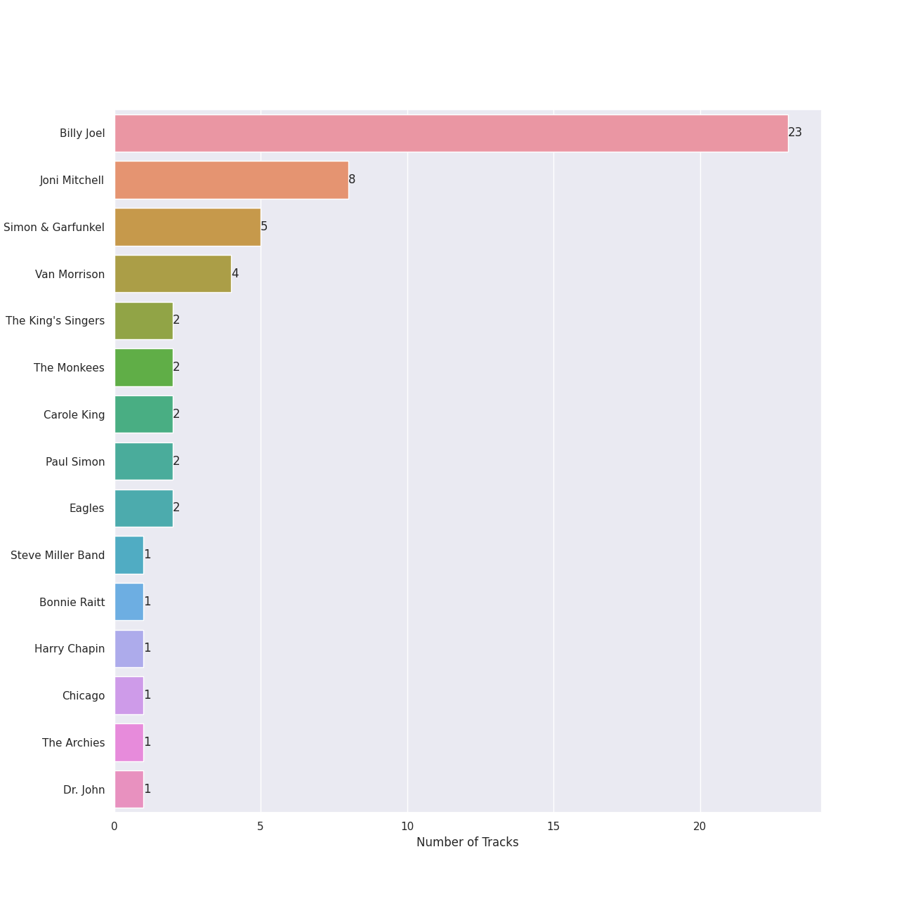
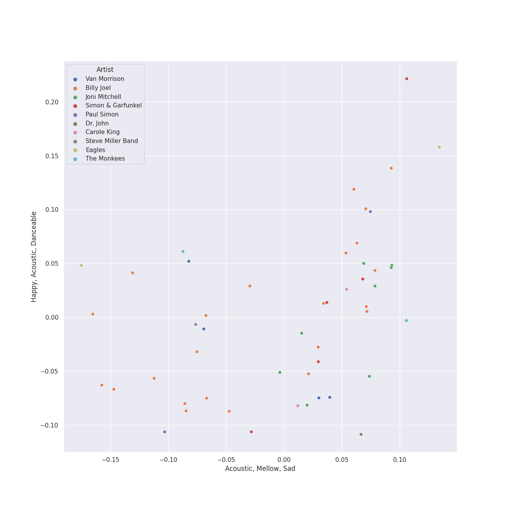
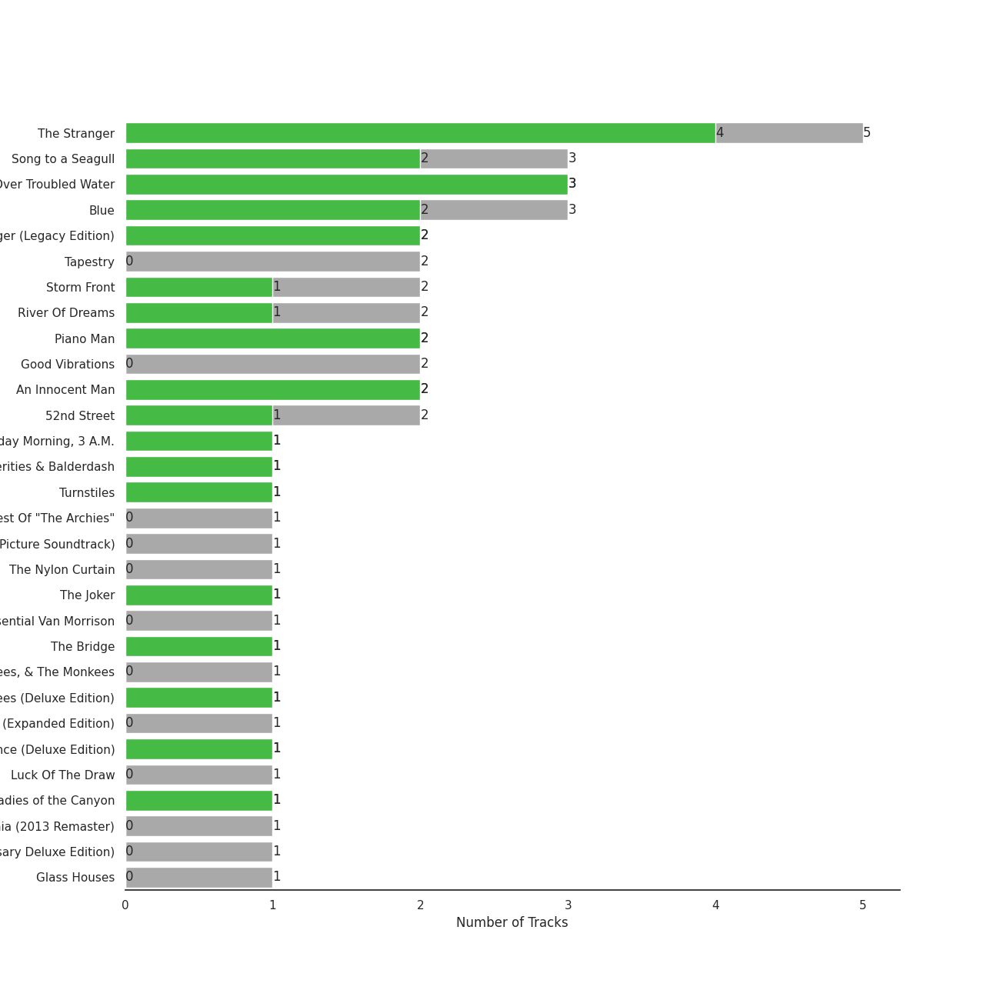
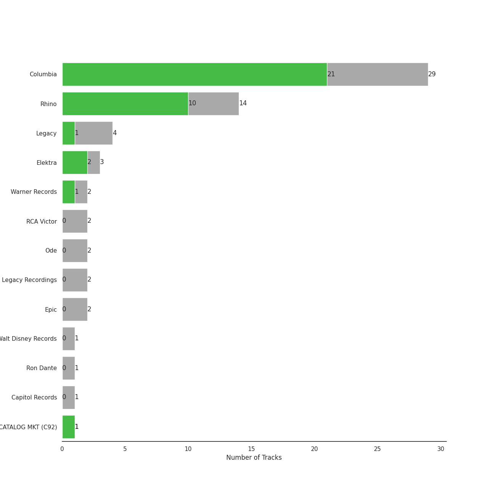
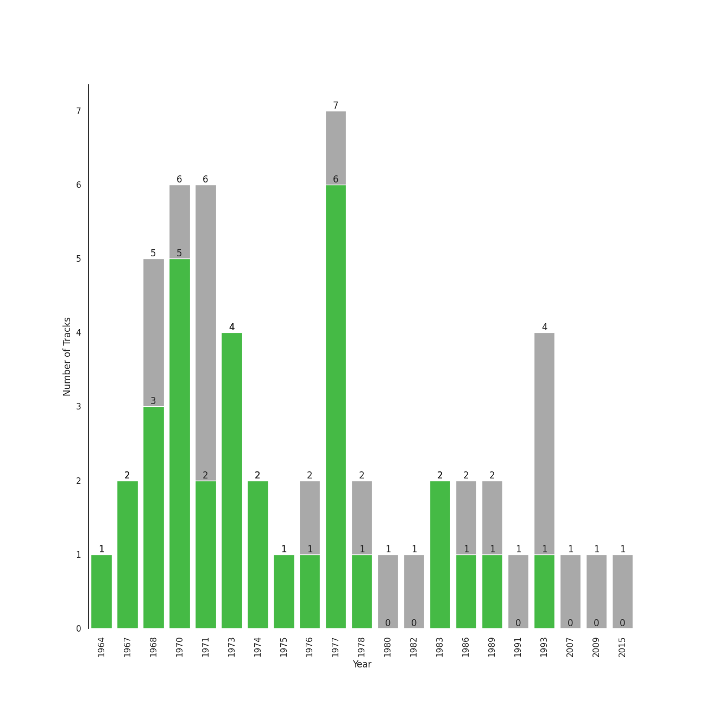

# folk rock

[54 songs](folk_rock_tracks.md)

## Top Artists

See all 15 artists

| Art | Tracks | 💚 | Artist | 🔗 |
|:---|---:|---:|:---|:---|
|  | 23 | 15 | [Billy Joel](../artists/billy_joel.md) | [🔗](https://open.spotify.com/artist/6zFYqv1mOsgBRQbae3JJ9e) |
|  | 8 | 6 | Joni Mitchell | [🔗](https://open.spotify.com/artist/5hW4L92KnC6dX9t7tYM4Ve) |
|  | 5 | 5 | Simon & Garfunkel | [🔗](https://open.spotify.com/artist/70cRZdQywnSFp9pnc2WTCE) |
|  | 4 | 2 | Van Morrison | [🔗](https://open.spotify.com/artist/44NX2ffIYHr6D4n7RaZF7A) |
|  | 2 | 1 | The Monkees | [🔗](https://open.spotify.com/artist/320EPCSEezHt1rtbfwH6Ck) |
|  | 2 | 1 | Eagles | [🔗](https://open.spotify.com/artist/0ECwFtbIWEVNwjlrfc6xoL) |
|  | 2 | 0 | The King's Singers | [🔗](https://open.spotify.com/artist/5lR7yDVN4z9kahOiUSlMhe) |
|  | 2 | 0 | Carole King | [🔗](https://open.spotify.com/artist/319yZVtYM9MBGqmSQnMyY6) |
|  | 2 | 0 | Paul Simon | [🔗](https://open.spotify.com/artist/2CvCyf1gEVhI0mX6aFXmVI) |
|  | 1 | 1 | Steve Miller Band | [🔗](https://open.spotify.com/artist/6QtGlUje9TIkLrgPZrESuk) |
|  | 1 | 1 | Harry Chapin | [🔗](https://open.spotify.com/artist/42q4Ivs7tAiCZ5C7eG5q4c) |
|  | 1 | 1 | Chicago | [🔗](https://open.spotify.com/artist/3iDD7bnsjL9J4fO298r0L0) |
|  | 1 | 0 | Bonnie Raitt | [🔗](https://open.spotify.com/artist/4KDyYWR7IpxZ7xrdYbKrqY) |
|  | 1 | 0 | The Archies | [🔗](https://open.spotify.com/artist/33QmoCkSqADuQEtMCysYLh) |
|  | 1 | 0 | Dr. John | [🔗](https://open.spotify.com/artist/320TrJub4arztwXRm7kqVO) |

## Top Albums

See all 35 albums

| Art | Tracks | 💚 | Album | Release Date | 🔗 |
|:---|---:|---:|:---|:---|:---|
|  | 7 | 6 | The Stranger | 1977-09-29 | [🔗](https://open.spotify.com/album/3IILMjMMnoN2sKzgesX8KV) |
|  | 3 | 3 | Bridge Over Troubled Water | 1970-01-26 | [🔗](https://open.spotify.com/album/0JwHz5SSvpYWuuCNbtYZoV) |
|  | 3 | 2 | Song to a Seagull | 1968-03-01 | [🔗](https://open.spotify.com/album/6rg3WTvmv68Vd6tgR0yS0E) |
|  | 3 | 2 | Blue | 1971-06-22 | [🔗](https://open.spotify.com/album/1vz94WpXDVYIEGja8cjFNa) |
|  | 2 | 2 | Piano Man | 1973-11-09 | [🔗](https://open.spotify.com/album/77ErLrVvYETIlQJHAwhfIH) |
|  | 2 | 2 | An Innocent Man | 1983-08-08 | [🔗](https://open.spotify.com/album/3R3x4zIabsvpD3yxqLaUpc) |
|  | 2 | 1 | Storm Front | 1989-10-17 | [🔗](https://open.spotify.com/album/1Vw2uoVkLAJFVViJ1QyK1D) |
|  | 2 | 1 | River Of Dreams | 1993-08-10 | [🔗](https://open.spotify.com/album/4HPnwQJAEvTY910q4RNeOu) |
|  | 2 | 1 | 52nd Street | 1978-10-13 | [🔗](https://open.spotify.com/album/1HmCO8VK98AU6EXPOjGYyI) |
|  | 2 | 0 | Tapestry | 1971 | [🔗](https://open.spotify.com/album/12n11cgnpjXKLeqrnIERoS) |
|  | 2 | 0 | Good Vibrations | 1993 | [🔗](https://open.spotify.com/album/10IUKCLZPs9onPwXfQVxfv) |
|  | 1 | 1 | Wednesday Morning, 3 A.M. | 1964-10-19 | [🔗](https://open.spotify.com/album/5pnJrocLlZ3FWEbcr2PTz0) |
|  | 1 | 1 | Verities & Balderdash | 1974 | [🔗](https://open.spotify.com/album/3nta4nhqWoWjc6LmHIB0kT) |
|  | 1 | 1 | Turnstiles | 1976-05-19 | [🔗](https://open.spotify.com/album/7GiLfxL1su3MSqz7pmKMZi) |
|  | 1 | 1 | The Joker | 1973-01-01 | [🔗](https://open.spotify.com/album/5uYNj1HkZrWKAkhEYcGmJr) |
|  | 1 | 1 | The Bridge | 1986-07-28 | [🔗](https://open.spotify.com/album/2fRxSC6FtiAkhEDVZr2seH) |
|  | 1 | 1 | More of The Monkees (Deluxe Edition) | 1967-01-09 | [🔗](https://open.spotify.com/album/50zHjIiTOZM232gnWvOydX) |
|  | 1 | 1 | Moondance (Deluxe Edition) | 1970-02 | [🔗](https://open.spotify.com/album/7diHYi0CglGJekoM3KaWBK) |
|  | 1 | 1 | Ladies of the Canyon | 1970-03-01 | [🔗](https://open.spotify.com/album/7JOdtLDLyXJIppDRB7kxr9) |
|  | 1 | 1 | Desperado (2013 Remaster) | 1973 | [🔗](https://open.spotify.com/album/09WBxbis5Sixt01FVMs8UM) |
|  | 1 | 1 | Court and Spark | 1974-01-17 | [🔗](https://open.spotify.com/album/2akjxkzFolkeV72Yyv5KrM) |
|  | 1 | 1 | Chicago IX: Chicago's Greatest Hits | 1975-11-10 | [🔗](https://open.spotify.com/album/5qWGV0fd7hpdptJYI4G9Dd) |
|  | 1 | 1 | Bookends | 1968-04-03 | [🔗](https://open.spotify.com/album/3bzgbgiytguTDnwzflAZr2) |
|  | 1 | 1 | Blowin' Your Mind! | 1967-09 | [🔗](https://open.spotify.com/album/7dsWupQRlFuhG8FGiQAUjC) |
|  | 1 | 0 | The Very Best Of "The Archies" | 2007-11-07 | [🔗](https://open.spotify.com/album/7spOTrIPTM8RrMIAhCjLJi) |
|  | 1 | 0 | The Princess and the Frog (Original Motion Picture Soundtrack) | 2009-11-23 | [🔗](https://open.spotify.com/album/0CcL28OkH89kjgKpNZC8sW) |
|  | 1 | 0 | The Nylon Curtain | 1982-06-23 | [🔗](https://open.spotify.com/album/50bajZpetfL5T0iRCOR74J) |
|  | 1 | 0 | The Essential Van Morrison | 2015-12-04 | [🔗](https://open.spotify.com/album/0RXzDyBEGd2EGQTmv8cxQa) |
|  | 1 | 0 | The Birds, The Bees, & The Monkees | 1968-04-22 | [🔗](https://open.spotify.com/album/2Ov6zb7NfgDh3EXSIIWrb2) |
|  | 1 | 0 | Moondance (Expanded Edition) | 1970-02 | [🔗](https://open.spotify.com/album/6yNYC35npMBHbxG0Vle83O) |
|  | 1 | 0 | Luck Of The Draw | 1991-01-01 | [🔗](https://open.spotify.com/album/6blrkOZ0VmkhYPjfoD7eqf) |
|  | 1 | 0 | Hotel California (2013 Remaster) | 1976-12-08 | [🔗](https://open.spotify.com/album/2widuo17g5CEC66IbzveRu) |
|  | 1 | 0 | Graceland (25th Anniversary Deluxe Edition) | 1986-08-12 | [🔗](https://open.spotify.com/album/6WgGWYw6XXQyLTsWt7tXky) |
|  | 1 | 0 | Glass Houses | 1980-03-12 | [🔗](https://open.spotify.com/album/5sztejERqpktXEdemlUvU5) |
|  | 1 | 0 | Cold Spring Harbor | 1971-11-01 | [🔗](https://open.spotify.com/album/274rMlKrr22086ohmwAJZA) |

## Top Record Labels

See all 13 labels

| Tracks | 💚 | Label |
|---:|---:|:---|
| 28 | 21 | [Columbia](../labels/columbia.md) |
| 14 | 10 | [Rhino](../labels/rhino.md) |
| 3 | 2 | Elektra |
| 3 | 1 | [Legacy](../labels/legacy.md) |
| 2 | 1 | [Warner Records](../labels/warner_records.md) |
| 2 | 0 | RCA Victor |
| 2 | 0 | Ode |
| 2 | 0 | Legacy Recordings |
| 2 | 0 | [Epic](../labels/epic.md) |
| 1 | 1 | CAPITOL CATALOG MKT (C92) |
| 1 | 0 | [Walt Disney Records](../labels/walt_disney_records.md) |
| 1 | 0 | Ron Dante |
| 1 | 0 | [Capitol Records](../labels/capitol_records.md) |

## Years

| 10 newest albums | 10 oldest albums |
|:---|:---|
| 
 The Essential Van Morrison (2015-12-04)
 | 
 Wednesday Morning, 3 A.M. (1964-10-19)
 |
| 
 The Princess and the Frog (Original Motion Picture Soundtrack) (2009-11-23)
 | 
 More of The Monkees (Deluxe Edition) (1967-01-09)
 |
| 
 The Very Best Of "The Archies" (2007-11-07)
 | 
 Blowin' Your Mind! (1967-09)
 |
| 
 River Of Dreams (1993-08-10)
 | 
 Song to a Seagull (1968-03-01)
 |
| 
 Good Vibrations (1993)
 | 
 Bookends (1968-04-03)
 |
| 
 Luck Of The Draw (1991-01-01)
 | 
 The Birds, The Bees, & The Monkees (1968-04-22)
 |
| 
 Storm Front (1989-10-17)
 | 
 Bridge Over Troubled Water (1970-01-26)
 |
| 
 Graceland (25th Anniversary Deluxe Edition) (1986-08-12)
 | 
 Moondance (Deluxe Edition) (1970-02)
 |
| 
 The Bridge (1986-07-28)
 | 
 Moondance (Expanded Edition) (1970-02)
 |
| 
 An Innocent Man (1983-08-08)
 | 
 Ladies of the Canyon (1970-03-01)
 |
## Audio Features

| 10 most Danceable tracks | 10 least Danceable tracks |
|:---|:---|
| You Can Call Me Al (0.776) | Bridge Over Troubled Water (0.149) |
| Cecilia (0.755) | Desperado - 2013 Remaster (0.228) |
| My Life (0.741) | She's Always a Woman (0.292) |
| A Matter of Trust (0.738) | Piano Man (0.334) |
| Sugar, Sugar (0.736) | And So It Goes (0.351) |
| We Didn't Start the Fire (0.712) | The Boxer (0.351) |
| I Feel the Earth Move (0.711) | Captain Jack (0.392) |
| Uptown Girl (0.701) | Scenes from an Italian Restaurant (0.415) |
| Down in New Orleans (0.697) | The Pirate of Penance (0.429) |
| A Case of You (0.693) | And So It Goes (0.433) |

| 10 most Energetic tracks | 10 least Energetic tracks |
|:---|:---|
| We Didn't Start the Fire (0.967) | And So It Goes (0.0387) |
| Uptown Girl (0.944) | The Boxer (0.0802) |
| Scenes from an Italian Restaurant (0.931) | And So It Goes (0.0871) |
| Movin' Out (Anthony's Song) (0.88) | Blue (0.102) |
| The Stranger (0.878) | The Dawntreader (0.103) |
| Cecilia (0.876) | She's Got a Way (0.142) |
| Only the Good Die Young (0.872) | I Can't Make You Love Me (0.149) |
| Sugar, Sugar (0.871) | I Had a King (0.151) |
| 25 or 6 to 4 (0.869) | Lullabye (Goodnight, My Angel) (0.157) |
| I'm a Believer - 2006 Remaster (0.775) | So Far Away (0.172) |

| 10 most Speechy tracks | 10 least Speechy tracks |
|:---|:---|
| Only the Good Die Young (0.159) | The Longest Time (0.0262) |
| Scenes from an Italian Restaurant (0.126) | A Matter of Trust (0.0268) |
| Big Shot (0.0972) | Hotel California - 2013 Remaster (0.027) |
| Crazy Love - 2013 Remaster (0.0959) | Piano Man (0.0276) |
| The Stranger (0.0837) | Sugar, Sugar (0.0278) |
| Crazy Love (0.0819) | A Case of You (0.0288) |
| The Boxer (0.0615) | The Sound of Silence - Acoustic Version (0.0301) |
| The River of Dreams (0.0576) | Daydream Believer (0.0304) |
| Don't Ask Me Why (0.0543) | I Feel the Earth Move (0.0305) |
| You Can Call Me Al (0.0534) | Desperado - 2013 Remaster (0.0311) |

| 10 most Acoustic tracks | 10 least Acoustic tracks |
|:---|:---|
| Blue (0.989) | Hotel California - 2013 Remaster (0.00574) |
| The Pirate of Penance (0.973) | Pressure (0.0148) |
| She's Got a Way (0.97) | A Matter of Trust (0.0589) |
| I Had a King (0.968) | Uptown Girl (0.0755) |
| The Dawntreader (0.957) | We Didn't Start the Fire (0.0771) |
| Lullabye (Goodnight, My Angel) (0.948) | My Life (0.108) |
| Desperado - 2013 Remaster (0.946) | Don't Ask Me Why (0.138) |
| And So It Goes (0.941) | Big Shot (0.156) |
| The Boxer (0.93) | Only the Good Die Young (0.159) |
| And So It Goes (0.91) | The Stranger (0.165) |

| 10 most Instrumental tracks | 10 least Instrumental tracks |
|:---|:---|
| 25 or 6 to 4 (0.0367) | Carey (0.0) |
| I Had a King (0.0108) | And So It Goes (0.0) |
| You Can Call Me Al (0.00647) | Free Man in Paris (0.0) |
| Blue (0.00354) | Cat's in the Cradle (0.0) |
| I Feel the Earth Move (0.00226) | Only the Good Die Young (0.0) |
| My Life (0.00139) | We Didn't Start the Fire (0.0) |
| Pressure (0.000949) | Sugar, Sugar (0.0) |
| Bridge Over Troubled Water (0.000649) | Brown Eyed Girl (0.0) |
| Down in New Orleans (0.000511) | Lullabye (Goodnight, My Angel) (0.0) |
| Scenes from an Italian Restaurant (0.000501) | The Longest Time (0.0) |

| 10 most Live tracks | 10 least Live tracks |
|:---|:---|
| Uptown Girl (0.601) | I Feel the Earth Move (0.0528) |
| Big Yellow Taxi (0.581) | My Life (0.0555) |
| Brown Eyed Girl (0.406) | Hotel California - 2013 Remaster (0.0575) |
| Captain Jack (0.374) | Movin' Out (Anthony's Song) (0.0591) |
| We Didn't Start the Fire (0.356) | The Boxer (0.0619) |
| New York State of Mind (0.323) | The River of Dreams (0.0667) |
| Piano Man (0.312) | Free Man in Paris (0.0691) |
| A Matter of Trust (0.306) | Mrs. Robinson - From "The Graduate" Soundtrack (0.0747) |
| Desperado - 2013 Remaster (0.273) | So Far Away (0.0753) |
| Crazy Love (0.27) | Vienna (0.0754) |

| 10 most Happy tracks | 10 least Happy tracks |
|:---|:---|
| Big Yellow Taxi (0.97) | I Can't Make You Love Me (0.113) |
| Sugar, Sugar (0.967) | I Had a King (0.136) |
| I'm a Believer - 2006 Remaster (0.962) | The Pirate of Penance (0.162) |
| Cecilia (0.954) | Desperado - 2013 Remaster (0.18) |
| Brown Eyed Girl (0.908) | New York State of Mind (0.194) |
| Movin' Out (Anthony's Song) (0.895) | She's Got a Way (0.196) |
| We Didn't Start the Fire (0.895) | Lullabye (Goodnight, My Angel) (0.22) |
| A Matter of Trust (0.88) | The Stranger (0.222) |
| Don't Ask Me Why (0.868) | The Dawntreader (0.235) |
| Pressure (0.851) | And So It Goes (0.24) |
