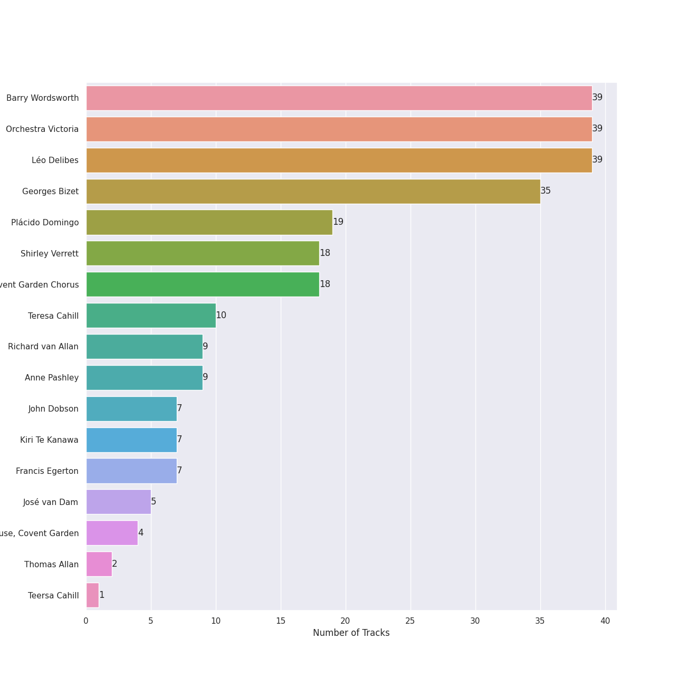
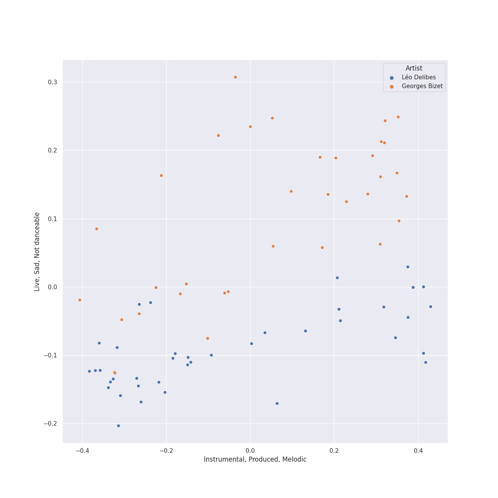
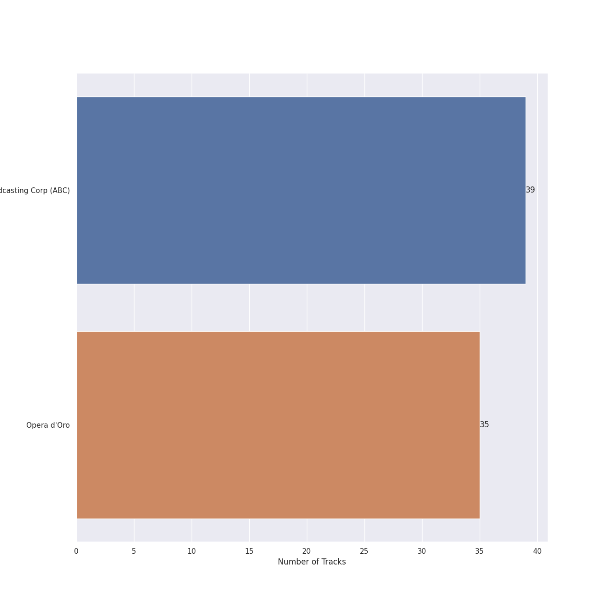

# french opera

[74 songs](french_opera_tracks.md)

## Top Artists

See all 17 artists

|   Number of Tracks | Art                                                                                              | Artist                                                     | 🔗                                                           |
|-------------------:|:-------------------------------------------------------------------------------------------------|:-----------------------------------------------------------|:------------------------------------------------------------|
|                 39 |  | [Barry Wordsworth](../artists/barry_wordsworth.md)         | [🔗](https://open.spotify.com/artist/5sjJnaI3YhaO8KylpJk3gN) |
|                 39 |  | [Orchestra Victoria](../artists/orchestra_victoria.md)     | [🔗](https://open.spotify.com/artist/1bnC6eJzCumTgAB7tG1118) |
|                 39 |  | [Léo Delibes](../artists/l_o_delibes.md)                   | [🔗](https://open.spotify.com/artist/1M9AXZkNPdOd1IPEsQsXnT) |
|                 35 |  | [Georges Bizet](../artists/georges_bizet.md)               | [🔗](https://open.spotify.com/artist/2D7RkvtKKb6E5UmbjQM1Jd) |
|                 19 |  | [Plácido Domingo](../artists/pl_cido_domingo.md)           | [🔗](https://open.spotify.com/artist/4pU3BpenOZFEBzORx2YBJW) |
|                 18 |  | [Shirley Verrett](../artists/shirley_verrett.md)           | [🔗](https://open.spotify.com/artist/0f4tBoODl0zZo4snq0guG6) |
|                 18 |                                                               | [Covent Garden Chorus](../artists/covent_garden_chorus.md) | [🔗](https://open.spotify.com/artist/0ZhXKQoJEmQv0dFzaSLasu) |
|                 10 |  | [Teresa Cahill](../artists/teresa_cahill.md)               | [🔗](https://open.spotify.com/artist/5IqlLsJGCLTJcDKOH7Ljpk) |
|                  9 |  | Richard van Allan                                          | [🔗](https://open.spotify.com/artist/7fvx6pdccpIicgEbNbBdrm) |
|                  9 |                                                               | Anne Pashley                                               | [🔗](https://open.spotify.com/artist/597vCyRss5Kk4y0MAvhqEt) |
|                  7 |  | John Dobson                                                | [🔗](https://open.spotify.com/artist/6xCAKMCPmMEb9BiuxhUCqY) |
|                  7 |  | Kiri Te Kanawa                                             | [🔗](https://open.spotify.com/artist/3fcsflK8xu26XH4OYTcm5T) |
|                  7 |  | Francis Egerton                                            | [🔗](https://open.spotify.com/artist/24DlhaYHaKiueDC3EFXMz9) |
|                  5 |  | [José van Dam](../artists/jos__van_dam.md)                 | [🔗](https://open.spotify.com/artist/5qNUHMEhszyeXNYMn4sswd) |
|                  4 |  | Orchestra of the Royal Opera House, Covent Garden          | [🔗](https://open.spotify.com/artist/2t5BHUdyeL3NBKqpOpaA4V) |
|                  2 |  | Thomas Allan                                               | [🔗](https://open.spotify.com/artist/70QpBPsHcrRpFI0eCdW8b2) |
|                  1 |                                                               | Teersa Cahill                                              | [🔗](https://open.spotify.com/artist/3lhc5T2tJmYR1vOHuq85Ce) |

## Top Albums

See all 2 albums

|   Number of Tracks | Art                                                                                              | Album    | 🔗                                                          |
|-------------------:|:-------------------------------------------------------------------------------------------------|:---------|:-----------------------------------------------------------|
|                 39 |  | Coppélia | [🔗](https://open.spotify.com/album/7jKT8NC2XfAs9RFKsrGz2p) |
|                 35 |  | Carmen   | [🔗](https://open.spotify.com/album/7v178habOq2br0SjMG1KF5) |

## Top Record Labels

See all 2 labels

|   Number of Tracks | Label                                                                                 |
|-------------------:|:--------------------------------------------------------------------------------------|
|                 39 | [Australian Broadcasting Corp (ABC)](../labels/australian_broadcasting_corp__abc_.md) |
|                 35 | [Opera d'Oro](../labels/opera_d_oro.md)                                               |

## Audio Features

| 10 most Danceable tracks                                                                           | 10 least Danceable tracks                                           |
|:---------------------------------------------------------------------------------------------------|:--------------------------------------------------------------------|
| Coppélia / Tableau 2: No. 16 Boléro - Alternative Version                                          | Coppélia / Tableau 3: No. 20 Fête de la cloche: I. Valse des heures |
| Coppélia / Tableau 2: No. 11a Musique des automates                                                | Coppélia / Tableau 2: No. 9 Scène                                   |
| Coppélia / Tableau 2: No. 17 Gigue                                                                 | Coppélia / Tableau 2: No. 13 Chanson à boire et Scène               |
| Coppélia / Tableau 3: No. 20 Fête de la cloche: IV. Le travail (La fileuse)                        | Bizet: Carmen: Je dis que rien ne m'epouvante - Act Three           |
| Bizet: Carmen: Entr'acte - Act Two                                                                 | Coppélia / Tableau 1: No. 5 Ballade                                 |
| Coppélia / Tableau 3: No. 20 Fête de la cloche: V. L'hymen (Noce villageoise)                      | Bizet: Carmen: La cloche a sonne - Act One                          |
| Coppélia / Tableau 3: No. 20 Fête de la cloche: VI. La discorde et la guerre - Alternative Version | Bizet: Carmen: La fleur que tu m'avais jetee: Flower Song - Act Two |
| Coppélia / Tableau 3: No. 20 Fête de la cloche: VIII. Danse de fête                                | Coppélia / Tableau 3: No. 20 Fête de la cloche: III. La prière      |
| Bizet: Carmen: Avec la garde montate - Act One                                                     | Bizet: Carmen: Entr'acte - Act Three                                |
| Coppélia / Tableau 3: No. 20 Fête de la cloche: VIII. Danse de fête - Alternative Version          | Coppélia / Tableau 3: No. 20 Fête de la cloche: VII. La paix        |

| 10 most Energetic tracks                                                      | 10 least Energetic tracks                                                   |
|:------------------------------------------------------------------------------|:----------------------------------------------------------------------------|
| Bizet: Carmen: A deux cuartos! - - Act Four                                   | Coppélia / Tableau 3: No. 20 Fête de la cloche: II. L'aurore                |
| Bizet: Carmen: Au secours! Au secours! - Act One                              | Coppélia / Tableau 3: No. 20 Fête de la cloche: IV. Le travail (La fileuse) |
| Bizet: Carmen: Ou vas-tu? - Act Four                                          | Coppélia / Tableau 2: No. 10 Scène                                          |
| Bizet: Carmen: Les tringles des sistres tintaient: Danse Bohemienne - Act Two | Coppélia / Tableau 3: No. 20 Fête de la cloche: III. La prière              |
| Bizet: Carmen: Hola! Carmen! Hola! Hola! - Act Two                            | Coppélia / Tableau 1: No. 8 Final                                           |
| Bizet: Carmen: Voici l'ordre; partez, et faites bonne garde - Act One         | Coppélia / Tableau 3: No. 20 Fête de la cloche: I. Valse des heures         |
| Bizet: Carmen: Votre toast, je peux vous le rendre: Toreador Song - Act Two   | Coppélia / Tableau 2: No. 14a Scène                                         |
| Bizet: Carmen: Une femme! - Act Three                                         | Coppélia / Tableau 1: No. 5 Ballade                                         |
| Bizet: Carmen: Je suis Escamillo, torero de Grenade - Act Three               | Coppélia / Tableau 3: No. 20 Fête de la cloche: VII. La paix                |
| Bizet: Carmen: Prelude - Act One                                              | Coppélia / Tableau 2: No. 9 Scène                                           |

| 10 most Speechy tracks                                                        | 10 least Speechy tracks                                                                            |
|:------------------------------------------------------------------------------|:---------------------------------------------------------------------------------------------------|
| Bizet: Carmen: Voici l'ordre; partez, et faites bonne garde - Act One         | Coppélia / Tableau 1: No. 7 Czárdás                                                                |
| Bizet: Carmen: Nous avons en tete une affaire! - Act Two                      | Bizet: Carmen: Prelude - Act One                                                                   |
| Bizet: Carmen: Qui sait de quel demon j'allais etre la proie! - Act One       | Coppélia / Tableau 2: No. 13 Chanson à boire et Scène                                              |
| Bizet: Carmen: Les tringles des sistres tintaient: Danse Bohemienne - Act Two | Coppélia / Tableau 3: No. 20 Fête de la cloche: VI. La discorde et la guerre - Alternative Version |
| Bizet: Carmen: L'amour est un oiseau rebelle: Habanera - Act One              | Coppélia / Tableau 2: No. 16 Boléro                                                                |
| Bizet: Carmen: Votre toast, je peux vous le rendre: Toreador Song - Act Two   | Coppélia / Tableau 3: No. 19 Marche de la cloche                                                   |
| Bizet: Carmen: Avec la garde montate - Act One                                | Coppélia / Tableau 2: No. 15 Scène - Alternative Version                                           |
| Bizet: Carmen: Voyons, que j'essaie a mon tour - Act Three                    | Coppélia / Tableau 3: No. 20 Fête de la cloche: IX. Galop final                                    |
| Bizet: Carmen: Avez-vous quelque chose a repondre? - Act One                  | Coppélia / Tableau 3: No. 20 Fête de la cloche: IV. Le travail (La fileuse)                        |
| Bizet: Carmen: Une femme! - Act Three                                         | Bizet: Carmen: Entr'acte - Act Two                                                                 |

| 10 most Acoustic tracks                                                     | 10 least Acoustic tracks                                                                  |
|:----------------------------------------------------------------------------|:------------------------------------------------------------------------------------------|
| Bizet: Carmen: Parle-moi de ma mere! - Act One                              | Coppélia / Tableau 2: No. 18 Scène (Final)                                                |
| Bizet: Carmen: Mais nous ne voyons pas la Carmencita! - Act One             | Coppélia / Tableau 2: No. 14a Scène                                                       |
| Bizet: Carmen: L'amour est un oiseau rebelle: Habanera - Act One            | Coppélia / Tableau 2: No. 15 Scène - Alternative Version                                  |
| Bizet: Carmen: Pres des remparts de Seville: Seguidilla - Act One           | Coppélia / Tableau 2: No. 17 Gigue                                                        |
| Bizet: Carmen: Entr'acte - Act Two                                          | Coppélia / Tableau 2: No. 16 Boléro - Alternative Version                                 |
| Bizet: Carmen: Je suis Escamillo, torero de Grenade - Act Three             | Coppélia / Tableau 2: No. 16 Boléro                                                       |
| Bizet: Carmen: Votre toast, je peux vous le rendre: Toreador Song - Act Two | Coppélia / Tableau 3: No. 20 Fête de la cloche: VIII. Danse de fête                       |
| Bizet: Carmen: Je dis que rien ne m'epouvante - Act Three                   | Coppélia / Tableau 3: No. 20 Fête de la cloche: VIII. Danse de fête - Alternative Version |
| Bizet: Carmen: Qui sait de quel demon j'allais etre la proie! - Act One     | Bizet: Carmen: Entr'acte - Act Four                                                       |
| Bizet: Carmen: C'est toi! - Act Four                                        | Coppélia / Tableau 2: No. 11a Musique des automates                                       |

| 10 most Instrumental tracks                                                                        | 10 least Instrumental tracks                                                              |
|:---------------------------------------------------------------------------------------------------|:------------------------------------------------------------------------------------------|
| Bizet: Carmen: Entr'acte - Act Two                                                                 | Bizet: Carmen: Votre toast, je peux vous le rendre: Toreador Song - Act Two               |
| Bizet: Carmen: Prelude - Act One                                                                   | Bizet: Carmen: Hola! Hola! Jose! - Act Three                                              |
| Coppélia / Tableau 1: No. 7a Sortie                                                                | Bizet: Carmen: Ecoute, ecoute, compagnon, ecoute! - Act Three                             |
| Coppélia / Tableau 3: No. 20 Fête de la cloche: V. L'hymen (Noce villageoise)                      | Coppélia / Tableau 3: No. 20 Fête de la cloche: VIII. Danse de fête - Alternative Version |
| Bizet: Carmen: Entr'acte - Act Three                                                               | Bizet: Carmen: Les tringles des sistres tintaient: Danse Bohemienne - Act Two             |
| Coppélia / Tableau 1: No. 2 Scène                                                                  | Coppélia / Tableau 2: No. 17 Gigue                                                        |
| Coppélia / Tableau 2: No. 15 Scène - Alternative Version                                           | Bizet: Carmen: Je suis Escamillo, torero de Grenade - Act Three                           |
| Coppélia / Tableau 3: No. 20 Fête de la cloche: VI. La discorde et la guerre - Alternative Version | Coppélia / Tableau 3: No. 20 Fête de la cloche: II. L'aurore                              |
| Coppélia / Tableau 1: No. 3 Mazurka                                                                | Bizet: Carmen: Avez-vous quelque chose a repondre? - Act One                              |
| Coppélia / Tableau 3: No. 20 Fête de la cloche: IX. Galop final - Alternative Version              | Coppélia / Tableau 2: No. 14a Scène                                                       |

| 10 most Live tracks                                                         | 10 least Live tracks                                                                      |
|:----------------------------------------------------------------------------|:------------------------------------------------------------------------------------------|
| Bizet: Carmen: Ou vas-tu? - Act Four                                        | Coppélia / Tableau 3: No. 20 Fête de la cloche: VIII. Danse de fête                       |
| Bizet: Carmen: La fleur que tu m'avais jetee: Flower Song - Act Two         | Coppélia / Tableau 1: No. 6 Thème slave varié                                             |
| Bizet: Carmen: Une femme! - Act Three                                       | Coppélia / Tableau 1: No. 7 Czárdás                                                       |
| Bizet: Carmen: Hola! Hola! Jose! - Act Three                                | Coppélia / Tableau 3: No. 20 Fête de la cloche: VII. La paix                              |
| Bizet: Carmen: Au secours! Au secours! - Act One                            | Coppélia / Tableau 2: Entr'acte                                                           |
| Bizet: Carmen: Pres des remparts de Seville: Seguidilla - Act One           | Coppélia / Tableau 2: No. 9 Scène                                                         |
| Bizet: Carmen: Votre toast, je peux vous le rendre: Toreador Song - Act Two | Coppélia / Tableau 3: No. 20 Fête de la cloche: VIII. Danse de fête - Alternative Version |
| Bizet: Carmen: Je suis Escamillo, torero de Grenade - Act Three             | Coppélia / Tableau 3: No. 19 Marche de la cloche                                          |
| Bizet: Carmen: A deux cuartos! - - Act Four                                 | Coppélia / Tableau 1: No. 5 Ballade                                                       |
| Bizet: Carmen: C'est toi! - Act Four                                        | Coppélia / Tableau 2: No. 14a Scène                                                       |

| 10 most Happy tracks                                                                      | 10 least Happy tracks                                               |
|:------------------------------------------------------------------------------------------|:--------------------------------------------------------------------|
| Coppélia / Tableau 2: No. 11a Musique des automates                                       | Coppélia / Tableau 2: No. 10 Scène                                  |
| Coppélia / Tableau 2: No. 16 Boléro - Alternative Version                                 | Bizet: Carmen: Parle-moi de ma mere! - Act One                      |
| Coppélia / Tableau 3: No. 20 Fête de la cloche: V. L'hymen (Noce villageoise)             | Bizet: Carmen: La fleur que tu m'avais jetee: Flower Song - Act Two |
| Coppélia / Tableau 2: No. 17 Gigue                                                        | Coppélia / Tableau 2: No. 15 Scène                                  |
| Bizet: Carmen: A deux cuartos! - - Act Four                                               | Coppélia / Tableau 1: Prélude - Mazurka                             |
| Bizet: Carmen: Entr'acte - Act Four                                                       | Coppélia / Tableau 2: No. 13 Chanson à boire et Scène               |
| Coppélia / Tableau 3: No. 20 Fête de la cloche: IX. Galop final                           | Coppélia / Tableau 1: No. 5 Ballade                                 |
| Coppélia / Tableau 3: No. 20 Fête de la cloche: VIII. Danse de fête - Alternative Version | Coppélia / Tableau 3: No. 20 Fête de la cloche: VII. La paix        |
| Coppélia / Tableau 3: No. 20 Fête de la cloche: VIII. Danse de fête                       | Coppélia / Tableau 3: No. 20 Fête de la cloche: III. La prière      |
| Coppélia / Tableau 1: No. 7 Czárdás                                                       | Bizet: Carmen: Je dis que rien ne m'epouvante - Act Three           |
