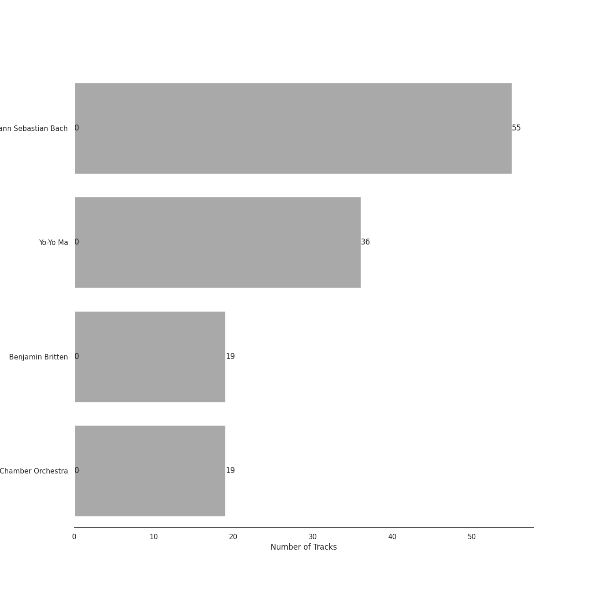
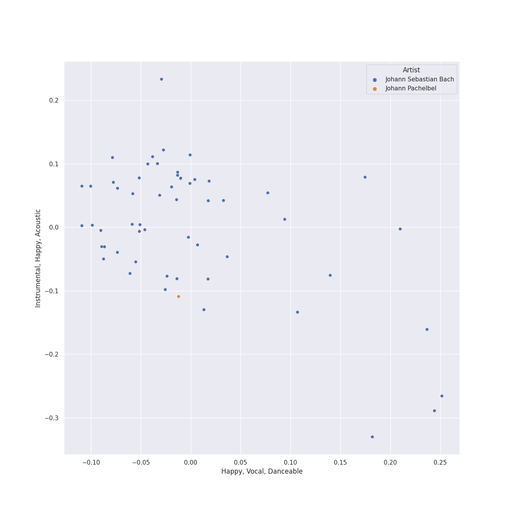
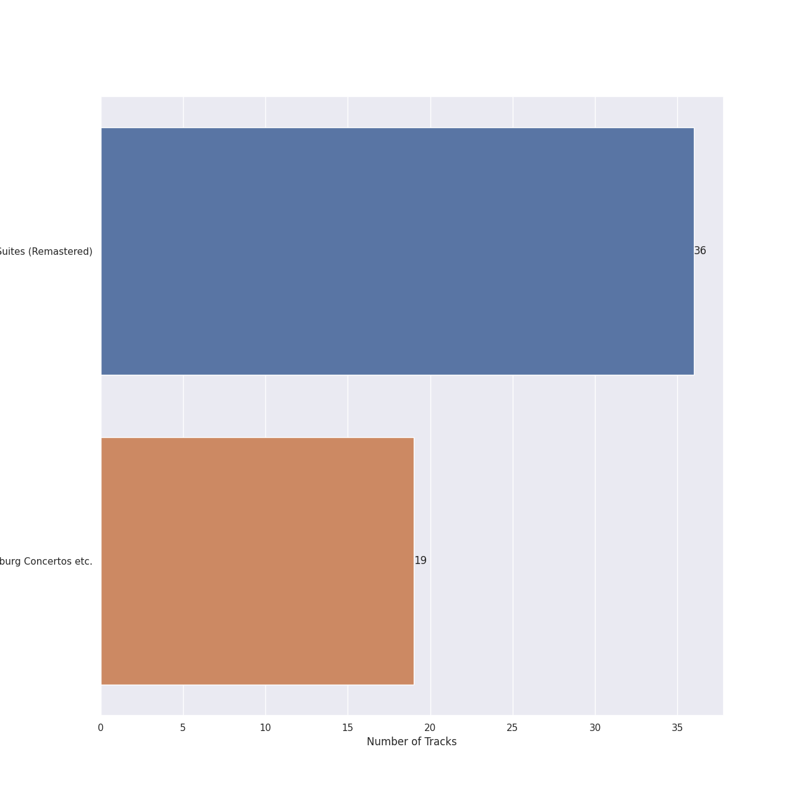
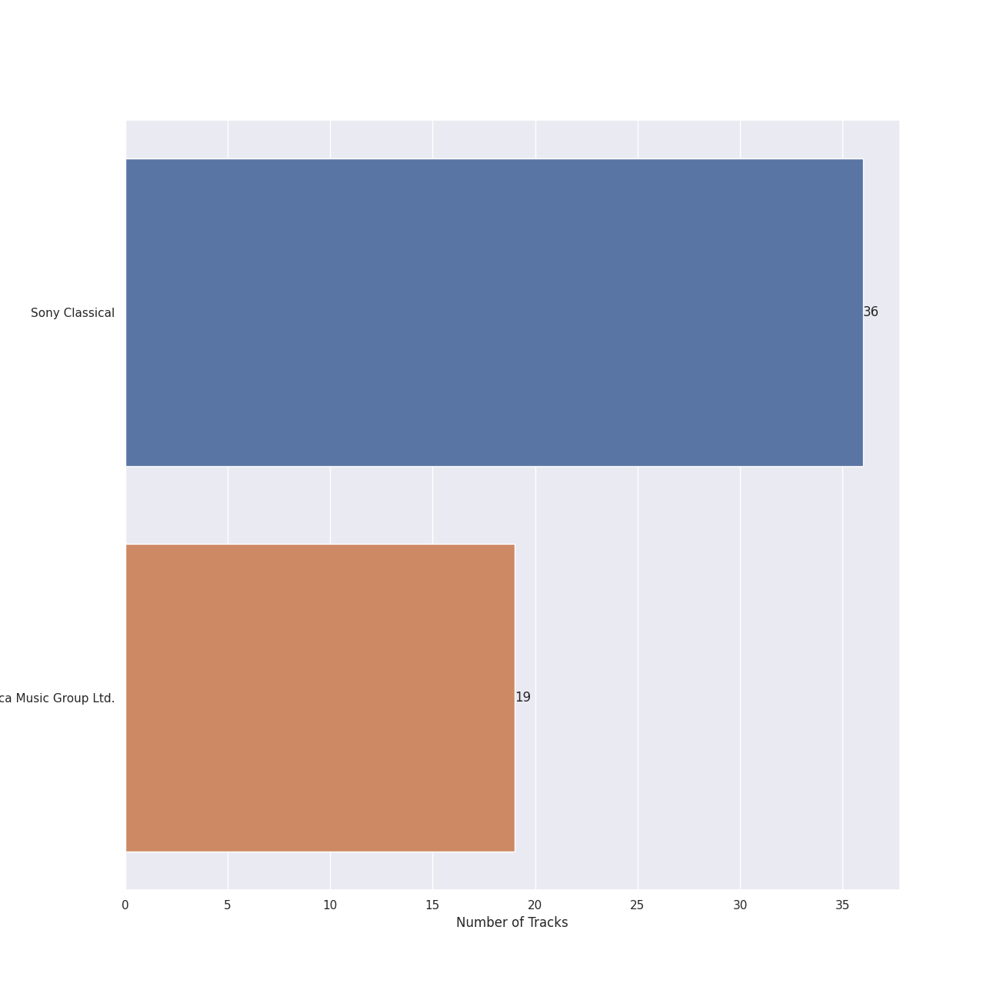

# german baroque

[57 songs](german_baroque_tracks.md)

## Top Artists

See all 7 artists

|   Number of Tracks | Art                                                                                              | Artist                                                                                   | 🔗                                                           |
|-------------------:|:-------------------------------------------------------------------------------------------------|:-----------------------------------------------------------------------------------------|:------------------------------------------------------------|
|                 56 |  | [Johann Sebastian Bach](../artists/johann_sebastian_bach.md)                             | [🔗](https://open.spotify.com/artist/5aIqB5nVVvmFsvSdExz408) |
|                 36 |  | [Yo-Yo Ma](../artists/yo_yo_ma.md)                                                       | [🔗](https://open.spotify.com/artist/5Dl3HXZjG6ZOWT5cV375lk) |
|                 19 |  | [Benjamin Britten](../artists/benjamin_britten.md)                                       | [🔗](https://open.spotify.com/artist/7MJ1pB5d6Vjmzep2zQlorn) |
|                 19 |  | [English Chamber Orchestra](../artists/english_chamber_orchestra.md)                     | [🔗](https://open.spotify.com/artist/2DO4p3CPDnInsJfg0jFfaF) |
|                  2 |  | [Academy of St. Martin in the Fields](../artists/academy_of_st__martin_in_the_fields.md) | [🔗](https://open.spotify.com/artist/77CaCn32H4mOMQA7UElzfF) |
|                  2 |  | [Sir Neville Marriner](../artists/sir_neville_marriner.md)                               | [🔗](https://open.spotify.com/artist/6NUhQz7eAEsZvjEHTKHux9) |
|                  1 |  | Johann Pachelbel                                                                         | [🔗](https://open.spotify.com/artist/62TD7509VQIxUe4WpwO0s3) |

## Top Albums

See all 3 albums

|   Number of Tracks | Art                                                                                              | Album                                         | 🔗                                                          |
|-------------------:|:-------------------------------------------------------------------------------------------------|:----------------------------------------------|:-----------------------------------------------------------|
|                 36 |  | Bach: Unaccompanied Cello Suites (Remastered) | [🔗](https://open.spotify.com/album/2OpnKgmVYPEN2GldgBponI) |
|                 19 |  | Bach, J.S.: Brandenburg Concertos etc.        | [🔗](https://open.spotify.com/album/11FzhwtOFCPB4vpgWo33xV) |
|                  2 |  | Mozart: Eine Kleine Nachtmusik etc.           | [🔗](https://open.spotify.com/album/5YCuibCDJrkVcS3UOAYqr9) |

## Top Record Labels

See all 3 labels

|   Number of Tracks | Label                                                         |
|-------------------:|:--------------------------------------------------------------|
|                 36 | [Sony Classical](../labels/sony_classical.md)                 |
|                 19 | [Decca Music Group Ltd.](../labels/decca_music_group_ltd_.md) |
|                  2 | [Warner Classics](../labels/warner_classics.md)               |

## Audio Features

| 10 most Danceable tracks                                       | 10 least Danceable tracks                                                   |
|:---------------------------------------------------------------|:----------------------------------------------------------------------------|
| Brandenburg Concerto No. 2 in F, BWV 1047: 3. Allegro assai    | Cello Suite No. 6 in D Major, BWV 1012: II. Allemande                       |
| Brandenburg Concerto No. 2 in F, BWV 1047: 1. (Allegro)        | Pachelbel: Canon and Gigue for Three Violins and Continuo in D Major: Canon |
| Brandenburg Concerto No. 3 in G, BWV 1048: 3. Allegro          | Cello Suite No. 4 in E-Flat Major, BWV 1010: IV. Sarabande                  |
| Brandenburg Concerto No. 1 in F, BWV 1046: 5. Polacca; Trio II | Bach, JS: Orchestral Suite No. 3 in D Major, BWV 1068: II. Air              |
| Brandenburg Concerto No. 6 in B flat, BWV 1051: 3. Allegro     | Cello Suite No. 3 in C Major, BWV 1009: IV. Sarabande                       |
| Brandenburg Concerto No. 3 in G, BWV 1048: 1. (Allegro)        | Brandenburg Concerto No. 6 in B flat, BWV 1051: 2. Adagio ma non tanto      |
| Brandenburg Concerto No. 4 in G, BWV 1049: 3. Presto           | Cello Suite No. 1 in G Major, BWV 1007: IV. Sarabande                       |
| Brandenburg Concerto No. 5 in D, BWV 1050: 3. Allegro          | Cello Suite No. 5 in C Minor, BWV 1011: II. Allemande                       |
| Cello Suite No. 6 in D Major, BWV 1012: V. Gavottes I & II     | Cello Suite No. 2 in D Minor, BWV 1008: IV. Sarabande                       |
| Cello Suite No. 1 in G Major, BWV 1007: III. Courante          | Cello Suite No. 5 in C Minor, BWV 1011: IV. Sarabande                       |

| 10 most Energetic tracks                                    | 10 least Energetic tracks                                       |
|:------------------------------------------------------------|:----------------------------------------------------------------|
| Brandenburg Concerto No. 2 in F, BWV 1047: 3. Allegro assai | Cello Suite No. 6 in D Major, BWV 1012: IV. Sarabande           |
| Brandenburg Concerto No. 3 in G, BWV 1048: 3. Allegro       | Cello Suite No. 3 in C Major, BWV 1009: V. Bourrées I & II      |
| Brandenburg Concerto No. 2 in F, BWV 1047: 1. (Allegro)     | Cello Suite No. 4 in E-Flat Major, BWV 1010: II. Allemande      |
| Brandenburg Concerto No. 4 in G, BWV 1049: 3. Presto        | Cello Suite No. 6 in D Major, BWV 1012: II. Allemande           |
| Brandenburg Concerto No. 1 in F, BWV 1046: 3. Allegro       | Cello Suite No. 2 in D Minor, BWV 1008: I. Prélude              |
| Brandenburg Concerto No. 1 in F, BWV 1046: 1. (Allegro)     | Cello Suite No. 5 in C Minor, BWV 1011: II. Allemande           |
| Brandenburg Concerto No. 3 in G, BWV 1048: 1. (Allegro)     | Cello Suite No. 4 in E-Flat Major, BWV 1010: V. Bourrées I & II |
| Brandenburg Concerto No. 4 in G, BWV 1049: 1. Allegro       | Cello Suite No. 3 in C Major, BWV 1009: IV. Sarabande           |
| Cello Suite No. 2 in D Minor, BWV 1008: III. Courante       | Cello Suite No. 1 in G Major, BWV 1007: IV. Sarabande           |
| Brandenburg Concerto No. 5 in D, BWV 1050: 1. Allegro       | Cello Suite No. 5 in C Minor, BWV 1011: IV. Sarabande           |

| 10 most Speechy tracks                                      | 10 least Speechy tracks                                                     |
|:------------------------------------------------------------|:----------------------------------------------------------------------------|
| Cello Suite No. 1 in G Major, BWV 1007: II. Allemande       | Cello Suite No. 3 in C Major, BWV 1009: VI. Gigue                           |
| Cello Suite No. 6 in D Major, BWV 1012: I. Prélude          | Cello Suite No. 3 in C Major, BWV 1009: I. Prélude                          |
| Cello Suite No. 1 in G Major, BWV 1007: I. Prélude          | Cello Suite No. 5 in C Minor, BWV 1011: III. Courante                       |
| Brandenburg Concerto No. 5 in D, BWV 1050: 3. Allegro       | Cello Suite No. 3 in C Major, BWV 1009: II. Allemande                       |
| Brandenburg Concerto No. 3 in G, BWV 1048: 1. (Allegro)     | Cello Suite No. 4 in E-Flat Major, BWV 1010: II. Allemande                  |
| Brandenburg Concerto No. 2 in F, BWV 1047: 3. Allegro assai | Brandenburg Concerto No. 6 in B flat, BWV 1051: 3. Allegro                  |
| Brandenburg Concerto No. 4 in G, BWV 1049: 1. Allegro       | Brandenburg Concerto No. 1 in F, BWV 1046: 2. Adagio                        |
| Cello Suite No. 1 in G Major, BWV 1007: VI. Gigue           | Cello Suite No. 1 in G Major, BWV 1007: III. Courante                       |
| Brandenburg Concerto No. 2 in F, BWV 1047: 1. (Allegro)     | Brandenburg Concerto No. 4 in G, BWV 1049: 3. Presto                        |
| Brandenburg Concerto No. 6 in B flat, BWV 1051: 1. --       | Pachelbel: Canon and Gigue for Three Violins and Continuo in D Major: Canon |

| 10 most Acoustic tracks                                        | 10 least Acoustic tracks                                                    |
|:---------------------------------------------------------------|:----------------------------------------------------------------------------|
| Cello Suite No. 6 in D Major, BWV 1012: I. Prélude             | Brandenburg Concerto No. 2 in F, BWV 1047: 1. (Allegro)                     |
| Cello Suite No. 6 in D Major, BWV 1012: II. Allemande          | Brandenburg Concerto No. 3 in G, BWV 1048: 1. (Allegro)                     |
| Cello Suite No. 2 in D Minor, BWV 1008: V. Menuets I & II      | Brandenburg Concerto No. 2 in F, BWV 1047: 2. Andante                       |
| Brandenburg Concerto No. 1 in F, BWV 1046: 4. Menuetto: Trio I | Brandenburg Concerto No. 3 in G, BWV 1048: 3. Allegro                       |
| Cello Suite No. 6 in D Major, BWV 1012: V. Gavottes I & II     | Bach, JS: Orchestral Suite No. 3 in D Major, BWV 1068: II. Air              |
| Cello Suite No. 2 in D Minor, BWV 1008: VI. Gigue              | Brandenburg Concerto No. 5 in D, BWV 1050: 3. Allegro                       |
| Brandenburg Concerto No. 5 in D, BWV 1050: 2. Affetuoso        | Brandenburg Concerto No. 5 in D, BWV 1050: 1. Allegro                       |
| Cello Suite No. 4 in E-Flat Major, BWV 1010: III. Courante     | Brandenburg Concerto No. 6 in B flat, BWV 1051: 2. Adagio ma non tanto      |
| Brandenburg Concerto No. 1 in F, BWV 1046: 5. Polacca; Trio II | Brandenburg Concerto No. 1 in F, BWV 1046: 2. Adagio                        |
| Cello Suite No. 6 in D Major, BWV 1012: VI. Gigue              | Pachelbel: Canon and Gigue for Three Violins and Continuo in D Major: Canon |

| 10 most Instrumental tracks                                                 | 10 least Instrumental tracks                            |
|:----------------------------------------------------------------------------|:--------------------------------------------------------|
| Pachelbel: Canon and Gigue for Three Violins and Continuo in D Major: Canon | Brandenburg Concerto No. 1 in F, BWV 1046: 3. Allegro   |
| Cello Suite No. 2 in D Minor, BWV 1008: I. Prélude                          | Cello Suite No. 6 in D Major, BWV 1012: II. Allemande   |
| Cello Suite No. 2 in D Minor, BWV 1008: III. Courante                       | Brandenburg Concerto No. 4 in G, BWV 1049: 2. Andante   |
| Cello Suite No. 2 in D Minor, BWV 1008: II. Allemande                       | Brandenburg Concerto No. 5 in D, BWV 1050: 2. Affetuoso |
| Cello Suite No. 5 in C Minor, BWV 1011: II. Allemande                       | Brandenburg Concerto No. 4 in G, BWV 1049: 3. Presto    |
| Cello Suite No. 4 in E-Flat Major, BWV 1010: III. Courante                  | Brandenburg Concerto No. 3 in G, BWV 1048: 3. Allegro   |
| Cello Suite No. 3 in C Major, BWV 1009: V. Bourrées I & II                  | Brandenburg Concerto No. 4 in G, BWV 1049: 1. Allegro   |
| Cello Suite No. 2 in D Minor, BWV 1008: VI. Gigue                           | Brandenburg Concerto No. 3 in G, BWV 1048: 1. (Allegro) |
| Cello Suite No. 5 in C Minor, BWV 1011: VI. Gigue                           | Brandenburg Concerto No. 5 in D, BWV 1050: 3. Allegro   |
| Cello Suite No. 6 in D Major, BWV 1012: III. Courante                       | Brandenburg Concerto No. 5 in D, BWV 1050: 1. Allegro   |

| 10 most Live tracks                                            | 10 least Live tracks                                       |
|:---------------------------------------------------------------|:-----------------------------------------------------------|
| Cello Suite No. 6 in D Major, BWV 1012: V. Gavottes I & II     | Cello Suite No. 6 in D Major, BWV 1012: IV. Sarabande      |
| Brandenburg Concerto No. 4 in G, BWV 1049: 1. Allegro          | Cello Suite No. 5 in C Minor, BWV 1011: I. Prélude         |
| Cello Suite No. 4 in E-Flat Major, BWV 1010: II. Allemande     | Cello Suite No. 4 in E-Flat Major, BWV 1010: IV. Sarabande |
| Cello Suite No. 3 in C Major, BWV 1009: I. Prélude             | Cello Suite No. 3 in C Major, BWV 1009: IV. Sarabande      |
| Brandenburg Concerto No. 4 in G, BWV 1049: 3. Presto           | Cello Suite No. 5 in C Minor, BWV 1011: VI. Gigue          |
| Cello Suite No. 1 in G Major, BWV 1007: V. Menuets I & II      | Cello Suite No. 1 in G Major, BWV 1007: II. Allemande      |
| Cello Suite No. 3 in C Major, BWV 1009: VI. Gigue              | Cello Suite No. 1 in G Major, BWV 1007: IV. Sarabande      |
| Cello Suite No. 2 in D Minor, BWV 1008: III. Courante          | Brandenburg Concerto No. 1 in F, BWV 1046: 2. Adagio       |
| Cello Suite No. 6 in D Major, BWV 1012: VI. Gigue              | Cello Suite No. 5 in C Minor, BWV 1011: II. Allemande      |
| Brandenburg Concerto No. 1 in F, BWV 1046: 4. Menuetto: Trio I | Cello Suite No. 1 in G Major, BWV 1007: I. Prélude         |

| 10 most Happy tracks                                        | 10 least Happy tracks                                                       |
|:------------------------------------------------------------|:----------------------------------------------------------------------------|
| Brandenburg Concerto No. 2 in F, BWV 1047: 3. Allegro assai | Cello Suite No. 3 in C Major, BWV 1009: IV. Sarabande                       |
| Cello Suite No. 3 in C Major, BWV 1009: III. Courante       | Brandenburg Concerto No. 6 in B flat, BWV 1051: 2. Adagio ma non tanto      |
| Cello Suite No. 4 in E-Flat Major, BWV 1010: VI. Gigue      | Cello Suite No. 6 in D Major, BWV 1012: IV. Sarabande                       |
| Cello Suite No. 2 in D Minor, BWV 1008: III. Courante       | Pachelbel: Canon and Gigue for Three Violins and Continuo in D Major: Canon |
| Cello Suite No. 6 in D Major, BWV 1012: V. Gavottes I & II  | Cello Suite No. 4 in E-Flat Major, BWV 1010: IV. Sarabande                  |
| Brandenburg Concerto No. 3 in G, BWV 1048: 3. Allegro       | Brandenburg Concerto No. 4 in G, BWV 1049: 2. Andante                       |
| Brandenburg Concerto No. 2 in F, BWV 1047: 1. (Allegro)     | Bach, JS: Orchestral Suite No. 3 in D Major, BWV 1068: II. Air              |
| Brandenburg Concerto No. 1 in F, BWV 1046: 3. Allegro       | Cello Suite No. 5 in C Minor, BWV 1011: IV. Sarabande                       |
| Cello Suite No. 6 in D Major, BWV 1012: III. Courante       | Cello Suite No. 2 in D Minor, BWV 1008: IV. Sarabande                       |
| Cello Suite No. 2 in D Minor, BWV 1008: VI. Gigue           | Brandenburg Concerto No. 1 in F, BWV 1046: 2. Adagio                        |
