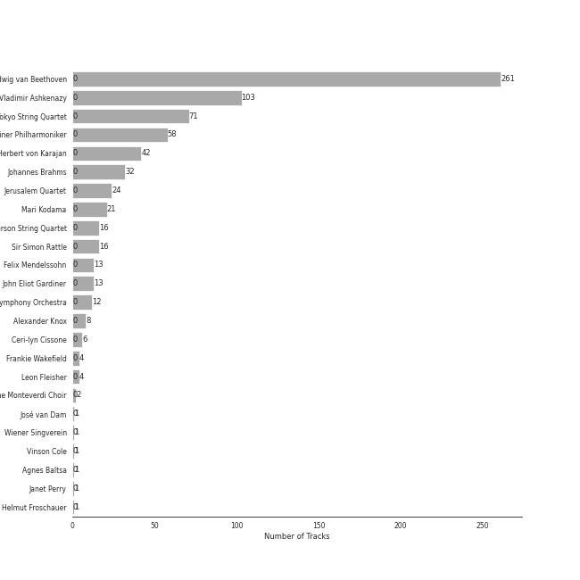
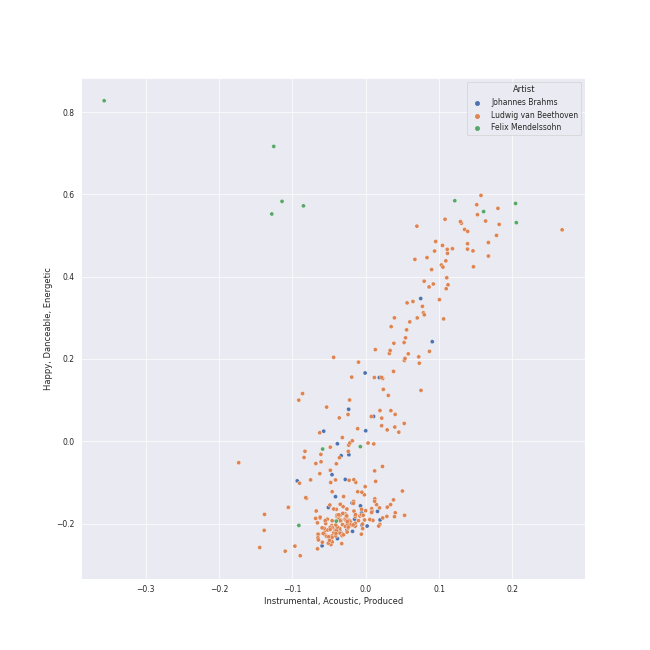
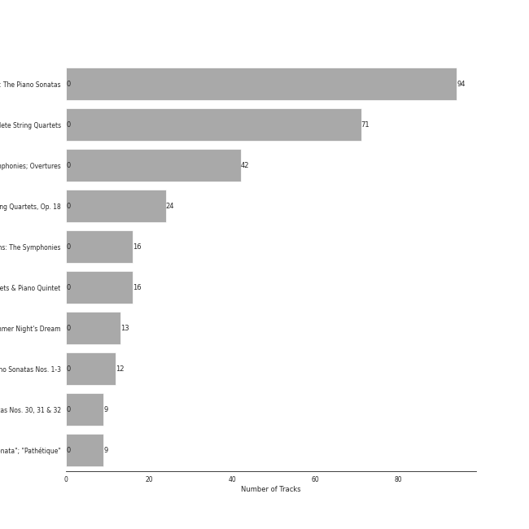

# german romanticism

[307 songs](german_romanticism_tracks.md)

## Top Artists

See all 26 artists

|   Number of Tracks | Art                                                                                              | Artist                                                                                   | 🔗                                                           |
|-------------------:|:-------------------------------------------------------------------------------------------------|:-----------------------------------------------------------------------------------------|:------------------------------------------------------------|
|                261 |  | [Ludwig van Beethoven](../artists/ludwig_van_beethoven.md)                               | [🔗](https://open.spotify.com/artist/2wOqMjp9TyABvtHdOSOTUS) |
|                103 |  | [Vladimir Ashkenazy](../artists/vladimir_ashkenazy.md)                                   | [🔗](https://open.spotify.com/artist/20iZXzMb8LoWXOeca32i82) |
|                 71 |  | [Tokyo String Quartet](../artists/tokyo_string_quartet.md)                               | [🔗](https://open.spotify.com/artist/15G9RnBNBDCFUMANna2CvO) |
|                 58 |  | [Berliner Philharmoniker](../artists/berliner_philharmoniker.md)                         | [🔗](https://open.spotify.com/artist/6uRJnvQ3f8whVnmeoecv5Z) |
|                 42 |  | [Herbert von Karajan](../artists/herbert_von_karajan.md)                                 | [🔗](https://open.spotify.com/artist/5zCaQxjl110XTrm4LQ1CxY) |
|                 32 |  | [Johannes Brahms](../artists/johannes_brahms.md)                                         | [🔗](https://open.spotify.com/artist/5wTAi7QkpP6kp8a54lmTOq) |
|                 24 |  | [Jerusalem Quartet](../artists/jerusalem_quartet.md)                                     | [🔗](https://open.spotify.com/artist/7AnE8Jpu1vxLeXcs6OKYHE) |
|                 21 |  | [Mari Kodama](../artists/mari_kodama.md)                                                 | [🔗](https://open.spotify.com/artist/0s0wG03kPyu7MXERfcuxim) |
|                 16 |  | [Emerson String Quartet](../artists/emerson_string_quartet.md)                           | [🔗](https://open.spotify.com/artist/4IBl8k6ZsBagsI5zRjyXH7) |
|                 16 |  | [Sir Simon Rattle](../artists/sir_simon_rattle.md)                                       | [🔗](https://open.spotify.com/artist/4GQwgdcDQwqtcHICjUNndp) |
|                 14 |  | [Felix Mendelssohn](../artists/felix_mendelssohn.md)                                     | [🔗](https://open.spotify.com/artist/6MF58APd3YV72Ln2eVg710) |
|                 13 |  | [John Eliot Gardiner](../artists/john_eliot_gardiner.md)                                 | [🔗](https://open.spotify.com/artist/1qIRoGEKXINqrCx5N1engi) |
|                 12 |  | [London Symphony Orchestra](../artists/london_symphony_orchestra.md)                     | [🔗](https://open.spotify.com/artist/5yxyJsFanEAuwSM5kOuZKc) |
|                  8 |                                                               | Alexander Knox                                                                           | [🔗](https://open.spotify.com/artist/4vzwv4zzBTlG8qsFCqP2Yv) |
|                  6 |                                                               | Ceri-lyn Cissone                                                                         | [🔗](https://open.spotify.com/artist/6F3jOFmhUwRxRdWAZU6G1A) |
|                  4 |                                                               | Frankie Wakefield                                                                        | [🔗](https://open.spotify.com/artist/7jobsaZIFhejECE605yxx6) |
|                  4 |  | Leon Fleisher                                                                            | [🔗](https://open.spotify.com/artist/6ncNdxBc8zVWMOF7nJ5Pgy) |
|                  2 |  | The Monteverdi Choir                                                                     | [🔗](https://open.spotify.com/artist/0Cqfz92flAzrp94pgN1jEW) |
|                  1 |  | [Academy of St. Martin in the Fields](../artists/academy_of_st__martin_in_the_fields.md) | [🔗](https://open.spotify.com/artist/77CaCn32H4mOMQA7UElzfF) |
|                  1 |  | [Sir Neville Marriner](../artists/sir_neville_marriner.md)                               | [🔗](https://open.spotify.com/artist/6NUhQz7eAEsZvjEHTKHux9) |
|                  1 |  | [José van Dam](../artists/jos__van_dam.md)                                               | [🔗](https://open.spotify.com/artist/5qNUHMEhszyeXNYMn4sswd) |
|                  1 |  | [Wiener Singverein](../artists/wiener_singverein.md)                                     | [🔗](https://open.spotify.com/artist/35QSympF887CO8h5eZHme2) |
|                  1 |  | Vinson Cole                                                                              | [🔗](https://open.spotify.com/artist/2j6cP3f3TxyHzcKdWYSm6h) |
|                  1 |  | [Agnes Baltsa](../artists/agnes_baltsa.md)                                               | [🔗](https://open.spotify.com/artist/2amF56vDuTTbZJQsqUgbuC) |
|                  1 |  | Janet Perry                                                                              | [🔗](https://open.spotify.com/artist/1bV3KjOPs1AI3OolJiYogN) |
|                  1 |  | Helmut Froschauer                                                                        | [🔗](https://open.spotify.com/artist/172Encqfd2ZhWAleNg1gbO) |

## Top Albums

See all 11 albums

|   Number of Tracks | Art                                                                                              | Album                                                              | 🔗                                                          |
|-------------------:|:-------------------------------------------------------------------------------------------------|:-------------------------------------------------------------------|:-----------------------------------------------------------|
|                 94 |  | Beethoven: The Piano Sonatas                                       | [🔗](https://open.spotify.com/album/7xbsSOswKgms1fUFuwKArz) |
|                 71 |  | Beethoven: Complete String Quartets                                | [🔗](https://open.spotify.com/album/4JhUG1lr4xztAcqyA0Jm3a) |
|                 42 |  | Beethoven: 9 Symphonies; Overtures                                 | [🔗](https://open.spotify.com/album/2DQTNTznsteIZciZdyeWdj) |
|                 24 |  | Beethoven: String Quartets, Op. 18                                 | [🔗](https://open.spotify.com/album/37iUq5Dekt8uP5itTiVs2Q) |
|                 16 |  | Brahms: The Symphonies                                             | [🔗](https://open.spotify.com/album/2dL2qDsg6teV1cueLxCRa1) |
|                 16 |  | Brahms: String Quartets & Piano Quintet                            | [🔗](https://open.spotify.com/album/5nZ5ePGoQZGt1MbGphwqph) |
|                 13 |  | Mendelssohn: A Midsummer Night's Dream                             | [🔗](https://open.spotify.com/album/60J66evwnrnfH03HgDTrwN) |
|                 12 |  | Beethoven: Piano Sonatas Nos. 1-3                                  | [🔗](https://open.spotify.com/album/5CjMjZJnjdHHgwAVkqrvXq) |
|                  9 |  | Beethoven: Piano Sonatas Nos. 30, 31 & 32                          | [🔗](https://open.spotify.com/album/478l1JdqbqDzcmmgrqw2zu) |
|                  9 |  | Beethoven: Piano Sonatas "Moonlight"; "Appassionata"; "Pathétique" | [🔗](https://open.spotify.com/album/0RCfE1YhkdrjnM3kXT3YLl) |
|                  1 |  | Mozart: Eine Kleine Nachtmusik etc.                                | [🔗](https://open.spotify.com/album/5YCuibCDJrkVcS3UOAYqr9) |

## Top Record Labels

See all 7 labels

|   Number of Tracks | Label                                                             |
|-------------------:|:------------------------------------------------------------------|
|                103 | [Decca Music Group Ltd.](../labels/decca_music_group_ltd_.md)     |
|                 95 | [harmonia mundi](../labels/harmonia_mundi.md)                     |
|                 58 | [Deutsche Grammophon (DG)](../labels/deutsche_grammophon__dg_.md) |
|                 21 | [PENTATONE](../labels/pentatone.md)                               |
|                 16 | [Warner Classics UK](../labels/warner_classics_uk.md)             |
|                 13 | [Lso Live](../labels/lso_live.md)                                 |
|                  1 | [Warner Classics](../labels/warner_classics.md)                   |

## Audio Features

| 10 most Danceable tracks                                                                       | 10 least Danceable tracks                                                                     |
|:-----------------------------------------------------------------------------------------------|:----------------------------------------------------------------------------------------------|
| A Midsummer Night's Dream, Incidental Music, Op. 61: "Ay Me! For Aught That I Could Ever Read" | String Quartet No. 16 in F Major, Op. 135: III. Lento assai, cantate e tranquillo - Più lento |
| Piano Sonata No. 12 in A flat, Op. 26: 3. Marcia funebre sulla morte d'un Eroe                 | Brahms: Symphony No. 1 in C Minor, Op. 68: III. Un poco allegretto e grazioso                 |
| String Quartet No. 2 in G Major, Op. 18, No. 2: IV. Allegro molto, quasi presto                | String Quartet No. 15 in A minor, Op. 132: III. Molto adagio                                  |
| Piano Sonata No. 2 in A, Op. 2 No. 2: 3. Scherzo (Allegretto)                                  | Brahms: Symphony No. 3 in F Major, Op. 90: III. Poco allegretto                               |
| A Midsummer Night's Dream, Incidental Music, Op. 61: No. 1, Scherzo                            | Symphony No. 6 In F, Op. 68 -"Pastoral": 2. Szene am Bach: (Andante molto mosso)              |
| Piano Sonata No. 14 in C-Sharp Minor, Op. 27 No. 2 "Moonlight": II. Allegretto                 | String Quartet No. 8 in E Minor, Op. 59 No. 2: II. Molto adagio                               |
| String Quartet No. 4 in C Minor, Op. 18, No. 4: II. Andante scherzoso quasi allegretto         | Symphony No. 3 In E Flat, Op. 55 -"Eroica": 2. Marcia funebre (Adagio assai)                  |
| String Quartet No. 2 in G Major, Op. 18, No. 2: III. Scherzo (Allegro) - Trio                  | Brahms: Symphony No. 1 in C Minor, Op. 68: II. Andante sostenuto                              |
| Piano Sonata No. 5 in C minor, Op. 10 No. 1: 2. Adagio molto                                   | Brahms: Symphony No. 2 in D Major, Op. 73: II. Adagio non troppo                              |
| A Midsummer Night's Dream, Incidental Music, Op. 61: No. 2, L'istesso tempo                    | Symphony No. 9 In D Minor, Op. 125 - "Choral": 3. Adagio molto e cantabile                    |

| 10 most Energetic tracks                                                           | 10 least Energetic tracks                                                           |
|:-----------------------------------------------------------------------------------|:------------------------------------------------------------------------------------|
| Symphony No. 7 In A, Op. 92: 4. Allegro con brio                                   | Piano Sonata No. 13 in E flat, Op. 27 No. 1: 3. Adagio con espressione              |
| Symphony No. 5 In C Minor, Op. 67: 4. Allegro                                      | Piano Sonata No. 3 in C, Op. 2 No. 3: 2. Adagio                                     |
| Symphony No. 9 In D Minor, Op. 125 - "Choral" / 4.: "O Freunde nicht diese Töne" - | Piano Sonata No. 25 in G, Op. 79: 2. Andante                                        |
| Piano Sonata No. 6 in F, Op. 10 No. 2: 3. Presto                                   | Piano Sonata No. 3 in C Major, Op. 2, No. 3: II. Adagio                             |
| Symphony No. 6 In F, Op. 68 -"Pastoral": 4. Gewitter, Sturm (Allegro)              | Piano Sonata No. 4 in E flat, Op. 7: 2. Largo, con gran espressione                 |
| Symphony No. 5 in C Minor, Op. 67: 1. Allegro con brio                             | Piano Sonata No. 2 in A, Op. 2 No. 2: 2. Largo appassionato                         |
| String Quartet No. 16 in F Major, Op. 135: II. Vivace                              | Piano Sonata No. 31 in A-Flat Major, Op. 110: III. Adagio ma non troppo -           |
| Brahms: Symphony No. 2 in D Major, Op. 73: IV. Allegro con spirito                 | Piano Sonata No. 14 in C-Sharp Minor, Op. 27 No. 2 "Moonlight": I. Adagio sostenuto |
| Piano Sonata No. 13 in E flat, Op. 27 No. 1: 4. Allegro vivace - Tempo I - Presto  | Piano Sonata No. 31 in A flat, Op. 110: 3. Adagio ma non troppo                     |
| Piano Sonata No. 23 in F Minor, Op. 57 "Appassionata": III. Allegro ma non troppo  | Piano Sonata No. 21 in C Major, Op. 53 "Waldstein": II. Introduzione (Adagio molto) |

| 10 most Speechy tracks                                                                               | 10 least Speechy tracks                                                   |
|:-----------------------------------------------------------------------------------------------------|:--------------------------------------------------------------------------|
| A Midsummer Night's Dream, Incidental Music, Op. 61: No. 2, L'istesso tempo                          | Piano Sonata No. 1 in F Minor, Op. 2, No. 1: IV. Prestissimo              |
| A Midsummer Night's Dream, Incidental Music, Op. 61: "Ay Me! For Aught That I Could Ever Read"       | Piano Sonata No. 1 in F minor, Op. 2 No. 1: 4. Prestissimo                |
| Piano Sonata No. 21 in C Major, Op. 53 "Waldstein": II. Introduzione (Adagio molto)                  | Brahms: Symphony No. 1 in C Minor, Op. 68: I. Un poco sostenuto - Allegro |
| Piano Sonata No. 19 in G minor, Op. 49 No. 1: 2. Rondo (Allegro)                                     | Piano Sonata No. 9 in E, Op. 14 No. 1: 3. Rondo (Allegro comodo)          |
| A Midsummer Night's Dream, Incidental Music, Op. 61: No. 2a, Allegro vivace                          | Piano Sonata No. 22 in F, Op. 54: 2. Allegretto                           |
| String Quartet No. 11 in F Minor, Op. 95 "Quartetto serioso": III. Allegro assai - Vivace ma serioso | Symphony No. 8 in F Major, Op. 93: III. Tempo di menuetto                 |
| A Midsummer Night's Dream, Incidental Music, Op. 61: No. 4, Andante                                  | Brahms: Symphony No. 2 in D Major, Op. 73: IV. Allegro con spirito        |
| Symphony No. 1 In C, Op. 21: 3. Menuetto (Allegro molto e vivace)                                    | Piano Sonata No. 12 in A flat, Op. 26: 4. Allegro                         |
| Piano Sonata No. 12 in A flat, Op. 26: 3. Marcia funebre sulla morte d'un Eroe                       | Piano Sonata No. 25 in G, Op. 79: 3. Vivace                               |
| Symphony No. 9 In D Minor, Op. 125 - "Choral" / 4.: "O Freunde nicht diese Töne" -                   | A Midsummer Night's Dream, Incidental Music, Op. 61: No. 1, Scherzo       |

| 10 most Acoustic tracks                                                        | 10 least Acoustic tracks                                                                       |
|:-------------------------------------------------------------------------------|:-----------------------------------------------------------------------------------------------|
| Piano Sonata No. 9 in E, Op. 14 No. 1: 2. Allegretto                           | String Quartet No. 3 In B Flat, Op. 67: 2. Andante                                             |
| Piano Sonata No. 19 in G minor, Op. 49 No. 1: 1. Andante                       | String Quartet No. 16 in F Major, Op. 135: III. Lento assai, cantate e tranquillo - Più lento  |
| Piano Sonata No. 25 in G, Op. 79: 2. Andante                                   | String Quartet No. 15 in A minor, Op. 132: III. Molto adagio                                   |
| Piano Sonata No. 1 in F Minor, Op. 2, No. 1: III. Menuetto: Allegretto         | Symphony No. 7 In A, Op. 92: 4. Allegro con brio                                               |
| Piano Sonata No. 19 in G minor, Op. 49 No. 1: 2. Rondo (Allegro)               | Symphony No. 6 In F, Op. 68 -"Pastoral": 4. Gewitter, Sturm (Allegro)                          |
| Piano Sonata No. 31 in A-Flat Major, Op. 110: III. Adagio ma non troppo -      | A Midsummer Night's Dream, Incidental Music, Op. 61: No. 4, Andante                            |
| Piano Sonata No. 14 in C-Sharp Minor, Op. 27 No. 2 "Moonlight": II. Allegretto | A Midsummer Night's Dream, Incidental Music, Op. 61: No. 2a, Allegro vivace                    |
| Piano Sonata No. 1 in F minor, Op. 2 No. 1: 3. Menuetto (Allegretto)           | A Midsummer Night's Dream, Incidental Music, Op. 61: No. 8, Andante                            |
| Piano Sonata No. 20 in G, Op. 49 No. 2: 2. Tempo di Menuetto                   | A Midsummer Night's Dream, Incidental Music, Op. 61: No. 2, L'istesso tempo                    |
| Piano Sonata No. 2 in A Major, Op. 2, No. 2: III. Scherzo: Allegretto - Trio   | A Midsummer Night's Dream, Incidental Music, Op. 61: "Ay Me! For Aught That I Could Ever Read" |

| 10 most Instrumental tracks                                                                             | 10 least Instrumental tracks                                                                   |
|:--------------------------------------------------------------------------------------------------------|:-----------------------------------------------------------------------------------------------|
| String Quartet No. 14 in C-Sharp Minor, Op. 131: VI. Adagio quasi un poco andante                       | String Quartet No. 2 in G Major, Op. 18, No. 2: I. Allegro                                     |
| A Midsummer Night's Dream, Incidental Music, Op. 61: No. 1, Scherzo                                     | A Midsummer Night's Dream, Incidental Music, Op. 61: No. 5, Allegro appassionato               |
| Piano Sonata No. 31 in A-Flat Major, Op. 110: II. Allegro molto                                         | String Quartet No. 6 in B-Flat Major, Op. 18 No. 6: II. Adagio ma non troppo                   |
| Piano Sonata No. 30 in E Major, Op. 109: I. Vivace ma non troppo                                        | A Midsummer Night's Dream, Incidental Music, Op. 61: No. 3, Lied mit Chor                      |
| Piano Sonata No. 2 in A Major, Op. 2, No. 2: II. Largo appassionato                                     | A Midsummer Night's Dream, Incidental Music, Op. 61: No. 2a, Allegro vivace                    |
| Piano Sonata No. 9 in E, Op. 14 No. 1: 2. Allegretto                                                    | A Midsummer Night's Dream, Incidental Music, Op. 61: Finale. Allegro di molto                  |
| Piano Sonata No. 25 in G, Op. 79: 2. Andante                                                            | A Midsummer Night's Dream, Incidental Music, Op. 61: No. 2, L'istesso tempo                    |
| Piano Sonata No. 24 in F-Sharp Major, Op. 78 "For Therese": 1. Adagio cantabile - Allegro ma non troppo | A Midsummer Night's Dream, Incidental Music, Op. 61: No. 8, Andante                            |
| Piano Sonata No. 5 in C minor, Op. 10 No. 1: 3. Finale (Prestissimo)                                    | A Midsummer Night's Dream, Incidental Music, Op. 61: No. 4, Andante                            |
| Piano Sonata No. 26 in E-Flat Major, Op. 81a "Les Adieux": II. Abwesendheit (Andante espressivo)        | A Midsummer Night's Dream, Incidental Music, Op. 61: "Ay Me! For Aught That I Could Ever Read" |

| 10 most Live tracks                                                                              | 10 least Live tracks                                                                      |
|:-------------------------------------------------------------------------------------------------|:------------------------------------------------------------------------------------------|
| A Midsummer Night's Dream, Incidental Music, Op. 61: No. 4, Andante                              | Piano Sonata No. 3 in C, Op. 2 No. 3: 4. Allegro assai                                    |
| String Quartet No. 2 in G Major, Op. 18, No. 2: III. Scherzo (Allegro) - Trio                    | String Quartet No. 8 in E Minor, Op. 59 No. 2: I. Allegro                                 |
| Symphony No. 5 In C Minor, Op. 67: 3. Allegro                                                    | A Midsummer Night's Dream, Incidental Music, Op. 61: No. 3, Lied mit Chor                 |
| A Midsummer Night's Dream, Incidental Music, Op. 61: No. 2a, Allegro vivace                      | Piano Sonata No. 31 in A flat, Op. 110: 1. Moderato cantabile molto espressivo            |
| Symphony No. 9 In D Minor, Op. 125 - "Choral" - Excerpt From 4th Movement: 4. Presto             | Piano Sonata No. 8 in C Minor, Op. 13 "Pathétique": III. Rondo (Allegro)                  |
| String Quartet No. 10 in E-Flat Major, Op. 74 "Harp": III. Presto - Più presto quasi prestissimo | Piano Quintet in F minor, Op. 34: 4. Finale (poco sostenuto - Allegro non troppo)         |
| A Midsummer Night's Dream, Incidental Music, Op. 61: No. 8, Andante                              | Symphony No. 1 In C, Op. 21: 3. Menuetto (Allegro molto e vivace)                         |
| String Quartet No. 13 in B-Flat Major, Op. 130: I. Adagio ma non troppo – Allegro                | Piano Sonata No. 32 in C minor, Op. 111: 2. Arietta (Adagio molto semplice e cantabile)   |
| String Quartet No. 3 in D Major, Op. 18: III. Allegro                                            | String Quartet No. 3 in D Major, Op. 18: I. Allegro                                       |
| Symphony No. 8 in F Major, Op. 93: I. Allegro vivace e con brio                                  | String Quartet No. 2 In A Minor, Op. 51 No. 2: 4. Finale (Allegro non assai - Più vivace) |

| 10 most Happy tracks                                                              | 10 least Happy tracks                                                                         |
|:----------------------------------------------------------------------------------|:----------------------------------------------------------------------------------------------|
| Piano Sonata No. 6 in F, Op. 10 No. 2: 3. Presto                                  | Brahms: Symphony No. 4 in E Minor, Op. 98: II. Andante moderato                               |
| Piano Sonata No. 25 in G, Op. 79: 3. Vivace                                       | Piano Sonata No. 31 in A flat, Op. 110: 3. Adagio ma non troppo                               |
| String Quartet No. 6 in B-Flat Major, Op. 18 No. 6: III. Scherzo (Allegro) - Trio | Symphony No. 3 In E Flat, Op. 55 -"Eroica": 2. Marcia funebre (Adagio assai)                  |
| String Quartet No. 6 in B-Flat Major, Op. 18 No. 6: III. Scherzo (Allegro) - Trio | Brahms: Symphony No. 1 in C Minor, Op. 68: II. Andante sostenuto                              |
| Piano Sonata No. 12 in A flat, Op. 26: 4. Allegro                                 | Piano Sonata No. 29 in B flat, Op. 106 -"Hammerklavier": 3. Adagio sostenuto                  |
| Piano Sonata No. 31 in A-Flat Major, Op. 110: II. Allegro molto                   | Piano Sonata No. 31 in A-Flat Major, Op. 110: III. Adagio ma non troppo -                     |
| A Midsummer Night's Dream, Incidental Music, Op. 61: No. 1, Scherzo               | Brahms: Symphony No. 2 in D Major, Op. 73: II. Adagio non troppo                              |
| String Quartet No. 16 in F Major, Op. 135: II. Vivace                             | A Midsummer Night's Dream, Incidental Music, Op. 61: No. 7, Nocturne. Con moto tranquillo     |
| Piano Sonata No. 3 in C, Op. 2 No. 3: 3. Scherzo (Allegro)                        | String Quartet No. 16 in F Major, Op. 135: III. Lento assai, cantate e tranquillo - Più lento |
| Piano Sonata No. 3 in C Major, Op. 2, No. 3: III. Scherzo: Allegro - Trio         | Brahms: Symphony No. 3 in F Major, Op. 90: II. Andante                                        |
